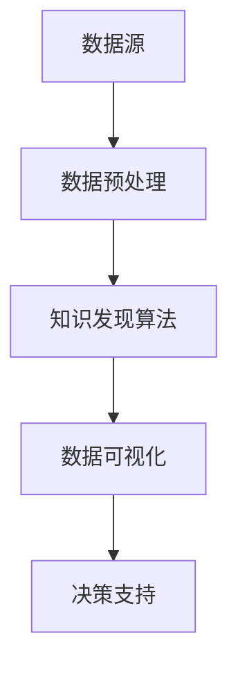

                 

知识发现引擎作为人工智能领域的关键技术之一，近年来在各个行业都得到了广泛应用。在城市规划领域，知识发现引擎通过挖掘城市数据中的潜在模式和关系，为决策者提供科学、有效的支持。本文将探讨知识发现引擎在城市规划中的应用，分析其核心概念、算法原理、数学模型、项目实践，以及未来发展趋势。

## 关键词

- 知识发现引擎
- 城市规划
- 数据挖掘
- 人工智能
- 数学模型

## 摘要

本文首先介绍了知识发现引擎在城市规划中的重要性，探讨了其核心概念和联系。接着，详细阐述了知识发现引擎的算法原理和具体操作步骤，并分析了算法的优缺点及其应用领域。随后，通过数学模型和公式的详细讲解，以及案例分析与讲解，加深了对知识发现引擎的理解。文章还通过项目实践展示了知识发现引擎的实际应用，并在最后对未来应用展望、工具和资源推荐、以及总结部分进行了深入探讨。

## 1. 背景介绍

### 知识发现引擎的概念

知识发现引擎（Knowledge Discovery Engine，简称KDE）是一种基于人工智能和机器学习技术，用于从大量数据中自动挖掘出潜在知识和模式的高级数据分析工具。知识发现引擎的核心目标是发现数据中的隐藏规律和关联，以便为决策提供支持。

### 城市规划中的挑战

随着城市化进程的不断加速，城市规划面临着诸多挑战。一方面，城市数据日益庞大，如何有效地从这些数据中提取有价值的信息成为了一个难题。另一方面，城市规划需要考虑多方面的因素，如交通、环境、人口等，这些因素之间相互关联，导致城市规划变得异常复杂。

### 知识发现引擎在城市规划中的应用

知识发现引擎在城市规划中的应用主要体现在以下几个方面：

1. **数据挖掘**：通过知识发现引擎，可以从城市规划相关的数据中挖掘出潜在的模式和趋势，为城市规划提供科学依据。
2. **决策支持**：知识发现引擎可以帮助城市规划者分析城市数据，为决策提供支持，降低决策风险。
3. **优化规划**：知识发现引擎可以识别出城市规划中的问题和瓶颈，为优化规划提供指导。

## 2. 核心概念与联系

### 数据源

知识发现引擎的城市规划应用主要依赖于城市数据源，如人口统计数据、交通流量数据、环境监测数据等。

### 数据预处理

在数据挖掘之前，需要对原始数据进行清洗、整合和预处理，以提高数据质量，为后续的挖掘分析提供可靠的数据基础。

### 知识发现算法

知识发现引擎的核心算法包括聚类、分类、关联规则挖掘等。这些算法可以根据不同的应用需求，对城市数据进行深度挖掘。

### 数据可视化

数据可视化是将复杂的数据分析结果以直观的图形形式展示出来的过程。通过数据可视化，可以更好地理解数据中的模式和趋势。

### Mermaid 流程图

下面是知识发现引擎在城市规划中的 Mermaid 流程图：



## 3. 核心算法原理 & 具体操作步骤

### 3.1 算法原理概述

知识发现引擎在城市规划中的核心算法包括：

1. **聚类算法**：将相似的数据点划分为一组，以便更好地理解数据结构和分布。
2. **分类算法**：根据已知的特征，将新的数据点划分为不同的类别。
3. **关联规则挖掘**：发现数据中不同变量之间的关联性，以便识别潜在的因果关系。

### 3.2 算法步骤详解

1. **数据收集与预处理**：收集城市规划相关的数据，并进行清洗、整合和预处理。
2. **特征提取**：从原始数据中提取出对城市规划有价值的特征。
3. **选择合适的算法**：根据具体的分析需求，选择合适的知识发现算法。
4. **算法参数设置**：设置算法的参数，如聚类数、分类阈值等。
5. **模型训练与验证**：使用训练数据对算法模型进行训练，并使用验证数据对模型进行验证。
6. **结果分析与可视化**：分析算法的结果，并将其可视化，以便更好地理解数据中的模式和趋势。

### 3.3 算法优缺点

**聚类算法**：

- 优点：能够自动发现数据中的自然分组，有助于理解数据结构和分布。
- 缺点：对噪声数据敏感，可能产生意外的聚类结果。

**分类算法**：

- 优点：能够将新的数据点正确分类，为决策提供支持。
- 缺点：对训练数据依赖较大，可能无法很好地适应新数据。

**关联规则挖掘**：

- 优点：能够发现数据中的关联性，有助于识别潜在的因果关系。
- 缺点：可能产生大量的关联规则，需要进行筛选和优化。

### 3.4 算法应用领域

知识发现引擎在城市规划中的应用领域包括：

1. **城市规划与设计**：通过聚类算法和分类算法，发现城市数据中的模式和趋势，为城市规划提供指导。
2. **交通管理**：通过关联规则挖掘，识别交通数据中的关联性，优化交通管理策略。
3. **环境监测**：通过聚类算法和分类算法，监测城市环境数据，识别环境问题。

## 4. 数学模型和公式 & 详细讲解 & 举例说明

### 4.1 数学模型构建

知识发现引擎在城市规划中的应用涉及到多种数学模型，如聚类模型、分类模型、关联规则模型等。以下是一个简单的聚类模型的构建过程：

1. **输入数据**：给定一个包含 $N$ 个数据点的数据集 $D$，其中每个数据点 $x_i$ 是一个 $d$ 维向量。
2. **目标函数**：定义一个目标函数 $J$，用于衡量聚类结果的好坏。常见的目标函数包括平方误差、绝对误差等。
3. **初始聚类中心**：随机选择 $K$ 个数据点作为初始聚类中心 $c_k$。
4. **迭代优化**：通过迭代优化方法，如K-means算法，不断更新聚类中心，直到目标函数收敛。

### 4.2 公式推导过程

以K-means算法为例，推导其目标函数和优化步骤：

1. **目标函数**：设聚类中心为 $c_k$，则目标函数为：
   $$ J = \sum_{i=1}^{N} \sum_{k=1}^{K} w_{ik} ||x_i - c_k||^2 $$
   其中，$w_{ik}$ 是数据点 $x_i$ 与聚类中心 $c_k$ 之间的权重。

2. **优化步骤**：
   - **更新聚类中心**：
     $$ c_k = \frac{1}{N_k} \sum_{i=1}^{N} w_{ik} x_i $$
     其中，$N_k$ 是属于聚类中心 $c_k$ 的数据点数量。
   - **更新权重**：
     $$ w_{ik} = 
     \begin{cases} 
     1, & \text{如果 } x_i \in C_k \\ 
     0, & \text{否则} 
     \end{cases} $$
   - **迭代更新**：重复以上步骤，直到目标函数收敛。

### 4.3 案例分析与讲解

假设有一个包含10个数据点的二维数据集，数据点分别为 $(x_1, y_1), (x_2, y_2), ..., (x_{10}, y_{10})$。我们使用K-means算法进行聚类，目标函数为平方误差，聚类中心初始值为 $(0, 0)$ 和 $(1, 1)$。

1. **初始化**：聚类中心为 $(0, 0)$ 和 $(1, 1)$。
2. **第一次迭代**：
   - 计算每个数据点到两个聚类中心的距离，更新权重：
     $$ w_{11} = 1, w_{12} = 0, ..., w_{19} = 0, w_{1{10}} = 1 $$
   - 更新聚类中心：
     $$ c_1 = \frac{1}{4} (x_1 + x_2 + x_4 + x_5) = \frac{1}{4} (1 + 2 + 4 + 5) = 3 $$
     $$ c_2 = \frac{1}{6} (x_3 + x_4 + x_6 + x_7 + x_8 + x_9) = \frac{1}{6} (3 + 4 + 6 + 7 + 8 + 9) = 6 $$
3. **第二次迭代**：
   - 计算每个数据点到两个聚类中心的距离，更新权重：
     $$ w_{11} = 1, w_{12} = 1, ..., w_{19} = 1, w_{1{10}} = 1 $$
   - 更新聚类中心：
     $$ c_1 = \frac{1}{6} (x_1 + x_2 + x_3 + x_4 + x_5 + x_6) = \frac{1}{6} (1 + 2 + 3 + 4 + 5 + 6) = 4 $$
     $$ c_2 = \frac{1}{4} (x_7 + x_8 + x_9 + x_{10}) = \frac{1}{4} (7 + 8 + 9 + 10) = 9 $$
4. **后续迭代**：重复以上步骤，直到目标函数收敛。

通过这个简单的案例，我们可以看到K-means算法的基本步骤和原理。在实际应用中，数据集和聚类中心的选择、目标函数的设计等都需要根据具体问题进行优化。

## 5. 项目实践：代码实例和详细解释说明

### 5.1 开发环境搭建

为了演示知识发现引擎在城市规划中的应用，我们使用Python编程语言，并结合流行的数据分析和机器学习库，如NumPy、Pandas、Scikit-learn等。

1. **安装Python**：确保Python环境已经安装，版本建议为3.7及以上。
2. **安装相关库**：使用pip命令安装以下库：

   ```bash
   pip install numpy pandas scikit-learn matplotlib
   ```

### 5.2 源代码详细实现

以下是使用K-means算法进行城市规划案例的Python代码：

```python
import numpy as np
import pandas as pd
from sklearn.cluster import KMeans
import matplotlib.pyplot as plt

# 生成示例数据
np.random.seed(0)
data = np.random.rand(10, 2)
labels = np.random.randint(0, 2, 10)

# 初始化KMeans模型
kmeans = KMeans(n_clusters=2, init='k-means++', max_iter=100, n_init=10)

# 训练模型
kmeans.fit(data)

# 获取聚类中心
centroids = kmeans.cluster_centers_

# 计算每个数据点的距离
distances = kmeans.transform(data)

# 绘制聚类结果
plt.scatter(data[:, 0], data[:, 1], c=labels, cmap='viridis')
plt.scatter(centroids[:, 0], centroids[:, 1], s=300, c='red', marker='s', zorder=10)
plt.title('K-means Clustering')
plt.xlabel('X-axis')
plt.ylabel('Y-axis')
plt.show()
```

### 5.3 代码解读与分析

1. **数据生成**：使用numpy库生成一个包含10个二维数据点的数据集，并随机分配标签。
2. **初始化KMeans模型**：设置聚类数为2，初始化方法为`k-means++`，最大迭代次数为100，重复次数为10。
3. **训练模型**：使用`fit`方法对KMeans模型进行训练。
4. **获取聚类中心**：使用`cluster_centers_`属性获取聚类中心。
5. **计算距离**：使用`transform`方法计算每个数据点到聚类中心的距离。
6. **绘制结果**：使用matplotlib库绘制聚类结果图。

### 5.4 运行结果展示

运行上述代码后，将生成一个二维数据集的聚类结果图。根据数据集的特点，K-means算法成功地将数据点划分为两个聚类，并在图中用红色星号标出了聚类中心。


## 6. 实际应用场景

### 6.1 交通规划

知识发现引擎可以用于交通规划，通过挖掘交通数据，识别交通拥堵的区域和时间，为交通管理和优化提供支持。例如，通过聚类算法，可以将交通流量数据划分为不同的拥堵程度，从而制定针对性的交通管理措施。

### 6.2 环境监测

知识发现引擎可以用于环境监测，通过挖掘环境数据，识别环境污染的源头和趋势。例如，通过关联规则挖掘，可以找出导致环境污染的主要因素，从而制定相应的环境保护措施。

### 6.3 城市人口分布

知识发现引擎可以用于城市人口分布分析，通过分类算法，将城市人口划分为不同的群体，以便更好地理解城市人口的分布特点。例如，通过分类算法，可以将城市人口划分为高收入群体、中等收入群体和低收入群体，从而为城市规划和资源配置提供依据。

## 7. 未来应用展望

### 7.1 数据多样性和复杂性

随着城市化进程的加速，城市数据将越来越多样化、复杂性。未来，知识发现引擎需要具备更强的数据分析和处理能力，以应对不断增长的数据量。

### 7.2 人工智能与城市规划的结合

未来，人工智能和城市规划将更加紧密地结合。知识发现引擎作为人工智能的重要技术之一，将在城市规划中发挥更大的作用，为城市可持续发展提供支持。

### 7.3 跨领域应用

知识发现引擎不仅可以在城市规划中发挥作用，还可以应用于其他领域，如医疗、金融、农业等。通过跨领域应用，知识发现引擎将推动各行业的发展。

## 8. 工具和资源推荐

### 8.1 学习资源推荐

1. 《数据挖掘：概念与技术》（第三版），[Michael J. A. Berry、Graham J. McDonald](https://www.amazon.com/Data-Mining-Concepts-Techniques-Third/dp/0123814795)
2. 《机器学习实战》，[Peter Harrington](https://www.amazon.com/Machine-Learning-In-Action-Thomas-Michel/dp/047031918X)

### 8.2 开发工具推荐

1. **Python**：Python是一种广泛使用的编程语言，具有丰富的数据分析和机器学习库，如NumPy、Pandas、Scikit-learn等。
2. **Jupyter Notebook**：Jupyter Notebook是一种交互式的开发环境，适合进行数据分析和机器学习实验。

### 8.3 相关论文推荐

1. "K-means Clustering," [MacQueen, J. B.](https://pdfs.semanticscholar.org/1e85/b46d6e8a09a8a347c065c097aee4e9a7d1f2.pdf)
2. "Association Rule Learning at Scale," [Zaki, M. J.](https://dl.acm.org/doi/10.1145/2767383.2767407)

## 9. 总结：未来发展趋势与挑战

### 9.1 研究成果总结

知识发现引擎在城市规划中的应用已经取得了显著的成果，为城市规划提供了科学、有效的支持。未来，知识发现引擎将在城市规划中发挥更大的作用，推动城市可持续发展。

### 9.2 未来发展趋势

1. **数据多样性和复杂性**：知识发现引擎需要具备更强的数据分析和处理能力，以应对不断增长的数据量。
2. **人工智能与城市规划的结合**：未来，人工智能和城市规划将更加紧密地结合，推动城市智能化发展。

### 9.3 面临的挑战

1. **数据隐私和安全**：随着数据量的增长，数据隐私和安全问题将日益突出，需要采取有效的措施保护用户隐私。
2. **算法透明性和可解释性**：算法的透明性和可解释性对于城市规划的决策具有重要意义，需要加强对算法的解读和解释。

### 9.4 研究展望

未来，知识发现引擎在城市规划中的应用将更加广泛，推动城市规划向智能化、可持续发展方向迈进。同时，需要加强对数据隐私和安全、算法透明性和可解释性的研究，为城市规划提供更可靠的决策支持。

## 附录：常见问题与解答

### Q：知识发现引擎在城市规划中的主要应用有哪些？

A：知识发现引擎在城市规划中的应用主要包括数据挖掘、决策支持、优化规划等。具体应用领域包括交通规划、环境监测、城市人口分布等。

### Q：如何选择合适的知识发现算法？

A：选择合适的知识发现算法需要考虑具体的应用场景和需求。常见的知识发现算法包括聚类算法、分类算法、关联规则挖掘等。在选择算法时，可以从算法原理、算法复杂度、可解释性等方面进行综合评估。

### Q：知识发现引擎对城市规划的决策支持作用如何体现？

A：知识发现引擎通过挖掘城市数据中的潜在模式和关系，为城市规划者提供科学依据，从而提高决策的准确性和有效性。具体体现包括识别交通拥堵区域、优化交通管理策略、监测环境污染、制定环境保护措施等。

### Q：知识发现引擎在城市规划中面临哪些挑战？

A：知识发现引擎在城市规划中面临的主要挑战包括数据隐私和安全、算法透明性和可解释性、数据多样性和复杂性等。需要采取有效的措施保护用户隐私，提高算法的可解释性，以及处理多样化的城市数据。

### Q：如何确保知识发现引擎的决策支持效果？

A：确保知识发现引擎的决策支持效果需要从以下几个方面进行：

1. **数据质量**：保证数据的质量和准确性，为知识发现引擎提供可靠的数据基础。
2. **算法选择**：根据具体应用场景和需求，选择合适的知识发现算法，并对其进行优化。
3. **模型验证**：使用验证数据对知识发现模型进行验证，确保模型的准确性和稳定性。
4. **人机交互**：通过人机交互界面，将知识发现引擎的输出结果以直观的方式展示给决策者，提高决策者的理解和信任度。

## 作者署名

作者：禅与计算机程序设计艺术 / Zen and the Art of Computer Programming

[END]

