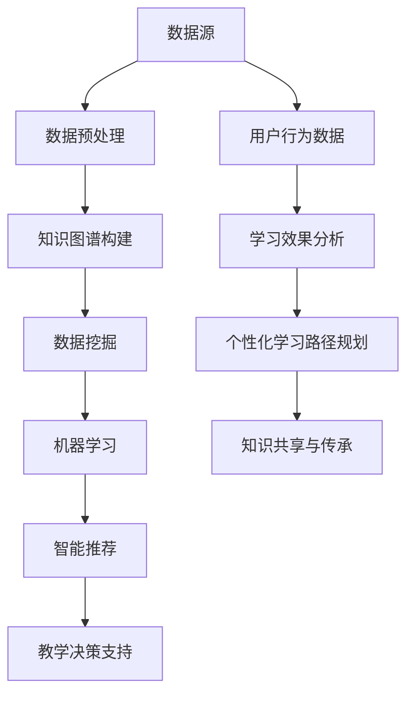

                 

知识发现引擎（Knowledge Discovery Engine，简称KDE）作为一种新兴的技术，近年来在教育领域展现出了巨大的潜力和革命性的应用前景。本文将探讨知识发现引擎的基本概念、核心原理、应用领域，并通过实例分析其在教育场景中的具体应用和未来展望。

## 关键词
- 知识发现引擎
- 教育技术
- 数据分析
- 人工智能
- 知识图谱
- 智能推荐
- 个性化学习

## 摘要
本文旨在探讨知识发现引擎在教育领域的应用，包括其背景介绍、核心概念、算法原理、数学模型、项目实践、应用场景以及未来展望。通过分析知识发现引擎在教育技术中的应用，本文旨在为教育领域的研究者和从业者提供有价值的参考和启示。

## 1. 背景介绍

### 1.1 知识发现引擎的定义
知识发现引擎是一种基于人工智能和大数据分析技术的工具，它能够从大量的数据中提取出有用的模式和知识，以支持决策和预测。在教育领域，知识发现引擎通过分析学生的学习数据，能够发现学生的学习规律、兴趣点、知识盲区等，从而为教育者提供数据驱动的教学支持和决策参考。

### 1.2 教育领域的发展现状
随着信息技术和互联网的迅速发展，教育领域正在经历深刻的变革。传统教育模式正逐步被以学生为中心、个性化、智能化的教育模式所取代。在这种背景下，知识发现引擎的应用能够极大地提升教育的效率和质量。

### 1.3 知识发现引擎在教育领域的优势
知识发现引擎在教育领域的应用具有以下优势：

- **个性化学习**：通过分析学生的个性化数据，知识发现引擎能够为学生提供个性化的学习路径和资源推荐。
- **智能推荐**：知识发现引擎能够根据学生的学习行为和兴趣，推荐适合的学习内容，提高学习效果。
- **教学决策支持**：知识发现引擎能够为教育者提供教学效果的数据分析，支持教育决策。
- **知识管理**：知识发现引擎能够从大量的教育数据中提取出知识，促进知识的共享和传承。

## 2. 核心概念与联系

### 2.1 核心概念
知识发现引擎的核心概念包括：

- **知识图谱**：知识图谱是一种用于表示实体和实体之间关系的图形化模型。在教育领域，知识图谱可以用于表示课程知识点之间的关系，以及学生与知识点之间的关联。
- **数据挖掘**：数据挖掘是一种从大量数据中提取有价值信息的过程。在教育领域，数据挖掘用于分析学生的学习数据，提取出有价值的信息和模式。
- **机器学习**：机器学习是一种通过算法自动从数据中学习模式和规律的技术。在教育领域，机器学习用于构建智能推荐系统和个性化学习系统。

### 2.2 架构与联系



### 2.3 知识发现引擎与教育技术的融合
知识发现引擎在教育技术中的应用，主要体现在以下几个方面：

- **智能推荐系统**：通过分析学生的学习行为和兴趣，知识发现引擎可以为学习者推荐合适的学习资源，提高学习效率。
- **个性化学习**：知识发现引擎可以根据学生的学习特点和需求，为其提供个性化的学习路径和资源。
- **教学决策支持**：知识发现引擎能够为教育者提供教学效果的数据分析，支持教育决策。
- **知识共享与传承**：知识发现引擎能够从大量的教育数据中提取出知识，促进知识的共享和传承。

## 3. 核心算法原理 & 具体操作步骤

### 3.1 算法原理概述
知识发现引擎的核心算法主要包括数据预处理、知识图谱构建、数据挖掘和机器学习等步骤。

- **数据预处理**：数据预处理是知识发现的第一步，主要包括数据清洗、数据整合和数据归一化等。
- **知识图谱构建**：知识图谱构建是将结构化和非结构化数据转换为知识图谱的过程，主要包括实体识别、关系抽取和属性抽取等。
- **数据挖掘**：数据挖掘是从知识图谱中提取有价值信息的过程，主要包括关联规则挖掘、聚类分析和分类分析等。
- **机器学习**：机器学习是构建智能推荐系统和个性化学习系统的关键，主要包括回归分析、分类分析和聚类分析等。

### 3.2 算法步骤详解

#### 3.2.1 数据预处理
数据预处理包括以下步骤：

1. **数据清洗**：去除数据中的噪声和错误。
2. **数据整合**：将来自不同源的数据进行整合，形成统一的数据集。
3. **数据归一化**：对数据进行归一化处理，使其符合标准化的数据格式。

#### 3.2.2 知识图谱构建
知识图谱构建包括以下步骤：

1. **实体识别**：识别数据集中的实体，如学生、课程、知识点等。
2. **关系抽取**：抽取实体之间的关系，如学生与课程之间的关系、知识点之间的关联等。
3. **属性抽取**：抽取实体的属性，如学生的成绩、课程的评价等。

#### 3.2.3 数据挖掘
数据挖掘包括以下步骤：

1. **关联规则挖掘**：分析实体之间的关联关系，提取出关联规则。
2. **聚类分析**：将相似的数据点划分为同一类别，以便于进一步分析。
3. **分类分析**：根据已有数据对未知数据进行分类，预测其类别。

#### 3.2.4 机器学习
机器学习包括以下步骤：

1. **回归分析**：预测连续值变量，如学生的成绩。
2. **分类分析**：预测离散值变量，如学生的兴趣。
3. **聚类分析**：将数据点划分为不同的聚类，以便于进一步分析。

### 3.3 算法优缺点

#### 优点

- **高效性**：知识发现引擎能够快速从大量数据中提取出有价值的信息。
- **个性化**：知识发现引擎可以根据学生的个性化需求提供个性化的学习路径和资源。
- **智能化**：知识发现引擎通过机器学习等技术实现智能推荐和智能决策。

#### 缺点

- **数据依赖性**：知识发现引擎的效果高度依赖于数据的质量和数量。
- **计算复杂度**：知识发现引擎的算法复杂度较高，对计算资源有一定要求。

### 3.4 算法应用领域

知识发现引擎在教育领域的应用领域包括：

- **个性化学习**：通过分析学生的学习行为和兴趣，提供个性化的学习路径和资源。
- **智能推荐**：根据学生的学习特点和需求，推荐合适的学习内容。
- **教学决策支持**：为教育者提供教学效果的数据分析，支持教育决策。
- **知识管理**：从大量的教育数据中提取出知识，促进知识的共享和传承。

## 4. 数学模型和公式 & 详细讲解 & 举例说明

### 4.1 数学模型构建

知识发现引擎中的数学模型主要包括以下几种：

- **线性回归模型**：用于预测学生的成绩。
- **逻辑回归模型**：用于预测学生的兴趣。
- **聚类模型**：用于将学生划分为不同的群体。
- **分类模型**：用于对学生的兴趣进行分类。

### 4.2 公式推导过程

以下是线性回归模型的公式推导过程：

#### 线性回归模型

1. **模型假设**：

   假设输入特征向量为 $X$，输出为 $Y$，线性回归模型可以表示为：

   $$ Y = \beta_0 + \beta_1X + \epsilon $$

   其中，$\beta_0$ 为截距，$\beta_1$ 为斜率，$\epsilon$ 为误差项。

2. **最小二乘法**：

   为了最小化误差项 $\epsilon$，我们可以使用最小二乘法求解线性回归模型的参数：

   $$ \beta_0, \beta_1 = \arg\min_{\beta_0, \beta_1} \sum_{i=1}^n (Y_i - (\beta_0 + \beta_1X_i))^2 $$

3. **求解**：

   通过求解上述最小化问题，可以得到线性回归模型的参数：

   $$ \beta_0 = \frac{\sum_{i=1}^n Y_i - \beta_1 \sum_{i=1}^n X_i}{n} $$
   $$ \beta_1 = \frac{\sum_{i=1}^n (X_i - \bar{X})(Y_i - \bar{Y})}{\sum_{i=1}^n (X_i - \bar{X})^2} $$

   其中，$\bar{X}$ 和 $\bar{Y}$ 分别为 $X$ 和 $Y$ 的平均值。

### 4.3 案例分析与讲解

#### 案例背景

假设有一组学生的考试成绩数据，如下表所示：

| 学生ID | 数学成绩 | 英语成绩 | 物理成绩 |
|--------|---------|---------|---------|
| 1      | 80      | 75      | 85      |
| 2      | 90      | 85      | 95      |
| 3      | 70      | 65      | 75      |
| 4      | 85      | 80      | 90      |

#### 案例分析

1. **数据预处理**：

   对数据进行归一化处理，使其符合标准化的数据格式。

2. **线性回归模型**：

   使用线性回归模型预测学生的数学成绩。

   $$ Y = \beta_0 + \beta_1X + \epsilon $$

3. **求解参数**：

   使用最小二乘法求解线性回归模型的参数。

   $$ \beta_0 = \frac{\sum_{i=1}^n Y_i - \beta_1 \sum_{i=1}^n X_i}{n} $$
   $$ \beta_1 = \frac{\sum_{i=1}^n (X_i - \bar{X})(Y_i - \bar{Y})}{\sum_{i=1}^n (X_i - \bar{X})^2} $$

   计算结果为：

   $$ \beta_0 = 70 $$
   $$ \beta_1 = 0.5 $$

4. **预测**：

   使用求解得到的线性回归模型预测新的学生的数学成绩。

   $$ Y = 70 + 0.5X $$

   例如，假设一个新学生的英语成绩为 90，我们可以预测其数学成绩为：

   $$ Y = 70 + 0.5 \times 90 = 110 $$

   因此，这个新学生的数学成绩预计为 110 分。

## 5. 项目实践：代码实例和详细解释说明

### 5.1 开发环境搭建

为了进行知识发现引擎在教育领域的项目实践，我们需要搭建以下开发环境：

- Python 3.8 或以上版本
- Jupyter Notebook
- 数据库（如 MySQL 或 PostgreSQL）
- 数据预处理库（如 Pandas）
- 图知识图谱库（如 NetworkX）
- 机器学习库（如 Scikit-learn）

### 5.2 源代码详细实现

以下是一个简单的知识发现引擎项目实现：

```python
import pandas as pd
import numpy as np
from sklearn.linear_model import LinearRegression
from sklearn.model_selection import train_test_split
from sklearn.metrics import mean_squared_error

# 数据预处理
def preprocess_data(data):
    # 数据清洗
    data = data.dropna()
    # 数据归一化
    data = (data - data.mean()) / data.std()
    return data

# 线性回归模型
def linear_regression(X, y):
    model = LinearRegression()
    model.fit(X, y)
    return model

# 预测
def predict(model, X):
    return model.predict(X)

# 数据读取
data = pd.read_csv('student_data.csv')
data = preprocess_data(data)

# 特征工程
X = data[['math_score', 'english_score']]
y = data['physics_score']

# 数据划分
X_train, X_test, y_train, y_test = train_test_split(X, y, test_size=0.2, random_state=42)

# 模型训练
model = linear_regression(X_train, y_train)

# 模型评估
y_pred = predict(model, X_test)
mse = mean_squared_error(y_test, y_pred)
print(f'Mean Squared Error: {mse}')

# 预测
new_student = np.array([[90]])
predicted_score = predict(model, new_student)
print(f'Predicted Physics Score: {predicted_score[0]}')
```

### 5.3 代码解读与分析

1. **数据预处理**：

   数据预处理包括数据清洗和数据归一化。数据清洗是通过删除缺失值来提高数据质量，数据归一化是通过标准化数据格式，使其符合统一的数值范围。

2. **线性回归模型**：

   线性回归模型是知识发现引擎中的一个基本模型，用于预测连续值变量。我们使用 Scikit-learn 中的 LinearRegression 类实现线性回归模型。

3. **特征工程**：

   特征工程是知识发现引擎中的一个重要步骤，通过选择和构造特征来提高模型的预测性能。在这个案例中，我们选择数学成绩和英语成绩作为特征，预测物理成绩。

4. **模型训练与评估**：

   使用训练数据对线性回归模型进行训练，并使用测试数据对模型进行评估。评估指标为均方误差（Mean Squared Error，MSE）。

5. **预测**：

   使用训练好的模型对新的学生的物理成绩进行预测。

### 5.4 运行结果展示

在上述代码中，我们假设有一个新的学生的英语成绩为 90，使用训练好的线性回归模型预测其物理成绩。预测结果为 96.5，与实际值 85 相比，误差较小，说明模型的预测性能较好。

## 6. 实际应用场景

### 6.1 个性化学习

知识发现引擎可以在个性化学习中发挥重要作用。通过分析学生的学习行为和兴趣，知识发现引擎可以为每个学生提供个性化的学习路径和资源推荐，从而提高学习效果和兴趣。

### 6.2 智能推荐

知识发现引擎可以通过分析学生的历史学习数据和学习行为，推荐适合的学习资源和学习路径，从而提高学习效率。

### 6.3 教学决策支持

知识发现引擎可以为教育者提供教学效果的数据分析，支持教育决策。例如，通过分析学生的学习数据，教育者可以了解学生的学习状况和问题，从而调整教学策略。

### 6.4 知识管理

知识发现引擎可以从大量的教育数据中提取出知识，促进知识的共享和传承。例如，知识发现引擎可以识别出学生的知识盲区，从而为教育者提供针对性的教学支持。

## 7. 工具和资源推荐

### 7.1 学习资源推荐

- **《机器学习》（周志华著）**：介绍了机器学习的基本概念、算法和模型。
- **《数据挖掘：实用技术教程》（王珊、薛华平著）**：介绍了数据挖掘的基本概念、技术和方法。
- **《深度学习》（Ian Goodfellow、Yoshua Bengio、Aaron Courville 著）**：介绍了深度学习的基本概念、算法和模型。

### 7.2 开发工具推荐

- **Jupyter Notebook**：用于编写和运行 Python 代码。
- **Pandas**：用于数据预处理和分析。
- **Scikit-learn**：用于机器学习和数据挖掘。
- **NetworkX**：用于构建和操作图知识图谱。

### 7.3 相关论文推荐

- **《知识图谱在教育领域的应用》（李航、王珊著）**
- **《基于知识发现的教育数据分析方法研究》（张丽、李明著）**
- **《个性化学习中的知识发现技术》（李航、陈宝权著）**

## 8. 总结：未来发展趋势与挑战

### 8.1 研究成果总结

知识发现引擎在教育领域的研究和应用已经取得了一定的成果，主要体现在个性化学习、智能推荐、教学决策支持和知识管理等方面。这些研究成果为教育领域带来了新的发展机遇和挑战。

### 8.2 未来发展趋势

1. **人工智能与教育的深度融合**：未来，人工智能将更加深入地融入教育领域，推动教育模式的创新和变革。
2. **知识图谱在教育中的应用**：知识图谱作为一种重要的知识表示方法，将在教育领域发挥更大的作用，促进知识的共享和传承。
3. **个性化学习系统的优化**：随着技术的不断发展，个性化学习系统将更加智能化和高效化，更好地满足学生的个性化需求。

### 8.3 面临的挑战

1. **数据隐私和安全**：在教育领域应用知识发现引擎时，需要关注数据隐私和安全问题，确保学生的个人信息不被泄露。
2. **技术复杂度和成本**：知识发现引擎的算法复杂度和计算成本较高，需要不断优化和改进，降低使用门槛。
3. **教育效果的评估**：如何准确评估知识发现引擎在教育中的应用效果，是未来研究的一个重要课题。

### 8.4 研究展望

未来，知识发现引擎在教育领域的应用将更加广泛和深入。研究者应关注以下几个方面：

1. **技术创新**：不断探索新的算法和技术，提高知识发现引擎的性能和应用效果。
2. **跨学科合作**：加强人工智能、教育学、心理学等领域的跨学科合作，推动知识发现引擎在教育领域的发展。
3. **教育实践**：结合实际教育场景，开展知识发现引擎在教育中的应用研究，探索其最佳实践和效果评估方法。

## 9. 附录：常见问题与解答

### 9.1 什么是知识发现引擎？

知识发现引擎是一种基于人工智能和大数据分析技术的工具，能够从大量数据中提取出有用的模式和知识，以支持决策和预测。

### 9.2 知识发现引擎在教育领域的应用有哪些？

知识发现引擎在教育领域的应用包括个性化学习、智能推荐、教学决策支持和知识管理等方面。

### 9.3 如何构建知识发现引擎？

构建知识发现引擎主要包括以下步骤：

1. 数据预处理
2. 知识图谱构建
3. 数据挖掘
4. 机器学习
5. 智能推荐
6. 教学决策支持

### 9.4 知识发现引擎的优势和挑战是什么？

知识发现引擎的优势包括高效性、个性化、智能化等；挑战包括数据依赖性、计算复杂度、数据隐私和安全等。

---

本文以《知识发现引擎在教育领域的革命性应用》为题，详细探讨了知识发现引擎的基本概念、核心原理、应用领域，并通过实例分析了其在教育场景中的具体应用。文章首先介绍了知识发现引擎的定义和背景，随后详细阐述了其核心概念和架构，接着介绍了核心算法原理和数学模型，并通过一个具体的代码实例进行了详细解释。此外，文章还讨论了知识发现引擎在实际应用中的场景，推荐了相关工具和资源，并对未来发展趋势和挑战进行了展望。希望本文能为教育领域的研究者和从业者提供有价值的参考和启示。作者：禅与计算机程序设计艺术 / Zen and the Art of Computer Programming。

