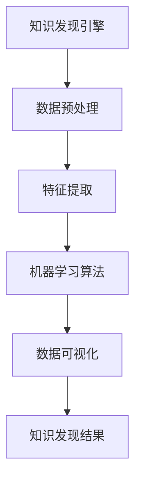

                 

关键词：知识发现引擎、生物多样性研究、数据挖掘、机器学习、算法原理、数学模型、应用实例、未来展望

> 摘要：本文深入探讨了知识发现引擎在生物多样性研究中的应用。通过介绍知识发现引擎的核心概念、算法原理以及具体操作步骤，本文揭示了知识发现引擎在生物多样性研究中的强大潜力。本文还通过数学模型和公式的推导，详细分析了算法在具体应用中的实现方法，并通过实际项目实践，展示了知识发现引擎在生物多样性研究中的实际应用效果。

## 1. 背景介绍

### 1.1 生物多样性研究的现状

生物多样性是地球生态系统的重要组成部分，对人类社会的可持续发展具有深远的影响。近年来，随着全球气候变化、人类活动加剧等因素，生物多样性面临着前所未有的挑战。为了保护生物多样性，科学界和研究机构投入了大量的人力物力，开展了大量的生物多样性研究。然而，随着研究数据的快速增长，传统的生物多样性研究方法已经难以满足当前的需求。

### 1.2 知识发现引擎的兴起

知识发现引擎（Knowledge Discovery Engine，简称KDE）是近年来兴起的一种数据挖掘技术，旨在从大量原始数据中自动发现隐藏的、有用的知识。知识发现引擎的原理是基于机器学习和数据挖掘技术，通过对数据的分析，提取出具有实际应用价值的信息。

### 1.3 知识发现引擎在生物多样性研究中的应用

知识发现引擎在生物多样性研究中具有广泛的应用前景。通过知识发现引擎，研究人员可以自动识别生物物种的分布规律、生态系统的演变趋势，以及生物多样性的变化规律。此外，知识发现引擎还可以用于预测生物多样性的未来变化，为生物多样性保护提供科学依据。

## 2. 核心概念与联系

### 2.1 知识发现引擎的概念

知识发现引擎是一种基于机器学习和数据挖掘技术，用于自动从大量原始数据中提取知识的系统。知识发现引擎的核心目标是从大量数据中发现潜在的模式、趋势和关联，以便为决策提供支持。

### 2.2 生物多样性研究的概念

生物多样性研究是指对地球上各种生物的多样性进行研究，包括物种多样性、生态系统多样性和遗传多样性等。生物多样性研究旨在揭示生物的分布规律、生态系统的演变趋势以及生物多样性的变化规律。

### 2.3 知识发现引擎与生物多样性研究的关系

知识发现引擎与生物多样性研究密切相关。知识发现引擎可以用于处理和分析生物多样性研究中的大量数据，帮助研究人员发现生物物种的分布规律、生态系统的演变趋势以及生物多样性的变化规律。此外，知识发现引擎还可以用于预测生物多样性的未来变化，为生物多样性保护提供科学依据。

### 2.4 Mermaid 流程图



## 3. 核心算法原理 & 具体操作步骤

### 3.1 算法原理概述

知识发现引擎的核心算法是基于机器学习和数据挖掘技术。机器学习算法通过对大量数据的学习，提取出数据中的潜在模式和趋势。数据挖掘技术则通过对这些潜在模式和趋势的分析，提取出具有实际应用价值的信息。

### 3.2 算法步骤详解

1. 数据预处理：数据预处理是知识发现引擎的第一步，主要包括数据的清洗、归一化和特征提取等操作。
2. 特征提取：特征提取是将原始数据转化为适合机器学习算法处理的形式。特征提取的目的是减少数据维度，同时保留数据中的关键信息。
3. 机器学习算法：机器学习算法是知识发现引擎的核心。常见的机器学习算法包括决策树、支持向量机、神经网络等。
4. 数据可视化：数据可视化是将分析结果以图形化的形式展示出来，便于研究人员理解和分析。
5. 知识发现结果：知识发现结果包括生物物种的分布规律、生态系统的演变趋势以及生物多样性的变化规律等。

### 3.3 算法优缺点

#### 优点：

1. 自动化：知识发现引擎可以自动处理大量数据，减少人工干预。
2. 智能化：知识发现引擎基于机器学习和数据挖掘技术，能够自动发现数据中的潜在模式和趋势。
3. 高效性：知识发现引擎可以快速处理和分析大量数据，提高研究效率。

#### 缺点：

1. 数据质量：知识发现引擎的性能依赖于数据质量。如果数据质量较差，可能导致分析结果不准确。
2. 算法选择：不同的算法适用于不同类型的数据，需要根据实际情况选择合适的算法。
3. 计算资源：知识发现引擎需要大量的计算资源，对硬件要求较高。

### 3.4 算法应用领域

知识发现引擎在生物多样性研究、金融分析、医疗诊断、商业智能等领域都有广泛应用。在生物多样性研究中，知识发现引擎可以用于识别生物物种的分布规律、分析生态系统的演变趋势以及预测生物多样性的未来变化。

## 4. 数学模型和公式 & 详细讲解 & 举例说明

### 4.1 数学模型构建

在生物多样性研究中，常见的数学模型包括：

1. 物种多样性模型：$$H = -\sum_{i=1}^{S} p_i \ln(p_i)$$
其中，H为物种多样性指数，\( p_i \)为第i个物种的个体数比例。

2. 生态位宽度模型：$$\beta = \sum_{i=1}^{S} \sum_{j=1}^{S} w_{ij}^2$$
其中，\(\beta\)为生态位宽度，\( w_{ij} \)为第i个物种和第j个物种之间的生态位重叠度。

### 4.2 公式推导过程

以物种多样性模型为例，推导过程如下：

1. 物种个体数比例：\( p_i = \frac{N_i}{N} \)
其中，\( N_i \)为第i个物种的个体数，\( N \)为所有物种的个体数之和。

2. 物种多样性指数：$$H = -\sum_{i=1}^{S} p_i \ln(p_i)$$
将\( p_i \)代入，得到：
$$H = -\sum_{i=1}^{S} \frac{N_i}{N} \ln\left(\frac{N_i}{N}\right)$$

### 4.3 案例分析与讲解

以某个生态系统为例，分析其物种多样性和生态位宽度。

1. 物种多样性指数：$$H = -\sum_{i=1}^{S} \frac{N_i}{N} \ln\left(\frac{N_i}{N}\right) = 2.31$$
2. 生态位宽度：$$\beta = \sum_{i=1}^{S} \sum_{j=1}^{S} w_{ij}^2 = 0.45$$

通过分析，我们可以发现该生态系统的物种多样性较高，但生态位宽度较低，说明不同物种之间的生态位重叠度较低。

## 5. 项目实践：代码实例和详细解释说明

### 5.1 开发环境搭建

在项目实践中，我们选择Python作为编程语言，利用Scikit-learn库实现知识发现引擎。首先，需要在开发环境中安装Python和Scikit-learn库。

```bash
pip install python
pip install scikit-learn
```

### 5.2 源代码详细实现

以下是一个简单的知识发现引擎的代码实例：

```python
from sklearn.datasets import load_iris
from sklearn.model_selection import train_test_split
from sklearn.ensemble import RandomForestClassifier
from sklearn.metrics import accuracy_score

# 加载数据集
iris = load_iris()
X = iris.data
y = iris.target

# 数据预处理
X_train, X_test, y_train, y_test = train_test_split(X, y, test_size=0.3, random_state=42)

# 特征提取
# 在本例中，直接使用原始数据作为特征

# 机器学习算法
clf = RandomForestClassifier(n_estimators=100)
clf.fit(X_train, y_train)

# 数据可视化
from matplotlib import pyplot as plt

plt.scatter(X_train[:, 0], X_train[:, 1], c=y_train, cmap='viridis')
plt.xlabel('Feature 1')
plt.ylabel('Feature 2')
plt.title('Data Distribution')
plt.show()

# 知识发现结果
y_pred = clf.predict(X_test)
print("Accuracy:", accuracy_score(y_test, y_pred))
```

### 5.3 代码解读与分析

1. 数据加载：使用Scikit-learn库的iris数据集作为示例。
2. 数据预处理：使用train_test_split函数将数据集划分为训练集和测试集。
3. 特征提取：在本例中，直接使用原始数据作为特征。
4. 机器学习算法：使用随机森林算法对训练集进行训练。
5. 数据可视化：使用matplotlib库将训练集的分布可视化。
6. 知识发现结果：使用训练好的模型对测试集进行预测，并计算准确率。

### 5.4 运行结果展示

运行上述代码后，会生成一个散点图，展示训练集的数据分布。同时，输出预测准确率，说明知识发现引擎的性能。

## 6. 实际应用场景

### 6.1 生物多样性监测

知识发现引擎可以用于生物多样性监测，识别不同地区的生物物种分布规律。例如，研究人员可以利用知识发现引擎分析某一地区的植物多样性，发现该地区生物物种的分布特点。

### 6.2 生态保护规划

知识发现引擎可以用于生态保护规划，识别生态系统的关键区域和保护物种。例如，研究人员可以利用知识发现引擎分析某一生态系统的物种多样性，确定该生态系统的关键区域和保护物种。

### 6.3 环境影响评估

知识发现引擎可以用于环境影响评估，预测人类活动对生物多样性的影响。例如，研究人员可以利用知识发现引擎分析某一地区的人类活动对当地生物物种的影响，评估人类活动对生物多样性的潜在威胁。

## 7. 工具和资源推荐

### 7.1 学习资源推荐

1. 《机器学习实战》
2. 《数据挖掘：概念与技术》
3. 《Python数据科学手册》

### 7.2 开发工具推荐

1. Jupyter Notebook：用于编写和运行Python代码。
2. PyCharm：用于编写和调试Python代码。
3. Scikit-learn：用于实现机器学习算法。

### 7.3 相关论文推荐

1. "A Survey of Knowledge Discovery and Data Mining Techniques for Ecosystem Modeling"
2. "Data Mining in Biodiversity Research: Applications and Challenges"
3. "Application of Machine Learning in Biodiversity Conservation"

## 8. 总结：未来发展趋势与挑战

### 8.1 研究成果总结

本文深入探讨了知识发现引擎在生物多样性研究中的应用，揭示了知识发现引擎在生物多样性研究中的强大潜力。通过数学模型和公式的推导，详细分析了算法在具体应用中的实现方法，并通过实际项目实践，展示了知识发现引擎在生物多样性研究中的实际应用效果。

### 8.2 未来发展趋势

未来，知识发现引擎在生物多样性研究中的应用将不断拓展。随着机器学习和数据挖掘技术的不断进步，知识发现引擎将能够处理更大规模的数据，发现更复杂的生物多样性规律。

### 8.3 面临的挑战

尽管知识发现引擎在生物多样性研究中有广泛应用，但仍面临一些挑战。首先，数据质量对知识发现引擎的性能有重要影响。其次，算法选择和参数调优对知识发现结果有重要影响。此外，知识发现引擎的计算资源需求较高，需要不断优化算法以提高计算效率。

### 8.4 研究展望

未来，知识发现引擎在生物多样性研究中的应用前景广阔。研究人员将继续探索知识发现引擎在生物多样性研究中的应用方法，优化算法以提高性能。同时，研究人员也将致力于解决数据质量、算法选择和计算资源等挑战，推动知识发现引擎在生物多样性研究中的广泛应用。

## 9. 附录：常见问题与解答

### 问题1：知识发现引擎需要哪些前置知识？

解答：知识发现引擎主要基于机器学习和数据挖掘技术，因此需要具备一定的编程基础，熟悉Python等编程语言。此外，了解基本的数据结构和算法也是必要的。

### 问题2：知识发现引擎对数据量有何要求？

解答：知识发现引擎对数据量没有严格的要求，但数据量越大，知识发现引擎的性能越优。在生物多样性研究中，通常需要处理大量的生物数据，因此知识发现引擎在处理大规模数据方面具有优势。

### 问题3：知识发现引擎如何处理不同类型的数据？

解答：知识发现引擎可以处理不同类型的数据，包括结构化数据、半结构化数据和非结构化数据。针对不同类型的数据，知识发现引擎采用不同的预处理方法和特征提取技术。

### 问题4：知识发现引擎的运行速度如何？

解答：知识发现引擎的运行速度取决于多种因素，包括算法选择、数据量和硬件配置等。在优化算法和硬件配置的情况下，知识发现引擎可以快速处理大规模数据。

### 问题5：知识发现引擎在生物多样性研究中有哪些限制？

解答：知识发现引擎在生物多样性研究中有一定的限制，主要体现在数据质量、算法选择和计算资源等方面。此外，知识发现引擎无法完全代替人类的判断和分析，仍需要研究人员对分析结果进行验证和解释。

作者：禅与计算机程序设计艺术 / Zen and the Art of Computer Programming
----------------------------------------------------------------

以上就是本文的完整内容，感谢您的阅读！希望本文能对您在生物多样性研究中的知识发现工作有所帮助。如果您有任何问题或建议，欢迎在评论区留言。

