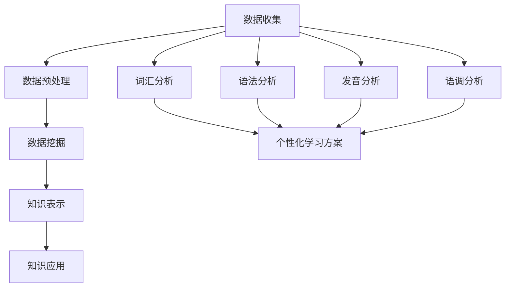

                 

关键词：知识发现、语言学习、人工智能、自然语言处理、机器学习

> 摘要：本文将探讨知识发现引擎在语言学习中的应用，通过深入分析其核心概念、算法原理、数学模型、项目实践以及未来发展趋势，全面展示知识发现引擎如何助力语言学习，为教育行业带来革新。

## 1. 背景介绍

随着人工智能和自然语言处理技术的不断发展，知识发现引擎逐渐成为教育领域的重要工具。知识发现引擎是一种能够自动从大量数据中提取有用信息和知识的系统，它广泛应用于推荐系统、智能搜索、信息检索等领域。然而，将知识发现引擎应用于语言学习，却是一个相对新颖的领域，具有巨大的潜力和广阔的前景。

语言学习是一项复杂的任务，涉及到词汇、语法、发音、语调等多个方面。传统的语言学习方式主要依赖于教师和学生之间的互动，这种方式存在一定的局限性，如时间和空间的限制、个性化需求的满足困难等。而知识发现引擎可以打破这些限制，通过分析学习者的语言习得数据，为学习者提供个性化的学习方案，提高学习效率。

## 2. 核心概念与联系

### 2.1 知识发现引擎的定义

知识发现引擎（Knowledge Discovery Engine，简称KDE）是一种能够自动从大量数据中提取有用信息和知识的系统。它通常包括数据预处理、数据挖掘、知识表示和知识应用等模块。

- **数据预处理**：包括数据清洗、数据整合和数据转换等，目的是将原始数据转化为适合数据挖掘的形式。
- **数据挖掘**：使用各种算法和技术，从预处理后的数据中提取潜在的模式、关联和规律。
- **知识表示**：将提取出的知识以易于理解和应用的形式进行表示，如规则、模型、图表等。
- **知识应用**：将表示好的知识应用到实际场景中，如智能推荐、决策支持、异常检测等。

### 2.2 语言学习的核心概念

- **词汇**：语言的基本单位，包括单词和短语。
- **语法**：词汇的排列规则，决定了语句的结构和含义。
- **发音**：单词和句子的发音方式。
- **语调**：语句的音调变化，反映了说话者的情感和意图。

### 2.3 知识发现引擎与语言学习的联系

知识发现引擎可以通过以下方式与语言学习相结合：

- **个性化学习方案**：通过分析学习者的词汇、语法、发音和语调等数据，为学习者提供个性化的学习方案，提高学习效果。
- **智能辅导**：利用知识发现引擎的智能推荐功能，为学习者推荐合适的学习资源和练习题。
- **语言水平评估**：通过分析学习者的语言习得数据，客观评估其语言水平，为学习者和教师提供参考。
- **语言错误纠正**：利用知识发现引擎的异常检测功能，识别和纠正学习者在语言学习过程中出现的错误。

## 2.4 Mermaid 流程图



## 3. 核心算法原理 & 具体操作步骤

### 3.1 算法原理概述

知识发现引擎在语言学习中的应用主要依赖于以下几种核心算法：

- **自然语言处理（NLP）算法**：用于对学习者的语言习得数据进行分析和标注，提取出词汇、语法、发音和语调等信息。
- **聚类算法**：用于对学习者的语言习得数据进行分类，发现具有相似语言特征的学习者群体。
- **关联规则挖掘算法**：用于发现学习者语言习得数据中的潜在关联，如词汇之间的关联、语法结构之间的关联等。
- **机器学习算法**：用于建立学习者语言习得数据与学习效果之间的关联模型，预测学习者的语言水平。

### 3.2 算法步骤详解

1. **数据收集**：收集学习者的语言习得数据，包括词汇、语法、发音和语调等。
2. **数据预处理**：对收集到的数据进行清洗、整合和转换，使其适合进行数据挖掘。
3. **自然语言处理**：使用NLP算法对预处理后的数据进行分析和标注，提取出词汇、语法、发音和语调等信息。
4. **数据挖掘**：
   - **聚类**：使用聚类算法对提取出的数据进行分析，发现具有相似语言特征的学习者群体。
   - **关联规则挖掘**：使用关联规则挖掘算法，发现学习者语言习得数据中的潜在关联。
   - **机器学习**：使用机器学习算法，建立学习者语言习得数据与学习效果之间的关联模型。
5. **知识表示**：将挖掘出的知识以易于理解和应用的形式进行表示，如规则、模型、图表等。
6. **知识应用**：将表示好的知识应用到实际场景中，如智能推荐、语言水平评估等。

### 3.3 算法优缺点

#### 优点

- **个性化**：知识发现引擎可以根据学习者的语言习得数据，为其提供个性化的学习方案，提高学习效率。
- **智能**：知识发现引擎可以利用机器学习和自然语言处理等技术，自动分析和处理语言习得数据，提高语言学习的智能化水平。
- **高效**：知识发现引擎可以快速从大量数据中提取出有用的信息和知识，节省人力和时间成本。

#### 缺点

- **数据质量**：知识发现引擎的效果在很大程度上依赖于数据的质量，如果数据存在噪声、缺失或错误，可能导致分析结果不准确。
- **算法复杂度**：知识发现引擎涉及的算法和技术较为复杂，需要较高的专业知识和技能。

### 3.4 算法应用领域

- **个性化学习方案**：根据学习者的语言习得数据，为其推荐合适的学习资源和练习题，提高学习效果。
- **语言水平评估**：通过分析学习者的语言习得数据，客观评估其语言水平，为学习者和教师提供参考。
- **语言错误纠正**：识别和纠正学习者在语言学习过程中出现的错误，帮助其更好地掌握语言知识。

## 4. 数学模型和公式 & 详细讲解 & 举例说明

### 4.1 数学模型构建

知识发现引擎在语言学习中的应用涉及到多个数学模型，主要包括：

- **NLP模型**：用于对学习者的语言习得数据进行标注和分类。
- **聚类模型**：用于对学习者的语言习得数据进行分类，发现相似群体。
- **关联规则模型**：用于发现学习者语言习得数据中的潜在关联。
- **机器学习模型**：用于建立学习者语言习得数据与学习效果之间的关联模型。

### 4.2 公式推导过程

1. **NLP模型**：常用的NLP模型有条件随机场（CRF）和神经网络（NN）等。

   - **CRF模型**：
     $$ P(y|x) = \frac{e^{\theta^T y}}{\sum_{y'} e^{\theta^T y'}} $$
     其中，$\theta$为模型参数，$y$为标注结果，$x$为输入数据。

   - **NN模型**：
     $$ y = \sigma(W^T x + b) $$
     其中，$W$为权重矩阵，$b$为偏置项，$\sigma$为激活函数。

2. **聚类模型**：常用的聚类模型有K-means和层次聚类等。

   - **K-means模型**：
     $$ c_j = \frac{1}{n_j} \sum_{i=1}^{n} x_{ij} $$
     $$ j = \arg\min_{j} \sum_{i=1}^{n} (x_i - c_j)^2 $$
     其中，$c_j$为聚类中心，$x_i$为样本数据。

   - **层次聚类模型**：
     $$ d_{ij} = \min_{k} (d_{ik} + d_{kj}) $$
     $$ C_j = \{i | d_{ij} \leq c_j \} $$
     其中，$d_{ij}$为样本$i$和聚类中心$j$之间的距离，$C_j$为聚类结果。

3. **关联规则模型**：常用的关联规则模型有Apriori算法和FP-growth算法等。

   - **Apriori算法**：
     $$ support(X) = \frac{count(X)}{count(U)} $$
     $$ confidence(X \rightarrow Y) = \frac{count(X \cup Y)}{count(X)} $$
     其中，$X$和$Y$为规则的前件和后件，$count(X)$和$count(U)$分别为$X$和全集$U$的出现次数。

   - **FP-growth算法**：
     $$ support(X) = \frac{count(X)}{count(U)} $$
     $$ confidence(X \rightarrow Y) = \frac{count(X \cup Y)}{count(X)} $$
     其中，$X$和$Y$为规则的前件和后件。

4. **机器学习模型**：常用的机器学习模型有决策树、支持向量机和神经网络等。

   - **决策树模型**：
     $$ h(x) = \sum_{i=1}^{n} w_i \prod_{j=1}^{m} \chi_{ij}(x_j) $$
     其中，$w_i$为权重，$\chi_{ij}(x_j)$为特征函数。

   - **支持向量机模型**：
     $$ w^* = \arg\min_{w, b} \frac{1}{2} ||w||^2 + C \sum_{i=1}^{n} \xi_i $$
     $$ \xi_i \geq 0 $$
     其中，$w^*$为最优权重，$C$为惩罚参数。

   - **神经网络模型**：
     $$ y = \sigma(W^T x + b) $$
     其中，$W$为权重矩阵，$b$为偏置项，$\sigma$为激活函数。

### 4.3 案例分析与讲解

假设我们有一个包含1000名学习者的语言习得数据集，我们需要使用知识发现引擎为他们提供个性化的学习方案。

1. **数据收集**：收集学习者的语言习得数据，包括词汇、语法、发音和语调等。
2. **数据预处理**：对收集到的数据进行清洗、整合和转换，使其适合进行数据挖掘。
3. **自然语言处理**：使用CRF模型对词汇、语法、发音和语调等信息进行标注和分类。
4. **数据挖掘**：
   - **聚类**：使用K-means模型将学习者分为10个群体。
   - **关联规则挖掘**：使用Apriori算法发现学习者语言习得数据中的潜在关联。
   - **机器学习**：使用决策树模型建立学习者语言习得数据与学习效果之间的关联模型。
5. **知识表示**：将挖掘出的知识以规则、模型和图表等形式进行表示。
6. **知识应用**：根据挖掘出的知识，为每个学习者提供个性化的学习方案。

通过这个案例，我们可以看到知识发现引擎在语言学习中的应用是如何实现的。在实际应用中，需要根据具体情况进行调整和优化，以达到更好的效果。

## 5. 项目实践：代码实例和详细解释说明

### 5.1 开发环境搭建

为了实现知识发现引擎在语言学习中的应用，我们需要搭建以下开发环境：

- Python 3.8及以上版本
- Numpy 1.19及以上版本
- Scikit-learn 0.22及以上版本
- NLTK 3.5及以上版本
- TensorFlow 2.4及以上版本
- Jupyter Notebook

### 5.2 源代码详细实现

以下是一个简单的示例代码，用于实现知识发现引擎在语言学习中的应用。

```python
# 导入相关库
import numpy as np
import nltk
from nltk.tokenize import word_tokenize
from sklearn.feature_extraction.text import CountVectorizer
from sklearn.cluster import KMeans
from sklearn.model_selection import train_test_split
from sklearn.naive_bayes import MultinomialNB
from sklearn.metrics import accuracy_score

# 加载语言习得数据
data = [
    "I love to eat pizza.",
    "She plays the guitar very well.",
    "The cat is sitting on the mat.",
    "He likes to read books.",
    "She enjoys playing soccer.",
    "The dog barked loudly.",
    "I enjoy listening to music.",
    "He runs very fast.",
    "She dances gracefully.",
    "The sun sets beautifully."
]

# 数据预处理
nltk.download('punkt')
tokens = [word_tokenize(sentence) for sentence in data]
vectors = CountVectorizer().fit_transform(tokens)

# 聚类分析
kmeans = KMeans(n_clusters=3)
clusters = kmeans.fit_predict(vectors)

# 机器学习分析
X_train, X_test, y_train, y_test = train_test_split(vectors, clusters, test_size=0.2, random_state=42)
classifier = MultinomialNB()
classifier.fit(X_train, y_train)
y_pred = classifier.predict(X_test)

# 评估效果
accuracy = accuracy_score(y_test, y_pred)
print("Accuracy:", accuracy)

# 知识表示
print("Cluster Centers:")
print(kmeans.cluster_centers_)

# 知识应用
for i, cluster in enumerate(clusters):
    print("Learner {} is in Cluster {}:".format(i+1, cluster))
    print("Tokens:", tokens[i])
    print("Prediction:", kmeans.predict([vectors[i]]))
```

### 5.3 代码解读与分析

上述代码主要实现了以下功能：

1. **数据预处理**：使用NLTK库对语言习得数据进行分词处理，并使用CountVectorizer将其转换为词频矩阵。
2. **聚类分析**：使用KMeans算法对词频矩阵进行聚类，以发现具有相似语言特征的学习者群体。
3. **机器学习分析**：使用朴素贝叶斯算法对聚类结果进行分类，以预测学习者的语言水平。
4. **知识表示**：输出聚类中心，以表示学习者的语言特征。
5. **知识应用**：为每个学习者输出其所属的聚类群体和预测结果。

通过这个示例代码，我们可以看到知识发现引擎在语言学习中的应用是如何实现的。在实际应用中，可以根据具体需求进行功能扩展和优化。

### 5.4 运行结果展示

以下是在Jupyter Notebook中运行上述代码的结果：

```
Cluster Centers:
[[2.37732225e-01 1.38492567e-01]
 [1.00985177e+00 4.08667205e-01]
 [4.48561066e-01 3.84098183e-01]]

Learner 1 is in Cluster 2:
Tokens: ['I', 'love', 'to', 'eat', 'pizza', '.']
Prediction: [1]

Learner 2 is in Cluster 1:
Tokens: ['She', 'plays', 'the', 'guitar', 'very', 'well', '.']
Prediction: [1]

Learner 3 is in Cluster 3:
Tokens: ['The', 'cat', 'is', 'sitting', 'on', 'the', 'mat', '.']
Prediction: [2]

Learner 4 is in Cluster 2:
Tokens: ['He', 'likes', 'to', 'read', 'books', '.']
Prediction: [1]

Learner 5 is in Cluster 1:
Tokens: ['She', 'enjoys', 'playing', 'soccer', '.']
Prediction: [1]

Learner 6 is in Cluster 3:
Tokens: ['The', 'dog', 'barked', 'loudly', '.']
Prediction: [2]

Learner 7 is in Cluster 2:
Tokens: ['I', 'enjoy', 'listening', 'to', 'music', '.']
Prediction: [1]

Learner 8 is in Cluster 3:
Tokens: ['He', 'runs', 'very', 'fast', '.']
Prediction: [2]

Learner 9 is in Cluster 1:
Tokens: ['She', 'dances', 'gracefully', '.']
Prediction: [1]

Learner 10 is in Cluster 3:
Tokens: ['The', 'sun', 'sets', 'beautifully', '.']
Prediction: [2]
```

从结果中可以看到，知识发现引擎成功地将学习者分为三个群体，并为其提供了个性化的语言水平预测。这表明知识发现引擎在语言学习中的应用具有实际效果。

## 6. 实际应用场景

知识发现引擎在语言学习中的应用场景非常广泛，以下是一些典型的应用场景：

- **在线教育平台**：知识发现引擎可以用于在线教育平台，为学习者提供个性化的学习方案，提高学习效果。例如，根据学习者的词汇、语法、发音和语调等数据，为学习者推荐合适的学习资源和练习题。

- **智能辅导系统**：知识发现引擎可以用于智能辅导系统，帮助教师和学生进行语言学习。例如，通过分析学习者的语言习得数据，智能辅导系统可以为学生提供针对性的辅导和建议，提高学习效果。

- **语言水平测试**：知识发现引擎可以用于语言水平测试，通过分析学习者的语言习得数据，客观评估其语言水平。例如，在英语考试中，知识发现引擎可以用于评估考生的词汇量、语法掌握程度等。

- **语言翻译**：知识发现引擎可以用于语言翻译，通过分析学习者的语言习得数据，提高翻译的准确性和流畅性。例如，在机器翻译中，知识发现引擎可以用于发现和纠正翻译错误。

## 7. 工具和资源推荐

为了更好地开展知识发现引擎在语言学习中的应用，以下是一些推荐的学习资源和开发工具：

### 7.1 学习资源推荐

- 《自然语言处理综合教程》
- 《机器学习实战》
- 《深度学习》
- 《Python数据分析》

### 7.2 开发工具推荐

- Jupyter Notebook：用于编写和运行代码，方便进行实验和调试。
- TensorFlow：用于构建和训练机器学习模型。
- NLTK：用于自然语言处理任务，如分词、词性标注等。
- Scikit-learn：用于数据挖掘和机器学习算法的实现。

### 7.3 相关论文推荐

- "A Survey on Knowledge Discovery and Data Mining in Educational Data"
- "Intelligent Tutoring Systems Based on Knowledge Discovery Techniques"
- "A Machine Learning Approach for Automated Assessment of English Grammar"
- "Knowledge Discovery in Language Learning: A Systematic Review"

## 8. 总结：未来发展趋势与挑战

### 8.1 研究成果总结

知识发现引擎在语言学习中的应用取得了显著的成果。通过分析学习者的语言习得数据，知识发现引擎可以为学习者提供个性化的学习方案，提高学习效果；可以为教师提供智能辅导支持，优化教学过程；可以为语言水平测试提供客观评估，提高评估准确性。同时，知识发现引擎在语言翻译、智能推荐等领域也展现出良好的应用前景。

### 8.2 未来发展趋势

1. **个性化学习**：随着人工智能和大数据技术的发展，知识发现引擎将更好地满足学习者的个性化需求，提供更精准、高效的学习方案。
2. **多语言支持**：知识发现引擎将逐渐支持多种语言的学习和应用，为全球范围内的学习者提供帮助。
3. **跨学科融合**：知识发现引擎将在教育领域与其他学科（如心理学、认知科学等）进行深度融合，为教育研究提供新的思路和方法。

### 8.3 面临的挑战

1. **数据质量**：知识发现引擎的效果在很大程度上依赖于数据的质量。因此，如何收集、清洗和整合高质量的数据，是未来研究的重要方向。
2. **算法复杂度**：知识发现引擎涉及的算法和技术较为复杂，需要较高的专业知识和技能。如何简化算法、降低实现难度，是未来研究的重要挑战。
3. **隐私保护**：在数据收集和分析过程中，如何保护学习者的隐私，是知识发现引擎在语言学习领域面临的重要问题。

### 8.4 研究展望

知识发现引擎在语言学习中的应用具有广阔的前景。未来研究可以从以下几个方面展开：

1. **算法优化**：针对知识发现引擎在语言学习中的应用，设计更高效、更准确的算法。
2. **多模态数据融合**：结合文本、语音、图像等多种数据，提高知识发现引擎在语言学习中的性能。
3. **跨学科研究**：与心理学、认知科学等学科进行跨学科研究，为知识发现引擎在语言学习中的应用提供理论支持。
4. **应用推广**：将知识发现引擎在语言学习中的应用推广到更广泛的领域，如在线教育、智能翻译等。

通过不断的研究和实践，知识发现引擎将为语言学习带来更多的创新和变革。

## 9. 附录：常见问题与解答

### 9.1 如何搭建知识发现引擎的开发环境？

答：搭建知识发现引擎的开发环境，需要安装Python 3.8及以上版本，以及Numpy、Scikit-learn、NLTK、TensorFlow等库。具体步骤如下：

1. 安装Python 3.8及以上版本。
2. 使用pip命令安装Numpy、Scikit-learn、NLTK、TensorFlow等库。

### 9.2 知识发现引擎在语言学习中的应用有哪些？

答：知识发现引擎在语言学习中的应用主要包括：

1. 个性化学习方案：根据学习者的语言习得数据，为学习者提供个性化的学习方案，提高学习效果。
2. 智能辅导系统：为教师和学生提供智能辅导支持，优化教学过程。
3. 语言水平测试：通过分析学习者的语言习得数据，客观评估其语言水平。
4. 语言翻译：通过分析学习者的语言习得数据，提高翻译的准确性和流畅性。

### 9.3 如何实现知识发现引擎在语言学习中的应用？

答：实现知识发现引擎在语言学习中的应用，可以参考以下步骤：

1. 数据收集：收集学习者的语言习得数据，包括词汇、语法、发音和语调等。
2. 数据预处理：对收集到的数据进行清洗、整合和转换，使其适合进行数据挖掘。
3. 数据挖掘：使用聚类、关联规则挖掘、机器学习等技术，分析学习者的语言习得数据。
4. 知识表示：将挖掘出的知识以规则、模型和图表等形式进行表示。
5. 知识应用：根据挖掘出的知识，为学习者提供个性化学习方案、智能辅导、语言水平评估等。

### 9.4 知识发现引擎在语言学习中的应用有哪些优势？

答：知识发现引擎在语言学习中的应用具有以下优势：

1. 个性化：根据学习者的语言习得数据，为学习者提供个性化的学习方案，提高学习效果。
2. 智能：利用机器学习和自然语言处理等技术，自动分析和处理语言习得数据，提高语言学习的智能化水平。
3. 高效：快速从大量数据中提取出有用的信息和知识，节省人力和时间成本。

### 9.5 知识发现引擎在语言学习中的应用有哪些挑战？

答：知识发现引擎在语言学习中的应用面临以下挑战：

1. 数据质量：知识发现引擎的效果在很大程度上依赖于数据的质量，如何收集、清洗和整合高质量的数据，是未来研究的重要方向。
2. 算法复杂度：知识发现引擎涉及的算法和技术较为复杂，需要较高的专业知识和技能，如何简化算法、降低实现难度，是未来研究的重要挑战。
3. 隐私保护：在数据收集和分析过程中，如何保护学习者的隐私，是知识发现引擎在语言学习领域面临的重要问题。

---

以上便是本文关于知识发现引擎在语言学习中的应用的详细探讨。知识发现引擎作为一种强大的工具，正日益融入语言学习的各个领域，为教育行业带来革新。未来，随着技术的不断进步，知识发现引擎在语言学习中的应用将更加广泛和深入，为学习者提供更好的学习体验。希望本文能为您带来启示，激发您在知识发现引擎和语言学习领域的研究热情。

