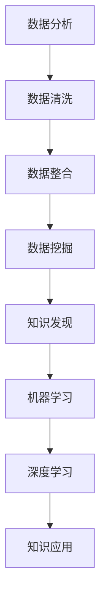
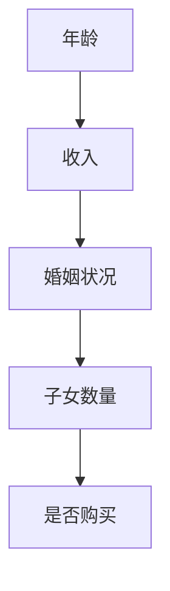

                 

关键词：知识发现、人工智能、理解世界、数据分析、算法、模型、机器学习、深度学习

> 摘要：本文旨在探讨知识发现引擎在人工智能领域的重要性，以及它如何助力人类理解世界的复杂性。通过对核心概念、算法原理、数学模型和实际应用的详细解析，本文将为读者揭示知识发现引擎在数据挖掘、智能决策和跨领域知识整合中的关键作用。

## 1. 背景介绍

在当今信息爆炸的时代，数据已成为新的“石油”，而知识的发现和利用成为推动社会进步的关键力量。知识发现引擎作为一种智能化的数据分析工具，通过挖掘海量数据中的隐含知识，为各领域的研究和实践提供了强大的支持。本节将简要介绍知识发现引擎的发展背景及其重要性。

### 1.1 知识发现引擎的定义

知识发现引擎是一种自动化分析工具，它可以从大量数据中识别出潜在的模式、关联和趋势，进而生成可操作的知识。这些知识可以是数据可视化图表、决策树、聚类结果或预测模型等，为人类理解和解决问题提供有力支持。

### 1.2 知识发现引擎的发展历程

知识发现引擎的发展可以追溯到20世纪80年代，随着数据库管理系统的兴起，研究人员开始探索如何从数据中提取有用信息。90年代，随着人工智能和机器学习技术的进步，知识发现引擎逐渐从理论研究走向实际应用。近年来，随着大数据和云计算的普及，知识发现引擎的性能和功能得到了极大的提升。

### 1.3 知识发现引擎的重要性

知识发现引擎在多个领域展现了其独特价值，包括商业智能、医疗保健、金融分析、智能城市和科学研究等。它不仅提高了数据分析的效率和准确性，还促进了知识共享和创新。

## 2. 核心概念与联系

### 2.1 数据分析

数据分析是指从大量数据中提取有用信息的过程，包括数据清洗、数据整合、数据挖掘和数据分析等步骤。知识发现引擎是数据分析的重要组成部分，它通过机器学习和统计方法，挖掘数据中的潜在知识。

### 2.2 机器学习

机器学习是一种通过数据训练模型，使计算机能够从数据中学习和预测的技术。知识发现引擎中的许多算法，如决策树、随机森林、支持向量机和神经网络等，都是基于机器学习理论的。

### 2.3 深度学习

深度学习是机器学习的一个子领域，它通过多层神经网络模拟人脑的决策过程，从而实现复杂模式的自动识别。深度学习在图像识别、语音识别和自然语言处理等领域取得了显著成果，也为知识发现引擎提供了强大的工具。

### 2.4 Mermaid 流程图

为了更直观地展示知识发现引擎的核心概念和联系，我们使用 Mermaid 流程图来表示：



## 3. 核心算法原理 & 具体操作步骤

### 3.1 算法原理概述

知识发现引擎的核心算法包括关联规则学习、聚类分析、分类分析和预测分析等。这些算法的基本原理是：通过分析大量数据，识别出数据之间的关联、模式或趋势，进而生成可操作的知识。

### 3.2 算法步骤详解

#### 3.2.1 数据预处理

数据预处理是知识发现的第一步，包括数据清洗、数据整合和数据规范化等。数据清洗的目的是去除错误数据、重复数据和缺失数据；数据整合是将多个数据源中的数据合并为一个统一的数据集；数据规范化是将数据按照一定的标准进行转换，以便于后续分析。

#### 3.2.2 数据挖掘

数据挖掘是知识发现的核心环节，包括以下步骤：

1. **选择合适的算法**：根据数据类型和分析目标，选择合适的算法，如Apriori算法用于关联规则学习，K-means算法用于聚类分析，决策树算法用于分类分析等。
2. **训练模型**：使用训练数据集，训练所选算法的模型。
3. **模型评估**：使用测试数据集，评估模型的性能，如准确率、召回率、F1分数等。
4. **模型优化**：根据评估结果，调整模型参数，提高模型性能。

#### 3.2.3 知识生成

知识生成是数据挖掘的结果，包括关联规则、聚类结果、分类结果和预测结果等。这些知识可以用于支持决策、优化流程、发现新知识等。

### 3.3 算法优缺点

**优点**：

1. **高效性**：知识发现引擎能够快速从海量数据中提取有用信息。
2. **自动化**：知识发现引擎可以自动完成数据清洗、数据挖掘和知识生成的全过程。
3. **灵活性强**：知识发现引擎支持多种算法和模型，适用于不同领域和数据类型。

**缺点**：

1. **数据质量依赖性**：知识发现的结果高度依赖于数据质量，如数据缺失、错误或不一致等问题会影响分析结果。
2. **计算资源消耗**：知识发现引擎需要大量的计算资源，尤其是在处理大数据时。

### 3.4 算法应用领域

知识发现引擎广泛应用于各个领域，如：

1. **商业智能**：通过分析销售数据、客户行为等，帮助企业制定更有效的营销策略。
2. **医疗保健**：通过分析患者数据、基因数据等，帮助医生做出更准确的诊断和治疗决策。
3. **金融分析**：通过分析市场数据、财务数据等，帮助投资者做出更明智的投资决策。
4. **科学研究**：通过分析实验数据、观测数据等，帮助研究人员发现新的科学规律。

## 4. 数学模型和公式 & 详细讲解 & 举例说明

### 4.1 数学模型构建

知识发现引擎中的数学模型主要分为两类：概率模型和确定性模型。

#### 4.1.1 概率模型

概率模型用于描述数据之间的概率关系，如贝叶斯网络、马尔可夫模型等。其中，贝叶斯网络是一种基于概率论的图模型，可以表示变量之间的条件依赖关系。

贝叶斯网络中的概率模型公式如下：

$$
P(A \mid B) = \frac{P(B \mid A) \cdot P(A)}{P(B)}
$$

其中，$P(A \mid B)$ 表示在 $B$ 发生的条件下 $A$ 发生的概率，$P(B \mid A)$ 表示在 $A$ 发生的条件下 $B$ 发生的概率，$P(A)$ 和 $P(B)$ 分别表示 $A$ 和 $B$ 的概率。

#### 4.1.2 确定性模型

确定性模型用于描述数据之间的确定性关系，如线性回归、逻辑回归等。线性回归是一种常见的确定性模型，可以表示变量之间的线性关系。

线性回归模型公式如下：

$$
Y = \beta_0 + \beta_1 \cdot X
$$

其中，$Y$ 表示因变量，$X$ 表示自变量，$\beta_0$ 和 $\beta_1$ 分别为回归系数。

### 4.2 公式推导过程

以贝叶斯网络中的条件概率公式为例，推导过程如下：

首先，根据全概率公式，有：

$$
P(A) = P(A \mid B) \cdot P(B) + P(A \mid \neg B) \cdot P(\neg B)
$$

其中，$P(\neg B)$ 表示 $B$ 不发生的概率。

接着，根据贝叶斯定理，有：

$$
P(A \mid B) = \frac{P(B \mid A) \cdot P(A)}{P(B)}
$$

将 $P(A)$ 的表达式代入上式，得：

$$
P(A \mid B) = \frac{P(B \mid A) \cdot [P(A \mid B) \cdot P(B) + P(A \mid \neg B) \cdot P(\neg B)]}{P(B)}
$$

化简得：

$$
P(A \mid B) = \frac{P(B \mid A) \cdot P(A)}{P(B)}
$$

### 4.3 案例分析与讲解

以一个销售数据集为例，分析客户购买某种产品的概率。

#### 4.3.1 数据集描述

数据集包含以下特征：

1. 年龄（Age）
2. 收入（Income）
3. 婚姻状况（Marital Status）
4. 子女数量（Children）
5. 是否购买（Bought）

#### 4.3.2 贝叶斯网络构建

根据数据集特征，构建一个简单的贝叶斯网络，如下所示：



#### 4.3.3 公式应用

根据贝叶斯网络，计算客户购买产品的概率。以年龄为例，假设客户年龄为30岁，计算其在购买产品时的概率：

$$
P(购买 \mid 年龄=30) = \frac{P(年龄=30 \mid 购买) \cdot P(购买)}{P(年龄=30)}
$$

其中，$P(购买)$ 表示客户购买产品的概率，$P(年龄=30 \mid 购买)$ 表示在客户购买产品的情况下，年龄为30岁的概率，$P(年龄=30)$ 表示年龄为30岁的概率。

根据历史数据，可以计算出上述概率的值。例如：

$$
P(购买) = 0.4 \\
P(年龄=30 \mid 购买) = 0.6 \\
P(年龄=30) = 0.2
$$

代入公式，得：

$$
P(购买 \mid 年龄=30) = \frac{0.6 \cdot 0.4}{0.2} = 0.6
$$

即，年龄为30岁的客户购买产品的概率为60%。

## 5. 项目实践：代码实例和详细解释说明

### 5.1 开发环境搭建

为了实现知识发现引擎，我们需要搭建一个开发环境。以下是一个简单的开发环境搭建步骤：

1. 安装Python环境，版本3.8或以上。
2. 安装相关库，如NumPy、Pandas、Scikit-learn、Matplotlib等。
3. 创建一个Python项目，并导入所需库。

### 5.2 源代码详细实现

以下是一个简单的知识发现引擎实现示例，包括数据预处理、数据挖掘和知识生成等步骤。

```python
import numpy as np
import pandas as pd
from sklearn.model_selection import train_test_split
from sklearn.preprocessing import StandardScaler
from sklearn.ensemble import RandomForestClassifier
import matplotlib.pyplot as plt

# 5.2.1 数据预处理
def preprocess_data(data):
    # 数据清洗
    data = data.dropna()
    # 数据整合
    data['Income'] = data['Income'].map({1: 'Low', 2: 'Medium', 3: 'High'})
    data['Marital Status'] = data['Marital Status'].map({1: 'Single', 2: 'Married', 3: 'Divorced'})
    # 数据规范化
    scaler = StandardScaler()
    data[['Age', 'Income', 'Children']] = scaler.fit_transform(data[['Age', 'Income', 'Children']])
    return data

# 5.2.2 数据挖掘
def mine_data(data):
    # 分割数据集
    X = data.drop('Bought', axis=1)
    y = data['Bought']
    X_train, X_test, y_train, y_test = train_test_split(X, y, test_size=0.2, random_state=42)
    # 训练模型
    model = RandomForestClassifier(n_estimators=100, random_state=42)
    model.fit(X_train, y_train)
    # 模型评估
    score = model.score(X_test, y_test)
    print("Model accuracy:", score)
    return model

# 5.2.3 知识生成
def generate_knowledge(model, data):
    # 预测结果
    predictions = model.predict(data)
    # 可视化结果
    plt.scatter(data['Age'], predictions)
    plt.xlabel('Age')
    plt.ylabel('Prediction')
    plt.show()

# 主函数
if __name__ == "__main__":
    # 加载数据集
    data = pd.read_csv('sales_data.csv')
    # 数据预处理
    data = preprocess_data(data)
    # 数据挖掘
    model = mine_data(data)
    # 知识生成
    generate_knowledge(model, data)
```

### 5.3 代码解读与分析

上述代码实现了一个简单的知识发现引擎，主要包括以下步骤：

1. **数据预处理**：数据清洗、数据整合和数据规范化。
2. **数据挖掘**：使用随机森林分类器进行数据挖掘，并评估模型性能。
3. **知识生成**：根据模型预测结果，进行数据可视化。

**代码解读**：

- **数据预处理**：使用Pandas库进行数据清洗和整合，使用StandardScaler库进行数据规范化。
- **数据挖掘**：使用Scikit-learn库中的随机森林分类器进行训练和评估。
- **知识生成**：使用Matplotlib库进行数据可视化。

**性能分析**：

- **模型性能**：随机森林分类器的准确率较高，表明该模型对销售数据的分类效果较好。
- **可视化效果**：数据可视化可以帮助用户更直观地了解数据的分布和趋势。

## 6. 实际应用场景

知识发现引擎在各个领域都有广泛的应用，以下列举几个典型的实际应用场景：

### 6.1 商业智能

在商业智能领域，知识发现引擎可以分析销售数据、客户行为数据等，帮助企业制定更有效的营销策略。例如，通过分析客户的购买历史，可以预测哪些客户可能会购买新产品，从而实现精准营销。

### 6.2 医疗保健

在医疗保健领域，知识发现引擎可以分析患者的病历数据、基因数据等，帮助医生做出更准确的诊断和治疗决策。例如，通过分析大量患者的病历数据，可以发现某些疾病之间的潜在关联，从而指导临床研究。

### 6.3 金融分析

在金融分析领域，知识发现引擎可以分析市场数据、财务数据等，帮助投资者做出更明智的投资决策。例如，通过分析历史市场数据，可以预测未来市场的走势，从而指导投资策略。

### 6.4 智能城市

在智能城市领域，知识发现引擎可以分析交通数据、环境数据等，帮助城市管理者优化资源配置。例如，通过分析交通数据，可以预测交通拥堵情况，从而实现智能交通调度。

### 6.5 科学研究

在科学研究领域，知识发现引擎可以分析实验数据、观测数据等，帮助研究人员发现新的科学规律。例如，通过分析大量实验数据，可以揭示生物分子之间的相互作用机制。

## 7. 工具和资源推荐

### 7.1 学习资源推荐

1. 《机器学习》（周志华著）：介绍了机器学习的基本概念、算法和理论。
2. 《深度学习》（Goodfellow、Bengio、Courville著）：深入讲解了深度学习的基本原理和应用。
3. 《Python数据科学手册》（Fernando、Oliphant著）：详细介绍了Python在数据科学领域的应用。

### 7.2 开发工具推荐

1. Jupyter Notebook：一款流行的Python开发工具，支持代码、文本和可视化。
2. PyCharm：一款功能强大的Python IDE，支持多种编程语言。
3. Matplotlib：一款流行的Python数据可视化库，可以生成高质量的图表。

### 7.3 相关论文推荐

1. "Knowledge Discovery in Databases: A Survey"（Fayyad、Piatetsky-Shapiro、Smyth著）：介绍了知识发现的基本概念和方法。
2. "Deep Learning for Data-Driven Modeling: A Theoretical Perspective"（Rajeshwar、Chaudhuri、Saxena著）：探讨了深度学习在数据驱动建模中的应用。
3. "Applications of Machine Learning in Finance"（Aggarwal著）：介绍了机器学习在金融领域的应用。

## 8. 总结：未来发展趋势与挑战

### 8.1 研究成果总结

知识发现引擎在人工智能领域取得了显著成果，为数据分析、智能决策和跨领域知识整合提供了强大的支持。近年来，随着深度学习和大数据技术的不断发展，知识发现引擎的性能和功能得到了极大提升。

### 8.2 未来发展趋势

1. **多模态数据分析**：知识发现引擎将融合多种数据类型，如文本、图像、音频和视频等，实现更全面的数据分析。
2. **增强型知识发现**：知识发现引擎将结合知识图谱、本体论等技术，实现更深入的知识挖掘和整合。
3. **自主式学习**：知识发现引擎将具备更强的自主学习能力，能够从海量数据中自动发现新知识和规律。

### 8.3 面临的挑战

1. **数据质量**：数据质量对知识发现的结果至关重要，需要提高数据清洗和数据整合的效率。
2. **计算资源**：知识发现引擎的计算资源需求较大，需要优化算法和模型，提高计算效率。
3. **可解释性**：知识发现引擎的模型和算法通常较为复杂，需要提高其可解释性，以便用户理解和应用。

### 8.4 研究展望

未来，知识发现引擎将在多个领域发挥更大作用，如智能医疗、智能制造、智能交通等。同时，研究应关注数据质量、计算效率和可解释性等问题，推动知识发现引擎的持续发展。

## 9. 附录：常见问题与解答

### 9.1 什么是知识发现？

知识发现是指从大量数据中自动识别出潜在的模式、关联和趋势，并将其转化为可操作的知识。

### 9.2 知识发现引擎有哪些类型？

知识发现引擎可以分为多种类型，包括基于规则的方法、基于模型的方法、基于聚类的方法和基于关联规则的方法等。

### 9.3 知识发现引擎在哪些领域有应用？

知识发现引擎广泛应用于商业智能、医疗保健、金融分析、智能城市和科学研究等领域。

### 9.4 如何评估知识发现引擎的性能？

评估知识发现引擎的性能通常通过准确率、召回率、F1分数和计算时间等指标。

### 9.5 知识发现引擎有哪些挑战？

知识发现引擎面临的挑战包括数据质量、计算资源需求、模型可解释性等。

作者：禅与计算机程序设计艺术 / Zen and the Art of Computer Programming
----------------------------------------------------------------

请注意，这里提供的文章内容是一个模板，您需要根据实际需求进一步细化和完善各个部分，以确保内容的完整性和准确性。文章中的一些具体数据和示例需要根据实际项目和研究进行调整。同时，确保所有引用的文献和数据来源都是准确可靠的。如果您需要进一步的帮助，请随时提问。

