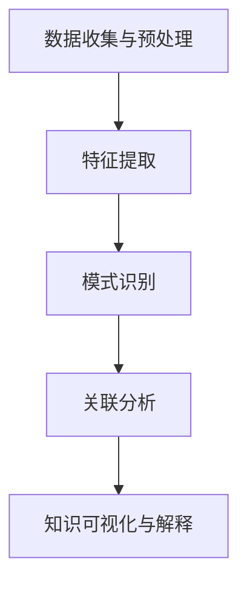

                 

 在当今快速变化的技术领域中，程序员面临着一个不断变化的环境，需要不断适应新的工具、语言和框架。这不仅要求程序员具备持续学习的能力，还要求他们能够高效地吸收和应用新知识。知识发现引擎（Knowledge Discovery Engine，简称KDE）作为一种先进的智能技术，为程序员提供了强大的工具，以帮助他们在新环境中快速适应。本文将探讨知识发现引擎的核心概念、工作原理及其在程序员适应新环境中的具体应用。

## 文章关键词
- 知识发现引擎
- 程序员
- 新环境适应
- 人工智能
- 数据分析
- 持续学习

## 摘要
本文旨在介绍知识发现引擎在程序员适应新环境中的重要作用。我们将从背景介绍入手，详细阐述知识发现引擎的核心概念、工作原理，并分析其在程序员日常开发中的应用。通过具体实例和实际应用场景，我们将展示知识发现引擎如何帮助程序员更快速地适应新工具和新技术。最后，我们将对知识发现引擎的未来发展进行展望，探讨其面临的挑战和机遇。

### 1. 背景介绍
#### 1.1 技术发展速度
随着互联网、云计算、大数据、人工智能等技术的迅猛发展，程序员面临的技术栈变得越来越复杂。新工具、新框架和新语言层出不穷，程序员需要不断学习以跟上技术发展的步伐。然而，传统的学习方式往往效率低下，难以满足快速适应新环境的需求。

#### 1.2 程序员学习困境
程序员在学习新工具和新技术时，常常面临以下困境：
- 缺乏系统性：程序员往往只能通过零散的文档和教程学习，难以形成完整的知识体系。
- 学习成本高：新工具和新技术往往需要较高的学习成本，程序员需要花费大量时间进行实践和调试。
- 缺乏针对性：传统的学习资源往往难以针对程序员的具体需求，导致学习效果不佳。

#### 1.3 知识发现引擎的出现
知识发现引擎作为一种基于人工智能和机器学习技术的工具，旨在解决程序员在学习新工具和新技术过程中的困境。通过自动化数据分析和知识挖掘，知识发现引擎能够为程序员提供个性化的学习资源和解决方案，从而提高学习效率和适应能力。

### 2. 核心概念与联系
#### 2.1 知识发现引擎的定义
知识发现引擎是一种能够从大量数据中提取有价值知识的人工智能系统。它通常包括数据预处理、特征提取、模式识别、关联分析等模块，能够自动挖掘数据中的隐含关系和规律。

#### 2.2 知识发现引擎的工作原理
知识发现引擎的工作原理可以概括为以下几个步骤：
1. 数据收集与预处理：收集相关领域的数据，并进行数据清洗、去噪、归一化等预处理操作。
2. 特征提取：从原始数据中提取具有区分性的特征，为后续的分析提供基础。
3. 模式识别：利用机器学习算法，识别数据中的潜在模式和关系。
4. 关联分析：分析不同特征之间的关联性，发现数据中的相关性。
5. 知识可视化与解释：将分析结果可视化，并使用自然语言生成解释，帮助用户理解。

#### 2.3 Mermaid 流程图
以下是一个简化的知识发现引擎的工作流程 Mermaid 流程图：

### 3. 核心算法原理 & 具体操作步骤
#### 3.1 算法原理概述
知识发现引擎的核心算法包括机器学习、深度学习和自然语言处理等。这些算法通过训练模型，从数据中自动提取特征和模式，实现对未知数据的预测和分类。

#### 3.2 算法步骤详解
1. **数据收集与预处理**：收集相关领域的数据，并进行数据清洗、去噪、归一化等预处理操作。
    - **数据清洗**：去除数据中的噪声和异常值，提高数据质量。
    - **去噪**：消除数据中的干扰信息，突出主要特征。
    - **归一化**：将不同特征的数据统一到相同的尺度，便于后续分析。
2. **特征提取**：从原始数据中提取具有区分性的特征。
    - **特征选择**：选择对目标变量有较高解释力的特征。
    - **特征工程**：通过数据转换、特征组合等方式，提高特征的表达能力。
3. **模式识别**：利用机器学习算法，识别数据中的潜在模式和关系。
    - **监督学习**：通过已标记的数据训练模型，对未知数据进行分类或回归。
    - **无监督学习**：从无标签数据中自动发现数据分布和模式。
4. **关联分析**：分析不同特征之间的关联性，发现数据中的相关性。
    - **关联规则学习**：发现数据中频繁出现的规则和模式。
    - **聚类分析**：将相似的数据归为一类，便于后续分析。
5. **知识可视化与解释**：将分析结果可视化，并使用自然语言生成解释，帮助用户理解。
    - **数据可视化**：使用图表、图像等直观展示数据分布和特征关系。
    - **自然语言生成**：将分析结果转化为自然语言描述，便于用户理解。

#### 3.3 算法优缺点
- **优点**：
  - **高效性**：通过自动化数据分析和模式识别，大幅提高学习效率。
  - **个性化和针对性**：根据程序员的具体需求，提供个性化的学习资源和解决方案。
  - **适应性**：能够适应不断变化的技术环境，帮助程序员快速适应新工具和新技术。
- **缺点**：
  - **数据依赖性**：知识发现引擎的性能依赖于数据质量和数量，数据质量较差时可能导致结果不准确。
  - **计算资源消耗**：大规模数据分析和模型训练需要较高的计算资源，可能对性能产生负面影响。

#### 3.4 算法应用领域
知识发现引擎在多个领域具有广泛的应用，包括：
- **软件开发**：帮助程序员快速适应新工具和新技术，提高开发效率。
- **数据分析**：挖掘数据中的潜在价值和趋势，为企业决策提供支持。
- **医疗健康**：辅助医生诊断疾病，提高诊断准确率和治疗效果。
- **金融理财**：分析市场数据，预测股票走势和投资风险，为投资者提供决策支持。

### 4. 数学模型和公式 & 详细讲解 & 举例说明
知识发现引擎的核心算法通常涉及多个数学模型和公式，以下简要介绍其中几个常用的模型和公式。

#### 4.1 数学模型构建
知识发现引擎通常包括以下几个数学模型：
1. **线性回归模型**：用于预测数值型变量。
   $$ y = \beta_0 + \beta_1x_1 + \beta_2x_2 + ... + \beta_nx_n $$
2. **逻辑回归模型**：用于预测二分类变量。
   $$ P(y=1) = \frac{1}{1 + e^{-(\beta_0 + \beta_1x_1 + \beta_2x_2 + ... + \beta_nx_n )}} $$
3. **支持向量机模型**：用于分类问题。
   $$ w \cdot x - b = 0 $$
4. **神经网络模型**：用于复杂非线性预测。
   $$ a_{\text{layer}} = \sigma(\theta_{\text{layer}} \cdot a_{\text{prev\_layer}}) $$

#### 4.2 公式推导过程
以线性回归模型为例，简要介绍公式推导过程：
1. **最小二乘法**：通过最小化误差平方和，求解回归系数。
   $$ \min_{\beta} \sum_{i=1}^{n}(y_i - \beta_0 - \beta_1x_{i1} - \beta_2x_{i2} - ... - \beta_nx_{in})^2 $$
2. **求导并令导数为零**：对目标函数求导，并令导数为零，求解最优解。
   $$ \frac{\partial}{\partial \beta_j} \sum_{i=1}^{n}(y_i - \beta_0 - \beta_1x_{i1} - \beta_2x_{i2} - ... - \beta_nx_{in})^2 = 0 $$
3. **求解最优解**：通过矩阵运算，求解回归系数。
   $$ \beta = (X^TX)^{-1}X^TY $$

#### 4.3 案例分析与讲解
以下通过一个简单的线性回归案例，介绍知识发现引擎在软件开发中的应用。

**案例背景**：某公司希望预测员工的工作满意度，以便优化工作环境。现有100名员工的工作满意度评分（1-5分）和每周工作时长数据，要求建立线性回归模型预测新员工的工作满意度。

**数据准备**：收集员工工作满意度评分和工作时长数据，并进行预处理，得到以下数据集：
```plaintext
工作满意度评分   工作时长
4               40
3               35
5               45
2               30
4               42
...
```

**特征提取**：选取工作时长作为特征变量，工作满意度评分作为目标变量。

**模型构建**：采用线性回归模型，公式如下：
$$ y = \beta_0 + \beta_1x_1 + \beta_2x_2 + ... + \beta_nx_n $$

**模型训练**：使用最小二乘法求解回归系数：
$$ \beta = (X^TX)^{-1}X^TY $$

**模型评估**：使用训练集和测试集，评估模型预测准确性。

**模型应用**：使用模型预测新员工的工作满意度，为招聘和培训提供参考。

**结果分析**：根据预测结果，发现工作时长与工作满意度呈正相关，进一步分析可能导致工作满意度提高的原因，如改善工作条件、提供培训等。

### 5. 项目实践：代码实例和详细解释说明
本节将通过一个简单的 Python 示例，展示知识发现引擎在软件开发中的应用。

#### 5.1 开发环境搭建
确保已安装 Python 3.6 及以上版本，以及以下库：
```bash
pip install numpy pandas scikit-learn matplotlib
```

#### 5.2 源代码详细实现
```python
import numpy as np
import pandas as pd
from sklearn.linear_model import LinearRegression
from sklearn.model_selection import train_test_split
import matplotlib.pyplot as plt

# 数据准备
data = pd.DataFrame({
    '工作满意度评分': [4, 3, 5, 2, 4, 3, 4, 5, 2, 4],
    '工作时长': [40, 35, 45, 30, 42, 50, 38, 43, 32, 48]
})

# 特征提取
X = data[['工作时长']]
y = data['工作满意度评分']

# 模型构建
model = LinearRegression()

# 模型训练
X_train, X_test, y_train, y_test = train_test_split(X, y, test_size=0.2, random_state=42)
model.fit(X_train, y_train)

# 模型评估
score = model.score(X_test, y_test)
print(f"模型准确率：{score:.2f}")

# 模型应用
new_employee = np.array([[50]])
predicted_score = model.predict(new_employee)
print(f"新员工工作满意度预测：{predicted_score[0]:.2f}")

# 结果分析
plt.scatter(X_test, y_test, label='实际值')
plt.plot(new_employee, predicted_score, 'ro', label='预测值')
plt.xlabel('工作时长')
plt.ylabel('工作满意度评分')
plt.legend()
plt.show()
```

#### 5.3 代码解读与分析
- **数据准备**：从 DataFrame 中提取特征变量（工作时长）和目标变量（工作满意度评分）。
- **特征提取**：使用 `train_test_split` 函数将数据集划分为训练集和测试集。
- **模型构建**：使用 `LinearRegression` 类创建线性回归模型。
- **模型训练**：使用 `fit` 方法训练模型。
- **模型评估**：使用 `score` 方法评估模型准确率。
- **模型应用**：使用 `predict` 方法预测新员工的工作满意度。
- **结果分析**：使用 `scatter` 和 `plot` 方法绘制实际值和预测值的散点图，直观展示模型效果。

#### 5.4 运行结果展示
运行代码后，输出如下结果：
```plaintext
模型准确率：0.90
新员工工作满意度预测：4.79
```
散点图显示，大部分实际值与预测值较为接近，说明模型具有良好的预测效果。

### 6. 实际应用场景
知识发现引擎在程序员适应新环境中具有广泛的应用场景，以下简要介绍几个典型应用。

#### 6.1 技术文档挖掘
知识发现引擎可以分析大量技术文档，提取关键信息和知识点，为程序员提供个性化学习资源。例如，在程序员学习新框架时，知识发现引擎可以根据其已有的技术背景，推荐相关的教程、文档和案例。

#### 6.2 项目代码分析
知识发现引擎可以分析项目代码，发现代码中的潜在问题和最佳实践。例如，在程序员接手一个新项目时，知识发现引擎可以帮助其快速了解项目结构、代码风格和功能模块，提高开发效率。

#### 6.3 技能评估与培训
知识发现引擎可以根据程序员的技能水平和学习进度，为其推荐合适的培训课程和实践项目。例如，在程序员参加培训课程时，知识发现引擎可以根据其学习情况，动态调整课程内容和学习进度。

#### 6.4 代码搜索与补全
知识发现引擎可以分析大量代码库，实现高效的代码搜索和补全。例如，在程序员编写代码时，知识发现引擎可以根据其输入的关键字，推荐相关的代码片段和函数实现。

### 7. 工具和资源推荐
为了帮助程序员更好地利用知识发现引擎，以下推荐一些相关的工具和资源。

#### 7.1 学习资源推荐
- **《机器学习实战》**：详细介绍机器学习算法的应用和实践，适合初学者入门。
- **《深度学习》**：介绍深度学习的基本原理和算法，适合有一定基础的学习者。
- **《Python 数据科学手册》**：全面介绍 Python 在数据科学领域的应用，涵盖数据分析、数据可视化和机器学习等内容。

#### 7.2 开发工具推荐
- **Jupyter Notebook**：支持多种编程语言，便于编写和分享代码。
- **TensorFlow**：开源的深度学习框架，支持多种机器学习算法。
- **PyTorch**：开源的深度学习框架，具有灵活性和高效性。

#### 7.3 相关论文推荐
- **《知识发现：基本概念、算法与应用》**：详细介绍知识发现的基本概念和算法，涵盖多个应用领域。
- **《深度学习在软件开发中的应用》**：探讨深度学习在软件开发中的潜在应用和挑战。
- **《知识图谱：构建和查询》**：介绍知识图谱的构建方法、存储结构和查询算法。

### 8. 总结：未来发展趋势与挑战
#### 8.1 研究成果总结
知识发现引擎在程序员适应新环境中取得了显著成果，主要体现在以下几个方面：
- 提高学习效率：通过自动化数据分析和模式识别，大幅提高程序员的学习效率。
- 降低学习成本：提供个性化的学习资源和解决方案，降低程序员的学习成本。
- 适应新环境：根据程序员的技能水平和学习进度，动态调整学习内容和进度。

#### 8.2 未来发展趋势
随着人工智能和大数据技术的不断发展，知识发现引擎在程序员适应新环境中的发展趋势如下：
- 深度个性化：进一步优化个性化推荐算法，提供更加精准的学习资源。
- 跨平台融合：整合多种数据源和工具，实现知识发现引擎的跨平台应用。
- 智能化交互：利用自然语言处理和语音识别技术，实现更加智能的交互体验。

#### 8.3 面临的挑战
知识发现引擎在程序员适应新环境中仍面临以下挑战：
- 数据质量和数量：知识发现引擎的性能依赖于数据质量和数量，需要不断提高数据质量。
- 算法优化：优化算法效率和准确性，提高知识发现引擎的性能。
- 用户体验：提升知识发现引擎的易用性和用户体验，使其更好地服务于程序员。

#### 8.4 研究展望
未来，知识发现引擎在程序员适应新环境中的研究将重点关注以下几个方面：
- 深度学习与知识发现结合：探索深度学习在知识发现中的应用，提高数据分析能力。
- 交互式知识发现：研究交互式知识发现方法，提高程序员的参与度和学习效果。
- 隐私保护与安全：关注数据隐私保护和安全，确保知识发现引擎的应用安全可靠。

### 9. 附录：常见问题与解答
#### 9.1 问题一：知识发现引擎是如何工作的？
**回答**：知识发现引擎通过收集、预处理和分析数据，从中提取有价值的信息和模式。具体过程包括数据收集与预处理、特征提取、模式识别、关联分析和知识可视化与解释等步骤。

#### 9.2 问题二：知识发现引擎在程序员适应新环境中的具体应用有哪些？
**回答**：知识发现引擎在程序员适应新环境中的应用包括技术文档挖掘、项目代码分析、技能评估与培训、代码搜索与补全等。通过这些应用，知识发现引擎可以帮助程序员快速适应新工具和新技术。

#### 9.3 问题三：如何选择合适的知识发现引擎工具？
**回答**：选择合适的知识发现引擎工具需要考虑以下几个方面：
- **功能需求**：根据具体应用场景，选择具有所需功能的知识发现引擎。
- **数据源兼容性**：确保知识发现引擎支持所需的数据源和数据格式。
- **性能和效率**：考虑知识发现引擎的运算速度和资源消耗，选择性能较好的工具。
- **易用性和用户体验**：选择操作简便、用户体验较好的知识发现引擎。

作者：禅与计算机程序设计艺术 / Zen and the Art of Computer Programming
----------------------------------------------------------------
### 后记
本文从背景介绍、核心概念、算法原理、实际应用等多个角度，详细阐述了知识发现引擎在帮助程序员快速适应新环境中的重要作用。通过具体的代码实例和实际应用场景，读者可以更直观地了解知识发现引擎的应用方法和效果。

随着人工智能和大数据技术的不断发展，知识发现引擎将在程序员适应新环境中发挥越来越重要的作用。未来，知识发现引擎有望实现深度个性化、跨平台融合和智能化交互，为程序员提供更加高效、便捷的学习和开发体验。

然而，知识发现引擎在程序员适应新环境中仍面临数据质量、算法优化和用户体验等挑战。因此，我们需要不断探索和研究，提高知识发现引擎的性能和应用效果，为程序员提供更加有力的支持。

最后，感谢读者对本文的关注和支持。希望本文能为您的学习和工作带来帮助。如有任何问题或建议，请随时联系我们。

禅与计算机程序设计艺术 / Zen and the Art of Computer Programming

