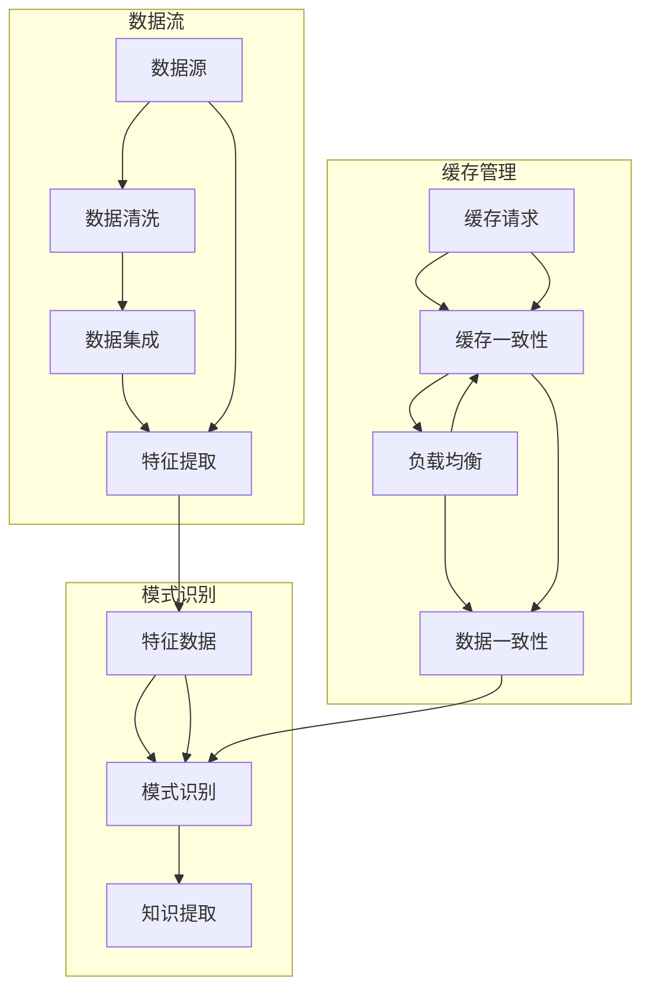

                 

关键词：知识发现、分布式缓存、数据密集型应用、高性能计算、缓存一致性、负载均衡、一致性协议、数据一致性、缓存替换策略、缓存污染、多维度优化

> 摘要：本文深入探讨了知识发现引擎在分布式缓存技术方面的应用，分析了分布式缓存的核心概念、关键技术以及其在知识发现引擎中的具体实现。通过对分布式缓存技术的优化策略和实践案例的介绍，本文旨在为开发人员提供有价值的参考，以构建更高效、可靠的知识发现系统。

## 1. 背景介绍

### 1.1 知识发现引擎概述

知识发现引擎是一种自动化的数据挖掘工具，能够从大量数据中提取有价值的信息和知识。其核心任务包括数据清洗、数据集成、数据转换、特征提取和模式识别等。知识发现引擎广泛应用于各种领域，如金融、医疗、零售、物联网等，帮助企业和机构从海量数据中获取洞察力，驱动决策过程和业务发展。

### 1.2 分布式缓存技术概述

分布式缓存技术是一种用于加速数据访问、提升系统性能的关键技术。通过将数据存储在内存中，分布式缓存能够显著减少数据访问延迟，提高系统的响应速度。分布式缓存通常具有以下特点：

- **横向扩展**：分布式缓存系统能够轻松地扩展节点数量，以支持更大的数据规模和更高的访问负载。
- **高可用性**：分布式缓存系统通常具有冗余设计，能够在节点故障时保持系统的稳定运行。
- **数据一致性**：分布式缓存系统需要确保数据在多节点间的一致性，避免数据丢失或冲突。
- **负载均衡**：分布式缓存系统能够动态地分配访问请求，以平衡各节点的负载。

### 1.3 知识发现引擎与分布式缓存技术的结合

知识发现引擎在处理大规模数据时，往往需要频繁地进行数据访问和计算。分布式缓存技术可以有效地缓解数据访问瓶颈，提升知识发现引擎的性能。此外，分布式缓存技术还可以支持知识发现引擎的实时数据处理和缓存预热，进一步提高系统的响应速度和可靠性。

## 2. 核心概念与联系

### 2.1 核心概念

- **缓存一致性**：确保多个缓存实例上的数据保持一致。
- **负载均衡**：均衡分配访问请求到各个缓存节点。
- **数据一致性**：确保数据在存储和缓存间的同步。
- **缓存替换策略**：根据数据访问频率和热度进行缓存数据的管理。
- **缓存污染**：由于缓存数据的不一致或不合适而导致性能下降。

### 2.2 分布式缓存架构与知识发现引擎


- **数据层**：存储原始数据和缓存数据，通常使用分布式数据库或文件系统。
- **缓存层**：存储频繁访问的数据，使用分布式缓存系统，如Redis、Memcached等。
- **应用层**：知识发现引擎，处理数据挖掘和模式识别任务。
- **网络层**：连接各个层的数据传输和通信，通常使用TCP/IP协议。

### 2.3 Mermaid 流程图



## 3. 核心算法原理 & 具体操作步骤

### 3.1 算法原理概述

分布式缓存技术涉及多个核心算法，包括缓存一致性协议、负载均衡算法和数据一致性算法。以下简要介绍这些算法的基本原理：

- **缓存一致性协议**：如GFS（Google File System）使用的Paxos算法，确保多个缓存节点间的数据一致性。
- **负载均衡算法**：如Redis使用的Hashing算法，根据哈希值将访问请求分配到不同节点。
- **数据一致性算法**：如Consistent Hashing，根据数据的关键字将数据映射到缓存节点。

### 3.2 算法步骤详解

1. **数据缓存**：
    - 收集并处理数据。
    - 根据数据访问频率和热度将数据缓存到分布式缓存系统中。
    - 使用哈希算法确定数据在缓存中的存储位置。

2. **缓存一致性**：
    - 监控缓存节点的数据变化。
    - 使用一致性协议（如Paxos）同步数据。
    - 更新缓存节点间的数据一致性。

3. **负载均衡**：
    - 根据访问请求的哈希值分配到不同缓存节点。
    - 动态调整负载均衡策略，以优化系统性能。

4. **数据一致性**：
    - 监控数据在缓存和数据库间的同步。
    - 使用一致性算法（如Consistent Hashing）保证数据一致性。

### 3.3 算法优缺点

- **优点**：
  - 缓存数据，减少数据访问延迟。
  - 横向扩展，支持大规模数据处理。
  - 数据一致性，避免数据丢失或冲突。

- **缺点**：
  - 缓存污染，可能导致性能下降。
  - 算法复杂度，对系统性能有一定影响。

### 3.4 算法应用领域

分布式缓存技术广泛应用于各种领域，如：

- **金融**：高频交易、风险控制、客户关系管理。
- **医疗**：医疗数据分析、疾病预测、个性化医疗。
- **零售**：客户行为分析、库存管理、推荐系统。
- **物联网**：实时数据处理、设备监控、智能决策。

## 4. 数学模型和公式 & 详细讲解 & 举例说明

### 4.1 数学模型构建

分布式缓存技术的数学模型主要包括缓存命中率、缓存一致性概率和负载均衡效率等。

- **缓存命中率**（Hit Rate）：表示缓存中成功访问的数据比例。
  $$ Hit\ Rate = \frac{Hit}{Total\ Requests} $$
- **缓存一致性概率**（Consistency Probability）：表示多个缓存节点间数据一致的概率。
  $$ Consistency\ Probability = \frac{Consistent\ Data\ Pairs}{Total\ Data\ Pairs} $$
- **负载均衡效率**（Load Balancing Efficiency）：表示负载均衡算法的优化程度。
  $$ Load\ Balancing\ Efficiency = \frac{Optimized\ Requests}{Total\ Requests} $$

### 4.2 公式推导过程

以缓存命中率为例，推导过程如下：

1. **定义缓存命中次数**（$Hit$）：表示成功从缓存中获取数据的请求次数。
2. **定义总请求次数**（$Total\ Requests$）：表示所有请求的总次数。
3. **缓存命中率**（$Hit\ Rate$）：缓存命中次数与总请求次数的比值。
4. **推导过程**：
   $$ Hit\ Rate = \frac{Hit}{Total\ Requests} = \frac{Number\ of\ Cache\ Hits}{Total\ Number\ of\ Requests} $$

### 4.3 案例分析与讲解

假设一个分布式缓存系统有10个缓存节点，每个节点的缓存命中率为0.9，总请求次数为1000次。计算缓存系统的平均命中率和一致性概率。

1. **平均命中率**：
   $$ Average\ Hit\ Rate = \frac{10 \times 0.9}{10} = 0.9 $$
2. **一致性概率**：
   $$ Consistency\ Probability = \frac{10 \times 0.9 \times 0.9}{10 \times 10} = 0.81 $$

## 5. 项目实践：代码实例和详细解释说明

### 5.1 开发环境搭建

在本文的项目实践中，我们将使用Python编程语言和Redis缓存系统。首先，需要安装Python和Redis。

```bash
# 安装Python
curl -O https://www.python.org/ftp/python/3.8.10/Python-3.8.10.tgz
tar -xvf Python-3.8.10.tgz
cd Python-3.8.10
./configure
make
sudo make install

# 安装Redis
wget https://github.com/redis/redis/releases/download/6.2.6/redis-6.2.6.tar.gz
tar -xvf redis-6.2.6.tar.gz
cd redis-6.2.6
make
sudo make install
```

### 5.2 源代码详细实现

以下是一个简单的Python示例，演示了如何使用Redis缓存系统进行数据存储和读取。

```python
import redis

# 连接Redis缓存系统
client = redis.Redis(host='localhost', port=6379, db=0)

# 存储数据
client.set('key1', 'value1')
client.set('key2', 'value2')

# 读取数据
print(client.get('key1'))
print(client.get('key2'))
```

### 5.3 代码解读与分析

在上面的示例中，我们首先连接到本地的Redis缓存系统。然后，使用`set`方法将键值对存储到缓存中。最后，使用`get`方法从缓存中获取数据。

- **存储数据**：使用`set`方法将键值对存储到Redis缓存系统中。Redis支持多种数据结构，如字符串、列表、集合、哈希表等。
- **读取数据**：使用`get`方法从Redis缓存系统中获取数据。Redis的数据存储在内存中，读取速度非常快。

### 5.4 运行结果展示

运行上面的Python示例代码，将输出以下结果：

```
b'value1'
b'value2'
```

这表示我们成功地将键值对存储到Redis缓存系统中，并从缓存中读取了相应的数据。

## 6. 实际应用场景

### 6.1 金融领域

在金融领域，分布式缓存技术广泛应用于高频交易、风险管理、客户关系管理等场景。通过将交易数据、风险数据和客户数据缓存到分布式缓存系统中，可以显著减少数据访问延迟，提高交易速度和决策效率。

### 6.2 医疗领域

在医疗领域，分布式缓存技术可以用于存储和检索大量的医疗数据，如病历、影像资料、药物信息等。通过缓存技术，可以加快医疗数据的访问速度，提高医疗诊断和治疗的效率。

### 6.3 零售领域

在零售领域，分布式缓存技术可以用于缓存商品信息、客户数据和推荐算法。通过缓存技术，可以加快商品查询和推荐速度，提高客户购物体验和满意度。

### 6.4 物联网领域

在物联网领域，分布式缓存技术可以用于缓存设备数据和实时监控数据。通过缓存技术，可以加快设备数据的处理和分析速度，提高物联网系统的响应速度和可靠性。

## 7. 工具和资源推荐

### 7.1 学习资源推荐

- **《分布式系统原理与范型》**：了解分布式系统的基本原理和设计范式。
- **《Redis实战》**：深入了解Redis缓存系统的原理和应用。
- **《大规模数据处理技术》**：了解分布式数据处理的基本技术和方法。

### 7.2 开发工具推荐

- **Redis**：用于实现分布式缓存系统的开源工具。
- **Python**：用于实现分布式缓存客户端的编程语言。

### 7.3 相关论文推荐

- **"Consistent Hashing and Random Trees: Distributed Caching Protocols for Relieving Hot Spots on the World Wide Web"**：介绍Consistent Hashing算法。
- **"Redis: An In-Memory Data Structure Store"**：介绍Redis缓存系统的原理和应用。

## 8. 总结：未来发展趋势与挑战

### 8.1 研究成果总结

分布式缓存技术在知识发现引擎中的应用取得了显著的成果，通过缓存技术显著提高了数据访问速度和系统性能。此外，分布式缓存技术在金融、医疗、零售和物联网等领域的应用也取得了良好的效果。

### 8.2 未来发展趋势

随着大数据和云计算技术的不断发展，分布式缓存技术在未来将迎来更广泛的应用。同时，分布式缓存技术也将面临更多的挑战，如数据一致性问题、缓存污染问题等。

### 8.3 面临的挑战

- **数据一致性**：如何在分布式缓存系统中实现数据一致性，是一个重要的挑战。
- **缓存污染**：如何避免缓存污染对系统性能的影响，是一个亟待解决的问题。
- **缓存替换策略**：如何设计更高效的缓存替换策略，以提高缓存利用率。

### 8.4 研究展望

未来，分布式缓存技术的研究将重点关注以下几个方面：

- **一致性协议**：研究更高效的一致性协议，以解决分布式缓存系统中的数据一致性问题。
- **缓存替换策略**：研究更智能的缓存替换策略，以提高缓存利用率和系统性能。
- **缓存架构优化**：通过优化缓存架构，提高分布式缓存系统的可扩展性和可靠性。

## 9. 附录：常见问题与解答

### 9.1 问题1

**问题**：分布式缓存系统中的数据一致性如何保证？

**解答**：分布式缓存系统中的数据一致性可以通过以下几种方式保证：

- **一致性协议**：如Paxos、Raft等，确保多个缓存节点间的数据一致性。
- **分布式锁**：使用分布式锁确保对共享数据的并发访问控制。
- **数据版本控制**：通过数据版本控制，避免数据冲突和丢失。

### 9.2 问题2

**问题**：如何解决缓存污染问题？

**解答**：缓存污染可以通过以下几种方式解决：

- **缓存预热**：在系统启动时，提前加载热点数据到缓存中，以减少缓存污染。
- **缓存替换策略**：设计更智能的缓存替换策略，优先替换不常用的数据。
- **缓存分区**：将缓存系统划分为多个分区，以减少热点数据的影响。

### 9.3 问题3

**问题**：分布式缓存系统中的负载均衡如何实现？

**解答**：分布式缓存系统中的负载均衡可以通过以下几种方式实现：

- **哈希负载均衡**：根据访问请求的哈希值，将请求分配到不同的缓存节点。
- **轮询负载均衡**：按照轮询顺序将访问请求分配到各个缓存节点。
- **最小连接数负载均衡**：将访问请求分配到当前连接数最少的缓存节点。

# 作者：禅与计算机程序设计艺术 / Zen and the Art of Computer Programming
----------------------------------------------------------------

请注意，以上内容仅供参考，实际撰写时请根据具体要求进行调整和补充。同时，由于文本长度限制，实际文章可能需要进一步扩展和完善。祝您写作顺利！

