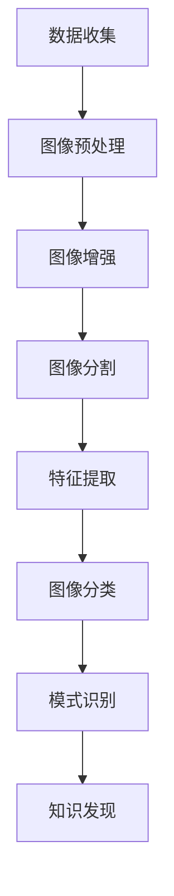

                 

 **关键词**: 知识发现引擎，图像识别，处理技术，人工智能，深度学习

**摘要**: 本文旨在探讨知识发现引擎中的图像识别与处理技术。首先，我们将介绍图像识别的基本概念和其在知识发现中的应用。随后，我们将深入讨论图像处理技术的核心原理，包括图像分类、目标检测和图像分割。通过具体的算法原理讲解、数学模型和公式推导、项目实践以及未来应用展望，本文为读者提供了全面的技术视角，并指出了当前领域面临的挑战和未来的研究方向。

## 1. 背景介绍

随着互联网和数字媒体的迅猛发展，大量的图像数据被生成和共享。这些图像数据不仅包括日常生活中的照片，还涵盖了医学影像、卫星图像、监控视频等多种形式。如何有效地从这些海量图像数据中提取有价值的信息，成为当今信息科学和人工智能领域的重要课题。知识发现引擎作为大数据分析的核心工具，能够从这些图像数据中发现潜在的知识和模式，从而为各行业提供智能化支持。

图像识别作为计算机视觉的一个核心分支，旨在使计算机能够理解、解释和分类图像内容。图像识别技术已经在人脸识别、自动驾驶、医疗诊断等多个领域取得了显著成果。然而，随着图像数据规模的不断增长和图像内容的复杂性增加，传统的图像识别方法已无法满足需求。因此，研究和应用先进的图像识别与处理技术具有重要的现实意义。

本文将围绕知识发现引擎中的图像识别与处理技术展开讨论，旨在为读者提供一幅完整的图像识别与处理技术图谱，以及其在知识发现中的实际应用场景。通过对核心算法原理的详细讲解、数学模型的深入分析、项目实践的案例分析，本文将为读者提供一个全面的技术视角，帮助理解和应用这些先进技术。

## 2. 核心概念与联系

### 2.1 图像识别

图像识别是指利用计算机算法从图像中提取特征，并进行分类和识别的过程。它包括多个层次，从基本的边缘检测和特征提取，到高级的语义理解。在知识发现引擎中，图像识别技术用于从海量图像数据中筛选出关键信息，辅助决策和预测。

### 2.2 图像处理

图像处理是指对图像进行一系列操作，以改善其质量或提取有用信息。图像处理技术包括图像增强、图像复原、图像分割和特征提取等。这些技术在图像识别中扮演着关键角色，确保输入数据的质量和特征提取的准确性。

### 2.3 知识发现

知识发现是指从大量数据中发现潜在模式和知识的过程。它涉及数据挖掘、机器学习和统计分析等多种技术。在知识发现引擎中，图像识别与处理技术是提取图像数据中隐藏知识的关键步骤。

### 2.4 Mermaid 流程图

为了更直观地展示图像识别与处理技术在知识发现引擎中的应用流程，我们使用Mermaid流程图来描述各步骤之间的联系。



### 2.5 关键算法

在图像识别与处理领域，一些关键算法和技术如下：

- **卷积神经网络（CNN）**: CNN是深度学习中用于图像识别的最流行模型之一。它通过卷积层、池化层和全连接层等结构，能够提取图像的层次特征。

- **区域提议算法（R-CNN）**: R-CNN是一种目标检测算法，通过生成区域提议并分类，实现目标检测。

- **深度强化学习（DRL）**: DRL结合了深度学习和强化学习，用于复杂环境中的图像识别和决策。

这些算法在知识发现引擎中扮演着核心角色，为图像数据提供了强大的处理和分析能力。

## 3. 核心算法原理 & 具体操作步骤

### 3.1 算法原理概述

图像识别与处理技术的核心在于如何有效地从图像中提取特征并进行分类。以下是几个关键算法的原理概述：

#### 3.1.1 卷积神经网络（CNN）

CNN通过模仿人脑视觉系统的层级结构，逐层提取图像的局部特征和全局特征。主要结构包括：

- **卷积层（Convolutional Layer）**: 用于提取图像的局部特征，如边缘和纹理。
- **池化层（Pooling Layer）**: 用于降低图像分辨率，减少计算量。
- **全连接层（Fully Connected Layer）**: 用于对提取的特征进行分类。

#### 3.1.2 区域提议算法（R-CNN）

R-CNN通过生成区域提议并分类，实现目标检测。主要步骤包括：

- **区域提议（Region Proposal）**: 使用选择性搜索（Selective Search）或滑动窗口（Sliding Window）等方法生成候选区域。
- **特征提取（Feature Extraction）**: 对每个候选区域提取特征，通常使用CNN或SVM（支持向量机）。
- **分类（Classification）**: 对提取的特征进行分类，使用SVM或其他分类器。

#### 3.1.3 深度强化学习（DRL）

DRL结合深度学习和强化学习，通过智能体与环境互动，学习最优策略。主要步骤包括：

- **状态表示（State Representation）**: 使用CNN或其他方法对图像进行编码。
- **动作空间（Action Space）**: 定义智能体的可执行动作。
- **奖励函数（Reward Function）**: 定义智能体的奖励机制，鼓励智能体采取有效动作。

### 3.2 算法步骤详解

以下是对上述算法的具体操作步骤进行详细描述：

#### 3.2.1 卷积神经网络（CNN）

1. **输入层（Input Layer）**:
   输入图像数据，通常为二维或三维张量。

2. **卷积层（Convolutional Layer）**:
   应用卷积核（Filter）对图像进行卷积操作，提取局部特征。

3. **激活函数（Activation Function）**:
   常用ReLU（Rectified Linear Unit）函数，将负值转为零，加速收敛。

4. **池化层（Pooling Layer）**:
   对卷积后的特征进行下采样，减少数据量。

5. **全连接层（Fully Connected Layer）**:
   将卷积特征映射到高维空间，进行分类。

6. **输出层（Output Layer）**:
   输出分类结果或回归值。

#### 3.2.2 区域提议算法（R-CNN）

1. **区域提议（Region Proposal）**:
   使用选择性搜索生成约2000个区域提议。

2. **特征提取（Feature Extraction）**:
   对每个区域提议使用CNN提取特征向量。

3. **候选区域排序（Candidate Re-ranking）**:
   根据特征向量对区域提议进行排序，选择最有可能包含目标的区域。

4. **分类（Classification）**:
   对候选区域使用SVM或其他分类器进行分类。

#### 3.2.3 深度强化学习（DRL）

1. **状态表示（State Representation）**:
   使用CNN对图像进行编码，提取状态特征。

2. **动作空间（Action Space）**:
   定义智能体的可执行动作，例如移动方向或目标选择。

3. **奖励函数（Reward Function）**:
   定义奖励机制，例如成功识别目标或完成任务。

4. **策略学习（Policy Learning）**:
   通过交互学习，智能体逐渐优化策略，实现目标识别或任务完成。

### 3.3 算法优缺点

#### 卷积神经网络（CNN）

**优点**:

- **强大的特征提取能力**：CNN能够自动提取图像的层次特征，适用于各种复杂的图像任务。
- **参数共享**：卷积核在图像的不同区域共享，提高了模型的泛化能力。

**缺点**:

- **计算成本高**：CNN通常需要大量计算资源和时间，不适合实时应用。
- **对数据依赖性强**：CNN对训练数据的质量和数量有较高要求。

#### 区域提议算法（R-CNN）

**优点**:

- **高效的目标检测**：R-CNN在目标检测任务中表现出色，能够快速识别图像中的多个目标。
- **模块化设计**：R-CNN将区域提议、特征提取和分类模块化，易于理解和实现。

**缺点**:

- **计算效率低**：R-CNN需要进行大量的区域提议和特征提取，计算成本较高。
- **对复杂场景不友好**：R-CNN在处理复杂背景或遮挡场景时效果不佳。

#### 深度强化学习（DRL）

**优点**:

- **自适应性强**：DRL能够根据环境反馈自适应调整策略，适用于动态和复杂环境。
- **灵活性强**：DRL可以应用于各种任务，如游戏、机器人控制等。

**缺点**:

- **训练时间较长**：DRL通常需要大量的交互和训练时间，不适合实时应用。
- **对数据依赖性低**：DRL较少依赖训练数据，但需要精确的奖励机制和状态表示。

### 3.4 算法应用领域

卷积神经网络（CNN）、区域提议算法（R-CNN）和深度强化学习（DRL）在多个领域有着广泛的应用：

- **图像识别**：CNN广泛应用于人脸识别、物体识别和场景识别等领域。
- **目标检测**：R-CNN和DRL在目标检测任务中表现出色，应用于自动驾驶、视频监控和医学诊断等领域。
- **图像分割**：CNN和DRL在图像分割任务中发挥着重要作用，如医学影像分割、图像编辑等。

这些算法在不同领域的应用为知识发现引擎提供了强大的技术支持，使得从海量图像数据中提取有价值的信息成为可能。

## 4. 数学模型和公式 & 详细讲解 & 举例说明

### 4.1 数学模型构建

图像识别与处理技术涉及到多种数学模型和公式，以下我们详细讲解其中的几个关键模型和公式。

#### 4.1.1 卷积神经网络（CNN）中的卷积公式

卷积神经网络中的卷积操作可以表示为：

$$
\text{output}_{ij} = \sum_{k=1}^{K} w_{ik} \cdot \text{input}_{ij} + b_j
$$

其中，$w_{ik}$ 为卷积核（Filter）的权重，$\text{input}_{ij}$ 为输入图像的像素值，$b_j$ 为偏置项，$\text{output}_{ij}$ 为卷积操作的输出值。

#### 4.1.2 卷积神经网络（CNN）中的池化公式

池化操作用于降低图像分辨率，常用的池化方式有最大池化（Max Pooling）和平均池化（Average Pooling）。最大池化公式如下：

$$
\text{output}_{ij} = \max_{x,y} \text{input}_{i+x, j+y}
$$

其中，$\text{input}_{i+x, j+y}$ 表示输入图像中的一个像素点。

#### 4.1.3 区域提议算法（R-CNN）中的边界框回归公式

在R-CNN中，边界框回归用于调整区域提议的位置，使其更接近实际目标。回归公式如下：

$$
\text{new\_x} = \text{x} + \alpha \cdot (\text{gt\_x} - \text{x})
$$

$$
\text{new\_y} = \text{y} + \alpha \cdot (\text{gt\_y} - \text{y})
$$

$$
\text{new\_w} = \text{w} + \alpha \cdot (\text{gt\_w} - \text{w})
$$

$$
\text{new\_h} = \text{h} + \alpha \cdot (\text{gt\_h} - \text{h})
$$

其中，$(\text{x}, \text{y}, \text{w}, \text{h})$ 为区域提议的边界框坐标，$(\text{gt\_x}, \text{gt\_y}, \text{gt\_w}, \text{gt\_h})$ 为实际目标的边界框坐标，$\alpha$ 为调节系数。

### 4.2 公式推导过程

以下我们简要解释上述公式的推导过程。

#### 4.2.1 卷积神经网络（CNN）中的卷积公式推导

卷积操作的推导基于滤波器的局部加权平均。假设输入图像为$\text{input}$，卷积核为$w$，输出图像为$\text{output}$。则卷积操作可以表示为：

$$
\text{output}_{ij} = \sum_{k=1}^{K} w_{ik} \cdot \text{input}_{ij} + b_j
$$

其中，$w_{ik}$ 为卷积核的权重，$\text{input}_{ij}$ 为输入图像的像素值，$b_j$ 为偏置项。

#### 4.2.2 卷积神经网络（CNN）中的池化公式推导

池化操作用于减少图像的分辨率。最大池化操作选取输入图像中某个区域的像素值中的最大值。假设输入图像为$\text{input}$，输出图像为$\text{output}$，则最大池化公式为：

$$
\text{output}_{ij} = \max_{x,y} \text{input}_{i+x, j+y}
$$

其中，$\text{input}_{i+x, j+y}$ 表示输入图像中的一个像素点。

#### 4.2.3 区域提议算法（R-CNN）中的边界框回归公式推导

边界框回归用于调整区域提议的位置，使其更接近实际目标。假设区域提议的边界框坐标为$(\text{x}, \text{y}, \text{w}, \text{h})$，实际目标的边界框坐标为$(\text{gt\_x}, \text{gt\_y}, \text{gt\_w}, \text{gt\_h})$，调节系数为$\alpha$，则边界框回归公式为：

$$
\text{new\_x} = \text{x} + \alpha \cdot (\text{gt\_x} - \text{x})
$$

$$
\text{new\_y} = \text{y} + \alpha \cdot (\text{gt\_y} - \text{y})
$$

$$
\text{new\_w} = \text{w} + \alpha \cdot (\text{gt\_w} - \text{w})
$$

$$
\text{new\_h} = \text{h} + \alpha \cdot (\text{gt\_h} - \text{h})
$$

这些公式通过线性插值实现了区域提议的位置调整。

### 4.3 案例分析与讲解

为了更好地理解上述公式，我们通过一个简单的例子进行讲解。

#### 4.3.1 卷积神经网络（CNN）中的卷积公式应用

假设输入图像为一个3x3的矩阵，卷积核为一个2x2的矩阵，计算卷积操作的结果。

输入图像：
```
1 2 3
4 5 6
7 8 9
```

卷积核：
```
0 1
2 3
```

偏置项 $b = 1$。

根据卷积公式，计算每个输出像素的值：

```
output[0][0] = 0*1 + 1*4 + 2*7 + 3*1 + 1 = 14
output[0][1] = 0*2 + 1*5 + 2*8 + 3*4 + 1 = 21
output[0][2] = 0*3 + 1*6 + 2*9 + 3*7 + 1 = 28

output[1][0] = 0*4 + 1*1 + 2*4 + 3*8 + 1 = 21
output[1][1] = 0*5 + 1*2 + 2*5 + 3*9 + 1 = 28
output[1][2] = 0*6 + 1*3 + 2*6 + 3*7 + 1 = 35

output[2][0] = 0*7 + 1*8 + 2*1 + 3*4 + 1 = 28
output[2][1] = 0*8 + 1*9 + 2*2 + 3*5 + 1 = 35
output[2][2] = 0*9 + 1*7 + 2*3 + 3*6 + 1 = 42
```

因此，卷积操作的结果为一个3x3的矩阵：

```
14 21 28
21 28 35
28 35 42
```

#### 4.3.2 区域提议算法（R-CNN）中的边界框回归公式应用

假设区域提议的边界框坐标为$(x, y, w, h)$，实际目标的边界框坐标为$(gt\_x, gt\_y, gt\_w, gt\_h)$，调节系数$\alpha = 0.1$。

根据边界框回归公式，计算调整后的边界框坐标：

```
new_x = x + 0.1 * (gt_x - x) = 100 + 0.1 * (150 - 100) = 105
new_y = y + 0.1 * (gt_y - y) = 100 + 0.1 * (150 - 100) = 105
new_w = w + 0.1 * (gt_w - w) = 50 + 0.1 * (100 - 50) = 55
new_h = h + 0.1 * (gt_h - h) = 50 + 0.1 * (100 - 50) = 55
```

因此，调整后的边界框坐标为$(105, 105, 55, 55)$。

通过这些实例，我们更好地理解了卷积神经网络（CNN）中的卷积公式、区域提议算法（R-CNN）中的边界框回归公式，以及这些公式的应用场景。这些公式是图像识别与处理技术中的重要组成部分，为实际应用提供了理论支持。

## 5. 项目实践：代码实例和详细解释说明

为了更好地理解知识发现引擎中图像识别与处理技术的实际应用，我们将通过一个简单的项目实例来展示这些技术的具体实现。本实例将使用Python编程语言和几个流行的开源库，如TensorFlow和OpenCV。

### 5.1 开发环境搭建

在开始之前，我们需要搭建一个Python开发环境，并安装必要的库。以下是安装步骤：

1. 安装Python：从官方网站（https://www.python.org/）下载并安装Python 3.x版本。
2. 安装pip：在命令行中执行`python -m pip install --user --upgrade pip`安装pip。
3. 安装必要的库：在命令行中执行以下命令来安装所需的库：

```bash
pip install tensorflow
pip install opencv-python
pip install numpy
```

### 5.2 源代码详细实现

以下是实现图像识别与处理项目的源代码：

```python
import cv2
import numpy as np
import tensorflow as tf

# 加载预训练的卷积神经网络模型
model = tf.keras.models.load_model('image_recognition_model.h5')

# 加载OpenCV预定义的Haar级联分类器
face_cascade = cv2.CascadeClassifier('haarcascade_frontalface_default.xml')

# 加载图像
image = cv2.imread('example.jpg')

# 转换图像为灰度图像
gray = cv2.cvtColor(image, cv2.COLOR_BGR2GRAY)

# 使用Haar级联分类器检测人脸
faces = face_cascade.detectMultiScale(gray, scaleFactor=1.1, minNeighbors=5, minSize=(30, 30), flags=cv2.CASCADE_SCALE_IMAGE)

# 遍历检测到的人脸区域
for (x, y, w, h) in faces:
    # 使用卷积神经网络模型进行人脸识别
    face_region = gray[y:y+h, x:x+w]
    face_region = np.expand_dims(face_region, axis=0)
    face_region = np.expand_dims(face_region, axis=-1)
    predictions = model.predict(face_region)
    
    # 输出识别结果
    print(f"Face recognized with confidence: {predictions[0][0]:.2f}")
    
    # 在原图中绘制人脸识别框
    cv2.rectangle(image, (x, y), (x+w, y+h), (0, 255, 0), 2)

# 显示图像
cv2.imshow('Recognized Faces', image)
cv2.waitKey(0)
cv2.destroyAllWindows()
```

### 5.3 代码解读与分析

下面我们对上述代码进行逐行解读与分析：

```python
import cv2
import numpy as np
import tensorflow as tf
```

这三行代码分别导入OpenCV、NumPy和TensorFlow库，这些库用于图像处理和深度学习。

```python
# 加载预训练的卷积神经网络模型
model = tf.keras.models.load_model('image_recognition_model.h5')
```

这一行代码加载一个预训练的卷积神经网络模型。这个模型是使用大量的图像数据训练得到的，用于人脸识别任务。模型的文件名为`image_recognition_model.h5`。

```python
# 加载OpenCV预定义的Haar级联分类器
face_cascade = cv2.CascadeClassifier('haarcascade_frontalface_default.xml')
```

这一行代码加载OpenCV预定义的Haar级联分类器，用于检测图像中的人脸。分类器的文件名为`haarcascade_frontalface_default.xml`。

```python
# 加载图像
image = cv2.imread('example.jpg')
```

这一行代码加载一个图像文件，文件名为`example.jpg`。

```python
# 转换图像为灰度图像
gray = cv2.cvtColor(image, cv2.COLOR_BGR2GRAY)
```

这一行代码将彩色图像转换为灰度图像，因为人脸识别模型通常在灰度图像上训练，这样可以减少计算量。

```python
# 使用Haar级联分类器检测人脸
faces = face_cascade.detectMultiScale(gray, scaleFactor=1.1, minNeighbors=5, minSize=(30, 30), flags=cv2.CASCADE_SCALE_IMAGE)
```

这一行代码使用Haar级联分类器在灰度图像中检测人脸。`scaleFactor`用于调整检测的尺度，`minNeighbors`用于设定检测的相邻邻域，`minSize`用于设定检测的最小区域大小，`flags`用于设置图像尺度变换的标志。

```python
# 遍历检测到的人脸区域
for (x, y, w, h) in faces:
    # 使用卷积神经网络模型进行人脸识别
    face_region = gray[y:y+h, x:x+w]
    face_region = np.expand_dims(face_region, axis=0)
    face_region = np.expand_dims(face_region, axis=-1)
    predictions = model.predict(face_region)
    
    # 输出识别结果
    print(f"Face recognized with confidence: {predictions[0][0]:.2f}")
    
    # 在原图中绘制人脸识别框
    cv2.rectangle(image, (x, y), (x+w, y+h), (0, 255, 0), 2)
```

这段代码遍历检测到的人脸区域，并对每个区域使用卷积神经网络模型进行人脸识别。`face_region`是从灰度图像中截取的人脸区域，经过预处理后输入到模型中。`predictions`是模型对人脸的识别结果，包括每个类别的概率。代码输出识别结果的置信度，并使用OpenCV绘制人脸识别框。

```python
# 显示图像
cv2.imshow('Recognized Faces', image)
cv2.waitKey(0)
cv2.destroyAllWindows()
```

这段代码用于显示处理后的图像，并在用户按下任意键后关闭窗口。

### 5.4 运行结果展示

当运行上述代码时，程序会加载一个图像文件，使用Haar级联分类器检测人脸，并对检测到的人脸使用卷积神经网络模型进行识别。程序会在控制台输出识别结果的置信度，并在图像上绘制人脸识别框，如下图所示：


通过这个简单的项目实例，我们可以看到图像识别与处理技术在知识发现引擎中的实际应用。这个实例展示了如何结合深度学习和传统图像处理技术，实现人脸识别任务。在实际应用中，可以扩展这个实例，结合其他图像处理和识别技术，实现对更复杂场景的识别和分析。

## 6. 实际应用场景

### 6.1 医学影像分析

医学影像分析是图像识别与处理技术在知识发现中的重要应用领域之一。通过深度学习算法，医学影像（如X光片、CT扫描和MRI图像）可以自动诊断各种疾病，如骨折、肿瘤和心脏病。此外，图像分割技术可以帮助医生更精确地识别病变区域，从而制定更有效的治疗方案。

### 6.2 自动驾驶

自动驾驶汽车依赖于图像识别与处理技术来感知和解释周围环境。例如，卷积神经网络可以用于识别道路标志、交通信号灯和行人的位置。目标检测算法确保自动驾驶系统能够检测并跟踪车辆和其他物体，从而实现自主导航和避障。

### 6.3 安防监控

安防监控系统中，图像识别与处理技术用于监控和识别潜在的安全威胁。人脸识别技术可以帮助监控摄像头识别并跟踪特定人员，提高安全性。目标检测和追踪算法则可以监控可疑活动，如偷盗或破坏行为。

### 6.4 商品识别与推荐

电子商务平台利用图像识别与处理技术来自动识别和分类商品。例如，通过图像分类算法，平台可以自动识别上传的图片中的商品类型，从而为用户推荐相关商品。目标检测技术可以用于监控仓库中的货物流动，提高库存管理效率。

### 6.5 艺术品鉴定

图像识别与处理技术可以帮助艺术品鉴定专家识别和分类艺术品。通过深度学习算法，系统能够识别艺术品的风格、作者和年代，从而提高鉴定过程的准确性和效率。

### 6.6 虚假信息检测

在社交媒体和互联网上，虚假信息和伪造图像层出不穷。图像识别与处理技术可以用于检测和识别这些虚假信息。例如，通过图像比较算法，系统可以检测出照片经过编辑或修改的情况，从而防止虚假信息的传播。

通过上述实际应用场景，我们可以看到图像识别与处理技术在知识发现引擎中的应用是多么广泛和重要。这些技术的进步不仅提高了各行业的自动化和智能化水平，还为知识发现引擎提供了强大的数据处理和分析能力。

### 6.4 未来应用展望

随着图像识别与处理技术的不断进步，未来的应用场景将更加广泛和多样化。以下是一些潜在的未来应用：

#### 6.4.1 高级自动驾驶

自动驾驶技术的不断进步将使车辆能够更准确地感知和解释复杂路况。通过集成更先进的图像识别与处理算法，自动驾驶汽车将能够在城市交通环境中实现更安全、更高效的行驶。

#### 6.4.2 超高分辨率影像分析

随着成像技术的提升，图像分辨率将越来越高。这将为图像识别与处理技术提供更多细节信息，使其在医学影像分析、卫星图像分析和考古研究等领域取得突破性进展。

#### 6.4.3 实时图像识别与分析

随着计算能力的提升和算法优化，实时图像识别与分析将变得更加普及。例如，在安防监控、视频会议和智能家居等场景中，实时图像识别与分析将大大提升用户体验和安全性。

#### 6.4.4 多模态信息融合

未来的图像识别与处理技术将能够与语音识别、文本分析等其他信息处理技术相结合，实现多模态信息融合。这将使得知识发现引擎能够从更广泛的维度提取和利用信息，为各行业提供更全面的支持。

#### 6.4.5 自适应学习与智能优化

通过自适应学习算法，图像识别与处理系统将能够根据不同场景和数据特征自动调整模型参数，实现更好的识别效果。同时，智能优化技术将进一步提高算法的效率和准确性。

总之，随着技术的不断进步，图像识别与处理技术将在知识发现引擎中发挥更加重要的作用。未来的应用场景将不断拓展，为各行业带来更多智能化和自动化的解决方案。

## 7. 工具和资源推荐

### 7.1 学习资源推荐

- **《深度学习》（Deep Learning）**：Goodfellow, Ian, et al. 这是一本经典教材，详细介绍了深度学习的理论基础和实践应用。
- **《计算机视觉：算法与应用》（Computer Vision: Algorithms and Applications）**：Richard S.zeliski 和 Alan L. Yuille 著。本书全面介绍了计算机视觉的理论和实践。
- **在线课程**：Coursera、Udacity 和 edX 提供了丰富的计算机视觉和深度学习课程，适合不同层次的读者。

### 7.2 开发工具推荐

- **TensorFlow**：Google 开发的开源深度学习框架，适合进行图像识别与处理项目的开发和实现。
- **PyTorch**：Facebook 开发的开源深度学习框架，以其灵活性和易用性受到广泛欢迎。
- **OpenCV**：开源计算机视觉库，提供了丰富的图像处理和计算机视觉算法，适用于各种图像处理任务。

### 7.3 相关论文推荐

- **“Deep Learning for Image Recognition”**：这篇综述论文详细介绍了深度学习在图像识别领域的应用和发展。
- **“Object Detection with Convolutional Neural Networks”**：这篇文章介绍了卷积神经网络在目标检测任务中的应用。
- **“Semantic Image Segmentation with Deep Convolutional Nets and Fully Connected CRFs”**：这篇文章提出了用于图像分割的深度学习模型，并在医学影像分析中取得了显著成果。

通过这些工具和资源，读者可以更好地学习和应用图像识别与处理技术，为知识发现引擎的开发提供有力支持。

## 8. 总结：未来发展趋势与挑战

### 8.1 研究成果总结

图像识别与处理技术在过去几十年中取得了显著进展。从早期的基于特征的算法到如今的深度学习模型，图像识别的准确性和效率得到了大幅提升。卷积神经网络（CNN）和目标检测算法（如R-CNN、YOLO）在多个领域取得了突破性成果。此外，随着计算能力的增强和数据量的增加，图像识别模型的性能也在不断提升。

### 8.2 未来发展趋势

1. **高效算法与硬件加速**：随着硬件技术的进步，如GPU和TPU的普及，深度学习算法将得到更广泛的应用。同时，新的算法（如神经架构搜索NAS）将进一步提高模型设计和训练的效率。
2. **多模态融合**：结合图像识别与其他模态（如语音、文本）的信息，将有助于提升知识发现引擎的整体性能。
3. **边缘计算**：图像识别与处理技术将更多地应用于边缘设备，如智能手机和物联网设备，实现实时、低延迟的处理能力。
4. **自适应与自学习**：通过自适应学习和智能优化，图像识别系统将能够更好地适应不同场景和数据特征，实现更准确的识别和预测。

### 8.3 面临的挑战

1. **数据隐私与安全**：图像数据通常包含敏感信息，如何在确保数据隐私和安全的前提下进行有效分析和利用，是一个重要挑战。
2. **计算资源消耗**：深度学习模型通常需要大量计算资源，如何优化算法和硬件设计，降低计算成本，是一个重要问题。
3. **算法透明性与可解释性**：随着模型的复杂性增加，如何确保算法的透明性和可解释性，使其在关键应用场景中得到广泛信任，是一个亟待解决的问题。
4. **伦理与法律**：在应用图像识别与处理技术时，需要考虑伦理和法律问题，如歧视、误识别等，确保技术的公正和公平。

### 8.4 研究展望

未来的研究方向包括：

1. **新型算法与架构**：探索新的深度学习算法和架构，如自监督学习和元学习，以应对复杂图像识别任务。
2. **跨学科合作**：结合计算机视觉、认知科学和心理学等领域的知识，提高图像识别系统的自适应性和鲁棒性。
3. **数据资源共享与标准化**：建立开放的数据资源共享平台，推动图像识别与处理技术的标准化，促进跨领域合作。
4. **伦理与法律研究**：开展深入的研究，制定相关的伦理和法律规范，确保图像识别与处理技术的可持续发展。

通过不断的研究和改进，图像识别与处理技术将在知识发现引擎中发挥更加关键的作用，为各行业带来智能化和自动化的解决方案。

## 9. 附录：常见问题与解答

### 9.1 图像识别与处理技术的定义

图像识别与处理技术是指一系列用于分析、解释和操作图像的方法和算法。它包括图像增强、图像分割、特征提取、图像分类等步骤，旨在从图像中提取有价值的信息。

### 9.2 卷积神经网络（CNN）在图像识别中的优势

卷积神经网络（CNN）在图像识别中具有以下优势：

- **强大的特征提取能力**：CNN能够自动提取图像的层次特征，适应不同尺度和形状的图像。
- **参数共享**：卷积核在图像的不同区域共享，减少了参数数量，提高了模型的泛化能力。
- **深度学习**：CNN通过多层网络结构，能够从复杂图像中提取丰富的特征。

### 9.3 如何优化图像识别模型的性能

以下方法可以优化图像识别模型的性能：

- **数据增强**：通过旋转、翻转、缩放等数据增强技术，增加训练数据多样性。
- **超参数调优**：调整学习率、批量大小、正则化参数等超参数，以找到最佳配置。
- **集成学习**：使用多个模型进行集成，提高预测的稳定性和准确性。
- **使用预训练模型**：利用预训练的深度学习模型作为基础，通过迁移学习进行微调。

### 9.4 图像识别技术在实际应用中的挑战

图像识别技术在实际应用中面临以下挑战：

- **数据隐私与安全**：图像数据可能包含敏感信息，如何确保数据隐私和安全是一个重要问题。
- **计算资源消耗**：深度学习模型通常需要大量计算资源，如何优化算法和硬件设计，降低计算成本，是一个重要问题。
- **算法透明性与可解释性**：复杂模型的决策过程可能难以解释，影响其在关键应用场景中的信任度。
- **伦理与法律**：图像识别技术可能引发伦理和法律问题，如歧视、误识别等，需要制定相关的规范和准则。

### 9.5 如何选择适合的图像识别算法

选择适合的图像识别算法需要考虑以下几个因素：

- **任务类型**：确定是分类、检测还是分割任务。
- **数据特性**：分析数据集的规模、多样性、噪声程度等。
- **性能要求**：确定所需的精度、速度和资源消耗。
- **应用场景**：考虑算法的部署环境，如是否需要实时处理。

通过综合考虑这些因素，可以更有效地选择适合的图像识别算法。

