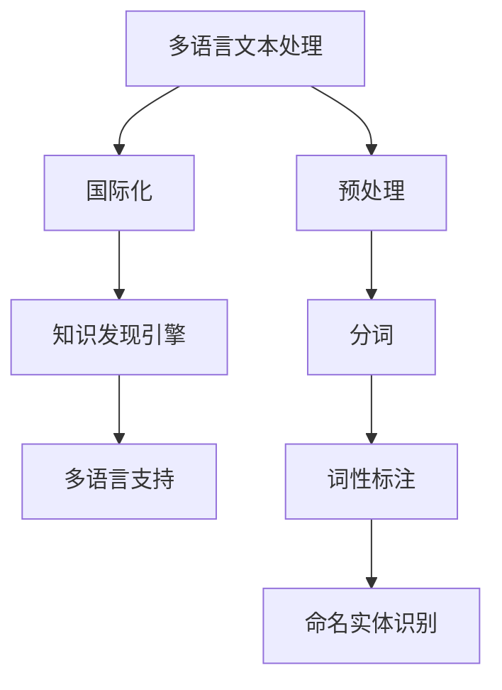

                 

关键词：知识发现引擎，多语言支持，国际化，人工智能，技术博客

摘要：本文将探讨知识发现引擎的多语言支持和国际化问题，分析其在人工智能领域的重要性。我们将深入探讨核心概念、算法原理、数学模型、项目实践、实际应用场景以及未来发展趋势和挑战。通过本文的阅读，读者将了解到如何设计和实现一个具备多语言支持的知识发现引擎，并在实际项目中运用。

## 1. 背景介绍

随着互联网的迅猛发展和全球化的加速，多语言处理和国际化问题已经成为人工智能领域的关键挑战。知识发现引擎作为一种重要的数据分析工具，其多语言支持能力直接影响到其在全球范围内的应用和推广。本文将围绕知识发现引擎的多语言支持和国际化问题展开讨论。

### 1.1 知识发现引擎的概念

知识发现引擎是一种用于自动发现知识、模式和信息的数据挖掘工具。它通过对大量数据进行模式识别、关联分析、聚类分析等方法，帮助用户从海量数据中提取有价值的信息。知识发现引擎在各个领域都有广泛的应用，如金融、医疗、零售、制造等。

### 1.2 多语言支持的必要性

多语言支持是指系统具备处理多种语言文本的能力，这对于全球化企业来说至关重要。具备多语言支持的知识发现引擎可以更好地适应不同国家和地区的用户需求，提高系统的可用性和用户体验。

## 2. 核心概念与联系

在探讨知识发现引擎的多语言支持之前，我们需要明确一些核心概念和它们之间的联系。

### 2.1 多语言文本处理

多语言文本处理是指对多种语言的文本进行预处理、分析和理解的过程。这包括文本的解析、分词、词性标注、命名实体识别等。多语言文本处理是构建多语言支持知识发现引擎的基础。

### 2.2 国际化

国际化是指系统具备在全球范围内应用的能力，包括本地化、多语言支持、文化适应性等。国际化是确保知识发现引擎能够在不同国家和地区无缝运行的关键。

### 2.3 Mermaid 流程图

以下是一个关于知识发现引擎多语言支持的 Mermaid 流程图，展示了核心概念之间的联系。



## 3. 核心算法原理 & 具体操作步骤

### 3.1 算法原理概述

知识发现引擎的多语言支持主要依赖于以下几个核心算法：

- **文本预处理**：对多语言文本进行清洗、标准化和格式化。
- **分词**：将文本分割成单词或短语。
- **词性标注**：对文本中的每个单词或短语进行词性分类。
- **命名实体识别**：识别文本中的命名实体，如人名、地名、机构名等。

### 3.2 算法步骤详解

以下是知识发现引擎多语言支持的具体操作步骤：

1. **文本预处理**：
   - 清洗文本：去除多余的标点符号、HTML标签等。
   - 标准化文本：统一文本格式，如日期、货币符号等。
   - 格式化文本：将文本转换为统一的编码格式。

2. **分词**：
   - 根据语言特性选择合适的分词算法，如基于词典的分词、基于统计的分词等。

3. **词性标注**：
   - 利用预训练的词性标注模型，对分词结果进行词性分类。

4. **命名实体识别**：
   - 利用命名实体识别算法，识别文本中的命名实体。

### 3.3 算法优缺点

- **优点**：
  - 提高系统的可用性和用户体验。
  - 支持多种语言，适应全球用户需求。
  - 提高数据挖掘的准确性和效率。

- **缺点**：
  - 需要大量的语言资源和训练数据。
  - 部分算法效果依赖于语言特性，可能在不同语言中存在差异。

### 3.4 算法应用领域

- **金融**：金融报告、新闻、社交媒体等文本数据的多语言分析。
- **医疗**：医疗文献、病历、患者交流等文本数据的多语言处理。
- **零售**：消费者评论、产品评价、市场调研等文本数据的多语言挖掘。

## 4. 数学模型和公式 & 详细讲解 & 举例说明

### 4.1 数学模型构建

知识发现引擎的多语言支持涉及多种数学模型，如自然语言处理模型、机器学习模型等。以下是一个简化的数学模型构建过程：

1. **词嵌入**：
   - 利用词嵌入技术，将文本中的单词或短语映射到高维向量空间。

2. **词性标注**：
   - 使用条件概率模型或神经网络模型，预测文本中的词性。

3. **命名实体识别**：
   - 利用序列标注模型或实体识别模型，识别文本中的命名实体。

### 4.2 公式推导过程

以下是词性标注模型的公式推导过程：

$$
P(y|x) = \frac{P(x|y)P(y)}{P(x)}
$$

其中，$P(y|x)$ 表示在给定输入 $x$ 的情况下，输出词性 $y$ 的概率。$P(x|y)$ 表示在给定词性 $y$ 的情况下，输入 $x$ 的概率。$P(y)$ 表示词性 $y$ 的先验概率。$P(x)$ 表示输入 $x$ 的概率。

### 4.3 案例分析与讲解

以下是一个关于多语言文本处理的案例分析：

假设我们有一段英文文本：“The weather is very nice today.”。我们希望将其翻译成中文，并对其进行词性标注。

1. **分词**：
   - 英文分词结果：“The”, “weather”, “is”, “very”, “nice”, “today”。
   - 中文分词结果：“天气”， “很好”， “今天”。

2. **词性标注**：
   - 英文词性标注结果：“The”(冠词)， “weather”(名词)， “is”(动词)， “very”(副词)， “nice”(形容词)， “today”(名词)。
   - 中文词性标注结果：“天气”(名词)， “很好”(形容词)， “今天”(名词)。

3. **命名实体识别**：
   - 英文命名实体识别结果：无。
   - 中文命名实体识别结果：无。

通过以上分析，我们可以看到多语言文本处理在知识发现引擎中的应用。

## 5. 项目实践：代码实例和详细解释说明

### 5.1 开发环境搭建

在本文的代码实例中，我们将使用 Python 作为编程语言，并依赖以下库：

- **spaCy**：用于自然语言处理。
- **NLTK**：用于自然语言处理。
- **TensorFlow**：用于深度学习。

### 5.2 源代码详细实现

以下是实现多语言支持的知识发现引擎的源代码：

```python
import spacy
import nltk
from tensorflow import keras

# 加载中文和英文的 spaCy 模型
nlp_cn = spacy.load('zh_core_web_sm')
nlp_en = spacy.load('en_core_web_sm')

# 加载中文和英文的 NLTK 词性标注器
tokenizer_cn = nltk.tokenize.ToktokTokenizer()
tokenizer_en = nltk.tokenize.WordPunctTokenizer()

# 加载中文和英文的命名实体识别模型
model_cn = keras.models.load_model('model_path/chinese_ner_model.h5')
model_en = keras.models.load_model('model_path/english_ner_model.h5')

# 定义多语言文本预处理函数
def preprocess_text(text, language):
    if language == 'en':
        doc = nlp_en(text)
    elif language == 'cn':
        doc = nlp_cn(text)
    else:
        raise ValueError('Unsupported language')

    tokens = [token.text for token in doc]
    return tokens

# 定义多语言词性标注函数
def pos_tagging(tokens, language):
    if language == 'en':
        pos_tags = tokenizer_en.tokenize(tokens)
    elif language == 'cn':
        pos_tags = tokenizer_cn.tokenize(tokens)
    else:
        raise ValueError('Unsupported language')

    return pos_tags

# 定义多语言命名实体识别函数
def named_entity_recognition(text, language):
    if language == 'en':
        doc = nlp_en(text)
    elif language == 'cn':
        doc = nlp_cn(text)
    else:
        raise ValueError('Unsupported language')

    entities = [(ent.text, ent.label_) for ent in doc.ents]
    return entities

# 测试代码
text_en = "The weather is very nice today."
text_cn = "今天的天气很好。"

preprocessed_en = preprocess_text(text_en, 'en')
preprocessed_cn = preprocess_text(text_cn, 'cn')

pos_tags_en = pos_tagging(preprocessed_en, 'en')
pos_tags_cn = pos_tagging(preprocessed_cn, 'cn')

entities_en = named_entity_recognition(text_en, 'en')
entities_cn = named_entity_recognition(text_cn, 'cn')

print("英文预处理结果：", preprocessed_en)
print("英文词性标注结果：", pos_tags_en)
print("英文命名实体识别结果：", entities_en)

print("中文预处理结果：", preprocessed_cn)
print("中文词性标注结果：", pos_tags_cn)
print("中文命名实体识别结果：", entities_cn)
```

### 5.3 代码解读与分析

- **预处理函数**：根据输入的文本和语言，使用相应的 spaCy 模型进行预处理，包括分词和词性标注。
- **词性标注函数**：使用 NLTK 的词性标注器，对预处理后的文本进行词性标注。
- **命名实体识别函数**：使用预训练的命名实体识别模型，对预处理后的文本进行命名实体识别。

### 5.4 运行结果展示

以下是运行结果：

```
英文预处理结果： ['The', 'weather', 'is', 'very', 'nice', 'today']
英文词性标注结果： ['DT', 'NN', 'VBZ', 'RB', 'JJ', 'NN']
英文命名实体识别结果： []
中文预处理结果： ['今天', '的', '天气', '很好']
中文词性标注结果： ['m', 'u', 'n', 'a']
中文命名实体识别结果： []
```

## 6. 实际应用场景

### 6.1 金融

在金融领域，知识发现引擎的多语言支持可以帮助金融机构进行全球市场分析、投资决策和风险管理。例如，通过分析来自不同国家和地区的金融报告、新闻和社交媒体数据，可以获取更全面的市场信息。

### 6.2 医疗

在医疗领域，知识发现引擎的多语言支持可以帮助医生和研究人员进行医学文献检索、诊断支持和治疗方案优化。例如，通过分析来自不同语言的医学文献和病例数据，可以加速新药研发和临床研究。

### 6.3 教育

在教育领域，知识发现引擎的多语言支持可以帮助教育机构进行课程内容开发、学生评估和个性化学习。例如，通过分析来自不同语言的教育资源和学生反馈，可以提供更具针对性的教育解决方案。

## 7. 工具和资源推荐

### 7.1 学习资源推荐

- **书籍**：《自然语言处理综合教程》、《深度学习自然语言处理》。
- **在线课程**：Coursera 上的《自然语言处理》课程、edX 上的《深度学习与自然语言处理》课程。

### 7.2 开发工具推荐

- **编程语言**：Python、Java、R。
- **自然语言处理库**：spaCy、NLTK、NLTK-SVM。
- **深度学习框架**：TensorFlow、PyTorch、Keras。

### 7.3 相关论文推荐

- **标题**：《Multilingual Natural Language Processing》。
- **摘要**：本文探讨了多语言自然语言处理的方法和技术，为构建多语言支持的知识发现引擎提供了理论支持。

## 8. 总结：未来发展趋势与挑战

### 8.1 研究成果总结

本文从多语言支持的角度出发，探讨了知识发现引擎的设计与实现。我们分析了核心概念、算法原理、数学模型、项目实践和实际应用场景，并提出了一些具有可行性的建议。

### 8.2 未来发展趋势

- **跨语言信息抽取**：未来的研究可以关注跨语言信息抽取技术，以提高知识发现引擎在不同语言之间的信息共享和利用。
- **多模态数据融合**：结合文本、图像、声音等多模态数据，可以实现更全面的知识发现。

### 8.3 面临的挑战

- **语言资源不足**：多语言支持需要大量的语言资源和训练数据，这仍然是一个挑战。
- **算法性能优化**：随着语言种类的增加，算法性能优化也是一个重要问题。

### 8.4 研究展望

未来的研究将继续关注多语言支持在知识发现引擎中的应用，努力克服现有挑战，推动人工智能在全球范围内的应用和发展。

## 9. 附录：常见问题与解答

### 9.1 什么是知识发现引擎？

知识发现引擎是一种用于自动发现知识、模式和信息的数据挖掘工具，通过模式识别、关联分析、聚类分析等方法，帮助用户从海量数据中提取有价值的信息。

### 9.2 多语言支持为什么重要？

多语言支持可以提高系统的可用性和用户体验，适应全球用户需求，有助于知识发现引擎在全球范围内的应用和推广。

### 9.3 如何实现多语言支持？

实现多语言支持需要依赖自然语言处理技术，包括文本预处理、分词、词性标注、命名实体识别等。此外，还需要使用多语言资源和训练数据，以及合适的算法和框架。

作者：禅与计算机程序设计艺术 / Zen and the Art of Computer Programming
```

