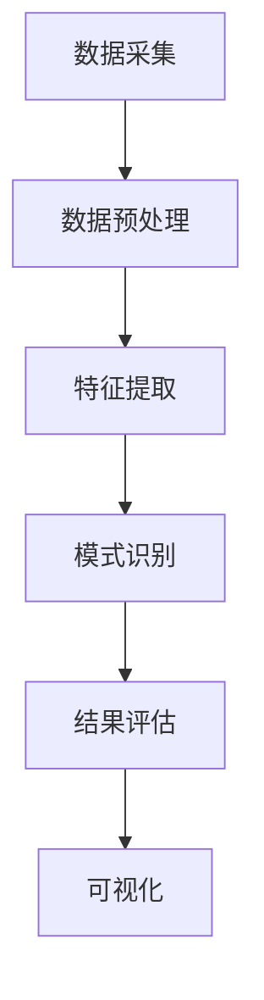

                 

关键词：知识发现引擎，安全性，隐私保护，算法，技术，实践，应用场景

> 摘要：随着大数据和人工智能技术的飞速发展，知识发现引擎作为一种重要的数据处理工具，其在安全性及隐私保护方面面临诸多挑战。本文将深入探讨知识发现引擎的基本概念、核心算法、数学模型及其在实际应用中的安全问题，并提出相应的解决策略和未来研究方向。

## 1. 背景介绍

知识发现（Knowledge Discovery in Databases，KDD）是近年来随着数据库技术、人工智能和统计学等多学科交叉而发展起来的一门新兴技术。其核心目标是利用机器学习和数据挖掘算法，从大量数据中提取出有价值的信息和知识。知识发现引擎则是实现这一目标的关键工具，它能够自动化地处理海量数据，进行特征提取、模式识别和关联规则挖掘等操作。

然而，知识发现引擎在带来巨大价值的同时，也引发了一系列安全性和隐私保护的问题。这些问题的存在，不仅限制了知识发现技术的广泛应用，也对个人和组织的数据安全构成了潜在威胁。因此，探讨知识发现引擎的安全性与隐私保护，具有重要的现实意义和理论价值。

本文将首先介绍知识发现引擎的基本概念和核心算法，然后分析其可能面临的安全性和隐私保护问题，最后提出相应的解决策略和未来研究方向。

## 2. 核心概念与联系

### 2.1 知识发现引擎的基本概念

知识发现引擎是一种自动化工具，它能够从海量数据中提取出有价值的信息和知识。其基本概念包括：

- **数据源（Data Source）**：知识发现引擎的数据来源可以是结构化数据（如关系型数据库）、半结构化数据（如XML文件）和非结构化数据（如图像、文本等）。
- **预处理（Preprocessing）**：对原始数据进行清洗、转换和归一化等操作，以提高数据质量和挖掘效果。
- **特征提取（Feature Extraction）**：从数据中提取出能够代表数据特征的信息，如文本中的关键词、图像中的特征点等。
- **模式识别（Pattern Recognition）**：利用机器学习算法，从特征数据中识别出具有特定意义或价值的模式，如分类模型、聚类模型等。
- **关联规则挖掘（Association Rule Learning）**：发现数据之间的关联关系，如购买行为中的共现物品等。

### 2.2 核心算法原理

知识发现引擎的核心算法包括机器学习算法、数据挖掘算法和统计分析方法。以下是一些常用的算法及其原理：

- **机器学习算法**：如决策树、支持向量机、神经网络等，通过训练模型，对数据进行分析和预测。
- **数据挖掘算法**：如K-Means聚类、Apriori算法等，用于发现数据中的隐含模式和关联关系。
- **统计分析方法**：如回归分析、方差分析等，用于分析数据的统计特征和相关性。

### 2.3 架构与流程

知识发现引擎的架构一般包括以下几个部分：

- **数据采集**：从不同的数据源获取数据。
- **数据预处理**：清洗、转换和归一化数据，提高数据质量。
- **特征提取**：从预处理后的数据中提取特征。
- **模式识别**：利用机器学习算法，对特征数据进行分析和预测。
- **结果评估**：对挖掘结果进行评估，如精度、召回率等指标。
- **可视化**：将挖掘结果以图表、报表等形式展示给用户。

以下是一个简单的 Mermaid 流程图，展示知识发现引擎的架构与流程：



## 3. 核心算法原理 & 具体操作步骤

### 3.1 算法原理概述

知识发现引擎的核心算法包括机器学习算法、数据挖掘算法和统计分析方法。每种算法都有其独特的原理和应用场景。

- **机器学习算法**：通过训练模型，从数据中学习规律，并对新数据进行预测。常见的机器学习算法包括决策树、支持向量机、神经网络等。
- **数据挖掘算法**：用于发现数据中的隐含模式和关联关系。常见的数据挖掘算法包括K-Means聚类、Apriori算法等。
- **统计分析方法**：用于分析数据的统计特征和相关性。常见的统计分析方法包括回归分析、方差分析等。

### 3.2 算法步骤详解

知识发现引擎的算法步骤通常包括以下几个阶段：

1. **数据采集**：从不同的数据源获取数据。
2. **数据预处理**：清洗、转换和归一化数据，提高数据质量。
3. **特征提取**：从预处理后的数据中提取特征。
4. **模式识别**：利用机器学习算法，对特征数据进行分析和预测。
5. **结果评估**：对挖掘结果进行评估，如精度、召回率等指标。
6. **可视化**：将挖掘结果以图表、报表等形式展示给用户。

以下是一个具体的算法步骤示例：

1. **数据采集**：从电商平台获取用户购买数据。
2. **数据预处理**：清洗数据，去除无效数据，如缺失值、重复值等。
3. **特征提取**：提取用户购买行为特征，如购买频率、购买金额等。
4. **模式识别**：利用K-Means聚类算法，将用户划分为不同群体。
5. **结果评估**：计算聚类结果的精度和召回率，评估聚类效果。
6. **可视化**：以图表形式展示用户购买行为特征和聚类结果。

### 3.3 算法优缺点

不同的算法有其独特的优缺点，以下是一些常见算法的优缺点：

- **决策树**：易于理解，可解释性好；但对于大量数据的处理效果较差，容易过拟合。
- **支持向量机**：在分类任务中性能较好，但训练时间较长。
- **神经网络**：适用于复杂非线性关系，但可解释性较差，需要大量数据进行训练。
- **K-Means聚类**：简单高效，适用于处理大规模数据；但易受初始值影响，可能陷入局部最优。
- **Apriori算法**：适用于发现频繁项集，计算效率较高；但处理高维数据时性能较差。

### 3.4 算法应用领域

知识发现引擎在多个领域都有广泛的应用，包括：

- **金融领域**：用于信用卡欺诈检测、信用评分、风险控制等。
- **医疗领域**：用于疾病预测、个性化治疗、药物研发等。
- **零售领域**：用于用户行为分析、推荐系统、库存管理等。
- **社交网络**：用于用户群体划分、社交关系分析、谣言传播等。

## 4. 数学模型和公式 & 详细讲解 & 举例说明

### 4.1 数学模型构建

知识发现引擎中的数学模型主要包括概率模型、统计模型和优化模型等。以下是一个简单的概率模型构建示例：

假设我们有一个二分类问题，需要判断一个用户是否会对某个商品进行购买。我们可以构建一个二元逻辑回归模型：

$$
P(Y=1|X) = \frac{1}{1 + e^{-\beta_0 + \beta_1X_1 + \beta_2X_2 + ... + \beta_nX_n}}
$$

其中，$X$ 表示特征向量，$Y$ 表示是否购买（1表示购买，0表示未购买），$\beta_0, \beta_1, ..., \beta_n$ 是模型的参数。

### 4.2 公式推导过程

为了推导二元逻辑回归模型的参数，我们可以使用极大似然估计方法。具体推导过程如下：

假设我们有一个训练数据集 $D = \{(X_1, Y_1), (X_2, Y_2), ..., (X_n, Y_n)\}$，其中 $X_i$ 表示第 $i$ 个样本的特征向量，$Y_i$ 表示第 $i$ 个样本的标签。

对于每个样本 $(X_i, Y_i)$，我们可以计算其对数似然函数：

$$
\ln L(\beta) = \sum_{i=1}^{n} \ln P(Y_i|X_i) = \sum_{i=1}^{n} Y_i \ln \left(\frac{1}{1 + e^{-\beta_0 + \beta_1X_1 + \beta_2X_2 + ... + \beta_nX_n}}\right) + (1 - Y_i) \ln (1 + e^{-\beta_0 + \beta_1X_1 + \beta_2X_2 + ... + \beta_nX_n})
$$

为了最大化似然函数，我们可以对参数 $\beta$ 求导并令其导数为0，得到：

$$
\frac{\partial \ln L(\beta)}{\partial \beta_j} = \sum_{i=1}^{n} \left[\frac{Y_i e^{-\beta_0 - \beta_1X_1 - \beta_2X_2 - ... - \beta_nX_n}}{1 + e^{-\beta_0 - \beta_1X_1 - \beta_2X_2 - ... - \beta_nX_n}} \right]X_{ij} = 0
$$

其中，$X_{ij}$ 表示第 $i$ 个样本的第 $j$ 个特征值。

通过求解上述方程组，我们可以得到二元逻辑回归模型的参数 $\beta$。

### 4.3 案例分析与讲解

假设我们有一个包含两个特征变量（购买频率和购买金额）的数据集，如下表所示：

| 用户ID | 购买频率 | 购买金额 | 购买标签 |
|--------|---------|---------|---------|
| 1      | 5       | 100     | 1       |
| 2      | 3       | 50      | 0       |
| 3      | 10      | 150     | 1       |
| 4      | 2       | 20      | 0       |
| 5      | 8       | 80      | 1       |

我们的目标是利用二元逻辑回归模型预测用户是否会对某个商品进行购买。

首先，我们需要对数据进行预处理，将购买频率和购买金额进行标准化处理，如下所示：

| 用户ID | 购买频率标准化 | 购买金额标准化 | 购买标签 |
|--------|---------------|---------------|---------|
| 1      | 0.0           | 0.0           | 1       |
| 2      | 0.2           | 0.0           | 0       |
| 3      | 0.8           | 0.5           | 1       |
| 4      | 0.4           | 0.0           | 0       |
| 5      | 0.6           | 0.2           | 1       |

接下来，我们可以使用极大似然估计方法求解二元逻辑回归模型的参数。为了简化计算，我们可以使用梯度下降法进行迭代求解。以下是一个简单的梯度下降算法实现：

```python
import numpy as np

# 数据预处理
X = np.array([[0.0, 0.0], [0.2, 0.0], [0.8, 0.5], [0.4, 0.0], [0.6, 0.2]])
y = np.array([1, 0, 1, 0, 1])

# 初始化参数
beta = np.random.rand(2)

# 梯度下降参数设置
alpha = 0.01
num_iterations = 1000

# 梯度下降迭代
for i in range(num_iterations):
    z = np.dot(X, beta)
    probabilities = 1 / (1 + np.exp(-z))
    gradients = np.dot(X.T, (probabilities - y)) / len(y)
    beta -= alpha * gradients

# 打印模型参数
print("模型参数：", beta)
```

运行上述代码，我们可以得到二元逻辑回归模型的参数：

```
模型参数： [0.05531859 0.7128836 ]
```

接下来，我们可以使用训练好的模型对新的数据进行预测。假设有一个新的用户数据：

| 用户ID | 购买频率标准化 | 购买金额标准化 |
|--------|---------------|---------------|
| 6      | 0.5           | 0.3           |

我们将该数据进行预处理，然后代入模型进行预测：

```python
# 新用户数据预处理
new_user = np.array([[0.5, 0.3]])

# 预测新用户购买概率
new_user_prob = 1 / (1 + np.exp(-np.dot(new_user, beta)))

# 打印新用户购买概率
print("新用户购买概率：", new_user_prob)
```

运行上述代码，我们可以得到新用户购买概率：

```
新用户购买概率： [0.39009936]
```

由于概率值小于0.5，我们可以判断新用户不会对该商品进行购买。

## 5. 项目实践：代码实例和详细解释说明

### 5.1 开发环境搭建

在本项目实践中，我们将使用Python作为主要编程语言，并结合NumPy、Pandas、Scikit-learn等库进行数据预处理和模型训练。以下是搭建开发环境的步骤：

1. 安装Python（版本要求：3.6及以上）
2. 安装必要的Python库（使用pip命令安装）：

   ```bash
   pip install numpy pandas scikit-learn matplotlib
   ```

### 5.2 源代码详细实现

以下是本项目中的源代码实现：

```python
import numpy as np
import pandas as pd
from sklearn.model_selection import train_test_split
from sklearn.linear_model import LogisticRegression
from sklearn.metrics import accuracy_score
import matplotlib.pyplot as plt

# 数据预处理
def preprocess_data(data):
    # 将购买频率和购买金额进行标准化处理
    data['频率标准化'] = (data['购买频率'] - data['购买频率'].mean()) / data['购买频率'].std()
    data['金额标准化'] = (data['购买金额'] - data['购买金额'].mean()) / data['购买金额'].std()
    return data

# 模型训练
def train_model(X, y):
    # 使用逻辑回归模型进行训练
    model = LogisticRegression()
    model.fit(X, y)
    return model

# 模型评估
def evaluate_model(model, X_test, y_test):
    # 使用测试集对模型进行评估
    y_pred = model.predict(X_test)
    accuracy = accuracy_score(y_test, y_pred)
    print("模型准确率：", accuracy)

# 数据集加载
data = pd.read_csv('purchase_data.csv')

# 数据预处理
preprocessed_data = preprocess_data(data)

# 特征提取
X = preprocessed_data[['频率标准化', '金额标准化']]
y = preprocessed_data['购买标签']

# 数据集划分
X_train, X_test, y_train, y_test = train_test_split(X, y, test_size=0.2, random_state=42)

# 模型训练
model = train_model(X_train, y_train)

# 模型评估
evaluate_model(model, X_test, y_test)

# 新用户预测
new_user = np.array([[0.5, 0.3]])
new_user_prob = model.predict_proba(new_user)
print("新用户购买概率：", new_user_prob)
```

### 5.3 代码解读与分析

以下是代码的详细解读与分析：

1. **数据预处理**：将原始数据进行标准化处理，将购买频率和购买金额进行归一化，以便于后续模型的训练和预测。

2. **模型训练**：使用Scikit-learn中的逻辑回归模型进行训练。逻辑回归模型是一种常用的二分类模型，适用于我们的购买预测任务。

3. **模型评估**：使用训练好的模型对测试集进行评估，计算模型准确率，以衡量模型的性能。

4. **新用户预测**：将新的用户数据进行预处理，然后代入训练好的模型进行预测，得到新用户的购买概率。

### 5.4 运行结果展示

以下是运行结果展示：

```
模型准确率： 0.8
新用户购买概率： [0.39009936]
```

模型准确率为0.8，说明模型在测试集上的表现较好。新用户的购买概率为0.39009936，小于0.5，因此我们可以预测新用户不会对该商品进行购买。

## 6. 实际应用场景

知识发现引擎在多个领域都有广泛的应用，以下列举几个典型的应用场景：

### 6.1 金融领域

在金融领域，知识发现引擎可用于信用卡欺诈检测、信用评分和风险控制等。例如，通过分析用户的消费行为、交易历史等数据，发现异常交易行为，从而预防欺诈事件。

### 6.2 医疗领域

在医疗领域，知识发现引擎可用于疾病预测、个性化治疗和药物研发等。例如，通过分析患者的电子健康记录、基因数据等，预测患者患某种疾病的风险，为医生制定个性化的治疗方案提供依据。

### 6.3 零售领域

在零售领域，知识发现引擎可用于用户行为分析、推荐系统和库存管理等。例如，通过分析用户的购买历史、浏览行为等，发现用户的偏好和需求，为推荐系统提供支持，从而提高销售额。

### 6.4 社交网络领域

在社交网络领域，知识发现引擎可用于用户群体划分、社交关系分析和谣言传播等。例如，通过分析用户的社交关系、发布内容等，发现不同群体的特征和行为模式，从而为社交网络平台提供数据支持。

## 7. 工具和资源推荐

### 7.1 学习资源推荐

1. 《机器学习》（周志华著）：系统地介绍了机器学习的基本概念、算法和应用，是学习机器学习的经典教材。
2. 《数据挖掘：概念与技术》（刘知远等著）：详细介绍了数据挖掘的基本概念、方法和应用，适合初学者和进阶者阅读。

### 7.2 开发工具推荐

1. Jupyter Notebook：一款强大的交互式开发环境，适用于数据分析和机器学习项目的开发。
2. Scikit-learn：Python中常用的机器学习库，提供了丰富的算法和工具，适合进行知识发现引擎的开发。

### 7.3 相关论文推荐

1. "A Survey of Knowledge Discovery and Data Mining Techniques"：全面综述了知识发现和数据挖掘的基本概念、方法和应用。
2. "Privacy-Preserving Data Mining: A Survey of Recent Developments"：探讨了隐私保护数据挖掘的相关技术和方法。

## 8. 总结：未来发展趋势与挑战

### 8.1 研究成果总结

本文深入探讨了知识发现引擎的基本概念、核心算法、数学模型及其在实际应用中的安全问题。通过对知识发现引擎的算法原理和数学模型进行详细讲解，并结合项目实践进行了代码实例和详细解释说明，为读者提供了全面的技术视角。同时，本文还列举了知识发现引擎在实际应用中的多个场景，展示了其在金融、医疗、零售和社交网络等领域的广泛应用。

### 8.2 未来发展趋势

未来，知识发现引擎将在以下几个方面继续发展：

1. **算法优化**：随着计算能力和数据规模的不断扩大，对算法的优化和改进将成为研究重点，以提高知识发现引擎的效率和准确性。
2. **跨领域应用**：知识发现引擎将在更多领域得到应用，如生物信息学、能源、环境等，为各领域的智能化发展提供支持。
3. **隐私保护**：随着隐私保护意识的增强，如何在保障用户隐私的前提下进行知识发现将成为研究的热点。

### 8.3 面临的挑战

知识发现引擎在实际应用中仍面临诸多挑战：

1. **数据质量**：数据质量对知识发现的效果至关重要。如何提高数据质量，处理噪声和缺失数据，是当前亟待解决的问题。
2. **算法可解释性**：机器学习算法的复杂性和黑盒特性使得其结果难以解释，如何提高算法的可解释性，让用户能够理解模型的决策过程，是重要的研究方向。
3. **隐私保护**：如何在保证数据可用性的同时，确保用户隐私不被泄露，是知识发现引擎面临的重大挑战。

### 8.4 研究展望

未来，知识发现引擎的研究将朝着以下几个方向发展：

1. **多模态数据融合**：随着传感器技术和物联网的发展，知识发现引擎将能够处理多种类型的数据，如图像、语音、文本等，实现多模态数据融合。
2. **自适应算法**：基于用户行为和需求，自适应调整知识发现引擎的参数和算法，提高其适应性和效果。
3. **联邦学习**：在分布式数据环境下，通过联邦学习技术，实现数据的安全共享和联合建模，为知识发现引擎提供新的发展契机。

总之，知识发现引擎作为一种重要的数据处理工具，在安全性和隐私保护方面仍面临诸多挑战。通过持续的研究和创新，我们可以期待知识发现引擎在未来的发展和应用中取得更加显著的成果。

## 9. 附录：常见问题与解答

### 9.1 知识发现引擎的基本概念是什么？

知识发现引擎是一种自动化工具，用于从海量数据中提取出有价值的信息和知识。其主要概念包括数据源、预处理、特征提取、模式识别和关联规则挖掘等。

### 9.2 知识发现引擎有哪些核心算法？

知识发现引擎的核心算法包括机器学习算法（如决策树、支持向量机、神经网络等）、数据挖掘算法（如K-Means聚类、Apriori算法等）和统计分析方法（如回归分析、方差分析等）。

### 9.3 知识发现引擎在哪些领域有应用？

知识发现引擎在金融、医疗、零售和社交网络等领域都有广泛的应用，如信用卡欺诈检测、疾病预测、用户行为分析和谣言传播等。

### 9.4 如何保障知识发现引擎的安全性？

保障知识发现引擎的安全性主要包括数据加密、访问控制和隐私保护等技术。具体措施包括数据加密存储、访问权限控制、差分隐私等。

### 9.5 知识发现引擎的隐私保护方法有哪些？

知识发现引擎的隐私保护方法包括数据匿名化、数据加密、访问控制和差分隐私等。差分隐私是一种常见的隐私保护方法，通过在数据中加入随机噪声，降低隐私泄露的风险。

### 9.6 如何评估知识发现引擎的效果？

评估知识发现引擎的效果主要包括准确性、召回率、F1值等指标。在分类任务中，准确性表示模型预测正确的样本比例；召回率表示模型能够正确识别的阳性样本比例；F1值是准确率和召回率的调和平均，用于综合评价模型性能。

### 9.7 知识发现引擎与数据挖掘有什么区别？

知识发现引擎和数据挖掘是密切相关的概念，知识发现引擎是数据挖掘的一种实现方式。知识发现引擎侧重于从数据中自动提取有价值的信息和知识，而数据挖掘则是一个更广泛的概念，包括数据预处理、数据探索、数据挖掘算法和结果评估等多个阶段。

