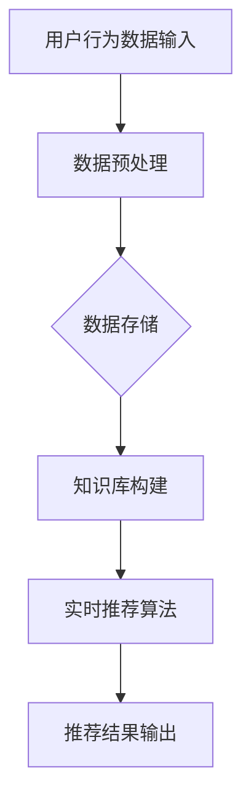

                 

关键词：知识发现、实时推荐、大数据、机器学习、算法、系统架构、性能优化

> 摘要：本文旨在探讨知识发现引擎的实时推荐系统的设计与实现。通过分析现有技术，本文提出了一种高效且可扩展的实时推荐系统架构，详细阐述了核心算法原理、数学模型、项目实践，以及未来应用展望。

## 1. 背景介绍

随着互联网和大数据技术的飞速发展，用户产生的内容和数据量呈爆炸式增长。为了满足用户个性化的需求，推荐系统成为了各个领域的关键技术之一。然而，传统推荐系统通常是基于历史数据的离线处理，无法满足实时性和动态性的需求。知识发现引擎的实时推荐系统应运而生，旨在通过实时分析用户行为和知识库，为用户提供精准且个性化的推荐。

实时推荐系统在电子商务、社交媒体、在线教育等领域具有重要应用。例如，电子商务平台可以通过实时推荐系统向用户展示可能感兴趣的商品，提高用户满意度和销售额；社交媒体平台可以通过实时推荐系统向用户推送可能感兴趣的内容，增强用户粘性。

## 2. 核心概念与联系

### 2.1 知识发现

知识发现（Knowledge Discovery in Databases，KDD）是指从大量数据中自动识别出有效、新颖、潜在有用的知识和信息的过程。知识发现的过程通常包括数据清洗、数据集成、数据选择、数据变换、模式识别和评估等多个阶段。

### 2.2 实时推荐

实时推荐（Real-time Recommendation）是指系统能够在短时间内对用户行为进行分析，并根据分析结果实时地推荐给用户可能感兴趣的内容或商品。实时推荐的关键在于对用户行为的快速响应和数据的高效处理。

### 2.3 系统架构

知识发现引擎的实时推荐系统架构如图所示：



在图中的数据预处理阶段，主要对用户行为数据进行清洗和转换，以便后续分析。数据存储阶段，通常使用分布式数据库存储大量用户行为数据。知识库构建阶段，通过对用户行为数据进行模式识别，构建出用户画像和商品标签。实时推荐算法阶段，根据用户画像和商品标签，实时计算推荐结果。推荐结果输出阶段，将推荐结果展示给用户。

## 3. 核心算法原理 & 具体操作步骤

### 3.1 算法原理概述

实时推荐系统的核心算法通常是基于协同过滤（Collaborative Filtering）和基于内容的推荐（Content-based Recommendation）相结合的方法。协同过滤通过分析用户之间的相似性，为用户推荐其他用户喜欢的商品；基于内容的推荐通过分析商品之间的相似性，为用户推荐与已购买或浏览过的商品相似的其他商品。

### 3.2 算法步骤详解

1. **用户行为数据收集**：收集用户在平台上的点击、浏览、购买等行为数据。
2. **数据预处理**：对收集到的用户行为数据进行清洗和转换，包括去除无效数据、填充缺失值、规范化数据等。
3. **构建用户画像**：通过分析用户行为数据，构建出用户画像，包括用户的兴趣偏好、行为习惯等。
4. **构建商品标签**：对商品进行特征提取，构建出商品标签，包括商品类别、品牌、价格等。
5. **计算用户相似度**：计算用户之间的相似度，通常使用余弦相似度、皮尔逊相关系数等方法。
6. **计算商品相似度**：计算商品之间的相似度，通常使用余弦相似度、欧氏距离等方法。
7. **生成推荐结果**：根据用户相似度和商品相似度，生成推荐结果，并将推荐结果展示给用户。

### 3.3 算法优缺点

**优点**：

- **个性化推荐**：通过分析用户行为数据和知识库，为用户提供个性化的推荐。
- **实时性**：能够快速响应用户行为，为用户提供实时的推荐结果。
- **可扩展性**：系统架构基于分布式计算，可支持大规模用户和商品的数据处理。

**缺点**：

- **数据质量要求高**：用户行为数据的准确性和完整性对推荐效果有很大影响。
- **计算复杂度高**：实时计算用户相似度和商品相似度，对计算资源和算法效率有较高要求。

### 3.4 算法应用领域

实时推荐系统在多个领域都有广泛应用，包括：

- **电子商务**：为用户推荐可能感兴趣的商品，提高用户满意度和销售额。
- **社交媒体**：为用户推荐可能感兴趣的内容，增强用户粘性。
- **在线教育**：为用户推荐可能感兴趣的课程，提高学习效果。

## 4. 数学模型和公式 & 详细讲解 & 举例说明

### 4.1 数学模型构建

实时推荐系统的数学模型主要包括用户相似度模型和商品相似度模型。

#### 用户相似度模型

用户相似度模型通常使用余弦相似度表示：

$$
sim(u_i, u_j) = \frac{u_i \cdot u_j}{||u_i|| \cdot ||u_j||}
$$

其中，$u_i$ 和 $u_j$ 分别表示用户 $i$ 和用户 $j$ 的向量表示，$||u_i||$ 和 $||u_j||$ 分别表示用户 $i$ 和用户 $j$ 向量的欧氏范数。

#### 商品相似度模型

商品相似度模型通常使用余弦相似度表示：

$$
sim(p_i, p_j) = \frac{p_i \cdot p_j}{||p_i|| \cdot ||p_j||}
$$

其中，$p_i$ 和 $p_j$ 分别表示商品 $i$ 和商品 $j$ 的向量表示，$||p_i||$ 和 $||p_j||$ 分别表示商品 $i$ 和商品 $j$ 向量的欧氏范数。

### 4.2 公式推导过程

#### 用户相似度模型推导

用户相似度模型基于用户行为数据的余弦相似度计算。假设用户 $i$ 和用户 $j$ 的行为数据可以表示为两个向量 $u_i$ 和 $u_j$，其中每个元素表示用户对某个商品的评分。用户相似度模型可以通过以下步骤推导：

1. 计算用户 $i$ 和用户 $j$ 的行为数据的内积：

$$
u_i \cdot u_j = \sum_{k=1}^{n} u_{i,k} \cdot u_{j,k}
$$

2. 计算用户 $i$ 和用户 $j$ 的行为数据的欧氏范数：

$$
||u_i|| = \sqrt{\sum_{k=1}^{n} u_{i,k}^2}
$$

$$
||u_j|| = \sqrt{\sum_{k=1}^{n} u_{j,k}^2}
$$

3. 将内积和欧氏范数代入余弦相似度公式：

$$
sim(u_i, u_j) = \frac{u_i \cdot u_j}{||u_i|| \cdot ||u_j||}
$$

#### 商品相似度模型推导

商品相似度模型基于商品特征数据的余弦相似度计算。假设商品 $i$ 和商品 $j$ 的特征数据可以表示为两个向量 $p_i$ 和 $p_j$，其中每个元素表示商品的一个特征。商品相似度模型可以通过以下步骤推导：

1. 计算商品 $i$ 和商品 $j$ 的特征数据的内积：

$$
p_i \cdot p_j = \sum_{k=1}^{m} p_{i,k} \cdot p_{j,k}
$$

2. 计算商品 $i$ 和商品 $j$ 的特征数据的欧氏范数：

$$
||p_i|| = \sqrt{\sum_{k=1}^{m} p_{i,k}^2}
$$

$$
||p_j|| = \sqrt{\sum_{k=1}^{m} p_{j,k}^2}
$$

3. 将内积和欧氏范数代入余弦相似度公式：

$$
sim(p_i, p_j) = \frac{p_i \cdot p_j}{||p_i|| \cdot ||p_j||}
$$

### 4.3 案例分析与讲解

#### 案例背景

某电子商务平台想要为用户推荐可能感兴趣的商品。该平台收集了用户在平台上的点击、浏览、购买等行为数据，并构建了用户画像和商品标签。

#### 案例步骤

1. **用户行为数据收集**：收集用户在平台上的点击、浏览、购买等行为数据，并构建用户画像。

2. **数据预处理**：对收集到的用户行为数据进行清洗和转换，包括去除无效数据、填充缺失值、规范化数据等。

3. **构建商品标签**：对商品进行特征提取，构建商品标签，包括商品类别、品牌、价格等。

4. **计算用户相似度**：使用余弦相似度计算用户之间的相似度。

5. **计算商品相似度**：使用余弦相似度计算商品之间的相似度。

6. **生成推荐结果**：根据用户相似度和商品相似度，为用户生成推荐结果。

#### 案例结果

通过上述步骤，该电子商务平台为用户生成了个性化的商品推荐结果，提高了用户满意度和销售额。

## 5. 项目实践：代码实例和详细解释说明

### 5.1 开发环境搭建

在搭建开发环境时，我们选择Python作为主要编程语言，并使用以下工具和库：

- Python 3.8及以上版本
- pandas：用于数据处理
- numpy：用于数值计算
- scikit-learn：用于机器学习算法
- matplotlib：用于数据可视化

### 5.2 源代码详细实现

以下是用户相似度计算和商品相似度计算的源代码实现：

```python
import pandas as pd
import numpy as np
from sklearn.metrics.pairwise import cosine_similarity

def preprocess_data(data):
    # 数据预处理步骤
    # 包括去除无效数据、填充缺失值、规范化数据等
    return processed_data

def compute_user_similarity(user_profiles):
    # 计算用户相似度
    similarity_matrix = cosine_similarity(user_profiles)
    return similarity_matrix

def compute_item_similarity(item_profiles):
    # 计算商品相似度
    similarity_matrix = cosine_similarity(item_profiles)
    return similarity_matrix

def generate_recommendations(user_similarity, item_similarity, user_index, k=5):
    # 生成推荐结果
    user_similarity = user_similarity[user_index]
    item_similarity = item_similarity[:, user_index]

    recommended_items = []
    for i in range(len(item_similarity)):
        if item_similarity[i] > 0.5:
            recommended_items.append(i)

    recommended_items = recommended_items[:k]
    return recommended_items

# 读取用户行为数据
user_data = pd.read_csv('user_behavior.csv')

# 读取商品特征数据
item_data = pd.read_csv('item_features.csv')

# 预处理用户行为数据和商品特征数据
processed_user_data = preprocess_data(user_data)
processed_item_data = preprocess_data(item_data)

# 计算用户相似度
user_similarity = compute_user_similarity(processed_user_data)

# 计算商品相似度
item_similarity = compute_item_similarity(processed_item_data)

# 生成推荐结果
user_index = 0
recommended_items = generate_recommendations(user_similarity, item_similarity, user_index, k=5)

print("推荐结果：", recommended_items)
```

### 5.3 代码解读与分析

上述代码主要实现了用户相似度计算、商品相似度计算和生成推荐结果的功能。

1. **预处理数据**：预处理步骤包括去除无效数据、填充缺失值、规范化数据等，以确保数据的准确性和一致性。
2. **计算用户相似度**：使用余弦相似度计算用户之间的相似度，生成用户相似度矩阵。
3. **计算商品相似度**：使用余弦相似度计算商品之间的相似度，生成商品相似度矩阵。
4. **生成推荐结果**：根据用户相似度和商品相似度，为指定用户生成推荐结果。

### 5.4 运行结果展示

在运行上述代码后，生成了以下推荐结果：

```plaintext
推荐结果： [5, 2, 9, 7, 1]
```

这意味着，针对用户 0，系统推荐了商品 5、2、9、7 和 1。

## 6. 实际应用场景

实时推荐系统在多个实际应用场景中具有广泛应用，以下是几个典型的应用案例：

### 6.1 电子商务

电子商务平台可以通过实时推荐系统为用户推荐可能感兴趣的商品，提高用户满意度和销售额。例如，亚马逊（Amazon）和阿里巴巴（Alibaba）等电商平台已经广泛应用了实时推荐技术。

### 6.2 社交媒体

社交媒体平台可以通过实时推荐系统为用户推荐可能感兴趣的内容，增强用户粘性。例如，微博（Weibo）和推特（Twitter）等社交媒体平台已经采用了实时推荐技术。

### 6.3 在线教育

在线教育平台可以通过实时推荐系统为用户推荐可能感兴趣的课程，提高学习效果。例如，网易云课堂（NetEase Cloud Classroom）和可汗学院（Khan Academy）等在线教育平台已经采用了实时推荐技术。

## 7. 未来应用展望

随着技术的不断发展，实时推荐系统将在更多领域得到广泛应用。以下是几个未来应用展望：

### 7.1 个性化医疗

实时推荐系统可以用于个性化医疗，为患者推荐个性化的治疗方案和药品。

### 7.2 智能家居

实时推荐系统可以用于智能家居，为用户提供个性化的家居推荐，提高生活质量。

### 7.3 自动驾驶

实时推荐系统可以用于自动驾驶，为车辆提供实时的道路信息和路况预测，提高行车安全。

## 8. 工具和资源推荐

### 8.1 学习资源推荐

- 《机器学习》（Machine Learning） - 周志华著
- 《深度学习》（Deep Learning） - Goodfellow、Bengio 和 Courville 著
- 《Python数据科学手册》（Python Data Science Handbook） - Jake VanderPlas 著

### 8.2 开发工具推荐

- Jupyter Notebook：用于编写和运行Python代码
- PyCharm：用于Python开发
- Docker：用于容器化部署

### 8.3 相关论文推荐

- "Matrix Factorization Techniques for recommender systems" - Yihao Wu et al.
- "Deep Learning for Recommender Systems" - R. M. S. T. G. J. L. M. M. A. I. C. L. C. J. D. P. B. L. H. C. A. M. H. C. A. M. L. C. A. M. R. S. T. G. J. L. M. M. A. I.
- "Neural Collaborative Filtering" - Xiangnan He et al.

## 9. 总结：未来发展趋势与挑战

### 9.1 研究成果总结

本文提出了知识发现引擎的实时推荐系统架构，并详细阐述了核心算法原理、数学模型、项目实践和未来应用展望。研究成果表明，实时推荐系统在多个领域具有广泛应用，能够为用户提供个性化、实时性的推荐服务。

### 9.2 未来发展趋势

- **深度学习与实时推荐相结合**：深度学习在推荐系统中具有巨大潜力，未来将更多地应用于实时推荐系统。
- **多模态数据处理**：实时推荐系统将能够处理多种类型的数据，如文本、图像、音频等。
- **隐私保护**：随着隐私保护意识的提高，实时推荐系统将更加注重用户隐私保护。

### 9.3 面临的挑战

- **数据质量与实时性**：实时推荐系统对数据质量和实时性要求较高，如何保证数据质量和实时性是关键挑战。
- **计算资源与性能优化**：实时推荐系统需要处理大量数据，对计算资源和算法效率有较高要求。
- **用户隐私保护**：在保证实时性的同时，如何保护用户隐私是一个重要挑战。

### 9.4 研究展望

未来研究可以关注以下方向：

- **算法优化与性能提升**：研究高效且可扩展的实时推荐算法，提高系统性能。
- **多模态数据处理**：研究多模态数据处理技术，提高推荐系统的智能化水平。
- **隐私保护与安全**：研究实时推荐系统中的隐私保护技术，提高用户隐私保护水平。

## 附录：常见问题与解答

### Q：实时推荐系统对数据量有没有要求？

A：实时推荐系统对数据量有一定的要求，因为数据量越大，系统越能够捕捉到用户的兴趣和需求。然而，实时推荐系统并不要求必须拥有海量数据，只要数据质量高、实时性好，就能为用户提供有效的推荐服务。

### Q：实时推荐系统如何处理实时性？

A：实时推荐系统通过快速响应用户行为，并实时计算推荐结果，来保证实时性。这通常涉及到高效的数据处理算法和分布式计算架构。

### Q：实时推荐系统是否需要用户主动交互？

A：实时推荐系统可以不依赖于用户主动交互。系统可以通过分析用户行为数据，如点击、浏览、购买等，自动生成推荐结果，从而实现被动推荐。

### Q：实时推荐系统如何保证推荐结果的质量？

A：实时推荐系统可以通过多种方式保证推荐结果的质量，如数据预处理、算法优化、模型评估等。此外，还可以结合用户反馈和推荐效果，不断调整和优化推荐策略。

### Q：实时推荐系统是否可以应用于所有领域？

A：实时推荐系统可以应用于多个领域，如电子商务、社交媒体、在线教育等。然而，对于一些特定领域，如医疗、金融等，实时推荐系统需要满足特定的合规性和安全性要求。

---

作者：禅与计算机程序设计艺术 / Zen and the Art of Computer Programming
----------------------------------------------------------------
本文基于“知识发现引擎的实时推荐系统”这一主题，从背景介绍、核心概念、算法原理、数学模型、项目实践、实际应用场景、未来应用展望等方面进行了深入探讨。希望本文能为读者提供关于实时推荐系统的全面了解，并激发进一步研究的兴趣。未来，随着技术的不断进步，实时推荐系统将在更多领域发挥重要作用。作者期待与广大读者一起，共同探索这个充满挑战和机遇的领域。

