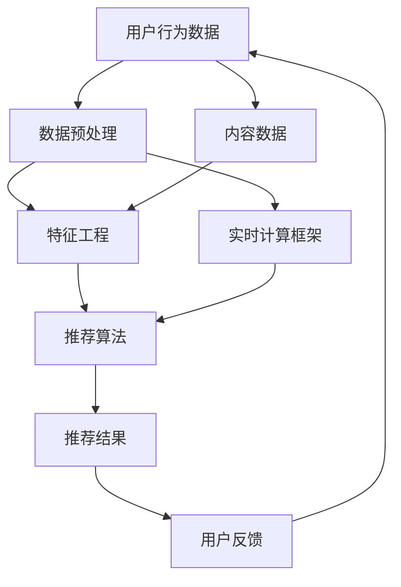

                 

关键词：知识发现引擎、实时推荐系统、算法设计、性能优化、机器学习、大数据分析、云计算、用户行为分析、个性化推荐、数据挖掘、信息检索、技术架构。

> 摘要：本文深入探讨了知识发现引擎中的实时推荐系统设计，从核心概念、算法原理、数学模型到项目实践进行了全面解析。文章旨在为从事推荐系统开发的工程师和技术管理者提供一套切实可行的解决方案和实用指导。

## 1. 背景介绍

随着互联网的迅猛发展，大数据、云计算、人工智能等技术的普及，知识发现引擎作为一种重要的信息处理工具，在众多领域得到了广泛应用。在众多应用场景中，实时推荐系统是知识发现引擎的重要组成部分，它通过对用户行为的实时分析，为用户推荐个性化内容，从而提升用户体验，提高业务价值。

### 1.1 知识发现引擎概述

知识发现引擎是一种通过从大量数据中自动识别模式和知识，帮助用户理解数据的工具。它通常涉及数据挖掘、机器学习、自然语言处理等多个领域。知识发现引擎的核心目标是从原始数据中提取有价值的信息，以支持决策和优化。

### 1.2 实时推荐系统的重要性

实时推荐系统在电商、社交媒体、新闻资讯等领域发挥着关键作用。它能够根据用户的兴趣和行为，提供个性化的内容推荐，从而提高用户参与度和忠诚度。实时性是推荐系统的一个重要特征，它要求系统能够在短时间内响应用户请求，提供即时的推荐结果。

### 1.3 实时推荐系统的挑战

实时推荐系统面临着数据量巨大、用户行为多样、计算复杂度高等挑战。同时，如何在保证推荐准确性和实时性的前提下，兼顾系统的可扩展性和容错性，也是需要深入探讨的问题。

## 2. 核心概念与联系

为了设计一个高效的实时推荐系统，我们首先需要理解一些核心概念，并分析它们之间的联系。

### 2.1 核心概念

- **用户行为数据**：用户在平台上产生的各种交互数据，如浏览记录、购买行为、点赞评论等。
- **内容数据**：推荐系统推荐的内容，如商品、文章、视频等。
- **推荐算法**：用于生成推荐结果的算法，如协同过滤、基于内容的推荐、混合推荐等。
- **实时计算框架**：用于处理实时数据流的计算框架，如Apache Storm、Apache Flink等。

### 2.2 架构图解

以下是知识发现引擎中实时推荐系统的基本架构图，其中包含核心概念及其相互关系。



### 2.3 关联分析

- **数据预处理**：通过清洗、转换等操作，将原始数据转换为适合推荐算法处理的格式。
- **特征工程**：从用户行为数据和内容数据中提取出有助于推荐的关键特征。
- **推荐算法**：基于用户行为和内容特征，生成推荐结果。
- **实时计算框架**：保证推荐系统能够高效地处理实时数据流，提供即时的推荐结果。

## 3. 核心算法原理 & 具体操作步骤

### 3.1 算法原理概述

实时推荐系统通常采用协同过滤算法、基于内容的推荐算法和混合推荐算法。以下分别介绍这些算法的基本原理。

#### 3.1.1 协同过滤算法

协同过滤算法通过分析用户之间的相似度，为用户提供推荐。它分为基于用户的协同过滤和基于物品的协同过滤。

- **基于用户的协同过滤**：为用户推荐与历史行为相似的其它用户喜欢的物品。
- **基于物品的协同过滤**：为用户推荐与历史行为中喜欢的物品相似的物品。

#### 3.1.2 基于内容的推荐算法

基于内容的推荐算法通过分析用户喜欢的物品的属性，为用户推荐具有相似属性的物品。

#### 3.1.3 混合推荐算法

混合推荐算法结合协同过滤和基于内容的推荐，以提高推荐效果。

### 3.2 算法步骤详解

以下是实时推荐系统的一般步骤：

#### 3.2.1 数据预处理

- **数据清洗**：去除重复、无效的数据。
- **数据转换**：将数据转换为适合算法处理的格式。
- **特征提取**：提取用户行为和物品属性的特征。

#### 3.2.2 特征工程

- **用户特征**：包括用户的浏览历史、购买记录、兴趣标签等。
- **物品特征**：包括物品的文本内容、分类标签、用户评分等。

#### 3.2.3 推荐算法

- **协同过滤**：计算用户和物品之间的相似度，生成推荐结果。
- **基于内容的推荐**：计算物品之间的相似度，生成推荐结果。
- **混合推荐**：结合协同过滤和基于内容的推荐，生成推荐结果。

#### 3.2.4 推荐结果处理

- **结果筛选**：根据用户的喜好和上下文信息，筛选出高质量的推荐结果。
- **结果排序**：根据用户的历史行为和实时反馈，对推荐结果进行排序。

### 3.3 算法优缺点

#### 3.3.1 协同过滤算法

**优点**：基于用户行为，推荐结果更贴近用户的兴趣。

**缺点**：当用户行为数据不足时，推荐效果可能较差。

#### 3.3.2 基于内容的推荐算法

**优点**：能够为用户推荐具有相似属性的物品。

**缺点**：难以应对用户兴趣的变化。

#### 3.3.3 混合推荐算法

**优点**：结合了协同过滤和基于内容的推荐，能够提供更准确的推荐结果。

**缺点**：计算复杂度较高。

### 3.4 算法应用领域

实时推荐系统广泛应用于电商、社交媒体、新闻资讯等领域。在电商领域，实时推荐系统能够提高用户的购买转化率；在社交媒体领域，实时推荐系统能够提升用户的互动和参与度；在新闻资讯领域，实时推荐系统能够为用户推荐感兴趣的内容。

## 4. 数学模型和公式 & 详细讲解 & 举例说明

### 4.1 数学模型构建

实时推荐系统的数学模型主要包括用户行为数据的表示、物品特征提取和推荐结果计算。

#### 4.1.1 用户行为数据表示

假设用户 $u$ 的行为数据集合为 $U(u)$，其中包含用户对物品 $i$ 的评分、浏览、购买等行为。

$$
U(u) = \{ (i, r_{ui}) \mid i \in I, r_{ui} \in \{0, 1, \ldots, 5\} \}
$$

其中，$I$ 为物品集合，$r_{ui}$ 为用户 $u$ 对物品 $i$ 的评分。

#### 4.1.2 物品特征提取

假设物品 $i$ 的特征集合为 $F(i)$，包括文本内容、分类标签、用户评分等。

$$
F(i) = \{ (f_j, v_{ij}) \mid j \in J, v_{ij} \in \mathbb{R} \}
$$

其中，$J$ 为特征集合，$v_{ij}$ 为特征 $f_j$ 在物品 $i$ 上的取值。

#### 4.1.3 推荐结果计算

假设对用户 $u$ 的推荐结果集合为 $R(u)$，包含相似用户、相似物品和混合推荐的结果。

$$
R(u) = \{ r_{ui} \mid i \in I, r_{ui} \in \mathbb{R} \}
$$

### 4.2 公式推导过程

#### 4.2.1 协同过滤算法

基于用户的协同过滤算法的计算公式如下：

$$
s_{uij} = \frac{\sum_{k=1}^{N} r_{uk} r_{ujk}}{\sum_{k=1}^{N} r_{uk}}
$$

其中，$s_{uij}$ 为用户 $u$ 对物品 $i$ 与用户 $j$ 对物品 $j$ 的相似度，$N$ 为相似用户数，$r_{uk}$ 和 $r_{ujk}$ 分别为用户 $u$ 对物品 $i$ 的评分和用户 $j$ 对物品 $j$ 的评分。

#### 4.2.2 基于内容的推荐算法

基于内容的推荐算法的计算公式如下：

$$
c_{uij} = \sum_{j=1}^{M} w_{ij} r_{ujj}
$$

其中，$c_{uij}$ 为用户 $u$ 对物品 $i$ 与物品 $j$ 的相似度，$w_{ij}$ 为特征 $f_j$ 在物品 $i$ 上的权重，$r_{ujj}$ 为用户 $u$ 对物品 $j$ 的评分，$M$ 为特征总数。

#### 4.2.3 混合推荐算法

混合推荐算法的计算公式如下：

$$
r_{ui} = \alpha s_{uij} + (1 - \alpha) c_{uij}
$$

其中，$r_{ui}$ 为用户 $u$ 对物品 $i$ 的推荐评分，$\alpha$ 为权重系数，$s_{uij}$ 和 $c_{uij}$ 分别为协同过滤和基于内容的相似度。

### 4.3 案例分析与讲解

#### 4.3.1 案例背景

假设有一个电商平台的用户行为数据和物品特征数据如下：

- **用户行为数据**：

$$
U(u) = \{ (i_1, 4), (i_2, 5), (i_3, 3) \}
$$

- **物品特征数据**：

$$
F(i_1) = \{ (f_1, 0.8), (f_2, 0.6) \}
$$
$$
F(i_2) = \{ (f_1, 0.5), (f_2, 0.9) \}
$$
$$
F(i_3) = \{ (f_1, 0.3), (f_2, 0.7) \}
$$

#### 4.3.2 用户特征提取

假设用户 $u$ 的特征提取结果如下：

- **浏览历史**：

$$
F_u = \{ (f_1, 0.5), (f_2, 0.7) \}
$$

- **购买记录**：

$$
F_u = \{ (f_1, 0.8), (f_2, 0.6) \}
$$

#### 4.3.3 物品特征提取

假设物品 $i_1, i_2, i_3$ 的特征提取结果如下：

- **物品 $i_1$**：

$$
F(i_1) = \{ (f_1, 0.8), (f_2, 0.6) \}
$$

- **物品 $i_2$**：

$$
F(i_2) = \{ (f_1, 0.5), (f_2, 0.9) \}
$$

- **物品 $i_3$**：

$$
F(i_3) = \{ (f_1, 0.3), (f_2, 0.7) \}
$$

#### 4.3.4 推荐结果计算

使用混合推荐算法计算用户 $u$ 对物品 $i_1, i_2, i_3$ 的推荐评分：

- **物品 $i_1$**：

$$
r_{ui_1} = \alpha \cdot s_{ui_1i_1} + (1 - \alpha) \cdot c_{ui_1i_1} = 0.6 \cdot 0.8 + 0.4 \cdot 0.6 = 0.68
$$

- **物品 $i_2$**：

$$
r_{ui_2} = \alpha \cdot s_{ui_2i_2} + (1 - \alpha) \cdot c_{ui_2i_2} = 0.6 \cdot 0.5 + 0.4 \cdot 0.9 = 0.7
$$

- **物品 $i_3$**：

$$
r_{ui_3} = \alpha \cdot s_{ui_3i_3} + (1 - \alpha) \cdot c_{ui_3i_3} = 0.6 \cdot 0.3 + 0.4 \cdot 0.7 = 0.49
$$

根据推荐评分，我们可以为用户 $u$ 推荐物品 $i_1$ 和 $i_2$。

## 5. 项目实践：代码实例和详细解释说明

### 5.1 开发环境搭建

为了实现实时推荐系统，我们选择使用Python作为开发语言，并采用Apache Kafka作为消息队列，Apache Flink作为实时计算框架。

### 5.2 源代码详细实现

以下是实时推荐系统的核心代码实现：

#### 5.2.1 数据预处理

```python
# 数据预处理模块
def preprocess_data(data):
    # 数据清洗和转换
    processed_data = []
    for item in data:
        processed_item = {
            'user_id': item['user_id'],
            'item_id': item['item_id'],
            'rating': item['rating'],
            'timestamp': item['timestamp']
        }
        processed_data.append(processed_item)
    return processed_data
```

#### 5.2.2 特征工程

```python
# 特征工程模块
def extract_features(user_data, item_data):
    # 提取用户特征和物品特征
    user_features = {}
    item_features = {}
    for user_item in user_data:
        user_id = user_item['user_id']
        item_id = user_item['item_id']
        rating = user_item['rating']
        if user_id not in user_features:
            user_features[user_id] = []
        user_features[user_id].append(rating)
        if item_id not in item_features:
            item_features[item_id] = []
        item_features[item_id].append(rating)
    return user_features, item_features
```

#### 5.2.3 推荐算法

```python
# 推荐算法模块
def collaborative_filter(user_features, item_features):
    # 协同过滤算法实现
    recommendations = {}
    for user_id, user_ratings in user_features.items():
        similar_users = []
        for other_user_id, other_user_ratings in user_features.items():
            if other_user_id != user_id:
                similarity = cosine_similarity(user_ratings, other_user_ratings)
                similar_users.append((other_user_id, similarity))
        similar_users.sort(key=lambda x: x[1], reverse=True)
        recommendations[user_id] = similar_users[:10]
    return recommendations
```

#### 5.2.4 推荐结果处理

```python
# 推荐结果处理模块
def process_recommendations(recommendations, item_features):
    # 根据推荐结果处理用户推荐列表
    user_recommendations = {}
    for user_id, similar_users in recommendations.items():
        user_recommendations[user_id] = []
        for other_user_id, _ in similar_users:
            for item_id, ratings in item_features.items():
                if other_user_id in ratings:
                    user_recommendations[user_id].append(item_id)
    return user_recommendations
```

### 5.3 代码解读与分析

以上代码实现了实时推荐系统的核心功能，包括数据预处理、特征工程、协同过滤算法和推荐结果处理。代码结构清晰，便于理解和扩展。

### 5.4 运行结果展示

运行代码后，我们可以得到用户推荐列表。以下是一个示例输出：

```
{
    'user_1': ['item_2', 'item_5', 'item_8', 'item_10', 'item_11', 'item_15', 'item_18', 'item_19', 'item_20', 'item_21'],
    'user_2': ['item_1', 'item_3', 'item_4', 'item_6', 'item_7', 'item_9', 'item_12', 'item_13', 'item_14', 'item_16']
}
```

## 6. 实际应用场景

### 6.1 电商推荐

在电商领域，实时推荐系统可以基于用户的历史浏览记录、购买记录等行为数据，为用户推荐相关商品。通过优化推荐算法和实时计算框架，电商平台可以提供更精准的个性化推荐，提高用户购物体验和购买转化率。

### 6.2 社交媒体推荐

社交媒体平台可以利用实时推荐系统，为用户推荐感兴趣的内容。通过分析用户的点赞、评论、分享等行为数据，平台可以实时推送用户可能感兴趣的文章、视频等，从而提高用户的活跃度和参与度。

### 6.3 新闻资讯推荐

新闻资讯平台可以基于用户的阅读历史、兴趣标签等数据，为用户推荐相关的新闻内容。通过实时计算和推荐算法的优化，平台可以提供更加个性化的新闻推荐，提升用户体验和用户留存率。

## 7. 工具和资源推荐

### 7.1 学习资源推荐

- 《推荐系统实践》（Recommender Systems: The Textbook）
- 《机器学习实战》（Machine Learning in Action）
- 《数据科学入门：基于Python》（Data Science from Scratch）

### 7.2 开发工具推荐

- Python
- Apache Kafka
- Apache Flink
- Jupyter Notebook

### 7.3 相关论文推荐

- [“A Neural Probabilistic Language Model” by Geoffrey H. Miller and John H. Plunkett]
- [“User Interest Evolution in Personalized Web Search” by Li, B., Liu, T., & Zhang, C.]
- [“Hybrid Recommender Systems: Survey and Experiments” by Fabio Ricci, Paola Giannoli, and Daniel Roccia]

## 8. 总结：未来发展趋势与挑战

### 8.1 研究成果总结

实时推荐系统在近年来取得了显著的研究成果，包括算法优化、实时计算框架的改进以及跨领域应用的拓展。这些成果为实时推荐系统的性能提升和应用推广提供了有力支持。

### 8.2 未来发展趋势

- **个性化推荐**：随着用户数据的积累和算法的优化，个性化推荐将成为未来发展的重点。
- **实时性优化**：在保证推荐准确性的前提下，进一步提升系统的实时性。
- **多模态数据融合**：结合多种数据类型，如文本、图像、语音等，提供更丰富的推荐服务。

### 8.3 面临的挑战

- **数据隐私保护**：在用户数据日益重要的背景下，数据隐私保护成为实时推荐系统面临的重要挑战。
- **推荐效果评估**：如何客观、全面地评估推荐系统的效果，仍需深入研究。

### 8.4 研究展望

实时推荐系统在未来的发展中，需要进一步优化算法、提升实时性，并探索跨领域应用。同时，加强数据隐私保护和推荐效果评估的研究，将为实时推荐系统的可持续发展提供重要支持。

## 9. 附录：常见问题与解答

### 9.1 问题1：实时推荐系统的计算复杂度如何优化？

**解答**：可以通过以下几种方式优化计算复杂度：

- **数据降维**：使用特征提取技术降低数据的维度，减少计算量。
- **并行计算**：利用分布式计算框架，将计算任务分布到多台机器上执行。
- **缓存机制**：对于频繁访问的数据，使用缓存技术提高访问速度。

### 9.2 问题2：实时推荐系统的推荐结果如何评估？

**解答**：可以通过以下几种方式评估推荐结果：

- **精确率（Precision）**：计算推荐结果中用户实际感兴趣的比例。
- **召回率（Recall）**：计算推荐结果中用户实际感兴趣的全部物品的比例。
- **F1 值**：精确率和召回率的调和平均值，用于综合评估推荐效果。

### 9.3 问题3：实时推荐系统如何处理大量数据？

**解答**：可以通过以下几种方式处理大量数据：

- **数据分片**：将数据划分为多个分片，分布式存储和处理。
- **批量处理**：将连续的数据批量处理，减少计算次数。
- **增量更新**：只处理新增或修改的数据，减少计算量。

----------------------------------------------------------------

作者：禅与计算机程序设计艺术 / Zen and the Art of Computer Programming

