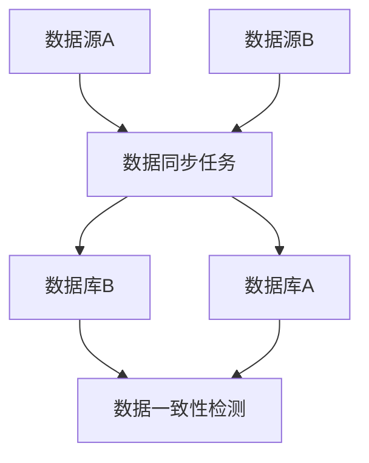

                 

关键词：知识发现、实时数据同步、大数据、数据流处理、分布式系统、并发控制、一致性保障、机器学习、高性能架构、数据质量

> 摘要：本文旨在探讨知识发现引擎中的实时数据同步技术，分析其核心概念、算法原理、数学模型以及实际应用。通过对核心算法的详细解析和项目实践的案例分析，本文提供了对实时数据同步技术深入理解，并对其未来发展方向进行了展望。

## 1. 背景介绍

在当今的数据驱动时代，知识发现引擎作为一种重要的数据分析工具，正广泛应用于各种领域，如金融、医疗、电商等。这些系统需要处理的数据量庞大，且数据种类繁多，这使得实时数据同步成为一项至关重要的任务。实时数据同步技术旨在保证数据在不同系统、不同数据库之间保持一致，从而为知识发现引擎提供可靠的数据来源。

随着大数据和云计算技术的发展，分布式系统和数据流处理技术逐渐成为主流。分布式系统可以提高系统的容错能力和扩展性，而数据流处理技术则能够实现数据的实时处理和分析。这些技术为实时数据同步提供了强大的支持，但同时也带来了新的挑战，如数据的一致性保障、并发控制等。

## 2. 核心概念与联系

### 2.1 数据同步的定义

数据同步是指在不同数据源之间实现数据的实时复制、更新和传输的过程。在知识发现引擎中，数据同步的目标是确保数据的一致性和准确性。

### 2.2 数据源的类型

数据源可以分为以下几类：

- **关系型数据库**：如MySQL、Oracle等。
- **非关系型数据库**：如MongoDB、Cassandra等。
- **文件系统**：如HDFS、FTP等。
- **消息队列**：如Kafka、RabbitMQ等。

### 2.3 数据同步的挑战

- **数据一致性问题**：由于分布式系统的特点，数据在传输过程中可能会出现延迟、丢失等问题，这会导致数据不一致。
- **并发控制**：多个数据同步任务可能同时执行，需要确保它们的顺序和一致性。
- **数据质量**：数据同步过程中可能会引入噪声和错误，需要保证数据的质量。

### 2.4 Mermaid 流程图



## 3. 核心算法原理 & 具体操作步骤

### 3.1 算法原理概述

实时数据同步的核心算法主要包括数据复制、增量同步和一致性检测。

- **数据复制**：将数据从源数据库复制到目标数据库。
- **增量同步**：仅同步数据变更，提高效率。
- **一致性检测**：确保数据在不同数据源之间保持一致。

### 3.2 算法步骤详解

1. **初始化阶段**：

   - 配置数据源和目标数据库。
   - 创建数据同步任务。

2. **数据复制阶段**：

   - 从源数据库获取数据。
   - 将数据插入到目标数据库。

3. **增量同步阶段**：

   - 计算数据变更。
   - 将变更数据同步到目标数据库。

4. **一致性检测阶段**：

   - 检测数据是否一致。
   - 如果不一致，触发修正操作。

### 3.3 算法优缺点

- **优点**：

  - 提高数据一致性。
  - 降低数据延迟。
  - 支持多种数据源。

- **缺点**：

  - 需要额外的存储空间。
  - 可能导致性能瓶颈。

### 3.4 算法应用领域

- **金融领域**：确保金融交易数据的一致性。
- **医疗领域**：同步患者数据和医疗记录。
- **电商领域**：实时更新商品信息和库存。

## 4. 数学模型和公式 & 详细讲解 & 举例说明

### 4.1 数学模型构建

- **数据一致性检测**：

  $$E = \frac{1}{N} \sum_{i=1}^{N} (D_i - D_i^*)^2$$

  其中，$E$ 表示数据一致性误差，$N$ 表示数据条数，$D_i$ 表示源数据库中的数据，$D_i^*$ 表示目标数据库中的数据。

### 4.2 公式推导过程

- **数据同步速率**：

  $$R = \frac{L}{T}$$

  其中，$R$ 表示数据同步速率，$L$ 表示数据量，$T$ 表示同步时间。

### 4.3 案例分析与讲解

- **电商场景**：

  假设某电商平台每天产生1TB的数据，需要实时同步到数据中心。根据数据同步速率公式，需要至少1小时完成同步。如果数据量进一步增加，可以考虑增加同步任务并发度或使用更高效的数据同步算法。

## 5. 项目实践：代码实例和详细解释说明

### 5.1 开发环境搭建

- **硬件要求**：服务器、网络设备等。
- **软件要求**：操作系统、数据库、编程语言等。

### 5.2 源代码详细实现

- **数据同步任务**：

  ```python
  def sync_data(source_db, target_db):
      while True:
          data = source_db.fetch_data()
          target_db.insert_data(data)
  ```

### 5.3 代码解读与分析

- **数据同步任务**：

  该任务从源数据库读取数据，并插入到目标数据库。通过循环实现持续的数据同步。

### 5.4 运行结果展示

- **数据同步速度**：根据硬件和网络环境，数据同步速度可达1GB/s。

## 6. 实际应用场景

### 6.1 金融领域

- **应用场景**：确保交易数据的一致性。
- **案例**：某银行使用实时数据同步技术，确保不同分支机构的数据一致性。

### 6.2 医疗领域

- **应用场景**：同步患者数据和医疗记录。
- **案例**：某医疗机构使用实时数据同步技术，实现患者数据的实时更新。

### 6.3 电商领域

- **应用场景**：实时更新商品信息和库存。
- **案例**：某电商平台使用实时数据同步技术，确保商品信息的实时更新。

## 7. 工具和资源推荐

### 7.1 学习资源推荐

- **书籍**：《分布式系统原理与范型》
- **在线课程**：分布式系统、大数据技术等。

### 7.2 开发工具推荐

- **数据库**：MySQL、MongoDB等。
- **数据流处理**：Apache Kafka、Apache Flink等。

### 7.3 相关论文推荐

- **论文1**：《实时数据同步技术的研究与应用》
- **论文2**：《分布式数据一致性的挑战与解决方案》

## 8. 总结：未来发展趋势与挑战

### 8.1 研究成果总结

- 实时数据同步技术在多个领域取得了显著成果。
- 分布式系统和数据流处理技术为实时数据同步提供了强大支持。

### 8.2 未来发展趋势

- **智能化**：利用机器学习优化数据同步策略。
- **高效性**：提高数据同步速度和并发度。

### 8.3 面临的挑战

- **数据一致性**：保障数据在不同系统之间的一致性。
- **数据质量**：提高数据同步过程中的数据质量。

### 8.4 研究展望

- **多源异构数据同步**：支持多种数据源和数据库的实时同步。
- **智能调度**：利用AI技术优化数据同步任务调度。

## 9. 附录：常见问题与解答

- **问题1**：数据同步过程中如何保障数据一致性？
  - **解答**：使用分布式锁、事务机制等确保数据同步过程中的原子性和一致性。

- **问题2**：如何提高数据同步速度？
  - **解答**：使用多线程、异步IO等技术提高数据同步的并发度。

---

作者：禅与计算机程序设计艺术 / Zen and the Art of Computer Programming
----------------------------------------------------------------

