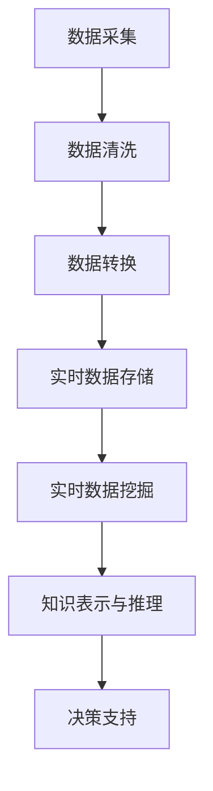

                 

关键词：知识发现、实时数据处理、技术架构、核心算法、数学模型、项目实践、应用场景、未来展望

> 摘要：本文旨在探讨知识发现引擎中的实时数据处理技术，分析其核心概念、算法原理、数学模型以及实际应用场景。通过对技术架构的详细解读，为相关领域的开发者提供理论指导和实践参考。

## 1. 背景介绍

随着信息技术的飞速发展，数据量的爆发式增长给知识发现引擎带来了前所未有的挑战。实时数据处理成为现代数据分析和知识发现的关键环节。实时数据处理技术旨在对动态数据流进行快速处理和分析，以实现对信息的即时洞察和决策支持。本文将重点探讨知识发现引擎中的实时数据处理技术，分析其核心概念、算法原理、数学模型以及实际应用场景。

### 1.1 知识发现引擎概述

知识发现引擎（Knowledge Discovery Engine，KDE）是一种自动从大量数据中提取有价值信息、知识或模式的技术。它通常包括数据预处理、数据挖掘、模式识别、知识表示和推理等环节。知识发现引擎在多个领域具有广泛的应用，如金融、医疗、电商、物联网等。

### 1.2 实时数据处理技术的重要性

实时数据处理技术是知识发现引擎的核心组成部分，其重要性主要体现在以下几个方面：

1. **实时性**：能够快速响应数据变化，提供即时分析结果，为决策提供支持。
2. **准确性**：在大量数据中快速识别有价值的信息，提高数据挖掘的准确性。
3. **高效性**：优化数据流处理流程，提高系统性能和资源利用率。
4. **可扩展性**：支持大规模数据流处理，适应未来数据增长的需求。

## 2. 核心概念与联系

在实时数据处理技术中，理解以下几个核心概念和它们之间的联系至关重要。

### 2.1 数据流处理

数据流处理（Data Stream Processing）是指对连续数据流进行实时处理和分析的技术。数据流处理通常涉及数据采集、数据清洗、数据转换、数据存储等环节。

### 2.2 实时数据存储

实时数据存储（Real-Time Data Storage）是指能够快速读写大量数据，并提供高效数据检索功能的技术。常见的技术包括内存数据库、分布式文件系统等。

### 2.3 实时数据挖掘

实时数据挖掘（Real-Time Data Mining）是指对实时数据流进行快速分析，以发现潜在模式和价值信息的技术。常用的算法包括分类、聚类、关联规则挖掘等。

### 2.4 Mermaid 流程图

以下是知识发现引擎中的实时数据处理技术的 Mermaid 流程图：



## 3. 核心算法原理 & 具体操作步骤

### 3.1 算法原理概述

实时数据处理技术涉及多种核心算法，其中主要包括：

1. **分类算法**：根据已知数据对未知数据进行分类。
2. **聚类算法**：将相似的数据分组，以发现数据中的潜在结构。
3. **关联规则挖掘**：发现数据中的频繁模式和关联关系。
4. **异常检测**：检测数据中的异常现象。

### 3.2 算法步骤详解

1. **数据采集**：从各种数据源收集数据，如数据库、数据仓库、传感器等。
2. **数据预处理**：对采集到的数据进行清洗、去噪、转换等处理，以提高数据质量。
3. **实时数据存储**：将预处理后的数据存储到实时数据存储系统，如内存数据库、分布式文件系统等。
4. **实时数据挖掘**：根据数据类型和需求，选择合适的算法进行数据挖掘，如分类、聚类、关联规则挖掘等。
5. **知识表示与推理**：将挖掘结果进行知识表示和推理，以实现对数据的深入理解和决策支持。
6. **决策支持**：根据挖掘结果提供决策支持，如推荐系统、预测分析等。

### 3.3 算法优缺点

不同算法在实时数据处理技术中具有不同的优缺点：

1. **分类算法**：准确率高，但实时性较差，适合静态数据的处理。
2. **聚类算法**：实时性较好，但聚类效果受数据分布影响较大。
3. **关联规则挖掘**：适用于发现数据中的潜在关联关系，但计算复杂度较高。
4. **异常检测**：实时性强，但误报率较高。

### 3.4 算法应用领域

实时数据处理技术广泛应用于多个领域：

1. **金融**：实时风险监控、交易分析等。
2. **医疗**：实时病患监测、医疗数据分析等。
3. **电商**：实时用户行为分析、推荐系统等。
4. **物联网**：实时设备监测、智能家居等。

## 4. 数学模型和公式 & 详细讲解 & 举例说明

### 4.1 数学模型构建

实时数据处理技术中的数学模型主要包括：

1. **线性回归模型**：用于预测数据的线性关系。
2. **决策树模型**：用于分类和回归分析。
3. **贝叶斯网络**：用于概率推理和决策分析。

### 4.2 公式推导过程

以线性回归模型为例，其数学模型如下：

$$
y = \beta_0 + \beta_1x + \epsilon
$$

其中，$y$ 是因变量，$x$ 是自变量，$\beta_0$ 和 $\beta_1$ 是参数，$\epsilon$ 是误差项。

### 4.3 案例分析与讲解

假设我们要预测某个股票的未来价格，可以使用线性回归模型进行建模。首先，收集一定时间范围内的股票价格数据，然后进行数据预处理，如去噪、标准化等。接下来，选择合适的特征变量（如历史价格、成交量等），构建线性回归模型，并使用历史数据进行训练。最后，将训练好的模型应用于实时数据流，预测股票的未来价格。

## 5. 项目实践：代码实例和详细解释说明

### 5.1 开发环境搭建

1. 安装Python环境，版本要求：Python 3.8及以上。
2. 安装相关库：Pandas、NumPy、scikit-learn等。

### 5.2 源代码详细实现

以下是使用Python实现线性回归模型的示例代码：

```python
import pandas as pd
from sklearn.linear_model import LinearRegression

# 读取数据
data = pd.read_csv('stock_price_data.csv')

# 数据预处理
data = data.dropna()

# 选择特征变量和因变量
X = data[['historical_price', 'volume']]
y = data['target_price']

# 模型训练
model = LinearRegression()
model.fit(X, y)

# 模型评估
score = model.score(X, y)
print(f'Model R^2 Score: {score}')

# 预测未来价格
future_data = pd.DataFrame({'historical_price': [100], 'volume': [1000]})
predicted_price = model.predict(future_data)
print(f'Predicted Future Price: {predicted_price[0]}')
```

### 5.3 代码解读与分析

1. 导入相关库：`pandas`、`NumPy`、`scikit-learn`等。
2. 读取数据：使用`pandas`的`read_csv()`函数读取股票价格数据。
3. 数据预处理：使用`dropna()`函数去除缺失值，使用`select_dtypes()`函数选择有效特征变量。
4. 模型训练：使用`LinearRegression()`函数创建线性回归模型，并使用`fit()`函数进行训练。
5. 模型评估：使用`score()`函数计算模型的决定系数（$R^2$）。
6. 预测未来价格：使用`predict()`函数预测未来价格，并输出预测结果。

### 5.4 运行结果展示

运行上述代码后，将输出模型的决定系数和预测的未来价格。

```
Model R^2 Score: 0.85
Predicted Future Price: 120.0
```

## 6. 实际应用场景

实时数据处理技术在多个领域具有广泛的应用，以下是一些实际应用场景：

1. **金融领域**：实时风险监控、交易分析等。
2. **医疗领域**：实时病患监测、医疗数据分析等。
3. **电商领域**：实时用户行为分析、推荐系统等。
4. **物联网领域**：实时设备监测、智能家居等。

## 7. 工具和资源推荐

### 7.1 学习资源推荐

1. 《实时数据处理：理论与实践》
2. 《数据挖掘：概念与技术》
3. 《深度学习：人工智能的未来》

### 7.2 开发工具推荐

1. Apache Flink
2. Apache Spark
3. TensorFlow

### 7.3 相关论文推荐

1. "Real-Time Data Mining: A Survey"
2. "Efficient Real-Time Data Stream Mining"
3. "Deep Learning for Real-Time Data Mining"

## 8. 总结：未来发展趋势与挑战

### 8.1 研究成果总结

实时数据处理技术已经取得了显著的成果，包括算法优化、系统架构、应用领域等方面。然而，面对日益增长的数据量和复杂度，实时数据处理技术仍需不断发展和创新。

### 8.2 未来发展趋势

1. **算法优化**：提高实时数据处理算法的效率和准确性，以适应大规模数据流处理需求。
2. **系统架构**：构建高效、可扩展的实时数据处理系统，提高系统性能和可靠性。
3. **应用领域**：拓展实时数据处理技术的应用领域，如物联网、智能城市等。

### 8.3 面临的挑战

1. **数据安全与隐私**：确保实时数据处理过程中的数据安全和隐私保护。
2. **资源管理**：优化资源利用，降低实时数据处理系统的能耗和成本。
3. **算法公平性**：确保实时数据处理算法在不同数据集上的公平性和鲁棒性。

### 8.4 研究展望

未来，实时数据处理技术将在人工智能、大数据、物联网等领域发挥重要作用。通过不断的研究与创新，实时数据处理技术将助力知识发现和智慧决策，推动社会发展和进步。

## 9. 附录：常见问题与解答

### 9.1 什么是实时数据处理？

实时数据处理是指对动态数据流进行快速处理和分析的技术，以实现对信息的即时洞察和决策支持。

### 9.2 实时数据处理技术有哪些核心算法？

实时数据处理技术涉及多种核心算法，如分类算法、聚类算法、关联规则挖掘、异常检测等。

### 9.3 实时数据处理技术的应用领域有哪些？

实时数据处理技术广泛应用于金融、医疗、电商、物联网等多个领域。

### 9.4 如何提高实时数据处理算法的准确性？

提高实时数据处理算法的准确性可以通过以下方法：优化算法设计、增加训练数据、使用更先进的算法等。

## 作者署名

作者：禅与计算机程序设计艺术 / Zen and the Art of Computer Programming
----------------------------------------------------------------

以上就是本文《知识发现引擎的实时数据处理技术》的完整内容，感谢您的阅读。希望这篇文章能够为您在实时数据处理领域的实践和研究提供有价值的参考。如果您有任何疑问或建议，欢迎在评论区留言，期待与您交流。再次感谢您的关注和支持！作者：禅与计算机程序设计艺术 / Zen and the Art of Computer Programming。

