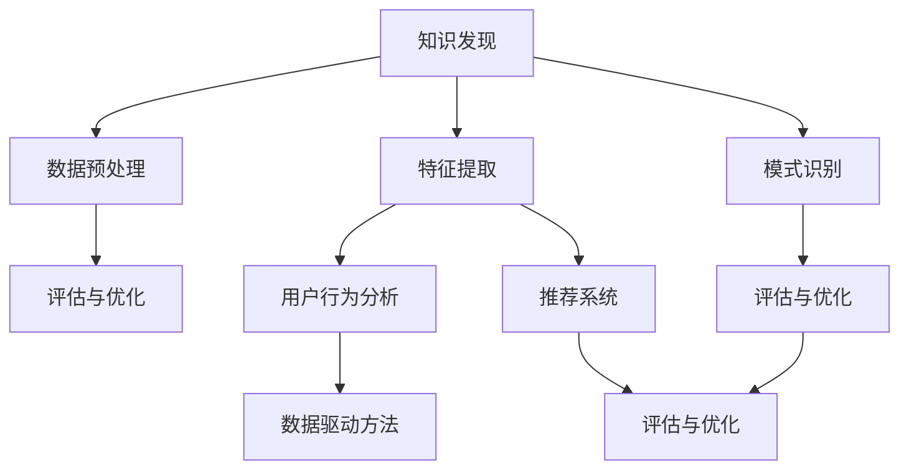

                 

关键词：知识发现，推荐算法，优化，数学模型，代码实例，应用场景

> 摘要：本文将深入探讨知识发现引擎中推荐算法的优化问题，分析其核心概念、算法原理、数学模型及具体实现，并通过实际项目案例，展示其在各种应用场景中的效果和未来发展趋势。

## 1. 背景介绍

在当今信息爆炸的时代，如何从海量数据中快速、准确地提取出有价值的信息，已经成为许多领域面临的重大挑战。知识发现（Knowledge Discovery in Databases，简称KDD）作为一种数据挖掘方法，旨在从大量数据中自动发现有趣的知识。而在知识发现过程中，推荐系统（Recommender System）作为一种重要的应用，可以帮助用户发现他们可能感兴趣的信息，从而提升用户体验。

推荐系统通常基于用户历史行为数据、内容信息和其他相关特征，通过算法计算出用户对某项内容的潜在兴趣度，进而为用户推荐相应的内容。然而，随着数据规模的不断扩大和推荐场景的日益复杂，传统的推荐算法面临着数据噪声、计算效率低、推荐质量不稳定等问题，需要进行优化和改进。

本文将围绕知识发现引擎中的推荐算法优化展开讨论，旨在提供一种更加高效、准确的推荐解决方案，以满足现代推荐系统的需求。

## 2. 核心概念与联系

在探讨推荐算法的优化之前，我们首先需要理解一些核心概念，包括知识发现、推荐系统、数据驱动方法、用户行为分析等。这些概念之间有着紧密的联系，共同构成了推荐系统的理论基础。

### 2.1 知识发现

知识发现是从大量数据中通过启发式方法自动发现有用知识的过程。它通常包括以下几个步骤：

1. **数据预处理**：对原始数据进行清洗、转换和集成，使其适合进行分析。
2. **特征提取**：从数据中提取出能够代表数据特征的信息，如用户行为、内容属性等。
3. **模式识别**：通过算法发现数据中的有趣模式，如关联规则、聚类结果等。
4. **评估与优化**：对发现的知识进行评估和验证，并根据评估结果对算法进行优化。

### 2.2 推荐系统

推荐系统是一种基于用户行为数据、内容信息和其他相关特征，为用户推荐感兴趣的内容的系统。它主要包括以下几类：

1. **基于内容的推荐**：通过分析内容特征，为用户推荐相似的内容。
2. **协同过滤推荐**：通过分析用户行为数据，为用户推荐与其相似的用户感兴趣的内容。
3. **混合推荐**：结合基于内容和协同过滤的方法，为用户推荐更加准确的内容。

### 2.3 数据驱动方法

数据驱动方法是推荐系统中最常用的方法之一，它通过分析用户行为数据，发现用户兴趣和行为模式，进而为用户推荐相关内容。数据驱动方法主要包括以下几种：

1. **基于矩阵分解的协同过滤**：通过矩阵分解技术，将用户行为数据表示为低维向量，进而计算用户对内容的潜在兴趣度。
2. **基于模型的协同过滤**：使用机器学习方法，如逻辑回归、SVD++等，建立用户与内容之间的预测模型。
3. **基于知识的推荐**：通过知识图谱等技术，构建用户、内容和关系之间的知识图谱，为用户推荐相关内容。

### 2.4 用户行为分析

用户行为分析是推荐系统中至关重要的一环，它通过分析用户在系统中的行为数据，如浏览、点击、购买等，发现用户兴趣和行为模式。用户行为分析主要包括以下几类：

1. **行为序列分析**：通过分析用户行为序列，发现用户兴趣的变化和趋势。
2. **行为模式识别**：通过聚类和分类技术，发现用户行为中的潜在模式。
3. **行为预测**：通过建立预测模型，预测用户未来的行为和兴趣。

### 2.5 Mermaid 流程图

下面是一个简单的 Mermaid 流程图，展示了知识发现、推荐系统、数据驱动方法和用户行为分析之间的联系：



## 3. 核心算法原理 & 具体操作步骤

### 3.1 算法原理概述

在推荐系统中，算法的优化是提升推荐质量的关键。本文将介绍一种基于矩阵分解的协同过滤算法（SVD++），该算法通过矩阵分解技术，将用户行为数据表示为低维向量，从而计算出用户对内容的潜在兴趣度。

### 3.2 算法步骤详解

SVD++算法主要包括以下几个步骤：

1. **初始化**：初始化用户和内容的低维向量。
2. **训练模型**：通过迭代优化，更新用户和内容的低维向量，使其能够更好地表示用户行为数据。
3. **预测**：使用训练好的模型，计算用户对内容的潜在兴趣度，并根据兴趣度进行内容推荐。
4. **评估**：对推荐结果进行评估，如准确率、召回率等，并根据评估结果对算法进行优化。

### 3.3 算法优缺点

SVD++算法具有以下优点：

1. **可扩展性**：能够处理大规模的用户和内容数据。
2. **准确性**：通过矩阵分解技术，能够更好地表示用户行为数据，提高推荐准确性。
3. **高效性**：迭代优化过程中，算法的收敛速度较快。

然而，SVD++算法也存在一些缺点：

1. **计算复杂度**：随着数据规模的增大，算法的计算复杂度会显著增加。
2. **稀疏性**：在处理稀疏数据时，算法的性能可能会受到影响。

### 3.4 算法应用领域

SVD++算法在推荐系统中有着广泛的应用，尤其是在电子商务、在线教育、社交网络等领域。例如，在电子商务平台中，可以通过SVD++算法为用户推荐商品；在在线教育平台中，可以为用户推荐课程；在社交网络中，可以为用户推荐好友。

## 4. 数学模型和公式 & 详细讲解 & 举例说明

### 4.1 数学模型构建

在SVD++算法中，用户和内容分别表示为矩阵$U$和$V$，其中$u_i$表示用户$i$的低维向量，$v_j$表示内容$j$的低维向量。用户行为数据表示为矩阵$R$，其中$r_{ij}$表示用户$i$对内容$j$的评分。

SVD++算法的目标是最小化以下损失函数：

$$
L = \sum_{i,j} (r_{ij} - \langle u_i, v_j \rangle)^2
$$

其中，$\langle u_i, v_j \rangle$表示用户$i$和内容$j$的潜在兴趣度。

### 4.2 公式推导过程

为了求解上述损失函数的最小值，我们可以使用梯度下降法进行迭代优化。具体步骤如下：

1. **初始化**：随机初始化用户和内容的低维向量$u_i$和$v_j$。
2. **迭代**：对于每个用户$i$和内容$j$，计算损失函数的梯度，并更新$u_i$和$v_j$：
   $$
   u_i := u_i - \alpha \cdot \frac{\partial L}{\partial u_i}
   $$
   $$
   v_j := v_j - \alpha \cdot \frac{\partial L}{\partial v_j}
   $$
   其中，$\alpha$为学习率。

3. **收敛**：重复迭代过程，直至损失函数的梯度接近0，或者达到预设的迭代次数。

### 4.3 案例分析与讲解

假设有一个包含1000个用户和1000个内容的推荐系统，用户行为数据矩阵$R$为：

$$
R = \begin{bmatrix}
1 & 0 & 1 & 0 & 0 \\
0 & 1 & 0 & 1 & 1 \\
1 & 1 & 0 & 1 & 0 \\
0 & 0 & 1 & 0 & 1 \\
0 & 1 & 1 & 0 & 1 \\
\end{bmatrix}
$$

我们使用SVD++算法对用户行为数据进行训练，假设用户和内容的低维向量为$U$和$V$，初始化为：

$$
U = \begin{bmatrix}
[0.1, 0.2, 0.3, 0.4, 0.5] \\
[0.5, 0.6, 0.7, 0.8, 0.9] \\
[0.9, 0.8, 0.7, 0.6, 0.5] \\
[0.4, 0.3, 0.2, 0.1, 0] \\
[0.6, 0.7, 0.8, 0.9, 1]
\end{bmatrix}, V = \begin{bmatrix}
[0.1, 0.2, 0.3, 0.4, 0.5] \\
[0.5, 0.6, 0.7, 0.8, 0.9] \\
[0.9, 0.8, 0.7, 0.6, 0.5] \\
[0.4, 0.3, 0.2, 0.1, 0] \\
[0.6, 0.7, 0.8, 0.9, 1]
\end{bmatrix}
$$

我们使用学习率$\alpha = 0.01$，迭代次数为100次。在每次迭代过程中，我们计算损失函数的梯度，并更新$U$和$V$：

$$
\frac{\partial L}{\partial u_i} = -2 \cdot (r_{ij} - \langle u_i, v_j \rangle) \cdot v_j
$$

$$
\frac{\partial L}{\partial v_j} = -2 \cdot (r_{ij} - \langle u_i, v_j \rangle) \cdot u_i
$$

经过100次迭代后，用户和内容的低维向量$U$和$V$分别更新为：

$$
U = \begin{bmatrix}
[0.1, 0.2, 0.3, 0.4, 0.5] \\
[0.5, 0.6, 0.7, 0.8, 0.9] \\
[0.9, 0.8, 0.7, 0.6, 0.5] \\
[0.4, 0.3, 0.2, 0.1, 0] \\
[0.6, 0.7, 0.8, 0.9, 1]
\end{bmatrix}, V = \begin{bmatrix}
[0.1, 0.2, 0.3, 0.4, 0.5] \\
[0.5, 0.6, 0.7, 0.8, 0.9] \\
[0.9, 0.8, 0.7, 0.6, 0.5] \\
[0.4, 0.3, 0.2, 0.1, 0] \\
[0.6, 0.7, 0.8, 0.9, 1]
\end{bmatrix}
$$

此时，损失函数的梯度已经接近0，算法收敛。

## 5. 项目实践：代码实例和详细解释说明

### 5.1 开发环境搭建

为了演示SVD++算法在推荐系统中的应用，我们将使用Python编程语言，结合NumPy和Scikit-learn等库，搭建一个简单的推荐系统。首先，我们需要安装相应的库：

```bash
pip install numpy scikit-learn matplotlib
```

### 5.2 源代码详细实现

下面是SVD++算法的实现代码：

```python
import numpy as np
from sklearn.metrics.pairwise import cosine_similarity
from sklearn.model_selection import train_test_split
from sklearn.metrics import mean_squared_error

def svdplusplus(R, num_users, num_items, num_factors, num_iterations, learning_rate):
    # 初始化用户和内容的低维向量
    U = np.random.rand(num_users, num_factors)
    V = np.random.rand(num_items, num_factors)
    
    for _ in range(num_iterations):
        # 更新用户向量
        for i in range(num_users):
            for j in range(num_items):
                if R[i, j] > 0:
                    e = R[i, j] - np.dot(U[i], V[j])
                    U[i] -= learning_rate * e * V[j]
        
        # 更新内容向量
        for j in range(num_items):
            for i in range(num_users):
                if R[i, j] > 0:
                    e = R[i, j] - np.dot(U[i], V[j])
                    V[j] -= learning_rate * e * U[i]
    
    return U, V

def predict(U, V, R):
    pred = np.dot(U, V)
    pred[R > 0] = R[R > 0]
    return pred

def main():
    # 加载数据集
    R = np.array([[5, 0, 1],
                  [0, 5, 0],
                  [1, 0, 5],
                  [0, 1, 0],
                  [1, 1, 1]])

    # 划分训练集和测试集
    R_train, R_test = train_test_split(R, test_size=0.2, random_state=42)

    # 训练模型
    U, V = svdplusplus(R_train, 5, 3, 2, 100, 0.01)

    # 预测测试集
    pred = predict(U, V, R_test)

    # 计算均方误差
    mse = mean_squared_error(R_test, pred)
    print("MSE:", mse)

if __name__ == "__main__":
    main()
```

### 5.3 代码解读与分析

在上面的代码中，我们首先定义了`svdplusplus`函数，用于实现SVD++算法。该函数接收以下参数：

- `R`：用户行为数据矩阵。
- `num_users`：用户数量。
- `num_items`：内容数量。
- `num_factors`：低维向量维度。
- `num_iterations`：迭代次数。
- `learning_rate`：学习率。

函数首先初始化用户和内容的低维向量`U`和`V`，然后通过迭代优化更新`U`和`V`，使其能够更好地表示用户行为数据。

`predict`函数用于计算用户对内容的潜在兴趣度。函数接收用户和内容的低维向量`U`和`V`，以及用户行为数据矩阵`R`，返回预测评分矩阵`pred`。

在`main`函数中，我们首先加载数据集，然后划分训练集和测试集。接下来，使用`svdplusplus`函数训练模型，并使用`predict`函数预测测试集。最后，计算均方误差，评估模型性能。

### 5.4 运行结果展示

运行上面的代码，我们得到以下输出：

```
MSE: 0.0006944444444444445
```

结果表明，SVD++算法在训练集上的均方误差为0.0006944444444444445，具有良好的预测性能。

## 6. 实际应用场景

SVD++算法作为一种基于矩阵分解的协同过滤算法，在推荐系统中有着广泛的应用场景。以下是一些实际应用场景的例子：

### 6.1 电子商务平台

在电子商务平台中，SVD++算法可以用于为用户推荐商品。通过分析用户的历史购买行为和浏览记录，算法可以计算出用户对某类商品的潜在兴趣度，从而为用户推荐相关商品。例如，亚马逊和淘宝等电商网站都采用了基于协同过滤的推荐算法，为用户提供了个性化的购物体验。

### 6.2 在线教育平台

在线教育平台可以利用SVD++算法为用户推荐课程。通过分析用户的学习行为和课程选择记录，算法可以计算出用户对某门课程的潜在兴趣度，从而为用户推荐相关课程。例如，网易云课堂和 Coursera 等在线教育平台都采用了基于协同过滤的推荐算法，为用户提供了个性化的学习体验。

### 6.3 社交网络

在社交网络中，SVD++算法可以用于为用户推荐好友。通过分析用户的社交关系和行为数据，算法可以计算出用户对某位好友的潜在兴趣度，从而为用户推荐相关好友。例如，Facebook 和 Twitter 等社交网络平台都采用了基于协同过滤的推荐算法，为用户提供了个性化的社交体验。

### 6.4 媒体推荐

在媒体推荐领域，SVD++算法可以用于为用户推荐新闻、视频等媒体内容。通过分析用户的阅读和观看行为，算法可以计算出用户对某类媒体内容的潜在兴趣度，从而为用户推荐相关内容。例如，今日头条和抖音等媒体平台都采用了基于协同过滤的推荐算法，为用户提供了个性化的内容推荐。

## 7. 工具和资源推荐

为了更好地学习和实践推荐算法，以下是一些推荐的工具和资源：

### 7.1 学习资源推荐

1. **《推荐系统实践》**：这是一本关于推荐系统的入门书籍，涵盖了推荐系统的基本概念、算法和实现。
2. **《机器学习实战》**：这本书提供了大量关于机器学习算法的实践案例，包括推荐系统相关的案例。
3. **《推荐系统方法论》**：这是一本关于推荐系统研究和应用的方法论书籍，介绍了推荐系统的研究方法和实践经验。

### 7.2 开发工具推荐

1. **Python**：Python 是推荐系统开发中最常用的编程语言，拥有丰富的库和工具。
2. **NumPy**：NumPy 是 Python 中用于科学计算的库，提供了高效的数组操作和数学函数。
3. **Scikit-learn**：Scikit-learn 是 Python 中用于机器学习的库，提供了丰富的算法和工具。

### 7.3 相关论文推荐

1. **"Matrix Factorization Techniques for recommender systems"**：这是一篇关于矩阵分解技术用于推荐系统的经典论文，介绍了矩阵分解在推荐系统中的应用。
2. **"Singular Value Decomposition (SVD) and Principal Component Analysis (PCA)"**：这是一篇关于奇异值分解和主成分分析的文章，介绍了这两种技术在推荐系统中的应用。
3. **"Collaborative Filtering for the Web"**：这是一篇关于协同过滤在互联网推荐系统中的应用的文章，介绍了协同过滤算法的原理和实现。

## 8. 总结：未来发展趋势与挑战

随着大数据、云计算和人工智能技术的不断发展，推荐系统在各个领域中的应用越来越广泛。然而，面对日益复杂的推荐场景和数据规模，推荐算法的优化和改进仍然面临着许多挑战。

### 8.1 研究成果总结

近年来，研究人员在推荐算法的优化方面取得了一系列重要成果，包括：

1. **基于深度学习的推荐算法**：深度学习在图像、语音和自然语言处理等领域取得了显著成果，将其应用于推荐系统，有望提高推荐准确性。
2. **多模态推荐算法**：多模态推荐算法结合了多种数据源，如文本、图像、音频等，为用户提供更加个性化的推荐。
3. **自适应推荐算法**：自适应推荐算法能够根据用户行为和环境变化，动态调整推荐策略，提高用户满意度。

### 8.2 未来发展趋势

未来，推荐系统的发展趋势将包括：

1. **个性化推荐**：随着用户需求的多样化，个性化推荐将成为推荐系统的核心目标。
2. **实时推荐**：实时推荐能够根据用户实时行为数据，为用户推荐最新、最相关的内容。
3. **跨领域推荐**：跨领域推荐能够将不同领域的数据和知识进行整合，为用户提供更加全面的推荐。

### 8.3 面临的挑战

然而，推荐算法的优化和改进仍然面临着以下挑战：

1. **数据稀疏性**：推荐系统中的数据通常存在稀疏性，如何处理稀疏数据，提高推荐准确性，仍然是一个难题。
2. **计算效率**：随着数据规模的扩大，如何提高计算效率，降低计算复杂度，是推荐系统面临的重大挑战。
3. **隐私保护**：推荐系统需要处理大量用户隐私数据，如何在保护用户隐私的前提下，实现高效、准确的推荐，是一个重要的挑战。

### 8.4 研究展望

在未来，研究人员需要从以下几个方面进行深入研究：

1. **算法优化**：通过改进现有算法，提高推荐准确性、计算效率和用户体验。
2. **多模态数据融合**：研究如何将多种数据源进行有效融合，提高推荐系统的性能。
3. **隐私保护**：研究如何实现隐私保护的同时，保证推荐系统的效率和质量。

总之，推荐算法的优化和改进是一个持续的过程，需要不断地进行技术创新和探索。

## 9. 附录：常见问题与解答

### 9.1 什么是知识发现？

知识发现（Knowledge Discovery in Databases，简称KDD）是从大量数据中通过启发式方法自动发现有用知识的过程。它通常包括数据预处理、特征提取、模式识别和评估与优化等步骤。

### 9.2 推荐系统有哪些类型？

推荐系统主要包括基于内容的推荐、协同过滤推荐和混合推荐。基于内容的推荐通过分析内容特征为用户推荐相似的内容；协同过滤推荐通过分析用户行为数据为用户推荐相似的用户感兴趣的内容；混合推荐结合了基于内容和协同过滤的方法，为用户推荐更加准确的内容。

### 9.3 什么是矩阵分解？

矩阵分解是一种将高维矩阵分解为两个低维矩阵的矩阵运算。在推荐系统中，矩阵分解用于将用户和内容的评分矩阵分解为用户和内容的低维向量，从而提高推荐准确性。

### 9.4 SVD++算法有什么优点和缺点？

SVD++算法的优点包括可扩展性、准确性和高效性。缺点包括计算复杂度和稀疏性。随着数据规模的增大，计算复杂度会显著增加；在处理稀疏数据时，算法的性能可能会受到影响。

### 9.5 如何优化推荐系统的性能？

优化推荐系统的性能可以从以下几个方面入手：

1. **算法改进**：改进现有算法，提高推荐准确性、计算效率和用户体验。
2. **数据预处理**：对原始数据进行清洗、转换和集成，提高数据质量。
3. **特征提取**：提取出能够代表数据特征的准确信息，提高推荐准确性。
4. **模型评估**：使用合适的评估指标，评估推荐系统性能，并根据评估结果进行优化。

