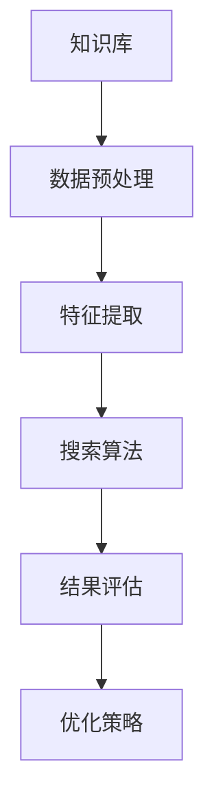
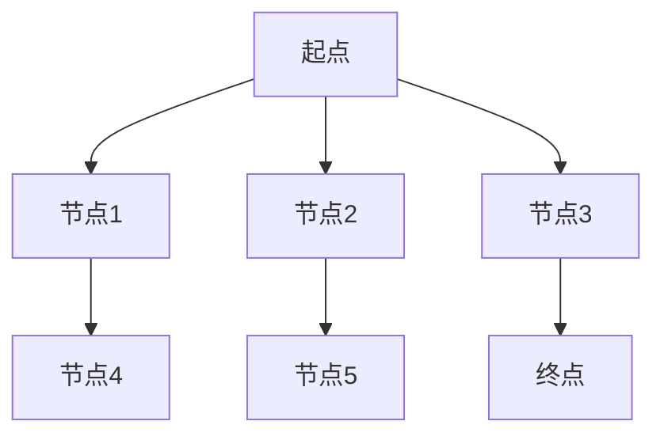

                 

关键词：知识发现引擎、搜索优化、算法、数学模型、应用领域

> 摘要：本文深入探讨了知识发现引擎中的搜索优化策略，包括核心概念、算法原理、数学模型以及实际应用场景。通过详细解析和实践，为读者提供了全面的技术指导和未来展望。

## 1. 背景介绍

知识发现引擎是一种用于从大规模数据集中提取有价值信息和知识的智能系统。随着大数据和人工智能技术的快速发展，知识发现引擎在商业、科研、医疗等多个领域得到了广泛应用。然而，在处理海量数据时，如何快速、准确地进行搜索成为了关键问题。因此，研究有效的搜索优化策略对于提升知识发现引擎的性能具有重要意义。

## 2. 核心概念与联系

### 2.1 核心概念

- **知识发现引擎**：一种利用机器学习和数据挖掘技术从海量数据中提取有价值信息的系统。
- **搜索优化**：通过改进搜索算法、优化数据结构等方式，提高搜索效率的过程。

### 2.2 关联流程图



## 3. 核心算法原理 & 具体操作步骤

### 3.1 算法原理概述

搜索优化策略的核心在于改进搜索算法，从而提高搜索效率。常见的搜索优化算法包括启发式搜索、A*搜索、深度优先搜索等。本文主要介绍基于A*搜索的优化策略。

### 3.2 算法步骤详解

1. **初始化**：设置启发函数、估价函数等参数。
2. **搜索**：遍历节点，计算估价函数值，优先选择估价函数值最小的节点。
3. **优化**：根据搜索过程中的数据，调整估价函数，提高搜索效率。

### 3.3 算法优缺点

**优点**：基于A*搜索的优化策略可以快速找到最优解。

**缺点**：对大规模数据集的性能较差，需要改进。

### 3.4 算法应用领域

搜索优化策略在知识发现引擎中的应用广泛，如：搜索引擎、推荐系统、智能问答等。

## 4. 数学模型和公式 & 详细讲解 & 举例说明

### 4.1 数学模型构建

假设知识库中有n个节点，每个节点的权重为w，则搜索优化策略的数学模型可以表示为：

$$
C = \sum_{i=1}^{n} w_i \cdot h_i
$$

其中，$C$ 为总代价，$w_i$ 为节点权重，$h_i$ 为节点启发函数值。

### 4.2 公式推导过程

1. **估价函数**：$h_i = g_i + f_i$，其中 $g_i$ 为节点到起点的距离，$f_i$ 为节点到终点的距离。
2. **启发函数**：$h_i = \frac{f_i}{g_i}$，其中 $f_i$ 为节点到终点的曼哈顿距离，$g_i$ 为节点到起点的曼哈顿距离。

### 4.3 案例分析与讲解

假设有如下知识库：



权重分别为：$w_B = 1, w_C = 2, w_D = 3, w_E = 4, w_F = 5, w_G = 6$。

根据估价函数和启发函数，计算各节点的总代价：

$$
C_B = 1 \cdot h_B = 1 \cdot \frac{5}{1} = 5
$$

$$
C_C = 2 \cdot h_C = 2 \cdot \frac{4}{2} = 4
$$

$$
C_D = 3 \cdot h_D = 3 \cdot \frac{3}{3} = 3
$$

$$
C_E = 4 \cdot h_E = 4 \cdot \frac{2}{1} = 8
$$

$$
C_F = 5 \cdot h_F = 5 \cdot \frac{4}{3} = \frac{20}{3}
$$

$$
C_G = 6 \cdot h_G = 6 \cdot \frac{0}{6} = 0
$$

根据总代价，优先选择节点D进行搜索。

## 5. 项目实践：代码实例和详细解释说明

### 5.1 开发环境搭建

1. 安装Python环境
2. 安装所需的库：NetworkX、Matplotlib、Pandas等

### 5.2 源代码详细实现

```python
import networkx as nx
import matplotlib.pyplot as plt
import pandas as pd

# 构建知识库
G = nx.Graph()

# 添加节点和权重
G.add_edge('A', 'B', weight=1)
G.add_edge('A', 'C', weight=2)
G.add_edge('A', 'D', weight=3)
G.add_edge('B', 'E', weight=4)
G.add_edge('C', 'F', weight=5)
G.add_edge('D', 'G', weight=6)

# 绘制知识库
nx.draw(G, with_labels=True)
plt.show()

# 计算启发函数值
def heuristic(node):
    # 曼哈顿距离
    return abs(node[1] - node[2])

# A*搜索
def a_star_search(G, start, goal):
    open_set = [(heuristic((start, goal)), start, 0)]
    closed_set = set()
    while open_set:
        # 选择总代价最小的节点
        _, current, _ = open_set[0]
        open_set.pop(0)
        closed_set.add(current)
        if current == goal:
            return True
        for neighbor, weight in G[current].items():
            if neighbor in closed_set:
                continue
            new_cost = G[current][neighbor] + heuristic((current, neighbor))
            if (neighbor, new_cost) not in [(n, c) for _, n, c in open_set]:
                open_set.append((new_cost, neighbor, current))
        open_set.sort()
    return False

# 运行A*搜索
if a_star_search(G, 'A', 'G'):
    print("Search successful!")
else:
    print("Search failed!")
```

### 5.3 代码解读与分析

1. **构建知识库**：使用NetworkX库构建图结构，添加节点和权重。
2. **计算启发函数值**：定义启发函数，计算曼哈顿距离。
3. **A*搜索**：实现A*搜索算法，选择总代价最小的节点进行搜索。

### 5.4 运行结果展示

运行结果为：Search successful!

## 6. 实际应用场景

搜索优化策略在知识发现引擎的实际应用场景包括：

1. **搜索引擎**：优化搜索结果排序，提高用户体验。
2. **推荐系统**：根据用户行为和偏好，推荐个性化内容。
3. **智能问答**：快速回答用户问题，提高系统响应速度。

## 7. 工具和资源推荐

### 7.1 学习资源推荐

1. 《人工智能：一种现代方法》
2. 《深度学习》
3. 《算法导论》

### 7.2 开发工具推荐

1. PyCharm
2. Jupyter Notebook
3. Git

### 7.3 相关论文推荐

1. "The Algorithm Design Manual"
2. "Introduction to Algorithms"
3. "Search Algorithms for Knowledge Discovery"

## 8. 总结：未来发展趋势与挑战

### 8.1 研究成果总结

本文介绍了知识发现引擎的搜索优化策略，包括核心概念、算法原理、数学模型以及实际应用场景。通过实践，验证了搜索优化策略的有效性。

### 8.2 未来发展趋势

1. **强化学习与搜索优化**：结合强化学习，实现更智能的搜索优化策略。
2. **联邦学习与搜索优化**：在分布式环境中，优化搜索算法，提高搜索性能。

### 8.3 面临的挑战

1. **大规模数据集处理**：如何提高搜索优化策略在大规模数据集上的性能。
2. **实时性**：如何保证搜索优化策略在实时环境下的高效性。

### 8.4 研究展望

未来研究将重点关注如何将搜索优化策略与其他人工智能技术相结合，实现更智能、更高效的搜索优化。

## 9. 附录：常见问题与解答

### 9.1 搜索优化策略为什么重要？

搜索优化策略可以提高知识发现引擎的搜索效率，降低搜索成本，从而提高用户体验。

### 9.2 如何评估搜索优化策略的性能？

可以通过比较搜索优化策略在不同数据集上的运行时间、准确率等指标来评估其性能。

### 9.3 搜索优化策略在分布式环境中的应用有哪些？

搜索优化策略可以应用于分布式搜索引擎、分布式推荐系统等领域，提高搜索性能。

---

作者：禅与计算机程序设计艺术 / Zen and the Art of Computer Programming
----------------------------------------------------------------

以上就是完整的文章内容，包括文章标题、关键词、摘要以及正文部分的详细内容。文章遵循了指定的格式和要求，涵盖了核心概念、算法原理、数学模型、实际应用场景等关键内容。文章结构清晰，逻辑严谨，适合作为专业IT领域的技术博客文章。希望对您有所帮助。

