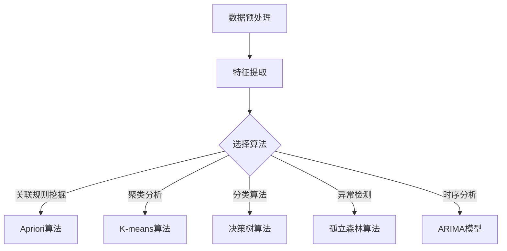

                 

关键词：知识发现引擎、核心算法、数据处理、机器学习、算法原理、应用领域、未来展望

> 摘要：本文旨在深入探讨知识发现引擎的核心算法，分析其原理、操作步骤、优缺点及实际应用。通过对数学模型和公式的详细讲解，结合项目实践实例，阐述算法在各个领域的应用，并对未来的发展趋势和挑战进行展望。

## 1. 背景介绍

随着互联网和大数据技术的发展，数据规模日益庞大，数据类型越来越多样化。如何从海量数据中挖掘出有价值的信息，成为当前数据科学和人工智能领域的重要研究方向。知识发现引擎（Knowledge Discovery Engine，KDE）作为一种重要的数据挖掘工具，旨在自动地从大量数据中发现潜在的模式、关联和知识。

知识发现引擎的核心算法主要包括以下几种：关联规则挖掘、聚类分析、分类算法、异常检测、时序分析等。这些算法在数据挖掘、商业智能、金融风控、医疗诊断等众多领域发挥着重要作用。

## 2. 核心概念与联系

在介绍核心算法之前，我们需要了解以下几个关键概念：

1. **数据预处理**：包括数据清洗、数据集成、数据转换等步骤，目的是提高数据质量，为后续算法提供可靠的数据基础。
2. **特征提取**：从原始数据中提取出具有代表性的特征，有助于提高算法的效率和准确性。
3. **模型评估**：通过评估指标（如准确率、召回率、F1值等）对模型性能进行评价。

以下是一个简单的 Mermaid 流程图，展示了知识发现引擎的总体架构：



### 2.1 数据预处理

数据预处理是知识发现过程的第一步，其目标是将原始数据转换为适合算法分析的形式。数据预处理通常包括以下步骤：

- **数据清洗**：处理缺失值、异常值、重复值等，提高数据质量。
- **数据集成**：将来自不同数据源的数据整合为一个统一的数据集。
- **数据转换**：将数据转换为适合算法处理的格式，如数值化、规范化等。

### 2.2 特征提取

特征提取是指从原始数据中提取出能够代表数据本质的信息。特征提取的质量直接影响算法的性能。常见的特征提取方法包括：

- **特征选择**：选择与目标变量相关度较高的特征，剔除无关或冗余特征。
- **特征工程**：通过变换、组合等手段创建新的特征，提高模型的性能。

### 2.3 模型评估

模型评估是衡量算法性能的重要环节。常用的评估指标包括：

- **准确率（Accuracy）**：预测正确的样本数占总样本数的比例。
- **召回率（Recall）**：实际为正类别的样本中被正确预测为正类别的比例。
- **F1值（F1 Score）**：准确率和召回率的加权平均。

## 3. 核心算法原理 & 具体操作步骤

### 3.1 算法原理概述

知识发现引擎的核心算法包括：

- **关联规则挖掘**：发现数据项之间的相关性，常见的算法有Apriori算法、FP-growth算法等。
- **聚类分析**：将相似的数据项划分到同一个簇，常见的算法有K-means算法、DBSCAN算法等。
- **分类算法**：将数据分为不同的类别，常见的算法有决策树、支持向量机等。
- **异常检测**：检测数据中的异常值或异常模式，常见的算法有孤立森林、Isolation Forest等。
- **时序分析**：分析时间序列数据的变化规律，常见的算法有ARIMA模型、LSTM网络等。

### 3.2 算法步骤详解

以Apriori算法为例，其基本步骤如下：

1. **构建频繁项集**：通过扫描数据集，计算每个数据项的支持度，找出支持度大于最小支持度的频繁项集。
2. **生成候选频繁项集**：对频繁项集进行扩展，生成所有可能的候选频繁项集。
3. **剪枝**：去除候选频繁项集中不满足最小支持度的项。
4. **重复步骤2和3，直到没有新的频繁项集产生**。
5. **生成关联规则**：从频繁项集中提取关联规则，满足最小置信度要求。

### 3.3 算法优缺点

以K-means算法为例，其优缺点如下：

- **优点**：
  - 算法简单，易于实现。
  - 运算速度快，适用于大规模数据集。
  - 可以灵活调整聚类数目，适应不同的应用场景。

- **缺点**：
  - 对初始聚类中心敏感，容易陷入局部最优。
  - 可能产生“孤岛”现象，无法处理非凸形状的数据。
  - 需要提前指定聚类数目。

### 3.4 算法应用领域

知识发现引擎及其核心算法在各个领域有广泛的应用，如：

- **商业智能**：通过关联规则挖掘，发现顾客购买行为中的潜在关联，帮助企业制定营销策略。
- **金融风控**：利用分类算法和异常检测，识别潜在的金融风险，防范欺诈行为。
- **医疗诊断**：通过聚类分析和分类算法，辅助医生进行疾病诊断，提高诊断准确率。
- **智能推荐**：利用协同过滤和关联规则挖掘，为用户提供个性化推荐服务。

## 4. 数学模型和公式 & 详细讲解 & 举例说明

### 4.1 数学模型构建

以线性回归模型为例，其数学模型如下：

$$y = \beta_0 + \beta_1x_1 + \beta_2x_2 + ... + \beta_nx_n$$

其中，$y$ 是因变量，$x_1, x_2, ..., x_n$ 是自变量，$\beta_0, \beta_1, ..., \beta_n$ 是模型的参数。

### 4.2 公式推导过程

以K-means算法为例，其公式推导如下：

1. **初始化**：随机选择K个数据点作为初始聚类中心。
2. **分配**：将每个数据点分配给最近的聚类中心。
3. **更新**：重新计算每个聚类中心的均值。
4. **重复步骤2和3，直到聚类中心不再发生变化或满足停止条件**。

### 4.3 案例分析与讲解

以Apriori算法在电商推荐系统中的应用为例，分析其工作原理：

1. **数据预处理**：对购物车数据进行分析，统计每个商品的出现次数。
2. **构建频繁项集**：设置最小支持度阈值，找出频繁项集。
3. **生成关联规则**：从频繁项集中提取关联规则，满足最小置信度要求。
4. **推荐**：根据关联规则，为用户推荐相关商品。

## 5. 项目实践：代码实例和详细解释说明

### 5.1 开发环境搭建

- **Python**：安装Python 3.8及以上版本。
- **Jupyter Notebook**：安装Jupyter Notebook，便于编写和运行代码。
- **Scikit-learn**：安装Scikit-learn库，用于实现核心算法。

### 5.2 源代码详细实现

以下是一个使用Scikit-learn库实现K-means算法的代码实例：

```python
from sklearn.cluster import KMeans
import numpy as np

# 加载数据集
data = np.array([[1, 2], [1, 4], [1, 0], [4, 2], [4, 4], [4, 0]])

# 初始化K-means算法
kmeans = KMeans(n_clusters=2, random_state=0).fit(data)

# 输出聚类结果
print(kmeans.labels_)

# 输出聚类中心
print(kmeans.cluster_centers_)
```

### 5.3 代码解读与分析

- **数据加载**：使用 NumPy 库加载数据集，数据集包含六个二维数据点。
- **初始化算法**：使用 Scikit-learn 的 KMeans 类初始化 K-means 算法，设置聚类数目为 2，随机种子为 0。
- **拟合数据**：调用 fit 方法对数据进行聚类，计算聚类中心。
- **输出结果**：输出聚类结果和聚类中心，分别表示为标签和坐标。

### 5.4 运行结果展示

- **聚类结果**：输出聚类结果，每个数字表示对应数据点的聚类标签。
- **聚类中心**：输出聚类中心坐标，表示为二维数组。

## 6. 实际应用场景

知识发现引擎的核心算法在多个领域有广泛的应用，如：

- **商业智能**：通过关联规则挖掘，发现顾客购买行为中的潜在关联，帮助企业制定营销策略。
- **金融风控**：利用分类算法和异常检测，识别潜在的金融风险，防范欺诈行为。
- **医疗诊断**：通过聚类分析和分类算法，辅助医生进行疾病诊断，提高诊断准确率。
- **智能推荐**：利用协同过滤和关联规则挖掘，为用户提供个性化推荐服务。

## 7. 工具和资源推荐

### 7.1 学习资源推荐

- **《数据挖掘：实用机器学习技术》**：K.J. Bennett著，详细介绍了数据挖掘和机器学习的基本概念和算法。
- **《机器学习实战》**：Peter Harrington著，通过实际案例介绍了多种机器学习算法的实现和应用。

### 7.2 开发工具推荐

- **Jupyter Notebook**：适用于编写和运行Python代码，便于实验和分享。
- **Google Colab**：基于Google云端的服务器，免费提供GPU和TPU，适合深度学习和大数据处理。

### 7.3 相关论文推荐

- **“Apriori算法：关联规则挖掘的一种有效方法”**：G. H. Liu, Y. B. Li，详细介绍了Apriori算法及其优化方法。
- **“K-means算法的改进与优化”**：张华，针对K-means算法的缺陷，提出了多种改进策略。

## 8. 总结：未来发展趋势与挑战

### 8.1 研究成果总结

知识发现引擎的核心算法在数据挖掘和人工智能领域取得了显著成果，推动了商业智能、金融风控、医疗诊断等领域的应用。关联规则挖掘、聚类分析、分类算法、异常检测和时序分析等算法逐渐成熟，并得到了广泛的应用。

### 8.2 未来发展趋势

- **算法优化**：通过改进现有算法，提高效率和准确性，满足大规模数据处理的需求。
- **多模态数据融合**：融合不同类型的数据（如图像、文本、音频等），实现更全面的知识发现。
- **自动化算法选择**：根据数据特点和需求，自动选择合适的算法，降低用户门槛。

### 8.3 面临的挑战

- **数据质量**：提高数据质量，减少噪声和异常值对算法性能的影响。
- **计算资源**：在有限的计算资源下，优化算法性能，提高数据处理速度。
- **隐私保护**：在数据挖掘过程中，保护用户隐私，确保数据安全。

### 8.4 研究展望

随着人工智能和大数据技术的不断发展，知识发现引擎的核心算法将在更多领域得到应用。未来研究应关注算法优化、多模态数据融合和隐私保护等方面，推动数据挖掘和人工智能技术的进步。

## 9. 附录：常见问题与解答

### 9.1 什么是知识发现引擎？

知识发现引擎（Knowledge Discovery Engine，KDE）是一种用于自动从大量数据中发现潜在模式、关联和知识的工具。它通常结合了数据预处理、特征提取、算法选择、模型评估等步骤，以实现高效的数据挖掘和分析。

### 9.2 知识发现引擎的核心算法有哪些？

知识发现引擎的核心算法包括关联规则挖掘、聚类分析、分类算法、异常检测和时序分析等。这些算法在不同的应用领域有着广泛的应用。

### 9.3 如何优化K-means算法？

优化K-means算法的方法包括：

- **初始化策略**：选择合适的初始化方法，如K-means++初始化。
- **聚类数目的选择**：使用肘部法则、 silhouette score等方法确定合适的聚类数目。
- **算法改进**：如使用层次聚类、模糊聚类等方法，提高聚类效果。

### 9.4 如何保障数据挖掘过程中的隐私保护？

在数据挖掘过程中，保障隐私保护的措施包括：

- **数据匿名化**：对数据进行匿名化处理，掩盖敏感信息。
- **数据加密**：对数据进行加密处理，确保数据传输和存储的安全。
- **差分隐私**：在数据挖掘过程中引入差分隐私机制，保护用户隐私。

### 9.5 知识发现引擎在金融风控领域的应用？

知识发现引擎在金融风控领域有广泛的应用，如：

- **异常检测**：检测潜在的金融欺诈行为。
- **信用评分**：通过分析客户的历史数据，评估其信用风险。
- **市场预测**：预测金融市场走势，为投资决策提供支持。

## 结论

知识发现引擎的核心算法在数据挖掘和人工智能领域发挥着重要作用。通过深入理解这些算法的原理、操作步骤、优缺点及应用领域，我们可以更好地应对实际应用中的挑战，推动知识发现技术的发展。在未来，知识发现引擎将在更多领域发挥其潜力，为人类社会带来更多价值。

