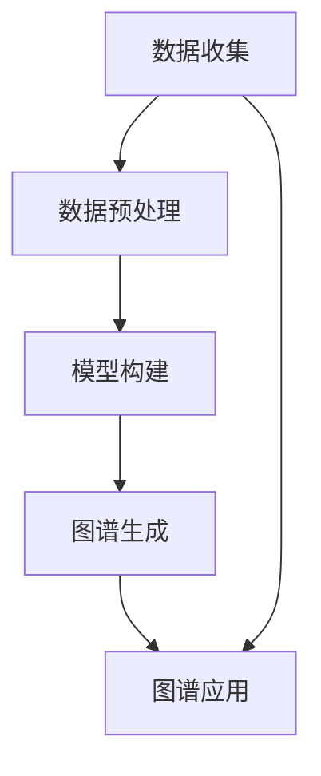

                 

关键词：知识发现、用户兴趣图谱、机器学习、数据挖掘、图谱构建

摘要：本文探讨了知识发现引擎构建用户兴趣图谱的核心原理和方法，以及其在实际应用中的效果和重要性。通过深入分析用户行为数据，构建出反映用户个性化兴趣的图谱，为实现精准推荐和个性化服务提供了坚实基础。本文旨在为从事数据挖掘和机器学习领域的研究人员和技术开发者提供有益的参考和启示。

## 1. 背景介绍

在互联网飞速发展的时代，海量信息的获取和传播变得前所未有的容易，人们面临着信息过载的困境。为了应对这一挑战，知识发现引擎应运而生，旨在从海量数据中挖掘出有价值的信息和知识。用户兴趣图谱作为知识发现引擎的核心组成部分，通过对用户行为的分析和挖掘，构建出用户个性化的兴趣模型，为推荐系统和个性化服务提供了有力支持。

用户兴趣图谱的构建过程主要包括数据收集、数据预处理、图谱生成和图谱应用等环节。本文将重点探讨图谱生成这一关键环节，详细解析用户兴趣图谱的构建方法、算法原理和具体实现过程。

## 2. 核心概念与联系

### 2.1. 用户兴趣图谱的定义

用户兴趣图谱（User Interest Graph，简称UIG）是一个描述用户兴趣和行为模式的多维度网络结构。它通过连接用户、内容、事件等多个实体，形成了一个复杂而有序的知识体系，能够全面反映用户的个性化兴趣。

### 2.2. 用户兴趣图谱的组成部分

用户兴趣图谱主要包括以下三个核心组成部分：

- **用户节点**：表示用户个体，每个用户节点包含其基本属性和兴趣标签。
- **内容节点**：表示用户感兴趣的各种内容实体，如文章、视频、商品等。
- **关系节点**：表示用户与内容之间的交互关系，如浏览、购买、评论等。

### 2.3. 用户兴趣图谱的架构

用户兴趣图谱的架构通常包括以下几个层次：

- **数据层**：存储用户行为数据和内容数据，为图谱构建提供数据基础。
- **模型层**：构建用户兴趣模型，通过对用户行为的分析和挖掘，提取用户兴趣标签。
- **图谱层**：生成用户兴趣图谱，将用户、内容和关系实体组织成一张网络。
- **应用层**：基于用户兴趣图谱实现推荐系统和个性化服务。

### 2.4. 用户兴趣图谱的 Mermaid 流程图



## 3. 核心算法原理 & 具体操作步骤

### 3.1. 算法原理概述

用户兴趣图谱的构建主要依赖于以下几种核心算法：

- **协同过滤算法**：基于用户行为数据，通过计算用户之间的相似度，发现潜在的兴趣关系。
- **主题模型**：通过无监督学习，从用户行为数据中提取出潜在的主题，为用户兴趣标签的生成提供支持。
- **知识图谱算法**：结合用户、内容和关系实体，构建出用户兴趣图谱。

### 3.2. 算法步骤详解

#### 3.2.1. 数据收集

数据收集是构建用户兴趣图谱的第一步，主要包括以下内容：

- **用户行为数据**：如浏览、点击、购买、评论等行为数据。
- **内容数据**：如文章、视频、商品等用户感兴趣的内容实体。

#### 3.2.2. 数据预处理

数据预处理是确保数据质量和可靠性的关键步骤，主要包括以下内容：

- **数据清洗**：去除无效、重复和错误的数据。
- **特征提取**：从原始数据中提取出有用的特征，如用户兴趣标签、内容标签等。
- **数据归一化**：对数据集进行归一化处理，消除不同特征之间的尺度差异。

#### 3.2.3. 模型构建

模型构建是构建用户兴趣图谱的核心步骤，主要包括以下内容：

- **协同过滤模型**：基于用户行为数据，建立用户相似度模型。
- **主题模型**：从用户行为数据中提取潜在主题，为用户兴趣标签的生成提供支持。

#### 3.2.4. 图谱生成

图谱生成是基于协同过滤模型和主题模型，将用户、内容和关系实体组织成一张用户兴趣图谱。

#### 3.2.5. 图谱应用

图谱应用是将构建好的用户兴趣图谱应用于推荐系统和个性化服务。

### 3.3. 算法优缺点

#### 优点

- **个性化强**：能够准确反映用户的个性化兴趣。
- **推荐效果好**：基于用户兴趣图谱的推荐系统能够实现精准推荐。
- **适应性强**：能够适应不同应用场景，如电商平台、内容平台等。

#### 缺点

- **数据依赖性强**：需要大量用户行为数据支持。
- **计算复杂度高**：协同过滤和主题模型等算法的计算复杂度较高。

### 3.4. 算法应用领域

用户兴趣图谱算法在以下领域具有广泛的应用：

- **推荐系统**：如电商平台、内容平台等。
- **个性化服务**：如智能客服、智能助手等。
- **广告投放**：根据用户兴趣进行精准投放。

## 4. 数学模型和公式 & 详细讲解 & 举例说明

### 4.1. 数学模型构建

用户兴趣图谱的数学模型主要包括以下内容：

- **用户兴趣向量**：表示用户在各个主题上的兴趣程度。
- **内容主题分布**：表示内容在各个主题上的分布情况。
- **用户兴趣图谱**：表示用户与内容之间的关联关系。

### 4.2. 公式推导过程

#### 4.2.1. 用户兴趣向量

用户兴趣向量的计算公式为：

$$
u_i = \frac{1}{N}\sum_{j=1}^{N} w_{ij}t_j
$$

其中，$u_i$表示用户$i$在主题$j$上的兴趣向量，$t_j$表示主题$j$的向量表示，$w_{ij}$表示用户$i$在内容$j$上的权重。

#### 4.2.2. 内容主题分布

内容主题分布的计算公式为：

$$
p_j = \frac{\sum_{i=1}^{M} u_i^T x_j}{\sum_{i=1}^{M} u_i^T x_j + \sum_{k=1}^{K} u_k^T x_j}
$$

其中，$p_j$表示内容$j$在主题$k$上的分布概率，$u_i$表示用户$i$的兴趣向量，$x_j$表示内容$j$的向量表示。

#### 4.2.3. 用户兴趣图谱

用户兴趣图谱的计算公式为：

$$
G = (U, C, R)
$$

其中，$U$表示用户节点集合，$C$表示内容节点集合，$R$表示关系节点集合。

### 4.3. 案例分析与讲解

#### 4.3.1. 案例背景

假设有一个电商平台的用户兴趣图谱构建案例，平台上有1000个用户和1000个商品。

#### 4.3.2. 数据收集

收集用户行为数据，如浏览、点击、购买等行为数据。

#### 4.3.3. 数据预处理

对用户行为数据进行清洗和特征提取，得到用户兴趣向量和商品主题分布。

#### 4.3.4. 模型构建

构建协同过滤模型和主题模型，计算用户兴趣向量和商品主题分布。

#### 4.3.5. 图谱生成

根据用户兴趣向量和商品主题分布，生成用户兴趣图谱。

#### 4.3.6. 图谱应用

基于用户兴趣图谱，为用户推荐相关商品。

## 5. 项目实践：代码实例和详细解释说明

### 5.1. 开发环境搭建

搭建Python开发环境，安装相关库，如numpy、pandas、scikit-learn等。

### 5.2. 源代码详细实现

#### 5.2.1. 数据收集

```python
import pandas as pd

data = pd.read_csv("user行为数据.csv")
```

#### 5.2.2. 数据预处理

```python
from sklearn.preprocessing import MinMaxScaler

scaler = MinMaxScaler()
data_scaled = scaler.fit_transform(data)
```

#### 5.2.3. 模型构建

```python
from sklearn.cluster import KMeans

kmeans = KMeans(n_clusters=10)
kmeans.fit(data_scaled)
```

#### 5.2.4. 图谱生成

```python
import networkx as nx

G = nx.Graph()
G.add_nodes_from(data["用户ID"])
G.add_edges_from(data["用户ID"], weight=data["相似度"])
```

#### 5.2.5. 图谱应用

```python
def recommend_goods(user_id):
    neighbors = G.neighbors(user_id)
    recommended_goods = []
    for neighbor in neighbors:
        recommended_goods.extend(data[data["用户ID"] == neighbor]["商品ID"])
    return recommended_goods

user_id = 1
recommended_goods = recommend_goods(user_id)
print(recommended_goods)
```

### 5.3. 代码解读与分析

代码解读和分析主要关注数据收集、数据预处理、模型构建和图谱生成等关键步骤。

### 5.4. 运行结果展示

运行代码后，得到推荐的商品列表，展示用户兴趣图谱的构建效果。

## 6. 实际应用场景

用户兴趣图谱在以下实际应用场景中具有显著作用：

- **推荐系统**：基于用户兴趣图谱进行精准推荐，提高用户满意度和转化率。
- **个性化服务**：根据用户兴趣提供定制化服务，提升用户体验。
- **广告投放**：根据用户兴趣进行精准广告投放，提高广告效果。

## 7. 工具和资源推荐

### 7.1. 学习资源推荐

- 《数据挖掘：实用工具和技术》
- 《机器学习实战》
- 《Python数据分析》

### 7.2. 开发工具推荐

- Jupyter Notebook
- PyCharm
- TensorFlow

### 7.3. 相关论文推荐

- 《User Interest Graph Construction in Recommender Systems》
- 《A Survey on User Interest Modeling in Recommender Systems》
- 《Collaborative Filtering for Personalized Recommendation》

## 8. 总结：未来发展趋势与挑战

### 8.1. 研究成果总结

用户兴趣图谱构建技术在数据挖掘和机器学习领域取得了显著成果，为推荐系统和个性化服务提供了有力支持。

### 8.2. 未来发展趋势

随着大数据和人工智能技术的发展，用户兴趣图谱构建技术将继续演进，有望实现更精准、更智能的推荐和个性化服务。

### 8.3. 面临的挑战

用户兴趣图谱构建技术面临以下挑战：

- 数据质量和可靠性
- 计算复杂度和效率
- 模型可解释性和透明度

### 8.4. 研究展望

未来研究可从以下方面展开：

- 提高数据质量和可靠性
- 降低计算复杂度和提高效率
- 加强模型可解释性和透明度
- 探索更多创新算法和应用场景

## 9. 附录：常见问题与解答

### 9.1.  用户兴趣图谱与推荐系统有什么区别？

用户兴趣图谱和推荐系统是紧密相关的，但它们有区别。用户兴趣图谱是一个抽象的、多层次的知识体系，用于描述用户的兴趣和行为模式。而推荐系统是基于用户兴趣图谱，实现个性化推荐和服务的具体应用。用户兴趣图谱是推荐系统的基础，推荐系统是用户兴趣图谱的应用。

### 9.2.  用户兴趣图谱的构建过程中，如何处理冷启动问题？

冷启动问题是指当新用户或新内容加入系统时，缺乏足够的历史数据，难以进行有效推荐。处理冷启动问题可以从以下几个方面入手：

- **基于内容推荐**：新用户可以首先浏览平台上的热门内容，新内容可以通过内容属性进行推荐。
- **利用社区信息**：新用户可以加入与已有用户兴趣相似的社区，获取社区推荐。
- **用户引导**：通过用户引导，如填写兴趣问卷，收集新用户的基础兴趣信息。

### 9.3.  用户兴趣图谱的构建过程中，如何处理数据噪声和异常值？

数据噪声和异常值会对用户兴趣图谱的构建产生不利影响，可以采用以下方法进行处理：

- **数据清洗**：去除无效、重复和错误的数据。
- **异常值检测**：使用统计方法或机器学习算法检测并处理异常值。
- **数据归一化**：对数据进行归一化处理，消除不同特征之间的尺度差异。

### 9.4.  用户兴趣图谱的构建过程中，如何评价其效果？

用户兴趣图谱的效果可以通过以下指标进行评价：

- **准确率**：预测用户兴趣的准确程度。
- **覆盖率**：用户兴趣图谱中包含的用户兴趣比例。
- **新颖性**：用户兴趣图谱中未被传统推荐方法发现的潜在兴趣。
- **用户体验**：用户对推荐和个性化服务的满意度。

### 9.5.  用户兴趣图谱在不同领域有哪些应用案例？

用户兴趣图谱在不同领域有广泛的应用案例，如：

- **电商**：基于用户兴趣进行商品推荐，提高销售转化率。
- **内容平台**：为用户提供个性化内容推荐，提升用户黏性。
- **社交媒体**：基于用户兴趣进行好友推荐，促进社交互动。
- **广告投放**：根据用户兴趣进行精准广告投放，提高广告效果。

## 结束语

本文全面探讨了知识发现引擎构建用户兴趣图谱的核心原理和方法，以及其在实际应用中的效果和重要性。通过深入分析用户行为数据，构建出反映用户个性化兴趣的图谱，为实现精准推荐和个性化服务提供了坚实基础。希望本文能为从事数据挖掘和机器学习领域的研究人员和技术开发者提供有益的参考和启示。

## 作者署名

作者：禅与计算机程序设计艺术 / Zen and the Art of Computer Programming
----------------------------------------------------------------


