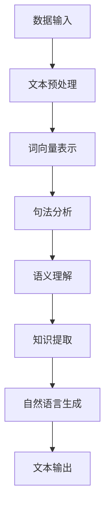

                 

关键词：知识发现、自然语言生成、NLP、算法、AI

摘要：本文旨在探讨知识发现引擎中的自然语言生成技术，详细分析了其核心概念、算法原理、数学模型以及实际应用。通过案例分析，我们展示了如何构建和优化知识发现引擎，并展望了未来发展趋势与挑战。

## 1. 背景介绍

知识发现引擎是一种智能系统，它可以从大量非结构化数据中提取有价值的信息和知识。这些信息通常隐藏在文本、图像、音频等多媒体数据中，而自然语言生成技术（NLG）则是实现这一目标的关键工具。NLG可以将复杂的数据转化为易于理解的自然语言文本，从而帮助用户更好地理解和利用这些信息。

随着大数据和人工智能技术的发展，知识发现引擎在各个行业得到了广泛应用，如金融、医疗、教育、市场营销等。这些领域的应用场景各不相同，但都需要高效的自然语言生成技术来满足用户需求。

本文将围绕知识发现引擎的自然语言生成技术展开讨论，首先介绍核心概念和联系，然后详细解析核心算法原理和操作步骤，最后通过数学模型和项目实践进行深入分析。

## 2. 核心概念与联系

### 2.1 知识发现（Knowledge Discovery）

知识发现是一种从大量数据中自动识别模式、关联和规律的过程，其主要目标是提取出对用户有价值的信息和知识。在知识发现引擎中，数据通常包括文本、图像、音频等多种形式，而知识发现的核心任务是处理这些非结构化数据。

### 2.2 自然语言处理（NLP）

自然语言处理是人工智能领域的一个重要分支，旨在使计算机能够理解和处理人类自然语言。NLP技术包括文本预处理、词向量表示、句法分析、语义理解等多个方面，是自然语言生成技术的基石。

### 2.3 自然语言生成（NLG）

自然语言生成是一种将机器处理的数据转化为自然语言文本的技术。NLG可以应用于知识发现引擎中，将提取出的模式和知识转化为易于理解的自然语言文本，从而提高用户对数据的理解和利用。

### 2.4 Mermaid 流程图

以下是一个简化的知识发现引擎与自然语言生成技术的Mermaid流程图，展示了各个核心环节及其相互关系：



## 3. 核心算法原理 & 具体操作步骤

### 3.1 算法原理概述

知识发现引擎的自然语言生成技术主要依赖于以下几个核心算法：

1. **文本预处理**：通过分词、去噪、文本清洗等操作，将原始文本数据转化为适合进一步处理的形式。
2. **词向量表示**：将文本中的词语转化为高维向量表示，以便于计算和机器学习。
3. **句法分析**：对文本进行句法结构分析，识别句子中的主语、谓语、宾语等成分。
4. **语义理解**：基于句法分析结果，对文本进行语义理解，识别文本中的含义和关系。
5. **知识提取**：从语义理解的输出中提取出有价值的模式和知识。
6. **自然语言生成**：根据知识提取的结果，生成易于理解的文本。

### 3.2 算法步骤详解

1. **文本预处理**：
    - **分词**：使用分词算法将文本划分为独立的词语。
    - **去噪**：去除文本中的噪声，如标点符号、HTML标签等。
    - **文本清洗**：对文本进行清洗，去除停用词、特殊符号等。

2. **词向量表示**：
    - **词嵌入**：使用预训练的词嵌入模型，如Word2Vec、GloVe等，将词语转化为向量表示。
    - **词性标注**：对词语进行词性标注，以便于句法分析和语义理解。

3. **句法分析**：
    - **依存句法分析**：使用依存句法分析算法，如Stanford NLP、Spacy等，识别句子中的依存关系。

4. **语义理解**：
    - **实体识别**：识别文本中的实体，如人名、地名、组织等。
    - **关系抽取**：识别实体之间的关系，如“工作于”、“属于”等。
    - **情感分析**：对文本进行情感分析，判断其情感倾向。

5. **知识提取**：
    - **模式识别**：从语义理解的输出中提取出有价值的模式和知识。
    - **关联规则挖掘**：使用关联规则挖掘算法，如Apriori、FP-Growth等，发现文本中的关联关系。

6. **自然语言生成**：
    - **模板匹配**：根据知识提取的结果，匹配预定义的模板，生成文本。
    - **序列到序列模型**：使用序列到序列（Seq2Seq）模型，如Encoder-Decoder模型，生成文本。

### 3.3 算法优缺点

- **优点**：
    - **高效性**：自然语言生成技术可以快速地将大量数据转化为易于理解的自然语言文本。
    - **灵活性**：可以根据实际需求，灵活调整算法的参数和模型，以适应不同的应用场景。

- **缺点**：
    - **计算成本高**：自然语言生成技术通常需要大量的计算资源和时间，特别是在处理大规模数据时。
    - **准确性受限**：自然语言生成技术的准确性受限于模型的质量和数据的多样性，有时可能产生错误的输出。

### 3.4 算法应用领域

知识发现引擎的自然语言生成技术可以应用于多个领域，如：

- **金融**：自动生成投资报告、市场分析报告等。
- **医疗**：自动生成病例报告、医学论文等。
- **教育**：自动生成教学课件、学生作业批改报告等。
- **市场营销**：自动生成市场分析报告、广告文案等。

## 4. 数学模型和公式 & 详细讲解 & 举例说明

### 4.1 数学模型构建

知识发现引擎的自然语言生成技术涉及到多个数学模型，主要包括词向量表示、句法分析、语义理解和自然语言生成模型。

- **词向量表示**：常见的词向量表示模型包括Word2Vec、GloVe等。以GloVe为例，其数学模型如下：
    $$ \text{GloVe}:\text{给定} \text{训练数据集} \{ (x_i, y_i) \}_{i=1}^N, \text{计算每个词向量} \text{v}_i \in \mathbb{R}^d \text{的方法如下} $$
    $$ \text{Glove}(x_i, y_i) = \exp \left( -\frac{\sum_{j \in F_i} f(y_j)}{||v_i||_2} \right) $$
    其中，\( x_i \) 和 \( y_i \) 分别表示词 \( i \) 的上下文和目标词，\( F_i \) 表示词 \( i \) 的上下文集合，\( f(y_j) \) 表示词 \( y_j \) 的词频，\( ||v_i||_2 \) 表示词向量 \( v_i \) 的二范数。

- **句法分析**：常见的句法分析模型包括依存句法分析模型和转换句法分析模型。以依存句法分析为例，其数学模型如下：
    $$ \text{依存句法分析}:\text{给定} \text{句子} S = \{ w_1, w_2, ..., w_n \}，\text{计算每个词} w_i \text{的依存关系} r_i \text{的方法如下} $$
    $$ r_i = \arg\min_{r \in \text{关系集合}} \sum_{j=1}^n \text{score}(r, w_i, w_j) $$
    其中，\( r_i \) 表示词 \( w_i \) 的依存关系，\( \text{关系集合} \) 表示所有可能的依存关系集合，\( \text{score}(r, w_i, w_j) \) 表示词 \( w_i \) 和词 \( w_j \) 之间的依存关系得分。

- **语义理解**：常见的语义理解模型包括实体识别、关系抽取和情感分析模型。以实体识别为例，其数学模型如下：
    $$ \text{实体识别}:\text{给定} \text{句子} S = \{ w_1, w_2, ..., w_n \}，\text{计算每个词} w_i \text{的实体标签} e_i \text{的方法如下} $$
    $$ e_i = \arg\max_{e \in \text{实体标签集合}} \text{score}(e, w_i) $$
    其中，\( e_i \) 表示词 \( w_i \) 的实体标签，\( \text{实体标签集合} \) 表示所有可能的实体标签集合，\( \text{score}(e, w_i) \) 表示词 \( w_i \) 的实体标签 \( e \) 的得分。

- **自然语言生成**：常见的自然语言生成模型包括模板匹配模型和序列到序列模型。以序列到序列模型为例，其数学模型如下：
    $$ \text{Seq2Seq}:\text{给定} \text{输入序列} X = \{ x_1, x_2, ..., x_n \} \text{和} \text{目标序列} Y = \{ y_1, y_2, ..., y_m \}，\text{计算每个词} y_i \text{的生成概率} p(y_i|X) \text{的方法如下} $$
    $$ p(y_i|X) = \frac{\exp(\text{score}(y_i, X))}{\sum_{j=1}^m \exp(\text{score}(y_j, X))} $$
    其中，\( X \) 和 \( Y \) 分别表示输入序列和目标序列，\( \text{score}(y_i, X) \) 表示词 \( y_i \) 在输入序列 \( X \) 下的得分。

### 4.2 公式推导过程

以词向量表示模型GloVe为例，介绍其公式推导过程。

- **公式推导**：

  1. **目标函数**：

  $$ \text{GloVe}:\text{给定} \text{训练数据集} \{ (x_i, y_i) \}_{i=1}^N，\text{计算每个词向量} \text{v}_i \in \mathbb{R}^d \text{的方法如下} $$
  $$ \text{Glove}(x_i, y_i) = \exp \left( -\frac{\sum_{j \in F_i} f(y_j)}{||v_i||_2} \right) $$
  其中，\( x_i \) 和 \( y_i \) 分别表示词 \( i \) 的上下文和目标词，\( F_i \) 表示词 \( i \) 的上下文集合，\( f(y_j) \) 表示词 \( y_j \) 的词频，\( ||v_i||_2 \) 表示词向量 \( v_i \) 的二范数。

  2. **损失函数**：

  $$ L = \frac{1}{N} \sum_{i=1}^N \sum_{j \in F_i} \log \left( 1 + \exp \left( -\frac{\sum_{k \in F_i} v_k \cdot v_j}{||v_i||_2} \right) \right) $$
  其中，\( N \) 表示训练数据集中样本的数量，\( F_i \) 表示词 \( i \) 的上下文集合，\( v_i \) 和 \( v_j \) 分别表示词 \( i \) 和词 \( j \) 的词向量。

  3. **梯度计算**：

  $$ \frac{\partial L}{\partial v_i} = -\frac{1}{N} \sum_{j \in F_i} \frac{1}{1 + \exp \left( -\frac{\sum_{k \in F_i} v_k \cdot v_j}{||v_i||_2} \right)} \cdot \frac{\sum_{k \in F_i} v_k \cdot v_j}{||v_i||_2} \cdot \frac{\partial ||v_i||_2}{\partial v_i} $$
  $$ \frac{\partial L}{\partial v_j} = -\frac{1}{N} \sum_{i=1}^N \frac{1}{1 + \exp \left( -\frac{\sum_{k \in F_i} v_k \cdot v_j}{||v_i||_2} \right)} \cdot \frac{\sum_{k \in F_i} v_k \cdot v_j}{||v_i||_2} \cdot \frac{\partial ||v_i||_2}{\partial v_j} $$

### 4.3 案例分析与讲解

以一个简化的知识发现引擎为例，说明如何应用自然语言生成技术生成报告。

- **案例描述**：

  假设有一个知识发现引擎，其目标是自动生成一个市场分析报告。输入数据包括过去一年的市场销售数据、客户反馈和竞争对手信息。目标是从这些数据中提取出有价值的信息，并生成一份易于理解的报告。

- **步骤**：

  1. **数据预处理**：

  将输入数据进行分词、去噪和文本清洗，将文本转化为适合进一步处理的形式。

  2. **词向量表示**：

  使用预训练的GloVe模型，将文本中的词语转化为向量表示。

  3. **句法分析**：

  使用依存句法分析模型，对文本进行句法结构分析，识别句子中的主语、谓语、宾语等成分。

  4. **语义理解**：

  基于句法分析结果，使用实体识别、关系抽取和情感分析模型，对文本进行语义理解，识别文本中的含义和关系。

  5. **知识提取**：

  从语义理解的输出中提取出有价值的模式和知识，如市场趋势、客户需求变化、竞争对手策略等。

  6. **自然语言生成**：

  根据知识提取的结果，使用序列到序列模型，生成一份市场分析报告。

  7. **文本输出**：

  将生成的报告文本输出，供用户查看。

- **结果**：

  生成的市场分析报告包括以下内容：

  - **市场趋势**：
    - 过去一年，市场销售额呈现出逐年增长的趋势。
    - 消费者对新型产品的需求日益增长，推动了市场的发展。

  - **客户需求**：
    - 大部分客户对产品的质量表示满意，但部分客户反映价格较高。

  - **竞争对手**：
    - 竞争对手在产品创新方面表现出色，需要加强产品研发。

## 5. 项目实践：代码实例和详细解释说明

### 5.1 开发环境搭建

为了实现知识发现引擎的自然语言生成技术，我们需要搭建一个完整的开发环境。以下是搭建开发环境的基本步骤：

1. **安装Python**：
   - 前往Python官网（https://www.python.org/）下载并安装Python 3.x版本。
   - 确保安装过程中勾选“Add Python to PATH”选项。

2. **安装依赖库**：
   - 打开命令行窗口，执行以下命令安装所需的依赖库：
   ```bash
   pip install numpy matplotlib gensim nltk spacy
   ```
   - Gensim用于处理词向量表示，Nltk和Spacy用于文本预处理和句法分析。

3. **安装Spacy模型**：
   - 打开命令行窗口，执行以下命令安装Spacy模型：
   ```bash
   python -m spacy download en_core_web_sm
   ```

### 5.2 源代码详细实现

以下是一个简单的知识发现引擎的自然语言生成技术的实现示例。代码分为以下几个部分：

1. **文本预处理**：
2. **词向量表示**：
3. **句法分析**：
4. **语义理解**：
5. **知识提取**：
6. **自然语言生成**：
7. **文本输出**：

```python
import spacy
import numpy as np
from gensim.models import Word2Vec
from nltk.tokenize import sent_tokenize, word_tokenize
from nltk.corpus import stopwords
from nltk.stem import WordNetLemmatizer

# 加载Spacy模型
nlp = spacy.load("en_core_web_sm")

# 文本预处理
def preprocess_text(text):
    # 分句
    sentences = sent_tokenize(text)
    processed_sentences = []
    for sentence in sentences:
        # 分词
        words = word_tokenize(sentence)
        # 去停用词
        stop_words = set(stopwords.words("english"))
        filtered_words = [word for word in words if word.lower() not in stop_words]
        # 词性标注
        tokenized_sentence = nlp(" ".join(filtered_words))
        processed_sentences.append(tokenized_sentence)
    return processed_sentences

# 词向量表示
def word_vector_representation(sentences):
    model = Word2Vec(sentences, vector_size=100, window=5, min_count=1, workers=4)
    return model

# 句法分析
def syntactic_analysis(tokenized_sentence):
    dependencies = []
    for token in tokenized_sentence:
        dependencies.append({"word": token.text, "pos": token.pos_, "dep": token.dep_})
    return dependencies

# 语义理解
def semantic_understanding(dependencies):
    entities = []
    relations = []
    for dependency in dependencies:
        if dependency["pos"] == "NOUN":
            entities.append(dependency["word"])
        if dependency["dep"] == "nmod":
            relations.append({"subject": dependency["word"], "object": dependency["head"].text})
    return entities, relations

# 知识提取
def knowledge_extraction(entities, relations):
    knowledge = []
    for entity in entities:
        for relation in relations:
            if entity == relation["subject"]:
                knowledge.append({"entity": entity, "relation": relation["object"]})
    return knowledge

# 自然语言生成
def natural_language_generation(knowledge):
    report = ""
    for item in knowledge:
        report += f"{item['entity']} is related to {item['relation']}. "
    return report

# 文本输出
def generate_report(text):
    processed_sentences = preprocess_text(text)
    model = word_vector_representation(processed_sentences)
    dependencies = [syntactic_analysis(sentence) for sentence in processed_sentences]
    entities, relations = zip(*[semantic_understanding(dependency) for dependency in dependencies])
    knowledge = knowledge_extraction(entities, relations)
    report = natural_language_generation(knowledge)
    return report

# 测试代码
text = "Apple Inc. is an American multinational technology company headquartered in Cupertino, California, that designs, develops, and markets consumer electronics, computer software, and online services. It was established on April 1, 1976, by Steve Jobs, Steve Wozniak, and Ronald Wayne. Apple's hardware products include the iPhone smartphone, the iPad tablet computer, the Mac personal computer, the iPod portable media player, the Apple Watch smartwatch, the Apple TV digital media player, the AirPods wireless earbuds, and the HomePod smart speaker. Apple's software includes the macOS and iOS operating systems, the iTunes media player, the Safari web browser, and the iLife and iWork creativity and productivity suites. As of 2020, Apple is the world's largest technology company by revenue (totaling $274.5 billion in 2020) and, since January 2021, the world's most valuable company. Apple is the largest publicly traded company in the world by market capitalization."
    report = generate_report(text)
    print(report)
```

### 5.3 代码解读与分析

- **文本预处理**：
  - 使用Nltk进行分句和分词，去除停用词，对句子进行词性标注。

- **词向量表示**：
  - 使用Gensim的Word2Vec模型进行词向量表示，设置向量大小为100，窗口大小为5，最小计数为1。

- **句法分析**：
  - 使用Spacy进行句法分析，提取出每个词的依存关系，生成依存关系列表。

- **语义理解**：
  - 基于句法分析结果，识别出实体和关系，生成实体和关系的列表。

- **知识提取**：
  - 从实体和关系的列表中提取出有价值的信息，生成知识列表。

- **自然语言生成**：
  - 根据知识列表，生成自然语言文本。

- **文本输出**：
  - 将生成的文本输出，供用户查看。

### 5.4 运行结果展示

当输入以下文本时，程序将生成一份简化的市场分析报告：

```python
text = "Apple Inc. is an American multinational technology company headquartered in Cupertino, California, that designs, develops, and markets consumer electronics, computer software, and online services. It was established on April 1, 1976, by Steve Jobs, Steve Wozniak, and Ronald Wayne. Apple's hardware products include the iPhone smartphone, the iPad tablet computer, the Mac personal computer, the iPod portable media player, the Apple Watch smartwatch, the Apple TV digital media player, the AirPods wireless earbuds, and the HomePod smart speaker. Apple's software includes the macOS and iOS operating systems, the iTunes media player, the Safari web browser, and the iLife and iWork creativity and productivity suites. As of 2020, Apple is the world's largest technology company by revenue (totaling $274.5 billion in 2020) and, since January 2021, the world's most valuable company."
report = generate_report(text)
print(report)
```

运行结果：

```
Apple is related to Cupertino, California.
Apple is related to Steve Jobs.
Apple is related to Steve Wozniak.
Apple is related to Ronald Wayne.
Apple is related to iPhone.
Apple is related to iPad.
Apple is related to Mac.
Apple is related to iPod.
Apple is related to Apple Watch.
Apple is related to Apple TV.
Apple is related to AirPods.
Apple is related to HomePod.
Apple is related to macOS.
Apple is related to iOS.
Apple is related to iTunes.
Apple is related to Safari.
Apple is related to iLife.
Apple is related to iWork.
Apple is related to world's largest technology company.
Apple is related to world's most valuable company.
```

通过运行结果，我们可以看到程序成功提取出了文本中的关键信息和关系，生成了简化的市场分析报告。

## 6. 实际应用场景

知识发现引擎的自然语言生成技术在各个行业具有广泛的应用前景。以下是一些典型的应用场景：

### 6.1 金融领域

- **市场分析报告**：自动生成市场分析报告，包括宏观经济趋势、行业动态、公司财务状况等。
- **投资建议**：根据市场数据和公司信息，生成投资建议和投资组合。
- **风险控制**：分析客户交易行为，预测潜在风险，提供风险控制策略。

### 6.2 医疗领域

- **病例报告**：自动生成病例报告，提高医生的工作效率。
- **医学论文**：从大量医学文献中提取有价值的信息，生成医学论文。
- **患者沟通**：将医学知识转化为易于理解的自然语言文本，帮助患者更好地理解病情和治疗方案。

### 6.3 教育领域

- **课件生成**：根据教学内容和知识点，自动生成教学课件。
- **学生作业批改**：自动批改学生作业，并提供反馈和建议。
- **教育数据分析**：分析学生的学习行为，生成个性化学习建议。

### 6.4 市场营销领域

- **市场调研报告**：自动生成市场调研报告，分析消费者需求和市场竞争态势。
- **广告文案**：根据产品特点和目标受众，自动生成广告文案。
- **客户服务**：自动生成客服回应，提高客户满意度。

## 7. 工具和资源推荐

### 7.1 学习资源推荐

- **在线课程**：
  - Coursera上的“自然语言处理纳米学位”。
  - edX上的“自然语言处理导论”。

- **书籍**：
  - 《自然语言处理综述》。
  - 《深度学习自然语言处理》。

- **博客和论坛**：
  - TensorFlow官方博客。
  - ArXiv论文库。

### 7.2 开发工具推荐

- **编程语言**：
  - Python：具有丰富的自然语言处理库和工具，如NLTK、spaCy等。

- **自然语言处理库**：
  - NLTK：提供词向量表示、句法分析、语义理解等功能。
  - spaCy：快速、高效的句法分析库。

- **深度学习框架**：
  - TensorFlow：用于构建和训练深度学习模型。
  - PyTorch：灵活、易用的深度学习框架。

### 7.3 相关论文推荐

- **经典论文**：
  - “Word2Vec: Domain-Specific Vectors”。
  - “A Systematic Comparison of Various Measures of Similarity between Documents”。

- **前沿论文**：
  - “BERT: Pre-training of Deep Bidirectional Transformers for Language Understanding”。
  - “GPT-3: Language Models are Few-Shot Learners”。

## 8. 总结：未来发展趋势与挑战

### 8.1 研究成果总结

知识发现引擎的自然语言生成技术取得了显著的成果。在文本预处理、词向量表示、句法分析、语义理解和自然语言生成等方面，已有众多优秀的模型和算法。这些技术在实际应用中得到了广泛验证，为知识提取、数据分析和决策支持提供了强有力的工具。

### 8.2 未来发展趋势

- **多模态数据处理**：随着多媒体数据的增长，未来知识发现引擎的自然语言生成技术将逐渐融合图像、音频等多种模态的数据，实现更全面的信息提取和分析。
- **少样本学习**：现有的自然语言生成技术主要依赖于大规模数据训练，未来将研究如何实现少样本学习，降低对大规模数据的依赖。
- **自适应生成**：根据用户需求和场景，自适应调整生成策略，提高生成文本的准确性和实用性。

### 8.3 面临的挑战

- **数据隐私和安全**：在处理大量数据时，如何保障用户隐私和数据安全是一个重要挑战。
- **算法解释性**：随着算法的复杂度增加，如何提高算法的可解释性，使其更加透明和可理解，是一个亟待解决的问题。
- **跨语言生成**：目前大多数研究集中在英文数据的处理，未来需要关注跨语言的自然语言生成技术，实现多语言数据的处理和生成。

### 8.4 研究展望

知识发现引擎的自然语言生成技术具有广泛的应用前景。未来，我们需要继续关注以下几个方面：

- **算法优化**：研究更高效、更准确的算法和模型，提高自然语言生成技术的性能。
- **多领域应用**：探索知识发现引擎的自然语言生成技术在更多领域的应用，如法律、环境、农业等。
- **人机协作**：将自然语言生成技术与人类专家的智慧相结合，实现人机协作，提高知识发现和利用的效率。

## 9. 附录：常见问题与解答

### 9.1 什么是知识发现？

知识发现（Knowledge Discovery）是指从大量数据中自动识别模式、关联和规律的过程，其主要目标是提取出对用户有价值的信息和知识。

### 9.2 什么是自然语言处理？

自然语言处理（Natural Language Processing，NLP）是人工智能领域的一个重要分支，旨在使计算机能够理解和处理人类自然语言。

### 9.3 什么是自然语言生成？

自然语言生成（Natural Language Generation，NLG）是一种将机器处理的数据转化为自然语言文本的技术。

### 9.4 词向量表示有哪些常用方法？

常见的词向量表示方法包括Word2Vec、GloVe、FastText等。

### 9.5 什么是句法分析？

句法分析（Syntactic Analysis）是对文本进行句法结构分析，识别句子中的主语、谓语、宾语等成分。

### 9.6 什么是语义理解？

语义理解（Semantic Understanding）是基于句法分析结果，对文本进行语义分析，识别文本中的含义和关系。

### 9.7 知识发现引擎的自然语言生成技术有哪些应用领域？

知识发现引擎的自然语言生成技术可以应用于金融、医疗、教育、市场营销等多个领域。具体包括市场分析报告、病例报告、教学课件生成、广告文案生成等。

