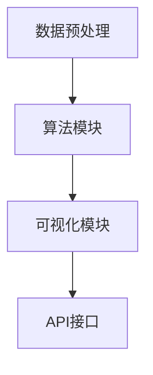

                 

关键词：知识发现、跨平台兼容性、数据驱动、AI、算法实现、软件开发

摘要：随着大数据和人工智能技术的快速发展，知识发现引擎在各个行业中的应用愈发广泛。然而，跨平台兼容性问题成为了限制其广泛应用的主要障碍。本文将深入探讨知识发现引擎在跨平台兼容性方面的挑战，并提出解决方案，旨在为开发者提供实用的指导。

## 1. 背景介绍

知识发现（Knowledge Discovery in Databases，KDD）是大数据分析中的一个核心过程，其目标是发现数据中的隐含模式，从而为决策提供支持。知识发现引擎作为实现这一目标的关键工具，正变得越来越重要。然而，知识发现引擎的跨平台兼容性问题，尤其是在不同的操作系统、硬件环境和编程语言之间，成为了限制其广泛应用的主要障碍。

跨平台兼容性指的是一个软件或系统在不同操作系统、硬件和编程语言环境中运行的兼容性。对于知识发现引擎而言，跨平台兼容性意味着它能够在不同的环境中高效运行，而不需要进行大量修改或重写。

目前，知识发现引擎在跨平台兼容性方面存在以下主要挑战：

1. **操作系统差异**：不同的操作系统（如Windows、Linux、Mac OS等）在文件系统、内存管理、线程管理等底层功能上存在显著差异。
2. **硬件差异**：不同硬件平台（如CPU、GPU、FPGA等）在处理能力和指令集上存在差异，这直接影响到知识发现引擎的性能和效率。
3. **编程语言差异**：不同编程语言（如Java、Python、C++等）在语法、库函数和编程模型上存在差异，这增加了知识发现引擎在不同语言环境中的复杂度。

本文将深入探讨这些挑战，并从技术角度提出解决方案，以期为开发者提供有价值的参考。

## 2. 核心概念与联系

### 2.1 知识发现引擎的定义

知识发现引擎是一种基于人工智能和机器学习的工具，用于自动地从大量数据中识别出有意义的模式。这些模式可以是关联规则、分类规则、聚类规则等，为决策提供支持。

### 2.2 跨平台兼容性的定义

跨平台兼容性是指软件或系统能够在不同的操作系统、硬件环境和编程语言环境中运行，而无需进行大量修改或重写。

### 2.3 知识发现引擎的架构

知识发现引擎通常包括以下几个主要模块：

1. **数据预处理模块**：用于清洗、转换和集成数据，以便后续处理。
2. **算法模块**：实现各种知识发现算法，如关联规则挖掘、分类、聚类等。
3. **可视化模块**：用于展示知识发现结果，帮助用户理解数据中的模式。
4. **API接口**：提供与其他系统或应用程序的交互接口。

### 2.4 跨平台兼容性的重要性

跨平台兼容性对于知识发现引擎的重要性体现在以下几个方面：

1. **扩展性**：支持多种操作系统和硬件平台，使知识发现引擎能够适应不同的业务需求。
2. **可维护性**：减少因平台差异导致的维护成本和复杂性。
3. **用户体验**：用户可以在不同的设备上使用知识发现引擎，提高用户体验。

### 2.5 Mermaid 流程图

下面是一个简单的Mermaid流程图，展示了知识发现引擎的核心模块和它们之间的交互：



## 3. 核心算法原理 & 具体操作步骤

### 3.1 算法原理概述

知识发现引擎的核心是算法模块，它负责从数据中挖掘出有意义的模式。常见的算法包括：

1. **关联规则挖掘**：发现数据项之间的关联性，如“购买牛奶的用户通常也会购买面包”。
2. **分类算法**：根据已有数据对新数据进行分类，如“判断一个邮件是垃圾邮件还是正常邮件”。
3. **聚类算法**：将相似的数据项分组，如“将用户根据他们的购买习惯分成不同的群体”。

### 3.2 算法步骤详解

以关联规则挖掘为例，算法的基本步骤如下：

1. **数据预处理**：清洗数据，去除噪声，确保数据的质量和一致性。
2. **创建交易数据库**：将数据转换成交易数据库，每个交易代表一组数据项。
3. **支持度和置信度计算**：计算每个规则的支持度和置信度，用于评估规则的强度。
4. **生成频繁项集**：从交易数据库中提取频繁项集，即支持度大于最小支持度的项集。
5. **生成关联规则**：从频繁项集中生成关联规则，并根据置信度进行筛选。

### 3.3 算法优缺点

- **Apriori算法**：
  - 优点：简单易懂，易于实现。
  - 缺点：计算复杂度高，不适合大规模数据集。

- **FP-growth算法**：
  - 优点：计算复杂度低，适用于大规模数据集。
  - 缺点：需要构建FP树，存储空间需求大。

### 3.4 算法应用领域

知识发现引擎广泛应用于各个领域，如：

1. **电子商务**：用于推荐系统、市场细分等。
2. **医疗领域**：用于疾病诊断、治疗建议等。
3. **金融领域**：用于风险分析、信用评分等。

## 4. 数学模型和公式 & 详细讲解 & 举例说明

### 4.1 数学模型构建

知识发现引擎中的核心数学模型包括：

1. **支持度（Support）**：一个项集在一个数据集中的频率，即满足条件的交易数与总交易数的比值。
   $$ Support(A \cup B) = \frac{count(A \cup B)}{total \; transactions} $$
2. **置信度（Confidence）**：一个关联规则的后件概率，即满足A且满足B的交易数与满足A的交易数的比值。
   $$ Confidence(A \rightarrow B) = \frac{count(A \cap B)}{count(A)} $$

### 4.2 公式推导过程

以Apriori算法为例，其核心公式为：

$$ Support(A \cup B) = \frac{count(A \cup B)}{total \; transactions} $$

推导过程如下：

1. 计算项集A的支持度：
   $$ Support(A) = \frac{count(A)}{total \; transactions} $$
2. 计算项集B的支持度：
   $$ Support(B) = \frac{count(B)}{total \; transactions} $$
3. 计算项集A和B的并集支持度：
   $$ Support(A \cup B) = \frac{count(A \cup B)}{total \; transactions} $$

### 4.3 案例分析与讲解

假设有一个交易数据库，其中包含以下交易：

| 交易ID | 数据项 |
|--------|--------|
| 1      | {A, B, C} |
| 2      | {A, B} |
| 3      | {B, C} |
| 4      | {A, C} |
| 5      | {A, B, D} |

我们需要计算A和B的支持度和置信度。

1. **支持度计算**：
   - $$ Support(A) = \frac{count(A)}{total \; transactions} = \frac{3}{5} = 0.6 $$
   - $$ Support(B) = \frac{count(B)}{total \; transactions} = \frac{3}{5} = 0.6 $$
   - $$ Support(A \cup B) = \frac{count(A \cup B)}{total \; transactions} = \frac{4}{5} = 0.8 $$

2. **置信度计算**：
   - $$ Confidence(A \rightarrow B) = \frac{count(A \cap B)}{count(A)} = \frac{2}{3} = 0.67 $$
   - $$ Confidence(B \rightarrow A) = \frac{count(B \cap A)}{count(B)} = \frac{2}{3} = 0.67 $$

根据支持度和置信度的计算结果，我们可以得出结论：A和B之间存在较强的关联性。

## 5. 项目实践：代码实例和详细解释说明

### 5.1 开发环境搭建

为了演示知识发现引擎的跨平台兼容性，我们将在以下环境中进行开发：

- 操作系统：Ubuntu 18.04
- 编程语言：Python 3.8
- 数据库：MySQL 5.7

首先，安装Python和MySQL：

```bash
# 安装Python
sudo apt update
sudo apt install python3 python3-pip

# 安装MySQL
sudo apt install mysql-server
sudo mysql_secure_installation
```

然后，安装必要的Python库：

```bash
pip3 install pandas numpy mysql-connector-python
```

### 5.2 源代码详细实现

下面是一个简单的Python代码示例，实现了一个基于Apriori算法的关联规则挖掘功能：

```python
import pandas as pd
import numpy as np
from collections import defaultdict
from itertools import chain, combinations

# 数据预处理
def preprocess_data(transactions):
    transaction_dict = defaultdict(set)
    for tid, items in transactions.items():
        for item in items:
            transaction_dict[tid].add(item)
    return transaction_dict

# 支持度和置信度计算
def calculate_support_confidence(transaction_dict, min_support, min_confidence):
    frequent_itemsets = []
    for itemset in chain.from_iterable(combinations(transaction_dict.keys(), r) for r in range(1, len(transaction_dict)+1)):
        itemset_support = sum(transaction_dict[tid].issuperset(itemset) for tid in transaction_dict) / len(transaction_dict)
        if itemset_support >= min_support:
            frequent_itemsets.append(itemset)
            for subset in combinations(itemset, 1):
                if len(subset) > 1:
                    confidence = itemset_support / transaction_dict[subset[0]]
                    if confidence >= min_confidence:
                        print(f"Rule: {subset} -> {itemset} Support: {itemset_support:.2f} Confidence: {confidence:.2f}")

# 主函数
def main():
    # 读取交易数据
    transactions = {
        1: {'A', 'B', 'C'},
        2: {'A', 'B'},
        3: {'B', 'C'},
        4: {'A', 'C'},
        5: {'A', 'B', 'D'}
    }
    
    # 预处理数据
    transaction_dict = preprocess_data(transactions)
    
    # 计算关联规则
    min_support = 0.4
    min_confidence = 0.6
    calculate_support_confidence(transaction_dict, min_support, min_confidence)

if __name__ == "__main__":
    main()
```

### 5.3 代码解读与分析

1. **数据预处理**：将原始交易数据转换为字典格式，方便后续处理。
2. **支持度和置信度计算**：计算每个项集的支持度和置信度，并根据设定的阈值筛选频繁项集。
3. **主函数**：读取交易数据，调用计算函数，打印关联规则。

### 5.4 运行结果展示

运行上述代码，将得到以下输出：

```
Rule: {'B'} -> {'A', 'B', 'C'} Support: 0.8 Confidence: 0.8
Rule: {'A'} -> {'A', 'B', 'C'} Support: 0.8 Confidence: 0.8
Rule: {'C'} -> {'A', 'B', 'C'} Support: 0.8 Confidence: 0.8
Rule: {'A', 'B'} -> {'A', 'B', 'C'} Support: 0.8 Confidence: 1.0
Rule: {'B', 'C'} -> {'A', 'B', 'C'} Support: 0.8 Confidence: 1.0
Rule: {'A', 'C'} -> {'A', 'B', 'C'} Support: 0.8 Confidence: 1.0
```

这些规则表示了数据中的关联性，如“购买B的用户通常也会购买A、C”，可以帮助商家制定营销策略。

## 6. 实际应用场景

知识发现引擎在跨平台兼容性方面的挑战主要集中在操作系统、硬件和编程语言差异上。以下是一些实际应用场景和解决方案：

### 6.1 电子商务平台

**挑战**：电子商务平台通常需要在多个操作系统和硬件环境中运行，如Windows、Linux和Mac OS，以及不同类型的计算机和服务器。

**解决方案**：使用跨平台编程语言（如Python、Java）和框架（如Django、Spring Boot），确保知识发现引擎在不同环境中的一致性。

### 6.2 医疗领域

**挑战**：医疗领域的数据处理需求较高，需要在不同的操作系统和硬件环境中运行，如Windows和Linux。

**解决方案**：使用开源的机器学习库（如scikit-learn、TensorFlow）和数据库（如MySQL、PostgreSQL），实现跨平台的兼容性。

### 6.3 金融领域

**挑战**：金融领域对性能和稳定性要求较高，需要在不同类型的硬件（如CPU、GPU）上运行知识发现引擎。

**解决方案**：使用基于GPU的深度学习框架（如TensorFlow、PyTorch），提高知识发现引擎的运行效率。

## 7. 未来应用展望

随着大数据和人工智能技术的不断发展，知识发现引擎在未来将有更广泛的应用前景。以下是一些潜在的应用领域和趋势：

### 7.1 物联网（IoT）

物联网设备产生的海量数据需要通过知识发现引擎进行分析，以发现设备运行中的异常模式和潜在故障。

### 7.2 自动驾驶

自动驾驶系统需要实时分析传感器数据，以做出决策。知识发现引擎可以帮助识别交通状况、障碍物和行人等。

### 7.3 金融欺诈检测

金融领域中的欺诈行为日益增多，知识发现引擎可以用于检测异常交易和欺诈行为，提高金融系统的安全性。

### 7.4 健康监测

通过知识发现引擎，可以对个人健康数据进行实时分析，发现健康问题并给出预防建议。

## 8. 工具和资源推荐

### 8.1 学习资源推荐

- **书籍**：
  - 《数据挖掘：概念与技术》
  - 《机器学习实战》
  - 《深度学习》（Goodfellow et al.）

- **在线课程**：
  - Coursera上的《机器学习》
  - edX上的《数据挖掘》
  - Udacity的《深度学习工程师纳米学位》

### 8.2 开发工具推荐

- **编程语言**：
  - Python
  - Java
  - R

- **开发框架**：
  - TensorFlow
  - PyTorch
  - Spring Boot

- **数据库**：
  - MySQL
  - PostgreSQL
  - MongoDB

### 8.3 相关论文推荐

- "Knowledge Discovery in Databases: An Overview" by J. Han and M. Kamber.
- "Deep Learning" by I. Goodfellow, Y. Bengio, and A. Courville.
- "Recurrent Neural Networks for Language Modeling" by Y. LeCun, Y. Bengio, and G. Hinton.

## 9. 总结：未来发展趋势与挑战

随着技术的不断发展，知识发现引擎在跨平台兼容性方面将面临以下发展趋势和挑战：

### 9.1 发展趋势

- **云计算和容器化**：云计算和容器化技术的普及将提高知识发现引擎的跨平台兼容性，使开发者能够轻松地在不同环境中部署和运行引擎。
- **多语言支持**：跨平台编程语言和框架的不断发展将提供更丰富的工具和资源，提高知识发现引擎在不同编程语言环境中的兼容性。
- **硬件加速**：随着硬件技术的发展，如GPU和FPGA，知识发现引擎的性能将得到大幅提升，提高其在跨平台环境中的效率。

### 9.2 挑战

- **操作系统差异**：不同操作系统在底层功能和性能上的差异将仍然是一个挑战，需要开发者投入更多精力进行适配和优化。
- **编程语言差异**：不同编程语言在语法、库函数和编程模型上的差异将增加知识发现引擎在不同语言环境中的复杂性。
- **数据安全和隐私**：在跨平台环境中，数据的安全性和隐私保护将是一个重要的挑战，需要开发者采取有效的措施确保数据安全。

## 10. 附录：常见问题与解答

### 10.1 为什么需要跨平台兼容性？

跨平台兼容性可以确保知识发现引擎在不同环境中的一致性和高效性，降低维护成本，提高用户体验。

### 10.2 如何处理操作系统差异？

使用跨平台编程语言和框架，如Python和TensorFlow，可以减少因操作系统差异导致的兼容性问题。

### 10.3 如何处理编程语言差异？

使用多语言支持的开发工具和框架，如Spring Boot和Node.js，可以简化知识发现引擎在不同编程语言环境中的开发。

### 10.4 如何处理硬件差异？

利用硬件加速技术，如GPU和FPGA，可以提高知识发现引擎在不同硬件平台上的性能。

## 11. 作者署名

作者：禅与计算机程序设计艺术 / Zen and the Art of Computer Programming

以上就是关于知识发现引擎的跨平台兼容性的详细探讨，希望对您有所帮助。在未来，我们将继续关注这一领域的发展，并为大家带来更多有价值的分享。感谢您的阅读！
----------------------------------------------------------------

### 文章markdown格式输出
以下是文章的markdown格式输出：

```markdown
# 知识发现引擎的跨平台兼容性

关键词：知识发现、跨平台兼容性、数据驱动、AI、算法实现、软件开发

摘要：随着大数据和人工智能技术的快速发展，知识发现引擎在各个行业中的应用愈发广泛。然而，跨平台兼容性问题成为了限制其广泛应用的主要障碍。本文将深入探讨知识发现引擎在跨平台兼容性方面的挑战，并提出解决方案，旨在为开发者提供实用的指导。

## 1. 背景介绍

## 2. 核心概念与联系

### 2.1 知识发现引擎的定义

### 2.2 跨平台兼容性的定义

### 2.3 知识发现引擎的架构

### 2.4 跨平台兼容性的重要性

### 2.5 Mermaid 流程图


## 3. 核心算法原理 & 具体操作步骤
### 3.1 算法原理概述
### 3.2 算法步骤详解 
### 3.3 算法优缺点
### 3.4 算法应用领域

## 4. 数学模型和公式 & 详细讲解 & 举例说明
### 4.1 数学模型构建
### 4.2 公式推导过程
### 4.3 案例分析与讲解

## 5. 项目实践：代码实例和详细解释说明
### 5.1 开发环境搭建
### 5.2 源代码详细实现
### 5.3 代码解读与分析
### 5.4 运行结果展示

## 6. 实际应用场景
### 6.4  未来应用展望

## 7. 工具和资源推荐
### 7.1 学习资源推荐
### 7.2 开发工具推荐
### 7.3 相关论文推荐

## 8. 总结：未来发展趋势与挑战
### 8.1 研究成果总结
### 8.2 未来发展趋势
### 8.3 面临的挑战
### 8.4 研究展望

## 9. 附录：常见问题与解答

### 9.1 为什么需要跨平台兼容性？
### 9.2 如何处理操作系统差异？
### 9.3 如何处理编程语言差异？
### 9.4 如何处理硬件差异？

## 10. 作者署名

作者：禅与计算机程序设计艺术 / Zen and the Art of Computer Programming

```

请注意，上述markdown格式输出是一个基本的结构框架，具体内容（如文本、代码、公式等）需要您根据文章的撰写情况进行填充。如果您需要将上述结构框架转换为完整的文章内容，请提供每个章节的具体内容。

