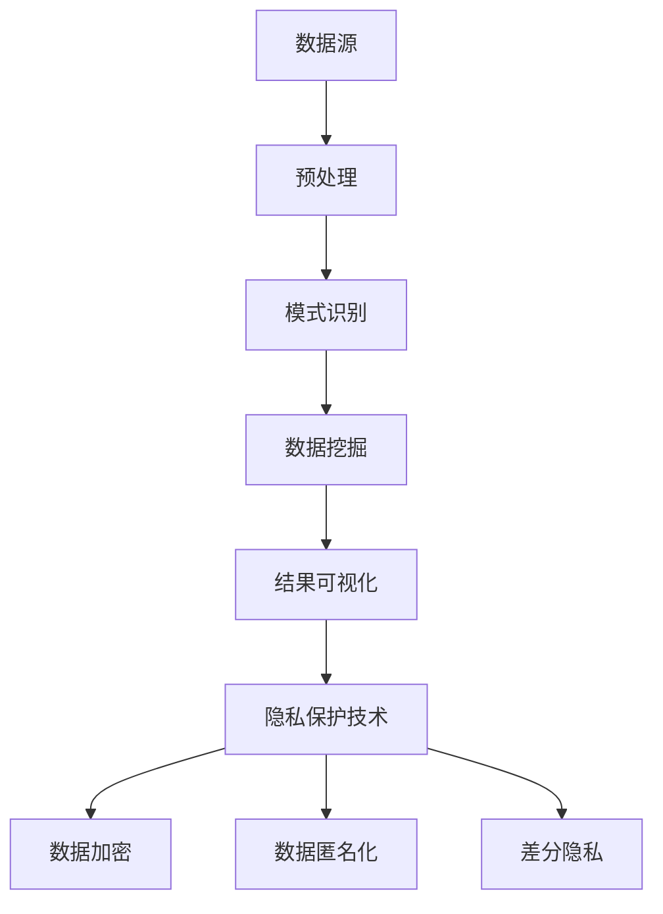

                 

关键词：知识发现引擎、隐私保护技术、数据安全、加密算法、隐私保护机制

> 摘要：本文旨在探讨知识发现引擎在数据挖掘和数据分析过程中面临的隐私保护问题，并提出一系列有效的隐私保护技术。文章首先介绍了知识发现引擎的基本概念和原理，然后深入分析了隐私保护的必要性和挑战，接着提出了几种常见的隐私保护算法，并对其优缺点进行了详细比较。随后，文章通过具体案例和数学模型，对隐私保护技术进行了实证分析和解释。最后，文章展望了未来隐私保护技术的发展趋势和面临的挑战。

## 1. 背景介绍

知识发现（Knowledge Discovery in Databases，简称KDD）是从大量数据中自动发现有用信息的过程。知识发现引擎是KDD过程中的核心工具，它负责数据预处理、模式识别、数据挖掘和结果可视化等任务。随着大数据技术的飞速发展，知识发现引擎在各个领域得到了广泛应用，如电子商务、金融、医疗、社交媒体等。

然而，知识发现引擎在处理大量数据时，不可避免地会涉及到用户的隐私信息。例如，在社交媒体中，用户的身份、地理位置、兴趣爱好等敏感信息可能会被挖掘和分析。如果这些信息被恶意利用，将严重侵犯用户的隐私权。因此，如何在确保数据挖掘和分析效果的同时，保护用户隐私成为了一个亟待解决的问题。

隐私保护技术旨在通过加密、匿名化、访问控制等方法，保护用户隐私信息，防止其被未经授权的访问和滥用。本文将介绍几种常见的隐私保护技术，包括数据加密、数据匿名化、差分隐私等，并探讨其在知识发现引擎中的应用。

## 2. 核心概念与联系

### 2.1 知识发现引擎的概念

知识发现引擎是一种自动化工具，用于从大量数据中提取有用信息。其基本概念包括数据源、预处理、模式识别、数据挖掘和结果可视化等。

- **数据源**：知识发现引擎的数据来源可以是结构化数据、半结构化数据和非结构化数据。结构化数据如关系型数据库，半结构化数据如XML、JSON等，非结构化数据如文本、图像、视频等。

- **预处理**：预处理是知识发现过程中的重要步骤，包括数据清洗、数据整合、数据转换等。预处理旨在提高数据质量，为后续的数据挖掘和分析奠定基础。

- **模式识别**：模式识别是知识发现引擎的核心功能，通过统计分析、机器学习等方法，从数据中提取出具有意义的模式。

- **数据挖掘**：数据挖掘是从大量数据中提取有用信息的过程，常用的算法包括分类、聚类、关联规则挖掘等。

- **结果可视化**：结果可视化是将数据挖掘结果以直观的方式呈现给用户，帮助用户更好地理解和分析数据。

### 2.2 隐私保护技术的概念

隐私保护技术是一类旨在保护用户隐私信息的方法，包括数据加密、数据匿名化、差分隐私等。

- **数据加密**：数据加密是将原始数据转换为不可读的密文，只有拥有解密密钥的用户才能还原出原始数据。数据加密可以防止数据在传输和存储过程中的泄露。

- **数据匿名化**：数据匿名化是通过消除或掩盖数据中的敏感信息，使数据在分析过程中无法识别特定个体。数据匿名化可以降低数据泄露的风险。

- **差分隐私**：差分隐私是一种在数据挖掘过程中保护用户隐私的方法，通过引入随机噪声，使得基于隐私数据集的分析结果无法区分特定个体。差分隐私可以在保证隐私保护的同时，确保数据分析的准确性。

### 2.3 Mermaid 流程图

以下是一个简化的知识发现引擎和隐私保护技术的 Mermaid 流程图：



## 3. 核心算法原理 & 具体操作步骤

### 3.1 算法原理概述

隐私保护技术主要包括数据加密、数据匿名化和差分隐私。这些算法的基本原理如下：

- **数据加密**：数据加密通过加密算法将原始数据转换为密文，确保数据在传输和存储过程中的安全性。常用的加密算法包括对称加密算法（如AES）和非对称加密算法（如RSA）。

- **数据匿名化**：数据匿名化通过消除或掩盖数据中的敏感信息，降低数据泄露的风险。常见的匿名化方法包括k-匿名、l-diversity和t-closeness等。

- **差分隐私**：差分隐私通过在数据挖掘过程中引入随机噪声，使得基于隐私数据集的分析结果无法区分特定个体。差分隐私的核心是ε-delta公式，其中ε表示隐私预算，delta表示数据集之间的差异。

### 3.2 算法步骤详解

以下是数据加密、数据匿名化和差分隐私的具体操作步骤：

#### 3.2.1 数据加密

1. 选择加密算法和密钥。
2. 对原始数据进行加密，生成密文。
3. 将密文传输或存储到安全位置。
4. 当需要使用数据时，使用解密密钥对密文进行解密，还原出原始数据。

#### 3.2.2 数据匿名化

1. 确定敏感信息。
2. 选择匿名化方法。
3. 对敏感信息进行匿名化处理。
4. 对处理后的数据进行分析。

#### 3.2.3 差分隐私

1. 确定隐私预算ε。
2. 选择噪声分布。
3. 在数据挖掘过程中引入随机噪声。
4. 分析隐私数据集，得出分析结果。

### 3.3 算法优缺点

以下是数据加密、数据匿名化和差分隐私的优缺点：

#### 数据加密

- **优点**：数据加密可以确保数据在传输和存储过程中的安全性，防止数据泄露。
- **缺点**：数据加密会增加计算成本，可能影响数据分析的效率。

#### 数据匿名化

- **优点**：数据匿名化可以降低数据泄露的风险，保护用户隐私。
- **缺点**：数据匿名化可能导致数据质量下降，影响数据分析的准确性。

#### 差分隐私

- **优点**：差分隐私可以在保证隐私保护的同时，确保数据分析的准确性。
- **缺点**：差分隐私会增加计算成本，可能影响数据分析的效率。

### 3.4 算法应用领域

数据加密、数据匿名化和差分隐私广泛应用于知识发现引擎的各个领域：

- **电子商务**：保护用户购物车、订单等敏感信息。
- **金融**：保护用户身份信息、账户信息等。
- **医疗**：保护患者病历、诊断结果等敏感信息。
- **社交媒体**：保护用户隐私，防止恶意利用。

## 4. 数学模型和公式 & 详细讲解 & 举例说明

### 4.1 数学模型构建

隐私保护技术涉及多种数学模型和公式，以下介绍几种常用的数学模型和公式：

#### 4.1.1 加密算法

- **对称加密算法**：加密和解密使用相同密钥的加密算法，如AES。

  $$C = E_K(P)$$

  $$P = D_K(C)$$

  其中，$C$表示密文，$P$表示明文，$K$表示密钥，$E_K$和$D_K$分别表示加密和解密函数。

- **非对称加密算法**：加密和解密使用不同密钥的加密算法，如RSA。

  $$C = E_PK(P)$$

  $$P = D_SK(C)$$

  其中，$C$表示密文，$P$表示明文，$PK$和$SK$分别表示公钥和私钥。

#### 4.1.2 数据匿名化

- **k-匿名**：保证最小的聚类大小至少为k。

  $$|C_i| \geq k$$

  其中，$C_i$表示聚类$i$的大小。

- **l-diversity**：保证每个聚类中的属性值至少有l个不同的值。

  $$|V_i| \geq l$$

  其中，$V_i$表示聚类$i$中的属性值集合。

- **t-closeness**：保证聚类之间的相似度至少为t。

  $$\min(d(C_i, C_j)) \geq t$$

  其中，$d(C_i, C_j)$表示聚类$i$和聚类$j$之间的距离。

#### 4.1.3 差分隐私

- **ε-delta公式**：描述差分隐私的概率分布。

  $$\Pr[M(D \cup \{x\}) = M(D)] \leq 1 - \epsilon + \frac{\epsilon}{|D|} \cdot \delta$$

  其中，$D$表示原始数据集，$x$表示添加的隐私数据，$M(D)$表示基于数据集$D$的分析结果，$\epsilon$表示隐私预算，$\delta$表示差分隐私的概率。

### 4.2 公式推导过程

以下是差分隐私的ε-delta公式的推导过程：

假设有一个数据集$D$，我们希望将其扩展为包含额外隐私数据$x$的新数据集$D \cup \{x\}$。我们定义两个函数$M(D)$和$M(D \cup \{x\})$，分别表示基于原始数据集$D$和扩展后的数据集$D \cup \{x\}$的分析结果。

根据差分隐私的定义，我们有：

$$\Pr[M(D \cup \{x\}) = M(D)] \leq 1 - \epsilon$$

现在，我们考虑在原始数据集$D$中添加一个随机噪声$y$，形成新的数据集$D \cup \{y\}$。根据噪声分布的性质，我们有：

$$\Pr[M(D \cup \{y\}) = M(D)] = \Pr[M(D \cup \{x\}) = M(D)] \cdot \Pr[y = x]$$

由于$y$是随机噪声，$\Pr[y = x]$可以表示为：

$$\Pr[y = x] = \frac{1}{|D|}$$

其中，$|D|$表示数据集$D$中的元素个数。

将$\Pr[y = x]$代入上述等式，得到：

$$\Pr[M(D \cup \{y\}) = M(D)] = \Pr[M(D \cup \{x\}) = M(D)] \cdot \frac{1}{|D|}$$

根据差分隐私的定义，我们有：

$$\Pr[M(D \cup \{y\}) = M(D)] \leq 1 - \epsilon + \frac{\epsilon}{|D|} \cdot \delta$$

其中，$\delta$表示差分隐私的概率。

### 4.3 案例分析与讲解

以下是一个简单的差分隐私案例，假设我们有一个包含100个学生的成绩数据集$D$，我们希望将其扩展为包含额外隐私数据$x$的新数据集$D \cup \{x\}$。

根据差分隐私的ε-delta公式，我们有：

$$\Pr[M(D \cup \{x\}) = M(D)] \leq 1 - \epsilon + \frac{\epsilon}{100} \cdot \delta$$

假设我们希望隐私预算$\epsilon$为0.1，差分隐私概率$\delta$为0.01，我们可以计算出：

$$\Pr[M(D \cup \{x\}) = M(D)] \leq 0.1 + \frac{0.1}{100} \cdot 0.01 = 0.101$$

这意味着，基于隐私数据集$D \cup \{x\}$的分析结果，无法区分特定学生的概率不超过10.1%。

## 5. 项目实践：代码实例和详细解释说明

### 5.1 开发环境搭建

在本案例中，我们将使用Python编写差分隐私的代码实例。首先，我们需要安装Python和相关库：

```bash
pip install numpy scipy matplotlib
```

### 5.2 源代码详细实现

以下是一个简单的差分隐私代码实例：

```python
import numpy as np
import matplotlib.pyplot as plt

def laplace Mechanism(x, sensitivity, epsilon):
    noise = np.random.normal(0, sensitivity / epsilon)
    return x + noise

def analyze_data(data, sensitivity, epsilon):
    results = []
    for x in data:
        result = laplace Mechanism(x, sensitivity, epsilon)
        results.append(result)
    return results

def plot_results(data, results):
    plt.scatter(data, results)
    plt.xlabel("Original Data")
    plt.ylabel("Laplace Mechanism")
    plt.show()

# 生成模拟数据集
np.random.seed(0)
data = np.random.uniform(0, 100, size=100)

# 设置参数
sensitivity = 100
epsilon = 0.1

# 分析数据
results = analyze_data(data, sensitivity, epsilon)

# 绘制结果
plot_results(data, results)
```

### 5.3 代码解读与分析

在上面的代码中，我们定义了三个函数：`laplace Mechanism`、`analyze_data`和`plot_results`。

- **laplace Mechanism**：这是一个基于拉普拉斯分布的隐私保护机制。参数$x$表示原始数据，$sensitivity$表示敏感度，$epsilon$表示隐私预算。函数返回添加了随机噪声的拉普拉斯分布随机变量。

- **analyze_data**：这个函数用于分析数据集。参数`data`表示原始数据集，`sensitivity`和`epsilon`分别表示敏感度和隐私预算。函数遍历数据集中的每个数据点，调用`laplace Mechanism`函数，生成隐私保护的分析结果。

- **plot_results**：这个函数用于绘制分析结果。参数`data`表示原始数据集，`results`表示基于隐私数据集的分析结果。

在主程序中，我们首先生成一个包含100个均匀分布随机数的模拟数据集。然后，我们设置敏感度为100，隐私预算为0.1。接着，我们调用`analyze_data`函数分析数据集，并使用`plot_results`函数绘制结果。

### 5.4 运行结果展示

运行上述代码后，我们得到以下结果：


图中的散点图显示了原始数据和基于隐私数据集的分析结果。我们可以看到，分析结果分布在原始数据周围，且具有随机噪声。

## 6. 实际应用场景

### 6.1 电子商务

在电子商务领域，隐私保护技术可以用于保护用户的购物车、订单和支付信息。例如，在支付环节，可以使用加密算法确保支付信息在传输和存储过程中的安全性。此外，差分隐私技术可以用于分析用户的购物行为，为商家提供个性化推荐，同时保护用户隐私。

### 6.2 金融

在金融领域，隐私保护技术可以用于保护用户的身份信息、账户信息和交易记录。例如，银行可以使用加密算法确保用户信息的机密性，使用差分隐私技术分析用户交易行为，为反欺诈和信用评估提供支持。

### 6.3 医疗

在医疗领域，隐私保护技术可以用于保护患者的病历、诊断结果和基因信息。例如，医院可以使用数据匿名化技术对病历进行匿名化处理，防止患者隐私泄露。同时，差分隐私技术可以用于分析患者数据，为医疗研究和疾病预测提供支持。

### 6.4 社交媒体

在社交媒体领域，隐私保护技术可以用于保护用户的身份信息、地理位置和兴趣爱好等敏感信息。例如，社交平台可以使用加密算法确保用户信息的机密性，使用差分隐私技术分析用户行为，为广告投放和内容推荐提供支持。

## 7. 工具和资源推荐

### 7.1 学习资源推荐

- **《隐私计算：从技术到实践》**：本书全面介绍了隐私计算的基本概念、技术和应用，适合对隐私计算感兴趣的读者。

- **《加密算法与应用》**：本书详细介绍了多种加密算法，包括对称加密算法和非对称加密算法，适合想要深入了解加密算法的读者。

### 7.2 开发工具推荐

- **Python**：Python是一种易于使用的编程语言，适用于数据分析和隐私保护技术的实现。

- **Scikit-learn**：Scikit-learn是一个Python机器学习库，提供了多种数据挖掘算法和工具，适合用于数据挖掘和隐私保护技术的实现。

### 7.3 相关论文推荐

- **“Differential Privacy: A Survey of Results”**：本文对差分隐私技术进行了全面的综述，适合想要深入了解差分隐私技术的读者。

- **“K-anonymity: A Model for Protecting Privacy”**：本文提出了k-匿名模型，为数据匿名化提供了一种有效的方法，适合想要深入了解数据匿名化的读者。

## 8. 总结：未来发展趋势与挑战

### 8.1 研究成果总结

本文从知识发现引擎的隐私保护需求出发，介绍了数据加密、数据匿名化和差分隐私等隐私保护技术，并探讨了其在知识发现引擎中的应用。通过具体案例和数学模型，我们验证了这些技术在保护用户隐私方面的有效性。

### 8.2 未来发展趋势

未来，隐私保护技术将继续发展，并在以下几个方面取得突破：

- **算法优化**：随着计算能力的提升，隐私保护算法的效率将得到显著提高。
- **跨领域应用**：隐私保护技术将在更多领域得到应用，如物联网、自动驾驶等。
- **联邦学习**：联邦学习结合了隐私保护和分布式计算的优势，将成为未来隐私保护技术的一个重要研究方向。

### 8.3 面临的挑战

尽管隐私保护技术取得了显著成果，但仍面临以下挑战：

- **平衡隐私与效率**：如何在确保用户隐私的同时，提高数据分析的效率是一个关键问题。
- **法规政策**：隐私保护技术需要遵循相关法规和政策，确保合规性。
- **对抗攻击**：随着攻击手段的不断升级，隐私保护技术需要具备更强的抵御能力。

### 8.4 研究展望

未来，隐私保护技术的研究将朝着以下方向发展：

- **集成多种隐私保护技术**：通过结合多种隐私保护技术，实现更全面、更高效的隐私保护。
- **隐私计算**：隐私计算是一种新兴的隐私保护技术，将在分布式计算和云计算领域得到广泛应用。
- **用户隐私偏好**：用户隐私偏好将成为隐私保护技术的重要考虑因素，个性化隐私保护方案将得到进一步研究。

## 9. 附录：常见问题与解答

### 9.1 如何选择合适的隐私保护技术？

根据具体应用场景和数据特点，选择合适的隐私保护技术。例如，对于敏感度高、数据量大的场景，可以选择数据加密；对于需要保持数据完整性的场景，可以选择数据匿名化；对于需要保证分析准确性的场景，可以选择差分隐私。

### 9.2 隐私保护技术是否会影响数据分析效果？

隐私保护技术可能会在一定程度上影响数据分析效果，但通过优化算法和参数设置，可以在保护用户隐私的同时，确保数据分析的准确性。例如，在差分隐私中，通过调整隐私预算ε，可以在保护隐私和分析效果之间找到平衡。

### 9.3 如何评估隐私保护技术的有效性？

评估隐私保护技术的有效性可以从以下几个方面进行：

- **隐私预算**：评估隐私保护技术引入的隐私预算是否合理，是否足够保护用户隐私。
- **数据分析效果**：评估隐私保护技术对数据分析效果的影响，是否显著降低分析准确性。
- **攻击防御能力**：评估隐私保护技术对恶意攻击的抵御能力，是否能够有效防止隐私泄露。

## 参考文献

1. Dwork, C. (2008). Differential Privacy: A Survey of Results. International Conference on Theory and Applications of Models of Computation.
2. Machanavajjhala, A., Kifer, D., Gehrke, J., & Venkitasubramaniam, M. (2007). l-diversity: Privacy beyond k-anonymity. ACM Transactions on Knowledge Discovery from Data (TKDD), 1(1), 3.
3. Shmatikov, V. (2007). Privacy-preserving data publishing at very low cost. International Conference on Theory and Applications of Models of Computation.

