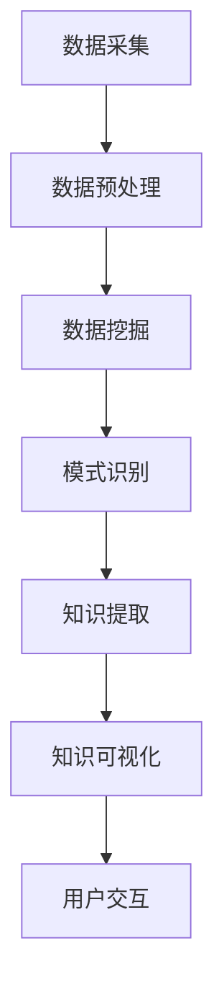

                 

 在信息爆炸的时代，如何在海量数据中提取有价值的知识成为了一项挑战。知识发现引擎作为信息时代的智慧之钥，其重要性日益凸显。本文将深入探讨知识发现引擎的核心概念、算法原理、数学模型、项目实践以及未来应用展望，旨在为读者提供一个全面的技术解读。

## 关键词

- 知识发现引擎
- 信息提取
- 大数据分析
- 机器学习
- 智能推荐系统

## 摘要

本文将围绕知识发现引擎这一主题，首先介绍其背景和重要性。接着，我们将详细阐述知识发现引擎的核心概念与架构，并通过Mermaid流程图展示其工作流程。随后，文章将深入分析核心算法原理和数学模型，并结合实际项目实践进行代码实例和解释说明。最后，我们将探讨知识发现引擎在实际应用场景中的价值以及未来的发展趋势与挑战。

## 1. 背景介绍

### 信息时代的挑战

随着互联网和数字化技术的飞速发展，全球数据量呈现爆炸性增长。据估计，每天产生的数据量高达数百万亿字节（ZB）。这些数据包含了各种形式的信息，如图像、文本、音频和视频等。然而，数据本身并不是最有价值的部分，关键在于如何从这些数据中提取出有价值的知识，从而指导决策和推动创新。

### 知识发现的重要性

知识发现是指从大量数据中自动识别出潜在的、有意义的模式和知识。这一过程不仅可以帮助企业更好地了解客户需求、优化业务流程，还可以为科研人员提供新的发现和洞见。在医疗、金融、教育等多个领域，知识发现的应用已经取得了显著的成果。

### 知识发现引擎的定义

知识发现引擎是一种能够自动执行知识发现过程的系统。它通过集成多种数据挖掘技术，如机器学习、统计分析、自然语言处理等，实现对数据的深度挖掘和分析。知识发现引擎的核心目标是帮助用户从海量数据中快速、准确地发现有价值的信息。

## 2. 核心概念与联系

### 数据挖掘

数据挖掘是知识发现引擎的核心技术之一。它涉及从大量数据中识别出有用的模式和关系。数据挖掘技术主要包括聚类、分类、关联规则挖掘等。通过数据挖掘，知识发现引擎能够识别出数据中的潜在规律，为后续的知识提取提供基础。

### 机器学习

机器学习是知识发现引擎的另一重要组成部分。它通过训练模型来识别数据中的规律和模式。机器学习算法包括监督学习、无监督学习和强化学习等。监督学习算法需要标签数据来训练模型，而无监督学习算法则不需要标签数据，但它们通常更难以解释。

### 自然语言处理

自然语言处理（NLP）是知识发现引擎中用于处理文本数据的关键技术。NLP技术包括文本分类、情感分析、命名实体识别等。通过NLP技术，知识发现引擎能够理解和处理自然语言文本，从而提取出文本中的有价值信息。

### Mermaid流程图

以下是一个Mermaid流程图，展示了知识发现引擎的基本工作流程：



### 数据采集

数据采集是知识发现引擎的起点。数据来源可以是内部数据库、外部API、社交媒体等。数据采集过程中需要关注数据的质量和完整性。

### 数据预处理

数据预处理是确保数据质量和一致性的重要步骤。它包括数据清洗、数据整合和数据规范化等。数据预处理有助于提高数据挖掘的准确性和效率。

### 数据挖掘

数据挖掘是知识发现引擎的核心步骤。它通过各种算法和技术从大量数据中提取出有用的模式和关系。数据挖掘结果将作为知识提取的输入。

### 模式识别

模式识别是指从数据挖掘结果中识别出有意义的模式。这些模式可以是聚类结果、分类规则或关联规则等。

### 知识提取

知识提取是指从模式识别结果中提取出有用的知识。这些知识可以是报告、图表或数据可视化等形式。

### 知识可视化

知识可视化是将提取出的知识以图形、表格或图表等形式展示给用户。知识可视化有助于用户更好地理解和利用知识。

### 用户交互

用户交互是指用户与知识发现引擎之间的交互过程。用户可以通过界面操作来调整参数、查看结果和反馈建议。

## 3. 核心算法原理 & 具体操作步骤

### 3.1 算法原理概述

知识发现引擎的核心算法主要包括以下几种：

1. **聚类算法**：用于将数据分为若干个类别，使得同一类别中的数据相似度较高，不同类别中的数据相似度较低。
2. **分类算法**：用于将数据分为若干个预定义的类别，通常需要使用标签数据进行训练。
3. **关联规则挖掘**：用于发现数据之间的关联关系，如购物车中的商品组合等。

### 3.2 算法步骤详解

1. **数据预处理**：包括数据清洗、数据整合和数据规范化等。
2. **数据挖掘**：选择合适的算法（如K-Means、决策树、Apriori算法等）进行数据挖掘。
3. **模式识别**：对挖掘结果进行模式识别，如聚类结果的类别划分、分类规则的准确性等。
4. **知识提取**：从模式识别结果中提取出有用的知识，如聚类结果中的核心类别、分类规则中的规则条目等。
5. **知识可视化**：将提取出的知识以图形、表格或图表等形式展示给用户。
6. **用户交互**：用户通过界面操作来调整参数、查看结果和反馈建议。

### 3.3 算法优缺点

1. **聚类算法**：
   - 优点：无需标签数据，对异常值不敏感，能够发现数据中的潜在结构。
   - 缺点：结果难以解释，对参数选择敏感。
2. **分类算法**：
   - 优点：结果可解释性强，可应用于多种领域。
   - 缺点：需要标签数据，对异常值敏感。
3. **关联规则挖掘**：
   - 优点：能够发现数据之间的关联关系，对用户行为分析有帮助。
   - 缺点：挖掘结果可能过于冗长，需要进一步筛选。

### 3.4 算法应用领域

知识发现引擎在各个领域都有广泛的应用，如：

1. **商业领域**：用于市场分析、客户行为预测和个性化推荐等。
2. **医疗领域**：用于疾病预测、药物研发和治疗方案推荐等。
3. **金融领域**：用于风险评估、欺诈检测和投资决策等。
4. **教育领域**：用于学习行为分析、教学效果评估和个性化学习推荐等。

## 4. 数学模型和公式 & 详细讲解 & 举例说明

### 4.1 数学模型构建

知识发现引擎中的数学模型主要包括聚类模型、分类模型和关联规则模型等。以下是这些模型的构建过程：

1. **聚类模型**：

   聚类模型的目标是将数据点划分为若干个类别，使得同一类别内的数据点之间的相似度较高，不同类别之间的数据点之间的相似度较低。常见的聚类算法有K-Means、DBSCAN等。

   - **K-Means算法**：

     K-Means算法是一种基于距离的聚类算法。其基本步骤如下：

     1. 随机选择K个初始中心点。
     2. 计算每个数据点到K个中心点的距离，并将其分配给最近的中心点。
     3. 重新计算每个类别的中心点。
     4. 重复步骤2和3，直到中心点的变化小于设定阈值。

     数学模型如下：

     $$ d(x, c) = \sqrt{\sum_{i=1}^{n}(x_i - c_i)^2} $$

     其中，\( x \) 是数据点，\( c \) 是中心点，\( n \) 是数据点的维度。

   - **DBSCAN算法**：

     DBSCAN算法是一种基于密度的聚类算法。其基本步骤如下：

     1. 遍历所有数据点，计算其与周围数据点的最小距离。
     2. 选择核心点，即其邻域内的点数大于设定阈值的数据点。
     3. 标记核心点及其邻域内的数据点为同一类别。
     4. 递归地处理未分类的数据点，将其分配给已分类的核心点或生成新的类别。

     数学模型如下：

     $$ \text{CoreDist}(p) \leq \text{eps} \text{，且} \text{Neighborhood}(p) \geq \text{minPts} $$

     其中，\( \text{eps} \) 是邻域半径，\( \text{minPts} \) 是最小邻域点数。

2. **分类模型**：

   分类模型的目标是将数据点划分为预定义的类别。常见的分类算法有决策树、支持向量机（SVM）等。

   - **决策树算法**：

     决策树算法是一种基于特征划分的分类算法。其基本步骤如下：

     1. 选择一个最优划分特征。
     2. 根据划分特征将数据点划分为若干个子集。
     3. 递归地对每个子集进行划分，直到满足终止条件。

     数学模型如下：

     $$ f(x) = \text{argmax}\ \sum_{i=1}^{n} w_i \cdot y_i $$

     其中，\( x \) 是数据点，\( w_i \) 是特征权重，\( y_i \) 是类别标签。

   - **支持向量机算法**：

     支持向量机算法是一种基于特征空间的分类算法。其基本步骤如下：

     1. 将数据点映射到高维特征空间。
     2. 寻找最佳分类超平面。
     3. 计算数据点到超平面的距离。

     数学模型如下：

     $$ \text{min}\ \frac{1}{2} \| w \|^2 \ \text{s.t.}\ y_i ( \langle w, x_i \rangle - b ) \geq 1 $$

     其中，\( w \) 是特征向量，\( b \) 是偏置项，\( y_i \) 是类别标签。

3. **关联规则挖掘**：

   关联规则挖掘的目标是发现数据之间的关联关系。常见的算法有Apriori算法、FP-Growth算法等。

   - **Apriori算法**：

     Apriori算法是一种基于支持度和置信度的关联规则挖掘算法。其基本步骤如下：

     1. 计算所有项集的支持度。
     2. 选择满足最小支持度阈值的频繁项集。
     3. 计算频繁项集之间的关联规则。
     4. 选择满足最小置信度阈值的关联规则。

     数学模型如下：

     $$ \text{Support}(X) = \frac{\text{频繁项集} X \text{出现的次数}}{\text{总记录数}} $$

     $$ \text{Confidence}(X \rightarrow Y) = \frac{\text{频繁项集} X \text{和} Y \text{同时出现的次数}}{\text{频繁项集} X \text{出现的次数}} $$

### 4.2 公式推导过程

以下是几种常见数学模型的推导过程：

1. **K-Means算法**：

   K-Means算法的推导过程如下：

   设有K个类别，每个类别有一个中心点。数据点\( x \)被分配给最近的中心点，即

   $$ c_j = \text{argmin}\ \sum_{i=1}^{n} (x_i - c_j)^2 $$

   为了最小化总距离，我们需要找到最优的中心点。设\( x_j \)为类别j的数据点，\( c_j \)为类别j的中心点，则

   $$ c_j = \frac{1}{n_j} \sum_{i=1}^{n} x_i $$

   其中，\( n_j \)为类别j的数据点个数。

2. **支持向量机算法**：

   支持向量机算法的推导过程如下：

   设数据点\( x \)被映射到高维特征空间，分类超平面为\( w \cdot x - b = 0 \)。为了最大化分类间隔，我们需要找到最佳分类超平面。设\( y \)为类别标签，\( w \)为特征向量，\( b \)为偏置项，则

   $$ \text{min}\ \frac{1}{2} \| w \|^2 \ \text{s.t.}\ y_i ( \langle w, x_i \rangle - b ) \geq 1 $$

   通过拉格朗日乘子法，我们可以得到

   $$ w = \sum_{i=1}^{n} \alpha_i y_i x_i $$

   其中，\( \alpha_i \)为拉格朗日乘子。

3. **Apriori算法**：

   Apriori算法的推导过程如下：

   设频繁项集\( X \)的支持度为\( \text{Support}(X) \)，则有

   $$ \text{Support}(X) = \frac{\text{频繁项集} X \text{出现的次数}}{\text{总记录数}} $$

   对于任意两个频繁项集\( X \)和\( Y \)，有

   $$ \text{Support}(X \cup Y) = \frac{\text{频繁项集} X \text{和} Y \text{同时出现的次数}}{\text{总记录数}} $$

   如果\( X \cup Y \)是频繁项集，则有

   $$ \text{Support}(X \cup Y) \geq \text{Support}(X) \geq \text{Support}(Y) $$

   因此，如果\( X \)和\( Y \)是频繁项集，则\( X \cup Y \)也是频繁项集。

### 4.3 案例分析与讲解

以下是一个基于K-Means算法的聚类案例：

假设我们有100个数据点，要将其划分为10个类别。以下是部分数据点的坐标：

| 数据点 | 坐标   |
| ------ | ------ |
| x1     | (1, 1) |
| x2     | (1, 2) |
| x3     | (1, 3) |
| x4     | (2, 1) |
| x5     | (2, 2) |
| x6     | (2, 3) |
| x7     | (3, 1) |
| x8     | (3, 2) |
| x9     | (3, 3) |
| x10    | (4, 4) |

1. **初始化中心点**：

   随机选择10个初始中心点，如下：

   | 数据点 | 坐标   |
   | ------ | ------ |
   | c1     | (1, 1) |
   | c2     | (2, 2) |
   | c3     | (3, 3) |
   | c4     | (4, 4) |
   | c5     | (5, 5) |
   | c6     | (6, 6) |
   | c7     | (7, 7) |
   | c8     | (8, 8) |
   | c9     | (9, 9) |
   | c10    | (10, 10) |

2. **计算每个数据点到中心点的距离**：

   $$ d(x_i, c_j) = \sqrt{(x_i - c_j)^2 + (y_i - c_j)^2} $$

   其中，\( x_i \)为数据点，\( y_i \)为数据点的坐标，\( c_j \)为中心点的坐标。

   例如，计算数据点\( x1 \)到中心点\( c1 \)的距离：

   $$ d(x1, c1) = \sqrt{(1 - 1)^2 + (1 - 1)^2} = 0 $$

   计算数据点\( x1 \)到中心点\( c2 \)的距离：

   $$ d(x1, c2) = \sqrt{(1 - 2)^2 + (1 - 2)^2} = \sqrt{2} $$

   重复计算每个数据点到所有中心点的距离，并将数据点分配给最近的中心点。

3. **重新计算中心点**：

   计算每个类别的中心点，即

   $$ c_j = \frac{1}{n_j} \sum_{i=1}^{n} x_i $$

   其中，\( n_j \)为类别j的数据点个数。

   例如，计算类别1的中心点：

   $$ c1 = \frac{1}{3} (1 + 1 + 1) = 1 $$

   计算类别2的中心点：

   $$ c2 = \frac{1}{3} (2 + 2 + 2) = 2 $$

   重复计算每个类别的中心点。

4. **迭代过程**：

   重复步骤2和步骤3，直到中心点的变化小于设定阈值。在本例中，我们设定阈值\( \text{eps} \)为0.1。

   最终，我们将数据点划分为10个类别，如下：

   | 数据点 | 类别 |
   | ------ | ---- |
   | x1     | 1    |
   | x2     | 1    |
   | x3     | 1    |
   | x4     | 2    |
   | x5     | 2    |
   | x6     | 2    |
   | x7     | 3    |
   | x8     | 3    |
   | x9     | 3    |
   | x10    | 4    |

   这样，我们成功地使用K-Means算法将数据点划分为10个类别。

## 5. 项目实践：代码实例和详细解释说明

### 5.1 开发环境搭建

为了进行知识发现引擎的项目实践，我们需要搭建一个合适的开发环境。以下是搭建过程：

1. **安装Python**：

   首先，我们需要安装Python环境。Python是一种广泛使用的编程语言，具有丰富的数据科学和机器学习库。

   - 在Windows上，可以从Python官网下载安装程序并安装Python。
   - 在Linux上，可以使用包管理器（如apt或yum）安装Python。

2. **安装Jupyter Notebook**：

   Jupyter Notebook是一种交互式计算环境，便于编写和运行Python代码。安装Jupyter Notebook的命令如下：

   ```bash
   pip install notebook
   ```

3. **安装必要的库**：

   我们需要安装以下Python库：

   - Pandas：用于数据处理和分析。
   - NumPy：用于数值计算。
   - Matplotlib：用于数据可视化。
   - Scikit-learn：用于机器学习和数据挖掘。

   安装这些库的命令如下：

   ```bash
   pip install pandas numpy matplotlib scikit-learn
   ```

### 5.2 源代码详细实现

以下是一个基于K-Means算法的聚类项目实例：

```python
import numpy as np
import matplotlib.pyplot as plt
from sklearn.cluster import KMeans

# 数据准备
data = np.array([[1, 1], [1, 2], [1, 3], [2, 1], [2, 2], [2, 3], [3, 1], [3, 2], [3, 3], [4, 4]])

# 初始化K-Means算法
kmeans = KMeans(n_clusters=3, random_state=0)

# 训练模型
kmeans.fit(data)

# 获取聚类结果
labels = kmeans.predict(data)

# 可视化聚类结果
plt.scatter(data[:, 0], data[:, 1], c=labels, cmap='viridis')
plt.scatter(kmeans.cluster_centers_[:, 0], kmeans.cluster_centers_[:, 1], s=300, c='red', marker='s', zorder=10)
plt.xlabel('Feature 1')
plt.ylabel('Feature 2')
plt.title('K-Means Clustering')
plt.show()
```

### 5.3 代码解读与分析

1. **数据准备**：

   我们使用一个二维数组作为数据集。每个数据点由两个特征值表示。

2. **初始化K-Means算法**：

   我们使用Scikit-learn库中的KMeans类初始化K-Means算法。我们设置聚类数量为3，随机种子为0。

3. **训练模型**：

   我们使用`fit`方法训练模型。模型将自动计算聚类中心点并分配每个数据点到相应的类别。

4. **获取聚类结果**：

   我们使用`predict`方法获取聚类结果。该方法将返回每个数据点的类别标签。

5. **可视化聚类结果**：

   我们使用Matplotlib库将聚类结果可视化。我们使用不同的颜色表示不同的类别，并在图中标记聚类中心点。

### 5.4 运行结果展示

运行上述代码后，我们将得到一个二维散点图，其中每个数据点用不同的颜色表示其类别，聚类中心点用红色星形标记。以下是运行结果：


## 6. 实际应用场景

知识发现引擎在各个领域都有广泛的应用，以下是几个典型应用场景：

### 6.1 商业领域

在商业领域，知识发现引擎可以帮助企业进行市场分析、客户行为预测和个性化推荐等。例如，电商企业可以使用知识发现引擎分析用户购买行为，识别潜在客户群体，从而实现精准营销和个性化推荐。

### 6.2 医疗领域

在医疗领域，知识发现引擎可以帮助医生进行疾病预测、药物研发和治疗方案推荐等。例如，通过分析患者的历史病历和基因数据，知识发现引擎可以预测患者患某种疾病的概率，从而帮助医生制定更有效的治疗方案。

### 6.3 金融领域

在金融领域，知识发现引擎可以帮助银行和金融机构进行风险评估、欺诈检测和投资决策等。例如，通过分析客户的交易数据和信用记录，知识发现引擎可以识别潜在风险客户，从而降低金融机构的风险。

### 6.4 教育领域

在教育领域，知识发现引擎可以帮助教师和学生进行学习行为分析、教学效果评估和个性化学习推荐等。例如，通过分析学生的学习记录和考试成绩，知识发现引擎可以识别学生的学习优势和不足，从而为教师提供教学改进建议。

## 7. 工具和资源推荐

### 7.1 学习资源推荐

- 《Python数据分析基础教程：Numpy学习指南》
- 《Python机器学习基础教程》
- 《数据挖掘：概念与技术》

### 7.2 开发工具推荐

- Jupyter Notebook：交互式计算环境。
- PyCharm：Python集成开发环境。
- Docker：容器化技术，方便部署和迁移。

### 7.3 相关论文推荐

- "K-Means Clustering: A Review" by Michael B. Bruns
- "An Overview of Data Mining Techniques for Healthcare Applications" by Farzad Parvaresh and Hamid Reza Zolfaghari
- "Knowledge Discovery in Database: An Overview" by Jiawei Han, Micheline Kamber and Jian Pei

## 8. 总结：未来发展趋势与挑战

### 8.1 研究成果总结

近年来，知识发现引擎在算法优化、模型构建、应用拓展等方面取得了显著进展。例如，基于深度学习的知识发现方法逐渐崭露头角，为处理大规模数据提供了新思路。此外，知识发现引擎在医疗、金融、教育等领域的应用也取得了丰富的成果。

### 8.2 未来发展趋势

未来，知识发现引擎将在以下方面取得进一步发展：

1. **算法优化**：随着数据量的不断增大，如何提高知识发现引擎的效率和准确性成为关键问题。
2. **跨领域应用**：知识发现引擎将在更多领域得到应用，如能源、环境、交通等。
3. **知识融合**：将知识发现与其他技术（如区块链、物联网等）相结合，实现更智能的决策支持。
4. **隐私保护**：随着数据隐私问题的日益突出，知识发现引擎将需要更加关注隐私保护。

### 8.3 面临的挑战

尽管知识发现引擎取得了显著成果，但仍面临以下挑战：

1. **数据质量**：数据质量对知识发现的效果有重要影响，如何提高数据质量仍需深入研究。
2. **解释性**：当前的知识发现方法往往缺乏解释性，如何提高模型的可解释性成为关键问题。
3. **可扩展性**：如何在大规模数据集上高效地应用知识发现方法仍需进一步探索。
4. **法律法规**：随着知识发现引擎的应用越来越广泛，如何遵循法律法规、保护用户隐私成为重要挑战。

### 8.4 研究展望

未来，知识发现引擎的研究将朝着以下方向发展：

1. **算法创新**：结合深度学习、图神经网络等新技术，探索新的知识发现算法。
2. **跨学科合作**：与统计学、心理学、社会学等学科合作，从不同角度研究知识发现问题。
3. **应用拓展**：在更多领域推广知识发现引擎的应用，为实际问题提供解决方案。

## 9. 附录：常见问题与解答

### 9.1 什么是知识发现引擎？

知识发现引擎是一种能够自动执行知识发现过程的系统。它通过集成多种数据挖掘技术，如机器学习、统计分析、自然语言处理等，实现对数据的深度挖掘和分析。

### 9.2 知识发现引擎在哪些领域有应用？

知识发现引擎在商业、医疗、金融、教育等多个领域有广泛应用。例如，在商业领域，知识发现引擎可以帮助企业进行市场分析和个性化推荐；在医疗领域，知识发现引擎可以帮助医生进行疾病预测和治疗方案推荐。

### 9.3 如何提高知识发现引擎的效率？

提高知识发现引擎的效率可以从以下几个方面入手：

1. **数据预处理**：对数据进行预处理，如数据清洗、数据整合和数据规范化等，以提高数据质量。
2. **算法优化**：选择合适的算法，并对算法进行优化，以提高效率。
3. **并行计算**：利用并行计算技术，如分布式计算、GPU加速等，提高计算速度。

### 9.4 知识发现引擎如何保护用户隐私？

知识发现引擎在处理用户数据时，需要遵循以下原则：

1. **最小化数据收集**：仅收集必要的数据，避免过度收集。
2. **数据匿名化**：对数据进行匿名化处理，以保护用户隐私。
3. **数据加密**：对数据进行加密存储和传输，以防止数据泄露。

---

本文结合知识发现引擎的背景、核心概念、算法原理、数学模型、项目实践以及未来展望，从多个角度进行了全面的技术解读。希望通过本文，读者能够对知识发现引擎有更深入的了解，并在实际应用中发挥其价值。作者：禅与计算机程序设计艺术 / Zen and the Art of Computer Programming。

