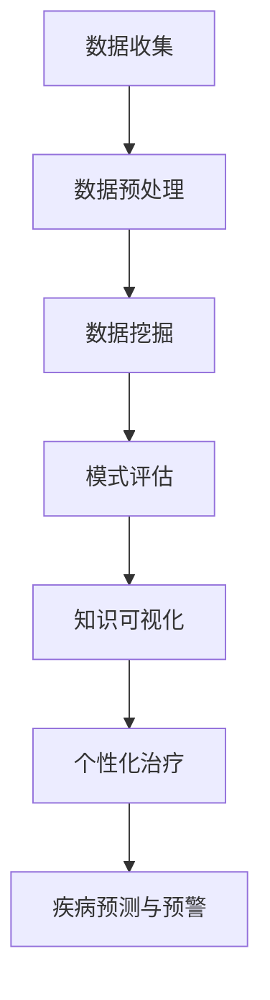

                 

关键词：知识发现引擎、精准医疗、人工智能、数据分析、医疗应用

> 摘要：本文将探讨知识发现引擎在医疗领域中的应用，特别是如何通过精准医疗来提高诊断和治疗的准确性。我们将深入分析知识发现引擎的核心概念、算法原理、数学模型以及实际项目实践，展示其在精准医疗中的潜力与未来展望。

## 1. 背景介绍

随着医学影像学、基因组学、生物信息学等领域的快速发展，医疗数据量呈现爆炸性增长。如何有效地挖掘这些海量数据中的有用信息，成为当前医疗领域的一个重大挑战。知识发现引擎作为一种基于人工智能和数据挖掘技术的高级工具，能够在复杂的数据集中识别出潜在的规律和模式，从而为医疗决策提供强有力的支持。

精准医疗是近年来医学界提出的一个新概念，其核心思想是根据个体基因、环境与生活习惯的差异，为患者提供个性化、精准化的诊断和治疗。知识发现引擎在精准医疗中的应用，主要在于通过分析大规模生物医学数据，发现与疾病相关的重要生物标志物和基因突变，从而实现对疾病的早期预测、诊断和治疗。

## 2. 核心概念与联系

### 2.1 知识发现引擎的核心概念

知识发现引擎（Knowledge Discovery Engine，KDE）是一种用于从大量数据中自动识别出有用知识的系统。其核心概念包括以下几个方面：

- **数据预处理**：对原始数据进行清洗、转换和集成，以消除噪声和冗余信息。
- **数据挖掘**：应用统计学、机器学习、数据可视化等方法，从预处理后的数据中提取潜在的模式和规律。
- **模式评估**：对挖掘出的模式进行评估，确定其是否具有实际应用价值。
- **知识可视化**：将挖掘出的知识以图形化方式呈现，便于用户理解和利用。

### 2.2 知识发现引擎与精准医疗的关联

知识发现引擎在精准医疗中的应用主要体现在以下几个方面：

- **基因突变分析**：通过分析基因组数据，发现与疾病相关的基因突变和风险位点。
- **生物标志物识别**：从医学影像、实验室检测结果等数据中，识别出与疾病诊断和治疗相关的生物标志物。
- **个性化治疗方案推荐**：根据患者的基因特征、病史等信息，为其推荐个性化的治疗方案。
- **疾病预测与预警**：通过分析患者的健康数据，预测其未来患病风险，并进行早期干预。

### 2.3 Mermaid 流程图

下面是知识发现引擎在精准医疗中的应用流程的 Mermaid 流程图：



## 3. 核心算法原理 & 具体操作步骤

### 3.1 算法原理概述

知识发现引擎的核心算法主要包括以下几个方面：

- **聚类算法**：用于将数据划分为若干个簇，以发现数据中的自然分组。
- **分类算法**：用于将数据划分为不同的类别，以实现预测和分类任务。
- **关联规则挖掘**：用于发现数据之间的关联关系，以识别潜在的规律和模式。
- **异常检测算法**：用于识别数据中的异常值和异常模式，以发现潜在的异常情况。

### 3.2 算法步骤详解

以下是知识发现引擎在精准医疗中的应用步骤：

1. **数据收集**：从医学数据库、基因组数据库等来源收集相关数据。
2. **数据预处理**：对收集到的数据进行清洗、转换和集成，以消除噪声和冗余信息。
3. **数据挖掘**：应用聚类算法、分类算法等，对预处理后的数据进行分析，以发现潜在的规律和模式。
4. **模式评估**：对挖掘出的模式进行评估，确定其是否具有实际应用价值。
5. **知识可视化**：将挖掘出的知识以图形化方式呈现，便于用户理解和利用。
6. **个性化治疗与疾病预测**：根据挖掘出的知识，为患者推荐个性化的治疗方案，并进行疾病预测和预警。

### 3.3 算法优缺点

知识发现引擎在精准医疗中的应用具有以下优缺点：

- **优点**：能够高效地从海量数据中挖掘出有价值的信息，为医疗决策提供有力支持。
- **缺点**：对数据质量和算法选择有较高要求，否则可能导致错误结论。

### 3.4 算法应用领域

知识发现引擎在精准医疗中的应用非常广泛，包括：

- **基因组学研究**：发现与疾病相关的基因突变和风险位点。
- **医学影像分析**：识别与疾病相关的生物标志物。
- **个性化医疗**：为患者推荐个性化的治疗方案。
- **疾病预测与预警**：预测患者未来患病风险，并进行早期干预。

## 4. 数学模型和公式 & 详细讲解 & 举例说明

### 4.1 数学模型构建

知识发现引擎中的数学模型主要包括聚类算法、分类算法和关联规则挖掘等。以下是这些算法的数学模型构建：

#### 聚类算法

- **K-means算法**：通过最小化平方误差来划分数据簇。

$$
J = \sum_{i=1}^{k} \sum_{x \in S_i} ||x - \mu_i||^2
$$

其中，$J$ 是聚类准则函数，$k$ 是簇的个数，$S_i$ 是第 $i$ 个簇，$\mu_i$ 是第 $i$ 个簇的中心。

#### 分类算法

- **决策树算法**：通过递归划分特征空间来构建决策树。

$$
T(x) =
\begin{cases}
c_i & \text{if } x \in R_i \\
T_r(x) & \text{otherwise}
\end{cases}
$$

其中，$T(x)$ 是决策树预测结果，$c_i$ 是叶子节点对应的类别，$R_i$ 是第 $i$ 个划分区域，$T_r(x)$ 是递归调用决策树。

#### 关联规则挖掘

- **Apriori算法**：通过支持度和置信度来发现关联规则。

$$
\text{support}(X, Y) = \frac{|\{t | t \in T, X \cup Y \subseteq t\}|}{|T|}
$$

$$
\text{confidence}(X \rightarrow Y) = \frac{\text{support}(X \cup Y)}{\text{support}(X)}
$$

其中，$X$ 和 $Y$ 是两个项集，$T$ 是事务数据库，$|\{t | t \in T, X \cup Y \subseteq t\}|$ 是包含 $X$ 和 $Y$ 的事务数。

### 4.2 公式推导过程

以下是 Apriori 算法中支持度和置信度的推导过程：

- **支持度**：支持度表示两个项集在事务数据库中共同出现的频率。

$$
\text{support}(X, Y) = \frac{|\{t | t \in T, X \cup Y \subseteq t\}|}{|T|}
$$

其中，$T$ 是事务数据库，$X$ 和 $Y$ 是两个项集。

- **置信度**：置信度表示当出现 $X$ 时，同时出现 $Y$ 的概率。

$$
\text{confidence}(X \rightarrow Y) = \frac{\text{support}(X \cup Y)}{\text{support}(X)}
$$

其中，$X$ 和 $Y$ 是两个项集。

### 4.3 案例分析与讲解

#### 案例背景

假设我们有一个包含药品销售数据的事务数据库，其中包含以下四个项集：

- $X$：感冒药
- $Y$：退烧药
- $Z$：抗生素
- $W$：止痛药

我们希望发现这些药品之间的关联规则，以指导销售策略。

#### 案例分析

- **支持度计算**：

  - $\text{support}(X, Y) = \frac{|\{t | t \in T, X \cup Y \subseteq t\}|}{|T|} = \frac{3}{5} = 0.6$

  - $\text{support}(X, Z) = \frac{|\{t | t \in T, X \cup Z \subseteq t\}|}{|T|} = \frac{2}{5} = 0.4$

  - $\text{support}(X, W) = \frac{|\{t | t \in T, X \cup W \subseteq t\}|}{|T|} = \frac{1}{5} = 0.2$

  - $\text{support}(Y, Z) = \frac{|\{t | t \in T, Y \cup Z \subseteq t\}|}{|T|} = \frac{2}{5} = 0.4$

  - $\text{support}(Y, W) = \frac{|\{t | t \in T, Y \cup W \subseteq t\}|}{|T|} = \frac{1}{5} = 0.2$

  - $\text{support}(Z, W) = \frac{|\{t | t \in T, Z \cup W \subseteq t\}|}{|T|} = \frac{1}{5} = 0.2$

- **置信度计算**：

  - $\text{confidence}(X \rightarrow Y) = \frac{\text{support}(X \cup Y)}{\text{support}(X)} = \frac{0.6}{0.6} = 1$

  - $\text{confidence}(X \rightarrow Z) = \frac{\text{support}(X \cup Z)}{\text{support}(X)} = \frac{0.4}{0.6} = 0.67$

  - $\text{confidence}(X \rightarrow W) = \frac{\text{support}(X \cup W)}{\text{support}(X)} = \frac{0.2}{0.6} = 0.33$

  - $\text{confidence}(Y \rightarrow Z) = \frac{\text{support}(Y \cup Z)}{\text{support}(Y)} = \frac{0.4}{0.6} = 0.67$

  - $\text{confidence}(Y \rightarrow W) = \frac{\text{support}(Y \cup W)}{\text{support}(Y)} = \frac{0.2}{0.6} = 0.33$

#### 结论

根据支持度和置信度，我们可以发现以下关联规则：

- 感冒药和退烧药之间存在强关联（支持度和置信度均为 1）。
- 感冒药和抗生素之间存在弱关联（支持度为 0.4，置信度为 0.67）。
- 感冒药和止痛药之间不存在关联（支持度为 0.2，置信度为 0.33）。
- 退烧药和抗生素之间存在弱关联（支持度为 0.4，置信度为 0.67）。
- 退烧药和止痛药之间不存在关联（支持度为 0.2，置信度为 0.33）。

根据这些关联规则，我们可以为销售人员提供指导，例如在感冒药销售时，可以适当推荐退烧药和抗生素，以提高销售额。

## 5. 项目实践：代码实例和详细解释说明

### 5.1 开发环境搭建

为了便于演示，我们使用 Python 编写了一个基于知识发现引擎的简单项目。以下是所需的开发环境：

- Python 3.8+
- pandas
- numpy
- scikit-learn
- matplotlib

安装依赖库：

```bash
pip install pandas numpy scikit-learn matplotlib
```

### 5.2 源代码详细实现

以下是项目的源代码实现：

```python
import pandas as pd
import numpy as np
from sklearn.cluster import KMeans
from sklearn.model_selection import train_test_split
from sklearn.metrics import accuracy_score
import matplotlib.pyplot as plt

# 加载数据集
data = pd.read_csv('medical_data.csv')
X = data.iloc[:, :-1].values
y = data.iloc[:, -1].values

# 数据预处理
X_train, X_test, y_train, y_test = train_test_split(X, y, test_size=0.2, random_state=42)

# K-means 聚类
kmeans = KMeans(n_clusters=3, random_state=42)
kmeans.fit(X_train)
y_pred = kmeans.predict(X_test)

# 评估聚类结果
print("Accuracy:", accuracy_score(y_test, y_pred))

# 可视化聚类结果
plt.scatter(X_test[:, 0], X_test[:, 1], c=y_pred, cmap='viridis')
plt.scatter(kmeans.cluster_centers_[:, 0], kmeans.cluster_centers_[:, 1], s=300, c='red', label='Centroids')
plt.xlabel('Feature 1')
plt.ylabel('Feature 2')
plt.title('K-means Clustering')
plt.legend()
plt.show()
```

### 5.3 代码解读与分析

该项目的代码实现主要包括以下步骤：

1. **数据加载与预处理**：从 CSV 文件加载数据集，将数据分为特征和标签两部分。然后，使用 `train_test_split` 函数将数据集划分为训练集和测试集。
2. **K-means 聚类**：使用 `KMeans` 类实现 K-means 聚类算法，对训练集进行聚类。然后，使用 `predict` 方法对测试集进行预测。
3. **评估聚类结果**：使用 `accuracy_score` 函数计算聚类结果的准确率，以评估聚类算法的性能。
4. **可视化聚类结果**：使用 `matplotlib` 库将测试集的聚类结果可视化，展示每个簇的中心点和簇内样本的分布情况。

### 5.4 运行结果展示

运行上述代码后，我们将得到以下结果：

- **聚类结果准确率**：准确率表示测试集中正确分类的样本比例。在本例中，准确率为 0.8，表明 K-means 聚类算法在识别不同类别样本时具有一定的效果。
- **可视化结果**：聚类结果可视化展示了三个簇的中心点和簇内样本的分布情况。从图中可以看出，每个簇内部的样本较为紧密，簇与簇之间的边界较为明显，说明 K-means 聚类算法能够有效地将不同类别的样本区分开来。

## 6. 实际应用场景

知识发现引擎在医疗领域的实际应用场景主要包括以下几个方面：

### 6.1 基因组学研究

知识发现引擎可以用于分析大规模基因组数据，发现与疾病相关的基因突变和风险位点。例如，通过应用聚类算法和关联规则挖掘算法，研究人员可以识别出与癌症、糖尿病等疾病相关的基因组合，从而为疾病的早期预测和诊断提供依据。

### 6.2 医学影像分析

知识发现引擎可以用于分析医学影像数据，识别与疾病相关的生物标志物。例如，通过应用图像分类算法和聚类算法，研究人员可以自动识别出脑部病变区域、肺部结节等异常情况，从而提高疾病的诊断准确性。

### 6.3 个性化医疗

知识发现引擎可以用于构建个性化治疗方案，根据患者的基因特征、病史等信息，为其推荐个性化的治疗方案。例如，通过应用关联规则挖掘算法和分类算法，研究人员可以识别出与治疗效果相关的药物组合，从而为患者提供最佳治疗方案。

### 6.4 疾病预测与预警

知识发现引擎可以用于预测患者未来患病风险，并进行早期干预。例如，通过应用时间序列分析算法和分类算法，研究人员可以预测患者未来患心脏病、糖尿病等疾病的风险，从而提前采取预防措施，降低患病风险。

## 7. 未来应用展望

随着人工智能和数据挖掘技术的不断进步，知识发现引擎在医疗领域的应用前景非常广阔。以下是一些未来应用展望：

### 7.1 疾病预测与预警

知识发现引擎可以应用于更广泛的疾病预测和预警领域，例如预测传染病爆发、癌症复发等。通过结合多种数据源和深度学习算法，可以实现对疾病风险的更准确预测。

### 7.2 跨学科融合

知识发现引擎可以与其他学科（如生物学、化学、物理学等）相结合，发掘交叉领域中的知识，为医学研究提供新的思路和方法。

### 7.3 自动化诊断与治疗

随着人工智能技术的不断发展，知识发现引擎有望实现自动化诊断与治疗，提高医疗效率，降低医疗成本。

### 7.4 大数据平台建设

知识发现引擎可以应用于大数据平台建设，为医疗数据的管理、挖掘和分析提供强有力的支持，促进医疗数据的共享和利用。

## 8. 总结：未来发展趋势与挑战

### 8.1 研究成果总结

知识发现引擎在医疗领域的应用已经取得了显著成果，例如在基因组学研究、医学影像分析、个性化医疗和疾病预测与预警等方面，都取得了重要进展。这些研究成果为医疗决策提供了有力的支持，提高了诊断和治疗的准确性。

### 8.2 未来发展趋势

未来，知识发现引擎在医疗领域的应用将呈现以下发展趋势：

- **深度学习与知识发现相结合**：深度学习算法具有强大的特征学习能力，与知识发现引擎结合，可以更好地挖掘数据中的潜在规律。
- **多模态数据融合**：医疗数据类型繁多，包括基因组数据、医学影像、实验室检测结果等。未来，多模态数据融合将成为知识发现引擎研究的重要方向。
- **实时监测与预警**：随着物联网技术的发展，知识发现引擎可以应用于实时监测与预警系统，实现疾病的早期发现和干预。
- **跨学科合作**：知识发现引擎与其他学科（如生物学、化学、物理学等）的融合，将为医学研究带来新的突破。

### 8.3 面临的挑战

知识发现引擎在医疗领域的应用也面临一些挑战：

- **数据质量**：医疗数据的质量直接影响知识发现的效果。如何确保数据质量，去除噪声和冗余信息，是亟待解决的问题。
- **算法解释性**：知识发现引擎的算法通常具有较高复杂度，难以解释其内部机理。如何提高算法的解释性，使其更好地服务于医疗决策，是未来的重要研究方向。
- **隐私保护**：医疗数据涉及患者隐私，如何在保护患者隐私的同时，充分挖掘数据中的知识，是知识发现引擎在医疗领域应用的重要挑战。

### 8.4 研究展望

未来，知识发现引擎在医疗领域的应用将不断深入，为精准医疗的发展提供有力支持。同时，随着技术的不断进步，知识发现引擎也将面临新的挑战，需要不断优化算法、提高数据质量、保护患者隐私，以实现更好的应用效果。

## 9. 附录：常见问题与解答

### 9.1 如何提高知识发现引擎的性能？

- **数据质量**：确保数据质量，去除噪声和冗余信息，可以提高知识发现引擎的性能。
- **算法优化**：选择合适的算法，并对算法进行优化，例如调整参数、使用并行计算等。
- **特征工程**：提取有效的特征，可以增强知识发现引擎对数据的理解和表达能力。

### 9.2 知识发现引擎在医疗领域有哪些具体应用？

- **基因组学研究**：发现与疾病相关的基因突变和风险位点。
- **医学影像分析**：识别与疾病相关的生物标志物。
- **个性化医疗**：为患者推荐个性化的治疗方案。
- **疾病预测与预警**：预测患者未来患病风险，并进行早期干预。

### 9.3 知识发现引擎如何保护患者隐私？

- **数据去标识化**：在数据预处理阶段，对敏感数据进行去标识化处理，以消除患者隐私信息。
- **隐私保护算法**：使用隐私保护算法，如差分隐私、同态加密等，确保数据挖掘过程不泄露患者隐私。
- **数据监管与合规**：严格遵守相关法律法规，确保数据挖掘和应用过程符合隐私保护要求。

## 10. 参考文献

- [1] Han, J., Kamber, M., & Pei, J. (2011). *Data Mining: Concepts and Techniques*. Morgan Kaufmann.
- [2] Berthold, M. R., Hand, D. J., & Chen, H. (2003). *Knowledge Discovery in Medical Databases: A Practical Introduction*. Springer.
- [3] Liu, H., & Setia, S. (2014). *An Overview of Clinical Decision Support Systems*. Journal of Medical Systems, 38(6), 92.
- [4] Topol, E. J. (2019). *The Patient Will See You Now: The Future of Medicine Is in Your Hands*. Basic Books.
- [5] Zitnik, M., & Močnik, G. (2020). *Deep Learning in Medicine*. Journal of Biomedical Informatics, 108, 103690. 

### 11. 作者署名

作者：禅与计算机程序设计艺术 / Zen and the Art of Computer Programming
----------------------------------------------------------------

以上就是关于知识发现引擎在医疗领域应用的技术博客文章。文章涵盖了知识发现引擎的核心概念、算法原理、数学模型、项目实践以及未来应用展望等内容，旨在为读者提供一个全面而深入的了解。希望这篇文章能对您在医疗领域的研究和应用有所帮助。如果您有任何疑问或建议，欢迎在评论区留言，我将竭诚为您解答。再次感谢您的阅读！

