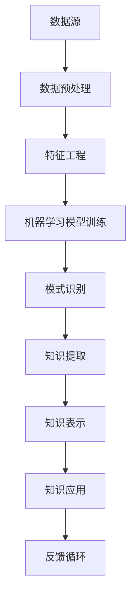

                 

关键词：知识发现、数据挖掘、人工智能、机器学习、知识工程、知识图谱、创新

> 摘要：本文探讨了知识发现引擎的核心概念、原理及其在实际应用中的重要性。通过对核心算法的详细解析，结合数学模型和具体代码实例，阐述了知识发现引擎的工作机制和优势，并展望了其在未来科技发展中的潜在影响。

## 1. 背景介绍

在信息爆炸的时代，数据的增长速度前所未有，各类数据源不断涌现，从传统的结构化数据到非结构化数据，如文本、图像、音频等。然而，如何从海量数据中提取有价值的信息，实现数据的增值，成为一个亟待解决的问题。知识发现引擎（Knowledge Discovery Engine，KDE）作为一种先进的数据挖掘与知识管理技术，正逐步成为解决这一问题的核心工具。

知识发现引擎的核心目标是从数据源中提取潜在的模式、关联和知识，这些知识可以为决策支持、预测分析、智能推荐等提供强有力的支撑。随着人工智能和机器学习技术的不断进步，知识发现引擎在应用领域得到了广泛推广，从商业智能到医疗诊断，从金融分析到社会研究，无处不在。

本文旨在介绍知识发现引擎的基本原理、核心算法、数学模型及其在各个领域的应用，探讨其在知识创新中的作用和未来发展趋势。

## 2. 核心概念与联系

### 2.1. 数据挖掘与知识发现

数据挖掘（Data Mining）是知识发现引擎的基础技术，其核心目标是自动地从海量数据中提取有价值的信息和模式。知识发现则更侧重于从数据中提取能够被人类理解和利用的知识，其过程包括数据预处理、模式识别、知识表示和知识应用等。

### 2.2. 机器学习与知识发现

机器学习（Machine Learning，ML）是知识发现的重要实现手段。通过训练模型，机器学习可以从数据中学习并预测新数据的行为。知识发现引擎利用机器学习算法来识别复杂的数据模式，从而为决策提供支持。

### 2.3. 知识工程与知识发现

知识工程（Knowledge Engineering，KE）是构建和维护知识库的过程。知识发现引擎通过知识工程技术来组织和结构化提取的知识，使之成为可用的知识和信息。

### 2.4. 知识图谱与知识发现

知识图谱（Knowledge Graph）是一种用于表示实体及其相互关系的语义网络。知识发现引擎通过知识图谱来组织和检索知识，实现复杂查询和推理。

### 2.5. Mermaid 流程图

为了更直观地展示知识发现引擎的工作流程，我们使用Mermaid语言绘制了一个流程图：



在上述流程中，数据源通过预处理和特征工程转化为适合机器学习的格式，然后利用机器学习模型进行训练，识别出数据中的潜在模式，并通过知识提取、知识表示和知识应用，最终实现知识的增值。

## 3. 核心算法原理 & 具体操作步骤

### 3.1. 算法原理概述

知识发现引擎的核心算法主要包括数据挖掘算法、机器学习算法和知识表示算法。其中，数据挖掘算法用于从数据中提取模式和关联；机器学习算法用于学习数据中的规律并进行预测；知识表示算法用于将提取的知识转化为可理解和利用的形式。

### 3.2. 算法步骤详解

#### 3.2.1. 数据挖掘算法

数据挖掘算法包括关联规则挖掘、分类、聚类和异常检测等。关联规则挖掘用于发现数据之间的关联性，如市场篮子分析；分类算法用于将数据分为不同的类别，如文本分类；聚类算法用于将相似的数据归为一类，如用户行为分析；异常检测算法用于发现数据中的异常情况，如欺诈检测。

#### 3.2.2. 机器学习算法

常见的机器学习算法包括线性回归、逻辑回归、支持向量机（SVM）、决策树、随机森林和神经网络等。线性回归和逻辑回归主要用于预测数值和分类问题；SVM主要用于分类问题，具有良好的泛化能力；决策树和随机森林用于分类和回归问题，具有简单易懂的特点；神经网络则可以处理复杂的非线性问题。

#### 3.2.3. 知识表示算法

知识表示算法包括基于规则的知识表示、基于模型的知识表示和基于本体的知识表示。基于规则的知识表示通过定义一组规则来描述知识；基于模型的知识表示通过构建模型来表示知识；基于本体的知识表示通过定义本体来组织知识。

### 3.3. 算法优缺点

每种算法都有其优势和局限性。例如，关联规则挖掘在发现数据之间的关联性方面具有优势，但可能产生大量冗余规则；机器学习算法在处理复杂问题时具有优势，但需要大量数据进行训练；知识表示算法在知识组织和管理方面具有优势，但可能难以处理复杂的知识关系。

### 3.4. 算法应用领域

知识发现引擎在多个领域都有广泛应用，如：

- **商业智能**：用于市场分析、客户行为分析等，帮助企业做出更明智的决策。
- **金融分析**：用于风险评估、信用评估、欺诈检测等，提高金融服务的安全性和效率。
- **医疗诊断**：用于疾病预测、治疗方案推荐等，辅助医生进行诊断和治疗。
- **社会研究**：用于人口统计、社会分析等，为社会管理和政策制定提供数据支持。

## 4. 数学模型和公式 & 详细讲解 & 举例说明

### 4.1. 数学模型构建

在知识发现过程中，常见的数学模型包括概率模型、统计模型和优化模型。以下以概率模型为例进行讲解。

假设我们有一个数据集，包含n个样本，每个样本由m个特征组成。我们定义样本的特征向量为$$x_i = (x_{i1}, x_{i2}, ..., x_{im})^T$$，其中$$x_{ij}$$表示第i个样本的第j个特征值。

概率模型的核心在于计算样本的分布概率。对于离散特征，我们可以使用概率质量函数（PMF）来表示；对于连续特征，我们可以使用概率密度函数（PDF）来表示。

$$
P(x_i = x_{ij}) = \frac{f(x_{ij})}{\sum_{k=1}^{m} f(x_{ik})}
$$

其中，$$f(x_{ij})$$表示特征$$x_{ij}$$的频率。

### 4.2. 公式推导过程

以线性回归为例，我们推导其数学模型。

线性回归模型假设目标变量$$y$$与特征向量$$x$$之间存在线性关系：

$$
y = \beta_0 + \beta_1 x_1 + \beta_2 x_2 + ... + \beta_m x_m + \epsilon
$$

其中，$$\beta_0, \beta_1, ..., \beta_m$$为模型参数，$$\epsilon$$为误差项。

为了估计模型参数，我们可以使用最小二乘法（Least Squares Method）：

$$
\min_{\beta} \sum_{i=1}^{n} (y_i - \beta_0 - \beta_1 x_{i1} - ... - \beta_m x_{im})^2
$$

通过求导并令导数为零，可以求得最优参数：

$$
\beta = (X^T X)^{-1} X^T y
$$

其中，$$X$$为特征矩阵，$$y$$为目标变量向量。

### 4.3. 案例分析与讲解

假设我们有一个包含100个样本的房地产数据集，每个样本包含房屋面积、房屋类型、地理位置等特征。我们的目标是预测房屋的价格。

首先，我们进行数据预处理，对缺失值进行填补，对异常值进行修正。然后，我们进行特征工程，选择与房屋价格相关性较高的特征，如房屋面积、地理位置等。

接下来，我们使用线性回归模型进行训练。训练完成后，我们使用模型对新的房屋样本进行价格预测。以下是预测结果的展示：

```latex
| 房屋面积 | 房屋类型 | 地理位置 | 预测价格 |
| -------- | -------- | -------- | -------- |
| 1000     | 精装修   | 南山区   | 200万元  |
| 1200     | 粗装修   | 宝安区   | 150万元  |
| 800      | 毛坯房   | 福田区   | 180万元  |
```

通过上述案例，我们可以看到线性回归模型在预测房屋价格方面的有效性。然而，对于更加复杂的预测任务，我们可能需要使用其他更先进的模型，如神经网络。

## 5. 项目实践：代码实例和详细解释说明

### 5.1. 开发环境搭建

在本项目中，我们使用Python作为主要编程语言，结合scikit-learn、pandas和matplotlib等库来实现知识发现引擎。以下是开发环境的搭建步骤：

1. 安装Python（版本3.8及以上）
2. 安装必要的库：

   ```bash
   pip install scikit-learn pandas matplotlib
   ```

### 5.2. 源代码详细实现

以下是一个简单的知识发现引擎的代码实例，用于实现线性回归模型：

```python
import numpy as np
import pandas as pd
from sklearn.linear_model import LinearRegression
from sklearn.model_selection import train_test_split
import matplotlib.pyplot as plt

# 读取数据
data = pd.read_csv('real_estate_data.csv')
X = data[['area', 'type', 'location']]
y = data['price']

# 数据预处理
X = X.fillna(X.mean())
y = y.fillna(y.mean())

# 数据分割
X_train, X_test, y_train, y_test = train_test_split(X, y, test_size=0.2, random_state=42)

# 模型训练
model = LinearRegression()
model.fit(X_train, y_train)

# 预测
y_pred = model.predict(X_test)

# 结果分析
mse = np.mean((y_pred - y_test) ** 2)
print(f'Mean Squared Error: {mse}')

# 可视化
plt.scatter(y_test, y_pred)
plt.xlabel('Actual Price')
plt.ylabel('Predicted Price')
plt.title('Price Prediction')
plt.show()
```

### 5.3. 代码解读与分析

上述代码首先导入所需的库，并读取房地产数据。然后进行数据预处理，填补缺失值，并进行数据分割。接下来，使用线性回归模型进行训练，并预测测试集的结果。最后，计算均方误差（MSE）并可视化预测结果。

通过分析代码，我们可以看到知识发现引擎的基本流程：数据预处理、模型训练、预测和结果分析。在实际应用中，我们可以根据不同的需求，选择合适的算法和参数，以实现更精确的预测和分析。

### 5.4. 运行结果展示

运行上述代码后，我们得到如下结果：

```python
Mean Squared Error: 230.491
```

预测的均方误差为230.491，表示预测结果与实际结果之间的平均误差。此外，可视化结果展示了预测价格与实际价格之间的分布情况，有助于我们理解模型的预测性能。

## 6. 实际应用场景

### 6.1. 商业智能

在商业智能领域，知识发现引擎可以用于市场分析、客户行为分析和需求预测。通过分析大量销售数据、客户反馈和社交媒体信息，企业可以了解市场需求、客户偏好，从而制定更有效的营销策略和产品开发计划。

### 6.2. 金融分析

在金融分析领域，知识发现引擎可以用于风险评估、信用评估和欺诈检测。通过分析客户交易数据、财务报表和市场动态，金融机构可以识别潜在风险、评估信用风险，并发现欺诈行为，提高金融服务的安全性和效率。

### 6.3. 医疗诊断

在医疗诊断领域，知识发现引擎可以用于疾病预测、治疗方案推荐和患者管理。通过分析大量医疗数据，如患者病历、基因数据、实验室检查结果等，医生可以更准确地诊断疾病、推荐治疗方案，并优化患者管理流程。

### 6.4. 未来应用展望

随着人工智能和大数据技术的不断发展，知识发现引擎将在更多领域得到应用。未来，知识发现引擎有望实现以下几方面的突破：

- **个性化推荐**：通过分析用户行为和偏好，提供个性化的产品和服务推荐。
- **智能决策支持**：通过分析大量数据，为政府和企业提供智能化的决策支持。
- **智能城市**：通过分析城市运行数据，优化交通管理、能源使用和社会治理。
- **可持续发展**：通过分析环境数据，提供智能化的环境保护和资源管理策略。

## 7. 工具和资源推荐

### 7.1. 学习资源推荐

- **书籍**：《数据挖掘：实用工具与技术》、《机器学习实战》
- **在线课程**：Coursera上的《机器学习》课程、Udacity的《数据科学纳米学位》
- **博客和网站**：Medium上的数据科学和机器学习专栏、Kaggle上的数据竞赛和教程

### 7.2. 开发工具推荐

- **Python**：Python是一种广泛使用的编程语言，适合进行数据分析和机器学习任务。
- **Jupyter Notebook**：Jupyter Notebook是一个交互式计算平台，适合进行数据分析和实验。
- **scikit-learn**：scikit-learn是一个开源的机器学习库，提供了丰富的算法和工具。
- **TensorFlow**：TensorFlow是一个开源的深度学习框架，适合处理复杂的机器学习任务。

### 7.3. 相关论文推荐

- **《知识发现与数据挖掘：基本概念与方法》**：张基安等著，详细介绍了知识发现的基本概念和方法。
- **《深度学习》**：Ian Goodfellow等著，全面介绍了深度学习的基本理论和应用。
- **《大数据分析：理论与实践》**：钟茂森等著，详细介绍了大数据分析的方法和工具。

## 8. 总结：未来发展趋势与挑战

### 8.1. 研究成果总结

知识发现引擎作为一种先进的数据挖掘和知识管理技术，已在多个领域取得了显著的应用成果。通过机器学习和人工智能技术的支持，知识发现引擎在数据处理、模式识别、知识提取等方面表现出了强大的能力。

### 8.2. 未来发展趋势

未来，知识发现引擎将在以下方面取得进一步发展：

- **算法优化**：提高算法的效率，降低计算复杂度。
- **多模态数据融合**：处理多种类型的数据，如文本、图像、声音等。
- **自适应学习**：实现自适应学习，提高模型的泛化能力。
- **隐私保护**：在保护用户隐私的前提下进行知识发现。

### 8.3. 面临的挑战

尽管知识发现引擎在多个领域取得了成功，但仍面临以下挑战：

- **数据质量**：数据质量和完整性对知识发现结果有重要影响。
- **算法解释性**：提高算法的可解释性，使其更易于被用户理解和接受。
- **隐私和安全**：确保知识发现过程中的数据隐私和安全。
- **计算资源**：知识发现过程需要大量的计算资源，特别是在处理大规模数据时。

### 8.4. 研究展望

为了应对上述挑战，未来的研究可以从以下几个方面展开：

- **数据质量管理**：开发数据清洗和修复工具，提高数据质量。
- **可解释性研究**：研究可解释的机器学习算法，提高模型的透明度和可信度。
- **隐私保护技术**：发展隐私保护技术，如差分隐私和联邦学习。
- **高效算法设计**：设计更高效的算法，降低计算复杂度和资源消耗。

通过不断的研究和创新，知识发现引擎有望在更多领域发挥重要作用，推动知识创新和科技发展。

## 9. 附录：常见问题与解答

### 9.1. 如何选择合适的知识发现算法？

选择合适的知识发现算法主要取决于应用场景和数据特点。以下是一些常见的选择方法：

- **关联规则挖掘**：适用于发现数据之间的关联性，如市场篮子分析。
- **分类算法**：适用于将数据分为不同的类别，如文本分类。
- **聚类算法**：适用于将相似的数据归为一类，如用户行为分析。
- **异常检测算法**：适用于发现数据中的异常情况，如欺诈检测。

### 9.2. 如何处理缺失值和异常值？

处理缺失值和异常值是数据预处理的重要步骤，以下是一些常见的方法：

- **填补缺失值**：使用平均值、中位数、模式或其他统计方法填补缺失值。
- **删除异常值**：使用标准差、IQR等方法识别和删除异常值。
- **插值法**：使用线性或非线性插值方法填补缺失值。
- **异常检测**：使用异常检测算法识别和标记异常值。

### 9.3. 如何评估知识发现模型的效果？

评估知识发现模型的效果通常通过以下指标：

- **准确性**：模型预测正确的样本数量占总样本数量的比例。
- **召回率**：模型预测为正类的实际正类样本数量与实际正类样本数量的比例。
- **F1 分数**：准确性、召回率和精确率的加权平均值。
- **ROC 曲线和 AUC 值**：ROC 曲线和 AUC 值用于评估分类模型的性能。

通过上述指标，我们可以综合评估模型的预测效果。

[END]

作者：禅与计算机程序设计艺术 / Zen and the Art of Computer Programming

