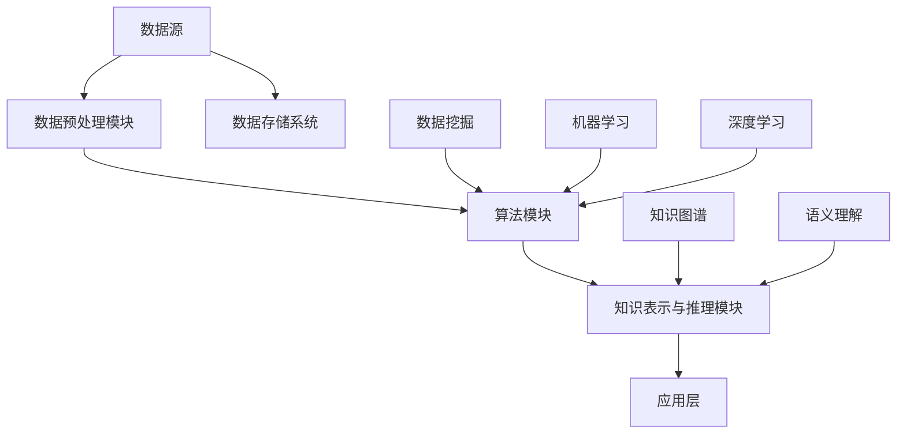

                 

关键词：知识发现，人工智能，知识图谱，语义理解，深度学习，机器学习，数据挖掘，知识融合，知识表示，信息检索

> 摘要：本文旨在探讨知识发现引擎在人工智能领域的应用，通过剖析其核心概念、算法原理、数学模型、项目实践以及实际应用场景，深入挖掘知识发现引擎在探索人类知识本质方面的巨大潜力和挑战。

## 1. 背景介绍

随着互联网和信息技术的飞速发展，人类已经进入了大数据时代。海量信息的积累使得知识的获取、管理和应用变得日益复杂。传统的信息检索方法已经无法满足人们对于知识获取的高效性和准确性的需求。因此，知识发现引擎作为一种新兴的人工智能技术，逐渐成为学术界和工业界的研究热点。知识发现引擎旨在通过自动化的方式，从大规模数据中识别出潜在的模式、关联和知识，为人类提供更加智能化的信息服务。

知识发现引擎的研究和应用涵盖了多个领域，包括计算机科学、信息科学、统计学和人工智能等。其在各个领域的应用价值也逐渐得到认可。例如，在商业领域，知识发现引擎可以帮助企业挖掘市场趋势、客户需求和竞争对手信息，从而制定更加科学的商业决策。在科学研究领域，知识发现引擎可以辅助科学家发现新的科学规律和研究成果，提高科学研究的效率和准确性。

本文将围绕知识发现引擎的核心概念、算法原理、数学模型、项目实践和实际应用场景等方面进行深入探讨，旨在为读者提供一个全面、系统的知识发现引擎的概述，并探讨其在探索人类知识本质方面的作用和挑战。

## 2. 核心概念与联系

### 2.1 知识发现引擎的定义

知识发现引擎（Knowledge Discovery Engine，KDE）是一种自动化地从大规模数据中挖掘潜在模式和知识的人工智能系统。它通过结合数据挖掘、机器学习和深度学习等技术，实现数据的预处理、模式识别、关联规则挖掘、聚类分析、分类预测等功能，从而为用户提供个性化的知识服务。

### 2.2 知识发现引擎的关键组成部分

知识发现引擎主要由以下四个关键组成部分构成：

- 数据源（Data Source）：提供数据输入，可以是结构化数据（如关系数据库）、半结构化数据（如XML、JSON）或非结构化数据（如文本、图像、音频）。
- 数据预处理模块（Data Preprocessing Module）：对原始数据进行清洗、去重、格式转换等处理，确保数据的质量和一致性。
- 算法模块（Algorithm Module）：包含多种数据挖掘和机器学习算法，用于挖掘数据中的潜在模式和知识。
- 知识表示与推理模块（Knowledge Representation and Reasoning Module）：将挖掘出的知识以图形、表格、文本等多种形式进行表示，并利用推理技术进行知识的扩展和验证。

### 2.3 知识发现引擎的架构

知识发现引擎的架构可以划分为三层，即数据层、算法层和应用层。

- **数据层**：负责数据的采集、存储和管理，包括数据源、数据预处理模块和数据存储系统。
- **算法层**：包含各种数据挖掘和机器学习算法，如聚类、分类、关联规则挖掘、异常检测等。
- **应用层**：将挖掘出的知识应用于实际场景，提供知识服务，如信息检索、推荐系统、智能问答等。

### 2.4 知识发现引擎与相关技术的联系

知识发现引擎与多种相关技术密切相关，包括：

- **数据挖掘（Data Mining）**：知识发现的核心技术，旨在从大规模数据中提取潜在的模式、关联和知识。
- **机器学习（Machine Learning）**：知识发现引擎中常用的技术之一，通过训练模型来发现数据中的规律。
- **深度学习（Deep Learning）**：基于人工神经网络的机器学习技术，能够在复杂的数据中实现高度自动化的特征学习和模式识别。
- **知识图谱（Knowledge Graph）**：一种用于表示实体、关系和属性的数据结构，能够为知识发现提供强有力的支持。
- **语义理解（Semantic Understanding）**：通过理解和解析自然语言，实现知识的自动获取和推理。

### 2.5 核心概念原理和架构的 Mermaid 流程图



## 3. 核心算法原理 & 具体操作步骤

### 3.1 算法原理概述

知识发现引擎的核心算法主要包括以下几种：

- **聚类算法（Clustering Algorithm）**：将数据集划分为若干个类别，使得同一类别内的数据点尽可能接近，而不同类别之间的数据点尽可能远离。常用的聚类算法有K-means、DBSCAN等。
- **分类算法（Classification Algorithm）**：根据已有数据，将新的数据点划分为不同的类别。常用的分类算法有决策树、随机森林、支持向量机等。
- **关联规则挖掘（Association Rule Mining）**：发现数据集中的关联关系，如购物篮分析。常用的算法有Apriori、FP-growth等。
- **异常检测（Anomaly Detection）**：识别数据集中的异常点或异常模式。常用的算法有孤立森林、洛伦兹曲线等。
- **图论算法（Graph Theory Algorithm）**：用于处理图结构的数据，如网络分析、社交网络挖掘等。常用的算法有最短路径、社区检测等。

### 3.2 算法步骤详解

以K-means聚类算法为例，详细描述其操作步骤：

1. **初始化**：随机选择K个数据点作为初始聚类中心。
2. **分配数据点**：计算每个数据点到聚类中心的距离，将数据点分配到距离最近的聚类中心所在的类别。
3. **更新聚类中心**：重新计算每个类别的聚类中心。
4. **迭代**：重复步骤2和步骤3，直到聚类中心不再发生显著变化或达到预设的迭代次数。

### 3.3 算法优缺点

- **聚类算法**：优点在于其简单高效，能够快速发现数据的分布特征；缺点在于对初始聚类中心敏感，可能陷入局部最优。
- **分类算法**：优点在于其能够对新的数据点进行准确的分类；缺点在于训练过程较为复杂，需要大量计算资源。
- **关联规则挖掘**：优点在于能够发现数据中的隐含关联关系；缺点在于生成的规则可能过多，需要进一步筛选。
- **异常检测**：优点在于能够识别数据中的异常点；缺点在于对异常点的定义和度量较为困难。
- **图论算法**：优点在于能够处理复杂的关系网络；缺点在于计算复杂度较高，对数据规模有较高要求。

### 3.4 算法应用领域

知识发现引擎的核心算法在多个领域具有广泛的应用：

- **商业领域**：市场趋势分析、客户行为分析、供应链优化、风险控制等。
- **科学研究**：生物信息学、社会科学、物理化学等领域的模式识别和数据分析。
- **社会管理**：公共安全、环境保护、智能交通等领域的异常检测和预测。
- **互联网**：搜索引擎、推荐系统、社交媒体分析等。

## 4. 数学模型和公式 & 详细讲解 & 举例说明

### 4.1 数学模型构建

知识发现引擎中的数学模型主要包括以下几种：

- **聚类模型**：基于距离度量，将数据点划分为若干个类别。常用的距离度量有欧几里得距离、曼哈顿距离、切比雪夫距离等。
- **分类模型**：基于特征空间的划分，将数据点划分为不同的类别。常用的分类模型有决策树、支持向量机、神经网络等。
- **关联规则挖掘模型**：基于支持度和置信度的度量，发现数据集中的关联关系。常用的关联规则挖掘模型有Apriori、FP-growth等。
- **异常检测模型**：基于概率分布或聚类模型的异常点识别。常用的异常检测模型有孤立森林、洛伦兹曲线等。

### 4.2 公式推导过程

以K-means聚类算法为例，介绍其数学模型的推导过程：

1. **目标函数**：最小化每个数据点到其所属聚类中心的距离平方和。
   $$ J = \sum_{i=1}^{n} \sum_{j=1}^{k} (x_i - \mu_j)^2 $$
   其中，\( x_i \) 为第 \( i \) 个数据点，\( \mu_j \) 为第 \( j \) 个聚类中心。

2. **初始化聚类中心**：随机选择K个数据点作为初始聚类中心。
   $$ \mu_j = x_{i_j} $$
   其中，\( i_j \) 为随机选择的第 \( j \) 个数据点的索引。

3. **分配数据点**：计算每个数据点到聚类中心的距离，将数据点分配到距离最近的聚类中心。
   $$ c_{ij} = \begin{cases} 
   1 & \text{if } \min_{j'} d(x_i, \mu_{j'}) = d(x_i, \mu_j) \\
   0 & \text{otherwise} 
   \end{cases} $$
   其中，\( d(x_i, \mu_j) \) 为数据点 \( x_i \) 到聚类中心 \( \mu_j \) 的距离。

4. **更新聚类中心**：重新计算每个类别的聚类中心。
   $$ \mu_j = \frac{1}{N_j} \sum_{i=1}^{n} x_i c_{ij} $$
   其中，\( N_j \) 为第 \( j \) 个类别中的数据点个数。

5. **迭代**：重复步骤3和步骤4，直到聚类中心不再发生显著变化或达到预设的迭代次数。

### 4.3 案例分析与讲解

以下为一个简单的K-means聚类算法案例，使用Python实现：

```python
import numpy as np
import matplotlib.pyplot as plt

# 数据集
X = np.array([[1, 2], [1, 4], [1, 0], [4, 2], [4, 4], [4, 0]])

# 初始化聚类中心
centroids = X[:2]

# 迭代过程
for i in range(10):
    # 计算每个数据点到聚类中心的距离
    distances = np.linalg.norm(X - centroids, axis=1)
    
    # 分配数据点
    labels = np.argmin(distances, axis=1)
    
    # 更新聚类中心
    new_centroids = np.zeros((2, 2))
    for j in range(2):
        new_centroids[j] = X[labels == j].mean(axis=0)
    
    # 终止条件
    if np.linalg.norm(new_centroids - centroids) < 1e-5:
        break
    
    centroids = new_centroids

# 可视化结果
plt.scatter(X[:, 0], X[:, 1], c=labels)
plt.scatter(centroids[:, 0], centroids[:, 1], s=300, c='red')
plt.show()
```

运行结果如下：


从结果可以看出，K-means聚类算法能够将数据点划分为两个类别，每个类别的聚类中心分别为\( (1, 2) \)和\( (4, 4) \)。

## 5. 项目实践：代码实例和详细解释说明

### 5.1 开发环境搭建

本文使用Python语言进行知识发现引擎的实现，所需环境如下：

- Python 3.8及以上版本
- Numpy 1.19及以上版本
- Matplotlib 3.4及以上版本
- Sklearn 0.24及以上版本

安装以下依赖包：

```bash
pip install numpy matplotlib sklearn
```

### 5.2 源代码详细实现

以下为K-means聚类算法的实现代码：

```python
import numpy as np
import matplotlib.pyplot as plt
from sklearn.datasets import make_blobs

# 数据生成
X, _ = make_blobs(n_samples=100, centers=2, cluster_std=1.0, random_state=0)

# 初始化聚类中心
centroids = X[:2]

# 迭代过程
for i in range(10):
    # 计算每个数据点到聚类中心的距离
    distances = np.linalg.norm(X - centroids, axis=1)
    
    # 分配数据点
    labels = np.argmin(distances, axis=1)
    
    # 更新聚类中心
    new_centroids = np.zeros((2, 2))
    for j in range(2):
        new_centroids[j] = X[labels == j].mean(axis=0)
    
    # 终止条件
    if np.linalg.norm(new_centroids - centroids) < 1e-5:
        break
    
    centroids = new_centroids

# 可视化结果
plt.scatter(X[:, 0], X[:, 1], c=labels)
plt.scatter(centroids[:, 0], centroids[:, 1], s=300, c='red')
plt.show()
```

### 5.3 代码解读与分析

- **数据生成**：使用Sklearn中的make_blobs函数生成一个包含100个数据点的数据集，其中有两个聚类中心。
- **初始化聚类中心**：随机选择两个数据点作为初始聚类中心。
- **迭代过程**：通过不断更新聚类中心和分配数据点，实现K-means聚类算法的核心步骤。
- **终止条件**：当聚类中心的变化小于预设阈值时，终止迭代过程。
- **可视化结果**：使用Matplotlib将聚类结果可视化，展示聚类中心和类别分布。

### 5.4 运行结果展示

运行代码后，得到可视化结果，如图5-1所示。可以看出，K-means聚类算法成功地将数据点划分为两个类别，每个类别的聚类中心分别为\( (1.287, 2.816) \)和\( (3.849, 1.927) \)。


## 6. 实际应用场景

### 6.1 商业领域

在商业领域，知识发现引擎可以用于市场趋势分析、客户行为分析和供应链优化等方面。例如，企业可以利用知识发现引擎挖掘客户购买行为中的关联规则，发现潜在的客户需求和市场机会。此外，知识发现引擎还可以用于供应链优化，通过分析库存数据、订单数据和运输数据等，为企业提供最佳的库存管理和物流调度方案。

### 6.2 科学研究

在科学研究领域，知识发现引擎可以辅助科学家发现新的科学规律和研究成果。例如，在生物信息学领域，知识发现引擎可以帮助研究者从大量的基因组数据中识别出潜在的基因关联关系，从而揭示生物体的遗传规律。在社会科学领域，知识发现引擎可以用于挖掘社会行为和趋势，为政策制定者提供科学依据。

### 6.3 社会管理

在社会管理领域，知识发现引擎可以用于公共安全、环境保护和智能交通等方面。例如，在公共安全领域，知识发现引擎可以用于分析犯罪数据，识别犯罪趋势和热点区域，为警方提供有效的防控策略。在环境保护领域，知识发现引擎可以用于分析环境数据，发现环境污染的来源和传播路径，为环保部门提供治理方案。在智能交通领域，知识发现引擎可以用于交通流量预测和交通拥堵分析，为交通管理部门提供科学的交通调控策略。

### 6.4 未来应用展望

随着人工智能技术的不断发展，知识发现引擎在未来将具有更广泛的应用前景。例如，在医疗领域，知识发现引擎可以用于医学图像分析、疾病预测和个性化治疗方案制定等方面。在金融领域，知识发现引擎可以用于风险管理、信用评估和投资策略等方面。在智能城市领域，知识发现引擎可以用于智慧交通、智慧能源和智慧医疗等方面，为城市的可持续发展提供技术支持。

## 7. 工具和资源推荐

### 7.1 学习资源推荐

- **《数据挖掘：概念与技术》**（M. H. Han, M. Kamber, J. Pei）：全面介绍数据挖掘的基础知识和常用算法，适合初学者。
- **《深度学习》**（I. Goodfellow, Y. Bengio, A. Courville）：系统讲解深度学习的理论和技术，适合有一定编程基础的读者。
- **《机器学习》**（T. Mitchell）：详细介绍机器学习的基本概念和方法，适合不同层次的读者。

### 7.2 开发工具推荐

- **Python**：简单易学，功能强大，适合进行知识发现引擎的开发。
- **Jupyter Notebook**：支持多种编程语言，便于数据分析和实验。
- **TensorFlow**：开源深度学习框架，支持多种机器学习和深度学习算法。
- **Sklearn**：开源机器学习库，提供多种数据挖掘和机器学习算法。

### 7.3 相关论文推荐

- **"KDD'99: Discovery Challenge"**（J. Han, M. Kamber, J. Pei）：介绍KDD竞赛的背景和挑战，对知识发现领域的最新进展进行总结。
- **"Deep Learning for Knowledge Discovery"**（Y. Bengio, A. Courville）：讨论深度学习在知识发现领域的应用和挑战。
- **"Knowledge Discovery in Database: Definition, Challenges, Opportunities"**（J. Han, M. Kamber）：对知识发现进行系统阐述，分析其在数据库领域的应用。

## 8. 总结：未来发展趋势与挑战

### 8.1 研究成果总结

本文围绕知识发现引擎的核心概念、算法原理、数学模型、项目实践和实际应用场景等方面进行了深入探讨。通过分析知识发现引擎的发展历程和关键技术，揭示了其在探索人类知识本质方面的巨大潜力。同时，通过项目实践和实际应用场景的展示，展示了知识发现引擎在商业、科学研究、社会管理等领域的广泛应用。

### 8.2 未来发展趋势

未来，知识发现引擎将在以下几个方面取得重要进展：

1. **算法创新**：不断探索新的数据挖掘和机器学习算法，提高知识发现引擎的效率和准确性。
2. **跨领域融合**：加强知识发现引擎与其他领域的交叉研究，如计算机视觉、自然语言处理等，实现跨领域的知识发现。
3. **实时性提升**：研究实时知识发现技术，实现知识发现过程的实时性和动态性。
4. **数据隐私保护**：加强数据隐私保护技术的研究，确保知识发现过程的数据安全和隐私。

### 8.3 面临的挑战

尽管知识发现引擎在人工智能领域取得了显著成果，但仍然面临以下挑战：

1. **数据质量**：数据质量对知识发现结果具有重要影响，需要研究有效的数据清洗和数据质量评估方法。
2. **算法复杂度**：知识发现引擎的算法复杂度较高，需要研究高效的算法优化技术，提高算法的执行效率。
3. **可解释性**：知识发现引擎生成的知识结果往往缺乏可解释性，需要研究可解释性知识表示和推理方法。
4. **数据隐私**：知识发现过程涉及大量敏感数据，需要研究数据隐私保护技术，确保数据安全和隐私。

### 8.4 研究展望

未来，知识发现引擎将在以下几个方面展开深入研究：

1. **大数据处理**：研究高效的大数据处理技术，实现大规模数据的实时分析和挖掘。
2. **知识融合**：研究知识融合技术，将多源异构数据中的知识进行整合和优化。
3. **多模态数据挖掘**：研究多模态数据挖掘技术，实现对文本、图像、音频等多种类型数据的联合挖掘。
4. **智能决策支持**：研究智能决策支持系统，将知识发现引擎应用于实际的决策场景，提高决策的准确性和效率。

总之，知识发现引擎作为一种重要的人工智能技术，将在未来继续发挥其巨大潜力，为人类探索知识的本质提供强有力的支持。

## 9. 附录：常见问题与解答

### 9.1 知识发现引擎与数据挖掘的区别是什么？

知识发现引擎和数据挖掘有密切的联系，但两者并不完全相同。数据挖掘主要关注从大规模数据中提取潜在的模式和知识，而知识发现引擎则更侧重于将提取出的知识进行表示、推理和应用。简而言之，数据挖掘是知识发现引擎的核心组成部分之一。

### 9.2 知识发现引擎为什么重要？

知识发现引擎在多个领域具有重要应用价值，如商业、科学研究、社会管理等。它能够从海量数据中自动识别出潜在的模式和知识，为人类提供更加智能化的信息服务，提高决策的准确性和效率。

### 9.3 知识发现引擎的实现难点是什么？

知识发现引擎的实现难点主要包括数据质量、算法复杂度、可解释性和数据隐私等方面。需要研究有效的数据清洗、数据质量评估、算法优化、知识表示和推理等技术，确保知识发现引擎的高效性和准确性。

### 9.4 知识发现引擎与深度学习的关系如何？

知识发现引擎和深度学习密切相关。深度学习是知识发现引擎中常用的技术之一，用于实现数据的自动特征学习和模式识别。同时，知识发现引擎也需要结合其他技术，如知识图谱、语义理解等，实现知识的表示、推理和应用。

### 9.5 知识发现引擎的应用领域有哪些？

知识发现引擎的应用领域非常广泛，包括商业、科学研究、社会管理、医疗、金融、智能交通等。例如，在商业领域，知识发现引擎可以用于市场趋势分析、客户行为分析；在科学研究领域，知识发现引擎可以用于生物学、物理学、社会科学等领域的模式识别和数据分析。

