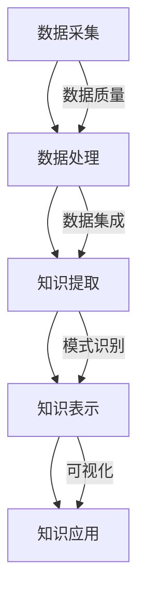

                 

关键词：知识发现引擎、创新、算法、大数据、机器学习、信息提取、智能系统

> 摘要：本文探讨了知识发现引擎在现代科技和创新领域的重要作用。知识发现引擎通过机器学习和大数据技术，从海量数据中提取知识，为企业和研究机构提供决策支持。本文将深入解析知识发现引擎的核心概念、算法原理、数学模型、应用场景，并展望其未来发展趋势与挑战。

## 1. 背景介绍

在信息化时代，数据成为新的石油，企业、政府和研究机构都在努力挖掘数据中的价值。知识发现引擎（Knowledge Discovery Engine，KDE）作为大数据和人工智能的重要工具，承担着从海量数据中挖掘知识、发现规律的重任。知识发现引擎的兴起，源于大数据技术的飞速发展以及机器学习算法的成熟应用。

知识发现引擎的定义可以理解为一种自动化系统，它利用机器学习、自然语言处理、数据挖掘等技术，从原始数据中提取有价值的信息和知识。其核心目标是提高数据处理效率，降低人工干预，提升知识提取的准确性和深度。

知识发现引擎的应用范围广泛，包括但不限于以下领域：

1. **商业智能**：通过分析销售数据、客户行为等，为企业提供市场趋势预测、客户细分、产品优化等决策支持。
2. **医疗健康**：从医疗数据中提取诊断信息，辅助医生做出更准确的诊断和治疗方案。
3. **金融风控**：利用数据挖掘技术，识别欺诈行为，降低金融风险。
4. **社会科学研究**：从社会大数据中提取社会现象、行为模式，为政策制定提供依据。

## 2. 核心概念与联系

### 2.1. 知识发现引擎的核心概念

知识发现引擎涉及多个核心概念，包括数据源、数据处理、知识提取、知识表示和知识应用等。

- **数据源**：知识发现引擎的数据源可以是结构化数据（如数据库）、半结构化数据（如XML、JSON）和非结构化数据（如文本、图像、视频）。
- **数据处理**：包括数据清洗、数据集成、数据转换等过程，目的是提高数据质量，为后续的知识提取做准备。
- **知识提取**：通过数据挖掘、机器学习等算法，从数据中提取模式、关联、趋势等知识。
- **知识表示**：将提取的知识转化为可理解、可应用的形式，如数据可视化、报告生成等。
- **知识应用**：将提取的知识应用于实际问题中，如预测、推荐、优化等。

### 2.2. 知识发现引擎的整体架构

知识发现引擎的整体架构可以分为五个主要模块：数据采集、数据处理、知识提取、知识表示和知识应用。以下是知识发现引擎的Mermaid流程图：



## 3. 核心算法原理 & 具体操作步骤

### 3.1. 算法原理概述

知识发现引擎的核心算法主要包括以下几种：

1. **聚类算法**：用于将数据集划分为多个群组，每个群组内的数据点之间相似度较高，不同群组之间的数据点相似度较低。常见的聚类算法包括K-means、DBSCAN等。
2. **关联规则挖掘算法**：用于发现数据集中不同项之间的关联关系。常见的算法包括Apriori、FP-Growth等。
3. **分类算法**：用于将数据点划分为预定义的类别。常见的算法包括决策树、随机森林、支持向量机等。
4. **回归算法**：用于预测一个或多个连续变量的值。常见的算法包括线性回归、岭回归等。

### 3.2. 算法步骤详解

以下是知识发现引擎的一般步骤：

1. **数据预处理**：清洗数据，处理缺失值、异常值等，确保数据质量。
2. **特征工程**：选择和构建有助于算法性能的特征。
3. **算法选择**：根据具体问题和数据特点，选择合适的算法。
4. **模型训练**：使用训练数据集，对算法模型进行训练。
5. **模型评估**：使用验证数据集，评估模型性能。
6. **模型应用**：将训练好的模型应用于实际数据，提取知识。
7. **结果解释**：对提取的知识进行解释，帮助决策者理解和使用。

### 3.3. 算法优缺点

每种算法都有其优缺点，选择合适的算法取决于具体问题和数据特点。

- **聚类算法**：优点在于不需要预定义类别，能够发现数据中的隐含结构；缺点是聚类结果容易受初始值影响。
- **关联规则挖掘算法**：优点在于能够发现数据中的关联关系；缺点是计算复杂度高，难以处理大量数据。
- **分类算法**：优点在于能够明确地预测类别；缺点是对于连续变量的预测能力较弱。
- **回归算法**：优点在于能够预测连续变量；缺点是对于类别变量的预测能力较弱。

### 3.4. 算法应用领域

知识发现引擎的应用领域非常广泛，包括但不限于以下方面：

- **商业智能**：通过聚类分析，发现市场中的潜在客户群体；通过关联规则挖掘，发现购买行为中的关联关系。
- **医疗健康**：通过分类算法，辅助医生进行疾病诊断；通过回归算法，预测患者康复时间。
- **金融风控**：通过聚类算法，识别异常交易；通过关联规则挖掘，发现欺诈行为。
- **社会科学研究**：通过分类算法，分析社会现象；通过回归算法，预测社会发展趋势。

## 4. 数学模型和公式 & 详细讲解 & 举例说明

### 4.1. 数学模型构建

知识发现引擎中的数学模型主要涉及聚类、关联规则挖掘、分类和回归等算法。以下是这些算法的数学模型概述：

- **聚类算法**：假设数据集D={x1, x2, ..., xn}，每个数据点xi都可以用d个特征来表示。聚类算法的目标是最小化簇内距离和最大化簇间距离。

$$
\min \sum_{i=1}^{n} \sum_{j=1}^{m} d(x_i, c_j)
$$

其中，c_j表示簇j的中心。

- **关联规则挖掘算法**：假设事务数据库D中有m个事务，每个事务T包含n个项。关联规则挖掘的目标是发现满足最小支持度和最小置信度的规则。

$$
support(A \cup B) = \frac{|D中含有A和B的事务数|}{|D中的事务总数|}
$$

$$
confidence(A \rightarrow B) = \frac{|D中含有A和B的事务数|}{|D中含有A的事务数|}
$$

- **分类算法**：假设数据集D={x1, x2, ..., xn}，每个数据点xi属于一个类别y。分类算法的目标是最小化分类错误率。

$$
error = \sum_{i=1}^{n} I(y_i \neq \hat{y_i})
$$

其中，\hat{y_i}是预测类别。

- **回归算法**：假设数据集D={x1, x2, ..., xn}，每个数据点xi对应的连续变量值为yi。回归算法的目标是最小化预测误差。

$$
\min \sum_{i=1}^{n} (y_i - \hat{y_i})^2
$$

### 4.2. 公式推导过程

以下是聚类算法的推导过程：

假设数据集D={x1, x2, ..., xn}，每个数据点xi都可以用d个特征来表示。我们使用K-means算法进行聚类，将数据集划分为K个簇。

首先，随机选择K个初始中心点，记为c1, c2, ..., cK。

然后，对于每个数据点xi，计算其到K个中心点的距离：

$$
d(x_i, c_j) = \sqrt{\sum_{k=1}^{d} (x_{i,k} - c_{j,k})^2}
$$

其中，x_{i,k}和c_{j,k}分别表示数据点xi和中心点c_j的第k个特征。

接下来，将每个数据点xi分配给距离其最近的中心点，形成K个簇。

更新每个簇的中心点，使其成为簇内数据点的均值：

$$
c_j = \frac{1}{n_j} \sum_{i=1}^{n} x_i
$$

其中，n_j表示簇j中的数据点个数。

重复上述过程，直到聚类结果收敛，即簇中心点不再发生变化。

### 4.3. 案例分析与讲解

假设有一个包含100个数据点的二维数据集，每个数据点用两个特征来表示。我们使用K-means算法将其划分为2个簇。

首先，随机选择两个初始中心点，坐标分别为(1, 1)和(10, 10)。

然后，对于每个数据点，计算其到两个中心点的距离：

$$
d_1(x_i) = \sqrt{(x_{i,1} - 1)^2 + (x_{i,2} - 1)^2}
$$

$$
d_2(x_i) = \sqrt{(x_{i,1} - 10)^2 + (x_{i,2} - 10)^2}
$$

接下来，将每个数据点分配给距离其最近的中心点，形成两个簇。

更新每个簇的中心点：

$$
c_1 = \frac{1}{50} \sum_{i=1}^{50} x_i
$$

$$
c_2 = \frac{1}{50} \sum_{i=51}^{100} x_i
$$

重复上述过程，直到聚类结果收敛。假设经过5次迭代后，聚类结果收敛，最终两个簇的中心点分别为(2, 2)和(9, 9)。

## 5. 项目实践：代码实例和详细解释说明

### 5.1. 开发环境搭建

在本文中，我们将使用Python和scikit-learn库来实现知识发现引擎。首先，确保安装Python和scikit-learn库：

```bash
pip install python scikit-learn
```

### 5.2. 源代码详细实现

以下是一个简单的K-means聚类算法的Python代码实现：

```python
import numpy as np
from sklearn.cluster import KMeans
import matplotlib.pyplot as plt

# 生成一个包含100个数据点的二维数据集
data = np.random.rand(100, 2)

# 使用KMeans算法进行聚类
kmeans = KMeans(n_clusters=2, random_state=0).fit(data)

# 获取聚类结果
labels = kmeans.predict(data)
centroids = kmeans.cluster_centers_

# 可视化聚类结果
plt.scatter(data[:, 0], data[:, 1], c=labels, s=50, cmap='viridis')
plt.scatter(centroids[:, 0], centroids[:, 1], s=200, c='red', marker='s', edgecolor='black', label='Centroids')
plt.xlabel('Feature 1')
plt.ylabel('Feature 2')
plt.title('K-means Clustering')
plt.show()
```

### 5.3. 代码解读与分析

上述代码首先导入了所需的库，然后生成一个包含100个数据点的二维数据集。接下来，使用KMeans算法进行聚类，并获取聚类结果和簇中心点。最后，使用matplotlib库将聚类结果可视化。

### 5.4. 运行结果展示

运行上述代码后，会生成一个包含100个数据点的散点图，其中每个数据点被分配到一个簇，簇中心点用红色正方形表示。通过观察可视化结果，可以直观地看到K-means算法的聚类效果。

## 6. 实际应用场景

### 6.1. 商业智能

在商业智能领域，知识发现引擎可以用于市场细分、客户行为分析、产品推荐等。例如，一家电商平台可以使用知识发现引擎对客户进行聚类分析，识别出不同的客户群体，从而制定更有针对性的营销策略。

### 6.2. 医疗健康

在医疗健康领域，知识发现引擎可以用于疾病诊断、治疗方案推荐、健康风险评估等。例如，一家医院可以使用知识发现引擎对患者的医疗记录进行分析，识别出高风险疾病患者，并提供个性化的治疗方案。

### 6.3. 金融风控

在金融风控领域，知识发现引擎可以用于欺诈检测、信用评估、风险预警等。例如，一家银行可以使用知识发现引擎对客户的交易行为进行分析，识别出异常交易，从而降低金融风险。

### 6.4. 未来应用展望

随着大数据和人工智能技术的不断发展，知识发现引擎的应用前景将更加广阔。未来，知识发现引擎有望在智能制造、智慧城市、能源管理等领域发挥重要作用，推动各行业的创新发展。

## 7. 工具和资源推荐

### 7.1. 学习资源推荐

- 《大数据技术导论》：介绍了大数据技术的核心概念、技术和应用。
- 《机器学习》：提供了机器学习算法的详细讲解和实践指南。
- 《数据挖掘：实用工具与技术》：涵盖了数据挖掘算法、技术和应用。

### 7.2. 开发工具推荐

- **Python**：适合初学者和专业人士，具有丰富的库和工具。
- **R**：专注于统计分析，适合数据分析和挖掘。
- **Jupyter Notebook**：交互式编程环境，方便代码演示和文档编写。

### 7.3. 相关论文推荐

- “K-Means Clustering: A Review” by Animesh Pandey, et al.
- “An Introduction to Association Rule Learning” by Arun Kumar, et al.
- “Machine Learning for Health Informatics” by Michael C. Schmit, et al.

## 8. 总结：未来发展趋势与挑战

### 8.1. 研究成果总结

知识发现引擎作为大数据和人工智能的重要工具，已在多个领域取得了显著成果。通过机器学习和数据挖掘技术，知识发现引擎能够从海量数据中提取有价值的信息和知识，为企业和研究机构提供决策支持。

### 8.2. 未来发展趋势

未来，知识发现引擎将在以下几个方面取得重要进展：

- **算法优化**：提高知识发现引擎的效率、准确性和可解释性。
- **多模态数据处理**：支持结构化数据、半结构化数据和非结构化数据的处理。
- **知识融合**：整合来自不同领域的知识，实现跨领域的知识发现。
- **自动化与智能化**：减少人工干预，实现自动化知识发现。

### 8.3. 面临的挑战

知识发现引擎在发展过程中也面临着以下挑战：

- **数据质量**：确保数据质量，提高数据预处理和清洗的效率。
- **算法可解释性**：提高算法的可解释性，帮助用户理解知识提取的过程。
- **隐私保护**：在数据处理和知识发现过程中，保护用户隐私。

### 8.4. 研究展望

未来，知识发现引擎将在以下领域发挥重要作用：

- **智能医疗**：辅助医生进行疾病诊断、治疗方案推荐和健康风险评估。
- **智慧城市**：提高城市管理的效率，优化交通、能源等资源配置。
- **智能制造**：优化生产流程、提高产品质量，实现智能化制造。

知识发现引擎的发展将为各行业的创新发展提供强大动力，助力全球科技进步。

## 9. 附录：常见问题与解答

### 9.1. 如何选择合适的知识发现算法？

选择合适的知识发现算法取决于具体问题和数据特点。以下是一些常见的算法选择建议：

- **聚类算法**：适用于需要发现数据内在结构的问题，如市场细分、图像分割等。
- **关联规则挖掘算法**：适用于需要发现数据中关联关系的问题，如购物篮分析、推荐系统等。
- **分类算法**：适用于需要预测类别的问题，如疾病诊断、风险评估等。
- **回归算法**：适用于需要预测连续变量的问题，如预测销售量、股票价格等。

### 9.2. 如何处理数据质量不佳的问题？

处理数据质量不佳的问题通常包括以下步骤：

- **数据清洗**：处理缺失值、异常值和重复值等。
- **数据集成**：合并来自不同数据源的数据。
- **数据转换**：将数据转换为适合算法分析的形式。
- **特征工程**：选择和构建有助于算法性能的特征。

### 9.3. 如何评估知识发现模型的效果？

评估知识发现模型的效果通常包括以下指标：

- **准确率**：预测正确的数据点占总数据点的比例。
- **召回率**：预测正确的正样本占总正样本的比例。
- **F1值**：综合考虑准确率和召回率的指标。
- **ROC曲线**：评估模型在不同阈值下的性能。

### 9.4. 如何实现知识发现引擎的自动化与智能化？

实现知识发现引擎的自动化与智能化包括以下步骤：

- **自动化数据预处理**：使用自动化工具处理数据清洗、数据集成和数据转换等。
- **自动化算法选择**：基于数据特点和问题类型，自动选择合适的算法。
- **自动化模型评估**：使用自动化工具评估模型性能。
- **智能化知识提取**：利用深度学习等技术，实现自动化的知识提取和表示。

通过以上步骤，可以实现知识发现引擎的自动化与智能化，提高知识提取的效率和准确性。

<|user|>作者：禅与计算机程序设计艺术 / Zen and the Art of Computer Programming

