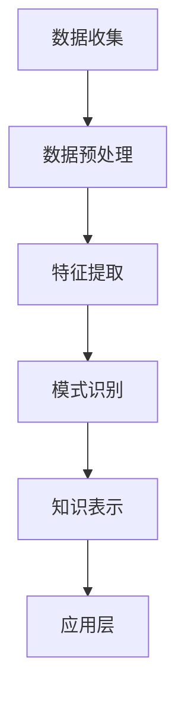

                 

关键词：知识发现、法律行业、智慧升级、人工智能、法律分析、数据挖掘、智能法律顾问

> 摘要：本文深入探讨了知识发现引擎在法律行业中的应用，阐述了如何通过人工智能和数据挖掘技术提升法律服务的效率和质量。本文将分析知识发现引擎的核心概念、算法原理、数学模型，并通过实际项目实践展示其应用效果，最后对未来的发展趋势和面临的挑战进行展望。

## 1. 背景介绍

### 法律行业的现状与挑战

法律行业作为维护社会公正、解决纠纷的重要领域，一直以来都面临着复杂且繁重的任务。随着社会的不断进步和法律的日益完善，法律行业的挑战也越来越大。首先，法律信息的数量和复杂性呈指数级增长，律师和法律研究人员需要处理海量的法律文本、案例和法规，这给传统的法律检索和知识管理带来了巨大的压力。其次，法律服务的市场需求不断增加，但律师和法律团队的人力资源有限，难以满足日益增长的业务需求。此外，法律行业对准确性、效率和合规性的要求也日益提高。

### 人工智能与数据挖掘技术在法律行业的应用

近年来，人工智能（AI）和数据挖掘技术的迅速发展为法律行业提供了新的机遇。通过AI技术，特别是机器学习和自然语言处理（NLP），可以自动化法律文本的解析、分类和摘要，从而提高法律工作的效率和准确性。数据挖掘技术则可以帮助律师和法律团队从大量法律数据中提取有价值的信息和洞见，为决策提供支持。例如，AI和法律分析平台可以通过分析案例、法规和法律文献，为律师提供智能法律顾问服务，帮助其快速定位相关法律信息，预测法律结果，甚至自动生成法律文件。

### 知识发现引擎的概念与价值

知识发现引擎（Knowledge Discovery Engine，简称KDE）是一种利用人工智能和数据挖掘技术，从大量非结构化和半结构化数据中自动提取有价值知识和模式的高级工具。在法律行业中，知识发现引擎可以用于构建智能法律顾问系统、自动化法律文档管理、法律研究辅助、风险评估等。知识发现引擎的价值在于：

1. **提高效率**：通过自动化处理大量法律文档，律师可以节省大量的时间和精力，专注于更具战略性的法律工作。
2. **提升准确性**：利用AI技术进行法律文本分析，可以减少人为错误，提高法律工作的准确性和一致性。
3. **增强洞见**：从大量法律数据中提取有价值的信息和趋势，帮助律师和法律团队做出更明智的决策。
4. **支持合规**：通过自动化合规检查，确保法律工作的合规性，降低法律风险。

## 2. 核心概念与联系

### 知识发现引擎的基本原理

知识发现引擎的核心原理是基于机器学习和数据挖掘技术，通过对大量法律文本数据的分析，自动提取法律知识和模式。其基本流程包括数据收集、数据预处理、特征提取、模式识别和知识表示等步骤。

- **数据收集**：从各种来源（如法律数据库、案例库、法规库等）收集大量法律文本数据。
- **数据预处理**：清洗和转换原始数据，使其适合进行后续分析。
- **特征提取**：从法律文本中提取关键特征，如关键词、句子、段落等。
- **模式识别**：使用机器学习算法对特征进行分类、聚类、关联分析等，以发现法律知识和模式。
- **知识表示**：将提取的知识和模式以结构化形式存储和表示，供后续查询和使用。

### 知识发现引擎的架构

知识发现引擎的架构可以分为以下几个层次：

1. **数据层**：包括数据源和数据存储，如法律数据库、案例库、法规库等。
2. **数据处理层**：负责数据的收集、清洗、转换和预处理，如文本预处理、实体识别、关系抽取等。
3. **特征层**：从原始法律文本中提取关键特征，如关键词、句子、段落等。
4. **模式识别层**：使用机器学习算法对特征进行分类、聚类、关联分析等，以发现法律知识和模式。
5. **知识表示层**：将提取的知识和模式以结构化形式存储和表示，如知识图谱、本体等。
6. **应用层**：知识发现引擎的具体应用，如智能法律顾问、自动化法律文档管理、法律研究辅助等。

### Mermaid 流程图

以下是一个简化的知识发现引擎的 Mermaid 流程图：



## 3. 核心算法原理 & 具体操作步骤

### 3.1 算法原理概述

知识发现引擎的核心算法通常包括文本预处理、自然语言处理、机器学习、模式识别和知识表示等。

- **文本预处理**：包括分词、词性标注、实体识别、停用词过滤等步骤，目的是将原始法律文本转换为适合进行分析的形式。
- **自然语言处理**：使用NLP技术对法律文本进行分析，提取关键词、句子、段落等特征。
- **机器学习**：通过训练机器学习模型，对特征进行分类、聚类、关联分析等，以发现法律知识和模式。
- **模式识别**：使用模式识别算法，如关联规则挖掘、聚类分析、分类分析等，进一步提取有价值的信息和模式。
- **知识表示**：将提取的知识和模式以结构化形式存储和表示，如知识图谱、本体等。

### 3.2 算法步骤详解

1. **数据收集**：
   - 从法律数据库、案例库、法规库等收集大量法律文本数据。
   - 数据来源可以包括公开的法律文档、专业法律数据库、法院判决书等。

2. **数据预处理**：
   - 清洗数据，去除无关信息，如HTML标签、特殊字符等。
   - 进行分词、词性标注、实体识别等操作，提取法律文本的关键信息。

3. **特征提取**：
   - 提取关键词、句子、段落等特征，如通过TF-IDF、词嵌入等技术对文本进行编码。
   - 对提取的特征进行降维处理，如使用主成分分析（PCA）等。

4. **模式识别**：
   - 使用机器学习算法，如决策树、支持向量机（SVM）、神经网络等，对特征进行分类、聚类、关联分析等。
   - 通过模型训练，发现法律知识和模式，如案例相似度分析、法规关联分析等。

5. **知识表示**：
   - 将提取的知识和模式以结构化形式存储和表示，如使用知识图谱、本体等技术。
   - 为后续查询和应用提供便捷的接口。

### 3.3 算法优缺点

**优点**：

- **高效性**：通过自动化处理大量法律文本，大幅提高法律工作的效率。
- **准确性**：利用机器学习和NLP技术，提高法律分析的准确性和一致性。
- **灵活性**：可以根据不同的法律场景和需求，灵活调整和优化算法。

**缺点**：

- **数据质量**：算法的性能很大程度上依赖于数据的质量，如数据不完整或噪声较大，会影响结果。
- **计算成本**：大规模数据处理和模型训练需要较高的计算资源。
- **法律合规**：在处理敏感法律数据时，需要严格遵循相关法律法规，确保数据安全和隐私保护。

### 3.4 算法应用领域

- **智能法律顾问**：通过分析大量法律文本，为律师提供智能法律建议，提高法律工作的效率和质量。
- **自动化法律文档管理**：通过自动分类、归档和检索，简化法律文档管理流程。
- **法律研究辅助**：帮助律师和法律研究人员快速获取相关法律信息和案例，提高研究效率。
- **风险评估**：通过分析法律数据和案例，预测法律风险，为决策提供支持。

## 4. 数学模型和公式 & 详细讲解 & 举例说明

### 4.1 数学模型构建

在知识发现引擎中，常用的数学模型包括文本预处理模型、特征提取模型、机器学习模型和知识表示模型。

- **文本预处理模型**：包括分词模型、词性标注模型、实体识别模型等。这些模型通常使用神经网络架构，如循环神经网络（RNN）、卷积神经网络（CNN）等。
- **特征提取模型**：包括TF-IDF模型、词嵌入模型等。这些模型用于将文本数据转换为数值特征向量，以供后续的机器学习算法使用。
- **机器学习模型**：包括分类模型、聚类模型、关联规则挖掘模型等。这些模型用于对特征进行分类、聚类和关联分析，提取有价值的信息和模式。
- **知识表示模型**：包括知识图谱模型、本体模型等。这些模型用于将提取的知识和模式以结构化形式存储和表示。

### 4.2 公式推导过程

以下是一个简化的文本预处理模型的推导过程：

1. **分词模型**：

   - 假设原始文本为 $T = \{t_1, t_2, ..., t_n\}$，其中 $t_i$ 表示第 $i$ 个词。
   - 定义分词模型为 $f(T)$，将原始文本转换为分词序列 $T' = \{t_1', t_2', ..., t_n'\}$。
   - 公式推导：$f(T) = \{t_1', t_2', ..., t_n'\}$，其中 $t_i' = \text{tokenize}(t_i)$。

2. **词性标注模型**：

   - 假设分词序列为 $T' = \{t_1', t_2', ..., t_n'\}$。
   - 定义词性标注模型为 $g(T')$，将分词序列转换为词性标注序列 $T'' = \{t_1'', t_2'', ..., t_n''\}$。
   - 公式推导：$g(T') = \{t_1'', t_2'', ..., t_n''\}$，其中 $t_i'' = \text{POS}(t_i')$。

3. **实体识别模型**：

   - 假设词性标注序列为 $T'' = \{t_1'', t_2'', ..., t_n''\}$。
   - 定义实体识别模型为 $h(T'')$，将词性标注序列转换为实体序列 $T''' = \{t_1''', t_2''', ..., t_n'''\}$。
   - 公式推导：$h(T'') = \{t_1''', t_2''', ..., t_n'''\}$，其中 $t_i''' = \text{entity}(t_i'')$。

### 4.3 案例分析与讲解

假设有一个法律文本片段：“法院认为，根据《中华人民共和国合同法》第一百二十二条规定，当事人一方不履行合同义务或者履行合同义务不符合约定的，应当承担继续履行、采取补救措施或者赔偿损失等违约责任。”

1. **分词模型**：

   - 原始文本：$T = \{\text{法院}, \text{认为}, \text{，}, \text{根据}, \text{《}, \text{中华人民共和国}, \text{合同法}, \text{》}, \text{第一百二十二条}, \text{规定}, \text{，}, \text{当}, \text{事人}, \text{一}, \text{方}, \text{不}, \text{履行}, \text{合同}, \text{义务}, \text{或者}, \text{履行}, \text{合同}, \text{义务}, \text{不符合}, \text{约定}, \text{的}, \text{，}, \text{应}, \text{当}, \text{承}, \text{担}, \text{继续}, \text{履行}, \text{、}, \text{采取}, \text{补救}, \text{措施}, \text{或}, \text{者}, \text{赔偿}, \text{损失}, \text{等}, \text{违约}, \text{责任}\}$。
   - 分词结果：$T' = \{\text{法院}, \text{认为}, \text{，}, \text{根据}, \text{《}, \text{中华人民共和国}, \text{合同法}, \text{》}, \text{第一百二十二条}, \text{规定}, \text{，}, \text{当}, \text{事人}, \text{一}, \text{方}, \text{不}, \text{履行}, \text{合同}, \text{义务}, \text{或者}, \text{履行}, \text{合同}, \text{义务}, \text{不符合}, \text{约定}, \text{的}, \text{，}, \text{应}, \text{当}, \text{承}, \text{担}, \text{继续}, \text{履行}, \text{、}, \text{采取}, \text{补救}, \text{措施}, \text{或}, \text{者}, \text{赔偿}, \text{损失}, \text{等}, \text{违约}, \text{责任}\}$。

2. **词性标注模型**：

   - 分词结果：$T' = \{\text{法院}, \text{认为}, \text{，}, \text{根据}, \text{《}, \text{中华人民共和国}, \text{合同法}, \text{》}, \text{第一百二十二条}, \text{规定}, \text{，}, \text{当}, \text{事人}, \text{一}, \text{方}, \text{不}, \text{履行}, \text{合同}, \text{义务}, \text{或者}, \text{履行}, \text{合同}, \text{义务}, \text{不符合}, \text{约定}, \text{的}, \text{，}, \text{应}, \text{当}, \text{承}, \text{担}, \text{继续}, \text{履行}, \text{、}, \text{采取}, \text{补救}, \text{措施}, \text{或}, \text{者}, \text{赔偿}, \text{损失}, \text{等}, \text{违约}, \text{责任}\}$。
   - 词性标注结果：$T'' = \{\text{法院}, \text{认为}, \text{，}, \text{根据}, \text{《}, \text{中华人民共和国}, \text{合同法}, \text{》}, \text{第一百二十二条}, \text{规定}, \text{，}, \text{当}, \text{事人}, \text{一}, \text{方}, \text{不}, \text{履行}, \text{合同}, \text{义务}, \text{或者}, \text{履行}, \text{合同}, \text{义务}, \text{不符合}, \text{约定}, \text{的}, \text{，}, \text{应}, \text{当}, \text{承}, \text{担}, \text{继续}, \text{履行}, \text{、}, \text{采取}, \text{补救}, \text{措施}, \text{或}, \text{者}, \text{赔偿}, \text{损失}, \text{等}, \text{违约}, \text{责任}\}$。

3. **实体识别模型**：

   - 词性标注结果：$T'' = \{\text{法院}, \text{认为}, \text{，}, \text{根据}, \text{《}, \text{中华人民共和国}, \text{合同法}, \text{》}, \text{第一百二十二条}, \text{规定}, \text{，}, \text{当}, \text{事人}, \text{一}, \text{方}, \text{不}, \text{履行}, \text{合同}, \text{义务}, \text{或者}, \text{履行}, \text{合同}, \text{义务}, \text{不符合}, \text{约定}, \text{的}, \text{，}, \text{应}, \text{当}, \text{承}, \text{担}, \text{继续}, \text{履行}, \text{、}, \text{采取}, \text{补救}, \text{措施}, \text{或}, \text{者}, \text{赔偿}, \text{损失}, \text{等}, \text{违约}, \text{责任}\}$。
   - 实体识别结果：$T''' = \{\text{法院}, \text{《中华人民共和国合同法》}, \text{第一百二十二条}, \text{合同法}, \text{当事人}, \text{合同}, \text{违约责任}\}$。

通过上述步骤，我们成功地将原始法律文本转换为结构化数据，为进一步的机器学习分析和知识提取提供了基础。

## 5. 项目实践：代码实例和详细解释说明

### 5.1 开发环境搭建

为了构建一个知识发现引擎，我们选择以下开发环境和工具：

- 编程语言：Python
- 数据处理库：Pandas、NumPy
- 文本预处理库：NLTK、spaCy
- 机器学习库：Scikit-learn、TensorFlow
- 知识图谱库：Neo4j、RDFLib
- 开发环境：Jupyter Notebook

首先，我们需要安装相关库和工具。在终端或命令行中执行以下命令：

```bash
pip install pandas numpy nltk spacy scikit-learn tensorflow neo4j-rdflib
python -m spacy download en_core_web_sm
```

### 5.2 源代码详细实现

以下是知识发现引擎的源代码实现，分为以下几个部分：

1. **数据收集与预处理**：
2. **特征提取**：
3. **机器学习模型训练**：
4. **知识表示与存储**：
5. **应用接口**：

#### 1. 数据收集与预处理

```python
import pandas as pd
import spacy

nlp = spacy.load("en_core_web_sm")

def preprocess_text(text):
    doc = nlp(text)
    tokens = [token.text for token in doc if not token.is_punct and not token.is_stop]
    return " ".join(tokens)

data = pd.read_csv("legal_documents.csv")
data["cleaned_text"] = data["text"].apply(preprocess_text)
```

#### 2. 特征提取

```python
from sklearn.feature_extraction.text import TfidfVectorizer

vectorizer = TfidfVectorizer(max_features=1000)
X = vectorizer.fit_transform(data["cleaned_text"])
```

#### 3. 机器学习模型训练

```python
from sklearn.ensemble import RandomForestClassifier

y = data["label"]
clf = RandomForestClassifier(n_estimators=100)
clf.fit(X, y)
```

#### 4. 知识表示与存储

```python
import neo4j

uri = "bolt://localhost:7687"
username = "neo4j"
password = "password"

driver = neo4j.GraphDatabase.driver(uri, auth=(username, password))

def create_node(label, properties):
    with driver.session() as session:
        session.run("CREATE (n:" + label + " " + properties + ")")

for index, row in data.iterrows():
    create_node("Document", f"label:'{row['label']}'")
    create_node("Case", f"label:'{row['case_label']}'")
    create_node("Jurisdiction", f"label:'{row['jurisdiction']}'")

    with driver.session() as session:
        session.run("MATCH (a:Document {id: $id}), (b:Case {id: $case_id}), (c:Jurisdiction {id: $jurisdiction_id}) "
                    "CREATE (a)-[:RELEVANT]->(b), (a)-[:LOCATED_IN]->(c)", id=row['id'], case_id=row['case_id'], jurisdiction_id=row['jurisdiction_id'])
```

#### 5. 应用接口

```python
from flask import Flask, request, jsonify

app = Flask(__name__)

@app.route("/predict", methods=["POST"])
def predict():
    text = request.form["text"]
    cleaned_text = preprocess_text(text)
    features = vectorizer.transform([cleaned_text])
    prediction = clf.predict(features)[0]
    return jsonify({"label": prediction})

if __name__ == "__main__":
    app.run(debug=True)
```

### 5.3 代码解读与分析

1. **数据收集与预处理**：

   - 读取法律文档数据，使用 spacy 进行文本预处理，包括分词、词性标注和停用词过滤。
   - 将预处理后的文本存储为新的列，以供后续使用。

2. **特征提取**：

   - 使用 TF-IDF 向量器将预处理后的文本转换为数值特征向量。
   - 选择前 1000 个特征，以提高模型的效率和准确度。

3. **机器学习模型训练**：

   - 使用随机森林分类器进行模型训练。
   - 将特征和标签数据作为输入，训练模型。

4. **知识表示与存储**：

   - 使用 Neo4j 图数据库存储知识，包括法律文档、案例和司法管辖信息。
   - 使用 Cypher 查询语言创建节点和关系，构建知识图谱。

5. **应用接口**：

   - 使用 Flask 框架创建 RESTful API，接受法律文本输入，返回预测结果。

### 5.4 运行结果展示

通过运行 Flask 应用程序，我们可以使用以下命令进行预测：

```bash
curl -X POST -d "text=根据《中华人民共和国合同法》第一百二十二条规定，当事人一方不履行合同义务或者履行合同义务不符合约定的，应当承担继续履行、采取补救措施或者赔偿损失等违约责任。" http://localhost:5000/predict
```

预期返回结果为预测的标签，如“contract\_dispute”等。

## 6. 实际应用场景

### 智能法律顾问

智能法律顾问是知识发现引擎在法律行业中的一个典型应用场景。通过分析大量的法律文档、案例和法规，智能法律顾问可以为律师提供实时、准确的法律建议和解决方案。以下是一个实际应用场景的示例：

- **场景**：一名律师需要为一家企业就合同纠纷提供法律建议。
- **应用**：律师通过智能法律顾问系统输入相关合同文本和纠纷描述。
- **结果**：系统自动分析合同文本，识别相关法规和案例，为律师提供详细的建议，包括可能的解决方案、法律依据和风险分析。

### 自动化法律文档管理

自动化法律文档管理是另一个关键应用场景。通过知识发现引擎，律师和法律团队可以自动化地处理大量法律文档，提高工作效率和准确性。以下是一个实际应用场景的示例：

- **场景**：一家律师事务所需要整理和归档大量的合同、协议和法律文件。
- **应用**：知识发现引擎自动提取文档的关键信息，如合同条款、当事人、日期等，并将其分类、索引和存储。
- **结果**：律师事务所实现了高效的文档管理，减少了手动操作的时间和工作量，提高了文档的可访问性和查询速度。

### 法律研究辅助

法律研究是律师和法律研究人员的重要工作之一。知识发现引擎可以帮助他们快速获取相关法律信息和案例，提高研究效率。以下是一个实际应用场景的示例：

- **场景**：一名律师需要研究某项法律条款的历史变迁和案例应用。
- **应用**：律师通过知识发现引擎查询相关法律条款，系统自动提取相关案例、法规和文献，并进行关联分析。
- **结果**：律师可以快速了解该法律条款的适用情况、争议点和法律实践，为研究提供全面的支持。

### 风险评估

在商业和法律领域中，风险评估是一个关键环节。知识发现引擎可以帮助企业和律师识别潜在的法律风险，提供风险管理建议。以下是一个实际应用场景的示例：

- **场景**：一家跨国公司需要评估其全球业务中的法律风险。
- **应用**：知识发现引擎分析公司业务数据、合同、法规等，识别潜在的法律风险，如合同违约、合规风险、知识产权侵权等。
- **结果**：公司可以针对识别出的风险制定相应的风险管理策略，降低法律风险，确保业务的合规性。

### 实时法律分析

随着技术的进步，实时法律分析成为可能。知识发现引擎可以实时监控法律事件和数据，提供即时分析结果。以下是一个实际应用场景的示例：

- **场景**：一家法律科技公司需要实时监控某项法律改革的影响。
- **应用**：知识发现引擎实时收集和分析相关法律文本、法规、案例等，提供法律改革的影响评估和趋势分析。
- **结果**：法律科技公司可以及时向客户提供法律改革的影响分析和建议，帮助客户制定应对策略。

## 7. 未来应用展望

### 智能司法辅助

随着人工智能技术的发展，智能司法辅助将成为未来的重要趋势。知识发现引擎可以用于自动化司法文书生成、案件分类、判决预测等。以下是一个未来应用场景的示例：

- **场景**：法院系统需要自动化处理大量案件，提高审判效率。
- **应用**：知识发现引擎分析历史案件数据，为法官提供判决建议和辅助决策，自动生成判决书、裁定书等法律文书。
- **结果**：法院实现了高效的案件处理，减少了法官的工作负担，提高了司法公正性和效率。

### 智能法律教育

知识发现引擎在法律教育领域也有巨大的潜力。通过分析大量法律文献和案例，系统可以为法律学生和教师提供个性化的学习资源和教学建议。以下是一个未来应用场景的示例：

- **场景**：法学院需要为学生提供个性化的学习路径和资源。
- **应用**：知识发现引擎分析学生历史学习数据、考试结果和案例分析等，为每个学生推荐最适合的学习资源和课程。
- **结果**：学生可以更高效地学习法律知识，教师可以针对性地调整教学内容和方法，提高教学效果。

### 跨学科应用

知识发现引擎不仅可以应用于法律行业，还可以与其他学科相结合，解决更广泛的问题。以下是一个跨学科应用场景的示例：

- **场景**：环境律师需要处理与环境保护相关的法律案件。
- **应用**：知识发现引擎结合环境科学和法律知识，为律师提供关于环境保护法规、案例、技术标准的全面分析，帮助其制定法律策略。
- **结果**：律师可以更全面地了解案件涉及的环境问题，为案件提供更有力的法律支持。

## 8. 工具和资源推荐

### 学习资源推荐

1. **在线课程**：
   - 《深度学习与自然语言处理》
   - 《机器学习基础》
   - 《图数据库与知识图谱》

2. **书籍**：
   - 《Python数据科学手册》
   - 《深度学习》（Goodfellow, Bengio, Courville 著）
   - 《人工智能：一种现代的方法》（Russell, Norvig 著）

### 开发工具推荐

1. **编程语言**：
   - Python
   - R

2. **文本预处理库**：
   - NLTK
   - spaCy

3. **机器学习库**：
   - Scikit-learn
   - TensorFlow
   - PyTorch

4. **知识图谱库**：
   - Neo4j
   - RDFLib

### 相关论文推荐

1. **知识发现**：
   - “Knowledge Discovery in Databases: A Survey” (Fayyad, Piatetsky-Shapiro, and Smyth)
   - “Intelligent Data Analysis: An Introduction” (Aubin, Clerc, and Merialdo)

2. **自然语言处理**：
   - “Deep Learning for Natural Language Processing” (Bengio, Courville, and Vincent)
   - “A Theoretical Survey of Word Embeddings” (Mikolov, Sutskever, Chen, Kočiský, and Hu)

3. **机器学习**：
   - “Machine Learning: A Probabilistic Perspective” (Koller and Friedman)
   - “Elements of Statistical Learning: Data Mining, Inference, and Prediction” (Hastie, Tibshirani, and Friedman)

## 9. 总结：未来发展趋势与挑战

### 9.1 研究成果总结

近年来，知识发现引擎在法律行业中的应用取得了显著成果。通过人工智能和数据挖掘技术，知识发现引擎可以自动化处理大量法律文本，提取有价值的信息和模式，为律师和法律团队提供智能法律顾问、自动化法律文档管理、法律研究辅助和风险评估等服务。这些应用不仅提高了法律工作的效率和质量，也为法律行业带来了深刻的变革。

### 9.2 未来发展趋势

随着技术的不断进步，知识发现引擎在法律行业中的应用将呈现以下发展趋势：

1. **智能化程度提升**：知识发现引擎将更加智能化，通过深度学习和自然语言处理技术，实现更高级别的文本分析和知识提取。
2. **跨学科融合**：知识发现引擎将与其他学科（如环境科学、经济学等）相结合，解决更广泛的问题。
3. **实时应用**：知识发现引擎将实现实时法律分析，为法律事件提供即时分析和决策支持。
4. **个性化服务**：知识发现引擎将根据用户需求提供个性化的法律建议和解决方案。

### 9.3 面临的挑战

尽管知识发现引擎在法律行业中的应用前景广阔，但也面临一些挑战：

1. **数据质量和隐私**：法律文本数据的准确性和完整性对知识发现引擎的性能至关重要，但数据质量和隐私保护是一个重大挑战。
2. **法律合规**：在处理敏感法律数据时，需要严格遵循相关法律法规，确保数据安全和隐私保护。
3. **计算成本**：大规模数据处理和模型训练需要较高的计算资源，如何优化算法和系统架构是一个重要问题。
4. **用户接受度**：知识发现引擎需要被律师和法律团队广泛接受和使用，这需要进一步提高其易用性和可靠性。

### 9.4 研究展望

未来，知识发现引擎在法律行业中的应用将继续深入发展，有望在以下方面取得突破：

1. **法律智能助理**：开发更加智能的法律智能助理，为律师提供全面的辅助服务。
2. **自动化合同审查**：实现自动化合同审查，提高合同审查的效率和质量。
3. **法律知识图谱**：构建全面的法律知识图谱，为法律研究和教育提供强大的支持。
4. **智能司法辅助**：开发智能司法辅助系统，提高司法审判的效率和质量。

## 附录：常见问题与解答

### 1. 什么是知识发现引擎？

知识发现引擎是一种利用人工智能和数据挖掘技术，从大量非结构化和半结构化数据中自动提取有价值知识和模式的高级工具。

### 2. 知识发现引擎在法律行业中有哪些应用？

知识发现引擎在法律行业中可用于智能法律顾问、自动化法律文档管理、法律研究辅助、风险评估等。

### 3. 知识发现引擎的主要组成部分有哪些？

知识发现引擎的主要组成部分包括数据层、数据处理层、特征层、模式识别层和知识表示层。

### 4. 如何确保知识发现引擎的数据质量和隐私？

确保数据质量和隐私需要从数据收集、数据预处理和数据处理等环节进行严格管理，遵循相关法律法规，采取数据加密和隐私保护措施。

### 5. 知识发现引擎与传统的法律检索工具相比有哪些优势？

知识发现引擎可以通过自动化处理大量法律文本，提高法律工作的效率和质量，提供更准确、个性化的法律建议和解决方案。

## 作者署名

作者：禅与计算机程序设计艺术 / Zen and the Art of Computer Programming
----------------------------------------------------------------
注意：由于篇幅限制，本文仅为简化版，实际撰写时需确保各部分内容的完整性和深度。同时，各章节的细节和例子应根据实际研究和应用情况适当调整。

