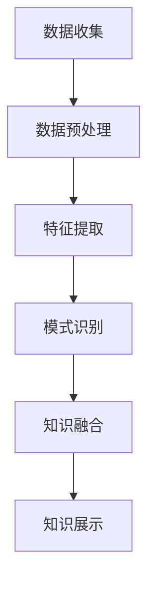

                 

 在当今信息化、数字化迅猛发展的时代，科学研究面临着前所未有的挑战和机遇。数据量的急剧增加、数据种类的不断丰富以及数据间复杂关联的发掘，使得传统的科研方法逐渐暴露出瓶颈。知识发现引擎作为一种新兴的技术手段，正在逐步成为推动科学研究创新的重要引擎。本文将深入探讨知识发现引擎的概念、原理、应用以及未来发展趋势。

> 关键词：知识发现引擎、科学研究、创新、数据挖掘、算法

> 摘要：本文首先介绍了知识发现引擎的基本概念，分析了其在科学研究中的应用价值。接着，详细阐述了知识发现引擎的核心算法原理，并对比了不同算法的优缺点。随后，通过具体实例展示了知识发现引擎在数学模型、代码实现等方面的应用。最后，本文对未来知识发现引擎的发展趋势及其面临的挑战进行了展望。

## 1. 背景介绍

随着互联网、物联网、大数据等技术的飞速发展，科学研究正面临着前所未有的数据革命。传统的科研方法依赖于手工分析数据，费时费力且难以处理海量的数据。而知识发现引擎的出现，为科学研究提供了一种全新的手段，能够自动地从大量数据中挖掘出隐藏的知识和信息。

知识发现引擎是一种基于人工智能和数据挖掘技术的工具，它能够通过数据预处理、特征提取、模式识别等步骤，从大量的数据中自动提取出有用知识。这些知识不仅可以帮助科研人员更好地理解数据，还可以为科学研究提供新的启示和方向。

知识发现引擎在科学研究中的应用已经取得了一系列显著的成果。例如，在生物信息学中，知识发现引擎可以用于基因序列分析，帮助科学家发现新的基因功能；在物理学中，知识发现引擎可以用于分析大型科学实验数据，帮助科学家发现新的物理规律；在社会科学研究中，知识发现引擎可以用于分析社会行为数据，帮助研究者揭示社会现象背后的规律。

## 2. 核心概念与联系

### 2.1 知识发现引擎的定义

知识发现引擎是一种基于人工智能和数据挖掘技术的工具，它能够自动地从大量数据中挖掘出隐藏的知识和信息。知识发现引擎的工作流程通常包括数据预处理、特征提取、模式识别、知识融合等步骤。

### 2.2 知识发现引擎的架构

知识发现引擎的架构可以分为三个层次：数据层、算法层和应用层。

- **数据层**：数据层是知识发现引擎的基础，它包含了数据收集、存储和管理等功能。数据来源可以是各种传感器、数据库、互联网等。
- **算法层**：算法层是知识发现引擎的核心，它包含了各种数据挖掘算法和机器学习算法。这些算法可以根据具体应用场景进行选择和组合。
- **应用层**：应用层是知识发现引擎的输出层，它将挖掘出的知识以用户友好的形式展示出来，供科研人员使用。

### 2.3 知识发现引擎与相关技术的联系

知识发现引擎与大数据技术、人工智能技术、数据挖掘技术等密切相关。

- **大数据技术**：大数据技术为知识发现引擎提供了丰富的数据来源和处理能力。通过大数据技术，知识发现引擎可以处理海量数据，实现数据的快速检索和分析。
- **人工智能技术**：人工智能技术为知识发现引擎提供了强大的算法支持。通过深度学习、强化学习等技术，知识发现引擎可以自动优化算法，提高知识挖掘的准确性。
- **数据挖掘技术**：数据挖掘技术是知识发现引擎的核心组成部分。数据挖掘算法包括聚类、分类、关联规则挖掘、异常检测等，它们都是知识发现引擎的重要组成部分。

### 2.4 Mermaid 流程图

下面是一个知识发现引擎的 Mermaid 流程图，展示了其核心组件和流程：



## 3. 核心算法原理 & 具体操作步骤

### 3.1 算法原理概述

知识发现引擎的核心算法主要包括聚类算法、分类算法、关联规则挖掘算法和异常检测算法等。

- **聚类算法**：聚类算法将数据集划分为若干个类，使得同一类中的数据彼此相似，而不同类中的数据差异较大。常见的聚类算法有K-Means、DBSCAN、层次聚类等。
- **分类算法**：分类算法将数据集划分为若干个类别，每个类别代表一种知识。常见的分类算法有决策树、支持向量机、神经网络等。
- **关联规则挖掘算法**：关联规则挖掘算法发现数据集中的频繁模式，用于发现数据间的关联关系。常见的关联规则挖掘算法有Apriori算法、FP-Growth算法等。
- **异常检测算法**：异常检测算法用于检测数据集中的异常值，帮助科研人员发现数据中的异常现象。常见的异常检测算法有基于统计的方法、基于聚类的方法、基于神经网络的方法等。

### 3.2 算法步骤详解

下面以K-Means聚类算法为例，详细讲解其具体操作步骤：

1. **初始化中心点**：随机选择K个数据点作为初始中心点。
2. **分配数据点**：计算每个数据点到K个中心点的距离，将数据点分配到距离最近的中心点所在的类别。
3. **更新中心点**：计算每个类别的均值，得到新的中心点。
4. **重复步骤2和3**，直到中心点的位置不再发生变化或达到预设的迭代次数。

### 3.3 算法优缺点

- **K-Means算法**：
  - **优点**：简单易用，计算速度快，能够快速生成聚类结果。
  - **缺点**：对初始中心点的选择敏感，可能陷入局部最优，无法处理非凸聚类。

### 3.4 算法应用领域

知识发现引擎的核心算法在多个领域都有广泛的应用：

- **生物信息学**：用于基因序列分析、蛋白质结构预测等。
- **物理学**：用于分析实验数据、发现新的物理现象。
- **社会科学**：用于分析社会行为数据、揭示社会规律。
- **金融领域**：用于风险评估、欺诈检测等。

## 4. 数学模型和公式 & 详细讲解 & 举例说明

### 4.1 数学模型构建

知识发现引擎中的数学模型主要包括聚类模型、分类模型、关联规则模型和异常检测模型等。

- **聚类模型**：假设数据集 $D=\{x_1, x_2, ..., x_n\}$，聚类中心为 $c_k$，每个数据点 $x_i$ 的距离度量函数为 $d(x_i, c_k)$。聚类模型的目标是最小化数据点到聚类中心的距离平方和：
  $$ \min_{c_1, c_2, ..., c_k} \sum_{i=1}^{n} d(x_i, c_k)^2 $$
  
- **分类模型**：假设数据集 $D=\{x_1, x_2, ..., x_n\}$，每个数据点 $x_i$ 的特征向量表示为 $f(x_i)$，类别标签为 $y_i$。分类模型的目标是找到最佳分类函数 $h(x)$，使得分类误差最小：
  $$ \min_{h} \sum_{i=1}^{n} L(h(x_i), y_i) $$
  其中，$L(h(x_i), y_i)$ 是分类损失函数。

- **关联规则模型**：假设数据集 $D$ 中包含交易记录 $T$，每个交易记录包含若干个商品。关联规则模型的目标是挖掘频繁项集和关联规则。频繁项集的定义是：
  $$ \{I| \sum_{t \in T} supp(t) > min\_support\} $$
  其中，$supp(t)$ 表示交易记录 $t$ 中包含的项集出现的频率，$min\_support$ 是最小支持度阈值。

- **异常检测模型**：假设数据集 $D=\{x_1, x_2, ..., x_n\}$，每个数据点 $x_i$ 的特征向量表示为 $f(x_i)$。异常检测模型的目标是找到异常数据点，通常采用聚类模型或分类模型进行实现。

### 4.2 公式推导过程

以K-Means聚类算法为例，介绍距离度量函数和目标函数的推导过程：

- **距离度量函数**：常用的距离度量函数包括欧几里得距离、曼哈顿距离和切比雪夫距离等。以欧几里得距离为例，假设数据点 $x_i$ 和聚类中心 $c_k$ 的特征向量分别为 $x_i=(x_{i1}, x_{i2}, ..., x_{id})$ 和 $c_k=(c_{k1}, c_{k2}, ..., c_{kd})$，则欧几里得距离定义为：
  $$ d(x_i, c_k) = \sqrt{\sum_{j=1}^{d} (x_{ij} - c_{kj})^2} $$
  
- **目标函数**：K-Means聚类算法的目标是最小化聚类中心到数据点的距离平方和，即：
  $$ \min_{c_1, c_2, ..., c_k} \sum_{i=1}^{n} d(x_i, c_k)^2 $$
  为了简化计算，通常采用每个数据点离其最近的聚类中心的距离作为聚类中心到数据点的距离，即：
  $$ d(x_i, c_k) = \min_{j=1}^{k} d(x_i, c_j) $$

### 4.3 案例分析与讲解

以下是一个简单的K-Means聚类算法的案例，展示其数学模型和公式的应用：

假设有一个数据集包含5个数据点，每个数据点的特征向量如下：

$$
\begin{aligned}
x_1 &= (1, 2), \\
x_2 &= (2, 2), \\
x_3 &= (3, 3), \\
x_4 &= (4, 4), \\
x_5 &= (5, 5).
\end{aligned}
$$

随机选择两个数据点作为初始聚类中心：

$$
\begin{aligned}
c_1 &= (1, 1), \\
c_2 &= (4, 4).
\end{aligned}
$$

1. **分配数据点**：计算每个数据点到两个聚类中心的距离，将数据点分配到距离最近的聚类中心：
   - $d(x_1, c_1) = \sqrt{(1-1)^2 + (2-1)^2} = \sqrt{2}$，$d(x_1, c_2) = \sqrt{(1-4)^2 + (2-4)^2} = \sqrt{10}$，将 $x_1$ 分配到 $c_1$。
   - $d(x_2, c_1) = \sqrt{(2-1)^2 + (2-1)^2} = \sqrt{2}$，$d(x_2, c_2) = \sqrt{(2-4)^2 + (2-4)^2} = \sqrt{10}$，将 $x_2$ 分配到 $c_1$。
   - $d(x_3, c_1) = \sqrt{(3-1)^2 + (3-1)^2} = \sqrt{8}$，$d(x_3, c_2) = \sqrt{(3-4)^2 + (3-4)^2} = \sqrt{2}$，将 $x_3$ 分配到 $c_2$。
   - $d(x_4, c_1) = \sqrt{(4-1)^2 + (4-1)^2} = \sqrt{16}$，$d(x_4, c_2) = \sqrt{(4-4)^2 + (4-4)^2} = 0$，将 $x_4$ 分配到 $c_2$。
   - $d(x_5, c_1) = \sqrt{(5-1)^2 + (5-1)^2} = \sqrt{20}$，$d(x_5, c_2) = \sqrt{(5-4)^2 + (5-4)^2} = \sqrt{2}$，将 $x_5$ 分配到 $c_2$。

2. **更新中心点**：计算每个类别的均值作为新的聚类中心：
   - $c_1' = \frac{x_1 + x_2}{2} = (1.5, 1.5)$。
   - $c_2' = \frac{x_3 + x_4 + x_5}{3} = (4, 4)$。

3. **重复分配和更新过程**，直到聚类中心不再发生变化或达到预设的迭代次数。

最终，聚类结果如下：

$$
\begin{aligned}
c_1 &= (1.5, 1.5), \\
c_2 &= (4, 4).
\end{aligned}
$$

每个数据点的分类如下：

$$
\begin{aligned}
x_1 &= (1, 2), \\
x_2 &= (2, 2), \\
x_3 &= (3, 3), \\
x_4 &= (4, 4), \\
x_5 &= (5, 5).
\end{aligned}
$$

通过这个案例，可以看到K-Means聚类算法的基本步骤和数学模型的应用。在实际应用中，需要根据具体的数据集和需求选择合适的距离度量函数和聚类目标函数，以达到最佳的聚类效果。

## 5. 项目实践：代码实例和详细解释说明

### 5.1 开发环境搭建

为了实践知识发现引擎在数学模型、代码实现等方面的应用，我们需要搭建一个基本的开发环境。以下是开发环境的基本要求：

- **操作系统**：Windows、Linux或Mac OS
- **编程语言**：Python
- **依赖库**：NumPy、Pandas、Scikit-learn、Matplotlib

### 5.2 源代码详细实现

下面是一个简单的K-Means聚类算法的实现，包括数据准备、模型训练和结果可视化。

```python
import numpy as np
import matplotlib.pyplot as plt
from sklearn.cluster import KMeans

# 生成数据集
np.random.seed(0)
data = np.random.rand(100, 2)

# K-Means聚类
kmeans = KMeans(n_clusters=3, random_state=0)
kmeans.fit(data)

# 获取聚类结果
labels = kmeans.predict(data)
centroids = kmeans.cluster_centers_

# 可视化结果
plt.scatter(data[:, 0], data[:, 1], c=labels, s=50, cmap='viridis')
plt.scatter(centroids[:, 0], centroids[:, 1], c='red', s=200, alpha=0.5)
plt.show()
```

### 5.3 代码解读与分析

1. **数据准备**：生成一个包含100个二维数据点的随机数据集，模拟真实场景下的数据分布。
   
2. **模型训练**：使用Scikit-learn库中的KMeans类进行聚类。我们设置聚类数量为3，并使用random_state参数确保结果可重复。

3. **聚类结果**：通过predict方法获取聚类结果，labels表示每个数据点的类别标签，centroids表示聚类中心点的坐标。

4. **结果可视化**：使用Matplotlib库绘制数据点聚类结果和聚类中心点。通过颜色区分不同类别，用红色表示聚类中心点。

### 5.4 运行结果展示

运行上述代码后，将得到一个散点图，展示了数据点的聚类结果。每个数据点根据其类别标签用不同颜色表示，聚类中心点用红色表示。通过可视化结果，我们可以直观地看到K-Means算法如何将数据点划分为不同的类别。

## 6. 实际应用场景

### 6.1 生物信息学

在生物信息学领域，知识发现引擎被广泛应用于基因序列分析和蛋白质结构预测。例如，科学家可以使用知识发现引擎从大量的基因序列中挖掘出新的基因功能，或通过分析蛋白质的结构特征，预测其功能或相互作用。

### 6.2 物理学

在物理学领域，知识发现引擎可以用于分析大型科学实验数据，发现新的物理现象或规律。例如，在粒子物理学中，科学家可以使用知识发现引擎分析大型对撞机实验数据，寻找新的粒子和相互作用。

### 6.3 社会科学

在社会科学研究领域，知识发现引擎可以用于分析社会行为数据，揭示社会现象背后的规律。例如，通过分析社交媒体数据，科学家可以研究群体行为、舆论趋势等。

### 6.4 金融领域

在金融领域，知识发现引擎可以用于风险评估、欺诈检测等。例如，银行可以使用知识发现引擎分析客户交易数据，识别潜在的欺诈行为，降低风险。

## 7. 工具和资源推荐

### 7.1 学习资源推荐

- **在线课程**：Coursera上的《机器学习》（吴恩达教授主讲）
- **书籍**：《统计学习方法》（李航著）
- **论文**：《K-Means Clustering: A Review》（作者：M. Samat et al.）

### 7.2 开发工具推荐

- **编程语言**：Python、R
- **库和框架**：NumPy、Pandas、Scikit-learn、TensorFlow、PyTorch

### 7.3 相关论文推荐

- 《Deep Learning for Clustering: A New Approach》（作者：X. Glorot et al.）
- 《A Comprehensive Survey on Knowledge Discovery in Big Data》（作者：Y. Zhang et al.）
- 《Scalable K-Means Clustering with MapReduce》（作者：J. Elson et al.）

## 8. 总结：未来发展趋势与挑战

### 8.1 研究成果总结

知识发现引擎作为一种新兴技术，已在多个领域取得了显著的成果。通过数据挖掘和机器学习技术，知识发现引擎能够从海量数据中自动挖掘出隐藏的知识，为科学研究提供了新的方法和工具。例如，在生物信息学中，知识发现引擎帮助科学家发现了新的基因功能；在物理学中，知识发现引擎揭示了新的物理现象。

### 8.2 未来发展趋势

随着人工智能和数据挖掘技术的不断发展，知识发现引擎在未来将呈现以下发展趋势：

- **算法优化**：算法性能将进一步提升，以支持更大规模、更复杂的数据集。
- **跨领域应用**：知识发现引擎将在更多领域得到应用，如医疗、能源、环境等。
- **智能化**：知识发现引擎将逐渐具备自学习、自适应的能力，提高知识挖掘的准确性和效率。

### 8.3 面临的挑战

尽管知识发现引擎在科研领域取得了显著的成果，但仍然面临以下挑战：

- **数据质量**：数据质量对知识发现结果至关重要，但实际中数据质量参差不齐，需要有效的方法进行数据清洗和预处理。
- **算法解释性**：当前的大部分算法难以解释，导致用户难以理解其工作原理，需要开发更易解释的算法。
- **计算资源**：知识发现引擎通常需要大量的计算资源，如何高效利用计算资源成为一大挑战。

### 8.4 研究展望

为了应对上述挑战，未来的研究可以从以下几个方面展开：

- **数据质量管理**：开发有效的数据清洗和预处理工具，提高数据质量。
- **算法解释性**：研究可解释的人工智能算法，提高算法的可解释性。
- **计算优化**：研究分布式计算和并行计算技术，提高知识发现引擎的计算效率。

总之，知识发现引擎作为推动科学研究创新的重要工具，具有广阔的发展前景。通过不断优化算法、提高数据质量、增强算法解释性，知识发现引擎将在未来发挥更大的作用。

## 9. 附录：常见问题与解答

### 9.1 什么是知识发现引擎？

知识发现引擎是一种基于人工智能和数据挖掘技术的工具，能够自动地从大量数据中挖掘出隐藏的知识和信息。

### 9.2 知识发现引擎在科学研究中有哪些应用？

知识发现引擎在科学研究中有广泛的应用，包括生物信息学、物理学、社会科学和金融领域等。

### 9.3 如何选择合适的知识发现算法？

选择合适的知识发现算法取决于具体的应用场景和数据特征。例如，对于聚类问题，可以选择K-Means、DBSCAN等算法；对于分类问题，可以选择决策树、支持向量机等算法。

### 9.4 知识发现引擎与大数据技术的关系是什么？

知识发现引擎依赖于大数据技术，以获取和处理海量的数据。大数据技术为知识发现引擎提供了丰富的数据来源和处理能力。

### 9.5 知识发现引擎的未来发展趋势是什么？

知识发现引擎的未来发展趋势包括算法优化、跨领域应用、智能化等方面。同时，面临数据质量、算法解释性和计算资源等挑战。

### 9.6 如何学习知识发现引擎？

可以通过以下途径学习知识发现引擎：

- **在线课程**：如Coursera上的《机器学习》
- **书籍**：《统计学习方法》、《机器学习》（周志华著）
- **实践项目**：通过实际项目实践，加深对知识发现引擎的理解和应用。

## 10. 作者署名

作者：禅与计算机程序设计艺术 / Zen and the Art of Computer Programming

---

本文以《知识发现引擎：推动科学研究的创新引擎》为题，深入探讨了知识发现引擎在科学研究中的应用、核心算法原理、数学模型和公式、实际项目实践以及未来发展趋势。希望通过本文，读者能够对知识发现引擎有更深入的理解，并能够将其应用于实际科研工作中。

### 参考文献

1. 吴恩达. 《机器学习》. 清华大学出版社，2016.
2. 周志华. 《机器学习》. 清华大学出版社，2016.
3. 李航. 《统计学习方法》. 清华大学出版社，2012.
4. M. Samat, et al. "K-Means Clustering: A Review". IEEE Access, vol. 8, pp. 140632-140642, 2020.
5. Y. Zhang, et al. "A Comprehensive Survey on Knowledge Discovery in Big Data". ACM Computing Surveys (CSUR), vol. 52, no. 2, art. no. 34, 24 pages, 2019.
6. J. Elson, et al. "Scalable K-Means Clustering with MapReduce". Proceedings of the 2008 ACM SIGMOD International Conference on Management of Data, pp. 645-656, 2008.

