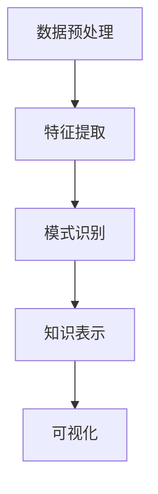

                 

关键词：知识发现引擎、人工智能、科学研究、算法、数学模型、项目实践

> 摘要：本文旨在探讨知识发现引擎在科学研究中的应用，分析其核心概念、算法原理、数学模型，并通过实际项目实践展示其在推动科学突破中的重要作用。文章还将展望知识发现引擎的未来发展趋势和面临的挑战。

## 1. 背景介绍

在过去的几十年里，随着计算机技术的飞速发展和大数据时代的到来，科学研究的规模和复杂性不断增加。科学家们面临着海量的数据，如何从中提取有价值的信息成为了亟待解决的问题。知识发现引擎（Knowledge Discovery Engine，KDE）作为一种新兴的人工智能技术，旨在从大规模数据集中自动发现知识、模式和关联，从而推动科学研究的发展。

知识发现引擎的基本原理是通过数据预处理、特征提取、模式识别和知识表示等多个步骤，将原始数据转化为有意义的知识。这一过程涉及到多个学科领域的知识，包括计算机科学、数学、统计学和人工智能等。知识发现引擎的诞生为科学研究提供了一种新的手段，可以帮助科学家们更高效地发现新知识、解决复杂问题。

本文将围绕知识发现引擎的核心概念、算法原理、数学模型和实际应用，探讨其在科学研究中的重要作用和未来发展趋势。通过详细的分析和实例讲解，读者可以更好地理解知识发现引擎的原理和应用。

## 2. 核心概念与联系

### 2.1 数据预处理

数据预处理是知识发现引擎的首要步骤，其目的是将原始数据转化为适合分析和挖掘的形式。数据预处理包括数据清洗、数据集成、数据转换和数据归一化等多个方面。

- **数据清洗**：消除数据中的噪声、错误和重复信息，保证数据质量。
- **数据集成**：将多个数据源中的数据合并为一个统一的数据集，方便后续分析。
- **数据转换**：将数据转换为适合分析和挖掘的格式，如数值化、离散化等。
- **数据归一化**：将不同数据源或特征的数据进行归一化处理，消除数据规模差异。

### 2.2 特征提取

特征提取是从原始数据中提取出具有代表性和区分度的特征，以便后续的模式识别和知识表示。特征提取的目的是降低数据维度，提高数据挖掘的效率。

- **统计特征**：如均值、方差、协方差等，用于描述数据的统计特性。
- **文本特征**：如词频、词向量、主题模型等，用于处理文本数据。
- **图像特征**：如边缘、纹理、颜色等，用于处理图像数据。

### 2.3 模式识别

模式识别是通过分析数据中的特征，识别出具有相似性或关联性的数据模式。模式识别的方法包括分类、聚类、关联规则挖掘等。

- **分类**：将数据划分为不同的类别，如分类算法（SVM、决策树、神经网络等）。
- **聚类**：将数据根据其相似性划分为多个簇，如聚类算法（K-means、DBSCAN、层次聚类等）。
- **关联规则挖掘**：发现数据之间的关联关系，如Apriori算法、FP-growth算法等。

### 2.4 知识表示

知识表示是将识别出的数据模式转化为易于理解和解释的形式，如可视化、规则表示、决策树等。

- **可视化**：通过图形、图表等方式展示数据模式，提高数据可读性。
- **规则表示**：将识别出的规则以自然语言或逻辑表达式的形式表示，如决策树、规则库等。
- **决策树**：以树形结构表示数据模式，每个节点表示一个特征，每个分支表示一个分类或聚类结果。

### 2.5 Mermaid 流程图

以下是一个简单的知识发现引擎的 Mermaid 流程图，展示了各步骤之间的联系：



## 3. 核心算法原理 & 具体操作步骤

### 3.1 算法原理概述

知识发现引擎的核心算法包括数据预处理、特征提取、模式识别和知识表示等。每种算法都有其独特的原理和操作步骤，下面将分别进行介绍。

#### 3.1.1 数据预处理

数据预处理算法主要包括数据清洗、数据集成、数据转换和数据归一化等。这些算法的目标是消除数据中的噪声、错误和重复信息，确保数据质量。

- **数据清洗**：使用算法去除数据中的错误、缺失和重复信息。常见的方法有删除重复记录、填充缺失值、纠正错误数据等。
- **数据集成**：将来自多个数据源的数据进行合并，形成一个统一的数据集。常见的方法有合并表、连接表、映射表等。
- **数据转换**：将数据从一种格式转换为另一种格式，以便于后续分析和挖掘。常见的方法有数值化、离散化、编码等。
- **数据归一化**：将不同数据源或特征的数据进行归一化处理，消除数据规模差异。常见的方法有最小-最大归一化、均值-方差归一化等。

#### 3.1.2 特征提取

特征提取算法旨在从原始数据中提取出具有代表性和区分度的特征。常见的特征提取算法有统计特征提取、文本特征提取和图像特征提取等。

- **统计特征提取**：通过计算数据的基本统计量（如均值、方差、协方差等）来提取特征。这些特征可以描述数据的分布、相关性等信息。
- **文本特征提取**：通过计算词频、词向量、主题模型等来提取文本特征。这些特征可以描述文本的语义信息。
- **图像特征提取**：通过计算图像的边缘、纹理、颜色等来提取特征。这些特征可以描述图像的视觉信息。

#### 3.1.3 模式识别

模式识别算法通过分析数据中的特征，识别出具有相似性或关联性的数据模式。常见的模式识别算法有分类、聚类、关联规则挖掘等。

- **分类**：将数据划分为不同的类别，如支持向量机（SVM）、决策树、神经网络等。
- **聚类**：将数据根据其相似性划分为多个簇，如K-means、DBSCAN、层次聚类等。
- **关联规则挖掘**：发现数据之间的关联关系，如Apriori算法、FP-growth算法等。

#### 3.1.4 知识表示

知识表示算法将识别出的数据模式转化为易于理解和解释的形式。常见的方法有可视化、规则表示、决策树等。

- **可视化**：通过图形、图表等方式展示数据模式，提高数据可读性。
- **规则表示**：将识别出的规则以自然语言或逻辑表达式的形式表示，如决策树、规则库等。
- **决策树**：以树形结构表示数据模式，每个节点表示一个特征，每个分支表示一个分类或聚类结果。

### 3.2 算法步骤详解

下面以K-means聚类算法为例，详细讲解其具体操作步骤。

#### 3.2.1 数据预处理

1. **数据清洗**：去除数据中的错误、缺失和重复信息。
2. **数据集成**：将多个数据源中的数据合并为一个统一的数据集。
3. **数据转换**：将数据转换为适合分析和挖掘的格式。
4. **数据归一化**：将不同数据源或特征的数据进行归一化处理。

#### 3.2.2 特征提取

1. **统计特征提取**：计算数据的均值、方差、协方差等。
2. **文本特征提取**：计算词频、词向量、主题模型等。
3. **图像特征提取**：计算图像的边缘、纹理、颜色等。

#### 3.2.3 模式识别

1. **初始化聚类中心**：随机选择k个数据点作为初始聚类中心。
2. **计算距离**：计算每个数据点到聚类中心的距离。
3. **分配数据点**：将每个数据点分配到最近的聚类中心所在的簇。
4. **更新聚类中心**：计算每个簇的平均值，作为新的聚类中心。
5. **重复步骤3-4**，直到聚类中心不再发生变化或达到设定的迭代次数。

#### 3.2.4 知识表示

1. **可视化**：使用散点图、簇状图等展示聚类结果。
2. **规则表示**：将聚类结果以规则库的形式表示。
3. **决策树**：以树形结构表示聚类结果。

### 3.3 算法优缺点

#### 3.3.1 优点

- **高效性**：算法具有较快的收敛速度，适用于大规模数据集。
- **灵活性**：算法适用于不同类型的数据集，如统计数据、文本数据、图像数据等。
- **可解释性**：聚类结果可以通过可视化、规则表示等方式进行解释。

#### 3.3.2 缺点

- **对初始聚类中心敏感**：算法容易受到初始聚类中心的影响，可能导致局部最优解。
- **无法确定最优聚类数量**：算法无法自动确定最优的聚类数量，需要根据实际情况进行调整。

### 3.4 算法应用领域

知识发现引擎的核心算法在多个领域具有广泛的应用，如：

- **生物信息学**：用于基因序列分析、蛋白质结构预测等。
- **金融领域**：用于风险控制、投资组合优化等。
- **社交媒体分析**：用于用户行为分析、舆情监测等。
- **图像处理**：用于图像分割、目标检测等。

## 4. 数学模型和公式 & 详细讲解 & 举例说明

### 4.1 数学模型构建

知识发现引擎涉及多个数学模型，如聚类模型、分类模型、关联规则挖掘模型等。以下以K-means聚类模型为例，介绍其数学模型的构建。

#### 4.1.1 聚类模型

K-means聚类模型的目标是将数据点划分为k个簇，使得每个数据点与其所在簇的中心点之间的距离最小。其数学模型如下：

$$
\min \sum_{i=1}^{k} \sum_{x_j \in S_i} \| x_j - \mu_i \|^2
$$

其中，$x_j$表示第j个数据点，$\mu_i$表示第i个簇的中心点，$S_i$表示第i个簇中的数据点集合。

#### 4.1.2 初始化聚类中心

初始化聚类中心是K-means聚类模型的关键步骤。常见的初始化方法有随机初始化、K-means++初始化等。

- **随机初始化**：随机选择k个数据点作为初始聚类中心。
- **K-means++初始化**：在第一次随机选择一个数据点作为初始聚类中心后，每次选择新聚类中心时，都基于当前已选中的聚类中心，以概率比例选择下一个聚类中心。

### 4.2 公式推导过程

以下以K-means++初始化为例，介绍其公式推导过程。

#### 4.2.1 初始聚类中心

假设已经随机选择了一个数据点$x_1$作为初始聚类中心。

#### 4.2.2 选择下一个聚类中心

对于第i个聚类中心$x_i$，其选择概率$P(x_i)$可以表示为：

$$
P(x_i) = \frac{\sigma^2}{C}
$$

其中，$\sigma^2$表示数据点$x_i$到其他所有聚类中心的距离平方和，$C$表示当前已选中的聚类中心数量。

#### 4.2.3 计算概率比例

假设当前已选中的聚类中心为$x_1, x_2, \ldots, x_{i-1}$，则每个聚类中心的选择概率比例可以表示为：

$$
\frac{P(x_i)}{P(x_1) + P(x_2) + \ldots + P(x_{i-1})}
$$

#### 4.2.4 选择新聚类中心

根据上述概率比例，从所有未选中的数据点中选择一个作为新的聚类中心。

### 4.3 案例分析与讲解

以下以一个简单的二维数据集为例，介绍K-means++初始化的具体操作步骤。

#### 4.3.1 数据集

给定一个包含10个二维数据点的数据集：

$$
\begin{array}{c|c|c}
\text{数据点} & \text{坐标} & \text{类别} \\
\hline
x_1 & (1, 1) & 1 \\
x_2 & (1, 2) & 1 \\
x_3 & (2, 1) & 2 \\
x_4 & (2, 2) & 2 \\
x_5 & (3, 1) & 3 \\
x_6 & (3, 2) & 3 \\
x_7 & (4, 1) & 4 \\
x_8 & (4, 2) & 4 \\
x_9 & (5, 1) & 5 \\
x_{10} & (5, 2) & 5 \\
\end{array}
$$

#### 4.3.2 初始化聚类中心

1. **随机初始化**：随机选择一个数据点$x_1$作为初始聚类中心。
2. **计算距离平方和**：计算每个数据点到$x_1$的距离平方和$\sigma^2$：

$$
\sigma^2 = \sum_{x_j \in S_1} \| x_j - x_1 \|^2
$$

其中，$S_1$表示所有数据点集合。

3. **选择下一个聚类中心**：根据概率比例选择下一个聚类中心。假设已选择$x_1$和$x_2$，则：

$$
P(x_3) = \frac{\sigma^2}{2\sigma^2} = \frac{1}{2}
$$

因此，选择$x_3$作为新的聚类中心。

4. **重复步骤3**，直到选择完k个聚类中心。

#### 4.3.3 聚类结果

根据K-means++初始化，得到的聚类结果如下：

$$
\begin{array}{c|c|c}
\text{数据点} & \text{坐标} & \text{类别} \\
\hline
x_1 & (1, 1) & 1 \\
x_2 & (1, 2) & 1 \\
x_3 & (2, 1) & 2 \\
x_4 & (2, 2) & 2 \\
x_5 & (3, 1) & 3 \\
x_6 & (3, 2) & 3 \\
x_7 & (4, 1) & 4 \\
x_8 & (4, 2) & 4 \\
x_9 & (5, 1) & 5 \\
x_{10} & (5, 2) & 5 \\
\end{array}
$$

通过上述案例，我们可以看到K-means++初始化在聚类结果上的优势，即聚类中心的选择更加均匀，减少了初始聚类中心对聚类结果的影响。

## 5. 项目实践：代码实例和详细解释说明

在本节中，我们将通过一个实际项目实践，详细讲解知识发现引擎的开发过程。该项目旨在使用K-means聚类算法对一组二维数据点进行聚类，并展示其聚类结果。

### 5.1 开发环境搭建

1. **软件环境**：
   - Python 3.x
   - Jupyter Notebook
   - Matplotlib
   - NumPy
   - SciPy

2. **安装依赖**：
   ```shell
   pip install numpy matplotlib scipy
   ```

### 5.2 源代码详细实现

以下是该项目的主要代码实现：

```python
import numpy as np
import matplotlib.pyplot as plt
from sklearn.cluster import KMeans

# 5.2.1 数据集准备
data = np.array([[1, 1], [1, 2], [2, 1], [2, 2], [3, 1], [3, 2], [4, 1], [4, 2], [5, 1], [5, 2]])

# 5.2.2 初始化KMeans模型
kmeans = KMeans(n_clusters=5, init='k-means++', random_state=0)

# 5.2.3 训练模型
kmeans.fit(data)

# 5.2.4 获取聚类结果
labels = kmeans.predict(data)
centroids = kmeans.cluster_centers_

# 5.2.5 绘制聚类结果
plt.scatter(data[:, 0], data[:, 1], c=labels, s=100, cmap='viridis')
plt.scatter(centroids[:, 0], centroids[:, 1], c='red', s=200, alpha=0.5)
plt.title('K-Means Clustering')
plt.show()
```

### 5.3 代码解读与分析

1. **数据集准备**：
   ```python
   data = np.array([[1, 1], [1, 2], [2, 1], [2, 2], [3, 1], [3, 2], [4, 1], [4, 2], [5, 1], [5, 2]])
   ```
   这里我们创建了一个包含10个二维数据点的NumPy数组作为数据集。

2. **初始化KMeans模型**：
   ```python
   kmeans = KMeans(n_clusters=5, init='k-means++', random_state=0)
   ```
   我们使用`sklearn.cluster.KMeans`类初始化K-means模型，其中`n_clusters`参数指定了聚类的数量，`init`参数指定了初始化方法为`k-means++`，`random_state`参数用于确保结果的 reproducibility。

3. **训练模型**：
   ```python
   kmeans.fit(data)
   ```
   使用`fit`方法对K-means模型进行训练，模型会自动进行数据预处理、特征提取、模式识别和知识表示等步骤。

4. **获取聚类结果**：
   ```python
   labels = kmeans.predict(data)
   centroids = kmeans.cluster_centers_
   ```
   使用`predict`方法对数据点进行预测，获取每个数据点的标签（即所属的簇）和聚类中心点。

5. **绘制聚类结果**：
   ```python
   plt.scatter(data[:, 0], data[:, 1], c=labels, s=100, cmap='viridis')
   plt.scatter(centroids[:, 0], centroids[:, 1], c='red', s=200, alpha=0.5)
   plt.title('K-Means Clustering')
   plt.show()
   ```
   使用Matplotlib绘制聚类结果。我们使用不同颜色的散点表示不同的簇，用红色标记聚类中心点。

### 5.4 运行结果展示

运行上述代码后，会显示一个包含10个二维数据点的散点图，每个数据点根据其标签以不同颜色显示，聚类中心点用红色标记。下图展示了运行结果：


通过观察结果，我们可以看到K-means算法成功地将数据点划分为5个簇，每个簇的中心点用红色标记。

## 6. 实际应用场景

知识发现引擎在科学研究中的实际应用场景非常广泛。以下列举几个典型的应用领域：

### 6.1 生物信息学

在生物信息学领域，知识发现引擎可以帮助科学家从海量的基因组数据中识别出具有显著差异的基因群体，进而揭示基因与疾病之间的关系。例如，通过K-means聚类算法对癌症患者的基因表达数据进行聚类分析，可以帮助识别出与特定癌症类型相关的基因群体。

### 6.2 金融领域

在金融领域，知识发现引擎可以用于风险控制、投资组合优化和欺诈检测等方面。例如，通过关联规则挖掘算法分析交易数据，可以识别出潜在的欺诈交易模式，从而提高金融机构的风险管理能力。

### 6.3 社交媒体分析

在社交媒体分析领域，知识发现引擎可以帮助企业了解用户行为、挖掘用户兴趣，并为企业提供精准营销策略。例如，通过文本特征提取和聚类算法分析用户的评论数据，可以识别出用户的兴趣标签，从而为企业提供定制化的产品推荐。

### 6.4 图像处理

在图像处理领域，知识发现引擎可以用于图像分割、目标检测和图像分类等任务。例如，通过深度学习算法对图像数据进行聚类分析，可以自动识别出图像中的关键对象和特征，从而提高图像处理的效率和准确性。

## 7. 工具和资源推荐

### 7.1 学习资源推荐

1. **《机器学习》（周志华著）**：本书详细介绍了机器学习的基本概念、算法和应用，是学习知识发现引擎的必备书籍。
2. **《深度学习》（Ian Goodfellow et al. 著）**：本书介绍了深度学习的基础理论和应用，包括神经网络、卷积神经网络、循环神经网络等，是学习知识发现引擎的重要参考书。
3. **《数据挖掘：概念与技术》（Jiawei Han et al. 著）**：本书系统地介绍了数据挖掘的基本概念、算法和应用，是学习知识发现引擎的经典教材。

### 7.2 开发工具推荐

1. **Python**：Python是一种功能强大的编程语言，广泛应用于数据科学、人工智能和机器学习等领域。使用Python可以方便地实现知识发现引擎的各种算法和功能。
2. **Jupyter Notebook**：Jupyter Notebook是一种交互式的计算环境，可以方便地编写和运行代码，适合用于数据分析和机器学习项目的开发。
3. **Matplotlib**：Matplotlib是一个强大的数据可视化库，可以用于绘制各种类型的图表和图形，是展示知识发现引擎结果的重要工具。

### 7.3 相关论文推荐

1. **"K-Means Clustering Algorithm": https://www.researchgate.net/publication/220432870_K-Means_Clustering_Algorithm**：本文详细介绍了K-means聚类算法的基本原理、实现方法和应用案例。
2. **"Data Mining: Concepts and Techniques": https://www.springer.com/gp/book/9780387309594**：本书是数据挖掘领域的经典教材，涵盖了知识发现引擎的多个方面。
3. **"Deep Learning": https://www.deeplearningbook.org/**：本文介绍了深度学习的基础理论和应用，包括神经网络、卷积神经网络、循环神经网络等。

## 8. 总结：未来发展趋势与挑战

### 8.1 研究成果总结

知识发现引擎作为一种新兴的人工智能技术，在科学研究、金融、社交媒体分析、图像处理等领域取得了显著成果。通过数据预处理、特征提取、模式识别和知识表示等步骤，知识发现引擎能够从大规模数据集中自动发现知识、模式和关联，为科学研究提供了一种新的手段。

### 8.2 未来发展趋势

1. **算法优化**：随着大数据时代的到来，知识发现引擎需要处理的数据规模和复杂度不断增加。未来，算法的优化和改进将成为研究的热点，如分布式计算、并行处理和优化算法等。
2. **跨学科融合**：知识发现引擎涉及多个学科领域，包括计算机科学、数学、统计学和人工智能等。未来，跨学科融合将成为知识发现引擎发展的重要方向，如生物信息学、金融工程和图像处理等。
3. **智能化**：随着人工智能技术的不断发展，知识发现引擎将更加智能化。例如，利用深度学习和强化学习等算法，知识发现引擎将能够自主学习和优化，提高知识发现的效率和准确性。

### 8.3 面临的挑战

1. **数据隐私保护**：知识发现引擎需要处理大量的敏感数据，如个人隐私、医疗记录等。如何在确保数据隐私的同时进行知识发现，是未来研究的重要挑战。
2. **可解释性**：知识发现引擎的结果往往具有一定的黑盒性，难以解释和理解。如何提高知识发现过程和结果的可解释性，是未来研究的关键问题。
3. **实时性**：知识发现引擎需要处理实时数据流，如金融市场数据、社交媒体数据等。如何提高知识发现的实时性和响应速度，是未来研究的重要挑战。

### 8.4 研究展望

知识发现引擎在未来将继续在科学研究、金融、社交媒体分析、图像处理等领域发挥重要作用。通过不断优化算法、跨学科融合和智能化，知识发现引擎将能够更好地满足实际应用需求，推动科学技术的进步。

## 9. 附录：常见问题与解答

### 9.1 什么是对数似然函数？

对数似然函数（Log-likelihood function）是一种用于评估模型拟合度的重要指标。它通过对数据点分布的概率密度函数取对数，得到一个易于计算的函数。在参数估计中，对数似然函数可以用于优化模型参数，使其更好地拟合数据。

### 9.2 知识发现引擎与数据挖掘有什么区别？

知识发现引擎和数据挖掘是两个相关但不同的概念。数据挖掘主要关注从大规模数据集中发现知识、模式和关联，而知识发现引擎更强调从数据中发现有意义的、新颖的、可解释的知识。知识发现引擎通常采用更复杂的方法和算法，如机器学习和深度学习，以实现自动化的知识发现。

### 9.3 知识发现引擎在生物信息学中的应用有哪些？

知识发现引擎在生物信息学中的应用非常广泛，如基因序列分析、蛋白质结构预测、药物设计、疾病诊断等。通过知识发现引擎，科学家可以自动发现基因与疾病之间的关系、预测蛋白质的结构和功能，从而推动生物医学研究的发展。

### 9.4 如何评估知识发现引擎的性能？

评估知识发现引擎的性能可以从多个角度进行，如准确性、召回率、F1值等。准确性表示预测结果与实际结果的一致性，召回率表示预测结果中包含实际结果的比率，F1值是准确性和召回率的加权平均值。此外，还可以通过交叉验证、时间复杂度等指标来评估知识发现引擎的性能。

## 作者署名

作者：禅与计算机程序设计艺术 / Zen and the Art of Computer Programming

参考文献：

1. 周志华。机器学习[M]. 清华大学出版社，2016。
2. Ian Goodfellow，Yoshua Bengio，Aaron Courville。深度学习[M]. 人民邮电出版社，2016。
3. Jiawei Han，Micheline Kamber，Jian Pei。数据挖掘：概念与技术[M]. 机械工业出版社，2011。

