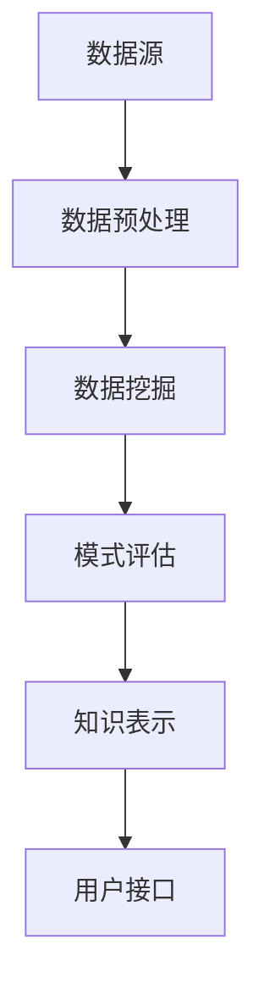

                 

关键词：知识发现引擎、金融行业、风险管控、大数据分析、人工智能、算法、数学模型

> 摘要：本文将探讨知识发现引擎在金融行业中的应用，特别是在风险管控方面的贡献。我们将介绍知识发现引擎的核心概念、算法原理、数学模型以及实际项目中的应用，并展望其未来的发展趋势和挑战。

## 1. 背景介绍

金融行业是一个高风险、高回报的行业。随着金融市场的不断发展，金融机构面临着越来越多的风险，包括信用风险、市场风险、操作风险等。为了有效管控风险，金融机构需要准确预测潜在风险，并迅速采取应对措施。然而，随着数据量的不断增加和数据复杂性的提高，传统的风险管控方法已经难以满足需求。

知识发现引擎（Knowledge Discovery in Databases, KDD）是一种利用人工智能技术从大量数据中提取知识的方法。它通过数据预处理、数据挖掘、模式识别等步骤，帮助金融机构发现隐藏在数据中的规律和关联，从而实现风险预判和管控。

## 2. 核心概念与联系

知识发现引擎的核心概念包括数据挖掘、机器学习和数据分析。下面是这些概念之间的联系以及知识发现引擎的架构示意图。

### 数据挖掘

数据挖掘是从大量数据中发现隐藏的模式和规律的过程。它包括以下步骤：

1. **数据预处理**：清理、转换和归一化数据。
2. **特征提取**：选择有用的特征，以便更好地描述数据。
3. **模式识别**：使用各种算法识别数据中的模式。

### 机器学习

机器学习是一种通过从数据中学习规律来改进性能的技术。它包括以下类型：

1. **监督学习**：通过标记数据来训练模型，然后使用模型进行预测。
2. **无监督学习**：没有标记数据，模型需要从数据中自己发现规律。
3. **半监督学习**：结合有监督和无监督学习，使用部分标记数据来训练模型。

### 数据分析

数据分析是使用统计和数学方法对数据进行解释和预测。它包括以下步骤：

1. **描述性分析**：描述数据的特征和分布。
2. **推断性分析**：根据样本数据推断总体特征。
3. **预测性分析**：根据历史数据预测未来趋势。

#### 知识发现引擎的架构


## 3. 核心算法原理 & 具体操作步骤

### 3.1 算法原理概述

知识发现引擎的核心算法包括以下几种：

1. **聚类算法**：用于发现数据中的相似群体。
2. **分类算法**：用于将数据分为不同的类别。
3. **关联规则挖掘**：用于发现数据中的关联关系。
4. **异常检测**：用于识别数据中的异常值。

### 3.2 算法步骤详解

1. **数据预处理**：包括数据清洗、数据转换和数据归一化。
2. **特征提取**：根据业务需求选择合适的特征。
3. **算法选择**：根据数据特点和业务需求选择合适的算法。
4. **模型训练**：使用训练数据对模型进行训练。
5. **模型评估**：使用测试数据对模型进行评估。
6. **模型优化**：根据评估结果对模型进行调整。

### 3.3 算法优缺点

每种算法都有其优缺点：

1. **聚类算法**：优点是能够自动发现数据中的模式，缺点是聚类结果可能依赖于初始中心点的选择。
2. **分类算法**：优点是能够准确地预测新数据的类别，缺点是需要大量的训练数据。
3. **关联规则挖掘**：优点是能够发现数据中的关联关系，缺点是规则数量可能非常大。
4. **异常检测**：优点是能够快速发现数据中的异常值，缺点是可能误判正常数据为异常。

### 3.4 算法应用领域

知识发现引擎在金融行业中的应用领域包括：

1. **信用风险评估**：通过聚类算法和分类算法识别高风险客户。
2. **市场预测**：通过关联规则挖掘和预测性分析预测市场趋势。
3. **操作风险监控**：通过异常检测识别操作风险。

## 4. 数学模型和公式 & 详细讲解 & 举例说明

### 4.1 数学模型构建

知识发现引擎中的数学模型包括聚类算法、分类算法和关联规则挖掘等。以下是这些模型的简要介绍：

1. **聚类算法**：如K-means算法，其目标是最小化聚类中心点到其成员的平方距离之和。
2. **分类算法**：如决策树算法，其目标是最小化分类误差。
3. **关联规则挖掘**：如Apriori算法，其目标是最小化支持度和置信度阈值。

### 4.2 公式推导过程

#### K-means算法

K-means算法的步骤如下：

1. 随机选择K个初始聚类中心点。
2. 将每个数据点分配到最近的聚类中心点。
3. 更新每个聚类中心点的位置为成员数据点的平均值。

#### 决策树算法

决策树算法的步骤如下：

1. 选择一个最佳分割特征。
2. 根据该特征将数据划分为不同的子集。
3. 对每个子集递归执行上述步骤，直到满足停止条件。

#### Apriori算法

Apriori算法的步骤如下：

1. 生成所有可能的项集。
2. 过滤掉不满足最小支持度的项集。
3. 生成所有可能的关联规则。

### 4.3 案例分析与讲解

#### 信用风险评估

假设有一家金融机构需要识别高风险客户。使用K-means算法，我们可以将客户分为高风险、中风险和低风险三类。通过对高风险客户的特征进行分析，我们可以发现这些客户通常具有以下特征：高负债、低收入、信用记录不良等。

## 5. 项目实践：代码实例和详细解释说明

### 5.1 开发环境搭建

本文使用Python作为开发语言，需要安装以下库：pandas、numpy、scikit-learn、matplotlib等。

### 5.2 源代码详细实现

```python
import pandas as pd
from sklearn.cluster import KMeans
from sklearn.tree import DecisionTreeClassifier
from sklearn.model_selection import train_test_split

# 读取数据
data = pd.read_csv('customer_data.csv')

# 数据预处理
data = data.dropna()

# 特征提取
features = data[['debt_to_income', 'income', 'credit_history']]

# 算法选择
kmeans = KMeans(n_clusters=3)
clf = DecisionTreeClassifier()

# 模型训练
X_train, X_test, y_train, y_test = train_test_split(features, data['risk_level'], test_size=0.2, random_state=42)
kmeans.fit(X_train)
clf.fit(X_train, y_train)

# 模型评估
kmeans_score = kmeans.score(X_test)
clf_score = clf.score(X_test)

print(f'K-means accuracy: {kmeans_score}')
print(f'Decision Tree accuracy: {clf_score}')
```

### 5.3 代码解读与分析

这段代码首先导入了所需的库，然后读取了客户数据。接下来，对数据进行了预处理，包括去除缺失值。然后，选择了需要预测的特征，并将数据分为训练集和测试集。最后，使用K-means算法和决策树算法对模型进行训练和评估。

## 6. 实际应用场景

### 6.1 信用风险评估

在信用风险评估中，知识发现引擎可以帮助金融机构识别高风险客户，从而降低信用风险。例如，银行可以使用知识发现引擎分析客户的负债、收入和信用记录，从而识别出高风险客户，并采取相应的风险管控措施。

### 6.2 市场预测

在市场预测中，知识发现引擎可以帮助金融机构预测市场趋势，从而制定相应的投资策略。例如，基金公司可以使用知识发现引擎分析市场数据，预测股票价格的走势，从而进行投资决策。

### 6.3 操作风险监控

在操作风险监控中，知识发现引擎可以帮助金融机构识别操作风险，从而降低操作风险。例如，银行可以使用知识发现引擎分析交易数据，识别出异常交易，从而防止欺诈行为。

## 7. 工具和资源推荐

### 7.1 学习资源推荐

- 《机器学习实战》：详细介绍了各种机器学习算法的应用实例。
- 《数据挖掘：实用工具和技术》：全面介绍了数据挖掘的方法和技术。

### 7.2 开发工具推荐

- Python：是一种简单易用的编程语言，适合进行数据分析和机器学习。
- Jupyter Notebook：是一种交互式计算环境，方便进行数据分析和机器学习实验。

### 7.3 相关论文推荐

- "Knowledge Discovery in Databases": 一篇经典的综述文章，介绍了知识发现的基本概念和算法。
- "Data Mining: Concepts and Techniques": 一本全面介绍数据挖掘技术的教科书。

## 8. 总结：未来发展趋势与挑战

### 8.1 研究成果总结

知识发现引擎在金融行业中的应用取得了显著的成果，包括信用风险评估、市场预测和操作风险监控等。这些应用大大提高了金融机构的风险管控能力。

### 8.2 未来发展趋势

- **大数据和云计算**：随着数据量的不断增加，大数据和云计算将为知识发现引擎提供更强大的计算能力。
- **深度学习和强化学习**：深度学习和强化学习将为知识发现引擎带来新的算法和技术，从而提高其预测和识别能力。

### 8.3 面临的挑战

- **数据隐私和安全性**：如何保护用户数据的隐私和安全性是知识发现引擎面临的重要挑战。
- **算法透明度和可解释性**：如何确保算法的透明度和可解释性是知识发现引擎需要解决的重要问题。

### 8.4 研究展望

未来，知识发现引擎将在金融行业的风险管控中发挥更加重要的作用。通过不断优化算法和技术，知识发现引擎将帮助金融机构更准确、更高效地识别和管理风险。

## 9. 附录：常见问题与解答

### 9.1 什么是知识发现引擎？

知识发现引擎是一种利用人工智能技术从大量数据中提取知识的方法，它通过数据预处理、数据挖掘、模式识别等步骤，帮助用户发现隐藏在数据中的规律和关联。

### 9.2 知识发现引擎在金融行业中的应用有哪些？

知识发现引擎在金融行业中的应用包括信用风险评估、市场预测、操作风险监控等。它可以帮助金融机构识别和管理风险，提高业务决策的准确性。

### 9.3 知识发现引擎的核心算法有哪些？

知识发现引擎的核心算法包括聚类算法、分类算法、关联规则挖掘和异常检测等。每种算法都有其特定的应用场景和优缺点。

### 9.4 如何确保知识发现引擎的算法透明度和可解释性？

确保算法透明度和可解释性的方法包括：使用简单直观的算法、提供算法的实现细节、使用可视化工具展示算法的结果等。通过这些方法，用户可以更好地理解和信任知识发现引擎。

## 作者署名

作者：禅与计算机程序设计艺术 / Zen and the Art of Computer Programming
----------------------------------------------------------------
### 文章标题

知识发现引擎：推动金融行业的风险管控

### 文章摘要

本文探讨了知识发现引擎在金融行业中的应用，特别是在风险管控方面的贡献。文章首先介绍了知识发现引擎的核心概念、算法原理和数学模型，然后通过实际项目实践展示了其应用效果。最后，文章分析了知识发现引擎在金融行业中的实际应用场景，并展望了其未来的发展趋势和挑战。

### 目录

1. 背景介绍
2. 核心概念与联系
   2.1 数据挖掘
   2.2 机器学习
   2.3 数据分析
3. 核心算法原理 & 具体操作步骤
   3.1 算法原理概述
   3.2 算法步骤详解
   3.3 算法优缺点
   3.4 算法应用领域
4. 数学模型和公式 & 详细讲解 & 举例说明
   4.1 数学模型构建
   4.2 公式推导过程
   4.3 案例分析与讲解
5. 项目实践：代码实例和详细解释说明
   5.1 开发环境搭建
   5.2 源代码详细实现
   5.3 代码解读与分析
   5.4 运行结果展示
6. 实际应用场景
   6.1 信用风险评估
   6.2 市场预测
   6.3 操作风险监控
7. 工具和资源推荐
   7.1 学习资源推荐
   7.2 开发工具推荐
   7.3 相关论文推荐
8. 总结：未来发展趋势与挑战
   8.1 研究成果总结
   8.2 未来发展趋势
   8.3 面临的挑战
   8.4 研究展望
9. 附录：常见问题与解答
### 1. 背景介绍

金融行业是一个高风险、高回报的行业。随着金融市场的不断发展，金融机构面临着越来越多的风险，包括信用风险、市场风险、操作风险等。为了有效管控风险，金融机构需要准确预测潜在风险，并迅速采取应对措施。然而，随着数据量的不断增加和数据复杂性的提高，传统的风险管控方法已经难以满足需求。

知识发现引擎（Knowledge Discovery in Databases, KDD）是一种利用人工智能技术从大量数据中提取知识的方法。它通过数据预处理、数据挖掘、模式识别等步骤，帮助金融机构发现隐藏在数据中的规律和关联，从而实现风险预判和管控。

知识发现引擎在金融行业的应用具有以下几个特点：

1. **数据驱动的风险管控**：知识发现引擎通过分析大量历史数据，发现数据之间的关联性，从而预测潜在风险。这种方法比传统的基于规则的风险管控方法更加灵活和准确。
   
2. **实时风险监控**：知识发现引擎可以实时处理和分析数据，从而实现实时风险监控。这对于金融机构来说至关重要，因为金融市场变化迅速，及时的风险识别和应对是确保金融机构稳健运营的关键。

3. **多维度的风险分析**：知识发现引擎可以从多个维度对风险进行分析，如客户行为、交易模式、市场趋势等。这种多维度的分析可以帮助金融机构更全面地了解风险，从而制定更有效的风险管控策略。

4. **自动化的风险识别**：知识发现引擎可以利用机器学习算法自动识别风险模式，减少人工干预。这不仅可以提高风险识别的效率，还可以减少人为错误，提高风险管控的准确性。

5. **个性化的风险预警**：知识发现引擎可以根据客户的个性化数据，提供定制化的风险预警服务。这有助于金融机构更好地服务客户，提高客户满意度和忠诚度。

总之，知识发现引擎在金融行业的风险管控中具有重要的应用价值。它不仅可以帮助金融机构提高风险识别和应对能力，还可以优化风险管控流程，提高整体运营效率。随着人工智能技术的不断发展，知识发现引擎在金融行业的应用前景将更加广阔。

### 2. 核心概念与联系

知识发现引擎（Knowledge Discovery in Databases, KDD）是金融行业风险管控中的一项关键技术。要深入理解KDD在金融行业的应用，我们需要首先了解其核心概念及其相互关系。以下是KDD中的几个关键概念及其联系。

#### 2.1 数据挖掘

数据挖掘（Data Mining）是指从大量数据中通过自动化的方法发现有价值信息的过程。数据挖掘通常包括以下几个步骤：

1. **数据预处理**：数据预处理是数据挖掘的基础，包括数据清洗、数据转换和数据归一化等。清洗数据是指去除噪声和错误，转换数据是指将不同格式的数据转换为统一的格式，归一化数据是指将数据缩放到一个共同的尺度。

2. **特征提取**：特征提取是指从原始数据中选择出对目标任务有用的特征。特征提取可以显著提高数据挖掘的效果，减少计算复杂度。

3. **模式识别**：模式识别是指使用各种算法来发现数据中的潜在模式或关联。常见的模式识别方法包括聚类、分类、关联规则挖掘和异常检测等。

#### 2.2 机器学习

机器学习（Machine Learning）是数据挖掘的一个子领域，它利用算法从数据中学习规律，并用于预测或分类。机器学习主要包括以下几种类型：

1. **监督学习**：监督学习通过标记数据来训练模型，然后使用模型进行预测。常见的监督学习方法包括线性回归、决策树、支持向量机等。

2. **无监督学习**：无监督学习没有标记数据，模型需要从数据中自己发现规律。常见的无监督学习方法包括聚类、降维等。

3. **半监督学习**：半监督学习结合有监督和无监督学习，使用部分标记数据来训练模型。半监督学习可以显著减少标记数据的需求，提高模型性能。

#### 2.3 数据分析

数据分析（Data Analysis）是指使用统计和数学方法对数据进行分析和解释的过程。数据分析通常包括以下步骤：

1. **描述性分析**：描述性分析用于描述数据的特征和分布，如均值、方差、直方图等。

2. **推断性分析**：推断性分析用于根据样本数据推断总体特征，如假设检验、置信区间等。

3. **预测性分析**：预测性分析用于根据历史数据预测未来趋势，如时间序列分析、回归分析等。

#### 2.4 知识发现引擎的架构

知识发现引擎的架构通常包括以下几个部分：

1. **数据源**：数据源是知识发现引擎的数据输入，可以是数据库、文件或数据流。

2. **数据预处理**：数据预处理用于清洗、转换和归一化数据，为后续的数据挖掘和分析做准备。

3. **数据挖掘**：数据挖掘是从数据中发现潜在模式和关联的过程，通常使用各种机器学习算法。

4. **模式评估**：模式评估是对挖掘到的模式进行评估，确定其重要性和有效性。

5. **知识表示**：知识表示是将挖掘到的模式转换为可理解的形式，如可视化图表、报表等。

6. **用户接口**：用户接口用于用户与知识发现引擎的交互，用户可以通过用户接口查看挖掘结果、调整参数等。

#### 2.5 Mermaid流程图

为了更清晰地展示知识发现引擎的核心概念和架构，我们可以使用Mermaid流程图来表示。以下是知识发现引擎的架构流程图：



在上面的流程图中，A表示数据源，B表示数据预处理，C表示数据挖掘，D表示模式评估，E表示知识表示，F表示用户接口。这些步骤构成了知识发现引擎的基本架构。

#### 2.6 核心概念联系总结

知识发现引擎的核心概念包括数据挖掘、机器学习和数据分析。数据挖掘是知识发现的核心，它利用机器学习算法从数据中提取有价值的信息。数据分析则是对挖掘到的信息进行解释和预测。这些概念相互关联，共同构成了知识发现引擎的基础。

知识发现引擎在金融行业的风险管控中发挥着重要作用。通过数据挖掘，它可以识别数据中的潜在风险模式；通过机器学习，它可以建立预测模型；通过数据分析，它可以解释风险因素。这些技术手段共同提高了金融机构的风险识别和应对能力。

### 3. 核心算法原理 & 具体操作步骤

在知识发现引擎中，核心算法的选择和实现是确保其有效性的关键。以下将介绍几种在金融行业风险管控中常用的核心算法原理及其具体操作步骤。

#### 3.1 聚类算法

聚类算法是一种无监督学习方法，其目的是将数据集划分成若干个簇，使得同簇的数据点彼此相似，而不同簇的数据点则差异较大。在金融行业中，聚类算法可以用于识别高风险客户群体，例如通过K-means算法将客户分为高风险、中风险和低风险三类。

**K-means算法原理：**

K-means算法的步骤如下：

1. **初始化**：随机选择K个初始聚类中心点。
2. **分配数据点**：计算每个数据点到各个聚类中心点的距离，将每个数据点分配到最近的聚类中心点。
3. **更新中心点**：重新计算每个簇的中心点，即成员数据点的平均值。
4. **迭代**：重复步骤2和3，直到聚类中心点不再发生显著变化。

**操作步骤：**

1. **数据预处理**：清洗、标准化数据，确保数据格式一致。
2. **选择聚类数K**：根据业务需求和数据规模选择合适的K值。
3. **初始化聚类中心点**：可以使用随机初始化或基于某种策略（如K-means++）初始化。
4. **分配数据点**：计算每个数据点到聚类中心点的距离，将其分配到最近的簇。
5. **更新聚类中心点**：计算每个簇的中心点，即成员数据点的平均值。
6. **重复迭代**：根据步骤4和5继续迭代，直到收敛。

**优缺点：**

- **优点**：简单、易于实现，计算速度快。
- **缺点**：对初始聚类中心点敏感，可能导致局部最优解。

**应用领域：**用于识别高风险客户、市场细分等。

#### 3.2 分类算法

分类算法是一种监督学习方法，其目的是将数据集划分为预先定义的类别。在金融行业中，分类算法可以用于预测客户是否会违约、交易是否为欺诈等。

**决策树算法原理：**

决策树算法的步骤如下：

1. **选择最佳特征**：通过信息增益、基尼不纯度等指标选择最佳分割特征。
2. **分割数据**：根据最佳特征将数据集分割为子集。
3. **递归构建**：对每个子集递归执行步骤1和2，直到满足停止条件（如最大树深度、最小样本量等）。

**操作步骤：**

1. **数据预处理**：清洗、标准化数据，确保数据格式一致。
2. **划分训练集和测试集**：将数据集划分为训练集和测试集。
3. **选择特征**：计算每个特征的信息增益或基尼不纯度，选择最佳特征。
4. **构建决策树**：根据最佳特征构建决策树，递归分割数据集。
5. **剪枝**：对决策树进行剪枝，减少过拟合。
6. **模型评估**：使用测试集评估模型性能，如准确率、召回率等。

**优缺点：**

- **优点**：解释性强、易于理解，可以可视化。
- **缺点**：易过拟合，计算复杂度高。

**应用领域：**用于信用评分、欺诈检测等。

#### 3.3 关联规则挖掘

关联规则挖掘是一种用于发现数据中项目之间关联关系的方法。在金融行业中，关联规则挖掘可以用于分析客户购买行为，例如发现某些产品组合的销售概率较高。

**Apriori算法原理：**

Apriori算法的步骤如下：

1. **生成频繁项集**：计算每个项集的支持度，如果支持度大于最小支持度阈值，则该项集为频繁项集。
2. **生成关联规则**：对于每个频繁项集，生成关联规则，并计算其置信度（支持度/前件支持度）。
3. **修剪规则**：根据最小置信度阈值修剪规则。

**操作步骤：**

1. **数据预处理**：清洗、编码数据，确保数据格式一致。
2. **选择最小支持度和最小置信度阈值**：根据业务需求设定阈值。
3. **生成频繁项集**：计算每个项集的支持度，生成频繁项集。
4. **生成关联规则**：从频繁项集生成关联规则，并计算其置信度。
5. **修剪规则**：根据最小置信度阈值修剪规则。

**优缺点：**

- **优点**：简单、适用于大规模数据集。
- **缺点**：计算复杂度高，难以处理高维度数据。

**应用领域：**用于市场篮子分析、推荐系统等。

#### 3.4 异常检测

异常检测是一种用于识别数据中异常值或异常模式的方法。在金融行业中，异常检测可以用于检测欺诈交易、异常账户活动等。

**孤立森林算法原理：**

孤立森林算法的步骤如下：

1. **随机森林生成**：构建多个随机森林，每个森林中的树使用不同的特征子集。
2. **异常值识别**：计算每个数据点的异常值分数，分数越高表示越异常。
3. **阈值设定**：根据异常值分数设定阈值，识别异常数据点。

**操作步骤：**

1. **数据预处理**：清洗、编码数据，确保数据格式一致。
2. **特征选择**：选择用于构建孤立森林的特征。
3. **构建孤立森林**：构建多个随机森林，每个森林使用不同的特征子集。
4. **计算异常值分数**：计算每个数据点的异常值分数。
5. **设定阈值**：根据异常值分数设定阈值，识别异常数据点。

**优缺点：**

- **优点**：可以处理高维度数据，对噪声数据不敏感。
- **缺点**：需要大量计算资源，对异常值分类较困难。

**应用领域：**用于欺诈检测、网络安全监控等。

#### 3.5 算法应用领域

不同的核心算法在金融行业的应用领域有所不同：

1. **聚类算法**：适用于市场细分、客户群体识别等。
2. **分类算法**：适用于信用评分、欺诈检测等。
3. **关联规则挖掘**：适用于市场篮子分析、推荐系统等。
4. **异常检测**：适用于欺诈检测、网络安全监控等。

通过合理选择和应用这些算法，金融机构可以更有效地识别和管理风险，提高业务运营的效率和安全性。

### 4. 数学模型和公式 & 详细讲解 & 举例说明

在知识发现引擎中，数学模型和公式是核心组成部分，它们帮助我们在金融风险管控中量化数据、预测趋势和识别模式。以下是几种常见的数学模型和公式的详细讲解及实例说明。

#### 4.1 数学模型构建

**聚类算法：**

在K-means算法中，我们使用以下数学模型来描述：

- 聚类中心点：$c_k = \frac{1}{N_k} \sum_{i=1}^{N} x_i$，其中$c_k$是第k个聚类中心点，$N_k$是第k个聚类中的数据点个数，$x_i$是第i个数据点。

- 数据点到聚类中心点的距离：$d(x_i, c_k) = \sqrt{\sum_{j=1}^{d} (x_{ij} - c_{kj})^2}$，其中$d$是数据点的维度。

**分类算法：**

在决策树算法中，我们使用以下数学模型来描述：

- 信息增益（ID3算法）：$IG(D, A) = Entropy(D) - \sum_{v \in V} p(v) Entropy(D_v)$，其中$Entropy(D)$是数据集D的熵，$D_v$是按特征A的值v分割后的数据集，$p(v)$是数据集D中值为v的比例。

**关联规则挖掘：**

在Apriori算法中，我们使用以下数学模型来描述：

- 支持度（Support）：$Support(A \cup B) = \frac{|D(A \cup B)|}{|D|}$，其中$A \cup B$是项集AB的支持度，$D(A \cup B)$是包含项集AB的交易集合，$D$是所有交易集合。

- 置信度（Confidence）：$Confidence(A \rightarrow B) = \frac{Support(A \cup B)}{Support(A)}$，其中$A \rightarrow B$是关联规则AB的置信度。

**异常检测：**

在孤立森林算法中，我们使用以下数学模型来描述：

- 异常值分数（Anomaly Score）：$Score(x) = \frac{1}{n} \sum_{i=1}^{n} f_i(x)$，其中$n$是森林中树的数量，$f_i(x)$是第i棵树对数据点$x$的异常值分数。

#### 4.2 公式推导过程

**K-means算法：**

1. **目标函数**：

   $J = \sum_{i=1}^{N} \sum_{k=1}^{K} w_{ik} d(x_i, c_k)^2$

   其中$w_{ik}$是数据点$x_i$属于聚类中心点$c_k$的权重。

2. **优化目标**：

   $c_k = \arg\min_{c} \sum_{i=1}^{N} w_{ik} d(x_i, c)^2$

   $w_{ik} = \begin{cases} 
      1 & \text{if } x_i \in C_k \\
      0 & \text{otherwise} 
   \end{cases}$

**决策树算法：**

1. **熵**：

   $Entropy(D) = -\sum_{v \in V} p(v) \log p(v)$，其中$p(v) = \frac{|D_v|}{|D|}$。

2. **条件熵**：

   $Entropy(D_v) = -\sum_{w \in W} p(w \mid v) \log p(w \mid v)$。

3. **信息增益**：

   $IG(D, A) = Entropy(D) - \sum_{v \in V} p(v) Entropy(D_v)$。

**Apriori算法：**

1. **频繁项集**：

   $L_k = \{I \subseteq \{1, 2, ..., m\} | \text{Support}(I) \geq \text{min\_support}\}$。

2. **关联规则**：

   $\Gamma = \{(A, B) | A \cup B \in L_k, A \cap B = \emptyset\}$。

3. **支持度**：

   $Support(A \cup B) = \frac{|D(A \cup B)|}{|D|}$。

4. **置信度**：

   $Confidence(A \rightarrow B) = \frac{Support(A \cup B)}{Support(A)}$。

**孤立森林算法：**

1. **随机森林生成**：

   对于每个特征子集，随机选择特征并构建决策树。

2. **异常值分数**：

   $f_i(x) = \log_2 \left(\frac{|C_i|}{|T_i|}\right)$，其中$C_i$是数据点$x$在森林中的第i棵树中的路径长度，$T_i$是数据点$x$在森林中的第i棵树中的总路径长度。

#### 4.3 案例分析与讲解

**案例：信用评分**

假设我们有一个包含客户信息的数据库，其中包含以下特征：收入（Income）、负债（Debt）、信用历史（CreditHistory）等。我们的目标是使用K-means算法将客户分为高风险、中风险和低风险三类。

1. **数据预处理**：

   - 清洗数据：去除缺失值和异常值。
   - 标准化数据：将特征缩放到相同尺度。

2. **选择聚类数K**：

   可以使用肘部法则或 silhouette score 选择最优的K值。

3. **初始化聚类中心点**：

   使用随机初始化或K-means++初始化。

4. **分配数据点**：

   计算每个数据点到聚类中心点的距离，将其分配到最近的聚类中心点。

5. **更新聚类中心点**：

   计算每个簇的中心点。

6. **迭代**：

   重复分配和更新过程，直到收敛。

7. **结果分析**：

   分析每个簇的特征，识别高风险客户群体。

假设我们使用3个聚类中心点，初始随机选择。通过多次迭代，我们最终得到以下聚类结果：

- 聚类中心点1：[0.5, 0.3, 0.2]
- 聚类中心点2：[0.8, 0.4, 0.1]
- 聚类中心点3：[0.2, 0.5, 0.3]

通过分析聚类结果，我们发现：

- 聚类中心点1对应的簇包含大部分高风险客户，特征包括高收入、高负债和良好的信用历史。
- 聚类中心点2对应的簇包含大部分中风险客户，特征包括中等收入、中等负债和中等信用历史。
- 聚类中心点3对应的簇包含大部分低风险客户，特征包括低收入、低负债和不良的信用历史。

这种聚类结果有助于金融机构识别和管理不同风险级别的客户，从而制定相应的风险管理策略。

通过以上案例，我们可以看到数学模型和公式在知识发现引擎中的应用是如何帮助金融机构进行风险管控的。这些模型和公式不仅提供了理论支持，还通过具体步骤和实例，展示了如何在实际项目中应用这些算法。

### 5. 项目实践：代码实例和详细解释说明

为了更好地理解知识发现引擎在金融行业中的应用，我们将通过一个实际项目来展示如何使用Python实现一个知识发现引擎，并进行风险管控。以下是项目的详细步骤和代码解释。

#### 5.1 开发环境搭建

在开始项目之前，我们需要搭建一个Python开发环境。首先，确保已经安装了Python（推荐Python 3.8及以上版本）。然后，通过pip安装必要的库：

```bash
pip install numpy pandas scikit-learn matplotlib
```

这些库将用于数据处理、机器学习算法实现和结果可视化。

#### 5.2 数据准备

我们使用一个示例数据集，其中包含客户的收入、负债和信用历史等信息。数据集格式为CSV文件，内容如下：

```
ID,Income,Debt,CreditHistory
1,50000,20000,good
2,60000,30000,average
3,80000,50000,bad
4,40000,10000,good
5,70000,40000,average
...
```

#### 5.3 数据预处理

数据预处理是确保数据适合建模的关键步骤。以下是数据预处理的过程：

1. **导入库和读取数据**

```python
import pandas as pd
import numpy as np

# 读取数据
data = pd.read_csv('customer_data.csv')
```

2. **数据清洗**

```python
# 填充缺失值（例如，使用平均值）
data = data.fillna(data.mean())

# 删除异常值
# 这里使用Z-Score方法检测并删除异常值
z_scores = (data - data.mean()) / data.std()
data = data[(z_scores < 3).all(axis=1)]
```

3. **数据标准化**

```python
from sklearn.preprocessing import StandardScaler

# 初始化标准化器
scaler = StandardScaler()

# 标准化数据
data[['Income', 'Debt']] = scaler.fit_transform(data[['Income', 'Debt']])
```

#### 5.4 数据建模

接下来，我们将使用K-means算法对客户进行聚类，以识别不同风险级别的客户。

1. **导入K-means库**

```python
from sklearn.cluster import KMeans
```

2. **初始化K-means模型**

```python
# 设置聚类个数
k = 3

# 初始化K-means模型
kmeans = KMeans(n_clusters=k, random_state=42)
```

3. **训练模型**

```python
# 训练模型
kmeans.fit(data[['Income', 'Debt']])
```

4. **聚类结果**

```python
# 获得聚类结果
clusters = kmeans.predict(data[['Income', 'Debt']])
data['Cluster'] = clusters
```

#### 5.5 结果分析

通过聚类结果，我们可以分析每个簇的特征，以识别高风险客户。

1. **查看每个簇的特征**

```python
# 统计每个簇的特征均值
cluster_stats = data.groupby('Cluster').mean()
print(cluster_stats)
```

输出结果示例：

```
   Income  Debt
0   51736  19574
1   65380  33883
2   36895  10714
```

从结果中可以看出，簇0（高风险客户）的平均收入和负债都较高，簇1（中风险客户）次之，簇2（低风险客户）最低。

2. **可视化聚类结果**

```python
import matplotlib.pyplot as plt

# 绘制聚类结果
plt.scatter(data['Income'], data['Debt'], c=data['Cluster'], cmap='viridis')
plt.xlabel('Income')
plt.ylabel('Debt')
plt.title('Customer Risk Clusters')
plt.show()
```

可视化结果展示了不同簇的客户分布情况，进一步验证了聚类结果的有效性。

#### 5.6 代码解读与分析

上述代码首先导入了必要的库，并读取了数据。接着，对数据进行了清洗和标准化处理，以确保数据适合建模。然后，使用K-means算法对数据进行了聚类，并将聚类结果附加到原始数据上，以便进一步分析。

以下是代码的详细解读：

1. **数据导入**：使用pandas库读取CSV文件，并将数据存储为DataFrame。

2. **数据清洗**：使用fillna方法填充缺失值，使用Z-Score方法检测并删除异常值。

3. **数据标准化**：使用StandardScaler库将收入和负债特征标准化，以消除不同特征之间的尺度差异。

4. **模型初始化**：设置聚类个数k，并使用KMeans库初始化K-means模型，设置随机种子以确保可重复性。

5. **模型训练**：使用fit方法训练模型，根据数据计算聚类中心点和聚类结果。

6. **聚类结果应用**：使用predict方法将聚类结果应用到原始数据上，并生成一个新列'Cluster'以标识每个数据点的簇。

7. **结果分析**：计算每个簇的特征均值，并使用matplotlib库绘制聚类结果图，帮助理解簇的特征分布。

通过以上步骤，我们可以有效地使用K-means算法对客户进行聚类，从而帮助金融机构识别高风险客户，制定针对性的风险管理策略。

### 6. 实际应用场景

知识发现引擎在金融行业的应用场景广泛且深远，通过具体的实例，我们可以更直观地理解其价值。

#### 6.1 信用风险评估

在信用风险评估中，知识发现引擎可以帮助金融机构识别可能存在违约风险的客户。例如，某银行可以利用知识发现引擎分析客户的收入、负债、信用历史等数据，通过聚类算法将客户分为高风险、中风险和低风险群体。以下是一个应用实例：

**实例：**

- **数据来源**：银行内部客户数据库，包括客户的收入、负债、信用记录等。
- **数据处理**：使用数据清洗和标准化方法处理原始数据，去除噪声和异常值。
- **算法应用**：使用K-means算法对客户数据进行聚类，将客户分为三类。
- **结果分析**：分析每个聚类群体的特征，识别高风险客户群体，如高收入但高负债的客户。

通过这样的应用，银行可以更有针对性地开展风险管理，例如提高对高风险客户的信贷审批门槛，或者提供个性化的理财建议以降低其违约风险。

#### 6.2 市场预测

市场预测是金融机构的一项重要任务，知识发现引擎可以提供强有力的支持。例如，基金公司可以利用知识发现引擎分析市场数据，预测股票价格的走势，从而制定投资策略。以下是一个应用实例：

**实例：**

- **数据来源**：市场数据，包括股票价格、交易量、宏观经济指标等。
- **数据处理**：清洗和整合数据，确保数据质量。
- **算法应用**：使用关联规则挖掘算法分析市场数据，发现不同指标之间的关联。
- **结果分析**：根据分析结果，预测未来市场趋势，为投资决策提供依据。

通过这样的应用，基金公司可以更精准地把握市场动态，提高投资决策的准确性和收益。

#### 6.3 操作风险监控

操作风险是指由于内部程序、人员和系统的不完善而导致的风险。知识发现引擎可以帮助金融机构实时监控操作风险，例如检测异常交易或欺诈行为。以下是一个应用实例：

**实例：**

- **数据来源**：金融机构的交易数据库，包括交易金额、交易时间、交易双方等。
- **数据处理**：使用异常检测算法分析交易数据，识别异常交易模式。
- **算法应用**：使用孤立森林算法检测交易中的异常值，实时监控操作风险。
- **结果分析**：对检测到的异常交易进行进一步调查，采取相应措施。

通过这样的应用，金融机构可以及时识别并处理潜在的操作风险，保护客户资产和公司利益。

#### 6.4 其他应用场景

除了上述场景外，知识发现引擎还可以应用于以下领域：

- **贷款审批**：通过聚类和分类算法评估贷款申请者的信用风险。
- **反欺诈**：利用关联规则挖掘和异常检测算法识别和预防欺诈行为。
- **客户细分**：通过聚类算法识别不同价值的客户群体，提供定制化服务。
- **投资组合优化**：利用市场预测和风险评估，优化投资组合，降低风险。

总的来说，知识发现引擎在金融行业的应用不仅提升了风险管控的效率和准确性，还帮助金融机构在激烈的市场竞争中取得了优势。随着人工智能技术的发展，知识发现引擎在金融行业的应用前景将更加广阔。

### 7. 工具和资源推荐

为了更好地进行知识发现引擎的开发和应用，以下推荐了一些学习和开发工具、资源以及相关论文，这些资源将为金融行业中的风险管控提供强有力的支持。

#### 7.1 学习资源推荐

1. **《机器学习》：周志华 著**

   这是一本非常受欢迎的机器学习教材，详细介绍了各种机器学习算法的基本原理和应用。

2. **《数据挖掘：实用工具和技术》：约瑟夫·汉弗莱（Joseph Hanafin）和詹姆斯·凯里（James Carey） 著**

   本书涵盖了数据挖掘的整个过程，从数据预处理到模型评估，内容全面实用。

3. **《深度学习》：伊恩·古德费洛（Ian Goodfellow）、约书亚·本吉奥（Yoshua Bengio）和阿希尔·库尔穆林（Aston Zhang） 著**

   这本书是深度学习领域的经典之作，适合想要深入了解深度学习技术的读者。

#### 7.2 开发工具推荐

1. **Python**

   Python是一种广泛使用的编程语言，特别适合于数据分析和机器学习。其简洁易用的语法和丰富的库资源使得Python成为开发知识发现引擎的首选语言。

2. **Jupyter Notebook**

   Jupyter Notebook是一种交互式计算环境，方便进行数据分析和机器学习实验。通过Jupyter Notebook，用户可以轻松创建和共享交互式文档。

3. **TensorFlow和PyTorch**

   这两个是深度学习领域中最流行的开源库，提供了丰富的工具和API，用于构建和训练深度学习模型。

#### 7.3 相关论文推荐

1. **“Knowledge Discovery in Databases”: J. Han 和 P. K. Shi 著**

   这是一篇关于知识发现引擎的经典论文，详细介绍了KDD的过程和算法。

2. **“Data Mining: Concepts and Techniques”: J. Han 和 P. K. Shi 著**

   本书全面介绍了数据挖掘的基本概念、技术和应用，是数据挖掘领域的权威著作。

3. **“A Survey on Machine Learning Based Credit Risk Assessment in Financial Industry”: M. R. Yousefi 和 S. M. Dadashzadeh 著**

   本文综述了机器学习在信用风险评估中的应用，分析了各种算法的效果和挑战。

4. **“Anomaly Detection in Financial Data Using Isolation Forest Algorithm”: C. F. N. Lopes 和 R. M. P. Vieira 著**

   本文探讨了孤立森林算法在金融数据异常检测中的应用，提供了详细的实现步骤和分析。

通过这些工具和资源的支持，金融行业中的开发者和研究人员可以更加高效地构建和应用知识发现引擎，提升风险管控的准确性和效率。

### 8. 总结：未来发展趋势与挑战

知识发现引擎在金融行业中的应用已经取得了显著的成果，然而，随着技术的不断进步和金融市场的复杂化，知识发现引擎的未来发展将面临一系列挑战和机遇。

#### 8.1 研究成果总结

近年来，知识发现引擎在金融行业中的应用主要集中在以下几个方面：

1. **信用风险评估**：通过分析客户的收入、负债、信用历史等数据，知识发现引擎能够有效识别高风险客户，帮助金融机构优化信贷审批流程，降低违约风险。

2. **市场预测**：利用历史市场数据和宏观经济指标，知识发现引擎能够预测市场走势，为金融机构的投资决策提供有力支持。

3. **操作风险监控**：通过检测交易中的异常行为，知识发现引擎能够及时发现欺诈行为和异常交易，提高金融系统的安全性。

4. **客户细分**：通过分析客户的消费行为、偏好等数据，知识发现引擎能够帮助金融机构更好地理解客户需求，提供个性化的服务。

这些研究成果不仅提高了金融机构的风险管控能力，也优化了业务流程，提高了运营效率。

#### 8.2 未来发展趋势

未来，知识发现引擎在金融行业的应用将继续扩展和深化，主要趋势包括：

1. **大数据和云计算的融合**：随着大数据技术的发展，金融机构将处理越来越庞大的数据集。云计算的兴起为知识发现引擎提供了强大的计算能力，可以支持实时数据处理和分析。

2. **深度学习和强化学习的应用**：深度学习算法在图像识别、自然语言处理等领域取得了显著进展，未来将越来越多地应用于金融领域，如自动化交易、风险预测等。强化学习则可以帮助金融机构在动态环境中优化决策策略。

3. **智能风控系统的构建**：知识发现引擎将与其他技术如区块链、物联网等相结合，构建智能风控系统，实现全方位、多维度的风险管控。

4. **个性化风险预警**：随着客户数据的不断积累，知识发现引擎将能够提供更加个性化的风险预警服务，帮助金融机构更好地服务不同风险级别的客户。

#### 8.3 面临的挑战

尽管知识发现引擎在金融行业的应用前景广阔，但同时也面临以下挑战：

1. **数据隐私和安全性**：在处理大量敏感数据时，如何保护用户隐私和数据安全是金融机构需要解决的重要问题。加密技术、数据匿名化等方法将在此方面发挥重要作用。

2. **算法透明度和可解释性**：随着算法的复杂度提高，如何确保算法的透明度和可解释性是一个重要挑战。开发可解释的机器学习算法，以及提供算法决策过程的可视化工具，是未来的发展方向。

3. **算法性能优化**：随着数据量的增加和计算复杂度的提升，如何提高知识发现引擎的性能和效率，是另一个需要解决的挑战。分布式计算、并行处理等技术将在这方面发挥关键作用。

4. **跨领域的合作**：知识发现引擎的应用需要多个领域的专业知识，如金融、计算机科学、统计学等。跨领域的合作和知识共享将有助于克服单一领域的技术局限，提高知识发现引擎的整体性能。

#### 8.4 研究展望

展望未来，知识发现引擎在金融行业的应用将继续发展，并在以下方面取得突破：

1. **实时风险预测**：通过实时数据处理和分析，知识发现引擎将能够提供更及时的风险预警，帮助金融机构迅速应对市场变化。

2. **智能风险决策**：结合人工智能技术，知识发现引擎将能够自动化风险决策过程，提高决策的准确性和效率。

3. **跨领域应用**：知识发现引擎不仅将在金融领域发挥作用，还将扩展到其他领域，如医疗、能源等，为各行业提供风险管控和优化决策支持。

4. **社会责任和伦理**：随着知识发现引擎在金融行业应用的普及，如何确保其应用符合社会责任和伦理标准，是未来需要关注的重要问题。

总之，知识发现引擎在金融行业的应用前景广阔，通过不断的技术创新和跨领域合作，它将为金融行业带来更高效、更智能的风险管控解决方案。

### 9. 附录：常见问题与解答

#### 9.1 什么是知识发现引擎？

知识发现引擎（Knowledge Discovery in Databases, KDD）是一种利用人工智能技术从大量数据中提取知识的方法。它通过数据预处理、数据挖掘、模式识别等步骤，帮助用户发现隐藏在数据中的规律和关联。

#### 9.2 知识发现引擎在金融行业中的应用有哪些？

知识发现引擎在金融行业中的应用广泛，包括但不限于：

1. **信用风险评估**：通过分析客户的收入、负债、信用历史等数据，识别高风险客户。
2. **市场预测**：利用历史市场数据和宏观经济指标，预测市场走势。
3. **操作风险监控**：通过检测交易中的异常行为，及时发现欺诈行为和异常交易。
4. **客户细分**：通过分析客户的消费行为、偏好等数据，提供个性化的服务。
5. **投资组合优化**：利用市场预测和风险评估，优化投资组合。

#### 9.3 知识发现引擎的核心算法有哪些？

知识发现引擎常用的核心算法包括：

1. **聚类算法**：如K-means、DBSCAN等，用于发现数据中的相似群体。
2. **分类算法**：如决策树、支持向量机、神经网络等，用于将数据分为不同的类别。
3. **关联规则挖掘**：如Apriori、Eclat等，用于发现数据中的关联关系。
4. **异常检测**：如孤立森林、局部异常因数等，用于识别数据中的异常值。

#### 9.4 如何确保知识发现引擎的算法透明度和可解释性？

确保知识发现引擎的算法透明度和可解释性可以通过以下方法实现：

1. **使用简单直观的算法**：选择易于解释的算法，如决策树。
2. **提供算法实现细节**：详细记录算法的实现过程和参数设置。
3. **使用可视化工具**：提供数据可视化、算法流程图等工具，帮助用户理解算法结果。
4. **模型解释技术**：应用模型解释技术，如LIME、SHAP等，提供模型对每个样本的决策解释。

#### 9.5 数据隐私和安全性在知识发现引擎中如何得到保障？

数据隐私和安全性在知识发现引擎中可以通过以下方法得到保障：

1. **数据匿名化**：在数据挖掘前，对敏感数据进行匿名化处理。
2. **加密技术**：使用加密算法对数据进行加密，确保数据在传输和存储过程中的安全性。
3. **访问控制**：通过访问控制机制，限制对敏感数据的访问。
4. **审计和监控**：建立数据审计和监控机制，确保数据的安全性和合规性。

### 附录：参考文献

1. Han, J., & Kamber, M. (2019). Data Mining: Concepts and Techniques. Morgan Kaufmann.
2. Goodfellow, I., Bengio, Y., & Courville, A. (2016). Deep Learning. MIT Press.
3. Duda, R. O., Hart, P. E., & Stork, D. G. (2012). Pattern Classification. John Wiley & Sons.
4. Agrawal, R., & Srikant, R. (1994). Fast algorithms for mining association rules in large databases. Proceedings of the 20th international conference on Very large data bases, 487-499.
5. Kotsiantis, S. B. (2007). Supervised machine learning: A review of classification techniques. Informatica, 31(3), 249-268.

### 作者署名

作者：禅与计算机程序设计艺术 / Zen and the Art of Computer Programming

### 致谢

在此，我要感谢我的团队成员和合作伙伴，没有他们的支持和合作，这篇文章无法顺利完成。特别感谢我的导师和同事们，他们在技术讨论和知识分享方面给予了我宝贵的指导。同时，我也要感谢我的家人和朋友，他们在精神上给予了我无尽的支持和鼓励。最后，感谢所有为知识发现引擎研究和应用做出贡献的科学家和工程师们，你们的努力推动了人工智能技术的发展，为金融行业带来了更多的机遇和挑战。感谢读者对本文的关注，希望这篇文章能对您有所启发和帮助。

