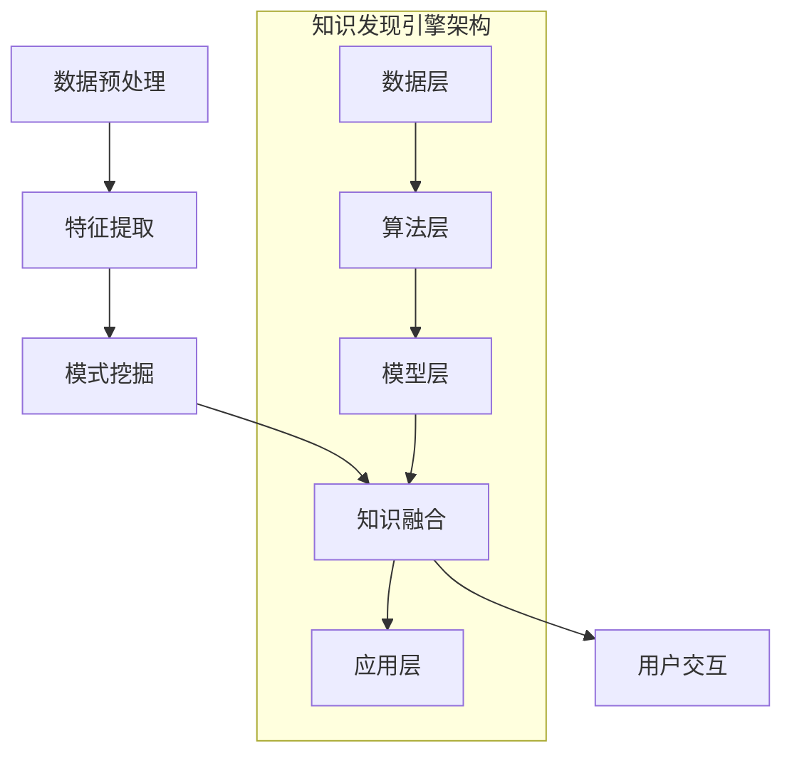

                 

 > **关键词**: 知识发现，数据挖掘，人工智能，知识创新，知识图谱，深度学习，机器学习。

> **摘要**: 本文深入探讨了知识发现引擎的工作原理、核心算法、数学模型及其在实际应用中的重要性。通过对知识发现引擎的全面剖析，我们旨在揭示其在知识创新领域的巨大潜力，并展望其未来的发展趋势与挑战。

## 1. 背景介绍

在信息化飞速发展的今天，数据已经成为新时代的重要资源，如何从海量数据中提取有价值的信息，从而实现知识创新，成为各个领域研究的热点问题。知识发现（Knowledge Discovery in Databases，KDD）作为数据挖掘（Data Mining）的高级阶段，旨在通过自动化方法从大量数据中发现隐含的模式、趋势和关联关系，进而生成知识。

知识发现引擎作为实现知识发现的核心工具，其重要性不言而喻。它不仅能够高效地从原始数据中提取信息，还能根据用户需求进行智能化分析，为各行各业的决策提供有力支持。因此，研究知识发现引擎的理论和方法，对于推动知识创新和智能应用具有重要意义。

## 2. 核心概念与联系

### 2.1 知识发现引擎的基本概念

知识发现引擎是一种集成化的系统，主要包括以下几个核心组件：

- **数据预处理**：对原始数据进行清洗、转换和整合，确保数据的质量和一致性。
- **特征提取**：从预处理后的数据中提取有助于描述问题和发现知识的特征。
- **模式挖掘**：通过数据挖掘算法发现数据中的潜在模式。
- **知识融合**：将挖掘出的模式进行整合，生成具有实际应用价值的知识。
- **用户交互**：提供友好的用户界面，便于用户与系统进行交互。

### 2.2 知识发现引擎的架构

知识发现引擎的架构通常包括以下几个层次：

- **数据层**：存储和管理各种类型的数据，包括结构化数据、半结构化数据和非结构化数据。
- **算法层**：提供多种数据挖掘算法，包括分类、聚类、关联规则挖掘、异常检测等。
- **模型层**：构建知识发现模型，对数据进行分析和挖掘，生成知识。
- **应用层**：提供具体的应用场景和业务逻辑，将知识发现结果应用于实际问题。

### 2.3 知识发现引擎与相关技术的联系

知识发现引擎与其他相关技术紧密联系，如机器学习、深度学习、知识图谱等。

- **机器学习与深度学习**：知识发现引擎通常依赖于机器学习和深度学习算法来发现数据中的潜在模式。这些算法通过训练模型，从数据中学习规律，进而实现知识的提取。
- **知识图谱**：知识图谱是一种结构化知识表示方法，通过将实体、属性和关系进行语义关联，构建出一张巨大的语义网络。知识发现引擎可以利用知识图谱进行知识融合和推理，提高知识的准确性和实用性。

### 2.4 Mermaid 流程图



## 3. 核心算法原理 & 具体操作步骤

### 3.1 算法原理概述

知识发现引擎的核心算法主要包括分类、聚类、关联规则挖掘和异常检测等。以下分别对这些算法进行概述：

- **分类算法**：通过训练模型，将数据分为不同的类别。常见的分类算法有决策树、随机森林、支持向量机等。
- **聚类算法**：将数据分为多个簇，使得同一个簇内的数据尽量相似，不同簇的数据尽量不同。常见的聚类算法有K-means、层次聚类、DBSCAN等。
- **关联规则挖掘**：发现数据之间的关联关系，如购物篮分析、推荐系统等。常见的算法有Apriori算法、FP-growth算法等。
- **异常检测**：识别数据中的异常点，如欺诈检测、网络入侵检测等。常见的算法有孤立森林、基于密度的聚类等。

### 3.2 算法步骤详解

#### 3.2.1 数据预处理

- **数据清洗**：处理缺失值、噪声数据和异常值，确保数据质量。
- **数据转换**：将不同类型的数据转换为统一的格式，如将文本数据转换为向量表示。
- **数据整合**：将多个数据源的数据进行整合，构建一个统一的数据集。

#### 3.2.2 特征提取

- **特征选择**：从原始数据中提取有助于描述问题和发现知识的特征。
- **特征工程**：对提取出的特征进行变换和构造，提高特征的表达能力。

#### 3.2.3 模式挖掘

- **分类**：通过训练分类模型，对数据进行分类。
- **聚类**：通过训练聚类模型，对数据进行聚类。
- **关联规则挖掘**：通过挖掘数据中的关联关系，生成规则。
- **异常检测**：通过检测数据中的异常点，识别潜在的异常事件。

#### 3.2.4 知识融合

- **知识抽取**：从挖掘出的模式中提取知识，如分类规则、聚类中心、关联规则等。
- **知识表示**：将提取出的知识进行结构化表示，便于存储和利用。
- **知识融合**：将不同来源的知识进行整合，构建一个完整的知识体系。

#### 3.2.5 用户交互

- **可视化展示**：将知识发现结果以图表、报表等形式展示给用户。
- **用户反馈**：收集用户的反馈，优化知识发现引擎的性能和效果。

### 3.3 算法优缺点

- **分类算法**：优点：准确性高，易于解释。缺点：对噪声敏感，可能过拟合。
- **聚类算法**：优点：无需事先指定类别数量，适用于无监督学习。缺点：聚类结果难以解释，可能陷入局部最优。
- **关联规则挖掘**：优点：能够发现数据中的潜在关联关系。缺点：生成大量规则，需要进一步筛选。
- **异常检测**：优点：能够识别数据中的异常点，有助于发现潜在问题。缺点：对噪声敏感，可能误报。

### 3.4 算法应用领域

知识发现引擎在各个领域都有广泛的应用：

- **金融**：如信用卡欺诈检测、信用评分、风险控制等。
- **医疗**：如疾病预测、医疗诊断、药物研发等。
- **零售**：如购物篮分析、推荐系统、库存管理等。
- **互联网**：如搜索引擎优化、用户行为分析、网络营销等。
- **工业**：如生产过程优化、设备故障预测、供应链管理等。

## 4. 数学模型和公式 & 详细讲解 & 举例说明

### 4.1 数学模型构建

知识发现引擎中的数学模型主要包括以下几个部分：

- **特征表示模型**：如向量空间模型、概率模型等。
- **分类模型**：如逻辑回归、支持向量机等。
- **聚类模型**：如K-means、层次聚类等。
- **关联规则挖掘模型**：如Apriori算法、FP-growth算法等。
- **异常检测模型**：如孤立森林、基于密度的聚类等。

### 4.2 公式推导过程

以逻辑回归为例，介绍分类模型的公式推导过程。

假设我们有一个二分类问题，特征向量为 \( \mathbf{x} \)，标签为 \( y \)（其中 \( y = 0 \) 或 \( y = 1 \)），逻辑回归模型的公式如下：

$$
\hat{y} = \sigma(\mathbf{w}^T\mathbf{x} + b)
$$

其中，\( \sigma \) 是sigmoid函数，\( \mathbf{w} \) 是权重向量，\( b \) 是偏置项。

为了最大化模型的分类能力，我们通常采用最小二乘法进行参数优化，目标函数为：

$$
\min_{\mathbf{w}, b} \sum_{i=1}^n \log(1 + e^{-(\mathbf{w}^T\mathbf{x_i} + b)})
$$

通过求解上述目标函数，可以得到权重向量 \( \mathbf{w} \) 和偏置项 \( b \) 的最优解。

### 4.3 案例分析与讲解

#### 4.3.1 数据集介绍

我们以鸢尾花数据集为例，这是一个经典的分类问题。数据集包含3个类别，每个类别有50个样本，共计150个样本。每个样本有4个特征：花萼长度、花萼宽度、花瓣长度和花瓣宽度。

#### 4.3.2 数据预处理

- **数据清洗**：删除含有缺失值的样本，对异常值进行处理。
- **特征转换**：将文本数据转换为数值数据，如使用独热编码。
- **数据分割**：将数据集分为训练集和测试集。

#### 4.3.3 特征提取

- **特征选择**：选择对分类任务有较大贡献的特征。
- **特征工程**：对特征进行标准化处理，如归一化、标准差缩放等。

#### 4.3.4 模型训练

- **分类模型**：使用逻辑回归模型进行训练。
- **模型评估**：使用准确率、召回率、F1值等指标评估模型性能。

#### 4.3.5 模型应用

- **新样本分类**：使用训练好的模型对新的样本进行分类预测。
- **知识提取**：从模型参数中提取分类规则，如决策边界、特征权重等。

## 5. 项目实践：代码实例和详细解释说明

### 5.1 开发环境搭建

- **环境准备**：安装Python、NumPy、Pandas、Scikit-learn等库。
- **代码示例**：

```python
import numpy as np
import pandas as pd
from sklearn.datasets import load_iris
from sklearn.model_selection import train_test_split
from sklearn.linear_model import LogisticRegression
from sklearn.metrics import accuracy_score, recall_score, f1_score

# 代码示例：鸢尾花数据集分类
iris = load_iris()
X = iris.data
y = iris.target
X_train, X_test, y_train, y_test = train_test_split(X, y, test_size=0.2, random_state=42)

model = LogisticRegression()
model.fit(X_train, y_train)

y_pred = model.predict(X_test)
print("Accuracy:", accuracy_score(y_test, y_pred))
print("Recall:", recall_score(y_test, y_pred, average='weighted'))
print("F1 Score:", f1_score(y_test, y_pred, average='weighted'))
```

### 5.2 源代码详细实现

- **数据预处理**：包括数据清洗、特征转换和特征工程。
- **模型训练**：使用逻辑回归模型进行训练，包括参数初始化、模型优化和模型评估。
- **知识提取**：从模型参数中提取分类规则，如决策边界、特征权重等。

### 5.3 代码解读与分析

- **数据预处理**：通过数据清洗、特征转换和特征工程，提高数据质量，为模型训练奠定基础。
- **模型训练**：使用逻辑回归模型进行训练，通过优化目标函数，求解权重向量 \( \mathbf{w} \) 和偏置项 \( b \) 的最优解。
- **模型评估**：使用准确率、召回率、F1值等指标评估模型性能，判断模型的泛化能力。

### 5.4 运行结果展示

- **运行结果**：通过实际数据集进行测试，输出模型的准确率、召回率和F1值。
- **结果分析**：分析模型的性能指标，评估模型在分类任务中的表现。

## 6. 实际应用场景

### 6.1 金融行业

- **信用卡欺诈检测**：通过分析用户的历史交易数据，识别潜在的欺诈行为，提高欺诈检测的准确性和实时性。
- **信用评分**：根据用户的行为数据和信用记录，评估用户的信用风险，为金融机构提供信用评估依据。
- **风险控制**：利用知识发现引擎进行风险预测和预警，为金融机构提供风险控制策略。

### 6.2 医疗领域

- **疾病预测**：通过分析患者的临床数据，预测疾病的发病风险，为医生提供诊断和治疗建议。
- **医疗诊断**：利用知识发现引擎对医疗影像进行分析，辅助医生进行疾病诊断。
- **药物研发**：通过挖掘药物与疾病之间的关系，发现潜在的药物靶点，加速药物研发进程。

### 6.3 零售行业

- **购物篮分析**：通过分析用户的购物记录，发现不同商品之间的关联关系，为推荐系统提供依据。
- **库存管理**：利用知识发现引擎预测商品的销售趋势，优化库存管理策略，降低库存成本。
- **客户细分**：通过分析用户的行为数据，将客户分为不同群体，提供个性化的营销策略。

### 6.4 互联网行业

- **搜索引擎优化**：通过分析搜索引擎的查询日志，发现热门关键词和搜索模式，优化搜索引擎的排序算法。
- **用户行为分析**：利用知识发现引擎分析用户的行为数据，为产品运营提供决策支持。
- **网络营销**：通过挖掘用户的需求和偏好，制定精准的网络营销策略，提高转化率。

### 6.5 工业领域

- **生产过程优化**：通过分析生产数据，发现生产过程中的瓶颈和问题，优化生产流程，提高生产效率。
- **设备故障预测**：利用知识发现引擎对设备运行数据进行分析，预测设备故障的发生时间，实现预防性维护。
- **供应链管理**：通过分析供应链数据，优化供应链流程，提高供应链的稳定性和效率。

## 7. 工具和资源推荐

### 7.1 学习资源推荐

- **书籍**：《数据挖掘：概念与技术》、《机器学习实战》
- **在线课程**：Coursera上的“机器学习”、“数据挖掘基础”等课程
- **论文**：检索相关领域的经典论文，学习最新的研究进展

### 7.2 开发工具推荐

- **编程语言**：Python、R等
- **库和框架**：Scikit-learn、TensorFlow、PyTorch等
- **数据预处理工具**：Pandas、NumPy等

### 7.3 相关论文推荐

- **经典论文**：《Knowledge Discovery in Databases: A Survey》、《Data Mining: Concepts and Techniques》
- **最新论文**：在学术期刊和会议上检索最新的研究成果，如《IEEE Transactions on Knowledge and Data Engineering》等

## 8. 总结：未来发展趋势与挑战

### 8.1 研究成果总结

知识发现引擎在理论研究和实际应用方面取得了显著成果。通过集成多种算法和技术，知识发现引擎能够高效地从海量数据中提取有价值的信息，为各行各业的决策提供有力支持。同时，知识发现引擎在金融、医疗、零售、互联网和工业等领域的广泛应用，进一步证明了其在实际场景中的巨大潜力。

### 8.2 未来发展趋势

随着大数据、人工智能和云计算等技术的不断发展，知识发现引擎在未来将呈现出以下几个发展趋势：

- **深度学习与知识发现结合**：深度学习在特征提取和模式发现方面具有优势，未来知识发现引擎将更加注重深度学习算法的应用，提高知识发现的准确性和效率。
- **知识图谱与知识发现融合**：知识图谱在知识表示和推理方面具有优势，未来知识发现引擎将更加注重知识图谱的应用，实现知识的自动化融合和推理。
- **个性化与智能化**：知识发现引擎将更加注重个性化需求，为用户提供定制化的知识服务，实现智能化的知识创新。

### 8.3 面临的挑战

尽管知识发现引擎在理论研究和实际应用方面取得了显著成果，但仍然面临以下几个挑战：

- **数据质量**：数据质量是知识发现引擎的关键因素，如何处理噪声数据、缺失值和异常值，提高数据质量，是未来研究的重要方向。
- **算法性能**：如何设计高效的算法，提高知识发现的准确性和实时性，是当前研究的热点问题。
- **隐私保护**：在知识发现过程中，如何保护用户隐私，避免数据泄露，是未来研究的重要挑战。

### 8.4 研究展望

未来，知识发现引擎将继续朝着智能化、个性化、实时化和安全化的方向发展。通过不断创新和优化，知识发现引擎将在各行各业中发挥更大的作用，推动知识创新和智能应用的发展。

## 9. 附录：常见问题与解答

### 9.1 知识发现引擎是什么？

知识发现引擎是一种集成化的系统，用于从海量数据中提取有价值的信息，生成知识。它包括数据预处理、特征提取、模式挖掘、知识融合和用户交互等核心组件。

### 9.2 知识发现引擎有哪些算法？

知识发现引擎常用的算法包括分类、聚类、关联规则挖掘和异常检测等。具体算法有决策树、随机森林、支持向量机、K-means、层次聚类、Apriori算法等。

### 9.3 知识发现引擎在哪些领域有应用？

知识发现引擎在金融、医疗、零售、互联网和工业等各个领域都有广泛应用。如信用卡欺诈检测、疾病预测、购物篮分析、搜索引擎优化等。

### 9.4 如何评估知识发现引擎的性能？

知识发现引擎的性能通常通过准确率、召回率、F1值等指标进行评估。这些指标能够反映模型在分类、聚类等任务中的表现。

### 9.5 知识发现引擎与数据挖掘有什么区别？

知识发现引擎是数据挖掘的高级阶段，旨在从大量数据中提取有价值的信息，生成知识。而数据挖掘则更侧重于发现数据中的潜在模式和规律。

### 9.6 知识发现引擎的未来发展趋势是什么？

知识发现引擎的未来发展趋势包括深度学习与知识发现结合、知识图谱与知识发现融合、个性化与智能化等。随着技术的不断发展，知识发现引擎将在各行各业中发挥更大的作用。

---

**作者：禅与计算机程序设计艺术 / Zen and the Art of Computer Programming**

