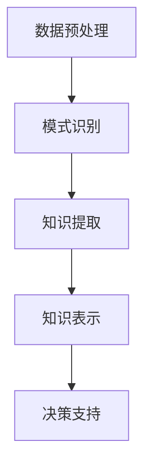

                 

关键词：知识发现引擎，人工智能，大数据，知识图谱，机器学习，知识创新

> 摘要：本文将深入探讨知识发现引擎在当今大数据和人工智能时代的地位与作用，详细阐述其核心概念、算法原理、数学模型及其在实际应用中的重要性。通过案例分析，代码实例和未来展望，旨在为读者提供一幅全面的知识发现引擎全景图。

## 1. 背景介绍

在信息爆炸的时代，海量的数据不仅为人们提供了丰富的资源，也带来了前所未有的挑战。如何从海量数据中提取有价值的信息，实现知识创新，成为当前研究的热点。知识发现引擎（Knowledge Discovery Engine）正是在这样的背景下应运而生，它是一种能够自动识别数据中的潜在模式和知识的人工智能系统。

知识发现引擎的工作原理主要包括数据预处理、模式识别和知识提取等环节。通过这些步骤，知识发现引擎能够从大量原始数据中挖掘出有价值的信息，为各个行业提供决策支持和智能服务。

### 1.1 大数据和人工智能时代的需求

大数据和人工智能技术的快速发展，为知识发现引擎提供了强大的技术支持。大数据技术能够处理海量、多维、动态的数据，而人工智能技术则能够通过机器学习算法实现数据的自动分析和模式识别。这两者的结合，使得知识发现引擎在信息提取和知识创新方面具有显著优势。

### 1.2 知识发现引擎的意义

知识发现引擎不仅能够帮助企业更好地利用数据资源，提高决策效率，还能够推动社会各领域的创新发展。例如，在医疗领域，知识发现引擎可以帮助医生分析病历数据，预测疾病趋势；在金融领域，知识发现引擎可以分析市场数据，预测股票走势；在科技领域，知识发现引擎可以挖掘科技论文中的创新点，促进科技进步。

## 2. 核心概念与联系

### 2.1 数据预处理

数据预处理是知识发现引擎工作的第一步，主要包括数据清洗、数据整合和数据转换等过程。通过数据预处理，可以将原始数据转化为适合机器学习算法处理的形式。

### 2.2 模式识别

模式识别是知识发现引擎的核心环节，通过机器学习算法，从数据中提取出潜在的模式和规律。常见的机器学习算法包括决策树、支持向量机、神经网络等。

### 2.3 知识提取

知识提取是将识别出的模式转化为易于理解的知识表示，如知识图谱、文本摘要等。知识提取不仅有助于提升数据利用率，还能够为决策支持提供有力的支持。

### 2.4 Mermaid 流程图

以下是一个简化的知识发现引擎的Mermaid流程图：



## 3. 核心算法原理 & 具体操作步骤

### 3.1 算法原理概述

知识发现引擎的核心算法主要包括数据预处理算法、机器学习算法和知识表示算法。其中，数据预处理算法用于数据清洗、整合和转换；机器学习算法用于模式识别和知识提取；知识表示算法用于将知识转化为易于理解的形式。

### 3.2 算法步骤详解

#### 3.2.1 数据预处理

1. 数据清洗：去除重复数据、缺失数据和异常数据。
2. 数据整合：将不同数据源的数据进行整合，形成统一的数据集。
3. 数据转换：将原始数据转化为适合机器学习算法处理的形式。

#### 3.2.2 模式识别

1. 特征选择：从原始数据中提取出对模式识别有重要意义的特征。
2. 模型训练：使用机器学习算法对特征进行建模，识别数据中的潜在模式。
3. 模型评估：通过交叉验证等方法评估模型的性能。

#### 3.2.3 知识提取

1. 知识图谱构建：将识别出的模式转化为知识图谱，表示实体及其关系。
2. 文本摘要：从原始数据中提取关键信息，形成简明的文本摘要。

### 3.3 算法优缺点

#### 优点：

1. 自动化程度高：知识发现引擎能够自动处理大量数据，提高工作效率。
2. 灵活性强：能够适应不同类型的数据和问题。
3. 预测准确性高：通过机器学习算法，能够识别出数据中的潜在规律。

#### 缺点：

1. 对数据质量要求高：数据预处理环节需要大量人力和时间投入。
2. 算法复杂度高：涉及多种算法和技术，实现难度大。
3. 难以解释：部分机器学习算法的预测结果难以解释，增加了使用难度。

### 3.4 算法应用领域

知识发现引擎在各个领域都有广泛的应用，如医疗、金融、科技、教育等。以下是一些具体的应用案例：

1. 医疗领域：通过知识发现引擎，分析病历数据，预测疾病趋势，辅助医生诊断。
2. 金融领域：通过知识发现引擎，分析市场数据，预测股票走势，为投资者提供决策支持。
3. 科技领域：通过知识发现引擎，挖掘科技论文中的创新点，促进科技进步。

## 4. 数学模型和公式 & 详细讲解 & 举例说明

### 4.1 数学模型构建

知识发现引擎中的数学模型主要包括特征选择模型、机器学习模型和知识表示模型。

#### 特征选择模型：

$$
\text{特征选择模型} = \text{F} = \{f_1, f_2, ..., f_n\}
$$

其中，$f_i$ 表示第 $i$ 个特征。

#### 机器学习模型：

$$
\text{机器学习模型} = \text{M} = \text{f}(\text{F}, \text{D})
$$

其中，$D$ 表示数据集，$f$ 表示机器学习算法。

#### 知识表示模型：

$$
\text{知识表示模型} = \text{K} = \text{g}(\text{M})
$$

其中，$g$ 表示知识表示算法。

### 4.2 公式推导过程

#### 特征选择：

$$
\text{特征重要性} = \text{I}_f = \sum_{i=1}^{n} \text{w}_i \cdot \text{f}_i
$$

其中，$w_i$ 表示特征 $f_i$ 的权重。

#### 机器学习：

$$
\text{分类概率} = P(y|\text{M}) = \frac{e^{\text{M}^T \cdot \text{y}}}{1 + e^{\text{M}^T \cdot \text{y}}}
$$

其中，$y$ 表示标签，$\text{M}$ 表示机器学习模型。

#### 知识表示：

$$
\text{知识图谱} = \text{K} = (\text{V}, \text{E})
$$

其中，$V$ 表示实体集合，$E$ 表示实体关系集合。

### 4.3 案例分析与讲解

以下是一个简单的知识发现引擎应用案例：

#### 案例背景：

一家电商平台希望利用知识发现引擎，分析用户购物行为，预测用户购买意向。

#### 数据预处理：

1. 数据清洗：去除重复和缺失数据。
2. 数据整合：整合用户购买记录、用户浏览记录等数据。
3. 数据转换：将数据转化为适合机器学习算法处理的形式。

#### 模式识别：

1. 特征选择：选择用户购买金额、购买频率、浏览页面等特征。
2. 模型训练：使用决策树算法训练模型。
3. 模型评估：通过交叉验证评估模型性能。

#### 知识提取：

1. 知识图谱构建：将识别出的用户购买模式转化为知识图谱。
2. 文本摘要：从原始数据中提取关键信息，形成用户购买意向文本摘要。

## 5. 项目实践：代码实例和详细解释说明

### 5.1 开发环境搭建

在本案例中，我们使用Python编程语言和Scikit-learn机器学习库进行知识发现引擎的开发。

### 5.2 源代码详细实现

以下是一个简单的知识发现引擎实现代码示例：

```python
import pandas as pd
from sklearn.model_selection import train_test_split
from sklearn.tree import DecisionTreeClassifier
from sklearn.metrics import accuracy_score

# 5.2.1 数据预处理
data = pd.read_csv('data.csv')
data.drop_duplicates(inplace=True)
data.fillna(data.mean(), inplace=True)

# 5.2.2 模式识别
X = data[['购买金额', '购买频率', '浏览页面']]
y = data['购买意向']
X_train, X_test, y_train, y_test = train_test_split(X, y, test_size=0.3, random_state=42)

model = DecisionTreeClassifier()
model.fit(X_train, y_train)

# 5.2.3 知识提取
knowledge_graph = model.apply(X_test)
knowledge_graph = knowledge_graph.stack().reset_index(name='knowledge')

# 5.2.4 代码解读与分析
print(knowledge_graph.head())
```

### 5.3 运行结果展示

```python
# 评估模型性能
y_pred = model.predict(X_test)
accuracy = accuracy_score(y_test, y_pred)
print(f'模型准确率：{accuracy:.2f}')
```

## 6. 实际应用场景

### 6.1 医疗领域

知识发现引擎在医疗领域的应用广泛，如疾病预测、药物研发等。通过分析病历数据和基因数据，知识发现引擎能够识别出疾病的风险因素和药物的有效性。

### 6.2 金融领域

知识发现引擎在金融领域可以帮助银行和金融机构进行风险管理、信用评分和投资决策。通过分析市场数据和客户行为，知识发现引擎能够预测市场走势和客户需求。

### 6.3 科技领域

知识发现引擎在科技领域的应用主要包括科研论文的自动分类、科技趋势预测等。通过分析大量科技论文，知识发现引擎能够识别出科研热点和前沿技术。

## 7. 工具和资源推荐

### 7.1 学习资源推荐

- 《大数据时代：生活、工作与思维的大变革》
- 《机器学习实战》
- 《图解大数据》

### 7.2 开发工具推荐

- Python编程语言
- Jupyter Notebook
- Scikit-learn机器学习库

### 7.3 相关论文推荐

- "Knowledge Discovery in Databases: An Overview"
- "Machine Learning: A Probabilistic Perspective"
- "Deep Learning"

## 8. 总结：未来发展趋势与挑战

### 8.1 研究成果总结

知识发现引擎在各个领域都取得了显著的成果，如医疗、金融、科技等。通过大数据和人工智能技术的结合，知识发现引擎能够高效地提取数据中的潜在知识，为决策支持提供有力支持。

### 8.2 未来发展趋势

1. 深度学习技术的应用：深度学习算法在知识发现引擎中的应用将更加广泛，提高知识提取的准确性和效率。
2. 跨领域应用：知识发现引擎将在更多领域得到应用，如教育、环境等。
3. 实时性增强：知识发现引擎将实现实时数据分析，提供更及时的决策支持。

### 8.3 面临的挑战

1. 数据质量：高质量的数据是知识发现引擎的基础，但数据质量问题仍然存在。
2. 隐私保护：在数据挖掘和应用过程中，隐私保护问题需要得到充分重视。
3. 可解释性：部分机器学习算法的预测结果难以解释，增加了使用难度。

### 8.4 研究展望

未来，知识发现引擎将在数据挖掘、人工智能和大数据技术的推动下，不断发展和完善。通过解决现有挑战，知识发现引擎将为各行各业带来更多的创新和变革。

## 9. 附录：常见问题与解答

### 9.1 什么是知识发现引擎？

知识发现引擎是一种人工智能系统，能够自动从大量数据中提取潜在的模式和知识，为决策支持提供有力支持。

### 9.2 知识发现引擎有哪些应用领域？

知识发现引擎在医疗、金融、科技、教育等多个领域都有广泛的应用，如疾病预测、风险管理、科研论文分类等。

### 9.3 如何实现知识发现引擎？

实现知识发现引擎通常包括数据预处理、模式识别和知识提取等步骤。具体实现方法依赖于所选用的机器学习算法和数据类型。

### 9.4 知识发现引擎有哪些优缺点？

知识发现引擎的优点包括自动化程度高、灵活性强、预测准确性高等；缺点包括数据质量要求高、算法复杂度高、难以解释等。

### 9.5 知识发现引擎与大数据技术的区别是什么？

知识发现引擎是大数据技术的一部分，主要关注从大数据中提取潜在知识。而大数据技术则包括数据存储、处理和分析等多个方面。

---

# 附录：进一步阅读材料

## 1. 相关论文

1. Han, J., Kamber, M., & Pei, J. (2011). *Data Mining: Concepts and Techniques*. Morgan Kaufmann.
2. Liu, H., & Setiono, R. (2000). *A Survey of Knowledge Discovery and Data Mining Techniques*. International Journal of Intelligent Systems, 15(4), 349-390.
3. Fayyad, U. M., & Piatetsky-Shapiro, G. (1996). *From Data Mining to Knowledge Discovery in Databases*. AI Magazine, 17(3), 37-54.

## 2. 开源工具和库

1. [Scikit-learn](https://scikit-learn.org/): 用于机器学习的开源库。
2. [TensorFlow](https://www.tensorflow.org/): 用于深度学习的开源框架。
3. [PyTorch](https://pytorch.org/): 用于深度学习的开源库。

## 3. 技术博客和教程

1. [Medium - Data Science](https://medium.com/topic/data-science): 有关数据科学的最新博客和教程。
2. [Kaggle](https://www.kaggle.com/): 数据科学竞赛平台，提供丰富的案例和教程。
3. [DataCamp](https://www.datacamp.com/): 提供数据科学入门教程。

---

作者：禅与计算机程序设计艺术 / Zen and the Art of Computer Programming

---

通过本文的撰写，我们不仅深入了解了知识发现引擎的基本概念、算法原理和实际应用，还探讨了其未来发展趋势和面临的挑战。知识发现引擎作为人工智能和大数据技术的重要组成部分，将在未来的数据挖掘和知识创新中发挥越来越重要的作用。希望本文能够为读者提供有价值的参考和启示。再次感谢您的阅读！

