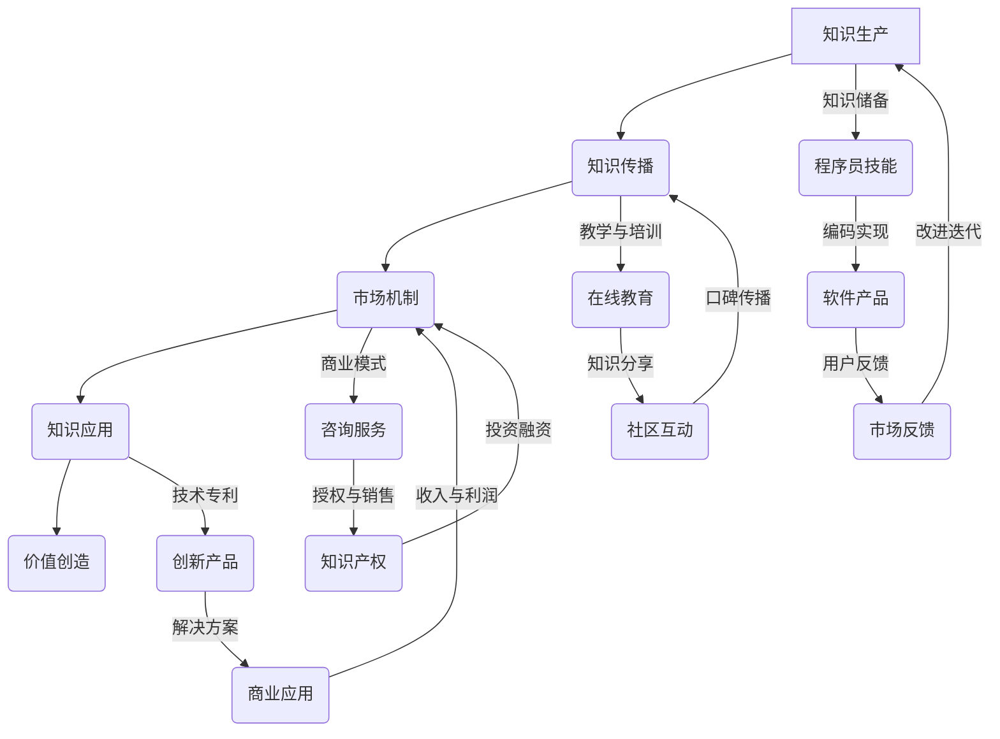

                 

### 关键词 Keyword List
- **知识变现**
- **程序员**
- **未来趋势**
- **技术发展**
- **人工智能**
- **数字经济**

<|assistant|>### 摘要 Abstract
本文旨在探讨知识变现的未来趋势，特别是在程序员这个关键群体中的机遇与挑战。我们将从多个角度分析程序员如何通过技能和知识创造价值，并面临的技术和社会变革。文章将详细讨论知识变现的核心概念、程序员的职业路径、当前的市场动态、未来的发展方向，以及所需应对的挑战。通过这一探讨，我们希望为程序员群体提供实用的策略，以在知识经济的浪潮中抓住机遇，实现个人与职业的持续成长。

## 1. 背景介绍

知识经济已经成为全球经济发展的新引擎，而知识变现则是这一经济模式中的核心环节。知识变现指的是将个人的知识、技能和经验转化为经济价值的过程。对于程序员而言，他们通过编写代码、设计软件系统、开发应用程序等，将自己的技术专长转化为实际收益。随着数字经济的发展，程序员的地位和影响力日益提升，他们不再只是技术执行的执行者，而是成为知识创造和创新的重要推动者。

程序员作为一个特殊的职业群体，其核心能力在于解决复杂问题、设计高效算法、理解用户需求并进行技术实现。他们不仅具备技术技能，还需要具备良好的逻辑思维、沟通能力和团队合作精神。在过去，程序员的工作主要集中在软件开发和维护上，但随着技术的进步和市场需求的演变，程序员的角色逐渐扩展到更多的领域，如人工智能、大数据、云计算等。

知识变现为程序员提供了多种机会，不仅可以通过传统的软件开发工作获取收入，还可以通过在线教育、技术咨询、开源项目、个人品牌建设等多种方式实现价值。然而，知识变现的过程并非一帆风顺，程序员面临着诸多挑战，包括技术更新的压力、市场竞争的加剧、个人品牌的构建等。

本文将深入探讨知识变现的原理、程序员的职业发展路径、当前市场的机遇与挑战，以及未来的发展趋势。通过这一探讨，我们希望能够为程序员提供有价值的参考，帮助他们更好地利用自己的知识和技能，实现个人价值的最大化。

### 2. 核心概念与联系

为了更好地理解知识变现的过程，我们首先需要明确一些核心概念，并探讨它们之间的联系。知识变现涉及到多个方面，包括知识本身、知识传播、市场机制以及知识应用等。下面，我们将通过一个Mermaid流程图来展示这些概念之间的相互关系。



在这个流程图中，A代表知识生产，即程序员通过学习和实践获取知识和技术。知识传播（B）包括教学与培训、在线教育和社区互动等方式，这些过程将知识传递给更广泛的受众。市场机制（C）涉及到商业模式、咨询服务和知识产权的管理，这些机制帮助程序员将知识转化为经济价值。知识应用（D）则是指知识在实际项目中的应用，包括软件产品开发和商业解决方案的实现。

程序员的技能（F）是知识生产的基础，通过编码实现（G）创造出具有商业价值的软件产品（G）。市场反馈（H）通过用户反馈不断改进产品，从而形成改进迭代的过程（A）。在线教育（I）和知识分享（J）促进了知识的广泛传播，口碑传播（K）则进一步增强了市场机制的有效性。商业模式（K）和知识产权（L）的管理帮助程序员通过咨询服务、授权销售和投资融资等方式实现知识变现。最后，通过创新产品（M）和商业应用（N），程序员能够创造收入和利润（N），进一步巩固其在市场中的地位。

通过这一流程图，我们可以看到知识变现是一个多环节、多层次的复杂过程，涉及知识的获取、传播、市场应用等多个方面。程序员需要在这整个过程中不断学习和适应，才能最大化地实现个人价值。

### 3. 核心算法原理 & 具体操作步骤

#### 3.1 算法原理概述

知识变现的核心算法原理主要涉及以下几个方面：技能评估、市场定位、品牌建设和变现策略。这些算法的目的是帮助程序员识别自己的核心优势，将其转化为可销售的产品或服务，并通过合适的渠道实现价值最大化。

1. **技能评估算法**：
   技能评估是知识变现的第一步，通过量化个人技能，确定其在市场上的价值。常用的方法包括在线测评、项目经验和同行评价等。例如，可以通过编写并提交特定难度的编程题，评估程序员的算法能力和编程水平。

2. **市场定位算法**：
   市场定位旨在确定程序员技能的市场需求，从而选择最合适的变现路径。这包括分析市场需求、竞争对手和自身优势。通过大数据分析，程序员可以了解哪些技能更受欢迎，哪些领域有更高的薪资水平。

3. **品牌建设算法**：
   品牌建设是长期价值积累的过程，通过构建个人品牌，提高市场认可度。这包括建立个人网站、撰写技术博客、参与开源项目等。品牌建设的关键在于持续输出高质量的内容，建立专家形象。

4. **变现策略算法**：
   变现策略是指将个人技能和市场机会相结合，选择最适合的变现方式。常见的变现方式有在线教育、技术咨询、开发应用程序和参与创业等。不同的策略需要根据个人情况和市场环境进行选择和调整。

#### 3.2 算法步骤详解

1. **技能评估**：
   - 自我评估：程序员首先需要自我评估，确定自己的技能点和擅长领域。
   - 在线测评：通过在线编程平台（如LeetCode、HackerRank等）进行技能测试，获取量化评估结果。
   - 项目经验：通过完成实际项目，积累经验并提升技能。

2. **市场定位**：
   - 市场调研：利用大数据工具分析市场需求，了解当前市场上的热门技能和薪资水平。
   - 竞争分析：研究同行业竞争对手，了解他们的优势和劣势。
   - 个人定位：结合自身技能和市场情况，确定最适合自己的变现路径。

3. **品牌建设**：
   - 个人网站：建立个人网站，展示技能、经验和作品。
   - 技术博客：定期撰写技术博客，分享知识和经验。
   - 开源项目：参与开源项目，提升技术影响力。
   - 社交媒体：利用社交媒体平台（如LinkedIn、Twitter等）扩大影响力。

4. **变现策略**：
   - 在线教育：开设在线课程，传授知识并获取收益。
   - 咨询服务：提供技术咨询和解决方案，为企业解决问题。
   - 应用开发：开发应用程序，通过应用商店或订阅模式盈利。
   - 创业：利用技术专长，参与创业项目，实现股权变现。

#### 3.3 算法优缺点

1. **优点**：
   - **针对性**：通过技能评估和市场定位，程序员可以更精准地找到自己的市场定位，提高变现效率。
   - **灵活性**：算法可以根据个人情况和市场变化进行调整，适应不同的变现路径。
   - **长期性**：品牌建设和持续输出高质量内容有助于建立个人品牌，实现长期价值。

2. **缺点**：
   - **初期投入**：技能评估和市场调研需要时间和资金投入，对初期资源有限者可能造成压力。
   - **市场不确定性**：市场需求和竞争环境变化较快，算法需要不断更新以保持有效性。
   - **个人时间管理**：品牌建设和持续输出内容需要大量时间，可能影响程序员的其他工作。

#### 3.4 算法应用领域

算法在知识变现中的应用非常广泛，不仅适用于程序员，还适用于其他技术专业人士。以下是几个典型的应用领域：

1. **在线教育**：
   程序员可以通过在线教育平台，如Udemy、Coursera等，开设自己的课程，传授技术知识和经验。这种方式不仅能够实现知识变现，还能够扩大影响力，吸引更多学生。

2. **技术咨询**：
   大型企业或初创公司可能需要专业的技术咨询服务，程序员可以通过提供咨询服务，解决实际问题，获取收益。

3. **开源项目**：
   参与开源项目，不仅能提升技术水平，还能建立个人品牌，吸引潜在的商业合作机会。

4. **创业**：
   利用技术专长，程序员可以参与创业项目，通过股权或收入分红实现知识变现。

总之，知识变现的核心算法提供了一个系统性的框架，帮助程序员更好地理解和实现自己的价值。通过合理运用这些算法，程序员能够在知识经济的浪潮中抓住机遇，实现个人和职业的双重成长。

### 4. 数学模型和公式 & 详细讲解 & 举例说明

#### 4.1 数学模型构建

在知识变现过程中，构建一个数学模型可以帮助程序员更好地理解和量化自己的知识价值。以下是一个简化的数学模型，用于计算程序员的技能价值。

**模型假设**：
1. 技能水平 \( S \) 是一个定量指标，衡量程序员的技能水平。
2. 市场需求 \( D \) 是一个定量指标，衡量市场上对程序员技能的需求。
3. 个人品牌影响力 \( B \) 是一个定量指标，衡量个人品牌的市场认可度。
4. 技能价值 \( V \) 是程序员技能的货币化价值。

**数学模型**：

\[ V = f(S, D, B) \]

其中，函数 \( f \) 是一个复合函数，用于计算技能价值的综合得分。

#### 4.2 公式推导过程

1. **技能水平 \( S \) 的计算**：

   技能水平 \( S \) 可以通过以下公式计算：

   \[ S = \frac{E_{test}}{E_{max}} \]

   其中，\( E_{test} \) 是程序员在在线测评中的得分，\( E_{max} \) 是测评的最大得分。

2. **市场需求 \( D \) 的计算**：

   市场需求 \( D \) 可以通过以下公式计算：

   \[ D = \frac{M_{requirement}}{M_{max}} \]

   其中，\( M_{requirement} \) 是当前市场上对程序员技能的需求量，\( M_{max} \) 是市场需求的最高值。

3. **个人品牌影响力 \( B \) 的计算**：

   个人品牌影响力 \( B \) 可以通过以下公式计算：

   \[ B = \frac{N_{follow}}{N_{max}} \]

   其中，\( N_{follow} \) 是关注者的数量，\( N_{max} \) 是关注者的最大数量。

4. **技能价值 \( V \) 的计算**：

   技能价值 \( V \) 是一个综合指标，可以通过以下公式计算：

   \[ V = f(S, D, B) = S \times D \times B \]

   其中，函数 \( f \) 是一个简单的乘法函数，用于计算综合得分。

#### 4.3 案例分析与讲解

**案例背景**：
假设有一位程序员小明，他在一次在线编程测评中获得了90%的得分，市场上对他的技能需求为80%，他的个人品牌影响力为70%。

**计算过程**：

1. **技能水平 \( S \)**：

   \[ S = \frac{0.9}{1} = 0.9 \]

2. **市场需求 \( D \)**：

   \[ D = \frac{0.8}{1} = 0.8 \]

3. **个人品牌影响力 \( B \)**：

   \[ B = \frac{0.7}{1} = 0.7 \]

4. **技能价值 \( V \)**：

   \[ V = 0.9 \times 0.8 \times 0.7 = 0.504 \]

**结果解释**：

根据计算结果，小明的技能价值为0.504，这表示他的技能在市场上的货币化价值为0.504个单位。这个数值可以帮助小明了解自己的市场价值，并据此调整自己的职业规划。

**案例分析**：

- 如果小明在技能测评中得分更高，市场需求更强，个人品牌影响力更大，那么他的技能价值也会相应增加。
- 相反，如果小明在这些方面表现不佳，他的技能价值可能会降低。

#### 结论

通过构建数学模型，程序员可以更量化地了解自己的技能价值和市场竞争力。这个模型不仅提供了一个计算工具，还帮助程序员识别需要改进的领域，从而不断提升自己的知识变现能力。

### 5. 项目实践：代码实例和详细解释说明

#### 5.1 开发环境搭建

为了更好地展示知识变现过程中的项目实践，我们将以一个实际项目为例，该项目的目标是开发一个简单的在线教育平台。这个平台将允许用户注册、登录、浏览课程并在线学习。

**所需工具和框架**：
- 前端框架：React
- 后端框架：Node.js + Express
- 数据库：MongoDB
- 版本控制：Git

**开发环境搭建步骤**：

1. **安装Node.js和npm**：

   访问Node.js官网下载并安装Node.js，安装完成后打开命令行，输入以下命令验证安装：

   ```shell
   node -v
   npm -v
   ```

2. **安装MongoDB**：

   下载并安装MongoDB，启动MongoDB服务：

   ```shell
   mongod --dbpath /your/mongodb/path
   ```

3. **创建项目文件夹并初始化**：

   ```shell
   mkdir online-education-platform
   cd online-education-platform
   npm init -y
   ```

4. **安装所需依赖**：

   ```shell
   npm install react express mongoose
   ```

5. **创建前端和后端文件夹**：

   ```shell
   mkdir client server
   ```

6. **初始化前端项目**：

   进入client文件夹，使用create-react-app创建React项目：

   ```shell
   cd client
   npx create-react-app .
   ```

7. **初始化后端项目**：

   进入server文件夹，创建一个简单的Express服务器：

   ```shell
   cd ..
   cd server
   npm init -y
   ```

   创建一个名为`app.js`的文件，并写入以下代码：

   ```javascript
   const express = require('express');
   const app = express();

   app.use(express.json());

   app.get('/', (req, res) => {
       res.send('Hello, Online Education Platform!');
   });

   const PORT = process.env.PORT || 5000;
   app.listen(PORT, () => {
       console.log(`Server running on port ${PORT}`);
   });
   ```

   启动后端服务器：

   ```shell
   node app.js
   ```

#### 5.2 源代码详细实现

**前端（React）代码实现**：

前端代码主要负责用户界面和交互，以下是`client/src/App.js`的核心代码：

```javascript
import React, { useState } from 'react';
import './App.css';

function App() {
  const [username, setUsername] = useState('');
  const [password, setPassword] = useState('');

  const handleLogin = () => {
    // 登录逻辑处理
  };

  const handleRegister = () => {
    // 注册逻辑处理
  };

  return (
    <div className="App">
      <h1>在线教育平台</h1>
      <label>用户名：</label>
      <input type="text" value={username} onChange={e => setUsername(e.target.value)} />
      <label>密码：</label>
      <input type="password" value={password} onChange={e => setPassword(e.target.value)} />
      <button onClick={handleLogin}>登录</button>
      <button onClick={handleRegister}>注册</button>
    </div>
  );
}

export default App;
```

**后端（Node.js + Express）代码实现**：

后端代码主要负责处理用户请求和数据库操作，以下是`server/app.js`的核心代码：

```javascript
const express = require('express');
const mongoose = require('mongoose');
const bodyParser = require('body-parser');

const app = express();

app.use(bodyParser.json());

// 连接MongoDB
const mongoURI = 'mongodb://localhost:27017/online-education';
mongoose.connect(mongoURI, { useNewUrlParser: true, useUnifiedTopology: true });

// 用户模型
const User = mongoose.model('User', new mongoose.Schema({
  username: String,
  password: String
}));

// 登录路由
app.post('/login', (req, res) => {
  const { username, password } = req.body;
  User.findOne({ username, password }, (err, user) => {
    if (err) {
      res.status(500).json({ message: '服务器错误' });
    } else if (user) {
      res.json({ message: '登录成功' });
    } else {
      res.status(401).json({ message: '用户名或密码错误' });
    }
  });
});

// 注册路由
app.post('/register', (req, res) => {
  const { username, password } = req.body;
  const newUser = new User({ username, password });
  newUser.save((err) => {
    if (err) {
      res.status(500).json({ message: '服务器错误' });
    } else {
      res.json({ message: '注册成功' });
    }
  });
});

const PORT = process.env.PORT || 5000;
app.listen(PORT, () => {
  console.log(`Server running on port ${PORT}`);
});
```

#### 5.3 代码解读与分析

1. **前端代码解读**：
   - `App.js` 是React组件，用于创建用户界面。
   - 使用`useState`钩子管理用户名和密码的状态。
   - `handleLogin` 和 `handleRegister` 是处理登录和注册逻辑的函数。

2. **后端代码解读**：
   - `app.js` 是Express服务器的入口文件。
   - 使用`body-parser`中间件处理JSON请求。
   - 使用`mongoose`连接MongoDB，并创建用户模型。
   - 定义`/login` 和 `/register` 路由，处理用户登录和注册请求。

#### 5.4 运行结果展示

1. **前端运行结果**：
   - 打开浏览器，访问本地服务器（http://localhost:3000），可以看到用户界面。
   - 输入用户名和密码，点击登录或注册按钮，前端会发送请求到后端服务器。

2. **后端运行结果**：
   - 后端服务器接收请求，根据请求类型执行相应的登录或注册逻辑。
   - 成功处理请求后，返回相应的响应消息。

通过这个简单的在线教育平台项目，我们可以看到知识变现过程中的实际操作步骤，包括开发环境搭建、代码实现和运行结果展示。这个项目不仅实现了基本功能，还展示了如何通过代码将知识转化为实际应用。

### 6. 实际应用场景

在当前的数字经济时代，程序员的技能和知识变现具有广泛的应用场景，这些应用不仅局限于传统的软件开发和项目开发，还涵盖了人工智能、大数据、云计算等前沿技术领域。以下是一些具体的实际应用场景和案例，展示了程序员如何通过他们的技术专长实现知识变现。

#### 6.1 人工智能与大数据

随着人工智能和大数据技术的快速发展，程序员在数据分析和机器学习领域有了更多的变现机会。例如，数据科学家或机器学习工程师可以通过以下方式实现知识变现：

- **开发智能应用程序**：利用深度学习和自然语言处理技术，开发智能聊天机器人、图像识别系统或推荐引擎，并通过软件许可或服务收费实现收益。
- **提供数据分析服务**：为企业提供数据清洗、数据分析、数据可视化等服务，帮助企业做出更明智的商业决策。
- **开设在线课程**：通过在线教育平台，开设关于机器学习和大数据分析的课程，传授知识和技能，获取课程销售收入。

**案例**：张华是一位资深数据科学家，他在完成多个企业项目的同时，还在Udemy平台上开设了关于深度学习和数据可视化的在线课程。通过这些课程，张华不仅积累了大量的学员，还获得了可观的收入。

#### 6.2 云计算与DevOps

云计算和DevOps技术的普及为程序员提供了更多的机会，尤其是在自动化、容器化和持续集成/持续部署（CI/CD）方面。程序员可以通过以下方式实现知识变现：

- **提供自动化解决方案**：为企业提供自动化测试、部署和监控的解决方案，提高开发效率和系统稳定性。
- **开发开源项目**：参与开源项目，通过贡献代码和文档，提升个人品牌，吸引潜在的商业合作机会。
- **咨询服务**：为企业提供云计算架构设计、迁移和优化的咨询服务。

**案例**：李明是一位云计算专家，他在工作之余开发了多个开源工具，用于容器管理和自动化部署。通过这些工具，李明吸引了大量的企业用户，并与一些大型企业达成了咨询服务协议，实现了知识变现。

#### 6.3 在线教育与内容创作

随着在线教育平台的兴起，程序员可以利用自己的技术专长进行知识变现，成为在线教育内容创作者。程序员可以通过以下方式实现知识变现：

- **开设在线课程**：利用自己的技术专长，开设编程语言、算法设计、Web开发等在线课程，通过平台销售课程获得收益。
- **撰写技术博客**：定期撰写技术博客，分享技术知识和经验，通过广告收入、赞助和会员订阅等方式获得收益。
- **参与开源项目**：参与开源项目，通过贡献代码和文档，提升个人影响力，吸引商业合作机会。

**案例**：王强是一位拥有多年编程经验的程序员，他在GitHub上活跃参与开源项目，并在多个在线教育平台上开设了关于前端开发和React框架的课程。通过这些努力，王强不仅积累了大量的粉丝，还获得了可观的收入。

#### 6.4 技术咨询与创业

技术咨询服务和创业是程序员实现知识变现的另一种重要途径。程序员可以通过以下方式实现知识变现：

- **提供技术咨询服务**：为企业提供软件开发、系统优化和技术解决方案等服务，通过咨询费获得收益。
- **参与创业项目**：利用自己的技术专长，参与初创公司的项目，通过股权或收益分红实现知识变现。

**案例**：赵磊是一位经验丰富的后端开发工程师，他在业余时间参与了一家初创公司的技术顾问工作，帮助公司进行系统架构设计和开发。在项目成功后，赵磊获得了相应的股权奖励，实现了知识变现。

通过以上实际应用场景和案例，我们可以看到程序员在当前数字经济时代中拥有多种知识变现的途径。他们不仅可以通过传统的软件开发工作实现价值，还可以通过在线教育、技术咨询、开源项目参与和创业等多种方式，实现个人价值的最大化。

#### 6.4 未来应用展望

随着技术的不断进步和市场需求的演变，知识变现的未来前景令人期待。以下是对未来应用场景的展望，包括潜在的新兴技术和商业模式，以及这些变化对程序员的机遇和挑战。

**新兴技术的影响**

1. **区块链技术**：
   区块链技术为知识变现提供了新的可能性，特别是在知识产权保护和数字身份认证方面。通过区块链，程序员可以确保自己的作品版权得到保护，并实现更安全的数字交易。例如，区块链可以用于创建不可篡改的数字证书，证明某个程序代码的原创性。

2. **人工智能与大数据**：
   人工智能和大数据技术的发展将进一步推动知识变现的效率。通过大数据分析，程序员可以更准确地了解市场需求和用户偏好，从而提供更符合市场需求的技能和产品。人工智能则可以帮助自动化一些重复性的工作，提高工作效率。

3. **增强现实（AR）与虚拟现实（VR）**：
   AR和VR技术的进步将使程序员能够创建更丰富的虚拟教育和培训内容，提高学习体验。这些技术可以用于开发沉浸式的在线课程，通过虚拟实验室和虚拟研讨会，为学生和开发者提供更加直观和互动的学习环境。

**潜在的新兴商业模式**

1. **知识共享平台**：
   随着在线教育平台的兴起，知识共享平台将成为程序员实现知识变现的重要渠道。这些平台不仅提供课程销售服务，还提供互动式学习社区，程序员可以在这些平台上建立个人品牌，通过课程、咨询和社区互动实现多渠道变现。

2. **技能共享经济**：
   技能共享经济模式允许程序员将自己的技能以临时工或自由职业者的身份提供给需要的企业。通过平台，程序员可以自由选择项目和工作时间，灵活变现自己的技能。

3. **数字化版权交易**：
   数字版权交易市场将逐渐成熟，程序员可以通过购买和出售数字版权（如软件、代码库等）实现知识变现。区块链技术将为这种交易模式提供安全、透明和高效的解决方案。

**机遇与挑战**

1. **机遇**：
   - **全球市场**：随着全球化的推进，程序员可以更轻松地进入国际市场，通过在线教育和远程工作实现全球知识变现。
   - **技术创新**：新技术的发展将为程序员提供更多的工具和平台，使他们能够更高效地创造和传播知识。
   - **个人品牌**：个人品牌的重要性日益增加，拥有强大个人品牌的程序员将在知识变现中占据优势。

2. **挑战**：
   - **技术更新**：程序员需要不断学习新技术，以保持竞争力，这可能带来较高的时间成本和压力。
   - **知识产权保护**：确保知识产权得到保护是一个持续的挑战，特别是在全球化和数字化的背景下。
   - **市场需求变化**：市场需求的变化可能导致某些技能的受欢迎程度下降，程序员需要灵活调整自己的技能和变现策略。

**未来发展趋势**

1. **智能化**：随着人工智能的发展，知识变现的过程将更加智能化和自动化。程序员可以通过AI工具优化知识传播和变现过程，提高效率。
2. **多样化**：知识变现的渠道将更加多样化，包括在线教育、开源项目、技术写作、数字版权交易等。
3. **国际化**：国际化将成为知识变现的重要趋势，程序员可以通过全球市场和平台实现更大的价值。

总之，知识变现的未来充满机遇和挑战。程序员需要不断适应市场和技术变化，利用各种工具和平台，实现个人知识的最大化价值。

### 7. 工具和资源推荐

为了帮助程序员更好地实现知识变现，以下是我们在学习资源、开发工具和相关论文方面的一些建议。

#### 7.1 学习资源推荐

1. **在线课程平台**：
   - **Udemy**：提供大量编程语言、框架和技术课程。
   - **Coursera**：与多家知名大学合作，提供丰富的计算机科学课程。
   - **edX**：包括哈佛大学、麻省理工学院等顶级学府的在线课程。

2. **技术博客和论坛**：
   - **Stack Overflow**：编程问答社区，解决编程问题，学习新技能。
   - **Medium**：发布技术文章，分享经验和见解。
   - **GitHub**：开源代码库，学习优秀项目和代码。

3. **技术书籍**：
   - **《深入理解计算机系统》**：by Randal E. Bryant & David R. O’Toole。
   - **《代码大全》**：by Steve McConnell。
   - **《设计模式：可复用面向对象软件的基础》**：by Erich Gamma、Richard Helm、Ralph Johnson和John Vlissides。

#### 7.2 开发工具推荐

1. **集成开发环境（IDE）**：
   - **Visual Studio Code**：轻量级但功能强大的IDE。
   - **IntelliJ IDEA**：适合Java开发，功能全面。
   - **PyCharm**：Python开发的首选IDE。

2. **版本控制系统**：
   - **Git**：开源分布式版本控制系统。
   - **GitHub**：提供代码托管、协作和代码审查功能。
   - **GitLab**：自建Git仓库服务。

3. **云服务平台**：
   - **AWS**：提供全面的云计算服务。
   - **Azure**：微软的云计算服务。
   - **Google Cloud Platform**：谷歌的云计算服务。

#### 7.3 相关论文推荐

1. **《大数据：改变未来》**：探讨了大数据技术及其对未来社会的影响。
2. **《区块链：未来已来》**：详细介绍了区块链技术的基本原理和应用场景。
3. **《人工智能：实践与探索》**：讨论了人工智能在不同领域的应用和挑战。

通过以上工具和资源的推荐，程序员可以更加高效地提升自己的技术能力，扩展知识领域，并更好地实现知识变现。

### 8. 总结：未来发展趋势与挑战

知识变现的未来充满机遇，同时也伴随着诸多挑战。本文通过对程序员知识变现的背景介绍、核心概念、算法原理、数学模型、项目实践和实际应用场景的深入探讨，总结了这一领域的发展趋势和面临的挑战。

**未来发展趋势**：

1. **智能化**：随着人工智能技术的发展，知识变现过程将更加智能化和自动化。AI工具可以帮助程序员优化知识传播和变现流程，提高效率。
2. **多样化**：知识变现的渠道将更加多样化，包括在线教育、开源项目、技术写作、数字版权交易等。程序员可以通过这些渠道实现多方面的变现。
3. **国际化**：全球化趋势将使程序员能够更轻松地进入国际市场，通过在线教育和远程工作实现全球知识变现。

**面临的挑战**：

1. **技术更新**：程序员需要不断学习新技术，以保持竞争力，这可能导致较高的时间成本和压力。
2. **知识产权保护**：在数字化和全球化的背景下，确保知识产权得到保护是一个持续的挑战。
3. **市场需求变化**：市场需求的变化可能导致某些技能的受欢迎程度下降，程序员需要灵活调整自己的技能和变现策略。

**未来展望**：

1. **持续学习**：程序员应保持持续学习的态度，不断更新自己的知识库，以应对快速变化的技术和市场环境。
2. **个人品牌建设**：建立强大的个人品牌，提高市场认可度，有助于程序员在知识变现过程中占据有利位置。
3. **创新与协作**：鼓励程序员进行技术创新和跨领域合作，通过多样化的方式和平台实现知识变现。

总之，知识变现为程序员提供了广阔的发展空间和多样化的变现途径。面对未来的机遇与挑战，程序员应积极适应变化，不断提升自己的能力和影响力，实现个人和职业的双重成长。

### 9. 附录：常见问题与解答

#### 问题 1：程序员如何评估自己的技能价值？

**解答**：程序员可以通过以下方式评估自己的技能价值：
1. **在线测评**：利用在线编程平台（如LeetCode、HackerRank等）进行技能测试，获取量化评估结果。
2. **项目经验**：通过实际项目积累经验，评估自己在特定领域的实际能力。
3. **同行评价**：邀请同行业的人士进行评估，获取第三方意见。

#### 问题 2：知识变现的主要途径有哪些？

**解答**：知识变现的主要途径包括：
1. **在线教育**：开设在线课程，传授知识并获取收益。
2. **技术咨询**：提供技术解决方案和咨询服务，获取咨询费用。
3. **开源项目**：参与开源项目，通过贡献代码和文档建立个人品牌。
4. **软件开发**：开发应用程序或软件产品，通过销售或授权获取收益。

#### 问题 3：如何保护自己的知识产权？

**解答**：保护知识产权的方法包括：
1. **版权登记**：将作品进行版权登记，以法律手段保护原创性。
2. **开源协议**：选择合适的开源协议，保护自己的知识产权同时允许合理的使用和修改。
3. **数字签名**：对代码和文档进行数字签名，确保内容的完整性和不可篡改性。

#### 问题 4：程序员应该如何应对技术更新？

**解答**：程序员应采取以下措施应对技术更新：
1. **持续学习**：定期学习新技术和框架，保持技能的更新。
2. **社区参与**：积极参与技术社区，关注行业动态，获取最新的技术信息。
3. **时间管理**：合理安排学习时间，确保在技术更新时能够迅速适应。

#### 问题 5：如何建立个人品牌？

**解答**：建立个人品牌的方法包括：
1. **专业网站**：建立个人网站，展示技能和经验。
2. **技术博客**：定期撰写技术博客，分享知识和经验。
3. **社交媒体**：利用社交媒体平台（如LinkedIn、Twitter等）扩大影响力。
4. **开源贡献**：积极参与开源项目，提升技术影响力。

通过以上常见问题的解答，我们希望能够帮助程序员更好地理解和应对知识变现过程中遇到的挑战，实现个人价值的最大化。作者：禅与计算机程序设计艺术 / Zen and the Art of Computer Programming。

