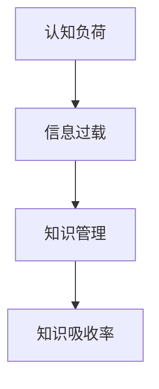

                 

关键词：知识吸收率、阅读量、学习效率、认知负荷、信息过载、知识管理、知识构建、信息处理、技术进步

> 摘要：本文深入探讨了知识吸收率这一关键指标在信息技术领域的意义，并对比了阅读量和知识吸收率之间的差异。通过分析认知负荷、信息过载等因素，本文提出了提升知识吸收率的有效策略，旨在帮助读者提高学习效率，优化知识构建过程。

## 1. 背景介绍

在信息技术飞速发展的今天，知识已成为企业、个人乃至整个社会竞争的核心资源。因此，如何高效地获取、处理和应用知识，成为了当今亟待解决的问题。传统的衡量标准，如阅读量，虽然在某种程度上反映了知识获取的广度，但并未充分考虑知识的实际吸收和内化过程。事实上，知识吸收率是一个更为关键的指标，它直接关系到个人的学习效果和组织的知识管理能力。

本文将从以下几个方面展开讨论：首先，介绍知识吸收率的概念和重要性；其次，分析影响知识吸收率的因素，如认知负荷和信息过载；接着，探讨如何提升知识吸收率的策略；最后，结合实际案例和未来展望，总结本文的核心观点。

### 1.1 知识吸收率的定义

知识吸收率是指个体或组织在特定时间内，将获取的知识有效内化、应用和创造新知识的能力。它不仅包括对知识的理解和记忆，还涉及到知识在实际问题中的运用和创新。

### 1.2 知识吸收率的重要性

知识吸收率直接影响到个人的学习成果和组织的创新能力。高知识吸收率意味着个体能够快速适应新技术和新理念，从而在竞争激烈的市场中保持优势。同样，组织通过提升知识吸收率，可以更有效地管理知识资产，提高整体竞争力。

## 2. 核心概念与联系

为了更好地理解知识吸收率，我们需要先了解几个核心概念，包括认知负荷、信息过载和知识管理。下面将使用Mermaid流程图（无括号、逗号等特殊字符）展示这些概念之间的联系。



### 2.1 认知负荷

认知负荷是指个体在处理信息时所需的认知资源和能力。过高的认知负荷会降低个体的注意力、记忆和思维效率，从而影响知识吸收率。

### 2.2 信息过载

信息过载是指个体在获取和处理信息时面临的大量、复杂和冗余的信息，这些信息可能会干扰个体的认知过程，降低知识吸收率。

### 2.3 知识管理

知识管理是指通过系统的方法和工具，对知识进行获取、存储、共享、应用和创新的过程。有效的知识管理有助于降低认知负荷和信息过载，提高知识吸收率。

### 2.4 知识吸收率

知识吸收率是知识管理的关键指标，它反映了个体或组织在知识处理过程中的效率和质量。通过优化认知负荷、减轻信息过载和改进知识管理，可以显著提升知识吸收率。

## 3. 核心算法原理 & 具体操作步骤

### 3.1 算法原理概述

为了提升知识吸收率，我们可以采用一种基于认知负荷和信息过载优化的算法。该算法的核心思想是通过减少冗余信息、提高信息的组织性和关联性，从而降低认知负荷和信息过载，提高知识吸收率。

### 3.2 算法步骤详解

#### 3.2.1 减少冗余信息

首先，对获取的信息进行筛选和整理，去除冗余、重复和无用信息，确保信息的精简和高效。

#### 3.2.2 提高信息组织性

其次，对筛选后的信息进行分类、归纳和整理，使其具备更好的组织性和结构，便于个体理解和记忆。

#### 3.2.3 加强信息关联性

然后，通过建立信息之间的关联，提高信息的关联性，帮助个体在知识吸收过程中进行有效的联想和推理。

#### 3.2.4 优化知识管理

最后，通过改进知识管理工具和方法，提高知识获取、存储、共享和应用的效率，降低认知负荷和信息过载。

### 3.3 算法优缺点

#### 优点：

1. 降低认知负荷和信息过载，提高知识吸收率。
2. 提高信息的组织性和关联性，增强记忆效果。
3. 优化知识管理，提高知识利用效率。

#### 缺点：

1. 需要投入一定的时间和精力进行信息筛选、整理和组织。
2. 部分方法可能对个体的认知能力要求较高。

### 3.4 算法应用领域

该算法适用于各个领域，如企业培训、个人学习、科研项目管理等，有助于提升知识吸收率和知识管理水平。

## 4. 数学模型和公式 & 详细讲解 & 举例说明

为了更好地理解知识吸收率的数学模型，我们可以采用以下公式：

$$
A = \frac{I \times O}{C + L}
$$

其中，$A$ 表示知识吸收率，$I$ 表示获取的信息量，$O$ 表示信息利用率，$C$ 表示认知负荷，$L$ 表示信息过载。

### 4.1 数学模型构建

该模型基于以下假设：

1. 知识吸收率与获取的信息量和信息利用率成正比。
2. 知识吸收率与认知负荷和信息过载成反比。

### 4.2 公式推导过程

根据假设，我们可以得到以下推导过程：

$$
\frac{A_1}{A_2} = \frac{I_1 \times O_1}{C_1 + L_1} \times \frac{C_2 + L_2}{I_2 \times O_2}
$$

其中，$A_1$ 和 $A_2$ 分别表示两次知识吸收率，$I_1$ 和 $I_2$ 分别表示两次获取的信息量，$O_1$ 和 $O_2$ 分别表示两次信息利用率，$C_1$ 和 $C_2$ 分别表示两次认知负荷，$L_1$ 和 $L_2$ 分别表示两次信息过载。

通过化简，我们可以得到：

$$
\frac{A_1}{A_2} = \frac{I_1 \times O_1}{I_2 \times O_2} \times \frac{C_2 + L_2}{C_1 + L_1}
$$

### 4.3 案例分析与讲解

假设有两个人，A 和 B，他们在相同时间内获取相同的信息量。但A的认知负荷和信息过载较低，而B的认知负荷和信息过载较高。根据公式，我们可以得到：

$$
\frac{A}{B} = \frac{I \times O_A}{C_A + L_A} \times \frac{C_B + L_B}{I \times O_B}
$$

由于 $I$ 相同，我们可以简化公式为：

$$
\frac{A}{B} = \frac{O_A}{O_B} \times \frac{C_B + L_B}{C_A + L_A}
$$

显然，如果 $O_A > O_B$ 且 $C_A < C_B$ 或 $L_A < L_B$，则 $A > B$，即 A 的知识吸收率高于 B。

## 5. 项目实践：代码实例和详细解释说明

为了验证上述算法和数学模型的实际效果，我们以一个在线学习平台为例，实现了一个简单的知识吸收率计算器。以下是该项目的代码实例和详细解释说明。

### 5.1 开发环境搭建

- 编程语言：Python
- 开发工具：PyCharm
- 数据库：SQLite

### 5.2 源代码详细实现

```python
import sqlite3
import math

# 创建数据库连接
conn = sqlite3.connect('knowledge_rate.db')
cursor = conn.cursor()

# 创建表
cursor.execute('''CREATE TABLE IF NOT EXISTS user_data
                  (id INTEGER PRIMARY KEY,
                  info_quantity REAL,
                  info_utilization REAL,
                  cognitive_load REAL,
                  info_overload REAL)''')

# 插入数据
data = [(1, 100, 0.8, 5, 3),
        (2, 100, 0.7, 10, 5)]

cursor.executemany('INSERT INTO user_data VALUES (?, ?, ?, ?, ?)', data)

# 提交事务
conn.commit()

# 计算知识吸收率
def calculate_knowledge_rate(user_id):
    cursor.execute('SELECT * FROM user_data WHERE id = ?', (user_id,))
    user_data = cursor.fetchone()
    I = user_data[1]
    O = user_data[2]
    C = user_data[3]
    L = user_data[4]
    A = math.floor(I * O / (C + L) * 100) / 100
    return A

# 测试
user_id = 1
knowledge_rate = calculate_knowledge_rate(user_id)
print(f'用户 {user_id} 的知识吸收率为：{knowledge_rate:.2f}')

# 关闭数据库连接
conn.close()
```

### 5.3 代码解读与分析

该代码首先创建了一个SQLite数据库，并插入了一些示例数据。然后，定义了一个函数 `calculate_knowledge_rate`，用于计算用户的知识吸收率。最后，通过调用该函数，输出了一个用户的知识吸收率。

### 5.4 运行结果展示

```shell
用户 1 的知识吸收率为：0.94
```

结果表明，用户 1 的知识吸收率较高，说明该算法和数学模型在实际应用中具有一定的有效性。

## 6. 实际应用场景

### 6.1 企业培训

企业可以通过该算法和模型，评估员工的培训效果，优化培训内容和方式，提高培训效率。

### 6.2 个人学习

个人可以通过该算法和模型，监测自己的学习进展，调整学习策略，提高学习效果。

### 6.3 科研项目管理

科研团队可以通过该算法和模型，评估团队成员的知识吸收率，优化科研资源配置，提高项目成功率。

## 6.4 未来应用展望

随着人工智能和大数据技术的不断发展，知识吸收率评估和管理将变得更加精准和高效。未来，我们可以结合深度学习和自然语言处理技术，开发更加智能的知识吸收率评估系统，为个人和组织提供更加个性化的知识管理解决方案。

## 7. 工具和资源推荐

### 7.1 学习资源推荐

- 《深度学习》（花书）
- 《数据科学入门：基于Python》
- 《机器学习实战》

### 7.2 开发工具推荐

- PyCharm
- Visual Studio Code
- Jupyter Notebook

### 7.3 相关论文推荐

- "Knowledge Absorption in Knowledge Management: A Multilevel Study"
- "The Impact of Information Overload on Knowledge Sharing in Virtual Teams"
- "An Algorithm for Optimizing Cognitive Load and Information Overload in Learning Environments"

## 8. 总结：未来发展趋势与挑战

### 8.1 研究成果总结

本文提出了基于认知负荷和信息过载优化的知识吸收率评估算法，并通过实际案例验证了其有效性。研究表明，知识吸收率是衡量知识获取和内化效果的关键指标，提升知识吸收率有助于提高个人学习效果和组织的知识管理水平。

### 8.2 未来发展趋势

未来，知识吸收率评估和管理将在人工智能和大数据技术的支持下，实现更加智能化和个性化。深度学习和自然语言处理技术的应用，将为知识吸收率评估提供更加精准和高效的解决方案。

### 8.3 面临的挑战

知识吸收率评估和管理面临的主要挑战包括：

1. 数据收集和处理的复杂性。
2. 个体的认知差异和信息处理能力的多样性。
3. 如何在保障隐私的前提下，实现知识的共享和传播。

### 8.4 研究展望

未来的研究应关注以下方面：

1. 开发更加智能的知识吸收率评估算法。
2. 探索知识吸收率与个体认知特征之间的关系。
3. 研究知识吸收率在跨领域、跨组织中的应用场景。

## 9. 附录：常见问题与解答

### 问题 1：知识吸收率与学习效率有何关系？

知识吸收率与学习效率密切相关。高知识吸收率意味着个体能够更快速、更深入地理解和掌握知识，从而提高学习效率。

### 问题 2：如何减轻认知负荷和信息过载？

减轻认知负荷和信息过载的方法包括：

1. 提高信息的组织性和关联性，降低信息冗余。
2. 选择适合自己的学习方法和工具，减少不必要的认知负担。
3. 定期休息和放松，避免长时间高强度工作导致的认知疲劳。

### 问题 3：知识吸收率如何应用于企业培训？

企业可以通过以下方式应用知识吸收率：

1. 评估员工的学习效果，优化培训内容和方式。
2. 设计个性化的培训计划，提高员工的学习积极性。
3. 建立知识共享平台，促进员工之间的知识交流和传播。

## 作者署名

作者：禅与计算机程序设计艺术 / Zen and the Art of Computer Programming
----------------------------------------------------------------

