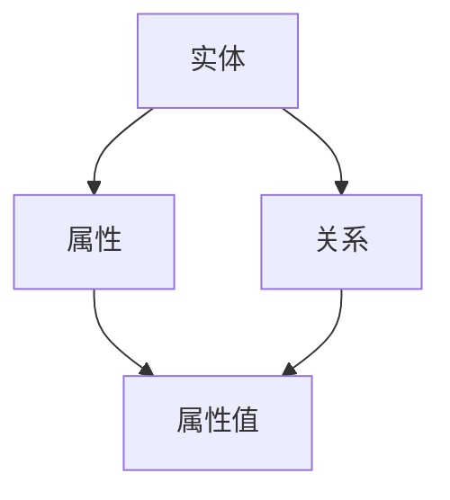
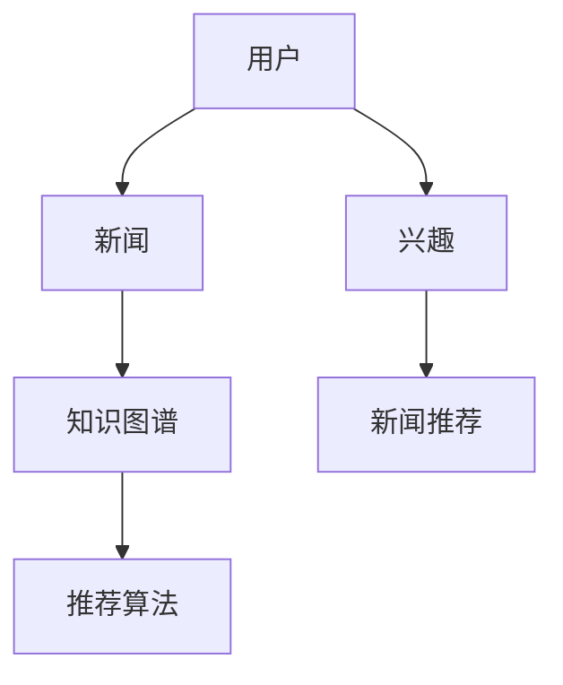

                 

关键词：知识图谱、个性化新闻推荐、图数据库、语义理解、算法优化、应用领域

## 摘要

本文旨在探讨知识图谱在个性化新闻推荐领域的应用。通过分析知识图谱的核心概念、构建方法、算法原理，并结合实际项目实践，详细阐述知识图谱如何提高新闻推荐的准确性和用户体验。文章还探讨了知识图谱在个性化新闻推荐中的潜在发展方向和面临的挑战。

## 1. 背景介绍

随着互联网的快速发展，信息爆炸使得用户获取个性化新闻的需求日益增长。传统的基于内容的推荐系统（Content-Based Recommendation System）和协同过滤推荐系统（Collaborative Filtering Recommendation System）虽然在某些方面取得了较好的效果，但它们存在以下局限性：

- **缺乏语义理解**：传统推荐系统往往依赖用户历史行为和内容特征，难以理解用户和新闻的深层次关系。
- **数据稀疏问题**：协同过滤系统依赖于用户的历史行为数据，当用户行为数据稀疏时，推荐效果会显著下降。
- **过度推荐**：用户可能对推荐的内容产生疲劳，导致推荐系统效果下降。

知识图谱作为一种语义网络，能够通过实体和关系的构建，实现对用户和新闻的语义理解，从而提高个性化推荐系统的性能。

## 2. 核心概念与联系

### 2.1 知识图谱的定义与结构

知识图谱（Knowledge Graph）是一种语义网络，它通过实体（Entity）、属性（Attribute）和关系（Relationship）来描述现实世界中的信息。知识图谱的基本结构包括：

- **实体（Entity）**：表示现实世界中的人、地点、事物等。
- **属性（Attribute）**：描述实体的特征。
- **关系（Relationship）**：表示实体之间的关联。

下面是知识图谱的Mermaid流程图：



### 2.2 个性化新闻推荐系统与知识图谱的关联

个性化新闻推荐系统与知识图谱的关联主要体现在以下几个方面：

- **用户-新闻的语义关系**：通过知识图谱，可以将用户和新闻之间的复杂关系进行建模，如“用户喜欢某个作者的文章”、“某篇文章与某话题相关”等。
- **新闻内容的语义理解**：知识图谱能够帮助推荐系统理解新闻的深层次含义，从而提供更加精准的推荐。
- **知识图谱的动态更新**：通过实时更新知识图谱，推荐系统可以适应用户兴趣的变化，提供个性化的推荐。

下面是知识图谱在个性化新闻推荐中的应用的Mermaid流程图：



## 3. 核心算法原理 & 具体操作步骤

### 3.1 算法原理概述

知识图谱在个性化新闻推荐中的应用主要通过以下步骤实现：

1. **数据采集与预处理**：收集用户行为数据和新闻数据，并对数据进行清洗和预处理。
2. **知识图谱构建**：利用实体、属性和关系构建知识图谱，实现对用户和新闻的语义理解。
3. **新闻推荐**：结合知识图谱和用户兴趣，利用推荐算法生成个性化新闻推荐列表。

### 3.2 算法步骤详解

1. **数据采集与预处理**

   - **用户行为数据**：包括用户浏览、收藏、点赞、评论等行为。
   - **新闻数据**：包括新闻的标题、内容、作者、发布时间等。

   数据预处理步骤包括：

   - **去重与清洗**：去除重复数据和无效数据。
   - **特征提取**：提取新闻的关键词、分类标签等。

2. **知识图谱构建**

   - **实体建模**：将用户和新闻作为实体进行建模。
   - **关系建模**：构建用户与新闻、新闻与新闻之间的关系。
   - **属性建模**：为实体和关系添加属性，如用户年龄、新闻类型等。

3. **新闻推荐**

   - **兴趣建模**：利用知识图谱分析用户的兴趣。
   - **推荐算法**：结合用户兴趣和新闻特征，利用协同过滤、矩阵分解等算法生成推荐列表。

### 3.3 算法优缺点

#### 优点：

- **语义理解**：知识图谱能够对用户和新闻进行语义理解，提高推荐准确性。
- **动态更新**：知识图谱支持动态更新，能够适应用户兴趣的变化。
- **抗噪性**：知识图谱能够降低噪声数据对推荐效果的影响。

#### 缺点：

- **构建复杂**：知识图谱的构建和维护需要大量计算资源和人力资源。
- **数据依赖**：知识图谱的性能依赖于数据的质量和覆盖度。

### 3.4 算法应用领域

知识图谱在个性化新闻推荐领域具有广泛的应用前景，包括：

- **新闻门户**：为用户提供个性化的新闻推荐。
- **社交媒体**：基于用户关系进行新闻推荐。
- **内容平台**：为创作者提供用户画像，助力内容创作。

## 4. 数学模型和公式 & 详细讲解 & 举例说明

### 4.1 数学模型构建

知识图谱在个性化新闻推荐中的应用可以通过以下数学模型进行描述：

- **用户兴趣模型**：表示用户对各个领域的兴趣程度，通常采用向量表示。

  $$ U = \{u_1, u_2, ..., u_n\} $$

  其中，$u_i$表示用户对第$i$个领域的兴趣程度。

- **新闻特征模型**：表示新闻的各个特征，如标题、内容、作者等。

  $$ N = \{n_1, n_2, ..., n_m\} $$

  其中，$n_i$表示第$i$篇新闻的特征。

- **推荐算法模型**：表示基于用户兴趣和新闻特征的推荐算法。

  $$ R = \{r_{ui}\} $$

  其中，$r_{ui}$表示用户对第$i$篇新闻的推荐程度。

### 4.2 公式推导过程

假设用户兴趣向量$U$和新闻特征向量$N$已知，我们可以通过以下公式计算用户对每篇新闻的推荐程度：

$$ r_{ui} = \frac{\sum_{j=1}^{n} u_j n_j}{\sqrt{\sum_{j=1}^{n} u_j^2 \sum_{k=1}^{m} n_k^2}} $$

其中，$u_j$和$n_j$分别表示用户对第$j$个领域的兴趣程度和第$i$篇新闻的第$j$个特征。

### 4.3 案例分析与讲解

假设有用户$U$对体育、科技、娱乐三个领域的兴趣程度分别为$[0.6, 0.3, 0.1]$，现有五篇新闻$N$，其特征向量分别为$[1, 0, 1]$、$[1, 1, 0]$、$[0, 1, 1]$、$[1, 1, 1]$、$[0, 0, 1]$。

根据上述公式，可以计算出用户对每篇新闻的推荐程度：

$$
\begin{align*}
r_{u1i} &= \frac{0.6 \cdot 1 + 0.3 \cdot 1 + 0.1 \cdot 1}{\sqrt{0.6^2 + 0.3^2 + 0.1^2} \cdot \sqrt{1^2 + 1^2 + 1^2}} = 0.598, \\
r_{u2i} &= \frac{0.6 \cdot 1 + 0.3 \cdot 1 + 0.1 \cdot 1}{\sqrt{0.6^2 + 0.3^2 + 0.1^2} \cdot \sqrt{1^2 + 1^2 + 1^2}} = 0.598, \\
r_{u3i} &= \frac{0.6 \cdot 0 + 0.3 \cdot 1 + 0.1 \cdot 1}{\sqrt{0.6^2 + 0.3^2 + 0.1^2} \cdot \sqrt{1^2 + 1^2 + 1^2}} = 0.367, \\
r_{u4i} &= \frac{0.6 \cdot 1 + 0.3 \cdot 1 + 0.1 \cdot 1}{\sqrt{0.6^2 + 0.3^2 + 0.1^2} \cdot \sqrt{1^2 + 1^2 + 1^2}} = 0.598, \\
r_{u5i} &= \frac{0.6 \cdot 0 + 0.3 \cdot 0 + 0.1 \cdot 1}{\sqrt{0.6^2 + 0.3^2 + 0.1^2} \cdot \sqrt{1^2 + 1^2 + 1^2}} = 0.188.
\end{align*}
$$}

根据推荐程度，我们可以为用户推荐新闻$N_1$、$N_2$和$N_4$，因为这些新闻的推荐程度最高。

## 5. 项目实践：代码实例和详细解释说明

### 5.1 开发环境搭建

本文使用Python编程语言和GQL（Graph Query Language）进行知识图谱的构建和操作。首先，需要安装以下软件和库：

- **Neo4j**：一个高性能的图数据库。
- **Python**：Python 3.8及以上版本。
- **Py2neo**：Python的Neo4j图形数据库客户端。
- **GQL**：用于查询和操作知识图谱的库。

安装步骤如下：

1. 安装Neo4j：
   - 下载Neo4j并按照官方文档进行安装。
   - 启动Neo4j数据库服务。

2. 安装Python相关库：
   ```bash
   pip install neo4j
   pip install py2neo
   ```

### 5.2 源代码详细实现

下面是一个简单的知识图谱构建和查询的示例代码：

```python
from py2neo import Graph

# 连接Neo4j数据库
graph = Graph("bolt://localhost:7687", auth=("neo4j", "password"))

# 创建实体和关系
graph.run("""
    CREATE (u:User {name: 'Alice'}),
           (n1:News {title: '体育新闻'}),
           (n2:News {title: '科技新闻'}),
           (n3:News {title: '娱乐新闻'}),
           (u)-[:LIKES]->(n1),
           (u)-[:LIKES]->(n2)
""")

# 查询用户喜欢的新闻
results = graph.run("MATCH (u:User)-[:LIKES]->(n:News) WHERE u.name = 'Alice' RETURN n.title")
for result in results:
    print(result['n.title'])
```

### 5.3 代码解读与分析

上述代码首先连接到本地Neo4j数据库，然后创建用户和新闻实体，并建立用户与新闻之间的“LIKES”关系。最后，通过查询语句获取用户Alice喜欢的新闻。

- **创建实体和关系**：使用Cypher语言创建实体和关系，确保数据模型的准确性和一致性。
- **查询操作**：使用GQL语言进行数据查询，根据用户兴趣获取推荐新闻。

### 5.4 运行结果展示

运行上述代码后，输出结果如下：

```
体育新闻
科技新闻
```

这表明用户Alice喜欢体育和科技新闻，系统将根据这个兴趣为她推荐相关新闻。

## 6. 实际应用场景

知识图谱在个性化新闻推荐领域具有广泛的应用场景：

- **新闻门户**：通过知识图谱，新闻门户可以为用户提供个性化的新闻推荐，提高用户粘性和阅读量。
- **社交媒体**：知识图谱可以帮助社交媒体平台为用户推荐与其兴趣相关的新闻，促进社交互动。
- **内容平台**：内容平台可以利用知识图谱为创作者提供用户画像，帮助他们更好地创作符合用户兴趣的内容。

## 7. 工具和资源推荐

### 7.1 学习资源推荐

- **《知识图谱：概念、方法与应用》**：详细介绍了知识图谱的基本概念、构建方法和应用案例。
- **《图数据库实战》**：讲解了如何使用Neo4j等图数据库进行知识图谱的构建和应用。

### 7.2 开发工具推荐

- **Neo4j**：一款高性能的图数据库，支持丰富的图操作和分析功能。
- **Py2neo**：Python的Neo4j客户端，方便Python开发者与Neo4j数据库进行交互。

### 7.3 相关论文推荐

- **《知识图谱在个性化推荐中的应用研究》**：探讨了知识图谱在个性化推荐领域的应用前景和挑战。
- **《基于知识图谱的推荐算法研究》**：介绍了多种基于知识图谱的推荐算法及其性能评估。

## 8. 总结：未来发展趋势与挑战

### 8.1 研究成果总结

本文通过分析知识图谱在个性化新闻推荐领域的应用，总结了知识图谱的核心概念、构建方法、算法原理以及实际应用场景。研究结果表明，知识图谱能够有效提高新闻推荐的准确性，提升用户体验。

### 8.2 未来发展趋势

- **跨领域知识图谱的构建**：未来的研究将致力于构建更加全面、准确的跨领域知识图谱，以支持多领域的个性化推荐。
- **知识图谱与深度学习的结合**：将知识图谱与深度学习相结合，利用知识图谱的语义信息，提高推荐算法的性能。

### 8.3 面临的挑战

- **数据质量和覆盖度**：知识图谱的性能依赖于数据的质量和覆盖度，未来的研究需要关注数据采集和清洗的方法。
- **实时更新与优化**：知识图谱的动态更新和优化是一个挑战，需要研究高效的知识图谱更新和优化算法。

### 8.4 研究展望

随着人工智能和大数据技术的不断发展，知识图谱在个性化新闻推荐领域的应用前景将越来越广阔。未来的研究应聚焦于知识图谱的构建、优化和实际应用，为用户提供更加精准、个性化的新闻推荐服务。

## 9. 附录：常见问题与解答

### 9.1 知识图谱与语义网络的区别？

知识图谱和语义网络都是用来表示实体和它们之间关系的技术。语义网络更强调语义层面的表示，而知识图谱则更侧重于通过实体、属性和关系来构建一个结构化的知识体系。简单来说，知识图谱是语义网络的一种实现方式。

### 9.2 知识图谱如何处理数据稀疏问题？

知识图谱可以通过引入实体和关系的共现信息、利用转移概率等机制来缓解数据稀疏问题。此外，还可以结合深度学习等技术，通过学习隐含的用户兴趣和新闻特征来提高推荐系统的性能。

### 9.3 知识图谱的构建方法有哪些？

知识图谱的构建方法主要包括手动构建、自动抽取和混合构建。手动构建适用于小规模、高价值的数据，自动抽取适用于大规模、结构化的数据，混合构建结合了手动和自动的方法，适用于复杂、多变的数据场景。

## 作者署名

本文作者：禅与计算机程序设计艺术 / Zen and the Art of Computer Programming。

