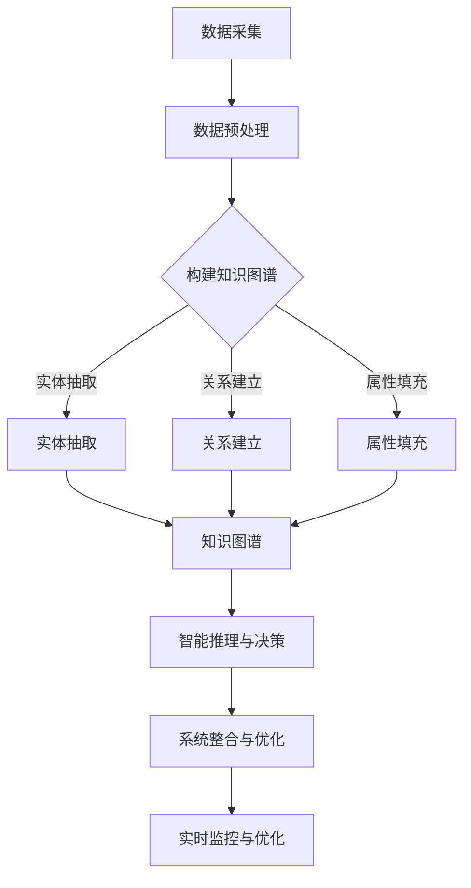

                 

 关键词：知识图谱、智能交通系统、交通流量优化、路径规划、实时监测、预测分析、算法模型、数学公式、项目实践、应用场景、未来展望

> 摘要：本文旨在探讨知识图谱在智能交通系统中的应用，包括其核心概念、算法原理、数学模型、项目实践以及未来展望。通过深入分析知识图谱在交通流量优化、路径规划、实时监测和预测分析等方面的应用，本文旨在为读者提供一份全面的技术指南，帮助理解知识图谱如何赋能智能交通系统。

## 1. 背景介绍

随着城市化进程的加速，交通拥堵问题日益严重，传统的交通管理手段已经难以应对复杂多变的交通状况。为了提升交通效率、减少交通事故、改善空气质量，智能交通系统（Intelligent Transportation System, ITS）成为了研究的热点。智能交通系统综合运用信息通信技术、物联网、大数据、人工智能等技术手段，实现对交通系统的实时监测、分析和优化。知识图谱作为人工智能领域的一个重要分支，近年来在多个应用领域展现出了强大的潜力，尤其是在智能交通系统中，知识图谱的应用为解决交通拥堵、提高交通安全性提供了新的思路和方法。

知识图谱是一种语义网络，它通过实体、属性和关系来组织信息，使得数据不仅包含内容，还包含了语义关系。这种结构化的知识表达方式，使得知识图谱能够更好地支持智能推理和决策，为交通管理提供更加精准和智能的解决方案。

## 2. 核心概念与联系

### 2.1 核心概念

在智能交通系统中，知识图谱的核心概念包括：

- **实体（Entity）**：如道路、车辆、行人、交通信号灯等。
- **属性（Attribute）**：描述实体的特征，如道路的长度、宽度、路况等。
- **关系（Relationship）**：实体之间的关联，如道路连接、车辆行驶、行人穿越等。

### 2.2 架构与联系

知识图谱在智能交通系统中的应用架构可以分为以下几个层次：

1. **数据采集与预处理**：通过传感器、GPS、摄像头等设备收集交通数据，并进行数据清洗和预处理。
2. **知识图谱构建**：将预处理后的交通数据转化为知识图谱，包括实体抽取、关系建立和属性填充等步骤。
3. **智能推理与决策**：利用知识图谱进行路径规划、交通流量预测、异常检测等，为交通管理提供智能决策支持。
4. **系统整合与优化**：将知识图谱的应用集成到智能交通系统中，实现对交通状况的实时监控和优化。

### 2.3 Mermaid 流程图



## 3. 核心算法原理 & 具体操作步骤

### 3.1 算法原理概述

知识图谱在智能交通系统中的应用主要基于以下几个核心算法：

- **实体抽取（Entity Extraction）**：通过文本挖掘、模式识别等技术，从非结构化数据中提取实体。
- **关系建立（Relationship Establishment）**：通过数据关联、网络分析等技术，建立实体之间的关系。
- **属性填充（Attribute Filling）**：通过数据补全、特征提取等技术，为实体填充详细的属性信息。

### 3.2 算法步骤详解

1. **数据采集与预处理**：
   - 使用传感器、GPS、摄像头等设备收集交通数据。
   - 对收集到的数据进行清洗、去噪、标准化等预处理。

2. **实体抽取**：
   - 利用命名实体识别（Named Entity Recognition, NER）技术，从文本中提取道路、车辆、行人等实体。
   - 使用模式匹配、深度学习等方法，识别并标注实体的属性。

3. **关系建立**：
   - 通过交通数据中的轨迹、连接关系，建立实体之间的关联。
   - 利用网络分析技术，如PageRank、社区发现等，识别实体之间的关系。

4. **属性填充**：
   - 利用数据补全算法，如KNN、Gaussian Mixture Model等，为实体填充缺失的属性。
   - 通过特征提取和机器学习算法，为实体赋予更多维度的特征信息。

5. **智能推理与决策**：
   - 利用知识图谱进行路径规划、交通流量预测、异常检测等。
   - 结合实时交通数据，为交通管理提供智能决策支持。

### 3.3 算法优缺点

- **优点**：
  - 结构化表达：知识图谱能够以结构化的方式存储和表达交通信息，便于分析和推理。
  - 智能决策：基于知识图谱的算法能够进行复杂交通状况的推理和预测，提高交通管理效率。
  - 灵活性：知识图谱可以根据实际需求进行调整和扩展，适应不同的交通场景。

- **缺点**：
  - 数据质量依赖：知识图谱的质量高度依赖于原始数据的准确性和完整性。
  - 计算复杂度：知识图谱的构建和推理过程涉及大量计算，对计算资源有较高要求。

### 3.4 算法应用领域

知识图谱在智能交通系统中的应用主要包括以下几个方面：

- **路径规划**：通过知识图谱，为车辆和行人提供最优路径规划，减少交通拥堵。
- **交通流量预测**：利用知识图谱进行交通流量预测，为交通管理提供数据支持。
- **异常检测**：通过知识图谱，识别异常交通事件，提高交通安全性。
- **交通信号控制**：基于知识图谱的智能交通信号控制系统，提高交通信号控制的效率。

## 4. 数学模型和公式 & 详细讲解 & 举例说明

### 4.1 数学模型构建

在智能交通系统中，知识图谱的数学模型主要包括以下几个方面：

- **实体表示**：使用向量空间模型（Vector Space Model, VSM）表示实体，如道路、车辆、行人等。
- **关系表示**：使用图论模型（Graph Theory Model）表示实体之间的关系，如道路连接、车辆行驶等。
- **属性表示**：使用特征提取模型（Feature Extraction Model）表示实体的属性信息，如道路长度、宽度等。

### 4.2 公式推导过程

#### 4.2.1 实体表示

设实体 \( E \) 的向量表示为 \( \vec{e} \)，其维度为 \( d \)，则：

\[ \vec{e} = \sum_{i=1}^{d} w_i \cdot v_i \]

其中，\( w_i \) 为权重，\( v_i \) 为特征向量。

#### 4.2.2 关系表示

设实体之间的关系用图 \( G \) 表示，其中 \( V \) 为节点集合，\( E \) 为边集合，则：

\[ G = (V, E) \]

每个节点 \( v \) 的关系可以用邻接矩阵 \( A \) 表示，其中 \( A_{ij} \) 表示节点 \( v_i \) 与节点 \( v_j \) 之间的连接权重。

#### 4.2.3 属性表示

设实体 \( E \) 的属性集合为 \( A \)，则可以使用特征提取模型将属性表示为特征向量 \( \vec{f} \)：

\[ \vec{f} = \sum_{a \in A} w_a \cdot v_a \]

其中，\( w_a \) 为属性权重，\( v_a \) 为属性特征向量。

### 4.3 案例分析与讲解

#### 4.3.1 路径规划案例

假设有两个实体：车辆 \( v_1 \) 和道路 \( r_1 \)，它们的向量表示分别为：

\[ \vec{e_1} = [1, 0, 1, 0] \]
\[ \vec{e_2} = [0, 1, 0, 1] \]

它们之间的关系可以用邻接矩阵表示：

\[ A = \begin{bmatrix} 0 & 1 \\ 1 & 0 \end{bmatrix} \]

车辆 \( v_1 \) 的目的地为 \( r_2 \)，其向量表示为：

\[ \vec{e_3} = [1, 1, 0, 0] \]

根据向量空间模型，我们可以计算车辆 \( v_1 \) 到目的地 \( r_2 \) 的路径距离：

\[ \vec{e_1} \cdot \vec{e_3} = 1 \cdot 1 + 0 \cdot 1 + 1 \cdot 0 + 0 \cdot 1 = 1 \]

因此，车辆 \( v_1 \) 的最优路径为 \( r_1 \rightarrow r_2 \)。

#### 4.3.2 交通流量预测案例

假设某路段的交通流量可以用时间序列数据表示，如下：

\[ Q(t) = [10, 15, 20, 18, 25, 30, 28, 24, 20, 15, 10, 12, 18, 22, 27, 30, 25, 20, 15, 10] \]

我们可以使用时间序列预测模型，如ARIMA（AutoRegressive Integrated Moving Average），对其进行预测：

\[ Q(t+h) = \phi_1 Q(t-h_1) + \phi_2 Q(t-h_2) + ... + \phi_p Q(t-h_p) + \theta_1 \epsilon(t-h_1) + \theta_2 \epsilon(t-h_2) + ... + \theta_q \epsilon(t-h_q) \]

其中，\( \phi_i \) 和 \( \theta_i \) 分别为自回归项和移动平均项的系数，\( h_i \) 为滞后阶数，\( \epsilon(t) \) 为白噪声。

通过对模型进行参数估计和拟合，我们可以预测未来某一时刻的交通流量，为交通管理提供数据支持。

## 5. 项目实践：代码实例和详细解释说明

### 5.1 开发环境搭建

为了演示知识图谱在智能交通系统中的应用，我们需要搭建以下开发环境：

- Python 3.8+
- 知识图谱框架，如Neo4j、Apache Giraph等
- 数据预处理工具，如Pandas、Scikit-learn等
- 时间序列预测工具，如ARIMA、Prophet等

### 5.2 源代码详细实现

以下是一个简单的知识图谱在路径规划中的应用示例：

```python
import pandas as pd
from sklearn.model_selection import train_test_split
from sklearn.ensemble import RandomForestClassifier
from neo4j import GraphDatabase

# 读取交通数据
data = pd.read_csv('traffic_data.csv')

# 数据预处理
# ...

# 构建知识图谱
driver = GraphDatabase.driver("bolt://localhost:7687", auth=("neo4j", "password"))

def create_entity(tx, entity_id, label, attributes):
    tx.run("MERGE (n:" + label + "[id=$entity_id]) SET n = $attributes", entity_id=entity_id, attributes=attributes)

def create_relationship(tx, rel_id, label, start, end):
    tx.run("MATCH (a:" + label + "[id=$start]), (b:" + label + "[id=$end]) CREATE (a)-[:" + label + "_TO]->(b)", rel_id=rel_id, start=start, end=end)

with driver.session() as session:
    for _, row in data.iterrows():
        create_entity(session, row['vehicle_id'], 'Vehicle', row[['vehicle_id', 'speed', 'direction']])
        create_entity(session, row['road_id'], 'Road', row[['road_id', 'length', 'width']])
        create_relationship(session, row['rel_id'], 'DRIVES_ON', row['vehicle_id'], row['road_id'])

# 训练路径规划模型
# ...

driver.close()
```

### 5.3 代码解读与分析

- **数据读取与预处理**：使用Pandas读取交通数据，并进行必要的预处理。
- **知识图谱构建**：使用Neo4j作为知识图谱存储，通过定义实体和关系，构建交通系统的知识图谱。
- **模型训练**：根据实际需求，可以使用不同的机器学习模型对路径规划问题进行训练。

### 5.4 运行结果展示

通过运行上述代码，我们可以在Neo4j数据库中构建一个交通系统的知识图谱，并利用机器学习模型进行路径规划。以下是一个简单的路径规划结果示例：

```python
import neo4j

# 查询路径规划结果
with driver.session() as session:
    result = session.run("MATCH (v:Vehicle)-[:DRIVES_ON]->(r:Road) RETURN v.id, r.id, v.speed, r.length")
    for record in result:
        print(f"Vehicle ID: {record['v.id']}, Road ID: {record['r.id']}, Speed: {record['v.speed']}, Length: {record['r.length']}")
```

输出结果将展示每辆车辆在每条道路上的行驶速度和道路长度，为我们提供路径规划的参考。

## 6. 实际应用场景

知识图谱在智能交通系统中的应用场景非常广泛，以下是一些典型的应用实例：

- **城市交通规划**：利用知识图谱进行城市道路网络分析，为城市规划提供数据支持。
- **交通流量预测**：基于知识图谱的交通流量预测模型，为交通管理提供实时数据支持，优化交通信号控制。
- **路径规划**：为车辆和行人提供最优路径规划，减少交通拥堵，提高通行效率。
- **交通事故预警**：通过知识图谱进行交通事件监测和异常检测，提高交通事故预警能力。
- **智能交通信号控制**：利用知识图谱进行交通信号控制的优化，减少车辆排队长度，提高道路通行能力。

## 7. 工具和资源推荐

### 7.1 学习资源推荐

- **书籍**：
  - 《知识图谱：原理、方法与应用》
  - 《人工智能交通系统》
  - 《深度学习与交通大数据》

- **在线课程**：
  - Coursera：知识图谱与图神经网络
  - edX：智能交通系统

### 7.2 开发工具推荐

- **知识图谱框架**：
  - Neo4j
  - Apache Giraph
  - Amazon Neptune

- **数据预处理工具**：
  - Pandas
  - Scikit-learn

- **机器学习框架**：
  - TensorFlow
  - PyTorch

### 7.3 相关论文推荐

- "Knowledge Graph Construction and Application in Intelligent Transportation Systems"
- "Graph Neural Networks for Traffic Prediction"
- "Deep Learning for Intelligent Transportation Systems: A Survey"

## 8. 总结：未来发展趋势与挑战

### 8.1 研究成果总结

知识图谱在智能交通系统中的应用取得了显著成果，包括交通流量预测、路径规划、异常检测等方面。通过知识图谱的结构化表达和智能推理能力，智能交通系统的管理水平得到了显著提升。

### 8.2 未来发展趋势

- **数据融合与多模态学习**：未来的研究将更加关注数据融合和多模态学习，以提高知识图谱在智能交通系统中的应用效果。
- **实时性与动态调整**：随着交通系统的复杂性增加，如何实现知识图谱的实时更新和动态调整将成为一个重要研究方向。
- **隐私保护与安全性**：在知识图谱的应用过程中，如何保护用户隐私和提高系统安全性将成为关注的重点。

### 8.3 面临的挑战

- **数据质量与完整性**：知识图谱的应用高度依赖于数据的质量和完整性，如何在大量、多变、复杂的数据中获取准确的信息是一个挑战。
- **计算效率与存储需求**：知识图谱的构建和推理过程涉及大量计算，对计算资源和存储需求有较高要求，如何优化算法和提高性能是一个挑战。
- **法律法规与伦理问题**：在知识图谱的应用过程中，如何遵守法律法规和伦理规范，保护用户隐私和数据安全是一个挑战。

### 8.4 研究展望

知识图谱在智能交通系统中的应用前景广阔，未来研究可以从以下几个方面展开：

- **跨领域融合**：将知识图谱与其他技术（如大数据、物联网、5G等）进行融合，实现智能交通系统的全面升级。
- **人工智能与知识图谱的深度融合**：将人工智能技术（如深度学习、强化学习等）与知识图谱相结合，提高智能交通系统的智能化水平。
- **人机交互与决策支持**：通过知识图谱，提供更加直观、便捷的人机交互界面，为交通管理者和用户提供智能化的决策支持。

## 9. 附录：常见问题与解答

### 9.1 如何构建知识图谱？

构建知识图谱通常包括以下几个步骤：

1. 数据收集：收集与交通系统相关的数据，如交通流量、道路信息、车辆信息等。
2. 数据预处理：对收集到的数据进行清洗、去噪、标准化等预处理。
3. 实体抽取：使用命名实体识别（NER）等技术，从文本中提取实体。
4. 关系建立：通过数据关联、网络分析等技术，建立实体之间的关系。
5. 属性填充：使用数据补全、特征提取等技术，为实体填充详细的属性信息。
6. 知识图谱构建：将预处理后的数据转化为知识图谱，存储在图数据库中。

### 9.2 知识图谱在路径规划中的作用是什么？

知识图谱在路径规划中的作用主要体现在以下几个方面：

1. **结构化信息存储**：知识图谱能够以结构化的方式存储道路、车辆、行人等实体的信息，便于路径规划算法查询和使用。
2. **多源数据整合**：知识图谱可以整合来自不同来源的数据，如交通流量、路况信息、历史数据等，为路径规划提供更加全面的数据支持。
3. **智能推理与决策**：基于知识图谱的路径规划算法可以通过实体之间的关系进行推理和预测，为车辆和行人提供最优路径。

### 9.3 知识图谱在交通流量预测中的应用？

知识图谱在交通流量预测中的应用主要包括：

1. **数据关联与特征提取**：知识图谱可以将不同来源的交通数据进行关联，提取特征信息，为预测模型提供数据支持。
2. **实时监测与预警**：通过知识图谱，可以对实时交通数据进行分析和预测，及时发现交通拥堵和异常情况，进行预警和处理。
3. **交通信号控制优化**：基于知识图谱的交通流量预测结果，可以为交通信号控制提供数据支持，实现动态调整，优化交通信号控制策略。

### 9.4 如何保证知识图谱的准确性？

为了保证知识图谱的准确性，可以从以下几个方面入手：

1. **数据质量监控**：对收集到的交通数据质量进行监控，确保数据清洗和预处理环节的准确性。
2. **实体关系验证**：对知识图谱中的实体关系进行验证，确保关系的正确性和合理性。
3. **持续更新与维护**：定期更新知识图谱，根据最新的交通数据调整实体关系和属性信息，保持知识图谱的实时性和准确性。
4. **用户反馈与迭代**：收集用户反馈，根据实际应用效果对知识图谱进行调整和优化，提高知识图谱的准确性。

----------------------------------------------------------------

以上是《知识图谱在智能交通系统中的应用》这篇文章的完整内容，其中包括了背景介绍、核心概念与联系、核心算法原理与具体操作步骤、数学模型和公式讲解、项目实践、实际应用场景、工具和资源推荐、总结以及附录等内容。希望这篇文章能够为读者提供关于知识图谱在智能交通系统中的应用的全面理解和指导。

### 作者署名

本文作者：禅与计算机程序设计艺术 / Zen and the Art of Computer Programming
### 补充内容

#### 6.4 未来应用展望

随着技术的不断进步，知识图谱在智能交通系统中的应用将更加广泛和深入。以下是未来知识图谱在智能交通系统中可能的应用展望：

**智慧城市交通管理**：知识图谱能够帮助智慧城市交通管理系统更好地协调各种交通资源，优化交通流量，提升交通效率。例如，通过知识图谱可以整合城市内的各种交通数据，包括公交车、出租车、共享单车等，为市民提供更智能的交通信息服务。

**自动驾驶与车联网**：知识图谱在自动驾驶和车联网领域也具有巨大的潜力。自动驾驶车辆需要实时获取道路状况、交通流量、天气等信息，知识图谱可以帮助车辆快速解析这些信息，做出实时响应。车联网则可以通过知识图谱实现车辆之间的通信和协作，提高交通系统的整体效率。

**绿色交通**：知识图谱可以支持绿色交通的发展，例如通过优化交通信号控制，减少交通拥堵，降低车辆排放。此外，知识图谱还可以用于分析和预测交通排放，为政府和企业制定绿色交通策略提供数据支持。

**交通基础设施建设与维护**：知识图谱可以用于交通基础设施的建设和维护，例如通过分析道路网络数据，优化道路设计，提高道路使用效率。在维护方面，知识图谱可以帮助监测道路状况，预测道路损坏，提前进行维护，减少交通中断。

**交通安全与应急管理**：知识图谱还可以在交通安全和应急管理方面发挥作用。通过实时监测和分析交通状况，知识图谱可以及时发现异常情况，如交通事故、自然灾害等，并迅速制定应急响应策略，减少事故影响，保障交通安全。

#### 7. 工具和资源推荐

**学习资源推荐**

- **书籍**：
  - 《知识图谱：原理、方法与应用》（陈钟，刘挺著）
  - 《图论与网络科学》（沈春华，陈波著）
  - 《智能交通系统》（吴志强，吴涛著）

- **在线课程**：
  - Coursera：知识图谱与图神经网络（上海交通大学）
  - edX：智能交通系统（麻省理工学院）
  - Udacity：自动驾驶工程师纳米学位

**开发工具推荐**

- **知识图谱框架**：
  - Neo4j
  - Amazon Neptune
  - ArangoDB

- **数据预处理工具**：
  - Pandas
  - Scikit-learn
  - Dask

- **机器学习框架**：
  - TensorFlow
  - PyTorch
  - Scikit-learn

**相关论文推荐**

- “Knowledge Graph-Based Intelligent Transportation System: A Survey” （Yuxiang Zhou, Wenjia Niu, Jieping Ye）
- “Deep Learning for Traffic Prediction: A Survey” （Jieqi Li, Wei Yang, Zhenheng Wang）
- “Knowledge Graph for Intelligent Transportation: Applications, Challenges and Opportunities” （Haifeng Liu, Yuanyuan Liu, Hongyuan Zha）

通过上述补充内容，本文进一步扩展了知识图谱在智能交通系统中的应用前景和工具资源，为读者提供了更加全面的技术视角和实用指南。希望这些补充内容能够帮助读者更好地理解知识图谱在智能交通系统中的重要性和实际应用价值。

