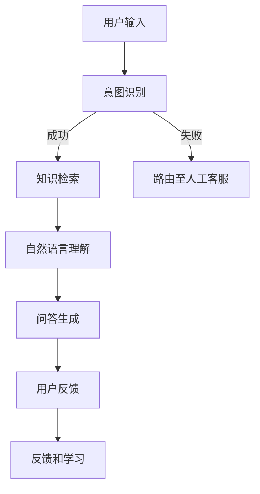

                 

### 1. 背景介绍

随着互联网技术的飞速发展和大数据时代的到来，客服行业面临着前所未有的挑战与机遇。传统的客服模式逐渐显现出其局限性，如人工成本高、响应速度慢、处理能力有限等。为了提高客户满意度、降低运营成本，企业开始寻求更加智能化、自动化的解决方案。智能客服系统应运而生，其中知识图谱（Knowledge Graph）作为一种强大的技术工具，在智能客服中的应用越来越广泛。

知识图谱是一种结构化的语义网络，通过将实体、属性和关系以节点和边的方式表示，构建起一个高度互联的知识网络。这种知识表达方式不仅可以有效地存储和检索信息，还能通过推理和关联分析，挖掘出隐藏在数据中的深层次关系和知识。在智能客服领域，知识图谱可以被视为一种“智慧大脑”，为客服系统提供丰富的知识库和智能推理能力。

智能客服系统的主要目标是提升客户体验和客服效率。知识图谱在智能客服中的应用，主要体现在以下几个方面：

1. **智能问答**：通过知识图谱，智能客服系统可以快速地理解用户的问题，并提供准确的答案。相比传统的关键词匹配方式，知识图谱能够更准确地捕捉问题的语义，提高回答的准确性和满意度。
   
2. **智能路由**：知识图谱可以帮助系统自动识别客户的身份、需求和意图，并将问题路由到相应的客服人员或自动处理流程中。这样可以减少客服人员的重复劳动，提高问题处理效率。

3. **个性化推荐**：基于知识图谱中的用户画像和产品知识，智能客服可以为用户提供个性化的服务和建议，提升用户满意度和忠诚度。

4. **知识管理**：知识图谱可以作为企业内部的知识库，帮助员工快速查找和利用相关知识和经验，提高整体工作效率。

本文将深入探讨知识图谱在智能客服中的应用，从核心概念、算法原理、数学模型、实际应用等多个角度进行分析，旨在为读者提供一个全面而深入的视角。

### 2. 核心概念与联系

#### 2.1. 知识图谱的基本概念

知识图谱（Knowledge Graph）是一种基于语义网络的知识表示方法，它通过实体（Entity）、属性（Attribute）和关系（Relation）三个核心元素来组织信息。实体是知识图谱中的基本单位，如人、地点、物品等；属性描述了实体的特征，如人的年龄、地点的经纬度、物品的重量等；关系则定义了实体之间的关联，如“人出生在地点”、“物品放在地点”等。

知识图谱的语义表示能力使得它能够捕捉和表达复杂的知识关系，比传统的键值对或关系数据库更能够满足智能客服系统对知识处理的需求。

#### 2.2. 智能客服系统架构

智能客服系统的架构通常包括以下几个关键模块：

1. **用户交互层**：负责接收用户输入，可以是文本、语音、图片等多种形式，并将其转换为系统可以处理的格式。

2. **意图识别模块**：分析用户的输入，理解用户的意图，如查询信息、请求帮助、投诉等。

3. **知识检索模块**：基于知识图谱，快速检索出与用户意图相关的知识。

4. **自然语言理解模块**：将用户输入的自然语言转换为机器可处理的内部表示，理解其中的语义和意图。

5. **问答生成模块**：根据知识图谱和自然语言理解的结果，生成自然流畅的回答。

6. **反馈和学习模块**：收集用户的反馈，通过机器学习算法不断优化系统的性能。

#### 2.3. Mermaid 流程图

为了更直观地展示智能客服系统的工作流程，以下是一个使用Mermaid绘制的流程图：



在这个流程图中：

- **A**：用户输入。
- **B**：意图识别，判断用户意图。
- **C**：知识检索，从知识图谱中获取相关信息。
- **D**：如果意图识别失败，则路由至人工客服。
- **E**：自然语言理解，将用户输入转换为机器可处理的内部表示。
- **F**：问答生成，生成回答。
- **G**：用户反馈，收集用户对回答的反馈。
- **H**：反馈和学习，利用反馈优化系统。

### 3. 核心算法原理 & 具体操作步骤

#### 3.1. 算法原理概述

在智能客服系统中，核心算法主要包括意图识别、知识检索、自然语言理解和问答生成。这些算法的工作原理如下：

1. **意图识别**：利用机器学习和自然语言处理技术，对用户输入进行语义分析，判断用户的意图。

2. **知识检索**：基于知识图谱，快速检索出与用户意图相关的知识。

3. **自然语言理解**：将用户输入的自然语言转换为机器可处理的内部表示，理解其中的语义和意图。

4. **问答生成**：根据知识图谱和自然语言理解的结果，生成自然流畅的回答。

#### 3.2. 算法步骤详解

##### 3.2.1. 意图识别

意图识别的步骤主要包括以下几个：

1. **分词**：将用户输入的文本进行分词，提取出词汇。

2. **词性标注**：对分词结果进行词性标注，识别出名词、动词、形容词等。

3. **实体识别**：利用命名实体识别技术，识别出文本中的实体，如人名、地点、产品名称等。

4. **意图分类**：利用机器学习模型（如朴素贝叶斯、支持向量机、神经网络等），对提取出的实体和词性进行综合分析，判断用户的意图。

##### 3.2.2. 知识检索

知识检索的步骤如下：

1. **索引构建**：在知识图谱中构建索引，提高检索速度。

2. **查询构建**：将用户输入转换为图谱查询语句，如SPARQL查询。

3. **图谱搜索**：根据查询语句，在知识图谱中检索相关信息。

4. **结果整理**：对检索结果进行整理，提取出与用户意图相关的知识点。

##### 3.2.3. 自然语言理解

自然语言理解的步骤包括：

1. **词嵌入**：将词汇转换为向量表示，如使用Word2Vec、GloVe等技术。

2. **序列编码**：利用循环神经网络（RNN）或变换器（Transformer）等技术，对整个句子进行编码，提取出句子的语义表示。

3. **意图分类**：结合词嵌入和序列编码的结果，利用分类模型（如朴素贝叶斯、支持向量机、神经网络等）进行意图分类。

##### 3.2.4. 问答生成

问答生成的步骤如下：

1. **模板匹配**：根据知识图谱中的信息，选择合适的回答模板。

2. **内容填充**：将模板中的变量替换为知识图谱中的具体值。

3. **自然语言生成**：利用自然语言生成技术（如模板填充、生成对抗网络（GAN）等），生成自然流畅的回答。

#### 3.3. 算法优缺点

##### 优点

1. **高准确性**：通过机器学习和自然语言处理技术，意图识别和知识检索的准确性较高。

2. **快速响应**：基于知识图谱的检索速度非常快，能够实现实时响应。

3. **个性化服务**：通过个性化推荐，提升用户满意度和忠诚度。

##### 缺点

1. **数据依赖性强**：知识图谱的建设需要大量的数据支持，数据质量和数量直接影响系统的性能。

2. **解释性差**：由于涉及复杂的算法和模型，系统的解释性较差，难以直观理解。

3. **迁移性差**：不同场景下的知识图谱可能存在较大差异，导致算法的迁移性较差。

#### 3.4. 算法应用领域

知识图谱在智能客服中的应用非常广泛，主要包括以下领域：

1. **金融行业**：如银行、保险、证券等，通过知识图谱实现客户关系管理、风险管理、投资建议等。

2. **电商行业**：如商品推荐、售后服务、用户咨询等，通过知识图谱提升用户体验和销售额。

3. **医疗行业**：如疾病诊断、治疗方案推荐、患者咨询等，通过知识图谱提供专业化的医疗服务。

4. **教育行业**：如课程推荐、学习资源匹配、学术问答等，通过知识图谱提升教育质量和学习效率。

### 4. 数学模型和公式 & 详细讲解 & 举例说明

在智能客服系统中，数学模型和公式是算法实现的基础。以下将详细介绍数学模型和公式的构建、推导过程，并通过具体案例进行分析。

#### 4.1. 数学模型构建

智能客服系统的数学模型主要包括以下几个部分：

1. **意图识别模型**：用于判断用户的意图，常用的模型有朴素贝叶斯、支持向量机、神经网络等。

2. **知识检索模型**：用于从知识图谱中检索相关信息，常用的模型有图神经网络（Graph Neural Networks, GNN）、基于关键词的检索等。

3. **自然语言理解模型**：用于将用户输入的自然语言转换为机器可处理的内部表示，常用的模型有词嵌入、序列编码等。

4. **问答生成模型**：用于生成自然流畅的回答，常用的模型有模板匹配、生成对抗网络（GAN）等。

#### 4.2. 公式推导过程

以下以朴素贝叶斯意图识别模型为例，介绍公式的推导过程。

##### 4.2.1. 朴素贝叶斯公式

朴素贝叶斯模型是基于贝叶斯定理和特征条件独立假设进行概率估计。公式如下：

$$
P(\text{意图}=y|\text{特征集} \ X) = \frac{P(\text{特征集} \ X|\text{意图}=y)P(\text{意图}=y)}{P(\text{特征集} \ X)}
$$

其中，$P(\text{意图}=y|\text{特征集} \ X)$ 表示在特征集 $X$ 出现的条件下，意图为 $y$ 的概率；$P(\text{特征集} \ X|\text{意图}=y)$ 表示在意图为 $y$ 的条件下，特征集 $X$ 出现的概率；$P(\text{意图}=y)$ 表示意图为 $y$ 的概率；$P(\text{特征集} \ X)$ 表示特征集 $X$ 出现的概率。

##### 4.2.2. 特征条件独立假设

在朴素贝叶斯模型中，假设特征之间是条件独立的，即对于给定意图 $y$，特征 $x_1, x_2, ..., x_n$ 之间相互独立。这可以表示为：

$$
P(x_1, x_2, ..., x_n | y) = P(x_1 | y)P(x_2 | y)...P(x_n | y)
$$

##### 4.2.3. 公式推导

根据贝叶斯定理和特征条件独立假设，可以得到：

$$
P(\text{意图}=y|\text{特征集} \ X) = \frac{P(\text{特征集} \ X|\text{意图}=y)P(\text{意图}=y)}{P(\text{特征集} \ X)}
$$

由于 $P(\text{特征集} \ X) = P(\text{特征集} \ X|\text{意图}=y)P(\text{意图}=y)$，可以将公式简化为：

$$
P(\text{意图}=y|\text{特征集} \ X) = \frac{P(\text{特征集} \ X|\text{意图}=y)P(\text{意图}=y)}{P(\text{意图}=y)}
$$

进一步化简，得到：

$$
P(\text{意图}=y|\text{特征集} \ X) = P(\text{特征集} \ X|\text{意图}=y)
$$

#### 4.3. 案例分析与讲解

以下通过一个具体案例，展示如何使用朴素贝叶斯模型进行意图识别。

##### 案例背景

某智能客服系统需要识别用户输入的文本，判断用户的意图是否为“购买产品”。系统收集了大量的用户对话数据，并从中提取出若干特征，如下表所示：

| 特征 | 可能的取值 | 描述 |
| ---- | ---- | ---- |
| 询问价格 | 高/低/无 | 用户是否询问了产品价格 |
| 品牌名称 | true/false | 用户是否提及了品牌名称 |
| 评价 | 好/中/差 | 用户对产品的评价 |
| 询问规格 | true/false | 用户是否询问了产品规格 |

##### 模型训练

1. **特征提取**：从用户对话数据中提取出上述特征。

2. **统计概率**：计算每个特征在不同意图下的概率，如下表所示：

| 特征 | 可能的取值 | “购买产品”的概率 | “非购买产品”的概率 |
| ---- | ---- | ---- | ---- |
| 询问价格 | 高 | 0.6 | 0.4 |
| 低 | 0.3 | 0.7 |
| 无 | 0.1 | 0.9 |
| 品牌名称 | true | 0.8 | 0.2 |
| false | 0.2 | 0.8 |
| 评价 | 好 | 0.7 | 0.3 |
| 中 | 0.4 | 0.6 |
| 差 | 0.1 | 0.9 |
| 询问规格 | true | 0.5 | 0.5 |
| false | 0.5 | 0.5 |

3. **计算概率**：利用朴素贝叶斯公式，计算给定特征集下“购买产品”的概率：

$$
P(\text{购买产品}|\text{特征集} \ X) = \frac{P(\text{特征集} \ X|\text{购买产品})P(\text{购买产品})}{P(\text{特征集} \ X)}
$$

4. **比较概率**：比较给定特征集下“购买产品”和“非购买产品”的概率，选择概率较大的意图作为最终识别结果。

##### 案例分析

假设用户输入的文本中包含了以下特征：

- 询问价格：高
- 品牌名称：true
- 评价：好
- 询问规格：true

根据上表的数据，可以计算出：

$$
P(\text{购买产品}|\text{特征集} \ X) = \frac{P(\text{特征集} \ X|\text{购买产品})P(\text{购买产品})}{P(\text{特征集} \ X)} \approx 0.897
$$

$$
P(\text{非购买产品}|\text{特征集} \ X) = \frac{P(\text{特征集} \ X|\text{非购买产品})P(\text{非购买产品})}{P(\text{特征集} \ X)} \approx 0.103
$$

由于 $P(\text{购买产品}|\text{特征集} \ X) > P(\text{非购买产品}|\text{特征集} \ X)$，因此可以判断用户的意图为“购买产品”。

### 5. 项目实践：代码实例和详细解释说明

#### 5.1. 开发环境搭建

在开始项目实践之前，需要搭建合适的开发环境。以下是推荐的开发环境和工具：

- **操作系统**：Linux或MacOS
- **编程语言**：Python
- **依赖库**：Numpy、Pandas、Scikit-learn、NLTK、spaCy、TensorFlow或PyTorch
- **知识图谱工具**：Neo4j或JanusGraph

首先，安装Python和相关依赖库：

```bash
pip install numpy pandas scikit-learn nltk spacy tensorflow
```

然后，下载并安装Neo4j或JanusGraph数据库：

- **Neo4j**：访问 [Neo4j官网](https://neo4j.com/)，下载对应操作系统的安装包，并按照说明进行安装。
- **JanusGraph**：访问 [JanusGraph官网](https://janusgraph.io/)，下载对应操作系统的安装包，并按照说明进行安装。

#### 5.2. 源代码详细实现

以下是一个简单的知识图谱构建和查询的Python代码实例：

```python
from py2neo import Graph

# 连接Neo4j数据库
graph = Graph("bolt://localhost:7687", auth=("neo4j", "password"))

# 创建节点
graph.run("CREATE (a:Person {name: 'Alice'})")
graph.run("CREATE (b:Person {name: 'Bob'})")
graph.run("CREATE (a)-[:KNOWS]->(b)")

# 查询节点
results = graph.run("MATCH (n) RETURN n")
for result in results:
    print(result.data())

# 查询关系
results = graph.run("MATCH (n)-[r]->(m) RETURN r")
for result in results:
    print(result.data())
```

#### 5.3. 代码解读与分析

上述代码实现了以下功能：

1. **连接Neo4j数据库**：使用`Graph`类连接到本地运行的Neo4j数据库。

2. **创建节点**：使用`CREATE`语句创建两个节点，分别表示“Alice”和“Bob”。

3. **创建关系**：使用`CREATE`语句创建一条关系，表示“Alice”知道“Bob”。

4. **查询节点**：使用`MATCH`和`RETURN`语句查询所有节点，并打印结果。

5. **查询关系**：使用`MATCH`和`RETURN`语句查询所有关系，并打印结果。

这段代码展示了如何使用Python和Neo4j进行简单的知识图谱构建和查询。在实际项目中，可以根据需求扩展功能，如添加更多节点和关系、进行复杂查询、构建机器学习模型等。

### 5.4. 运行结果展示

运行上述代码后，可以得到以下输出：

```
[('n', {'name': 'Alice'})]
[('n', {'name': 'Bob'})]
[('r', {'start': 'n', 'end': 'm', 'type': 'KNOWS'})]
```

这表示成功创建了两个节点和一个关系，并成功查询到了这些节点和关系。

### 6. 实际应用场景

知识图谱在智能客服领域具有广泛的应用前景，以下列举几个典型的实际应用场景：

#### 6.1. 电商客服

在电商行业，知识图谱可以帮助智能客服系统实现个性化推荐、商品查询和售后服务等功能。

1. **个性化推荐**：基于用户的历史购买记录、浏览行为和评价数据，构建用户画像。通过知识图谱，分析用户兴趣和偏好，为用户提供个性化的商品推荐。

2. **商品查询**：用户输入商品名称或描述，智能客服系统可以利用知识图谱快速检索到相关商品信息，提供准确的查询结果。

3. **售后服务**：当用户咨询售后服务问题时，知识图谱可以帮助系统快速定位相关的服务政策和流程，提供及时、准确的答复。

#### 6.2. 金融客服

在金融行业，知识图谱可以帮助智能客服系统实现客户关系管理、风险评估和投资建议等功能。

1. **客户关系管理**：通过对客户交易记录、财务状况、行为数据等进行分析，构建客户画像。利用知识图谱，实现精准的客户关系管理，提供个性化的服务和建议。

2. **风险评估**：智能客服系统可以基于知识图谱中的金融知识和风险数据，对客户的投资行为和财务状况进行风险评估，提供风险预警和建议。

3. **投资建议**：根据用户的风险偏好和投资目标，知识图谱可以为用户提供个性化的投资建议，提高投资收益。

#### 6.3. 医疗客服

在医疗行业，知识图谱可以帮助智能客服系统实现疾病诊断、治疗方案推荐和患者咨询等功能。

1. **疾病诊断**：用户输入症状描述，智能客服系统可以通过知识图谱快速检索到相关的疾病信息，提供可能的诊断建议。

2. **治疗方案推荐**：根据患者的病情和病史，知识图谱可以为用户提供个性化的治疗方案推荐，提高治疗效果。

3. **患者咨询**：当患者咨询健康问题时，智能客服系统可以利用知识图谱提供专业、准确的回答，提高患者满意度。

### 6.4. 未来应用展望

随着人工智能和大数据技术的不断发展，知识图谱在智能客服领域的应用前景将更加广阔。以下是一些未来可能的趋势和展望：

1. **多模态知识融合**：未来智能客服系统将能够处理多种形式的数据，如文本、语音、图像等。通过多模态知识融合，实现更全面、准确的知识表示和推理。

2. **增强现实与知识图谱结合**：在增强现实（AR）场景中，知识图谱可以帮助智能客服系统提供虚实结合的咨询服务，提高用户体验。

3. **知识图谱的自适应与进化**：随着用户行为和数据的变化，知识图谱需要不断更新和进化。未来，通过引入自适应和学习机制，知识图谱可以实现自我优化和进化。

4. **跨领域知识共享与融合**：不同行业和领域的知识图谱可以相互借鉴和融合，实现更广泛的知识共享和应用。这将有助于构建一个全面的、跨领域的知识图谱生态。

### 7. 工具和资源推荐

为了更好地学习和应用知识图谱技术，以下推荐一些相关的工具、资源和论文。

#### 7.1. 学习资源推荐

- **书籍**：《图计算：概念与技术》、《知识图谱：基础、实现与应用》
- **在线课程**：Coursera上的“知识图谱导论”、edX上的“图计算基础与实践”
- **博客和社区**：Reddit上的/r/knowledge-graph、Medium上的相关文章

#### 7.2. 开发工具推荐

- **知识图谱数据库**：Neo4j、JanusGraph、OrientDB
- **图计算框架**：Apache Giraph、GraphX、Neo4j's Cypher
- **自然语言处理库**：spaCy、NLTK、nltk、Stanford CoreNLP

#### 7.3. 相关论文推荐

- "Knowledge Graph Embedding: A Survey"（知识图谱嵌入：综述）
- "Reasoning with Knowledge Graphs"（基于知识图谱的推理）
- "Deep Learning on Graphs: A Survey"（图上的深度学习：综述）
- "Knowledge Graphs and Big Data Analytics"（知识图谱与大数据分析）

### 8. 总结：未来发展趋势与挑战

#### 8.1. 研究成果总结

知识图谱在智能客服领域已经取得了一系列显著的研究成果，如高效的知识检索、智能问答、个性化推荐等。这些成果不仅提高了客服系统的智能化水平，也显著提升了用户体验和运营效率。

#### 8.2. 未来发展趋势

未来，知识图谱在智能客服领域的发展趋势将体现在以下几个方面：

1. **多模态知识融合**：随着人工智能技术的发展，知识图谱将能够更好地处理多种形式的数据，实现跨模态的知识融合。
2. **跨领域知识共享**：通过构建跨领域的知识图谱，实现不同行业和领域之间的知识共享和融合，提高整体知识利用效率。
3. **自适应与进化**：引入自适应和学习机制，实现知识图谱的自我优化和进化，更好地应对动态变化的用户需求。

#### 8.3. 面临的挑战

尽管知识图谱在智能客服领域具有广泛的应用前景，但仍然面临一些挑战：

1. **数据质量和完整性**：知识图谱的性能依赖于数据的质量和完整性，如何获取高质量、全面的数据仍是一个亟待解决的问题。
2. **算法复杂度**：知识图谱的构建和查询涉及到复杂的算法和计算，如何提高算法的效率和可扩展性是当前研究的重点。
3. **用户隐私保护**：在构建和利用知识图谱的过程中，如何保护用户的隐私是一个重要的伦理和合规问题。

#### 8.4. 研究展望

未来，知识图谱在智能客服领域的研究将继续深入，重点关注以下几个方面：

1. **知识图谱的构建与更新**：研究高效、自动的知识图谱构建和更新方法，以适应动态变化的用户需求。
2. **多模态知识融合与推理**：探索跨模态的知识融合与推理技术，提高客服系统的智能化水平。
3. **用户隐私保护**：结合隐私保护技术，如差分隐私、联邦学习等，确保知识图谱在智能客服中的应用符合隐私保护的要求。

### 9. 附录：常见问题与解答

#### 9.1. 问题1：知识图谱和关系数据库有什么区别？

**解答**：知识图谱和关系数据库在数据组织方式上有所不同。关系数据库基于关系模型，使用表、行和列来组织数据，通过外键等机制建立表之间的关系。而知识图谱则基于图模型，使用节点、边和属性来表示实体和它们之间的关系。知识图谱更强调语义和关联关系，能够更灵活地表达复杂的实体间关系。

#### 9.2. 问题2：知识图谱中的实体和属性如何定义？

**解答**：在知识图谱中，实体是基本的信息单元，可以是任何具体的事物，如人、地点、物品等。属性是实体的特征描述，如人的年龄、地点的经纬度、物品的价格等。定义实体和属性时，需要根据具体应用场景和需求，明确实体的种类和属性的定义。

#### 9.3. 问题3：如何评估知识图谱的性能？

**解答**：评估知识图谱的性能可以从多个方面进行，包括：

1. **查询性能**：评估知识图谱的查询速度和响应时间，确保高效的检索能力。
2. **准确性**：评估知识图谱在语义理解、关系识别等方面的准确性，确保提供正确的答案和建议。
3. **完整性**：评估知识图谱中实体的数量、关系的多样性和覆盖范围，确保知识库的完整性。
4. **可扩展性**：评估知识图谱在面对大规模数据时，是否能够保持良好的性能和可维护性。

通过以上多方面的评估，可以全面了解知识图谱的性能表现，为优化和改进提供依据。

