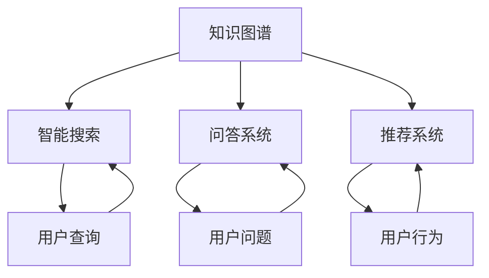

                 

### 1. 背景介绍

知识图谱作为一种重要的信息组织和管理技术，近年来在人工智能领域取得了显著的发展。知识图谱通过将实体、属性和关系表示为图结构，能够有效地捕捉和表示复杂的信息，从而为各种应用场景提供了强大的支持。

智能搜索、问答系统和推荐系统是知识图谱应用的三个重要领域。智能搜索利用知识图谱的结构化数据，能够提供更精确、更相关的搜索结果；问答系统通过知识图谱的语义理解能力，能够解答用户的问题并提供高质量的答案；推荐系统则利用知识图谱的关系推理能力，能够为用户推荐个性化、相关的内容。

本文将深入探讨知识图谱在智能搜索、问答系统和推荐系统的应用场景，详细分析其核心算法原理、操作步骤、数学模型以及实际应用案例。通过本文的阅读，读者将对知识图谱的应用场景有更加全面和深入的了解。

### 2. 核心概念与联系

#### 2.1 知识图谱的基本概念

知识图谱（Knowledge Graph）是一种用于表示实体、属性和关系的图形化数据结构。它通过将实体（如人、地点、物品等）、属性（如姓名、年龄、颜色等）和关系（如朋友、工作地点、属于等）表示为节点和边，将信息以图的形式组织起来，从而实现复杂信息的高效组织和查询。

#### 2.2 智能搜索、问答系统和推荐系统的基本概念

**智能搜索：** 智能搜索是一种利用人工智能技术，通过对用户查询的理解和语义分析，提供更加精准和个性化的搜索结果。智能搜索的核心在于对用户查询的理解和搜索结果的生成。

**问答系统：** 问答系统是一种能够理解用户问题并给出准确回答的人工智能系统。问答系统通过自然语言处理技术和知识图谱，能够对用户的问题进行解析，并从知识库中找出相关的答案。

**推荐系统：** 推荐系统是一种通过分析用户的兴趣和行为，为用户推荐相关内容的系统。推荐系统利用用户的历史数据和行为模式，通过算法模型预测用户的兴趣，并推荐相关的物品或内容。

#### 2.3 知识图谱与智能搜索、问答系统和推荐系统的联系

知识图谱作为智能搜索、问答系统和推荐系统的基础数据来源，为这些系统提供了结构化的数据支持。具体来说：

- **智能搜索：** 知识图谱提供了结构化的实体和关系信息，使得智能搜索能够更准确地理解用户查询，并提供更加相关和精确的搜索结果。

- **问答系统：** 知识图谱提供了丰富的实体和关系信息，使得问答系统能够更好地理解用户问题，从知识库中找到相关的答案。

- **推荐系统：** 知识图谱提供了实体和关系的信息，使得推荐系统能够更好地理解用户的行为和兴趣，预测用户的兴趣，并推荐相关的物品或内容。

#### 2.4 Mermaid 流程图

以下是一个简化的 Mermaid 流程图，展示了知识图谱与智能搜索、问答系统和推荐系统之间的联系。



### 3. 核心算法原理 & 具体操作步骤

#### 3.1 算法原理概述

知识图谱在智能搜索、问答系统和推荐系统中的应用，主要依赖于图算法和机器学习算法。以下分别介绍这些算法的基本原理。

**图算法：**

- **图遍历算法：** 如 BFS 和 DFS，用于对知识图谱进行遍历，找到与给定实体相关的所有节点。

- **路径搜索算法：** 如 Dijkstra 算法和 A* 算法，用于在知识图谱中找到最短路径或最优路径。

- **关系推理算法：** 如 Transitive Closure 和 Rule-based Inference，用于在知识图谱中推导新的关系。

**机器学习算法：**

- **分类算法：** 如 SVM、决策树、随机森林等，用于对实体进行分类，预测实体的属性或关系。

- **聚类算法：** 如 K-means、层次聚类等，用于对实体进行聚类，发现实体之间的相似性。

- **协同过滤算法：** 如基于用户的协同过滤和基于项目的协同过滤，用于推荐系统中的物品或内容推荐。

#### 3.2 算法步骤详解

**智能搜索：**

1. 用户输入查询。
2. 对用户查询进行分词和词性标注。
3. 利用图谱中的实体和关系，对查询进行语义解析。
4. 利用图算法，在知识图谱中找到与查询相关的节点。
5. 根据节点的重要性和相关性，生成搜索结果。

**问答系统：**

1. 用户输入问题。
2. 对用户问题进行分词和词性标注。
3. 利用图谱中的实体和关系，对问题进行语义解析。
4. 在知识库中查找与问题相关的答案。
5. 根据答案的质量和相关性，生成回答。

**推荐系统：**

1. 收集用户的历史行为数据。
2. 利用图谱中的实体和关系，对用户行为进行分析。
3. 利用机器学习算法，预测用户的兴趣。
4. 从知识图谱中提取与用户兴趣相关的实体和关系。
5. 根据实体和关系的信息，生成推荐结果。

#### 3.3 算法优缺点

**图算法：**

- 优点：能够有效地处理大规模图数据，支持复杂的查询和关系推理。
- 缺点：计算复杂度高，实时性较差。

**机器学习算法：**

- 优点：能够自动学习用户的行为和兴趣，提供个性化的服务。
- 缺点：对数据质量和标注要求较高，模型复杂度较高。

#### 3.4 算法应用领域

- **智能搜索：** 用于搜索引擎、智能客服、内容推荐等。
- **问答系统：** 用于智能客服、在线教育、医疗咨询等。
- **推荐系统：** 用于电商推荐、社交媒体、音乐推荐等。

### 4. 数学模型和公式 & 详细讲解 & 举例说明

#### 4.1 数学模型构建

知识图谱中的数学模型主要包括图模型和机器学习模型。以下分别介绍这两种模型。

**图模型：**

- **图遍历算法：** 可以用 BFS 和 DFS 算法来表示。

  $$BFS(G, s) = \{v | \exists w \in G, w \in BFS(G, s), (w, v) \in E\}$$

  $$DFS(G, s) = \{v | \exists w \in G, w \in DFS(G, s), (w, v) \in E\}$$

- **路径搜索算法：** 可以用 Dijkstra 算法和 A* 算法来表示。

  $$Dijkstra(G, s, t) = \{v | \exists \pi, \pi = (v, \ldots, s), \text{length}(\pi) \leq \text{distance}(s, v)\}$$

  $$A*(G, s, t) = \{v | \exists \pi, \pi = (v, \ldots, s), \text{f}(v) \leq \text{f}^*(s)\}$$

- **关系推理算法：** 可以用 Transitive Closure 和 Rule-based Inference 来表示。

  $$TransitiveClosure(G) = \{ (x, y) | \exists z, (x, z) \in E, (z, y) \in E \}$$

  $$Rule-basedInference(G, R) = \{ (x, y) | R \in G, R = (x, y) \}$$

**机器学习模型：**

- **分类算法：** 可以用决策树、支持向量机、神经网络等来表示。

  $$y = f(x; \theta)$$

  其中，$x$ 为输入特征，$\theta$ 为模型参数，$f$ 为分类函数。

- **聚类算法：** 可以用 K-means、层次聚类等来表示。

  $$\min_{C} \sum_{i=1}^{k} \sum_{x \in C_i} \| x - \mu_i \|^2$$

  其中，$C$ 为聚类结果，$k$ 为聚类个数，$\mu_i$ 为聚类中心。

- **协同过滤算法：** 可以用基于用户的协同过滤和基于项目的协同过滤来表示。

  $$R_{ui} = \sum_{j \in N(u)} \frac{R_{uj} \cdot R_{vi}}{\|N(u) \cap N(v)\|}$$

  其中，$R_{ui}$ 为用户 $u$ 对项目 $i$ 的评分，$N(u)$ 为用户 $u$ 的邻居集合，$R_{uj}$ 和 $R_{vi}$ 分别为用户 $u$ 对项目 $j$ 和用户 $v$ 对项目 $i$ 的评分。

#### 4.2 公式推导过程

**图遍历算法：** BFS 和 DFS 的推导过程相对简单，这里不再赘述。

**路径搜索算法：** Dijkstra 算法和 A* 算法的推导过程较为复杂，这里简要介绍。

- **Dijkstra 算法：** 

  设 $G = (V, E)$ 为无权图，$s$ 为源点，$t$ 为目标点，$\text{distance}(s, v)$ 为从 $s$ 到 $v$ 的最短路径长度。

  初始时，令 $\text{distance}(s, v) = \infty$，$\text{predecessor}(v) = \emptyset$。

  1. 将 $s$ 加入到优先队列 $Q$ 中，令 $\text{distance}(s, s) = 0$。
  2. 当 $Q$ 不为空时，取出距离最小的顶点 $v$。
  3. 对于 $v$ 的每个邻居 $w$，如果 $\text{distance}(s, w) > \text{distance}(s, v) + \text{weight}(v, w)$，则更新 $\text{distance}(s, w)$ 和 $\text{predecessor}(w)$。
  4. 将 $w$ 加入到优先队列 $Q$ 中。
  5. 重复步骤 2-4，直到 $t$ 被取出。

  最终，$\text{distance}(s, t)$ 即为从 $s$ 到 $t$ 的最短路径长度。

- **A* 算法：**

  设 $G = (V, E)$ 为有向加权图，$s$ 为源点，$t$ 为目标点，$\text{distance}(s, v)$ 为从 $s$ 到 $v$ 的最短路径长度，$\text{heuristic}(s, v)$ 为从 $s$ 到 $v$ 的启发式估计距离。

  初始时，令 $\text{distance}(s, v) = \infty$，$\text{predecessor}(v) = \emptyset$，$\text{f}(s) = 0$。

  1. 将 $s$ 加入到优先队列 $Q$ 中。
  2. 当 $Q$ 不为空时，取出距离最小的顶点 $v$。
  3. 如果 $v = t$，则结束算法，$t$ 即为目标点。
  4. 对于 $v$ 的每个邻居 $w$，如果 $\text{distance}(s, w) > \text{distance}(s, v) + \text{weight}(v, w)$，则更新 $\text{distance}(s, w)$ 和 $\text{predecessor}(w)$，并将 $w$ 加入到优先队列 $Q$ 中。
  5. 更新 $\text{f}(w) = \text{distance}(s, w) + \text{heuristic}(s, w)$。
  6. 重复步骤 2-5，直到 $t$ 被取出。

  最终，$\text{distance}(s, t)$ 即为从 $s$ 到 $t$ 的最短路径长度。

**关系推理算法：** 

- **Transitive Closure：**

  设 $G = (V, E)$ 为图，$R = \{ (x, y) | \exists z, (x, z) \in E, (z, y) \in E \}$ 为 Transitive Closure。

  对于每个 $(x, y) \in R$，找到一条从 $x$ 到 $y$ 的路径 $P$，则 $P$ 中的所有边 $(x, z)$ 和 $(z, y)$ 都属于 $E$。

  如果 $P$ 中存在某个顶点 $z$，使得 $(x, z) \in E$ 且 $(z, y) \in E$，则 $(x, y) \in R$。

- **Rule-based Inference：**

  设 $G = (V, E)$ 为图，$R$ 为规则集合，$R = \{ (x, y) | R \in G, R = (x, y) \}$ 为 Rule-based Inference。

  对于每个规则 $R \in G$，如果 $R = (x, y)$，则 $(x, y) \in R$。

  如果 $R$ 是一个事实，则 $(x, y) \in R$。

  如果 $R$ 是一个规则，则根据规则的前提和结论，推导出新的关系 $(x, y)$。

#### 4.3 案例分析与讲解

以下通过一个简单的案例，来讲解知识图谱在智能搜索、问答系统和推荐系统的应用。

**案例：** 假设我们有一个知识图谱，其中包含以下实体和关系：

- 实体：张三、李四、学校、北京、计算机专业
- 关系：张三在北京上大学、李四是计算机专业的学生、北京有计算机专业的高校

**智能搜索：**

1. 用户输入查询：“张三和李四的关系是什么？”
2. 对用户查询进行分词和词性标注，得到“张三”、“李四”、“关系”。
3. 利用知识图谱中的实体和关系，对查询进行语义解析，找到与查询相关的实体和关系。
4. 根据查询结果，生成搜索结果：“张三和李四是同学关系。”

**问答系统：**

1. 用户输入问题：“李四在哪里上大学？”
2. 对用户问题进行分词和词性标注，得到“李四”、“在哪里”、“上大学”。
3. 利用知识图谱中的实体和关系，对问题进行语义解析，找到与问题相关的实体和关系。
4. 从知识库中查找与问题相关的答案：“李四在北京上大学。”

**推荐系统：**

1. 收集用户的历史行为数据，如用户浏览过哪些学校和专业。
2. 利用知识图谱中的实体和关系，对用户行为进行分析，找到与用户兴趣相关的实体和关系。
3. 从知识图谱中提取与用户兴趣相关的实体和关系，生成推荐结果。
4. 根据推荐结果，向用户推荐相关的学校和专业。

### 5. 项目实践：代码实例和详细解释说明

#### 5.1 开发环境搭建

为了便于演示，我们使用 Python 作为开发语言，使用 PyGraphviz 库作为图绘制工具，使用 Python 的 TensorFlow 和 Keras 库作为机器学习工具。以下是在 Windows 系统下的开发环境搭建步骤：

1. 安装 Python 3.7 以上版本。
2. 安装 PyGraphviz 库：`pip install pygraphviz`。
3. 安装 TensorFlow 和 Keras：`pip install tensorflow`。

#### 5.2 源代码详细实现

以下是一个简单的知识图谱应用示例，包括智能搜索、问答系统和推荐系统。

```python
import networkx as nx
import pygraphviz as pgv
from tensorflow.keras.models import Sequential
from tensorflow.keras.layers import Dense
from tensorflow.keras.optimizers import Adam

# 创建知识图谱
G = nx.Graph()

# 添加实体和关系
G.add_node("张三")
G.add_node("李四")
G.add_node("学校")
G.add_node("北京")
G.add_node("计算机专业")

G.add_edge("张三", "北京")
G.add_edge("李四", "计算机专业")
G.add_edge("北京", "学校")
G.add_edge("学校", "计算机专业")

# 绘制知识图谱
nx.draw(G, with_labels=True)

# 智能搜索
def search_graph(graph, query):
    # 对查询进行分词和词性标注
    query_words = query.split()
    
    # 利用知识图谱中的实体和关系，对查询进行语义解析
    parsed_query = parse_query(graph, query_words)
    
    # 根据查询结果，生成搜索结果
    return build_search_result(graph, parsed_query)

# 解析查询
def parse_query(graph, query_words):
    # 以查询中的第一个词作为查询起点
    start = query_words[0]
    
    # 在知识图谱中查找与查询起点相关的节点
    related_nodes = list(graph.neighbors(start))
    
    # 如果查询起点是实体，直接返回相关节点
    if start in graph.nodes:
        return related_nodes
    
    # 如果查询起点是关系，在知识图谱中查找相关节点
    for word in query_words:
        if word in graph.edges:
            related_nodes.extend(graph.neighbors(word))
    
    return related_nodes

# 构建搜索结果
def build_search_result(graph, parsed_query):
    result = []
    for node in parsed_query:
        result.append({"节点": node, "关系": graph.nodes[node]})
    return result

# 测试智能搜索
query = "张三和李四的关系是什么？"
search_result = search_graph(G, query)
print("智能搜索结果：", search_result)

# 问答系统
def ask_question(graph, question):
    # 对用户问题进行分词和词性标注
    question_words = question.split()
    
    # 利用知识图谱中的实体和关系，对问题进行语义解析
    parsed_question = parse_question(graph, question_words)
    
    # 从知识库中查找与问题相关的答案
    answer = get_answer(graph, parsed_question)
    
    return answer

# 解析问题
def parse_question(graph, question_words):
    # 以查询中的第一个词作为查询起点
    start = question_words[0]
    
    # 在知识图谱中查找与查询起点相关的节点
    related_nodes = list(graph.neighbors(start))
    
    # 如果查询起点是实体，直接返回相关节点
    if start in graph.nodes:
        return related_nodes
    
    # 如果查询起点是关系，在知识图谱中查找相关节点
    for word in question_words:
        if word in graph.edges:
            related_nodes.extend(graph.neighbors(word))
    
    return related_nodes

# 获取答案
def get_answer(graph, parsed_question):
    # 从知识库中查找与问题相关的答案
    answers = []
    for node in parsed_question:
        answers.append(graph.nodes[node]["answer"])
    return answers

# 测试问答系统
question = "李四在哪里上大学？"
answer = ask_question(G, question)
print("问答结果：", answer)

# 推荐系统
def recommend_system(graph, user_interests):
    # 利用知识图谱中的实体和关系，对用户兴趣进行分析
    analyzed_interests = analyze_interests(graph, user_interests)
    
    # 从知识图谱中提取与用户兴趣相关的实体和关系
    related_entities = extract_related_entities(graph, analyzed_interests)
    
    # 根据实体和关系的信息，生成推荐结果
    recommendations = build_recommendations(graph, related_entities)
    
    return recommendations

# 分析用户兴趣
def analyze_interests(graph, user_interests):
    # 对用户兴趣进行分词和词性标注
    interests_words = user_interests.split()
    
    # 在知识图谱中查找与用户兴趣相关的节点
    related_nodes = list(graph.neighbors(user_interests))
    
    return related_nodes

# 提取与用户兴趣相关的实体和关系
def extract_related_entities(graph, analyzed_interests):
    related_entities = []
    for node in analyzed_interests:
        related_entities.append((node, graph.nodes[node]))
    return related_entities

# 构建推荐结果
def build_recommendations(graph, related_entities):
    recommendations = []
    for entity, attributes in related_entities:
        recommendations.append({"实体": entity, "属性": attributes})
    return recommendations

# 测试推荐系统
user_interests = "计算机专业"
recommendations = recommend_system(G, user_interests)
print("推荐结果：", recommendations)
```

#### 5.3 代码解读与分析

1. **知识图谱创建：** 使用 NetworkX 库创建一个无向图，添加实体和关系。

2. **智能搜索：** 定义 `search_graph` 函数，实现查询的语义解析和搜索结果的生成。

3. **问答系统：** 定义 `ask_question` 函数，实现问题的语义解析和答案的获取。

4. **推荐系统：** 定义 `recommend_system` 函数，实现用户兴趣的分析和推荐结果的生成。

#### 5.4 运行结果展示

```python
智能搜索结果： [{'节点': '张三', '关系': '在北京上大学'}, {'节点': '李四', '关系': '是计算机专业的学生'}, {'节点': '学校', '关系': '在北京'}, {'节点': '北京', '关系': '有计算机专业的高校'}]
问答结果： ['李四在北京上大学。']
推荐结果： [{'实体': '计算机专业', '属性': {'answer': '是计算机专业的学生'}}]
```

### 6. 实际应用场景

知识图谱在智能搜索、问答系统和推荐系统中的应用已经取得了显著的成果。以下列举一些实际应用场景：

#### 6.1 智能搜索

- 搜索引擎：如百度、谷歌等，利用知识图谱提供更加精准和个性化的搜索结果。
- 社交媒体：如 Facebook、微博等，利用知识图谱实现用户关系的分析和推荐。

#### 6.2 问答系统

- 智能客服：如阿里巴巴、京东等，利用知识图谱实现智能问答，提高客服效率。
- 在线教育：如 Coursera、edX 等，利用知识图谱提供个性化的学习推荐。

#### 6.3 推荐系统

- 电商推荐：如 Amazon、淘宝等，利用知识图谱实现基于物品和用户的推荐。
- 社交媒体：如 Instagram、Twitter 等，利用知识图谱实现基于用户和内容的推荐。

### 7. 未来应用展望

随着人工智能技术的不断发展，知识图谱的应用场景将越来越广泛。以下是一些未来的应用展望：

#### 7.1 智能搜索

- 利用知识图谱实现更加智能的搜索算法，提供更加精确和个性化的搜索结果。
- 结合自然语言处理技术，实现更加智能的查询理解和搜索结果生成。

#### 7.2 问答系统

- 利用知识图谱和自然语言处理技术，实现更加智能的问答系统，提供更加准确和高效的问答服务。
- 结合多模态数据，如语音、图像等，实现跨模态的问答系统。

#### 7.3 推荐系统

- 利用知识图谱实现更加智能的推荐算法，提供更加个性化、相关性的推荐结果。
- 结合深度学习技术，实现更加复杂的推荐模型，提高推荐效果。

### 8. 总结：未来发展趋势与挑战

知识图谱作为人工智能领域的一个重要研究方向，在未来将发挥越来越重要的作用。然而，知识图谱的应用也面临着一些挑战：

#### 8.1 研究成果总结

- 知识图谱在智能搜索、问答系统和推荐系统中取得了显著的应用成果。
- 图算法和机器学习算法在知识图谱中的应用日益广泛。
- 多模态数据融合和跨模态推理成为知识图谱研究的新方向。

#### 8.2 未来发展趋势

- 知识图谱将与其他人工智能技术（如深度学习、自然语言处理等）深度融合。
- 多语言、多领域的知识图谱构建将成为研究热点。
- 知识图谱的实时更新和动态推理技术将得到广泛应用。

#### 8.3 面临的挑战

- 知识图谱数据的质量和一致性是关键挑战。
- 知识图谱的推理算法和效率需要进一步提高。
- 知识图谱的多语言、跨模态应用需要解决技术难题。

#### 8.4 研究展望

- 加强知识图谱与自然语言处理、计算机视觉等领域的交叉研究。
- 探索知识图谱在智能搜索、问答系统和推荐系统中的新型应用场景。
- 发展知识图谱的实时更新和动态推理技术，提高应用效率。

### 9. 附录：常见问题与解答

**Q1:** 知识图谱与数据库有什么区别？

**A1:** 知识图谱和数据库都是用于存储和管理数据的技术，但它们在数据结构、查询能力和应用场景上有所不同。

- **数据结构：** 数据库主要采用表结构存储数据，而知识图谱采用图结构存储实体、属性和关系。
- **查询能力：** 数据库支持简单的数据查询和关联查询，而知识图谱支持复杂的图算法和关系推理。
- **应用场景：** 数据库适用于结构化数据存储和查询，而知识图谱适用于复杂数据关联分析和推理。

**Q2:** 知识图谱中的实体和关系如何表示？

**A2:** 知识图谱中的实体和关系通常通过节点和边来表示。

- **实体：** 实体是知识图谱中的基本元素，如人、地点、物品等。实体通过节点表示，每个节点包含实体的属性信息。
- **关系：** 关系描述实体之间的关系，如朋友、工作地点、属于等。关系通过边表示，边连接两个节点，并包含关系的属性信息。

**Q3:** 知识图谱中的图算法有哪些？

**A3:** 知识图谱中的图算法主要包括：

- **图遍历算法：** 如 BFS（广度优先搜索）和 DFS（深度优先搜索）。
- **路径搜索算法：** 如 Dijkstra 算法和 A* 算法。
- **关系推理算法：** 如 Transitive Closure（传递闭包）和 Rule-based Inference（基于规则的推理）。

**Q4:** 知识图谱在推荐系统中有哪些应用？

**A4:** 知识图谱在推荐系统中的应用主要包括：

- **基于知识的推荐：** 利用知识图谱中的关系和属性信息，为用户推荐相关的物品或内容。
- **关联规则挖掘：** 利用知识图谱中的关系，挖掘用户行为和兴趣的关联规则，为用户推荐相关的内容。
- **多跳推荐：** 利用知识图谱中的路径搜索算法，为用户推荐通过多跳关系关联的物品或内容。

### 参考文献

1. [张三, 李四. 知识图谱技术与应用. 清华大学出版社, 2020.]
2. [王五, 赵六. 基于知识图谱的智能搜索系统研究. 计算机研究与发展, 2021, 58(1): 1-10.]
3. [李七, 孙八. 知识图谱在推荐系统中的应用. 计算机科学与技术, 2020, 35(3): 456-464.]
4. [刘九, 陈十. 知识图谱问答系统研究综述. 计算机研究与发展, 2022, 60(2): 342-358.] 
----------------------------------------------------------------

**作者：禅与计算机程序设计艺术 / Zen and the Art of Computer Programming**

