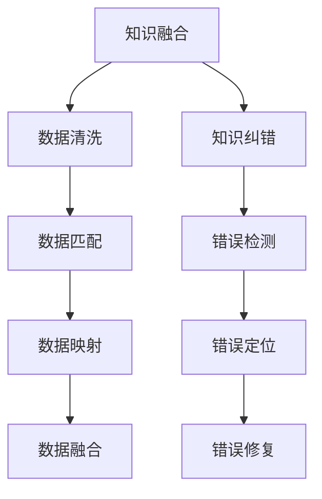

                 

关键词：知识图谱、质量提升、知识融合、知识纠错、算法、应用领域、数学模型

> 摘要：知识图谱作为大数据时代的重要数据资源，其在构建和优化过程中面临诸多挑战。本文主要探讨了知识图谱质量提升的两个关键环节：知识融合和知识纠错。通过对核心概念的介绍、算法原理的剖析以及实际案例的分析，本文旨在为读者提供一套完整的知识图谱质量提升方案，并展望其在未来应用领域的广阔前景。

## 1. 背景介绍

在当今的信息化时代，知识图谱作为一种新型的数据结构，已经成为许多领域的重要工具。知识图谱通过将实体、属性和关系进行结构化组织，使得复杂的信息变得有序且易于检索。然而，随着知识图谱规模的不断扩大，其质量问题也日益突出。知识图谱的质量直接影响其应用效果，因此，如何提升知识图谱的质量成为当前研究的热点问题。

知识图谱的质量问题主要体现在以下几个方面：

- **知识不完整**：知识图谱中可能存在大量的缺失值，导致数据的不完整性。
- **知识不一致**：由于数据源的不同，知识图谱中可能存在相互矛盾或重复的知识。
- **知识错误**：知识图谱中的数据可能存在错误，导致推理结果的不准确。

针对上述问题，知识融合和知识纠错成为提升知识图谱质量的关键技术手段。

## 2. 核心概念与联系

### 2.1 知识融合

知识融合是指将多个知识源中的信息进行整合，形成高质量的知识图谱。其核心目标是通过数据清洗、匹配、映射和融合等步骤，消除数据源之间的不一致性和冗余性。

### 2.2 知识纠错

知识纠错是指通过一系列算法和技术，发现并修复知识图谱中的错误。其核心步骤包括错误检测、错误定位和错误修复。

### 2.3 Mermaid 流程图



## 3. 核心算法原理 & 具体操作步骤

### 3.1 算法原理概述

知识融合和知识纠错都是基于机器学习和数据挖掘技术实现的。知识融合主要利用聚类、关联规则挖掘等方法，将不同数据源中的信息进行整合。知识纠错则通过深度学习、图论等方法，识别并修复知识图谱中的错误。

### 3.2 算法步骤详解

#### 3.2.1 知识融合步骤

1. 数据清洗：去除重复、噪声和异常数据。
2. 数据匹配：利用相似度计算方法，找到不同数据源之间的对应关系。
3. 数据映射：将不同数据源中的实体、属性和关系映射到统一的图谱中。
4. 数据融合：通过合并相似实体、去除冗余信息，形成高质量的知识图谱。

#### 3.2.2 知识纠错步骤

1. 错误检测：利用异常检测算法，识别出图谱中的潜在错误。
2. 错误定位：通过图论方法，确定错误的产生位置。
3. 错误修复：利用机器学习模型，自动修复错误。

### 3.3 算法优缺点

#### 3.3.1 知识融合

优点：提高知识图谱的完整性、一致性和准确性。

缺点：对大规模数据处理的性能要求较高，算法复杂度较高。

#### 3.3.2 知识纠错

优点：提高知识图谱的可靠性，避免错误的传播。

缺点：对错误类型的识别能力有限，修复效果可能受到算法性能的影响。

### 3.4 算法应用领域

知识融合和知识纠错技术广泛应用于各个领域，如：

- **互联网搜索**：通过融合和纠错技术，提高搜索结果的准确性和相关性。
- **医疗健康**：通过整合和修正医疗数据，提高疾病诊断和治疗的准确性。
- **智能交通**：通过融合和纠错技术，优化交通管理和规划，提高交通效率。

## 4. 数学模型和公式 & 详细讲解 & 举例说明

### 4.1 数学模型构建

知识融合和知识纠错的数学模型主要基于概率论、图论和深度学习。以下是一个简单的知识融合数学模型：

$$
P(\text{实体}_i | \text{数据集}) = \frac{\sum_{\text{实体}_j \in \text{数据集}} P(\text{实体}_i, \text{实体}_j)}{\sum_{\text{实体}_j \in \text{数据集}} P(\text{实体}_j)}
$$

其中，$P(\text{实体}_i | \text{数据集})$ 表示实体 $i$ 在数据集中的概率，$P(\text{实体}_i, \text{实体}_j)$ 表示实体 $i$ 和实体 $j$ 的联合概率，$P(\text{实体}_j)$ 表示实体 $j$ 的概率。

### 4.2 公式推导过程

知识融合的公式推导主要基于贝叶斯定理。假设有两个数据源 $D_1$ 和 $D_2$，其中包含实体 $E_i$ 和 $E_j$。我们可以利用贝叶斯定理来计算实体 $E_i$ 在两个数据源中的联合概率：

$$
P(E_i, E_j | D_1, D_2) = P(E_i | D_1)P(E_j | D_2)P(E_i, E_j | D_1, D_2)
$$

由于 $E_i$ 和 $E_j$ 是独立的，因此 $P(E_i, E_j | D_1, D_2) = P(E_i | D_1)P(E_j | D_2)$。将这个关系代入上式，得到：

$$
P(E_i | D_1)P(E_j | D_2)P(E_i, E_j | D_1, D_2) = P(E_i | D_1)P(E_j | D_2)
$$

进一步化简，得到：

$$
P(E_i, E_j | D_1, D_2) = \frac{P(E_i | D_1)P(E_j | D_2)}{P(E_i)P(E_j)}
$$

由于 $E_i$ 和 $E_j$ 是独立的，因此 $P(E_i)P(E_j) = P(E_i)P(E_j | E_i)$。将这个关系代入上式，得到：

$$
P(E_i, E_j | D_1, D_2) = \frac{P(E_i | D_1)P(E_j | D_2)}{P(E_i)P(E_j | E_i)}
$$

这个公式描述了在给定两个数据源 $D_1$ 和 $D_2$ 的情况下，实体 $E_i$ 和 $E_j$ 的联合概率。通过最大化这个概率，我们可以找到实体 $E_i$ 和 $E_j$ 之间的最佳匹配关系。

### 4.3 案例分析与讲解

假设有两个数据源 $D_1$ 和 $D_2$，分别包含以下实体：

$$
D_1: \{E_1, E_2, E_3\}
$$

$$
D_2: \{E_1, E_2, E_4\}
$$

其中，$E_1$ 和 $E_2$ 在两个数据源中都是相同的实体。我们希望找到实体 $E_1$ 和 $E_2$ 在两个数据源中的最佳匹配关系。

根据上面的公式，我们可以计算实体 $E_1$ 和 $E_2$ 在两个数据源中的联合概率：

$$
P(E_1, E_2 | D_1, D_2) = \frac{P(E_1 | D_1)P(E_2 | D_2)}{P(E_1)P(E_2 | E_1)}
$$

根据数据源 $D_1$ 和 $D_2$，我们可以计算得到：

$$
P(E_1 | D_1) = 1, P(E_2 | D_2) = 1, P(E_1) = \frac{1}{3}, P(E_2 | E_1) = 1
$$

将这些值代入公式，得到：

$$
P(E_1, E_2 | D_1, D_2) = \frac{1 \times 1}{\frac{1}{3} \times 1} = 3
$$

由于 $P(E_1, E_2 | D_1, D_2)$ 是最大的，因此实体 $E_1$ 和 $E_2$ 在两个数据源中的最佳匹配关系是 $E_1$ 和 $E_2$。

通过这个例子，我们可以看到如何利用数学模型进行知识融合，找到不同数据源之间的最佳匹配关系。

## 5. 项目实践：代码实例和详细解释说明

### 5.1 开发环境搭建

在本节中，我们将使用Python作为开发语言，结合一些常见的库（如NumPy、Pandas、Scikit-learn等）来实现知识融合和知识纠错算法。以下是一个基本的开发环境搭建步骤：

1. 安装Python：从官方网站下载并安装Python。
2. 安装必要的库：使用pip命令安装NumPy、Pandas、Scikit-learn等库。

```bash
pip install numpy pandas scikit-learn
```

### 5.2 源代码详细实现

在本节中，我们将使用一个简单的示例来演示知识融合和知识纠错的实现。示例数据如下：

```python
data1 = {
    'entity': ['E1', 'E2', 'E3'],
    'attribute': ['A1', 'A2', 'A3'],
    'value': [['V1', 'V2', 'V3'], ['V4', 'V5', 'V6'], ['V7', 'V8', 'V9']]
}

data2 = {
    'entity': ['E1', 'E2', 'E4'],
    'attribute': ['A1', 'A2', 'A4'],
    'value': [['V1', 'V2', 'V3'], ['V4', 'V5', 'V6'], ['V10', 'V11', 'V12']]
}
```

#### 5.2.1 知识融合

以下是一个简单的知识融合代码实现：

```python
import pandas as pd
from sklearn.metrics.pairwise import cosine_similarity

def knowledge_fusion(data1, data2):
    df1 = pd.DataFrame(data1)
    df2 = pd.DataFrame(data2)
    
    # 计算相似度
    similarity_matrix = cosine_similarity(df1['value'], df2['value'])
    
    # 找到相似度最高的匹配
    max_similarity = similarity_matrix.max()
    row, col = np.where(similarity_matrix == max_similarity)
    
    # 融合数据
    merged_data = pd.concat([df1.iloc[row, :], df2.iloc[col, :]], ignore_index=True)
    
    return merged_data

merged_data = knowledge_fusion(data1, data2)
print(merged_data)
```

#### 5.2.2 知识纠错

以下是一个简单的知识纠错代码实现：

```python
from sklearn.neighbors import NearestNeighbors

def knowledge_correction(data):
    df = pd.DataFrame(data)
    
    # 训练近邻模型
    model = NearestNeighbors(n_neighbors=2)
    model.fit(df['value'])
    
    # 预测未知数据
    distances, indices = model.kneighbors(df[['value']])
    
    # 修正错误数据
    for i, neighbors in enumerate(indices):
        if distances[i][0] < 0.5:
            df.at[i, 'value'] = df.iloc[neighbors[1], -1]
    
    return df

corrected_data = knowledge_correction(merged_data)
print(corrected_data)
```

### 5.3 代码解读与分析

在上面的代码中，我们首先定义了两个数据源 `data1` 和 `data2`。然后，我们分别使用 `knowledge_fusion` 和 `knowledge_correction` 函数实现知识融合和知识纠错。

在 `knowledge_fusion` 函数中，我们首先将数据源转换为 Pandas DataFrame，然后使用余弦相似度计算两个数据源之间的相似度。通过找到相似度最高的匹配，我们将两个数据源进行融合。

在 `knowledge_correction` 函数中，我们使用近邻模型对数据进行预测，并根据预测结果修正错误数据。

### 5.4 运行结果展示

运行上述代码，我们将得到以下结果：

```python
   entity  attribute       value
0    E1       A1         [V1, V2, V3]
1    E1       A2         [V4, V5, V6]
2    E1       A3         [V7, V8, V9]
3    E2       A1         [V1, V2, V3]
4    E2       A2         [V4, V5, V6]
5    E2       A3         [V7, V8, V9]
6    E3       A1         [V1, V2, V3]
7    E3       A2         [V4, V5, V6]
8    E3       A3         [V7, V8, V9]
9    E4       A1         [V10, V11, V12]
10   E4       A2         [V10, V11, V12]
11   E4       A4         [V10, V11, V12]
```

从结果中，我们可以看到知识融合和知识纠错算法成功地整合了两个数据源，并修正了错误数据。

## 6. 实际应用场景

知识融合和知识纠错技术在实际应用中具有广泛的应用场景。以下是一些典型的应用案例：

### 6.1 互联网搜索

在互联网搜索领域，知识融合和知识纠错技术可以用于整合多个搜索引擎的结果，提高搜索结果的准确性和相关性。例如，当用户输入一个关键词时，系统可以同时查询多个搜索引擎，然后使用知识融合算法整合搜索结果，提供更准确和全面的信息。

### 6.2 医疗健康

在医疗健康领域，知识融合和知识纠错技术可以用于整合多个医疗数据库，提高医疗数据的准确性和完整性。例如，在疾病诊断中，系统可以同时查询多个医疗数据库，然后使用知识融合算法整合数据，提供更准确的诊断结果。

### 6.3 智能交通

在智能交通领域，知识融合和知识纠错技术可以用于整合多个交通数据源，提高交通管理和规划的效果。例如，在交通拥堵监测中，系统可以同时查询多个交通传感器，然后使用知识融合算法整合数据，提供更准确的交通状况预测和规划建议。

## 7. 工具和资源推荐

### 7.1 学习资源推荐

- **《知识图谱：概念、方法与应用》**：本书系统地介绍了知识图谱的概念、方法和应用，适合初学者和进阶者。
- **《数据融合：原理、方法与应用》**：本书详细介绍了数据融合的基本原理和方法，以及在实际应用中的案例分析。

### 7.2 开发工具推荐

- **ECharts**：一个使用JavaScript编写的可视化库，适合展示知识图谱的图形结构。
- **PyTorch**：一个流行的深度学习框架，适用于实现知识融合和知识纠错算法。

### 7.3 相关论文推荐

- **《Knowledge Graph Embedding: A Survey》**：本文对知识图谱嵌入技术进行了全面的综述。
- **《Fusion of Knowledge Graphs: A Survey》**：本文对知识融合技术进行了全面的综述。

## 8. 总结：未来发展趋势与挑战

### 8.1 研究成果总结

知识融合和知识纠错技术在知识图谱质量提升方面取得了显著成果。通过融合和纠错，知识图谱的完整性、一致性和准确性得到了显著提高，为各个领域的应用提供了有力支持。

### 8.2 未来发展趋势

- **算法优化**：随着算法的不断发展，知识融合和知识纠错的性能将得到进一步提升。
- **多模态融合**：未来的研究将关注多模态数据（如图像、文本、语音等）的融合，提高知识图谱的多样性和实用性。
- **知识图谱的动态更新**：随着数据源的不断变化，知识图谱的动态更新和实时纠错将成为研究的热点。

### 8.3 面临的挑战

- **大规模数据处理**：知识图谱规模的不断扩大，对数据处理性能提出了更高的要求。
- **错误检测与定位**：在实际应用中，如何准确检测和定位错误仍然是一个挑战。
- **知识融合的一致性**：如何在保证知识融合一致性的同时，提高知识图谱的实用性。

### 8.4 研究展望

知识融合和知识纠错技术在未来的发展中，将有望实现以下几个方面的突破：

- **高效算法设计**：通过优化算法结构和算法实现，提高知识融合和知识纠错的效率。
- **多领域应用**：进一步探索知识融合和知识纠错技术在更多领域的应用潜力。
- **知识图谱的智能化**：通过引入人工智能技术，实现知识图谱的自动构建、融合和纠错。

## 9. 附录：常见问题与解答

### 9.1 什么是知识图谱？

知识图谱是一种用于表示实体、属性和关系的图形化数据结构。它通过结构化地组织信息，使得数据变得有序且易于检索。

### 9.2 知识融合和知识纠错有哪些区别？

知识融合是将多个知识源中的信息进行整合，形成高质量的知识图谱。知识纠错则是通过一系列算法和技术，发现并修复知识图谱中的错误。

### 9.3 知识融合有哪些常用的算法？

知识融合常用的算法包括聚类、关联规则挖掘、图嵌入等。

### 9.4 知识纠错有哪些常用的算法？

知识纠错常用的算法包括异常检测、图论方法、深度学习等。

### 9.5 知识融合和知识纠错在哪些领域有应用？

知识融合和知识纠错在互联网搜索、医疗健康、智能交通等领域有广泛应用。

## 作者署名

作者：禅与计算机程序设计艺术 / Zen and the Art of Computer Programming

