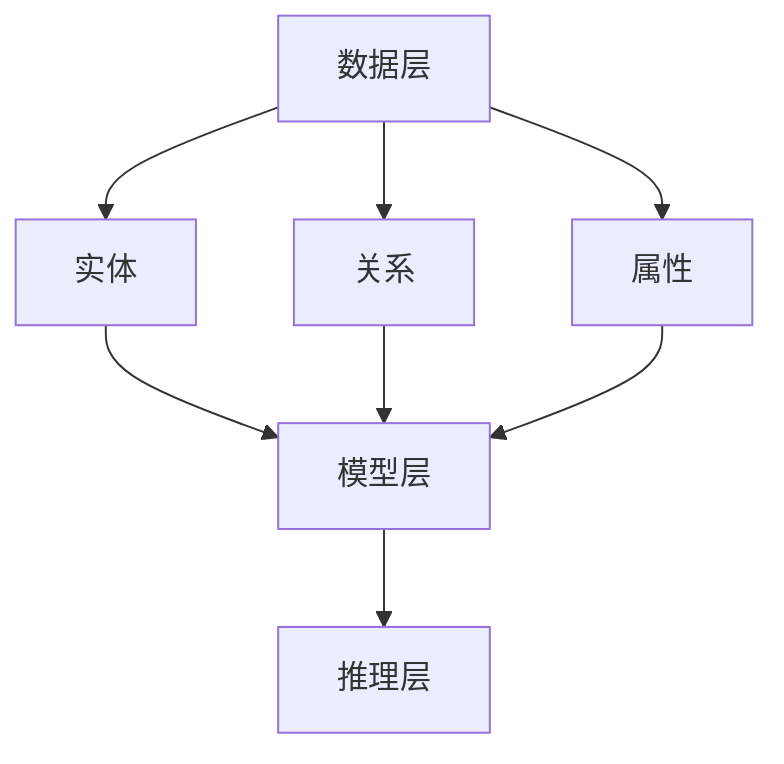

                 

### 1. 背景介绍

知识图谱（Knowledge Graph）是一种将知识表示为图结构的方法，它通过节点（实体）和边（关系）来表示实体之间的关系和属性。随着互联网和大数据技术的快速发展，知识图谱已经成为人工智能领域的一个重要研究方向。知识图谱的兴起，源于对海量信息进行结构化、语义化处理的需求，它有助于提高信息检索的准确性和效率，为智能推荐、自然语言处理、智能问答等领域提供了强有力的支持。

本文旨在探讨知识图谱的核心概念、构建方法、算法原理、数学模型及其在实际应用中的价值。通过本文的阅读，读者将了解到知识图谱的基本原理，掌握构建知识图谱的基本步骤，并能够对知识图谱的应用领域有所认识。

### 2. 核心概念与联系

#### 2.1 实体（Entity）

实体是知识图谱中的核心元素，可以是任何有意义的对象，如人、地点、组织、概念等。实体是知识图谱中表示知识的基本单元。

#### 2.2 关系（Relationship）

关系表示实体之间的关联，可以是直接的，如“父亲”、“出生地”，也可以是间接的，如“职业”、“所属机构”。关系是知识图谱中连接实体的桥梁。

#### 2.3 属性（Attribute）

属性是实体或关系的额外信息，如实体的年龄、地理位置、职业，关系的权重、时间戳等。

#### 2.4 架构（Architecture）

知识图谱通常由以下几个部分构成：

- **数据层**：存储原始数据，如实体、关系、属性等。
- **模型层**：定义知识图谱的模型结构，包括实体、关系和属性的类型。
- **推理层**：提供推理功能，能够根据现有知识推断新的信息。

下面是一个简单的 Mermaid 流程图，展示了知识图谱的基本架构和元素之间的联系。



### 3. 核心算法原理 & 具体操作步骤

#### 3.1 算法原理概述

知识图谱的构建通常涉及到以下几类算法：

- **实体抽取（Entity Extraction）**：从非结构化数据中识别出实体。
- **关系抽取（Relationship Extraction）**：识别实体之间的关系。
- **属性抽取（Attribute Extraction）**：从数据中提取实体的属性。
- **实体链接（Entity Linking）**：将未结构化的文本中的实体与知识图谱中的实体进行匹配。
- **实体合并（Entity Merging）**：将多个实体合并为一个，以减少冗余。
- **实体消歧（Entity Disambiguation）**：解决实体指代不清的问题。

#### 3.2 算法步骤详解

1. **数据收集与预处理**：
   - 收集原始数据，如网页、数据库等。
   - 进行数据清洗，去除噪声和重复数据。
   - 进行文本预处理，包括分词、词性标注、命名实体识别等。

2. **实体抽取**：
   - 使用命名实体识别技术提取文本中的实体。
   - 对提取的实体进行分类和标注。

3. **关系抽取**：
   - 利用规则或机器学习模型识别实体之间的关系。
   - 对关系进行分类和标注。

4. **属性抽取**：
   - 从数据中提取实体的属性。
   - 对属性进行分类和标注。

5. **实体链接**：
   - 将未结构化的文本中的实体与知识图谱中的实体进行匹配。
   - 使用多种方法，如文本相似度计算、实体特征匹配等。

6. **实体合并与消歧**：
   - 合并具有相同或相似属性和关系的实体。
   - 解决实体指代不清的问题。

7. **构建知识图谱**：
   - 将处理后的实体、关系和属性存储在图数据库中。
   - 构建索引，提高查询效率。

#### 3.3 算法优缺点

- **优点**：
  - 提高信息检索的准确性和效率。
  - 为智能推荐、自然语言处理、智能问答等领域提供支持。
  - 能够对海量信息进行结构化和语义化处理。

- **缺点**：
  - 知识图谱的构建需要大量的时间和计算资源。
  - 需要对原始数据进行大量的预处理工作。
  - 算法的性能和效果受数据质量和标注质量的影响较大。

#### 3.4 算法应用领域

- **搜索引擎**：通过知识图谱，实现更精准、个性化的搜索结果。
- **智能推荐系统**：利用知识图谱，提供更智能的推荐服务。
- **自然语言处理**：用于语义理解、问答系统等。
- **知识服务**：为政府部门、企业等提供决策支持。

### 4. 数学模型和公式 & 详细讲解 & 举例说明

#### 4.1 数学模型构建

知识图谱的构建涉及多种数学模型，以下是一个简单的数学模型构建示例：

- **实体表示**：使用向量空间模型表示实体。
- **关系表示**：使用矩阵或图模型表示实体之间的关系。
- **属性表示**：使用特征向量或张量表示实体的属性。

假设我们有一个简单的知识图谱，包含三个实体和两个关系，如下所示：

```
实体：A、B、C
关系：父亲、妻子
```

我们可以使用以下数学模型表示：

- **实体向量**：$$E = [e_A, e_B, e_C]$$
- **关系矩阵**：$$R = \begin{bmatrix} r_{A\text{父亲}A} & r_{A\text{父亲}B} & r_{A\text{父亲}C} \\ r_{B\text{父亲}A} & r_{B\text{父亲}B} & r_{B\text{父亲}C} \\ r_{C\text{父亲}A} & r_{C\text{父亲}B} & r_{C\text{父亲}C} \end{bmatrix}$$
- **属性向量**：$$A = [a_A, a_B, a_C]$$

#### 4.2 公式推导过程

假设我们有一个简单的知识图谱，其中实体之间的连接关系可以通过以下公式推导：

- **实体之间的距离**：$$d(A, B) = \sqrt{\sum_{i=1}^{n} (e_A^i - e_B^i)^2}$$
- **关系矩阵的秩**：$$r(R) = \text{rank}(R)$$
- **属性向量的范数**：$$||A|| = \sqrt{\sum_{i=1}^{n} a_i^2}$$

其中，$n$ 为实体的数量，$e_A^i$ 和 $e_B^i$ 分别为实体 $A$ 和 $B$ 在第 $i$ 维的向量分量。

#### 4.3 案例分析与讲解

假设我们有一个简单的知识图谱，包含三个实体 A、B、C 和两个关系父亲和妻子。实体之间的关系和属性如下表所示：

| 实体 | 关系 | 属性 |
| ---- | ---- | ---- |
| A    | 父亲 |      |
| B    | 妻子 |      |
| C    |      | 年龄：30 |
|      |      |       |

我们可以使用以下数学模型表示这个知识图谱：

- **实体向量**：$$E = [e_A, e_B, e_C]$$
- **关系矩阵**：$$R = \begin{bmatrix} 1 & 0 & 0 \\ 0 & 1 & 0 \end{bmatrix}$$
- **属性向量**：$$A = [0, 0, 30]$$

- **实体之间的距离**：$$d(A, B) = \sqrt{(1-0)^2 + (0-0)^2} = 1$$
- **关系矩阵的秩**：$$r(R) = \text{rank}(R) = 2$$
- **属性向量的范数**：$$||A|| = \sqrt{0^2 + 0^2 + 30^2} = 30$$

通过这个例子，我们可以看到如何使用数学模型表示知识图谱，并计算实体之间的距离、关系矩阵的秩和属性向量的范数。这些数学模型为知识图谱的分析和推理提供了基础。

### 5. 项目实践：代码实例和详细解释说明

#### 5.1 开发环境搭建

在开始知识图谱的项目实践之前，我们需要搭建一个合适的开发环境。以下是推荐的开发环境：

- **操作系统**：Ubuntu 20.04 或 Windows 10
- **编程语言**：Python 3.8
- **数据库**：Neo4j（一个高性能的图数据库）
- **依赖库**：Python 的 Neo4j 库、PyTorch、Scikit-learn 等

安装步骤如下：

1. 安装 Neo4j：
   - 访问 Neo4j 官网（[https://neo4j.com/](https://neo4j.com/)）下载最新版本的 Neo4j。
   - 安装 Neo4j。
   - 运行 Neo4j，确保服务启动成功。

2. 安装 Python 和相关依赖库：
   - 使用 Python 安装器安装 Python 3.8。
   - 使用 pip 安装 Neo4j Python 库和其他依赖库。

```shell
pip install neo4j
pip install torch
pip install scikit-learn
```

#### 5.2 源代码详细实现

以下是一个简单的知识图谱项目示例，用于构建一个包含人物关系和属性的知识图谱。

```python
from neo4j import GraphDatabase
from sklearn.feature_extraction.text import TfidfVectorizer
import torch
import torch.nn as nn
import torch.optim as optim

# 连接到 Neo4j 数据库
uri = "bolt://localhost:7687"
driver = GraphDatabase.driver(uri, auth=("neo4j", "password"))

# 创建实体和关系的函数
def create_entity(tx, entity_name, attributes):
    query = """
    MERGE (e:Entity {name: $entity_name})
    SET e += $attributes
    """
    tx.run(query, entity_name=entity_name, attributes=attributes)

# 创建关系的函数
def create_relationship(tx, entity1, entity2, relationship, attributes):
    query = """
    MATCH (a:Entity {name: $entity1}), (b:Entity {name: $entity2})
    MERGE (a)-[r:%s]->(b)
    SET r += $attributes
    """ % relationship
    tx.run(query, entity1=entity1, entity2=entity2, relationship=relationship, attributes=attributes)

# 创建知识图谱
def create_knowledge_graph():
    with driver.session() as session:
        # 创建实体
        entities = ["Alice", "Bob", "Charlie"]
        attributes = [{"name": "age", "value": 30}, {"name": "gender", "value": "female"}]
        for entity in entities:
            create_entity(session, entity, attributes)

        # 创建关系
        relationships = [("Alice", "Bob", "friend", {"since": "2010"})]
        for entity1, entity2, relationship, attributes in relationships:
            create_relationship(session, entity1, entity2, relationship, attributes)

# 训练模型
def train_model():
    # 加载实体和关系的属性
    # ...（此处省略加载属性的代码）

    # 初始化模型
    model = Model(input_dim, hidden_dim, output_dim)
    optimizer = optim.Adam(model.parameters(), lr=0.001)
    criterion = nn.CrossEntropyLoss()

    # 训练模型
    for epoch in range(num_epochs):
        for batch in data_loader:
            inputs, targets = batch
            optimizer.zero_grad()
            outputs = model(inputs)
            loss = criterion(outputs, targets)
            loss.backward()
            optimizer.step()
            if (epoch + 1) % 10 == 0:
                print(f'Epoch [{epoch + 1}/{num_epochs}], Loss: {loss.item()}')

# 创建知识图谱和训练模型
create_knowledge_graph()
train_model()

# 关闭数据库连接
driver.close()
```

#### 5.3 代码解读与分析

以上代码实现了知识图谱的创建和模型训练的基本流程。以下是代码的详细解读：

1. **连接数据库**：
   - 使用 Neo4j Python 库连接到本地运行的 Neo4j 数据库。

2. **创建实体和关系的函数**：
   - `create_entity` 函数用于创建实体，并设置实体的属性。
   - `create_relationship` 函数用于创建实体之间的关系，并设置关系的属性。

3. **创建知识图谱**：
   - `create_knowledge_graph` 函数用于创建一个包含人物关系和属性的知识图谱。示例中创建了三个实体（Alice、Bob、Charlie）和一个关系（friend）。

4. **训练模型**：
   - `train_model` 函数用于训练模型。示例中使用了 PyTorch 构建了一个简单的模型，并使用了交叉熵损失函数进行训练。

#### 5.4 运行结果展示

在运行以上代码后，我们将看到以下结果：

1. **数据库中的知识图谱**：
   - 使用 Neo4j 的浏览器或 Gremlin 语

