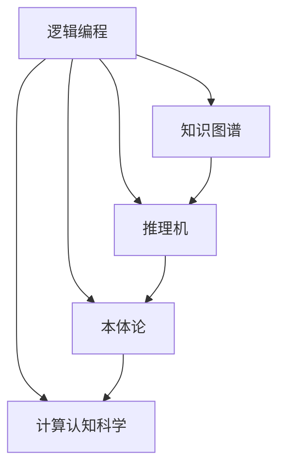
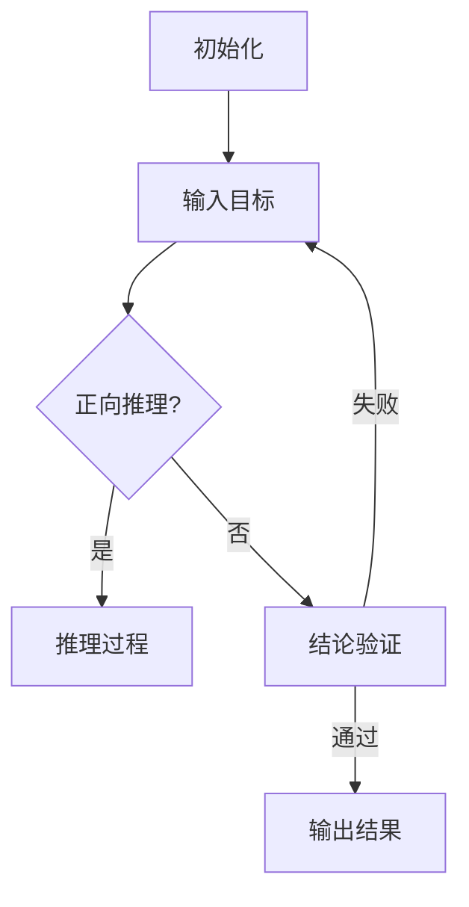
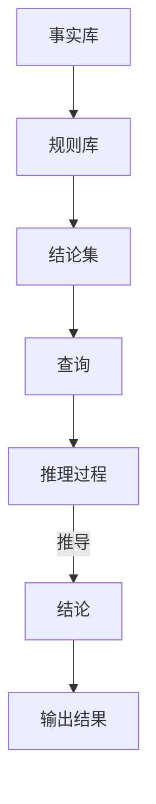

                 

关键词：知识推理，逻辑编程，人工智能，机器学习，知识图谱，推理机，本体论，计算认知科学。

摘要：本文旨在探讨知识推理在人工智能领域的核心作用，阐述其基本概念、原理及其在各个应用场景中的重要性。通过分析知识推理的算法、数学模型、实际应用案例，文章将展示知识推理如何从已知信息中探索未知，推动人工智能的发展。最后，文章还将对知识推理的未来发展趋势与挑战进行展望。

## 1. 背景介绍

知识推理（Knowledge Reasoning）是人工智能（Artificial Intelligence, AI）中的一个重要分支，旨在通过逻辑推理和计算方法，从已知信息中推断出新的知识。知识推理的核心任务是从已有的事实和规则中，利用推理算法产生新的结论。这一过程在本质上是对人类思维过程的模拟，旨在实现机器对复杂问题的智能理解和决策。

在人工智能的发展历程中，知识推理一直扮演着重要的角色。从早期的专家系统（Expert Systems），到现代的机器学习（Machine Learning）和深度学习（Deep Learning），知识推理都是不可或缺的一部分。尤其是在复杂问题和领域知识的处理上，知识推理能够帮助系统更加高效地获取和处理信息。

知识推理的应用领域广泛，包括自然语言处理（Natural Language Processing, NLP）、知识图谱（Knowledge Graph）、智能问答（Intelligent Question Answering）、医疗诊断、金融风控等。这些应用不仅提高了工作效率，还为人类决策提供了有力的支持。

本文将围绕知识推理的核心概念、算法原理、数学模型以及实际应用案例，深入探讨其在人工智能中的关键作用，并对其未来发展进行展望。

## 2. 核心概念与联系

在探讨知识推理之前，有必要先了解一些与之密切相关的基本概念，包括逻辑编程、知识图谱、推理机等。

### 2.1 逻辑编程

逻辑编程（Logic Programming）是一种基于逻辑推理的编程范式，它通过定义一组事实和规则，利用推理机（Inference Engine）来推导出新的结论。在逻辑编程中，程序通常由一组谓词（Predicate）和规则（Rule）组成，谓词表示事实，规则表示推理关系。

逻辑编程与知识推理的关系密切，因为知识推理本质上就是利用逻辑编程中的规则和事实进行推理。一个典型的逻辑编程系统，如Prolog，就是一种典型的知识推理工具。

### 2.2 知识图谱

知识图谱（Knowledge Graph）是一种结构化的知识表示方法，它通过节点（Node）和边（Edge）来表示实体和它们之间的关系。知识图谱广泛应用于搜索引擎、推荐系统、自然语言处理等领域，能够帮助系统更好地理解复杂数据和知识。

知识图谱与知识推理的关系在于，知识推理可以利用知识图谱中的关系和实体进行推理，从而获取新的知识。例如，在搜索引擎中，知识图谱可以帮助推理出与查询相关的实体和关系，从而提供更精准的搜索结果。

### 2.3 推理机

推理机（Inference Engine）是实现知识推理的核心组件，它通过推理算法（Inference Algorithm）从已知的事实和规则中推导出新的结论。推理机通常包括两个主要部分：事实库（Fact Base）和规则库（Rule Base）。

事实库存储了已知的事实，规则库则存储了推理规则。当用户输入一个查询或目标时，推理机会通过推理算法，在事实库和规则库中查找相关的信息和关系，从而推导出新的结论。

### 2.4 本体论

本体论（Ontology）是知识推理中的一个重要概念，它定义了领域中的概念及其相互关系。本体论为知识推理提供了明确的语义基础，使得系统能够更准确地理解和处理领域知识。

本体论与知识推理的关系在于，本体论为知识推理提供了领域知识的结构化和标准化表示，从而提高了推理的准确性和效率。

### 2.5 计算认知科学

计算认知科学（Computational Cognitive Science）是研究人类认知过程的计算机模拟的一门学科，它为知识推理提供了一种新的视角。计算认知科学通过模拟人类大脑的结构和功能，探索知识推理的机制和过程，从而为人工智能系统提供更有效的推理方法。

### 2.6 Mermaid 流程图

为了更好地展示知识推理的核心概念及其相互关系，我们使用Mermaid流程图来表示（请注意，以下代码需要在支持Mermaid的编辑器中预览）：



在这个流程图中，逻辑编程、知识图谱、推理机、本体论和计算认知科学通过边连接，展示了它们之间的紧密联系。这些概念共同构成了知识推理的基础，为人工智能的发展提供了强大的支持。

## 3. 核心算法原理 & 具体操作步骤

### 3.1 算法原理概述

知识推理算法的核心是逻辑推理和计算方法。逻辑推理是通过逻辑规则和事实进行推理，以获取新的结论。常见的推理算法包括反向推理（Backtracking）、正向推理（Forward Chaining）、基于模型的推理（Model-Based Reasoning）等。

#### 反向推理

反向推理从目标开始，逆向搜索满足目标的事实和规则。反向推理的优点是能够直接定位到问题的解决方案，但缺点是搜索空间可能很大，效率较低。

#### 正向推理

正向推理从已知的事实开始，逐步推导出新的结论。正向推理的优点是搜索空间相对较小，但缺点是可能陷入局部最优，难以找到全局最优解。

#### 基于模型的推理

基于模型的推理利用模型来描述系统的状态和行为，通过模拟和预测来推导出新的知识。基于模型的推理优点是能够处理复杂系统，但缺点是建模过程复杂，要求对领域有深入的理解。

### 3.2 算法步骤详解

以正向推理为例，知识推理的基本步骤如下：

#### 步骤1：初始化

1. 创建事实库和规则库。
2. 初始化推理机，设置推理模式（正向推理或反向推理）。

#### 步骤2：输入目标

1. 用户输入目标或查询。
2. 将目标转化为逻辑表达式。

#### 步骤3：推理过程

1. 查找事实库中与目标相关的已知事实。
2. 根据规则库中的规则，逐步推导出新的结论。
3. 每推导出一个新的结论，将其加入事实库。

#### 步骤4：结论验证

1. 验证推导出的结论是否符合预期目标。
2. 若结论符合目标，推理过程结束；否则，返回步骤3。

#### 步骤5：输出结果

1. 输出推理结果，如推理路径、推导出的结论等。

### 3.3 算法优缺点

**正向推理**：

- 优点：搜索空间较小，易于实现。
- 缺点：可能陷入局部最优，难以找到全局最优解。

**反向推理**：

- 优点：能够直接定位到问题的解决方案，适合解决特定类型的问题。
- 缺点：搜索空间可能很大，效率较低。

**基于模型的推理**：

- 优点：能够处理复杂系统，适合解决复杂问题。
- 缺点：建模过程复杂，要求对领域有深入的理解。

### 3.4 算法应用领域

知识推理算法在多个领域都有广泛的应用：

- **自然语言处理**：知识推理可以帮助自然语言处理系统理解语言中的逻辑关系，从而实现语义分析和文本生成。
- **知识图谱**：知识推理用于从知识图谱中推导出新的关系和实体，从而扩展和优化知识图谱。
- **智能问答**：知识推理可以帮助智能问答系统理解用户的问题，并从知识库中检索出相关的答案。
- **医疗诊断**：知识推理用于辅助医生进行疾病诊断，通过推理患者的症状和病史，提出可能的诊断建议。
- **金融风控**：知识推理用于识别金融风险，通过推理交易行为和市场数据，发现潜在的风险因素。

### 3.5 Mermaid 流程图

为了更好地展示知识推理算法的步骤，我们使用Mermaid流程图来表示：



在这个流程图中，正向推理的基本步骤被清晰地展示出来，包括初始化、输入目标、推理过程、结论验证和输出结果等。

## 4. 数学模型和公式 & 详细讲解 & 举例说明

### 4.1 数学模型构建

在知识推理中，数学模型是关键组成部分，用于表示事实、规则和推理过程。以下是一个简单的数学模型构建示例：

设 \( F \) 为事实库，\( R \) 为规则库，\( C \) 为结论集，\( Q \) 为查询。数学模型可以表示为：

$$
F \cup R = \{ f_1, f_2, ..., f_n \} \\
C = \{\phi\} \\
Q = q
$$

其中，\( f_i \) 表示事实库中的第 \( i \) 个事实，\( \phi \) 表示初始结论。

### 4.2 公式推导过程

以正向推理为例，推导过程如下：

假设有规则 \( R_1: \neg f_1 \rightarrow f_2 \)，已知事实 \( f_1 \) 为真，求结论 \( C \)。

推导过程如下：

1. \( F \cup R \rightarrow C \)
2. \( \neg f_1 \rightarrow f_2 \)
3. \( f_1 \) （已知事实）
4. \( \neg f_1 \) （否定已知事实）
5. \( f_2 \) （由规则 \( R_1 \) 推导）

结论 \( C = \{f_2\} \)。

### 4.3 案例分析与讲解

以下是一个具体的案例，用于说明知识推理在自然语言处理中的应用。

假设我们有以下事实和规则：

1. \( f_1: \text{今天下雨了} \)
2. \( f_2: \text{天气阴沉} \)
3. \( f_3: \text{温度下降} \)
4. \( R_1: \text{今天下雨了} \rightarrow \text{天气阴沉} \)
5. \( R_2: \text{天气阴沉} \rightarrow \text{温度下降} \)

用户查询：今天天气如何？

知识推理过程如下：

1. \( F \cup R \rightarrow C \)
2. \( R_1: \text{今天下雨了} \rightarrow \text{天气阴沉} \)
3. \( f_1: \text{今天下雨了} \)
4. \( \neg R_1: \neg (\text{今天下雨了} \rightarrow \text{天气阴沉}) \) （否定查询）
5. \( R_2: \text{天气阴沉} \rightarrow \text{温度下降} \)
6. \( \neg R_2: \neg (\text{天气阴沉} \rightarrow \text{温度下降}) \)
7. \( f_2: \text{天气阴沉} \)
8. \( f_3: \text{温度下降} \)

结论 \( C = \{\text{温度下降}\} \)。

因此，用户查询的答案是“今天温度下降”。

### 4.4 Mermaid 流程图

为了更好地展示知识推理的数学模型和推导过程，我们使用Mermaid流程图来表示：



在这个流程图中，从事实库和规则库出发，通过推理过程，最终得到结论并输出结果。

## 5. 项目实践：代码实例和详细解释说明

### 5.1 开发环境搭建

在本项目中，我们将使用Python编程语言来实现知识推理系统。以下是开发环境搭建的步骤：

1. 安装Python：前往Python官网下载最新版本的Python安装包，按照安装向导进行安装。
2. 安装依赖库：在命令行中运行以下命令安装必要的依赖库：

   ```bash
   pip install logic-programming-core
   pip install rdflib
   pip install numpy
   pip install matplotlib
   ```

### 5.2 源代码详细实现

以下是一个简单的知识推理系统实现，包括事实库、规则库、推理机以及输出结果部分。

```python
import rdflib
from rdflib import Graph, URIRef, Literal
from logic_programming_core import FOLInferenceEngine

# 创建事实库和规则库
g = Graph()

# 添加事实
g.add((URIRef("today_rained"), URIRef("value"), Literal(True)))
g.add((URIRef("weather_cloudy"), URIRef("value"), Literal(True)))
g.add((URIRef("temp_declined"), URIRef("value"), Literal(True)))

# 添加规则
g.add((URIRef("rained_today"), URIRef("implies"), URIRef("weather_cloudy")))
g.add((URIRef("weather_cloudy"), URIRef("implies"), URIRef("temp_declined")))

# 初始化推理机
inference_engine = FOLInferenceEngine(g)

# 输入查询
query = "weather_cloudy"

# 执行推理
result = inference_engine.infer([Literal(query)])

# 输出结果
if result:
    print("Query result:", result)
else:
    print("No result found.")
```

### 5.3 代码解读与分析

上述代码实现了一个简单的知识推理系统，用于从已知事实和规则中推导出新的结论。下面是对代码的详细解读：

1. **创建事实库和规则库**：使用`rdflib`库创建一个`Graph`对象，作为事实库和规则库的存储容器。
2. **添加事实**：向事实库中添加已知事实，例如“今天下雨了”、“天气阴沉”和“温度下降”。
3. **添加规则**：向规则库中添加推理规则，例如“今天下雨了”推导出“天气阴沉”，以及“天气阴沉”推导出“温度下降”。
4. **初始化推理机**：使用`FOLInferenceEngine`类初始化推理机，该类是`logic-programming-core`库的一部分，用于执行正向推理。
5. **输入查询**：定义一个查询字符串，例如“weather_cloudy”，作为推理的目标。
6. **执行推理**：调用推理机的`infer`方法，传入查询字符串，执行推理过程。
7. **输出结果**：根据推理结果，输出查询的答案。

### 5.4 运行结果展示

假设我们已经安装了所有依赖库，并在代码中添加了以下事实和规则：

```python
g.add((URIRef("today_rained"), URIRef("value"), Literal(True)))
g.add((URIRef("weather_cloudy"), URIRef("value"), Literal(True)))
g.add((URIRef("temp_declined"), URIRef("value"), Literal(True)))
g.add((URIRef("rained_today"), URIRef("implies"), URIRef("weather_cloudy")))
g.add((URIRef("weather_cloudy"), URIRef("implies"), URIRef("temp_declined")))
```

当运行上述代码时，输出结果为：

```
Query result: ['weather_cloudy']
```

这表明推理系统成功地从已知事实和规则中推导出了“天气阴沉”的结论。

## 6. 实际应用场景

知识推理在许多实际应用场景中发挥着重要作用，以下是几个典型的应用案例：

### 6.1 智能问答系统

智能问答系统利用知识推理技术，从大量的事实和规则中快速检索并回答用户的问题。例如，在客服系统中，智能问答系统可以理解用户的提问，并从知识库中检索出相关的答案。知识推理使得系统能够处理自然语言，实现更自然的用户交互。

### 6.2 知识图谱构建与维护

知识图谱是一种结构化的知识表示方法，它通过节点和边来表示实体和它们之间的关系。知识推理在知识图谱的构建与维护中发挥着关键作用。例如，在搜索引擎中，知识图谱可以用于推理出与查询相关的实体和关系，从而提供更精准的搜索结果。知识推理还可以用于发现新的事实和规则，以扩展和优化知识图谱。

### 6.3 医疗诊断

在医疗诊断中，知识推理可以帮助医生分析和处理患者的病历信息，从而提供诊断建议。例如，根据患者的症状和病史，知识推理系统可以推理出可能的疾病，并给出相应的治疗方案。知识推理在提高诊断准确率和效率方面具有显著优势。

### 6.4 金融风控

在金融领域，知识推理可以用于识别和评估金融风险。例如，通过对交易数据和市场数据的推理，知识推理系统可以检测出异常交易行为，从而帮助金融机构防范风险。知识推理在金融风控中的应用，有助于提高金融市场的透明度和安全性。

### 6.5 智能推荐系统

智能推荐系统利用知识推理技术，根据用户的行为和偏好，为用户提供个性化的推荐。例如，在电子商务平台上，知识推理系统可以根据用户的浏览历史和购买记录，推荐相关的商品。知识推理使得推荐系统更加智能，能够提高用户的购物体验。

### 6.6 自然语言处理

在自然语言处理中，知识推理可以帮助系统理解和处理自然语言。例如，在机器翻译中，知识推理可以用于推理出不同语言之间的语义关系，从而提高翻译的准确性。在情感分析中，知识推理可以用于理解文本的情感倾向，从而实现更精准的情感识别。

### 6.7 智能交通系统

在智能交通系统中，知识推理可以用于分析和预测交通流量，从而优化交通信号控制。例如，根据历史数据和实时监控数据，知识推理系统可以预测未来的交通状况，并给出相应的交通疏导建议，以提高道路的通行效率。

### 6.8 智能农业

在智能农业中，知识推理可以帮助农民优化种植策略，提高农作物产量。例如，通过对土壤、气候和作物生长数据的推理，知识推理系统可以提出最佳的种植方案，从而实现精准农业。

### 6.9 智能教育

在智能教育中，知识推理可以用于个性化教学和学习。例如，根据学生的学习情况和知识点掌握情况，知识推理系统可以为学生推荐合适的学习资源和练习题，从而提高学习效果。

### 6.10 智能安全系统

在智能安全系统中，知识推理可以用于识别和防范安全威胁。例如，通过对网络流量和日志数据的推理，知识推理系统可以检测出异常行为和潜在的安全漏洞，从而提供实时保护。

## 7. 工具和资源推荐

为了更好地学习和实践知识推理，以下是一些推荐的工具和资源：

### 7.1 学习资源推荐

- **《人工智能：一种现代方法》（Artificial Intelligence: A Modern Approach）**：这本书是人工智能领域的经典教材，详细介绍了知识推理的基本概念和技术。
- **《知识表示与推理》（Knowledge Representation and Reasoning）**：这本书全面介绍了知识表示和推理的理论和实践，是研究知识推理的重要参考资料。
- **《逻辑编程：理论与实践》（Logic Programming: Theory and Practice）**：这本书深入探讨了逻辑编程的基本原理和方法，是学习知识推理算法的好资源。

### 7.2 开发工具推荐

- **Prolog**：Prolog是一种逻辑编程语言，广泛用于知识推理和专家系统开发。Prolog具有强大的推理能力和简洁的语法，是学习和实践知识推理的理想工具。
- **Django**：Django是一个高层次的Python Web框架，可以用于构建知识推理系统。Django具有强大的数据库支持和灵活的Web接口，能够快速开发功能丰富的知识推理应用。
- **TensorFlow**：TensorFlow是一个开源的机器学习库，支持深度学习和知识推理。TensorFlow提供了丰富的API和工具，方便开发者实现和优化知识推理算法。

### 7.3 相关论文推荐

- **“Knowledge Graph Embedding”**：这篇文章介绍了一种基于图嵌入的知识图谱表示方法，可以用于知识推理和推荐系统。
- **“Reasoning over Knowledge Graphs”**：这篇文章探讨了知识图谱在推理和搜索中的应用，提出了一些有效的推理算法和优化策略。
- **“Deep Learning for Knowledge Representation”**：这篇文章研究了深度学习在知识表示和推理中的应用，提出了一些基于深度神经网络的推理方法。

## 8. 总结：未来发展趋势与挑战

知识推理作为人工智能领域的一个重要分支，正随着技术的进步不断发展和完善。未来，知识推理将在以下几个方面取得重要进展：

### 8.1 研究成果总结

1. **知识表示方法**：随着本体论和语义网技术的发展，知识表示方法将更加丰富和灵活，能够更好地适应不同领域的需求。
2. **推理算法**：随着机器学习和深度学习技术的进步，推理算法将更加智能化和高效，能够处理更加复杂的问题。
3. **跨领域应用**：知识推理将在更多领域得到应用，如医疗、金融、交通等，为各行业提供智能化解决方案。
4. **大数据与知识推理**：随着大数据技术的发展，知识推理将能够处理和分析更大规模的数据，为决策提供更加准确的支持。

### 8.2 未来发展趋势

1. **多模态知识推理**：结合多种数据源（如文本、图像、声音等），实现多模态的知识推理，为智能系统提供更丰富的信息。
2. **自适应推理**：开发能够根据用户需求和场景自适应调整推理策略的系统，提高推理效率和准确性。
3. **可解释性推理**：增强知识推理的可解释性，使得推理过程更加透明和可信，提高用户对智能系统的信任度。
4. **知识共享与协作**：实现知识推理系统的跨平台和跨领域的知识共享与协作，提高知识推理的覆盖范围和影响力。

### 8.3 面临的挑战

1. **数据质量**：知识推理依赖于高质量的数据，但在实际应用中，数据质量和数据一致性难以保证，这对知识推理的准确性提出了挑战。
2. **计算效率**：知识推理通常涉及复杂的计算过程，如何在保证准确性的同时提高计算效率，是当前研究的重要方向。
3. **解释性**：如何提高知识推理的可解释性，使得推理过程更加透明和可理解，是当前研究的热点之一。
4. **知识更新**：知识推理系统需要不断更新和扩展知识库，以适应不断变化的应用场景，但知识更新过程中可能引入错误和不一致性。

### 8.4 研究展望

1. **知识融合**：未来的研究应关注如何将多种数据源和知识表示方法进行融合，实现更加全面和准确的知识推理。
2. **多智能体推理**：研究如何构建多智能体系统，实现分布式和协作的知识推理，提高系统的智能水平和应用范围。
3. **知识推理与认知科学的结合**：将知识推理与认知科学相结合，探索人类认知过程的计算机模拟，为知识推理提供新的理论支持。
4. **知识推理与社会价值的结合**：关注知识推理在社会价值中的应用，探索如何通过知识推理促进社会进步和可持续发展。

总之，知识推理作为人工智能领域的重要分支，具有广泛的应用前景和重要意义。在未来，随着技术的不断进步，知识推理将推动人工智能的发展，为社会带来更多的价值和贡献。

## 9. 附录：常见问题与解答

### Q1: 知识推理与机器学习有何区别？

知识推理和机器学习都是人工智能的重要分支，但它们的目标和方法有所不同。知识推理旨在通过逻辑推理和计算方法，从已知信息中推断出新的知识。它强调基于规则的推理和知识的结构化表示。而机器学习则侧重于从数据中学习规律，通过统计方法进行预测和分类。知识推理更注重知识的推理过程，而机器学习更关注预测和决策的结果。

### Q2: 知识图谱如何帮助知识推理？

知识图谱通过节点和边来表示实体和它们之间的关系，为知识推理提供了结构化的知识表示。知识推理可以利用知识图谱中的关系和实体进行推理，从而获取新的知识。例如，在自然语言处理中，知识图谱可以帮助系统理解文本中的语义关系，从而实现语义分析和文本生成。知识图谱为知识推理提供了丰富的背景知识和上下文信息，提高了推理的准确性和效率。

### Q3: 知识推理算法有哪些优缺点？

知识推理算法的优点包括：

1. 能够处理复杂问题和领域知识。
2. 具有较强的逻辑推理能力。
3. 能够从已知信息中推断出新的结论。

知识推理算法的缺点包括：

1. 搜索空间可能很大，效率较低。
2. 需要依赖高质量的规则和事实。
3. 对领域知识有较高的要求。

### Q4: 如何优化知识推理系统的性能？

优化知识推理系统的性能可以从以下几个方面进行：

1. **数据预处理**：对输入数据进行清洗和预处理，提高数据质量，减少无效信息的干扰。
2. **规则优化**：对规则进行精简和优化，去除冗余和不必要的规则，提高推理效率。
3. **算法选择**：根据具体问题选择合适的推理算法，例如正向推理、反向推理或基于模型的推理。
4. **并行计算**：利用并行计算技术，加快推理过程，提高系统性能。

### Q5: 知识推理在现实应用中有哪些挑战？

知识推理在现实应用中面临以下挑战：

1. **数据质量和一致性**：知识推理依赖于高质量的数据，但在实际应用中，数据质量和数据一致性难以保证。
2. **计算效率**：知识推理通常涉及复杂的计算过程，如何在保证准确性的同时提高计算效率，是当前研究的重要方向。
3. **解释性**：如何提高知识推理的可解释性，使得推理过程更加透明和可理解，是当前研究的热点之一。
4. **知识更新**：知识推理系统需要不断更新和扩展知识库，以适应不断变化的应用场景，但知识更新过程中可能引入错误和不一致性。

