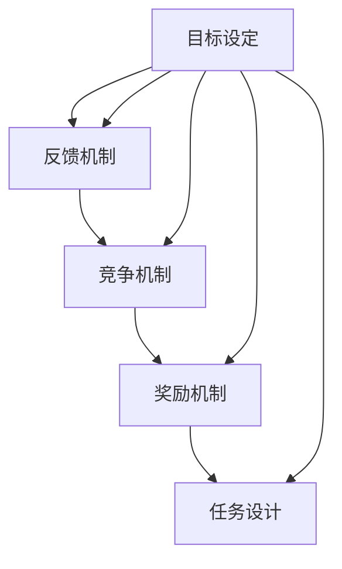
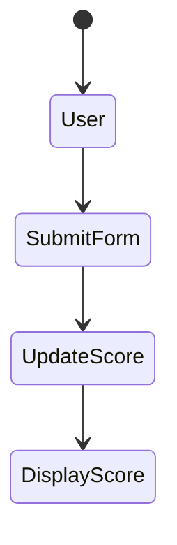

                 

在信息爆炸的时代，知识的学习与传播变得更加重要。但传统的学习方式往往让人感到枯燥乏味，难以保持持续的学习动力。为此，知识的gamification（游戏化）应运而生，它通过将游戏元素融入学习过程，不仅提高了学习的趣味性，还能够有效地促进知识的吸收和记忆。本文将探讨知识的gamification的背景、核心概念、算法原理、数学模型、项目实践以及未来展望。

## 1. 背景介绍

随着互联网和移动设备的普及，游戏已经成为人们日常生活中不可或缺的一部分。与此同时，教育领域也面临着新的挑战，如何激发学生的学习兴趣，提高学习效果成为教育工作者关注的焦点。知识的gamification正是为了应对这一挑战而提出的一种创新教育方法。它旨在通过将游戏设计原则应用于学习过程，激发学生的学习兴趣，提升学习动机，从而提高学习效果。

### 1.1 知识gamification的定义

知识gamification，即通过游戏化的方法来促进知识的学习和记忆。它通常涉及以下核心元素：

- **目标设定**：明确学习目标，激发学习动力。
- **反馈机制**：及时给予学习者反馈，增强学习成就感。
- **竞争机制**：引入竞争元素，提高学习积极性。
- **奖励机制**：通过奖励来激励学习者。
- **任务设计**：设计富有挑战性的任务，提高学习兴趣。

### 1.2 知识gamification的现状与发展

近年来，知识gamification在教育、培训以及企业管理等领域得到了广泛应用。例如，许多在线教育平台已经引入了游戏化元素，如积分、徽章、排行榜等，以增加学习者的参与度和学习效果。此外，企业也开始采用游戏化方法来提高员工的培训效果和积极性。

然而，知识gamification也面临着一些挑战，如游戏化元素的设计与学习目标的匹配、游戏化内容的平衡等。未来的发展需要更深入的研究和实践。

## 2. 核心概念与联系

为了更好地理解知识的gamification，我们需要先了解其核心概念和设计原则。以下是一个简化的Mermaid流程图，展示知识gamification的核心概念及其相互联系：



### 2.1 目标设定

目标设定是知识gamification的基础。明确的学习目标可以帮助学习者聚焦学习任务，提高学习效率。同时，目标设定也需要考虑到学习者的个人兴趣和需求，以激发学习动机。

### 2.2 反馈机制

反馈机制是知识gamification中的重要组成部分。及时的反馈可以告诉学习者他们的进步情况，增强学习成就感。此外，反馈机制还可以帮助教育者了解学习者的学习状态，从而调整教学策略。

### 2.3 竞争机制

竞争机制可以通过引入排行榜、团队竞赛等方式来提高学习者的积极性。竞争可以激发学习者的竞争心理，提高他们的学习动力。但需要注意的是，竞争机制的设计要公平合理，避免产生负面影响。

### 2.4 奖励机制

奖励机制是知识gamification中常用的一种激励手段。通过给予学习者奖励，如积分、徽章、证书等，可以增强学习者的学习成就感，提高他们的学习积极性。奖励机制的设计要注重多样性，以满足不同学习者的需求。

### 2.5 任务设计

任务设计是知识gamification的关键。设计富有挑战性的任务可以激发学习者的学习兴趣，提高他们的参与度。同时，任务的设计要考虑到学习者的认知水平，以确保学习任务的难度适中。

## 3. 核心算法原理 & 具体操作步骤

### 3.1 算法原理概述

知识gamification的算法原理主要涉及以下方面：

- **目标设定算法**：通过分析学习者的需求和兴趣，设定明确的学习目标。
- **反馈机制算法**：设计合理的反馈算法，以实现及时、有效的反馈。
- **竞争机制算法**：设计公平、合理的竞争机制，以提高学习者的积极性。
- **奖励机制算法**：根据学习者的学习成果，设计多样的奖励机制，以激励学习者。
- **任务设计算法**：设计富有挑战性的任务，以提高学习者的参与度和兴趣。

### 3.2 算法步骤详解

以下是知识gamification算法的具体步骤：

1. **目标设定**：分析学习者的需求和兴趣，设定明确的学习目标。
2. **反馈机制**：设计合理的反馈算法，实现及时、有效的反馈。
3. **竞争机制**：设计公平、合理的竞争机制，引入排行榜、团队竞赛等。
4. **奖励机制**：根据学习成果，设计多样的奖励机制，如积分、徽章、证书等。
5. **任务设计**：设计富有挑战性的任务，以激发学习者的兴趣和参与度。
6. **学习过程监控**：实时监控学习过程，根据学习者的反馈和表现，调整学习目标和任务设计。

### 3.3 算法优缺点

**优点**：

- 提高学习者的兴趣和积极性。
- 增强学习者的成就感和自信心。
- 提高学习效果和知识吸收率。
- 促进团队合作和竞争。

**缺点**：

- 需要投入大量时间和精力进行设计和调整。
- 可能导致部分学习者过度依赖游戏化元素。
- 部分游戏化设计可能对学习目标产生负面影响。

### 3.4 算法应用领域

知识gamification在以下领域具有广泛的应用前景：

- 在线教育：通过游戏化方法提高学生的学习效果和参与度。
- 企业培训：提高员工的培训效果和积极性。
- 健康管理：通过游戏化方法促进健康行为的养成。
- 社交网络：通过游戏化元素提高用户的活跃度和粘性。

## 4. 数学模型和公式 & 详细讲解 & 举例说明

### 4.1 数学模型构建

知识gamification中的数学模型主要涉及以下几个方面：

- **学习效果评估模型**：用于评估学习者的学习成果。
- **奖励机制设计模型**：用于设计合理的奖励机制。
- **任务难度评估模型**：用于评估任务的难度。

以下是这三个模型的基本公式：

1. **学习效果评估模型**：

   $$ E = \frac{L}{T} $$

   其中，E表示学习效果，L表示学习者的学习成果，T表示学习者的学习时间。

2. **奖励机制设计模型**：

   $$ R = f(L, C) $$

   其中，R表示奖励，L表示学习者的学习成果，C表示学习者的竞争状态。

3. **任务难度评估模型**：

   $$ D = g(T, P) $$

   其中，D表示任务难度，T表示学习者的学习时间，P表示学习者的学习能力。

### 4.2 公式推导过程

1. **学习效果评估模型**：

   学习效果评估模型的推导基于学习成果和学习时间的关系。假设学习者的学习成果与学习时间成正比，那么可以得出上述公式。

2. **奖励机制设计模型**：

   奖励机制设计模型的推导基于学习成果和竞争状态的关系。假设学习者的奖励与学习成果和竞争状态成正比，那么可以得出上述公式。

3. **任务难度评估模型**：

   任务难度评估模型的推导基于学习者的学习时间和学习能力的关系。假设学习者的任务难度与学习时间和学习能力成反比，那么可以得出上述公式。

### 4.3 案例分析与讲解

以下是一个简单的案例，用于说明知识gamification中的数学模型应用。

**案例**：一个在线教育平台通过游戏化方法提高学生的学习效果。

**步骤**：

1. **目标设定**：设定学习目标，如完成一定数量的课程和练习题。
2. **反馈机制**：通过实时反馈告诉学习者他们的学习进度和成果。
3. **竞争机制**：引入排行榜，鼓励学习者竞争。
4. **奖励机制**：根据学习者的学习成果，发放积分、徽章等。
5. **任务设计**：设计富有挑战性的任务，提高学习者的参与度。

**分析**：

1. **学习效果评估模型**：

   $$ E = \frac{L}{T} $$

   假设学习者A在10小时内完成了10个课程和练习题，那么他的学习效果为：

   $$ E = \frac{10}{10} = 1 $$

2. **奖励机制设计模型**：

   $$ R = f(L, C) $$

   假设学习者A的学习成果为1，竞争状态为积极，那么他可以获得的奖励为：

   $$ R = f(1, 积极竞争) = 100积分 $$

3. **任务难度评估模型**：

   $$ D = g(T, P) $$

   假设学习者A的学习时间为10小时，学习能力强，那么任务难度为：

   $$ D = g(10, 强) = 0.5 $$

   表示任务较为简单。

通过这个案例，我们可以看到数学模型在知识gamification中的应用，有助于更好地理解和设计游戏化学习过程。

## 5. 项目实践：代码实例和详细解释说明

### 5.1 开发环境搭建

为了演示知识gamification的实践，我们选择Python作为开发语言，使用Flask框架搭建一个简单的在线教育平台。以下是开发环境的搭建步骤：

1. 安装Python 3.8及以上版本。
2. 安装Flask框架：`pip install flask`
3. 创建一个名为`knowledge_gamification`的目录，并在此目录下创建一个名为`app.py`的文件，用于编写Flask应用代码。

### 5.2 源代码详细实现

以下是`app.py`的源代码实现：

```python
from flask import Flask, render_template, request, session

app = Flask(__name__)
app.secret_key = 'your_secret_key'

# 学习者信息
learners = [
    {'name': 'Alice', 'score': 0},
    {'name': 'Bob', 'score': 0},
    {'name': 'Charlie', 'score': 0}
]

@app.route('/')
def index():
    return render_template('index.html', learners=learners)

@app.route('/submit', methods=['POST'])
def submit():
    name = request.form['name']
    score = int(request.form['score'])

    for learner in learners:
        if learner['name'] == name:
            learner['score'] = score
            break

    return 'Submitted successfully'

if __name__ == '__main__':
    app.run(debug=True)
```

### 5.3 代码解读与分析

1. **Flask应用搭建**：我们使用Flask框架搭建了一个简单的Web应用，包括两个主要路由：`/`和`/submit`。

2. **学习者信息存储**：我们使用一个简单的列表`learners`来存储学习者的信息，包括姓名和得分。

3. **首页渲染**：`index.html`模板用于渲染学习者的信息，包括姓名和得分。我们使用Flask的`render_template`函数来渲染模板。

4. **成绩提交**：当用户提交成绩时，`submit`函数会更新学习者的得分。我们使用`request.form`获取用户提交的姓名和得分，然后遍历`learners`列表更新相应的得分。

### 5.4 运行结果展示

当我们运行此应用并访问`http://127.0.0.1:5000/`时，我们会看到一个包含学习者姓名和得分的页面。用户可以在页面上提交自己的成绩，应用会实时更新得分。



### 5.5 功能扩展

此代码实例只是一个简单的演示，我们可以在此基础上进行功能扩展，如添加积分、徽章、排行榜等。以下是一个简单的扩展示例：

1. **添加积分系统**：我们可以在学习者提交成绩后，根据得分增加积分。
2. **添加徽章系统**：我们可以在学习者完成特定任务后，发放徽章。
3. **添加排行榜**：我们可以在页面上显示学习者的排行榜。

```python
from operator import itemgetter

@app.route('/submit', methods=['POST'])
def submit():
    name = request.form['name']
    score = int(request.form['score'])

    for learner in learners:
        if learner['name'] == name:
            learner['score'] = score
            break

    # 更新积分系统
    session['points'] = session.get('points', 0) + score

    # 更新排行榜
    learners.sort(key=itemgetter('score'), reverse=True)

    return 'Submitted successfully'
```

通过这些扩展，我们可以使在线教育平台更加丰富和有趣，提高学习者的参与度和学习效果。

## 6. 实际应用场景

知识gamification在多个领域都展现出了其独特的优势。以下是一些具体的实际应用场景：

### 6.1 在线教育

在线教育平台通过引入游戏化元素，如积分、徽章和排行榜，可以显著提高学生的学习兴趣和参与度。例如，Coursera、Khan Academy等平台已经成功运用了知识gamification方法，为学习者提供了更加丰富和有趣的学习体验。

### 6.2 企业培训

企业培训中，知识gamification可以帮助提高员工的培训效果和积极性。通过设计富有挑战性的任务和奖励机制，企业可以更好地激励员工参与培训，提高员工的技能和知识水平。

### 6.3 健康管理

在健康管理领域，知识gamification可以用来激励人们养成健康的生活方式。例如，通过设计健康挑战和奖励系统，鼓励人们进行运动、健康饮食等。

### 6.4 社交网络

社交网络平台可以通过知识gamification来提高用户的活跃度和粘性。例如，通过设计知识问答游戏和奖励系统，平台可以吸引更多用户参与，增加用户之间的互动。

### 6.5 研究领域

知识gamification在教育心理学、认知科学等领域也有广泛的应用前景。研究者可以通过设计不同的游戏化实验，探讨游戏化元素对学习效果的影响，为教育实践提供理论支持。

## 7. 工具和资源推荐

为了更好地实施知识gamification，以下是一些推荐的工具和资源：

### 7.1 学习资源推荐

- **Coursera**：提供各种在线课程，许多课程包含游戏化元素。
- **Khan Academy**：提供免费的在线教育资源，适用于各个年龄段的学习者。
- **Codecademy**：提供编程学习资源，采用互动式教学方式。

### 7.2 开发工具推荐

- **Flask**：Python的Web应用框架，适用于搭建简单的在线教育平台。
- **React**：前端开发框架，适用于构建动态、交互式的Web应用。
- **Node.js**：基于Chrome V8引擎的JavaScript运行环境，适用于搭建实时Web应用。

### 7.3 相关论文推荐

- **"Gamification in Education: A Systematic Review"**：探讨了游戏化在教育中的应用和研究现状。
- **"The Use of Gamification in E-Learning: A Literature Review"**：分析了游戏化在电子学习中的应用和效果。
- **"Gamification: A Multi-Phased Optimization Model"**：提出了一种游戏化设计的优化模型。

## 8. 总结：未来发展趋势与挑战

### 8.1 研究成果总结

知识gamification作为一种创新的教育方法，已经在多个领域得到了广泛应用。通过引入游戏化元素，如积分、徽章和排行榜，可以有效提高学习者的兴趣和积极性，提高学习效果。然而，知识gamification的应用仍然面临一些挑战，如游戏化设计与学习目标的匹配、游戏化内容的平衡等。

### 8.2 未来发展趋势

随着技术的不断发展，知识gamification在未来有望在更多领域得到应用。例如，虚拟现实（VR）和增强现实（AR）技术的引入，将使游戏化学习更加真实和互动。此外，人工智能（AI）的加入，将使游戏化学习更加智能化和个性化。

### 8.3 面临的挑战

尽管知识gamification具有巨大潜力，但其在实际应用中仍然面临一些挑战。首先，游戏化设计需要与学习目标高度匹配，以确保游戏化元素的引入不会偏离学习目标。其次，游戏化内容的平衡是一个重要问题，需要确保游戏化元素不过度，以免产生负面影响。此外，游戏化设计需要考虑到不同学习者的需求和兴趣，以满足多样化的学习需求。

### 8.4 研究展望

未来的研究应重点关注以下几个方面：

- **游戏化设计原则**：进一步研究游戏化设计原则，以指导游戏化内容的开发。
- **学习者个性化**：利用人工智能技术，实现游戏化学习内容的个性化推荐。
- **跨学科研究**：结合教育心理学、认知科学等领域的知识，深入探讨游戏化学习的效果和机制。
- **实践应用**：将知识gamification方法应用于更多实际场景，积累实践经验，为教育实践提供有力支持。

## 9. 附录：常见问题与解答

### 9.1 什么是知识gamification？

知识gamification是一种将游戏设计原则应用于学习过程的教育方法，旨在通过引入游戏化元素，如积分、徽章和排行榜，提高学习者的兴趣和积极性，从而提高学习效果。

### 9.2 知识gamification有哪些优点？

知识gamification的优点包括提高学习者的兴趣和积极性、增强学习者的成就感和自信心、提高学习效果和知识吸收率、促进团队合作和竞争等。

### 9.3 知识gamification有哪些缺点？

知识gamification的缺点包括需要投入大量时间和精力进行设计和调整、可能导致部分学习者过度依赖游戏化元素、部分游戏化设计可能对学习目标产生负面影响等。

### 9.4 知识gamification在哪些领域有应用？

知识gamification在在线教育、企业培训、健康管理、社交网络和研究领域等有广泛应用。通过引入游戏化元素，可以有效提高学习者的兴趣和积极性，提高学习效果。

### 9.5 如何设计有效的知识gamification？

设计有效的知识gamification需要遵循以下原则：明确学习目标、设计合理的反馈机制、引入竞争机制、设计多样的奖励机制、设计富有挑战性的任务。此外，需要根据学习者的需求和兴趣，灵活调整游戏化内容，以满足多样化的学习需求。

