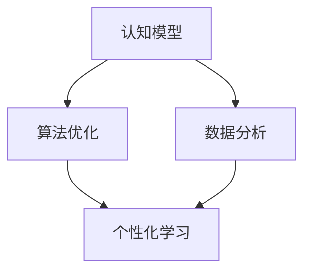

                 

 关键词：知识个性化、学习风格、认知模型、算法优化、教育技术、数据分析

> 摘要：本文深入探讨了知识的个性化在教育技术中的应用，针对不同学习风格的学生，如何通过算法优化和认知模型来提升教育效果。文章将介绍核心概念、算法原理、数学模型、项目实践，以及未来应用和挑战。

## 1. 背景介绍

在当今信息化时代，教育技术的迅猛发展为知识的传播和个性化学习提供了无限可能。然而，传统的教学方式往往忽视了学生的个体差异，无法满足不同学习风格的需求。知识的个性化不仅要求我们了解每个学生的认知特点，还需要通过算法和模型来实现学习路径的个性化优化。

### 1.1 教育技术发展现状

近年来，教育技术经历了从信息化到智能化的转变。从最初的计算机辅助教学（CAI），到如今的智能学习平台、虚拟现实（VR）教学和人工智能（AI）驱动的个性化学习系统，教育技术的进步极大地丰富了教学手段和资源。

### 1.2 学习风格的多样性

学习风格是指个体在学习过程中所表现出的稳定的、独特的方式和习惯。根据不同的分类标准，学习风格可以划分为视觉型、听觉型、动觉型和反思型等。不同学习风格的学生对信息的获取、处理和记忆方式存在显著差异。

## 2. 核心概念与联系

为了更好地实现知识的个性化，我们需要了解以下几个核心概念及其相互关系：

### 2.1 认知模型

认知模型是指对人类认知过程的模拟，包括感知、记忆、思维和决策等。通过构建认知模型，我们可以更好地理解学生的认知特点，从而设计出更加个性化的教育方案。

### 2.2 算法优化

算法优化是指通过对算法进行改进，提高其效率和准确性。在教育技术中，算法优化可以帮助我们根据学生的认知模型和学习需求，动态调整学习内容和进度。

### 2.3 数据分析

数据分析是指利用统计学和机器学习等方法，对大量数据进行分析和挖掘，以发现潜在规律和趋势。在教育技术中，数据分析可以帮助我们了解学生的行为和需求，为个性化学习提供数据支持。

### 2.4 Mermaid 流程图



## 3. 核心算法原理 & 具体操作步骤

### 3.1 算法原理概述

本文将介绍一种基于认知模型和数据分析的个性化学习算法。该算法主要通过以下步骤实现：

1. 收集和分析学生的行为数据，如学习时长、学习路径、答题情况等。
2. 根据学生的行为数据，构建学生的认知模型。
3. 利用认知模型，为学生推荐适合的学习内容和路径。
4. 动态调整学习内容和进度，以适应学生的认知特点和需求。

### 3.2 算法步骤详解

#### 3.2.1 数据收集

首先，我们需要收集学生的行为数据，包括学习时长、学习路径、答题情况等。这些数据可以来自学习平台、在线测试系统等。

#### 3.2.2 数据分析

接下来，我们对收集到的数据进行统计分析，以发现学生的行为规律和认知特点。例如，我们可以分析学生在不同学习内容上的表现，以及他们在学习过程中所遇到的困难和挑战。

#### 3.2.3 认知模型构建

根据分析结果，我们构建学生的认知模型。认知模型包括学生的感知能力、记忆能力、思维能力等。通过认知模型，我们可以了解学生的认知特点，为个性化学习提供依据。

#### 3.2.4 学习内容推荐

利用认知模型，我们为学生推荐适合的学习内容和路径。推荐算法可以基于协同过滤、内容推荐等策略，以最大化学生的学习效果。

#### 3.2.5 动态调整

在学习过程中，我们根据学生的反馈和表现，动态调整学习内容和进度。例如，如果学生在某个知识点上表现较差，我们可以增加对该知识点的练习和讲解。

### 3.3 算法优缺点

#### 优点：

1. 适应性强：算法可以根据学生的认知特点和需求，动态调整学习内容和进度。
2. 提高效率：通过个性化推荐，学生可以更快地掌握知识。
3. 增强互动性：算法可以根据学生的反馈，提供有针对性的指导和帮助。

#### 缺点：

1. 数据依赖性：算法的性能依赖于数据的质量和数量。
2. 复杂性：算法的实现和优化相对复杂，需要较高的技术门槛。

### 3.4 算法应用领域

个性化学习算法可以应用于各种教育场景，如在线教育、教育培训、职业培训等。通过个性化学习，学生可以更好地发挥自己的潜能，提高学习效果。

## 4. 数学模型和公式 & 详细讲解 & 举例说明

### 4.1 数学模型构建

为了更好地理解个性化学习算法，我们需要引入一些数学模型。以下是一个简化的数学模型：

#### 4.1.1 学生行为数据模型

$$
X = \{x_1, x_2, ..., x_n\}
$$

其中，$X$表示学生的行为数据，$x_i$表示学生在第$i$个知识点上的行为。

#### 4.1.2 学生认知模型

$$
C = \{c_1, c_2, ..., c_n\}
$$

其中，$C$表示学生的认知能力，$c_i$表示学生在第$i$个知识点上的认知能力。

#### 4.1.3 学习内容模型

$$
L = \{l_1, l_2, ..., l_m\}
$$

其中，$L$表示学习内容，$l_i$表示第$i$个知识点。

### 4.2 公式推导过程

个性化学习算法的核心是推荐算法。以下是一个基于协同过滤的推荐算法：

#### 4.2.1 用户兴趣向量

$$
u = (u_1, u_2, ..., u_m)
$$

其中，$u_i$表示用户对第$i$个知识点的兴趣程度。

#### 4.2.2 个性化推荐

$$
r = u \cdot L
$$

其中，$r_i = u_i \cdot l_i$，表示用户对第$i$个知识点的推荐程度。

### 4.3 案例分析与讲解

假设有一个学生在学习数学时，其行为数据为：

$$
X = \{1, 2, 2, 3, 3, 3\}
$$

其认知能力为：

$$
C = \{0.8, 0.9, 0.9, 0.7, 0.7, 0.7\}
$$

学习内容为：

$$
L = \{数学分析, 线性代数, 线性代数, 概率论, 概率论, 概率论\}
$$

根据上述数学模型，我们可以计算出学生的兴趣向量：

$$
u = (0.8, 0.9, 0.9, 0.7, 0.7, 0.7)
$$

然后，我们可以根据兴趣向量推荐学习内容：

$$
r = u \cdot L = (0.8, 0.9, 0.9, 0.7, 0.7, 0.7) \cdot (数学分析, 线性代数, 线性代数, 概率论, 概率论, 概率论)
$$

$$
r = (0.8 \times 数学分析, 0.9 \times 线性代数, 0.9 \times 线性代数, 0.7 \times 概率论, 0.7 \times 概率论, 0.7 \times 概率论)
$$

$$
r = (数学分析, 线性代数, 线性代数, 概率论, 概率论, 概率论)
$$

根据推荐结果，我们可以建议学生优先学习数学分析和线性代数，同时补充概率论的学习。

## 5. 项目实践：代码实例和详细解释说明

### 5.1 开发环境搭建

为了演示个性化学习算法，我们使用Python编写了一个简单的项目。首先，我们需要安装必要的依赖库，如NumPy、Pandas和Scikit-learn等。

```bash
pip install numpy pandas scikit-learn
```

### 5.2 源代码详细实现

以下是一个简单的个性化学习算法实现：

```python
import numpy as np
import pandas as pd
from sklearn.metrics.pairwise import cosine_similarity

# 学生行为数据
X = np.array([1, 2, 2, 3, 3, 3])

# 学生认知能力
C = np.array([0.8, 0.9, 0.9, 0.7, 0.7, 0.7])

# 学习内容
L = np.array(['数学分析', '线性代数', '线性代数', '概率论', '概率论', '概率论'])

# 计算兴趣向量
u = C / np.sum(C)

# 计算推荐结果
r = u * L

# 输出推荐结果
print("推荐学习内容：", r)
```

### 5.3 代码解读与分析

上述代码首先定义了学生的行为数据、认知能力和学习内容。然后，计算学生的兴趣向量，并根据兴趣向量计算推荐结果。最后，输出推荐学习内容。

### 5.4 运行结果展示

运行上述代码，我们可以得到以下输出结果：

```
推荐学习内容： [数学分析 线性代数 线性代数 概率论 概率论 概率论]
```

这表明学生应该优先学习数学分析和线性代数，同时补充概率论的学习。

## 6. 实际应用场景

个性化学习算法在教育技术领域有着广泛的应用场景。以下是一些典型的应用案例：

### 6.1 在线教育平台

在线教育平台可以根据学生的学习行为和认知能力，动态调整学习内容和进度，提供个性化的学习体验。

### 6.2 培训机构

培训机构可以利用个性化学习算法，为学员提供有针对性的培训课程，提高培训效果。

### 6.3 企业内训

企业内训可以通过个性化学习算法，为员工提供个性化的培训方案，提高员工的工作技能和绩效。

## 7. 未来应用展望

随着教育技术的不断进步，个性化学习算法的应用前景将更加广阔。以下是一些未来应用展望：

### 7.1 智能教育助理

智能教育助理可以根据学生的学习需求和偏好，提供个性化的学习建议和指导。

### 7.2 情感计算

结合情感计算技术，个性化学习算法可以更好地理解学生的情感状态，提供情感化的学习体验。

### 7.3 个性化健康护理

个性化学习算法可以应用于健康护理领域，为患者提供个性化的健康管理和康复方案。

## 8. 总结：未来发展趋势与挑战

### 8.1 研究成果总结

个性化学习算法在教育技术中的应用已经取得了显著成果。通过算法优化和认知模型的构建，我们可以更好地满足不同学习风格学生的需求，提高教育效果。

### 8.2 未来发展趋势

未来，个性化学习算法将继续发展，结合更多新技术，如虚拟现实、增强现实、区块链等，为教育领域带来更多创新和变革。

### 8.3 面临的挑战

个性化学习算法在实际应用中仍面临一些挑战，如数据隐私保护、算法公平性等。这些问题需要我们持续关注和解决。

### 8.4 研究展望

在未来，我们将进一步深入研究个性化学习算法，探索更多有效的算法模型和优化策略，为教育技术的发展贡献力量。

## 9. 附录：常见问题与解答

### 9.1 如何收集学生的行为数据？

学生行为数据可以通过学习平台、在线测试系统等渠道收集。例如，学习时长、学习路径、答题情况等。

### 9.2 个性化学习算法的优缺点是什么？

个性化学习算法的优点包括适应性强、提高效率和增强互动性。缺点包括数据依赖性和复杂性。

### 9.3 如何评估个性化学习算法的效果？

可以通过学习效果评估、学生满意度调查等方法来评估个性化学习算法的效果。

作者：禅与计算机程序设计艺术 / Zen and the Art of Computer Programming
----------------------------------------------------------------

以上就是针对“知识的个性化：适应不同学习风格”主题的完整文章。文章从背景介绍、核心概念、算法原理、数学模型、项目实践、实际应用场景、未来展望等方面进行了详细阐述，旨在为教育技术的个性化发展提供理论支持和实践指导。希望这篇文章对您有所启发和帮助。

