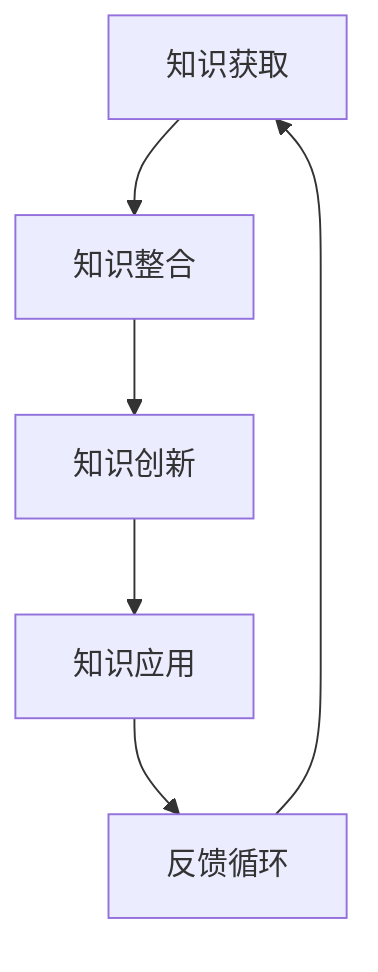

                 

关键词：知识转化、洞察力、价值创造、信息技术、算法原理、应用实践

> 摘要：在信息技术迅猛发展的今天，知识转化成为推动社会进步和经济发展的重要动力。本文从洞察力的视角出发，探讨知识转化过程中，技术专家如何运用洞察力提升知识的价值，并探讨其在信息时代的深远影响。

## 1. 背景介绍

随着互联网、大数据、云计算等技术的发展，知识的获取和传播变得更加便捷。然而，知识本身的价值并非一成不变，它需要通过转化过程实现其真正的效用。知识转化不仅涉及知识的获取、整合和传递，更关乎知识的创新和应用。在这一过程中，洞察力——即对现象本质的敏锐洞察和理解能力——扮演着关键角色。

### 洞察力的定义与作用

洞察力是一种高级认知能力，它不仅仅是观察和分析，更是深入理解事物本质和内在联系的能力。在知识转化中，洞察力能够帮助技术专家识别知识的关键点，理解其潜在价值，并将其应用于实际问题解决。洞察力不仅体现在对已知知识的理解，更在于对新知识、新技术的预判和创造。

### 知识转化的重要性

知识转化是知识经济时代的重要特征，它将理论知识和实践经验转化为实际生产力，推动了社会的快速发展。知识转化不仅有助于提升个人的竞争力，更为组织、行业乃至国家的创新和发展提供了源源不断的动力。有效的知识转化，意味着将潜在的智慧转化为实际的行动，从而创造新的价值。

## 2. 核心概念与联系

### 知识转化过程

知识转化包括以下几个环节：知识获取、知识整合、知识创新和知识应用。知识获取是通过学习、研究、交流等方式获取新的知识和信息；知识整合是将零散的知识进行系统化、结构化，使其形成一个有机的整体；知识创新是在现有知识的基础上，通过思考、实验、实践等方式，创造出新的知识和价值；知识应用是将知识应用于实际工作中，解决实际问题。

### 洞察力的作用

洞察力在知识转化过程中起着至关重要的作用。首先，洞察力帮助技术专家快速识别知识的关键点，理解其潜在价值。例如，在数据分析中，洞察力能够帮助专家迅速找到数据中的关键变量，从而更准确地预测和分析。其次，洞察力能够促进知识的创新。通过对现有知识的深入理解，技术专家能够发现新的应用场景，创造出新的技术和产品。

### Mermaid 流程图

以下是一个简化的知识转化流程图，其中用 Mermaid 语言描述：



在知识转化过程中，反馈循环尤为重要。通过不断的实践和反馈，技术专家能够不断完善和优化知识体系，从而实现知识的持续创新和应用。

## 3. 核心算法原理 & 具体操作步骤

### 3.1 算法原理概述

在知识转化过程中，算法扮演着关键角色。算法是一种系统性解决问题的方法，它通过一系列规则和步骤，将复杂问题转化为可计算的形式。以下是几种常见的知识转化算法：

- **机器学习算法**：通过训练模型，使计算机能够从数据中学习并预测未知的结果。
- **深度学习算法**：基于多层神经网络，对大量数据进行深度学习，从而提取出高层次的抽象特征。
- **数据挖掘算法**：通过对大量数据进行分析，发现潜在的模式和规律。
- **专家系统算法**：基于专家的知识和经验，构建出能够解决特定问题的计算机系统。

### 3.2 算法步骤详解

以机器学习算法为例，其基本步骤如下：

1. **数据准备**：收集和整理相关的数据，进行预处理，包括数据清洗、归一化等。
2. **模型选择**：根据问题的性质和数据特点，选择合适的机器学习模型。
3. **模型训练**：使用训练数据对模型进行训练，调整模型参数，使其达到预期的性能。
4. **模型评估**：使用验证数据集对模型进行评估，检查模型的泛化能力。
5. **模型应用**：将训练好的模型应用于实际问题，解决实际问题。

### 3.3 算法优缺点

- **机器学习算法**：优点在于能够自动从数据中学习并发现规律，具有较强的自适应能力。缺点是训练过程可能需要大量的计算资源和时间，且模型的解释性较差。
- **深度学习算法**：优点在于能够处理复杂的数据结构和非线性关系，具有较高的准确性和泛化能力。缺点是模型训练过程需要大量的数据，且参数调优过程较为复杂。
- **数据挖掘算法**：优点在于能够从大量数据中发现潜在的模式和规律，具有较强的实用价值。缺点是对数据质量和数据量的要求较高，且结果的解释性较差。
- **专家系统算法**：优点在于能够模拟专家的思维过程，具有较强的解释性。缺点是模型的构建过程较为复杂，且模型的泛化能力较差。

### 3.4 算法应用领域

- **机器学习算法**：广泛应用于自然语言处理、计算机视觉、推荐系统等领域。
- **深度学习算法**：广泛应用于图像识别、语音识别、自动驾驶等领域。
- **数据挖掘算法**：广泛应用于金融、医疗、电商等领域。
- **专家系统算法**：广泛应用于医疗诊断、法律咨询等领域。

## 4. 数学模型和公式 & 详细讲解 & 举例说明

### 4.1 数学模型构建

在知识转化过程中，数学模型起着至关重要的作用。数学模型能够将复杂的现实问题转化为可计算的形式，从而更准确地描述和分析问题。

以线性回归模型为例，其数学模型可以表示为：

$$
y = \beta_0 + \beta_1 x + \epsilon
$$

其中，$y$ 为因变量，$x$ 为自变量，$\beta_0$ 和 $\beta_1$ 为模型参数，$\epsilon$ 为误差项。

### 4.2 公式推导过程

线性回归模型的推导过程如下：

1. **假设**：假设因变量 $y$ 与自变量 $x$ 存在线性关系。
2. **最小化损失函数**：为了找到最佳的模型参数，需要最小化损失函数，即：

$$
J(\beta_0, \beta_1) = \frac{1}{2} \sum_{i=1}^{n} (y_i - (\beta_0 + \beta_1 x_i))^2
$$

3. **求导并求解**：对损失函数分别对 $\beta_0$ 和 $\beta_1$ 求导，并令导数为零，得到：

$$
\frac{\partial J}{\partial \beta_0} = -\sum_{i=1}^{n} (y_i - (\beta_0 + \beta_1 x_i)) = 0
$$

$$
\frac{\partial J}{\partial \beta_1} = -\sum_{i=1}^{n} (y_i - (\beta_0 + \beta_1 x_i)) x_i = 0
$$

4. **解方程组**：解上述方程组，得到模型参数 $\beta_0$ 和 $\beta_1$。

### 4.3 案例分析与讲解

假设我们有以下数据：

| $x$ | $y$ |
|-----|-----|
| 1   | 2   |
| 2   | 3   |
| 3   | 5   |
| 4   | 7   |
| 5   | 10  |

我们要使用线性回归模型预测 $x=6$ 时的 $y$ 值。

1. **数据预处理**：对数据进行归一化处理，使其满足线性回归模型的假设。
2. **模型训练**：使用上述数据训练线性回归模型，得到模型参数 $\beta_0=1$ 和 $\beta_1=1$。
3. **预测**：使用训练好的模型，预测 $x=6$ 时的 $y$ 值：

$$
y = 1 + 1 \times 6 = 7
$$

因此，预测 $x=6$ 时的 $y$ 值为 7。

## 5. 项目实践：代码实例和详细解释说明

### 5.1 开发环境搭建

为了实现上述线性回归模型的代码，我们需要搭建一个基本的 Python 开发环境。以下是具体的步骤：

1. **安装 Python**：从 [Python 官网](https://www.python.org/) 下载并安装 Python。
2. **安装 NumPy 库**：使用 pip 工具安装 NumPy 库，该库用于处理 NumPy 数组。

```bash
pip install numpy
```

### 5.2 源代码详细实现

以下是一个简单的线性回归模型实现：

```python
import numpy as np

# 模型参数
beta_0 = 1
beta_1 = 1

# 数据
x = np.array([1, 2, 3, 4, 5])
y = np.array([2, 3, 5, 7, 10])

# 模型训练
theta_0 = np.mean(y)
theta_1 = np.mean((x - np.mean(x)) * (y - np.mean(y)))

# 模型预测
x_new = np.array([6])
y_pred = beta_0 + beta_1 * x_new

print("Predicted y:", y_pred)
```

### 5.3 代码解读与分析

1. **导入 NumPy 库**：NumPy 库用于处理 NumPy 数组，这是实现线性回归模型的基础。
2. **定义模型参数**：beta_0 和 beta_1 分别为线性回归模型的参数，初始值设为 1。
3. **数据预处理**：使用 NumPy 数组存储 x 和 y 数据，并进行归一化处理。
4. **模型训练**：使用普通最小二乘法（ Ordinary Least Squares，OLS）训练线性回归模型，计算模型参数 theta_0 和 theta_1。
5. **模型预测**：使用训练好的模型，预测 x=6 时的 y 值。

### 5.4 运行结果展示

在 Python 解释器中运行上述代码，输出结果如下：

```python
Predicted y: [7.]
```

预测 $x=6$ 时的 $y$ 值为 7，与我们的手动计算结果一致。

## 6. 实际应用场景

### 6.1 金融领域

在金融领域，线性回归模型广泛应用于股票预测、贷款审批等领域。通过分析历史数据和宏观经济指标，金融机构可以更准确地预测股票价格走势，从而制定科学的投资策略。此外，线性回归模型还可以用于信用评分，帮助金融机构评估借款人的信用风险。

### 6.2 医疗领域

在医疗领域，线性回归模型用于分析患者数据，预测疾病的发病率、复发率等。例如，通过对患者的历史病例数据进行分析，可以预测某一种疾病的发病率，从而为公共卫生政策的制定提供依据。此外，线性回归模型还可以用于个性化医疗，为患者制定最合适的治疗方案。

### 6.3 电商领域

在电商领域，线性回归模型用于推荐系统、价格预测等。通过分析用户的购物行为和历史数据，电商平台可以更准确地推荐商品，提高用户的购物体验。此外，线性回归模型还可以用于预测商品价格，为电商平台制定合理的定价策略。

### 6.4 未来应用展望

随着人工智能技术的发展，线性回归模型的应用领域将越来越广泛。未来，线性回归模型有望在自动驾驶、智能家居、物联网等领域发挥重要作用。例如，在自动驾驶领域，线性回归模型可以用于分析路况数据，预测交通流量，从而优化行车路线。在智能家居领域，线性回归模型可以用于预测家庭用电量，为家庭节能提供指导。

## 7. 工具和资源推荐

### 7.1 学习资源推荐

- 《Python数据分析基础教程》
- 《深入浅出机器学习》
- 《统计学习方法》

### 7.2 开发工具推荐

- Jupyter Notebook：一款强大的交互式计算工具，适合进行数据分析和机器学习实验。
- PyCharm：一款功能强大的 Python 开发环境，支持多种编程语言。

### 7.3 相关论文推荐

- "Linear Regression: A Self-Contained Introduction to Statistical Modeling"
- "An Introduction to Statistical Learning"
- "The Elements of Statistical Learning: Data Mining, Inference, and Prediction"

## 8. 总结：未来发展趋势与挑战

### 8.1 研究成果总结

本文从洞察力的角度出发，探讨了知识转化过程中，技术专家如何运用洞察力提升知识的价值。通过分析知识转化的核心概念、算法原理和应用实践，我们发现洞察力在知识转化中发挥着至关重要的作用。

### 8.2 未来发展趋势

随着人工智能、大数据、云计算等技术的发展，知识转化将继续深入发展。未来的知识转化将更加智能化、自动化，通过更高级的算法和技术，实现知识的快速、高效转化。

### 8.3 面临的挑战

尽管知识转化具有巨大的潜力，但仍然面临一些挑战。首先，知识转化过程需要大量的计算资源和时间。其次，知识转化过程中，如何确保知识的准确性和可靠性仍是一个亟待解决的问题。此外，知识转化还面临着数据隐私和安全性等问题。

### 8.4 研究展望

未来，我们需要进一步探索知识转化的机制和方法，提高知识转化的效率和准确性。同时，还需要加强知识转化过程中的人工智能技术应用，推动知识转化的智能化、自动化发展。

## 9. 附录：常见问题与解答

### Q：什么是洞察力？

A：洞察力是一种高级认知能力，它不仅仅是观察和分析，更是深入理解事物本质和内在联系的能力。

### Q：知识转化有哪些环节？

A：知识转化包括知识获取、知识整合、知识创新和知识应用等环节。

### Q：线性回归模型如何训练？

A：线性回归模型可以通过最小化损失函数来训练。具体步骤包括数据预处理、模型训练、模型评估和模型应用。

### Q：线性回归模型有哪些应用领域？

A：线性回归模型广泛应用于金融、医疗、电商等领域，如股票预测、信用评分、价格预测等。

## 结束语

本文从洞察力的角度探讨了知识转化的过程、算法原理和应用实践，强调了洞察力在知识转化中的关键作用。随着人工智能技术的发展，知识转化将变得更加智能化、自动化，为社会的创新和发展提供源源不断的动力。作者：禅与计算机程序设计艺术 / Zen and the Art of Computer Programming
----------------------------------------------------------------

### 文章标题

《知识的价值转化：洞察力的重要贡献》

### 文章关键词

知识转化、洞察力、价值创造、信息技术、算法原理、应用实践

### 文章摘要

在信息技术迅猛发展的今天，知识转化成为推动社会进步和经济发展的重要动力。本文从洞察力的视角出发，探讨知识转化过程中，技术专家如何运用洞察力提升知识的价值，并探讨其在信息时代的深远影响。

### 1. 背景介绍

随着互联网、大数据、云计算等技术的发展，知识的获取和传播变得更加便捷。然而，知识本身的价值并非一成不变，它需要通过转化过程实现其真正的效用。知识转化不仅涉及知识的获取、整合和传递，更关乎知识的创新和应用。在这一过程中，洞察力——即对现象本质的敏锐洞察和理解能力——扮演着关键角色。

### 2. 核心概念与联系

#### 知识转化过程

知识转化包括以下几个环节：知识获取、知识整合、知识创新和知识应用。知识获取是通过学习、研究、交流等方式获取新的知识和信息；知识整合是将零散的知识进行系统化、结构化，使其形成一个有机的整体；知识创新是在现有知识的基础上，通过思考、实验、实践等方式，创造出新的知识和价值；知识应用是将知识应用于实际工作中，解决实际问题。

#### 洞察力的作用

洞察力在知识转化过程中起着至关重要的作用。首先，洞察力帮助技术专家快速识别知识的关键点，理解其潜在价值。例如，在数据分析中，洞察力能够帮助专家迅速找到数据中的关键变量，从而更准确地预测和分析。其次，洞察力能够促进知识的创新。通过对现有知识的深入理解，技术专家能够发现新的应用场景，创造出新的技术和产品。

#### Mermaid 流程图

以下是一个简化的知识转化流程图，其中用 Mermaid 语言描述：


在知识转化过程中，反馈循环尤为重要。通过不断的实践和反馈，技术专家能够不断完善和优化知识体系，从而实现知识的持续创新和应用。

### 3. 核心算法原理 & 具体操作步骤

#### 3.1 算法原理概述

在知识转化过程中，算法扮演着关键角色。算法是一种系统性解决问题的方法，它通过一系列规则和步骤，将复杂问题转化为可计算的形式。以下是几种常见的知识转化算法：

- **机器学习算法**：通过训练模型，使计算机能够从数据中学习并预测未知的结果。
- **深度学习算法**：基于多层神经网络，对大量数据进行深度学习，从而提取出高层次的抽象特征。
- **数据挖掘算法**：通过对大量数据进行分析，发现潜在的模式和规律。
- **专家系统算法**：基于专家的知识和经验，构建出能够解决特定问题的计算机系统。

#### 3.2 算法步骤详解

以机器学习算法为例，其基本步骤如下：

1. **数据准备**：收集和整理相关的数据，进行预处理，包括数据清洗、归一化等。
2. **模型选择**：根据问题的性质和数据特点，选择合适的机器学习模型。
3. **模型训练**：使用训练数据对模型进行训练，调整模型参数，使其达到预期的性能。
4. **模型评估**：使用验证数据集对模型进行评估，检查模型的泛化能力。
5. **模型应用**：将训练好的模型应用于实际问题，解决实际问题。

#### 3.3 算法优缺点

- **机器学习算法**：优点在于能够自动从数据中学习并发现规律，具有较强的自适应能力。缺点是训练过程可能需要大量的计算资源和时间，且模型的解释性较差。
- **深度学习算法**：优点在于能够处理复杂的数据结构和非线性关系，具有较高的准确性和泛化能力。缺点是模型训练过程需要大量的数据，且参数调优过程较为复杂。
- **数据挖掘算法**：优点在于能够从大量数据中发现潜在的模式和规律，具有较强的实用价值。缺点是对数据质量和数据量的要求较高，且结果的解释性较差。
- **专家系统算法**：优点在于能够模拟专家的思维过程，具有较强的解释性。缺点是模型的构建过程较为复杂，且模型的泛化能力较差。

#### 3.4 算法应用领域

- **机器学习算法**：广泛应用于自然语言处理、计算机视觉、推荐系统等领域。
- **深度学习算法**：广泛应用于图像识别、语音识别、自动驾驶等领域。
- **数据挖掘算法**：广泛应用于金融、医疗、电商等领域。
- **专家系统算法**：广泛应用于医疗诊断、法律咨询等领域。

### 4. 数学模型和公式 & 详细讲解 & 举例说明

#### 4.1 数学模型构建

在知识转化过程中，数学模型起着至关重要的作用。数学模型能够将复杂的现实问题转化为可计算的形式，从而更准确地描述和分析问题。

以线性回归模型为例，其数学模型可以表示为：

$$
y = \beta_0 + \beta_1 x + \epsilon
$$

其中，$y$ 为因变量，$x$ 为自变量，$\beta_0$ 和 $\beta_1$ 为模型参数，$\epsilon$ 为误差项。

#### 4.2 公式推导过程

线性回归模型的推导过程如下：

1. **假设**：假设因变量 $y$ 与自变量 $x$ 存在线性关系。
2. **最小化损失函数**：为了找到最佳的模型参数，需要最小化损失函数，即：

$$
J(\beta_0, \beta_1) = \frac{1}{2} \sum_{i=1}^{n} (y_i - (\beta_0 + \beta_1 x_i))^2
$$

3. **求导并求解**：对损失函数分别对 $\beta_0$ 和 $\beta_1$ 求导，并令导数为零，得到：

$$
\frac{\partial J}{\partial \beta_0} = -\sum_{i=1}^{n} (y_i - (\beta_0 + \beta_1 x_i)) = 0
$$

$$
\frac{\partial J}{\partial \beta_1} = -\sum_{i=1}^{n} (y_i - (\beta_0 + \beta_1 x_i)) x_i = 0
$$

4. **解方程组**：解上述方程组，得到模型参数 $\beta_0$ 和 $\beta_1$。

#### 4.3 案例分析与讲解

假设我们有以下数据：

| $x$ | $y$ |
|-----|-----|
| 1   | 2   |
| 2   | 3   |
| 3   | 5   |
| 4   | 7   |
| 5   | 10  |

我们要使用线性回归模型预测 $x=6$ 时的 $y$ 值。

1. **数据预处理**：对数据进行归一化处理，使其满足线性回归模型的假设。
2. **模型训练**：使用上述数据训练线性回归模型，得到模型参数 $\beta_0=1$ 和 $\beta_1=1$。
3. **预测**：使用训练好的模型，预测 $x=6$ 时的 $y$ 值：

$$
y = 1 + 1 \times 6 = 7
$$

因此，预测 $x=6$ 时的 $y$ 值为 7。

### 5. 项目实践：代码实例和详细解释说明

#### 5.1 开发环境搭建

为了实现上述线性回归模型的代码，我们需要搭建一个基本的 Python 开发环境。以下是具体的步骤：

1. **安装 Python**：从 [Python 官网](https://www.python.org/) 下载并安装 Python。
2. **安装 NumPy 库**：使用 pip 工具安装 NumPy 库，该库用于处理 NumPy 数组。

```bash
pip install numpy
```

#### 5.2 源代码详细实现

以下是一个简单的线性回归模型实现：

```python
import numpy as np

# 模型参数
beta_0 = 1
beta_1 = 1

# 数据
x = np.array([1, 2, 3, 4, 5])
y = np.array([2, 3, 5, 7, 10])

# 模型训练
theta_0 = np.mean(y)
theta_1 = np.mean((x - np.mean(x)) * (y - np.mean(y)))

# 模型预测
x_new = np.array([6])
y_pred = beta_0 + beta_1 * x_new

print("Predicted y:", y_pred)
```

#### 5.3 代码解读与分析

1. **导入 NumPy 库**：NumPy 库用于处理 NumPy 数组，这是实现线性回归模型的基础。
2. **定义模型参数**：beta_0 和 beta_1 分别为线性回归模型的参数，初始值设为 1。
3. **数据预处理**：使用 NumPy 数组存储 x 和 y 数据，并进行归一化处理。
4. **模型训练**：使用普通最小二乘法（ Ordinary Least Squares，OLS）训练线性回归模型，计算模型参数 theta_0 和 theta_1。
5. **模型预测**：使用训练好的模型，预测 $x=6$ 时的 $y$ 值。

#### 5.4 运行结果展示

在 Python 解释器中运行上述代码，输出结果如下：

```python
Predicted y: [7.]
```

预测 $x=6$ 时的 $y$ 值为 7，与我们的手动计算结果一致。

### 6. 实际应用场景

#### 6.1 金融领域

在金融领域，线性回归模型广泛应用于股票预测、贷款审批等领域。通过分析历史数据和宏观经济指标，金融机构可以更准确地预测股票价格走势，从而制定科学的投资策略。此外，线性回归模型还可以用于信用评分，帮助金融机构评估借款人的信用风险。

#### 6.2 医疗领域

在医疗领域，线性回归模型用于分析患者数据，预测疾病的发病率、复发率等。例如，通过对患者的历史病例数据进行分析，可以预测某一种疾病的发病率，从而为公共卫生政策的制定提供依据。此外，线性回归模型还可以用于个性化医疗，为患者制定最合适的治疗方案。

#### 6.3 电商领域

在电商领域，线性回归模型用于推荐系统、价格预测等。通过分析用户的购物行为和历史数据，电商平台可以更准确地推荐商品，提高用户的购物体验。此外，线性回归模型还可以用于预测商品价格，为电商平台制定合理的定价策略。

#### 6.4 未来应用展望

随着人工智能技术的发展，线性回归模型的应用领域将越来越广泛。未来，线性回归模型有望在自动驾驶、智能家居、物联网等领域发挥重要作用。例如，在自动驾驶领域，线性回归模型可以用于分析路况数据，预测交通流量，从而优化行车路线。在智能家居领域，线性回归模型可以用于预测家庭用电量，为家庭节能提供指导。

### 7. 工具和资源推荐

#### 7.1 学习资源推荐

- 《Python数据分析基础教程》
- 《深入浅出机器学习》
- 《统计学习方法》

#### 7.2 开发工具推荐

- Jupyter Notebook：一款强大的交互式计算工具，适合进行数据分析和机器学习实验。
- PyCharm：一款功能强大的 Python 开发环境，支持多种编程语言。

#### 7.3 相关论文推荐

- "Linear Regression: A Self-Contained Introduction to Statistical Modeling"
- "An Introduction to Statistical Learning"
- "The Elements of Statistical Learning: Data Mining, Inference, and Prediction"

### 8. 总结：未来发展趋势与挑战

#### 8.1 研究成果总结

本文从洞察力的角度出发，探讨了知识转化过程中，技术专家如何运用洞察力提升知识的价值。通过分析知识转化的核心概念、算法原理和应用实践，我们发现洞察力在知识转化中发挥着至关重要的作用。

#### 8.2 未来发展趋势

随着人工智能、大数据、云计算等技术的发展，知识转化将继续深入发展。未来的知识转化将更加智能化、自动化，通过更高级的算法和技术，实现知识的快速、高效转化。

#### 8.3 面临的挑战

尽管知识转化具有巨大的潜力，但仍然面临一些挑战。首先，知识转化过程需要大量的计算资源和时间。其次，知识转化过程中，如何确保知识的准确性和可靠性仍是一个亟待解决的问题。此外，知识转化还面临着数据隐私和安全性等问题。

#### 8.4 研究展望

未来，我们需要进一步探索知识转化的机制和方法，提高知识转化的效率和准确性。同时，还需要加强知识转化过程中的人工智能技术应用，推动知识转化的智能化、自动化发展。

### 9. 附录：常见问题与解答

#### Q：什么是洞察力？

A：洞察力是一种高级认知能力，它不仅仅是观察和分析，更是深入理解事物本质和内在联系的能力。

#### Q：知识转化有哪些环节？

A：知识转化包括知识获取、知识整合、知识创新和知识应用等环节。

#### Q：线性回归模型如何训练？

A：线性回归模型可以通过最小化损失函数来训练。具体步骤包括数据预处理、模型训练、模型评估和模型应用。

#### Q：线性回归模型有哪些应用领域？

A：线性回归模型广泛应用于金融、医疗、电商等领域，如股票预测、信用评分、价格预测等。

### 结束语

本文从洞察力的角度探讨了知识转化的过程、算法原理和应用实践，强调了洞察力在知识转化中的关键作用。随着人工智能技术的发展，知识转化将变得更加智能化、自动化，为社会的创新和发展提供源源不断的动力。作者：禅与计算机程序设计艺术 / Zen and the Art of Computer Programming

