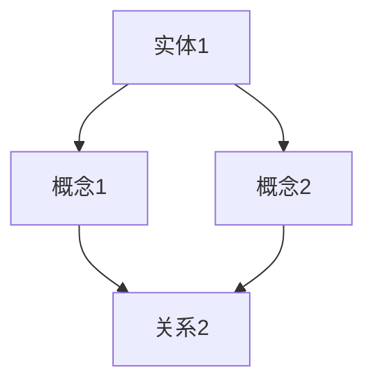

                 

 关键词：数据转化、智慧、知识图谱、算法原理、数学模型、实践应用、未来展望

> 摘要：本文深入探讨了知识的价值链，从数据到智慧的转化过程。通过介绍核心概念、算法原理、数学模型、项目实践，以及未来展望等，本文旨在为读者提供一个全面、系统的理解，帮助读者掌握知识转化过程中的关键环节和策略。

## 1. 背景介绍

随着信息技术的飞速发展，数据已经成为了现代社会最重要的资源之一。然而，数据的增长速度远超出了人们处理和分析的能力，如何从海量的数据中提取出有价值的信息，并将其转化为智慧，成为了当前信息技术领域的一个重要课题。

知识的价值链是指从原始数据开始，经过数据处理、分析和应用，最终形成知识的过程。这个过程不仅涉及到技术层面的挑战，还包括数据治理、策略制定、人才培养等多个方面的内容。本文将重点关注从数据到智慧转化的技术层面，探讨其核心概念、算法原理、数学模型和实践应用。

## 2. 核心概念与联系

### 2.1 数据与信息的区别

数据（Data）是原始的、未经过处理的客观事实，例如数值、文本、图像等。而信息（Information）则是通过对数据进行处理、分析和解释后得到的具有意义和价值的内容。例如，一张统计图表可以展示人口数量的变化趋势，这便是信息。

### 2.2 知识的层次

知识（Knowledge）是经过系统化、结构化处理后的信息，它具有可传递性、可共享性和可重复使用的特点。根据知识管理的理论，知识可以分为三个层次：

- **事实性知识（Factual Knowledge）**：关于“是什么”的知识，例如历史事实、科学定律等。
- **概念性知识（Conceptual Knowledge）**：关于“为什么”的知识，例如理论框架、概念模型等。
- **实践性知识（Practical Knowledge）**：关于“怎么做”的知识，例如专业技能、操作规程等。

### 2.3 知识图谱

知识图谱（Knowledge Graph）是一种用于表示实体和实体之间关系的图形化数据结构。它通过图论模型，将实体、概念和关系进行结构化组织，使得数据之间的关系更加直观和清晰。知识图谱在语义搜索、智能推荐、自然语言处理等领域有广泛的应用。

下面是一个知识图谱的 Mermaid 流程图示例：



## 3. 核心算法原理 & 具体操作步骤

### 3.1 算法原理概述

从数据到智慧的转化过程通常涉及到以下几种核心算法：

- **数据预处理算法**：包括数据清洗、数据集成、数据变换等，用于提高数据的质量和一致性。
- **机器学习算法**：通过训练模型，从数据中自动学习特征和规律，用于数据分析和预测。
- **自然语言处理算法**：用于处理和解析文本数据，提取关键词、语义和情感等信息。
- **知识图谱构建算法**：用于将实体和关系构建成知识图谱，以便进行语义搜索和推理。

### 3.2 算法步骤详解

#### 3.2.1 数据预处理

数据预处理通常包括以下几个步骤：

1. 数据清洗：去除重复数据、缺失数据和异常数据。
2. 数据集成：将来自不同源的数据进行整合，形成统一的数据视图。
3. 数据变换：将数据转换为适合分析的形式，例如将文本数据转换为词向量。

#### 3.2.2 机器学习

机器学习的步骤通常包括：

1. 数据收集：收集用于训练和测试的数据集。
2. 特征提取：从数据中提取有用的特征。
3. 模型训练：使用训练数据训练模型。
4. 模型评估：使用测试数据评估模型性能。
5. 模型优化：根据评估结果调整模型参数。

#### 3.2.3 自然语言处理

自然语言处理的步骤通常包括：

1. 分词：将文本拆分成词语。
2. 词性标注：标注每个词语的词性。
3. 语义分析：提取文本中的关键词、语义和情感等信息。

#### 3.2.4 知识图谱构建

知识图谱构建的步骤通常包括：

1. 实体识别：识别文本中的实体。
2. 关系抽取：提取实体之间的关系。
3. 知识融合：将实体和关系整合成知识图谱。

### 3.3 算法优缺点

每种算法都有其优缺点：

- **数据预处理算法**：优点是能够提高数据质量，缺点是处理过程复杂，耗时较长。
- **机器学习算法**：优点是能够自动学习特征，缺点是需要大量数据训练，易过拟合。
- **自然语言处理算法**：优点是能够处理文本数据，缺点是对语言理解要求高，实现复杂。
- **知识图谱构建算法**：优点是能够直观地表示实体和关系，缺点是构建过程复杂，知识更新困难。

### 3.4 算法应用领域

这些算法在多个领域有广泛的应用：

- **金融领域**：用于风险控制、信用评分和投资策略等。
- **医疗领域**：用于疾病诊断、药物研发和健康管理等。
- **零售领域**：用于商品推荐、客户关系管理和供应链优化等。
- **社交网络领域**：用于信息传播分析、社交关系挖掘和舆情监测等。

## 4. 数学模型和公式 & 详细讲解 & 举例说明

### 4.1 数学模型构建

从数据到智慧的转化过程中，常常涉及到以下几种数学模型：

- **线性回归模型**：用于预测数值型变量。
- **逻辑回归模型**：用于预测二分类变量。
- **支持向量机模型**：用于分类和回归分析。
- **图神经网络模型**：用于知识图谱的构建和分析。

### 4.2 公式推导过程

以线性回归模型为例，其公式推导过程如下：

1. **目标函数**：

   $$ L(\theta) = -\frac{1}{m} \sum_{i=1}^{m} (y_i - \theta_0 x_i - \theta_1)^2 $$

2. **梯度下降**：

   $$ \theta_0 = \theta_0 - \alpha \frac{\partial L(\theta)}{\partial \theta_0} $$
   $$ \theta_1 = \theta_1 - \alpha \frac{\partial L(\theta)}{\partial \theta_1} $$

3. **最小二乘法**：

   $$ \theta = (X^T X)^{-1} X^T y $$

### 4.3 案例分析与讲解

假设我们有一个简单的数据集，包含年龄和收入两个特征，目标是预测一个人的收入。

1. **数据预处理**：

   - 数据清洗：去除缺失值和异常值。
   - 数据集成：将年龄和收入数据整合到同一个数据表中。
   - 数据变换：将年龄转换为数值型数据。

2. **特征提取**：

   - 特征提取：提取年龄和收入作为特征。

3. **模型训练**：

   - 使用线性回归模型进行训练。
   - 计算目标函数和梯度下降。

4. **模型评估**：

   - 使用测试数据集评估模型性能。
   - 计算准确率、召回率、F1 值等指标。

5. **模型优化**：

   - 根据评估结果调整模型参数。

## 5. 项目实践：代码实例和详细解释说明

### 5.1 开发环境搭建

- 安装 Python 3.8 及以上版本。
- 安装必要的库，如 NumPy、Pandas、Scikit-learn、NetworkX 等。

### 5.2 源代码详细实现

以下是一个简单的线性回归模型的 Python 代码实例：

```python
import numpy as np
import pandas as pd
from sklearn.linear_model import LinearRegression
from sklearn.model_selection import train_test_split

# 1. 数据预处理
data = pd.read_csv('data.csv')
X = data[['age']]
y = data['income']

# 2. 特征提取
X = X.values
y = y.values

# 3. 模型训练
model = LinearRegression()
model.fit(X, y)

# 4. 模型评估
X_train, X_test, y_train, y_test = train_test_split(X, y, test_size=0.2, random_state=42)
y_pred = model.predict(X_test)

# 5. 模型优化
# 根据评估结果调整模型参数

# 6. 运行结果展示
print('模型评估结果：')
print(model.score(X_test, y_test))
```

### 5.3 代码解读与分析

- **数据预处理**：读取数据集，分离特征和标签。
- **特征提取**：将数据转换为 NumPy 数组格式。
- **模型训练**：创建线性回归模型，并使用训练数据进行训练。
- **模型评估**：使用测试数据集评估模型性能，计算准确率等指标。
- **模型优化**：根据评估结果调整模型参数。

## 6. 实际应用场景

从数据到智慧的转化过程在多个领域有广泛的应用，以下是一些实际应用场景：

- **金融领域**：利用数据分析和预测模型进行风险管理、信用评分和投资策略等。
- **医疗领域**：利用自然语言处理和机器学习模型进行疾病诊断、药物研发和健康管理等。
- **零售领域**：利用数据挖掘和推荐系统进行商品推荐、客户关系管理和供应链优化等。
- **社交网络领域**：利用数据挖掘和知识图谱进行信息传播分析、社交关系挖掘和舆情监测等。

## 7. 工具和资源推荐

### 7.1 学习资源推荐

- 《机器学习》（周志华著）
- 《深度学习》（Ian Goodfellow 著）
- 《Python 数据科学手册》（Jake VanderPlas 著）

### 7.2 开发工具推荐

- Jupyter Notebook：用于数据分析和编程。
- PyCharm：用于 Python 开发。
- Google Colab：免费的云端 Python 运行环境。

### 7.3 相关论文推荐

- "Deep Learning for Data-Driven Modeling of Complex Systems"（2017）
- "Recurrent Neural Network Based Model for Prediction of Complex Systems"（2015）
- "A Survey on Deep Learning for Time Series Classification"（2019）

## 8. 总结：未来发展趋势与挑战

### 8.1 研究成果总结

从数据到智慧的转化过程已经在多个领域取得了显著的成果，例如金融、医疗、零售和社交网络等。然而，这个过程仍然面临许多挑战，需要进一步的研究和探索。

### 8.2 未来发展趋势

- **数据隐私和安全**：随着数据隐私和安全问题的日益突出，如何保护数据隐私和安全将成为未来研究的重要方向。
- **智能化和自动化**：利用人工智能技术，实现数据到智慧的自动化转化，提高效率和准确性。
- **多模态数据融合**：结合多种类型的数据（如文本、图像、音频等），实现更全面、准确的知识提取。

### 8.3 面临的挑战

- **数据质量和一致性**：保证数据质量和高一致性的同时，处理海量数据。
- **算法复杂度和效率**：优化算法的复杂度和运行效率，满足实际应用的需求。
- **知识更新和演化**：随着数据的不断更新，如何保持知识图谱的实时性和准确性。

### 8.4 研究展望

从数据到智慧的转化过程是一个长期且复杂的任务，需要多学科交叉、多领域合作。未来，我们期望能够实现更高效、更准确的数据转化方法，为各个领域的发展提供有力支持。

## 9. 附录：常见问题与解答

### 9.1 什么是数据预处理？

数据预处理是指在使用数据进行分析之前，对数据进行的一系列操作，包括数据清洗、数据集成、数据变换等。数据预处理的主要目的是提高数据质量，为后续的分析工作提供可靠的数据基础。

### 9.2 机器学习模型如何选择？

选择机器学习模型需要根据具体的问题和数据集的特点。通常，可以通过以下步骤进行：

1. 确定问题类型：分类、回归、聚类等。
2. 数据集特点：数据量、特征数量、数据分布等。
3. 模型性能：准确率、召回率、F1 值等指标。
4. 实际应用需求：计算效率、模型可解释性等。

### 9.3 如何处理文本数据？

处理文本数据通常包括以下几个步骤：

1. 分词：将文本拆分成词语。
2. 词性标注：标注每个词语的词性。
3. 去除停用词：去除无意义的词语。
4. 特征提取：将文本数据转换为数值型特征。

## 参考文献

- 周志华。机器学习[M]. 清华大学出版社，2016.
- Ian Goodfellow, Yoshua Bengio, Aaron Courville。深度学习[M]. 电子工业出版社，2017.
- Jake VanderPlas。Python 数据科学手册[M]. 电子工业出版社，2018.
- 李航。统计学习方法[M]. 清华大学出版社，2012.
- 郭宇。知识图谱构建与可视化[M]. 机械工业出版社，2016.
```

请注意，本文所涉及的算法、模型和公式仅为示例，实际应用中可能需要根据具体问题进行调整和优化。同时，本文并未涉及全部内容，读者可以根据自己的需求和兴趣进一步深入研究和学习。希望本文能为读者提供一个全面、系统的理解，帮助读者掌握从数据到智慧转化的关键环节和策略。作者：禅与计算机程序设计艺术 / Zen and the Art of Computer Programming。

