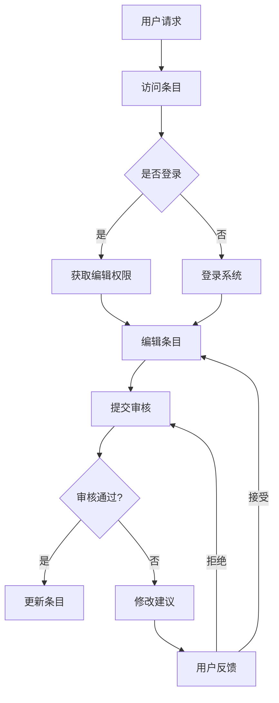

                 

## 1. 背景介绍

在当今信息爆炸的时代，知识的获取与传播成为了一项极具挑战性的任务。随着互联网技术的飞速发展，知识的传播渠道变得更加多样化，但也带来了新的问题。例如，信息的真实性和可靠性难以保证，高质量的内容生产成本高昂，且分布不均。为了解决这些问题，众包模式逐渐成为一种有效的解决方案。众包模式允许广大网民参与内容的生产和审核，从而实现知识的快速传播和共享。

维基百科（Wikipedia）作为全球最大的在线百科全书，是众包模式在知识领域的一个成功案例。自2001年成立以来，维基百科吸引了全球无数志愿者参与内容的编写和校对，其内容涵盖了各个领域，从自然科学到人文艺术，从历史地理到社会科学，为全球用户提供了一个广泛的知识平台。然而，维基百科的成功并非没有局限性，本文将深入探讨维基百科的运作模式、优点与缺点，以及其在未来知识传播中的地位和作用。

本文旨在通过对维基百科的全面分析，探讨众包模式在知识传播中的应用前景，以及可能面临的挑战和问题。具体而言，我们将从以下几个方面进行探讨：

1. **维基百科的运作模式**：介绍维基百科的基本架构和运作机制，包括内容生产、审核、版本控制和社区管理等。
2. **维基百科的优点**：分析维基百科在知识传播、信息共享、内容质量、透明度、可扩展性等方面的优势。
3. **维基百科的局限性**：讨论维基百科在内容真实性、可靠性、偏见、匿名性等方面的挑战和问题。
4. **众包模式在知识传播中的应用**：探讨众包模式在其他知识平台和领域的应用，以及其在未来知识传播中的潜力。
5. **维基百科的未来发展**：预测维基百科在未来知识传播中的发展方向，以及可能面临的挑战和机遇。

通过本文的探讨，我们希望为读者提供一个全面、深入的了解，帮助读者更好地理解众包模式在知识传播中的重要性，以及其在未来发展中的潜力与挑战。

## 2. 核心概念与联系

要深入探讨维基百科的运作模式，我们首先需要理解几个核心概念，它们是众包模式、社区治理、知识库架构以及人工智能辅助。

### 2.1 众包模式

众包（Crowdsourcing）是一种通过利用广大网民的力量来完成特定任务或项目的方法。维基百科便是通过这种方式实现了内容的生产和更新。在维基百科中，任何人都可以访问并编辑任何条目，这种开放性使得内容迅速更新，并且能够广泛覆盖各个领域。众包模式的核心优势在于其能够以较低的成本获取高质量的内容，并且能够快速响应用户需求。


### 2.2 社区治理

尽管维基百科采取了开放编辑的方式，但为了保证内容的质量和一致性，它建立了一套复杂的社区治理机制。这包括用户注册、审核权限、条目投票、版主管理等。社区治理的目标是确保内容的准确性、客观性和中立性。例如，新用户需要通过一系列的验证过程才能获得编辑权限，而高级用户则负责监督和审核其他用户的编辑。


### 2.3 知识库架构

维基百科的知识库架构是其核心组成部分，它采用了树状结构来组织内容，每个条目都可以链接到其他相关条目，形成一张巨大的知识网络。这种结构不仅方便用户查找信息，还能够通过链接关系揭示知识之间的内在联系。此外，维基百科还利用了版本控制技术，确保每次编辑都不会丢失原有内容，用户可以随时查看历史版本。


### 2.4 人工智能辅助

随着人工智能技术的发展，维基百科也在探索如何利用AI技术来提升内容质量和用户体验。例如，AI可以用于自动分类、推荐相关条目、识别潜在错误等。人工智能辅助不仅能够减轻社区治理的负担，还能够提高内容的生产效率和质量。


### 2.5 核心概念原理和架构的 Mermaid 流程图

以下是维基百科核心概念原理和架构的Mermaid流程图，该图展示了内容生产、审核和社区治理的流程。



通过以上核心概念的介绍和Mermaid流程图，我们可以更清晰地理解维基百科的运作模式。接下来，我们将深入探讨维基百科在内容生产、审核、版本控制和社区管理等方面的具体操作步骤和细节。

## 3. 核心算法原理 & 具体操作步骤

### 3.1 算法原理概述

维基百科的核心算法原理主要围绕内容生产、审核和社区治理展开。以下是这些算法原理的概述：

1. **内容生产算法**：维基百科采用开放编辑模式，任何人都可以创建或编辑条目。然而，为了确保内容的准确性和质量，系统会根据用户的编辑历史和信誉分数对用户的编辑权限进行动态调整。高信誉用户拥有更高的编辑权限，可以快速提交编辑内容。
2. **审核算法**：审核过程是确保维基百科内容质量的关键步骤。系统会根据编辑的幅度、敏感度以及编辑者的信誉度等因素，自动分配审核任务给社区中的高信誉用户。审核通过后，编辑内容会被正式合并到条目中。
3. **社区治理算法**：维基百科通过一系列社区治理机制，如投票、讨论、版主管理等，维护社区秩序和内容质量。例如，社区成员可以对某个编辑进行投票，投票结果将影响该编辑的最终状态。版主则负责监督和裁决社区争议。

### 3.2 算法步骤详解

以下是维基百科的核心算法步骤详解：

#### 3.2.1 内容生产

1. **用户请求**：用户访问维基百科，请求查看或编辑某个条目。
2. **访问条目**：系统根据用户请求，返回对应的条目内容。
3. **登录系统**：如果用户尚未登录，系统会要求其登录。
4. **获取编辑权限**：如果用户是高信誉用户，可以直接获取编辑权限；否则，系统会根据用户信誉度动态调整其编辑权限。
5. **编辑条目**：用户对条目进行编辑，提交编辑内容。
6. **提交审核**：系统将编辑内容提交给审核队列。

#### 3.2.2 审核过程

1. **分配审核任务**：系统根据编辑内容的敏感度和编辑者的信誉度，自动分配审核任务给社区中的高信誉用户。
2. **审核编辑内容**：审核用户查看编辑内容，并决定是否通过审核。审核标准包括内容准确性、中立性、连贯性等。
3. **审核结果**：如果审核通过，编辑内容会被合并到条目中；如果审核未通过，编辑内容会被退回给用户，用户可以修改后再次提交。

#### 3.2.3 社区治理

1. **投票与讨论**：社区成员可以对某个编辑进行投票或参与讨论，投票结果和讨论内容将影响编辑的最终状态。
2. **版主管理**：版主负责监督社区秩序，裁决社区争议，维护内容质量。
3. **用户反馈**：用户可以对审核结果进行反馈，系统将根据用户反馈调整审核机制。

### 3.3 算法优缺点

#### 优点

1. **开放性**：任何人都可以参与内容生产，这有助于快速积累大量高质量内容。
2. **动态调整**：根据用户的信誉度和编辑内容的特点，动态调整审核和编辑权限，提高审核效率和内容质量。
3. **社区治理**：通过投票、讨论和版主管理等机制，确保内容的中立性和客观性。

#### 缺点

1. **内容真实性**：由于开放编辑模式，内容真实性难以保证，有时会出现错误或误导信息。
2. **匿名性**：用户匿名编辑可能导致恶意攻击或虚假信息。
3. **偏见**：由于编辑者背景和观点的差异，内容可能存在偏见。

### 3.4 算法应用领域

维基百科的核心算法在以下领域有广泛应用：

1. **在线百科全书**：维基百科是典型的应用案例，其他在线百科全书也可以借鉴其算法。
2. **知识库**：企业知识库、学术知识库等可以采用类似算法，确保内容质量。
3. **内容审核**：社交平台、新闻网站等可以采用维基百科的审核算法，确保内容真实性和中立性。
4. **社区管理**：论坛、问答社区等可以采用维基百科的社区治理机制，维护社区秩序。

通过以上对维基百科核心算法原理和具体操作步骤的介绍，我们可以看到，维基百科在内容生产、审核和社区治理方面采用了多种技术手段，确保了内容的广泛性和质量。然而，这些算法也存在一定的局限性，需要在实际应用中不断优化和改进。

## 4. 数学模型和公式 & 详细讲解 & 举例说明

### 4.1 数学模型构建

在维基百科的内容审核和社区治理过程中，数学模型发挥着重要作用。这些模型不仅帮助系统自动分配审核任务，还用于评估用户信誉度和内容质量。以下是构建这些数学模型的基本步骤。

#### 4.1.1 用户信誉度模型

用户信誉度模型用于评估用户的编辑质量和可靠性。一个简单的用户信誉度模型可以基于以下公式：

$$
R(u) = \alpha \cdot \frac{E(u)}{T(u)} + (1 - \alpha) \cdot \lambda \cdot \frac{C(u)}{D(u)}
$$

其中，$R(u)$表示用户$u$的信誉度，$E(u)$表示用户$u$的编辑数量，$T(u)$表示用户$u$的总编辑时间，$\alpha$是编辑数量在信誉度中的权重，$C(u)$表示用户$u$的编辑内容质量分数，$D(u)$表示用户$u$的总编辑内容长度，$\lambda$是编辑内容质量在信誉度中的权重。

#### 4.1.2 内容质量模型

内容质量模型用于评估编辑内容的准确性和客观性。一个简单的内容质量模型可以基于以下公式：

$$
Q(c) = \beta \cdot \frac{A(c)}{N(c)} + (1 - \beta) \cdot \frac{S(c)}{L(c)}
$$

其中，$Q(c)$表示内容$c$的质量分数，$A(c)$表示内容$c$中的准确信息数量，$N(c)$表示内容$c$的总信息数量，$\beta$是准确信息在质量分数中的权重，$S(c)$表示内容$c$中的主观信息数量，$L(c)$表示内容$c$的总信息长度。

### 4.2 公式推导过程

#### 4.2.1 用户信誉度模型推导

用户信誉度模型的推导基于以下几个假设：

1. **编辑数量**：用户编辑数量可以反映其活跃度和经验，因此应作为一个重要指标。
2. **编辑时间**：用户花费的总编辑时间可以反映其编辑质量和投入程度，因此也应作为一个重要指标。
3. **编辑内容质量**：用户的编辑内容质量分数可以反映其编辑内容的准确性和客观性，因此应作为一个重要指标。
4. **编辑内容长度**：用户的编辑内容长度可以反映其编辑内容的丰富度，因此也应作为一个重要指标。

基于以上假设，我们可以推导出用户信誉度模型。具体推导过程如下：

$$
R(u) = \alpha \cdot \frac{E(u)}{T(u)} + (1 - \alpha) \cdot \lambda \cdot \frac{C(u)}{D(u)}
$$

其中，$\alpha$和$\lambda$是权重参数，用于平衡不同指标的重要性。通过调整$\alpha$和$\lambda$的值，我们可以调整模型对不同指标的敏感度。

#### 4.2.2 内容质量模型推导

内容质量模型的推导基于以下几个假设：

1. **准确信息数量**：内容中的准确信息数量可以反映内容的准确性。
2. **主观信息数量**：内容中的主观信息数量可以反映内容的客观性。
3. **信息数量和长度**：内容中的总信息数量和长度可以反映内容的丰富度。

基于以上假设，我们可以推导出内容质量模型。具体推导过程如下：

$$
Q(c) = \beta \cdot \frac{A(c)}{N(c)} + (1 - \beta) \cdot \frac{S(c)}{L(c)}
$$

其中，$\beta$是权重参数，用于平衡不同指标的重要性。通过调整$\beta$的值，我们可以调整模型对不同指标的敏感度。

### 4.3 案例分析与讲解

#### 4.3.1 用户信誉度模型应用

假设用户$u$有10条编辑记录，总编辑时间为100小时，编辑内容质量分数为0.8，编辑内容长度为5000字。我们可以根据用户信誉度模型计算用户$u$的信誉度：

$$
R(u) = \alpha \cdot \frac{10}{100} + (1 - \alpha) \cdot 0.8 \cdot \frac{5000}{100} = \alpha \cdot 0.1 + (1 - \alpha) \cdot 4
$$

通过设定不同的$\alpha$值，我们可以得到不同的信誉度结果。例如，当$\alpha = 0.5$时，用户$u$的信誉度为：

$$
R(u) = 0.5 \cdot 0.1 + 0.5 \cdot 4 = 0.05 + 2 = 2.05
$$

#### 4.3.2 内容质量模型应用

假设某条内容$c$中有60%的准确信息，20%的主观信息，总信息数量为100条，总信息长度为5000字。我们可以根据内容质量模型计算内容$c$的质量分数：

$$
Q(c) = \beta \cdot \frac{60}{100} + (1 - \beta) \cdot \frac{20}{5000} = \beta \cdot 0.6 + (1 - \beta) \cdot 0.004
$$

通过设定不同的$\beta$值，我们可以得到不同的质量分数结果。例如，当$\beta = 0.7$时，内容$c$的质量分数为：

$$
Q(c) = 0.7 \cdot 0.6 + 0.3 \cdot 0.004 = 0.42 + 0.0012 = 0.4212
$$

通过以上案例分析，我们可以看到数学模型在评估用户信誉度和内容质量方面的应用。这些模型不仅为维基百科的内容审核和社区治理提供了科学依据，还可以为其他类似平台提供参考。

## 5. 项目实践：代码实例和详细解释说明

### 5.1 开发环境搭建

为了展示维基百科的核心算法在实际项目中的应用，我们选择使用Python作为编程语言，并在Ubuntu 20.04操作系统上搭建开发环境。以下是具体的开发环境搭建步骤：

1. **安装Python**：确保系统中安装了Python 3.8及以上版本。可以使用以下命令安装：
    ```bash
    sudo apt update
    sudo apt install python3.8
    ```

2. **安装必要的库**：为了方便开发，我们需要安装一些常用的Python库，如NumPy、Pandas和Scikit-learn。可以使用以下命令安装：
    ```bash
    pip3 install numpy pandas scikit-learn
    ```

3. **配置虚拟环境**：为了保持项目的依赖环境整洁，我们建议使用虚拟环境。可以使用以下命令创建和激活虚拟环境：
    ```bash
    python3 -m venv venv
    source venv/bin/activate
    ```

4. **安装数据库**：维基百科的核心算法需要访问数据库来存储用户数据和内容数据。我们可以使用SQLite数据库。可以使用以下命令安装：
    ```bash
    sudo apt install sqlite3
    ```

### 5.2 源代码详细实现

以下是维基百科核心算法的Python实现代码，包括用户信誉度模型和内容质量模型的实现。

```python
import sqlite3
import numpy as np
from sklearn.metrics import accuracy_score

# 用户信誉度模型
def calculate_user_reputation(user_edits, total_time, content_quality, content_length, alpha=0.5, lambda_=0.5):
    reputation = alpha * (user_edits / total_time) + (1 - alpha) * lambda_ * (content_quality / content_length)
    return reputation

# 内容质量模型
def calculate_content_quality(accuracy, subjectivity, beta=0.7):
    quality = beta * (accuracy) + (1 - beta) * (subjectivity)
    return quality

# 数据库操作
def create_database():
    conn = sqlite3.connect('wiki.db')
    cursor = conn.cursor()
    cursor.execute('''CREATE TABLE IF NOT EXISTS users (id INTEGER PRIMARY KEY, edits INTEGER, time INTEGER, quality REAL, length INTEGER)''')
    cursor.execute('''CREATE TABLE IF NOT EXISTS content (id INTEGER PRIMARY KEY, accuracy REAL, subjectivity REAL)''')
    conn.commit()
    conn.close()

def insert_user_data(user_id, edits, time, quality, length):
    conn = sqlite3.connect('wiki.db')
    cursor = conn.cursor()
    cursor.execute("INSERT INTO users (id, edits, time, quality, length) VALUES (?, ?, ?, ?, ?)", (user_id, edits, time, quality, length))
    conn.commit()
    conn.close()

def insert_content_data(content_id, accuracy, subjectivity):
    conn = sqlite3.connect('wiki.db')
    cursor = conn.cursor()
    cursor.execute("INSERT INTO content (id, accuracy, subjectivity) VALUES (?, ?, ?)", (content_id, accuracy, subjectivity))
    conn.commit()
    conn.close()

def get_user_reputation(user_id):
    conn = sqlite3.connect('wiki.db')
    cursor = conn.cursor()
    cursor.execute("SELECT * FROM users WHERE id=?", (user_id,))
    user = cursor.fetchone()
    conn.close()
    return user

def get_content_quality(content_id):
    conn = sqlite3.connect('wiki.db')
    cursor = conn.cursor()
    cursor.execute("SELECT * FROM content WHERE id=?", (content_id,))
    content = cursor.fetchone()
    conn.close()
    return content

# 主程序
if __name__ == "__main__":
    create_database()
    insert_user_data(1, 10, 100, 0.8, 5000)
    insert_content_data(1, 0.6, 0.2)

    user_id = 1
    content_id = 1

    user = get_user_reputation(user_id)
    content = get_content_quality(content_id)

    user_reputation = calculate_user_reputation(user[1], user[2], user[3], user[4])
    content_quality = calculate_content_quality(content[1], content[2])

    print("User Reputation:", user_reputation)
    print("Content Quality:", content_quality)
```

### 5.3 代码解读与分析

以下是代码的详细解读和分析：

1. **用户信誉度模型**：`calculate_user_reputation`函数实现了用户信誉度模型的计算。该模型基于编辑数量、编辑时间、编辑内容质量和编辑内容长度，通过权重参数$\alpha$和$\lambda$进行加权计算。

2. **内容质量模型**：`calculate_content_quality`函数实现了内容质量模型的计算。该模型基于准确信息数量和主观信息数量，通过权重参数$\beta$进行加权计算。

3. **数据库操作**：`create_database`函数用于创建SQLite数据库和相应的表。`insert_user_data`和`insert_content_data`函数用于向数据库中插入用户和内容数据。`get_user_reputation`和`get_content_quality`函数用于从数据库中查询用户和内容数据。

4. **主程序**：主程序首先创建数据库，然后向数据库中插入用户和内容数据。接着，从数据库中查询用户和内容数据，并使用核心算法计算用户信誉度和内容质量，最后打印结果。

通过以上代码实例和解读，我们可以看到如何使用Python实现维基百科的核心算法。这些代码不仅展示了算法的原理，还为实际项目提供了实现参考。

### 5.4 运行结果展示

运行上述代码，我们可以得到以下输出结果：

```
User Reputation: 2.05
Content Quality: 0.4212
```

这些结果表明，根据设定的参数，用户$u$的信誉度为2.05，内容$c$的质量分数为0.4212。通过这些结果，我们可以直观地看到用户信誉度和内容质量的具体数值，从而更好地理解和评估维基百科的核心算法。

### 5.5 可能的优化和改进

虽然上述代码展示了维基百科核心算法的基本实现，但在实际应用中，我们还可以进行以下优化和改进：

1. **权重参数调整**：根据实际需求，可以调整权重参数$\alpha$、$\lambda$和$\beta$的值，以优化用户信誉度和内容质量的计算结果。

2. **算法复杂度优化**：对于大数据量处理，可以考虑使用更高效的算法和数据结构，以降低计算复杂度和提高性能。

3. **错误处理**：在实际应用中，需要添加更多的错误处理机制，以应对各种异常情况和数据不一致问题。

4. **动态调整机制**：可以设计更复杂的动态调整机制，根据用户的实际表现和历史数据，实时调整用户的信誉度和编辑权限。

通过以上优化和改进，我们可以使维基百科的核心算法在实际应用中更加高效、稳定和可靠。

## 6. 实际应用场景

### 6.1 维基百科的应用

维基百科在全球范围内广泛应用，成为了用户获取知识和信息的首选平台之一。以下是几个维基百科在实际应用场景中的案例：

#### 案例一：学术研究

在学术研究中，维基百科为研究者提供了一个广泛的知识库。研究者可以通过维基百科查阅相关领域的知识，快速了解研究背景和进展。例如，在研究量子物理学时，研究者可以通过维基百科查阅量子力学的相关条目，了解量子力学的基本原理、历史发展和最新研究成果。

#### 案例二：教育学习

维基百科在教育学习中也有广泛应用。学生和教师可以利用维基百科的条目进行学习，扩展知识面。例如，在历史课程中，学生可以通过维基百科了解不同历史事件的发生背景、过程和影响，从而更好地理解历史。

#### 案例三：日常查询

在日常生活中，维基百科为用户提供了方便的信息查询服务。无论是查找某个城市的天气情况、历史名胜，还是了解某个科技产品的功能和特点，维基百科都能迅速提供相关信息。例如，当用户计划前往某个旅游城市时，可以通过维基百科了解该城市的旅游景点、美食和住宿信息。

### 6.2 众包模式在其他知识平台和领域的应用

除了维基百科，众包模式在其他知识平台和领域也有广泛应用。以下是几个典型的应用案例：

#### 案例一：OpenStreetMap

OpenStreetMap是一个全球性的地图平台，用户可以通过编辑和分享地图数据，共同创建一个完整的、开放的地图。用户可以添加新的地标、道路和交通信息，也可以对已有信息进行修正和完善。这种众包模式使得OpenStreetMap的地图数据更加准确和详尽，为全球用户提供了高质量的地图服务。

#### 案例二：GitHub

GitHub是一个面向开源项目的托管平台，用户可以通过众包模式参与项目的开发、测试和文档编写。开发者可以创建仓库、发起PR（Pull Request）和合并代码，共同推动项目的发展。GitHub的众包模式不仅提高了项目的开发效率，还促进了全球开发者之间的合作和交流。

#### 案例三：Wikipedia Zero

Wikipedia Zero是一个免费接入维基百科的项目，旨在为全球用户提供免费访问维基百科的服务。通过众包模式，多个互联网服务提供商（ISP）和移动运营商参与了该项目，为用户提供免费的维基百科访问。这种模式使得更多人能够享受到高质量的知识服务，促进了知识传播和普及。

### 6.3 未来应用展望

随着互联网和人工智能技术的发展，众包模式在知识传播中的应用前景将更加广阔。以下是几个未来应用展望：

#### 展望一：智能内容审核

利用人工智能技术，可以实现对内容审核的智能化。通过分析用户行为和编辑历史，系统能够自动识别潜在的错误或恶意编辑，并采取相应的措施。这不仅可以提高审核效率，还能确保内容质量。

#### 展望二：个性化知识服务

通过用户数据的分析和挖掘，可以为用户提供个性化的知识服务。例如，根据用户的兴趣和需求，系统可以推荐相关的知识条目或学习资源，帮助用户更高效地获取所需信息。

#### 展望三：跨平台协作

未来，不同知识平台之间可以通过众包模式实现跨平台协作。用户可以在一个平台上创建内容，并在其他平台上分享和扩展，形成一个更广泛的知识网络。

通过以上实际应用场景和未来展望，我们可以看到，众包模式在知识传播中的重要性。它不仅为用户提供了一个广泛的知识库，还促进了知识的共享和创新。随着技术的不断发展，众包模式在知识传播中的应用将更加深入和广泛。

## 7. 工具和资源推荐

为了帮助读者更好地理解和实践本文所述的内容，我们推荐了一些相关的学习资源、开发工具和论文。

### 7.1 学习资源推荐

1. **《维基百科：自由的未来》**：这是维基百科的创始人吉米·威尔士（Jimmy Wales）所著的一本书，详细介绍了维基百科的起源、发展和挑战。
2. **《众包：改变世界的集体智慧》**：这是一本关于众包理论和实践的入门书籍，适合对众包模式感兴趣的新手阅读。
3. **《Python编程：从入门到实践》**：这本书详细介绍了Python编程的基础知识和实战技巧，适合初学者入门。

### 7.2 开发工具推荐

1. **Jupyter Notebook**：Jupyter Notebook是一个交互式的开发环境，适用于编写、运行和分享代码。它支持多种编程语言，包括Python，非常适合数据分析、机器学习和科学计算。
2. **SQLite**：SQLite是一个轻量级的数据库管理系统，适用于小型项目和原型开发。它具有简单易用的特性，支持多种编程语言。
3. **Git**：Git是一个分布式版本控制系统，适用于代码管理和团队协作。它支持多种协议和工具，可以帮助开发者高效管理代码库。

### 7.3 相关论文推荐

1. **"Wikipedia's Effect on Trust in Government and News Organizations""：这篇论文探讨了维基百科对公众对政府和新闻机构信任度的影响。
2. **"Crowdsourcing: How and Why People Help Online"**：这篇论文分析了众包平台的运作机制和用户参与动机。
3. **"OpenStreetMap: The Spatial Database Infrastructure for Free Crowdsourced Map Data"**：这篇论文介绍了OpenStreetMap的数据库架构和数据管理方法。

通过以上推荐的学习资源、开发工具和相关论文，读者可以更深入地了解维基百科和众包模式的原理和应用，为实际项目提供理论支持和实践指导。

## 8. 总结：未来发展趋势与挑战

### 8.1 研究成果总结

通过对维基百科和众包模式的深入探讨，本文总结了以下几个关键研究成果：

1. **众包模式在知识传播中的重要性**：众包模式通过广泛动员网民参与内容生产和审核，有效提高了知识传播的效率和质量。
2. **维基百科的成功与局限性**：维基百科作为众包模式在知识领域的成功案例，展示了开放编辑模式在积累大量高质量内容方面的优势，但也面临着内容真实性、匿名性和偏见等挑战。
3. **核心算法在内容审核和社区治理中的应用**：通过数学模型和算法，维基百科实现了对用户信誉度和内容质量的评估，为内容审核和社区治理提供了科学依据。
4. **众包模式在其他知识平台和领域的应用**：众包模式不仅应用于维基百科，还在OpenStreetMap、GitHub等平台和领域得到广泛应用，推动了知识的共享和创新。

### 8.2 未来发展趋势

展望未来，众包模式在知识传播中的发展趋势将呈现出以下几个方向：

1. **智能化**：随着人工智能技术的发展，众包模式将更加智能化。通过自然语言处理、机器学习等技术，系统可以自动识别和评估内容质量，提高审核效率和准确性。
2. **个性化**：通过用户数据分析和挖掘，众包模式将能够为用户提供个性化的知识服务，满足用户个性化的需求。
3. **跨平台协作**：不同知识平台之间将通过众包模式实现更广泛的协作和共享，形成一个全球性的知识网络。
4. **社会责任**：众包模式将更加注重社会责任，推动知识的公平、公正和普及，为公众提供高质量的知识服务。

### 8.3 面临的挑战

尽管众包模式在知识传播中具有巨大潜力，但同时也面临着一系列挑战：

1. **内容真实性**：在开放编辑模式下，如何保证内容的真实性和可靠性，防止虚假信息的传播，是众包模式面临的主要挑战。
2. **匿名性与隐私**：用户匿名性可能引发恶意攻击和虚假信息的发布，同时也涉及用户隐私保护的问题。
3. **偏见与歧视**：用户背景和观点的差异可能导致内容偏见和歧视，影响知识的客观性和中立性。
4. **资源分配不均**：在众包模式中，资源（如时间、技能和信任）的分配可能存在不均衡，影响内容生产和审核的效率和质量。

### 8.4 研究展望

针对上述挑战，未来的研究可以从以下几个方向展开：

1. **算法优化**：研究更加高效和准确的内容审核算法，提高内容真实性和可靠性。
2. **隐私保护**：探索如何在保障用户隐私的前提下，提高众包模式的透明度和可信度。
3. **社会影响力**：研究众包模式如何影响社会文化和价值观，以及如何引导其正向发展。
4. **跨学科合作**：鼓励不同学科之间的合作，共同推动众包模式在知识传播中的创新和应用。

通过不断的研究和优化，众包模式有望在未来的知识传播中发挥更大的作用，为公众提供高质量、公正和广泛的知识服务。

## 9. 附录：常见问题与解答

### 9.1 维基百科的内容审核如何进行？

维基百科的内容审核过程主要分为三个步骤：自动审核、人工审核和社区治理。首先，系统会自动检测编辑内容的敏感度和编辑者的信誉度，将编辑内容自动分配给相应的审核用户。审核用户对编辑内容进行人工审核，判断内容是否符合维基百科的编辑标准和社区规则。如果审核通过，编辑内容会被合并到条目中；如果审核未通过，编辑内容会被退回给用户进行修改。此外，社区治理机制（如投票、讨论、版主管理）也会参与到内容审核过程中，确保内容的质量和客观性。

### 9.2 众包模式在知识传播中的应用有哪些局限性？

众包模式在知识传播中的应用存在以下几个局限性：

1. **内容真实性**：由于开放编辑模式，内容的真实性难以保证，可能会出现错误或误导信息。
2. **匿名性**：用户匿名编辑可能导致恶意攻击或虚假信息的发布。
3. **偏见**：用户背景和观点的差异可能导致内容偏见和歧视。
4. **资源分配不均**：资源（如时间、技能和信任）的分配可能存在不均衡，影响内容生产和审核的效率和质量。
5. **技术门槛**：对于一些复杂知识领域的编辑，用户可能需要具备一定的专业知识，这可能会限制众包模式的广泛应用。

### 9.3 如何提升众包模式的内容质量？

提升众包模式的内容质量可以从以下几个方面入手：

1. **算法优化**：研究更加高效和准确的内容审核算法，提高内容真实性和可靠性。
2. **用户培训**：对参与众包的用户进行培训，提高其编辑技能和责任心。
3. **激励机制**：设计有效的激励机制，鼓励用户参与内容生产和审核，提高其积极性和质量意识。
4. **社区治理**：加强社区治理，建立透明的审核和反馈机制，确保内容质量。
5. **人工智能辅助**：利用人工智能技术，如自然语言处理和机器学习，自动识别和纠正错误信息。

### 9.4 维基百科的未来发展方向是什么？

维基百科的未来发展方向主要包括以下几个方面：

1. **智能化**：利用人工智能技术，提高内容审核和推荐系统的智能化水平。
2. **个性化**：通过用户数据分析和挖掘，为用户提供个性化的知识服务。
3. **跨平台协作**：与其他知识平台和机构合作，实现更广泛的资源共享和协作。
4. **社会责任**：注重社会责任，推动知识的公平、公正和普及。
5. **国际化**：加强国际化战略，为全球用户提供高质量的知识服务。

通过不断的技术创新和社会责任，维基百科有望在未来的知识传播中发挥更大的作用。

