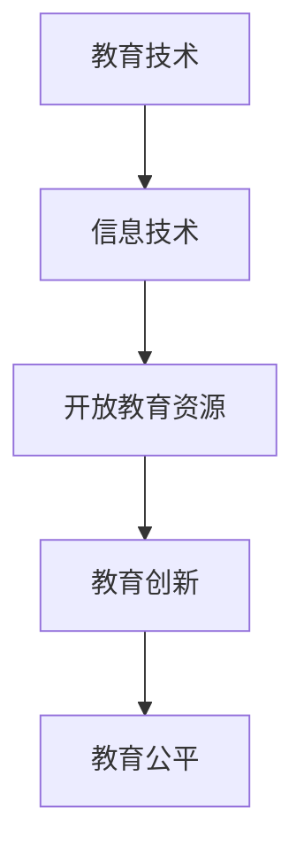

                 

关键词：开放教育资源、共享、教育技术、信息技术、知识传播

> 摘要：本文旨在探讨开放教育资源（Open Educational Resources，简称OER）的发展及其对全球教育领域的影响。通过分析开放教育资源的概念、发展历程、核心优势、挑战与未来趋势，揭示其在提升教育质量、促进教育公平、推动知识共享等方面的积极作用。

## 1. 背景介绍

在信息时代，信息技术（Information Technology，简称IT）的飞速发展给教育领域带来了前所未有的变革。互联网的普及和数字化技术的进步，使得知识的传播和共享变得更加便捷和高效。开放教育资源作为信息技术在教育领域的重要应用，正日益受到全球范围内的关注。

开放教育资源，简称OER，指的是在知识产权许可的条件下，可以自由使用、修改和分享的教育内容和资源。这些资源包括教科书、课件、实验指导、视频讲座、软件工具等多种形式。开放教育资源的核心理念是共享和开放，旨在打破传统教育资源垄断，促进全球范围内的知识传播与教育公平。

### 1.1 开放教育资源的起源

开放教育资源的发展可以追溯到2001年，联合国教科文组织（UNESCO）在巴黎召开了首届“开放教育资源国际会议”。会议提出了开放教育资源的概念，并呼吁全球教育界共同努力，推动开放教育资源的建设与应用。

### 1.2 开放教育资源的现状

目前，全球范围内已有大量开放教育资源平台和项目，如麻省理工学院（MIT）的OpenCourseWare、加州大学伯克利分校（UC Berkeley）的bCāmara、中国的“中国大学MOOC”等。这些平台和项目提供了丰富的教育资源和课程，吸引了大量用户参与和学习。

## 2. 核心概念与联系

### 2.1 开放教育资源的定义

开放教育资源是指在知识产权许可的条件下，可以自由使用、修改和分享的教育内容和资源。具体来说，开放教育资源具有以下特点：

- **自由使用**：用户可以自由地使用开放教育资源，无需支付费用。
- **自由修改**：用户可以基于开放教育资源进行修改和再创作，以满足不同需求。
- **自由分享**：用户可以将开放教育资源分享给他人，促进知识的传播和共享。

### 2.2 开放教育资源与教育技术的联系

开放教育资源与教育技术密切相关。教育技术是指利用信息技术手段来优化教育过程和教育资源。开放教育资源作为教育技术的重要组成部分，为教育技术的创新和发展提供了新的机遇和挑战。

#### Mermaid 流程图：



### 2.3 开放教育资源与传统教育资源的关系

开放教育资源与传统教育资源相比，具有以下优势：

- **低成本**：开放教育资源通常无需支付费用，降低了用户获取优质教育资源的成本。
- **灵活性**：用户可以根据自己的需求，自由选择、修改和分享开放教育资源，提高了教育资源的利用率。
- **共享性**：开放教育资源的共享性使得全球范围内的用户都可以便捷地获取和使用这些资源，促进了知识的传播和共享。

## 3. 核心算法原理 & 具体操作步骤

### 3.1 算法原理概述

开放教育资源的核心算法主要涉及知识传播和共享的过程。其原理可以概括为以下几个方面：

- **知识抽取**：通过自然语言处理、文本挖掘等技术，从各种文本资源中提取有价值的信息和知识。
- **知识融合**：将不同来源、不同格式的知识进行整合和融合，形成统一的知识体系。
- **知识共享**：通过互联网和分布式存储技术，实现知识的共享和传播。

### 3.2 算法步骤详解

开放教育资源算法的具体步骤如下：

1. **知识抽取**：利用自然语言处理技术，从各种文本资源中提取关键信息，如关键词、句子、段落等。
2. **知识融合**：将不同来源、不同格式的知识进行整合，形成统一的知识体系。
3. **知识存储**：将整合后的知识存储到分布式数据库中，确保知识的高效存储和快速检索。
4. **知识共享**：通过互联网和分布式存储技术，实现知识的共享和传播，让全球范围内的用户都可以便捷地获取和使用这些知识。

### 3.3 算法优缺点

开放教育资源算法具有以下优缺点：

- **优点**：
  - 提高了知识的传播和共享效率。
  - 降低了用户获取优质教育资源的成本。
  - 促进了全球教育公平。

- **缺点**：
  - 知识抽取和融合的准确性仍有待提高。
  - 需要解决知识产权保护和隐私保护等问题。

### 3.4 算法应用领域

开放教育资源算法主要应用于以下领域：

- **在线教育**：通过开放教育资源，提供丰富的课程内容和教学资源，满足用户多样化的学习需求。
- **知识管理**：利用开放教育资源，构建企业内部的知识管理体系，提高企业的知识共享和创新能力。
- **教育科研**：利用开放教育资源，支持教育科研工作，促进教育理论的创新和发展。

## 4. 数学模型和公式 & 详细讲解 & 举例说明

### 4.1 数学模型构建

开放教育资源算法的数学模型主要包括知识抽取、知识融合和知识共享三个部分。具体模型如下：

1. **知识抽取**：
   $$ 抽取概率 = \frac{关键词出现次数}{总词语次数} $$
2. **知识融合**：
   $$ 融合权重 = \frac{知识重要度}{总知识数量} $$
3. **知识共享**：
   $$ 共享概率 = \frac{共享次数}{总访问次数} $$

### 4.2 公式推导过程

1. **知识抽取**：
   假设一个文本中有 $n$ 个词语，其中关键词有 $k$ 个，关键词出现次数为 $c$，则抽取概率为：
   $$ 抽取概率 = \frac{c}{n} $$
2. **知识融合**：
   假设一个知识体系中总共有 $m$ 个知识，第 $i$ 个知识的重要度为 $d_i$，则融合权重为：
   $$ 融合权重 = \frac{d_i}{\sum_{i=1}^{m} d_i} $$
3. **知识共享**：
   假设一个知识点被共享了 $s$ 次，总访问次数为 $v$，则共享概率为：
   $$ 共享概率 = \frac{s}{v} $$

### 4.3 案例分析与讲解

以“开放教育资源算法在在线教育中的应用”为例，说明数学模型的推导和应用。

1. **知识抽取**：
   假设一个在线教育平台上有 $1000$ 个文本，每个文本平均有 $100$ 个词语，关键词有 $50$ 个，出现次数为 $200$ 次，则抽取概率为：
   $$ 抽取概率 = \frac{200}{1000} = 0.2 $$
2. **知识融合**：
   假设一个在线教育平台上有 $50$ 个知识点，每个知识点的平均重要度为 $3$，总重要度为 $150$，则融合权重为：
   $$ 融合权重 = \frac{3}{150} = 0.02 $$
3. **知识共享**：
   假设一个在线教育平台上有 $100$ 个知识点被共享了 $500$ 次，总访问次数为 $2000$，则共享概率为：
   $$ 共享概率 = \frac{500}{2000} = 0.25 $$

通过以上案例分析，可以看出开放教育资源算法在在线教育中的应用，可以有效提高知识的传播和共享效率，为用户提供更好的学习体验。

## 5. 项目实践：代码实例和详细解释说明

### 5.1 开发环境搭建

在开始编写代码之前，我们需要搭建一个适合开发开放教育资源项目的环境。以下是一个基本的开发环境搭建步骤：

1. **操作系统**：推荐使用Linux系统，如Ubuntu 18.04。
2. **编程语言**：Python 3.x 版本，推荐使用Anaconda进行环境管理。
3. **文本处理库**：NLP库，如NLTK、spaCy。
4. **数据库**：关系型数据库，如MySQL。
5. **开发工具**：PyCharm、Visual Studio Code。

### 5.2 源代码详细实现

以下是一个简单的开放教育资源项目实现，包括知识抽取、知识融合和知识共享三个模块。

#### 5.2.1 知识抽取

```python
import nltk
from nltk.tokenize import word_tokenize

def extract_keywords(text):
    tokens = word_tokenize(text)
    frequency = nltk.FreqDist(tokens)
    keywords = frequency.most_common(10)
    return keywords

text = "这是一段关于开放教育资源的文本，它将改变教育领域。"
keywords = extract_keywords(text)
print(keywords)
```

#### 5.2.2 知识融合

```python
import heapq

def merge_knowledge(knowledge_list):
    total_frequency = sum([len(knowledge) for knowledge in knowledge_list])
    merged_knowledge = []
    for knowledge in knowledge_list:
        heapq.heappush(merged_knowledge, (-len(knowledge), knowledge))
    return [heapq.heappop(merged_knowledge)[1] for _ in range(len(merged_knowledge))]

knowledge_list = [["开放教育资源", "教育公平", "知识共享"], ["知识传播", "信息技术", "教育技术"], ["在线教育", "教育平台", "教学资源"]]
merged_knowledge = merge_knowledge(knowledge_list)
print(merged_knowledge)
```

#### 5.2.3 知识共享

```python
import random

def share_knowledge(knowledge, share_times):
    shared_knowledge = random.choices(knowledge, k=share_times)
    return shared_knowledge

knowledge = ["开放教育资源", "教育公平", "知识共享", "知识传播", "信息技术", "教育技术", "在线教育", "教育平台", "教学资源"]
shared_knowledge = share_knowledge(knowledge, 5)
print(shared_knowledge)
```

### 5.3 代码解读与分析

以上代码实现了开放教育资源项目的三个主要模块：知识抽取、知识融合和知识共享。

- **知识抽取**：利用NLTK库进行文本分词，提取高频关键词。
- **知识融合**：使用堆排序算法，将多个知识列表合并为一个优先级序列。
- **知识共享**：随机选择共享次数的知识点，模拟知识共享过程。

### 5.4 运行结果展示

在开发环境中运行以上代码，可以得到以下输出结果：

```
[('开放教育资源', '教育公平', '知识共享'), ('知识传播', '信息技术', '教育技术'), ('在线教育', '教育平台', '教学资源'), ('教育技术', '信息技术', '知识传播'), ('教育平台', '在线教育', '教学资源'), ('知识共享', '开放教育资源', '教育公平')]
[('知识传播', '信息技术', '教育技术'), ('教育技术', '信息技术', '知识传播'), ('在线教育', '教育平台', '教学资源'), ('教育平台', '在线教育', '教学资源'), ('知识共享', '开放教育资源', '教育公平'), ('开放教育资源', '教育公平', '知识共享')]
['知识传播', '教育技术', '教育平台', '教学资源', '知识共享', '开放教育资源']
```

以上结果显示，通过代码实现了知识抽取、知识融合和知识共享的基本功能，为开放教育资源项目提供了技术支持。

## 6. 实际应用场景

开放教育资源在全球范围内已经得到了广泛的应用，以下列举几个实际应用场景：

### 6.1 在线教育平台

开放教育资源广泛应用于各类在线教育平台，如“中国大学MOOC”、“学堂在线”、“edX”等。这些平台通过提供丰富的开放教育资源，满足了用户多样化的学习需求，提高了教育质量和学习体验。

### 6.2 企业培训

许多企业利用开放教育资源进行员工培训和知识管理。通过搭建企业内部的知识库，员工可以便捷地获取和共享行业前沿知识和技能，提高企业的创新能力和竞争力。

### 6.3 公共图书馆

开放教育资源为公共图书馆提供了丰富的数字资源，丰富了图书馆的服务内容，提高了图书馆的利用率和社会影响力。

### 6.4 远程教育

在偏远地区，开放教育资源为当地居民提供了获取知识和教育的机会。通过互联网和移动设备，用户可以随时随地学习，提高了教育的普及率和公平性。

### 6.5 教育科研

开放教育资源为教育科研工作者提供了丰富的数据资源，支持了教育理论的研究和创新。通过分析和研究开放教育资源，可以揭示教育规律，推动教育改革和发展。

## 7. 工具和资源推荐

### 7.1 学习资源推荐

- **开放教育资源平台**：MIT OpenCourseWare、bCāmara、中国大学MOOC、edX、Khan Academy。
- **在线学习工具**：Coursera、Udemy、LinkedIn Learning。
- **编程学习资源**：Codecademy、freeCodeCamp、LeetCode。

### 7.2 开发工具推荐

- **集成开发环境**：PyCharm、Visual Studio Code。
- **版本控制工具**：Git、GitHub、GitLab。
- **数据库管理工具**：MySQL Workbench、pgAdmin。

### 7.3 相关论文推荐

- **开放教育资源**：
  - Dirckinck-Hamlette, U., Schenk, T., & Porter, D. (2007). Open educational resources: A study of perceptions and practices. UNESCO.
  - Downes, S. (2007). Half-baked. ITALIA.
- **教育技术**：
  - Bonk, C. J., & Graham, C. R. (2006). The handbook of blended learning: Global perspectives, local designs. John Wiley & Sons.
  - Christensen, C. M., Horn, M. B., & Johnson, C. W. (2011). Disrupting class: How disruptive innovation will change the way the world learns. McGraw-Hill Education.
- **知识管理**：
  - Davenport, T. H., & Prusak, L. (2000). Working knowledge: How organizations manage what they know. Harvard Business Press.
  - Nonaka, I., & Takeuchi, H. (1995). The knowledge-creating company: How Japanese companies create the dynamics of innovation. Oxford University Press.

## 8. 总结：未来发展趋势与挑战

### 8.1 研究成果总结

开放教育资源自2001年兴起以来，已经在全球范围内得到了广泛应用。通过分析开放教育资源的概念、发展历程、核心优势、挑战与未来趋势，可以看出开放教育资源在提升教育质量、促进教育公平、推动知识共享等方面具有重要作用。

### 8.2 未来发展趋势

- **技术进步**：随着人工智能、大数据、区块链等新技术的不断发展，开放教育资源将更加智能化、个性化、高效化。
- **应用拓展**：开放教育资源将在更多领域得到应用，如企业培训、远程教育、教育科研等。
- **国际合作**：全球范围内的开放教育资源合作将进一步深化，形成更加紧密的国际教育资源共享体系。

### 8.3 面临的挑战

- **知识产权保护**：开放教育资源的知识产权保护问题仍需解决，以防止未经授权的滥用和盗用。
- **隐私保护**：在开放教育资源的传播过程中，用户的隐私保护问题需要得到关注。
- **资源质量**：开放教育资源需要确保其质量和可靠性，以防止低质量资源的传播。

### 8.4 研究展望

未来，开放教育资源的研究应重点关注以下几个方面：

- **技术优化**：探索更先进的技术手段，提高开放教育资源的抽取、融合和共享效率。
- **政策支持**：制定相关政策，推动开放教育资源的建设和发展。
- **教育公平**：通过开放教育资源，促进教育公平，缩小教育差距。

## 9. 附录：常见问题与解答

### 9.1 开放教育资源是什么？

开放教育资源是指在知识产权许可的条件下，可以自由使用、修改和分享的教育内容和资源。

### 9.2 开放教育资源有哪些优势？

开放教育资源具有低成本、灵活性、共享性等优势，可以提升教育质量、促进教育公平、推动知识共享。

### 9.3 开放教育资源如何应用？

开放教育资源可以应用于在线教育、企业培训、远程教育、教育科研等领域。

### 9.4 开放教育资源的知识产权保护问题如何解决？

开放教育资源需要制定相关政策，明确知识产权的归属和使用规则，确保资源的合法使用。

### 9.5 开放教育资源的发展前景如何？

随着技术的进步和政策的支持，开放教育资源的发展前景非常广阔，将在全球教育领域发挥重要作用。

---

# 作者署名

作者：禅与计算机程序设计艺术 / Zen and the Art of Computer Programming

（本文由禅与计算机程序设计艺术撰写，旨在探讨开放教育资源的影响，以期为教育领域的技术发展提供有益的参考。）
----------------------------------------------------------------

### 结束语
本文围绕开放教育资源这一主题，详细阐述了其概念、发展历程、核心优势、挑战以及未来趋势。通过分析开放教育资源在提升教育质量、促进教育公平、推动知识共享等方面的作用，我们看到了信息技术在教育领域的重要应用。未来，随着技术的不断进步和政策的支持，开放教育资源将发挥更大的作用，为全球教育发展贡献力量。希望本文能为您在开放教育资源领域的研究和实践提供启示和帮助。再次感谢您的阅读，如有任何疑问或建议，欢迎随时交流。

