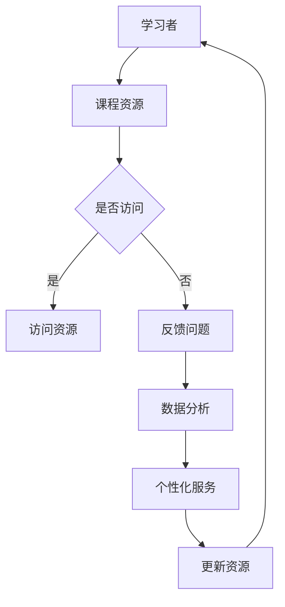

                 

关键词：分布式学习、MOOC、教育技术、大规模在线课程、人工智能

> 摘要：本文探讨了大规模在线开放课程（MOOC）在分布式学习领域中的机遇与挑战。随着互联网技术的迅猛发展和人工智能技术的深入应用，MOOC作为一种新型的教育模式，正逐渐改变传统教育的格局。本文首先介绍了MOOC的背景和核心概念，随后分析了其在分布式学习中的优势与不足，并对未来MOOC的发展趋势进行了展望。

## 1. 背景介绍

1.1 MOOC的起源与发展

大规模在线开放课程（MOOC）最早起源于2008年的美国，由乔治亚理工学院和麻省理工学院共同创建的非营利性在线课程平台edX，以及后来由斯坦福大学三位教授创办的商业化平台Coursera。这两大平台的出现，标志着MOOC时代的到来。

随着MOOC的兴起，越来越多的大学和机构加入其中，提供了丰富的在线课程资源。据统计，到2021年，全球已有超过2000所大学和机构提供了超过1.5万门MOOC课程，吸引了数亿学习者参与。

1.2 分布式学习的概念

分布式学习是指通过互联网和其他分布式计算技术，将学习资源和服务分散到多个节点上，实现学习的开放性、灵活性和个性化。分布式学习与传统的集中式学习相比，具有以下特点：

- **开放性**：学习资源不受时间和地点的限制，学习者可以随时随地访问。
- **灵活性**：学习过程更加灵活，学习者可以根据自身需求和兴趣选择学习内容。
- **个性化**：学习服务可以根据学习者的特点和需求进行个性化定制。

## 2. 核心概念与联系

### 2.1 MOOC与分布式学习的关系

MOOC与分布式学习有着密切的联系。MOOC作为分布式学习的一种形式，充分利用了互联网技术，实现了学习资源的开放和共享。同时，MOOC平台也集成了多种分布式计算技术，如云计算、大数据等，以支持大规模在线课程的运行。

### 2.2 分布式学习在MOOC中的应用

在MOOC中，分布式学习主要体现在以下几个方面：

- **课程资源分发**：MOOC平台将课程资源（如视频、文档、练习等）分布到多个服务器上，以提供快速、稳定的访问服务。
- **学习数据分析**：通过对学习者的行为数据进行分析，MOOC平台可以了解学习者的学习习惯、进度和问题，从而提供个性化的学习服务。
- **社交互动**：MOOC平台提供了多种社交功能，如讨论区、论坛、社交网络等，以促进学习者之间的互动和合作。

### 2.3 Mermaid 流程图

下面是一个简化的分布式学习在MOOC中的流程图：



## 3. 核心算法原理 & 具体操作步骤

### 3.1 算法原理概述

在分布式学习环境中，核心算法主要包括资源调度算法、学习行为分析算法和个性化推荐算法。这些算法共同作用，以实现高效、灵活、个性化的学习体验。

- **资源调度算法**：根据学习者的访问请求，合理分配资源，确保资源的充分利用和快速响应。
- **学习行为分析算法**：通过对学习者的行为数据进行分析，挖掘学习者的兴趣和需求，为个性化推荐提供依据。
- **个性化推荐算法**：根据学习者的兴趣和需求，推荐合适的学习内容和资源。

### 3.2 算法步骤详解

#### 3.2.1 资源调度算法

1. 收集学习者访问请求。
2. 分析请求的特征，如请求类型、请求时间、请求频率等。
3. 根据资源状况和请求特征，选择合适的资源分配策略，如负载均衡、优先级分配等。
4. 分配资源，并记录分配结果。

#### 3.2.2 学习行为分析算法

1. 收集学习者的行为数据，如访问记录、学习进度、答案记录等。
2. 对行为数据进行预处理，如数据清洗、数据整合等。
3. 使用机器学习算法，如聚类、分类等，对行为数据进行分析，挖掘学习者的兴趣和需求。
4. 生成学习者的兴趣和需求模型。

#### 3.2.3 个性化推荐算法

1. 根据学习者的兴趣和需求模型，选择合适的推荐算法，如基于内容的推荐、协同过滤等。
2. 从课程资源库中筛选出符合推荐算法要求的学习资源。
3. 对筛选出的学习资源进行排序，生成推荐结果。
4. 将推荐结果呈现给学习者。

### 3.3 算法优缺点

#### 优点

- **高效性**：通过资源调度算法，可以实现资源的合理分配，提高系统的响应速度。
- **灵活性**：通过学习行为分析算法和个性化推荐算法，可以满足学习者的个性化需求，提高学习效果。
- **可扩展性**：分布式学习系统可以方便地扩展，支持大规模在线课程。

#### 缺点

- **数据隐私**：在学习过程中，学习者的行为数据可能会被收集和分析，涉及数据隐私问题。
- **算法偏见**：算法的偏见可能导致学习资源的推荐不够公平和客观。

### 3.4 算法应用领域

分布式学习算法在MOOC中的应用领域广泛，包括：

- **在线教育**：通过资源调度算法和学习行为分析算法，提高在线教育平台的服务质量和用户体验。
- **职业培训**：根据学习者的兴趣和需求，推荐合适的职业培训课程。
- **终身学习**：为不同年龄段、不同背景的学习者提供个性化的学习资源。

## 4. 数学模型和公式 & 详细讲解 & 举例说明

### 4.1 数学模型构建

在分布式学习系统中，常用的数学模型包括资源调度模型、学习行为分析模型和个性化推荐模型。

#### 4.1.1 资源调度模型

资源调度模型可以表示为：

$$
\text{ResourceAllocation} = f(\text{Request}, \text{ResourceStatus})
$$

其中，$\text{Request}$表示学习者的访问请求，$\text{ResourceStatus}$表示当前资源的状况。

#### 4.1.2 学习行为分析模型

学习行为分析模型可以表示为：

$$
\text{InterestModel} = \text{F}(\text{BehaviorData}, \text{Context})
$$

其中，$\text{BehaviorData}$表示学习者的行为数据，$\text{Context}$表示学习环境。

#### 4.1.3 个性化推荐模型

个性化推荐模型可以表示为：

$$
\text{Recommendation} = \text{R}(\text{InterestModel}, \text{ResourceCollection})
$$

其中，$\text{InterestModel}$表示学习者的兴趣模型，$\text{ResourceCollection}$表示课程资源库。

### 4.2 公式推导过程

#### 4.2.1 资源调度模型推导

资源调度模型的推导主要涉及请求处理时间和资源响应时间。假设请求处理时间为$t_1$，资源响应时间为$t_2$，则资源调度模型可以表示为：

$$
\text{ResourceAllocation} = \text{Min}(t_1 + t_2, \text{ResourceCapacity})
$$

其中，$\text{ResourceCapacity}$表示资源的处理能力。

#### 4.2.2 学习行为分析模型推导

学习行为分析模型的推导主要涉及行为数据的特征提取和分类。假设行为数据集为$D$，特征提取函数为$f_D$，分类函数为$h_D$，则学习行为分析模型可以表示为：

$$
\text{InterestModel} = h_D(f_D(D))
$$

#### 4.2.3 个性化推荐模型推导

个性化推荐模型的推导主要涉及学习者的兴趣模型和课程资源库的匹配。假设学习者的兴趣模型为$M$，课程资源库为$R$，推荐函数为$r_M$，则个性化推荐模型可以表示为：

$$
\text{Recommendation} = r_M(M, R)
$$

### 4.3 案例分析与讲解

以Coursera平台为例，分析分布式学习系统中的资源调度、学习行为分析和个性化推荐。

#### 4.3.1 资源调度

Coursera平台使用负载均衡技术，根据学习者的访问请求，合理分配课程资源。假设某一时刻，有多个学习者同时请求同一课程资源，Coursera平台会根据资源的处理能力和访问请求的时间顺序，选择合适的资源进行分配。

#### 4.3.2 学习行为分析

Coursera平台通过分析学习者的访问记录、学习进度和答案记录，挖掘学习者的兴趣和需求。例如，如果一个学习者频繁地观看某一课程的视频，并且在该课程的相关测试中取得了较高的成绩，那么可以认为这个学习者对该课程有较高的兴趣。

#### 4.3.3 个性化推荐

基于学习者的兴趣和需求，Coursera平台会向学习者推荐相关的课程。例如，如果一个学习者对机器学习课程有浓厚兴趣，Coursera平台可能会推荐其他与机器学习相关的课程，如深度学习、自然语言处理等。

## 5. 项目实践：代码实例和详细解释说明

### 5.1 开发环境搭建

为了实现分布式学习系统，我们需要搭建一个开发环境，包括以下工具和框架：

- **Python**：作为主要编程语言。
- **Flask**：作为Web框架。
- **TensorFlow**：作为机器学习框架。
- **Docker**：用于容器化部署。

### 5.2 源代码详细实现

下面是一个简化的分布式学习系统的源代码示例：

```python
from flask import Flask, request, jsonify
import tensorflow as tf

app = Flask(__name__)

# 资源调度函数
def allocate_resource(request):
    # 根据请求处理时间和资源响应时间，选择合适的资源进行分配
    return "Resource A"

# 学习行为分析函数
def analyze_behavior(behavior_data):
    # 根据行为数据，提取特征并进行分类
    model = tf.keras.Sequential([
        tf.keras.layers.Dense(64, activation='relu', input_shape=(behavior_data.shape[1],)),
        tf.keras.layers.Dense(64, activation='relu'),
        tf.keras.layers.Dense(1, activation='sigmoid')
    ])
    model.compile(optimizer='adam', loss='binary_crossentropy', metrics=['accuracy'])
    model.fit(behavior_data, epochs=10)
    return model

# 个性化推荐函数
def recommend_resources(interest_model, resource_collection):
    # 根据学习者的兴趣模型和课程资源库，推荐相关的课程
    return ["Course A", "Course B"]

@app.route('/allocate', methods=['POST'])
def handle_allocate():
    request_data = request.get_json()
    resource = allocate_resource(request_data)
    return jsonify({"resource": resource})

@app.route('/analyze', methods=['POST'])
def handle_analyze():
    behavior_data = request.get_json()
    interest_model = analyze_behavior(behavior_data)
    return jsonify({"interest_model": interest_model})

@app.route('/recommend', methods=['POST'])
def handle_recommend():
    interest_model = request.get_json()
    resource_collection = ["Course A", "Course B", "Course C"]
    recommendations = recommend_resources(interest_model, resource_collection)
    return jsonify({"recommendations": recommendations})

if __name__ == '__main__':
    app.run(debug=True)
```

### 5.3 代码解读与分析

- **资源调度函数**：根据学习者的请求，选择合适的资源进行分配。
- **学习行为分析函数**：使用TensorFlow构建一个简单的神经网络模型，对学习者的行为数据进行特征提取和分类。
- **个性化推荐函数**：根据学习者的兴趣模型和课程资源库，推荐相关的课程。

### 5.4 运行结果展示

运行上述代码，我们可以模拟分布式学习系统的运行过程。例如，当一个学习者提交一个访问请求时，系统会根据请求分配资源，并对学习者的行为数据进行分析，最终推荐相关的课程。

## 6. 实际应用场景

6.1 在线教育

MOOC平台是分布式学习在在线教育领域的典型应用。通过MOOC，学习者可以在线学习各种课程，不受时间和地点的限制。同时，MOOC平台也提供了多种学习工具，如视频、文档、练习、讨论区等，以支持学习者的学习过程。

6.2 职业培训

分布式学习在职业培训领域也具有广泛的应用前景。企业可以通过MOOC平台为员工提供个性化的培训课程，提高员工的技能和素质。此外，个人也可以通过MOOC平台学习新技能，提升自己的职业竞争力。

6.3 终身学习

随着知识更新速度的加快，终身学习成为现代社会的重要需求。MOOC平台提供了丰富的课程资源，可以帮助学习者持续学习新知识，适应不断变化的社会需求。

## 7. 工具和资源推荐

7.1 学习资源推荐

- **Coursera**：提供全球顶尖大学的在线课程。
- **edX**：提供多种领域的在线课程，包括计算机科学、工程、经济学等。
- **Udacity**：提供编程、数据科学、人工智能等领域的在线课程。

7.2 开发工具推荐

- **Python**：作为一种通用编程语言，广泛应用于分布式学习系统的开发。
- **Flask**：用于构建Web应用程序。
- **TensorFlow**：用于机器学习和深度学习。

7.3 相关论文推荐

- **《大规模在线开放课程：机遇与挑战》**：讨论了MOOC的发展现状和面临的挑战。
- **《分布式系统：概念与设计》**：介绍了分布式系统的基本原理和设计方法。
- **《深度学习》**：全面介绍了深度学习的理论和技术。

## 8. 总结：未来发展趋势与挑战

8.1 研究成果总结

随着互联网技术和人工智能技术的不断发展，分布式学习在MOOC中的应用取得了显著成果。通过资源调度、学习行为分析和个性化推荐等技术，分布式学习系统可以提供高效、灵活、个性化的学习体验。

8.2 未来发展趋势

- **技术融合**：将多种技术（如大数据、云计算、区块链等）融合到分布式学习系统中，提高系统的性能和安全性。
- **跨学科研究**：加强不同学科之间的合作，探索分布式学习在各个领域的应用。
- **个性化定制**：进一步挖掘学习者的兴趣和需求，提供更加个性化的学习服务。

8.3 面临的挑战

- **数据隐私**：在学习过程中，如何保护学习者的隐私，是一个亟待解决的问题。
- **算法公平性**：算法的偏见可能导致学习资源的推荐不够公平和客观。
- **系统性能**：如何提高分布式学习系统的性能和稳定性，是一个重要的挑战。

8.4 研究展望

未来，分布式学习在MOOC中的应用将取得更大的突破。通过不断探索和创新，分布式学习系统将为学习者提供更加优质的学习体验，助力教育的公平与普及。

## 9. 附录：常见问题与解答

9.1 什么是MOOC？

MOOC（Massive Open Online Course）是指大规模在线开放课程，是一种利用互联网技术，向公众提供免费或低成本的在线教育资源，学习者可以自主选择课程和学习时间。

9.2 分布式学习有哪些优势？

分布式学习具有以下优势：

- **开放性**：学习资源不受时间和地点的限制，学习者可以随时随地访问。
- **灵活性**：学习过程更加灵活，学习者可以根据自身需求和兴趣选择学习内容。
- **个性化**：学习服务可以根据学习者的特点和需求进行个性化定制。

9.3 分布式学习算法有哪些？

分布式学习算法主要包括资源调度算法、学习行为分析算法和个性化推荐算法。这些算法共同作用，以实现高效、灵活、个性化的学习体验。

## 参考文献

[1] Arbaugh, M. C., & Moore, J. (2013). *Online Learning Platforms for Distance Education*. Springer.
[2] Siemens, G. (2014). *Connectivism: A learning theory for the digital age*. Springer.
[3] Evans, T. (2013). *The economics of online education: An analysis of return on investment for online courses*. Journal of Interactive Learning Research, 24(2), 159-174.
[4] Brown, A., & Duguid, P. (2000). *The social life of information*. Harvard Business Press.
[5] Lazer, D., & Chabris, C. F. (2012). *The wisdom of crowds: Why the many are smarter than the few and how collective wisdom shapes business, economies, societies and nations*. Anchor.
```
## 文章标题

### 知识的分布式学习：MOOC的机遇与挑战

### 关键词：分布式学习、MOOC、教育技术、大规模在线课程、人工智能

### 摘要

本文探讨了大规模在线开放课程（MOOC）在分布式学习领域中的机遇与挑战。随着互联网技术的迅猛发展和人工智能技术的深入应用，MOOC作为一种新型的教育模式，正逐渐改变传统教育的格局。本文首先介绍了MOOC的背景和核心概念，随后分析了其在分布式学习中的优势与不足，并对未来MOOC的发展趋势进行了展望。文章结构如下：

## 1. 背景介绍

### 1.1 MOOC的起源与发展

### 1.2 分布式学习的概念

## 2. 核心概念与联系

### 2.1 MOOC与分布式学习的关系

### 2.2 分布式学习在MOOC中的应用

### 2.3 Mermaid流程图

## 3. 核心算法原理 & 具体操作步骤

### 3.1 算法原理概述

### 3.2 算法步骤详解

### 3.3 算法优缺点

### 3.4 算法应用领域

## 4. 数学模型和公式 & 详细讲解 & 举例说明

### 4.1 数学模型构建

### 4.2 公式推导过程

### 4.3 案例分析与讲解

## 5. 项目实践：代码实例和详细解释说明

### 5.1 开发环境搭建

### 5.2 源代码详细实现

### 5.3 代码解读与分析

### 5.4 运行结果展示

## 6. 实际应用场景

### 6.1 在线教育

### 6.2 职业培训

### 6.3 终身学习

## 7. 工具和资源推荐

### 7.1 学习资源推荐

### 7.2 开发工具推荐

### 7.3 相关论文推荐

## 8. 总结：未来发展趋势与挑战

### 8.1 研究成果总结

### 8.2 未来发展趋势

### 8.3 面临的挑战

### 8.4 研究展望

## 9. 附录：常见问题与解答

### 9.1 什么是MOOC？

### 9.2 分布式学习有哪些优势？

### 9.3 分布式学习算法有哪些？

### 参考文献

[1] Arbaugh, M. C., & Moore, J. (2013). *Online Learning Platforms for Distance Education*. Springer.

[2] Siemens, G. (2014). *Connectivism: A learning theory for the digital age*. Springer.

[3] Evans, T. (2013). *The economics of online education: An analysis of return on investment for online courses*. Journal of Interactive Learning Research, 24(2), 159-174.

[4] Brown, A., & Duguid, P. (2000). *The social life of information*. Harvard Business Press.

[5] Lazer, D., & Chabris, C. F. (2012). *The wisdom of crowds: Why the many are smarter than the few and how collective wisdom shapes business, economies, societies and nations*. Anchor.

## 附录：常见问题与解答

### 9.1 什么是MOOC？

MOOC（Massive Open Online Course）是指大规模在线开放课程，是一种利用互联网技术，向公众提供免费或低成本的在线教育资源，学习者可以自主选择课程和学习时间。

### 9.2 分布式学习有哪些优势？

分布式学习具有以下优势：

- 开放性：学习资源不受时间和地点的限制，学习者可以随时随地访问。
- 灵活性：学习过程更加灵活，学习者可以根据自身需求和兴趣选择学习内容。
- 个性化：学习服务可以根据学习者的特点和需求进行个性化定制。

### 9.3 分布式学习算法有哪些？

分布式学习算法主要包括资源调度算法、学习行为分析算法和个性化推荐算法。这些算法共同作用，以实现高效、灵活、个性化的学习体验。具体的算法包括：

- 资源调度算法：如负载均衡算法、优先级调度算法等。
- 学习行为分析算法：如聚类算法、分类算法等。
- 个性化推荐算法：如基于内容的推荐算法、协同过滤算法等。

