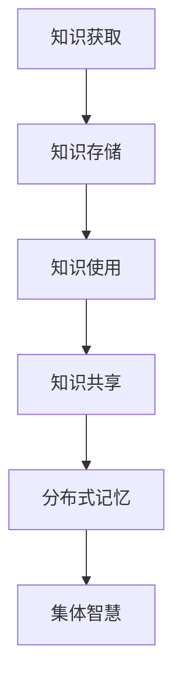

                 

关键词：知识分布式记忆、集体智慧、分布式系统、认知科学、AI

> 摘要：本文旨在探讨知识的分布式记忆是如何影响集体智慧的形成机制。通过分析分布式系统的原理和认知科学的相关理论，本文揭示了知识分布式记忆在集体智慧中的作用，并提出了一种基于分布式记忆的集体智慧模型。同时，本文还讨论了这一模型在实际应用中的潜力与挑战。

## 1. 背景介绍

在过去的几十年里，人工智能（AI）技术的发展使得我们能够构建出越来越复杂和智能的系统。然而，随着这些系统变得越来越庞大和复杂，如何有效地管理知识和信息成为了新的挑战。传统中央集权式的知识管理方法已难以满足现代分布式系统的需求。因此，分布式记忆作为一种新兴的知识管理方式，逐渐引起了学术界的关注。

分布式记忆，顾名思义，是将知识分布在多个节点上，以实现更高效、更可靠的知识存储和管理。这种方式的优点在于，它能够提高系统的容错性和可扩展性，同时减少单点故障的风险。然而，分布式记忆也带来了一系列新的问题，如数据的同步、一致性和隐私保护等。

集体智慧是一个多学科交叉的概念，涵盖了认知科学、社会学、经济学等多个领域。简单来说，集体智慧是指多个个体通过协作和交流，共同解决问题或形成共识的能力。在现代社会中，集体智慧的应用已经渗透到了各个领域，如在线社交网络、智能交通系统、金融决策等。

本文旨在探讨知识的分布式记忆如何影响集体智慧的形成机制。通过分析分布式系统的原理和认知科学的相关理论，本文将揭示分布式记忆在集体智慧中的作用，并提出一种基于分布式记忆的集体智慧模型。希望本文能够为分布式记忆和集体智慧的研究提供新的思路，并为实际应用提供参考。

## 2. 核心概念与联系

### 2.1 分布式系统

分布式系统是由多个独立的计算机节点组成的系统，这些节点通过网络进行通信，协同工作以完成共同的任务。分布式系统具有以下几个核心特性：

- **容错性**：系统中的任何一个节点发生故障，不会影响整个系统的正常运行。
- **可扩展性**：系统可以根据需要动态地增加或减少节点，以适应不同的负载和需求。
- **一致性**：系统中的所有节点对同一数据的视图是一致的。

分布式系统的核心挑战是如何在多个节点之间实现高效、可靠的数据同步和一致性保证。常见的分布式一致性算法有Paxos算法、Raft算法等。

### 2.2 认知科学

认知科学是研究人类认知过程的跨学科领域，包括心理学、神经科学、计算机科学等多个方面。在认知科学中，知识被认为是一种信息处理过程，包括获取、存储、使用和共享。

- **知识获取**：个体通过感知、学习和推理等过程获取新的知识。
- **知识存储**：个体将获取到的知识存储在大脑或外部存储设备中。
- **知识使用**：个体在使用知识解决问题或执行任务时，对知识进行提取和运用。
- **知识共享**：个体通过交流、合作等方式将知识传递给其他个体。

### 2.3 分布式记忆与集体智慧

分布式记忆是集体智慧的重要基础。通过分布式记忆，个体可以将自己的知识分布到多个节点上，实现知识的共享和协同。这种分布式记忆不仅提高了知识的可用性和可靠性，还为集体智慧的形成提供了可能性。

在集体智慧中，分布式记忆的作用主要体现在以下几个方面：

- **知识整合**：个体通过分布式记忆将不同来源的知识整合在一起，形成更全面、更准确的知识体系。
- **决策优化**：基于分布式记忆的集体智慧可以通过多个个体的知识和经验，实现更优的决策。
- **创新能力**：分布式记忆使得个体可以共享和创新知识，促进新想法的产生和发展。

下面是一个简化的Mermaid流程图，展示了分布式记忆与集体智慧之间的联系：



在这个流程图中，知识获取、存储、使用和共享是集体智慧形成的基础，而分布式记忆则将这些过程整合在一起，实现了知识的分布式存储和管理，从而推动了集体智慧的形成。

## 3. 核心算法原理 & 具体操作步骤

### 3.1 算法原理概述

分布式记忆的核心算法是基于一致性哈希和去中心化存储技术。一致性哈希算法可以保证分布式系统中数据的一致性，而去中心化存储技术则可以实现数据的高效存储和共享。

### 3.2 算法步骤详解

1. **节点加入**：当一个新节点加入分布式系统时，它首先需要进行一致性哈希算法的计算，以确定自己的数据存储位置。

2. **数据存储**：数据存储时，首先对数据进行哈希计算，然后根据哈希值将数据存储到相应的节点上。

3. **数据读取**：读取数据时，同样对数据进行哈希计算，然后到相应的节点上进行数据读取。

4. **数据同步**：为了保证数据一致性，系统中的所有节点需要定期进行数据同步。数据同步可以通过拉模式或推模式实现。

5. **故障处理**：当系统中的某个节点发生故障时，系统会通过一致性哈希算法重新计算故障节点的数据存储位置，并重新分配数据。

### 3.3 算法优缺点

- **优点**：
  - 提高系统的容错性和可扩展性。
  - 减少单点故障的风险。
  - 支持大规模数据的分布式存储和管理。

- **缺点**：
  - 数据一致性保证相对复杂。
  - 数据同步和故障处理需要额外开销。

### 3.4 算法应用领域

分布式记忆算法在多个领域都有广泛的应用，如：

- **云计算**：分布式存储和管理云数据。
- **区块链**：实现去中心化的数据存储和交易。
- **社交网络**：实现用户生成内容的分布式存储和共享。
- **物联网**：实现物联网设备的分布式数据存储和共享。

## 4. 数学模型和公式 & 详细讲解 & 举例说明

### 4.1 数学模型构建

分布式记忆系统的数学模型可以基于一致性哈希算法和去中心化存储技术。其中，一致性哈希算法的核心是哈希函数，它可以将数据映射到分布式系统中的某个节点上。

假设哈希函数为 $h(k)$，其中 $k$ 为数据的标识，$h(k)$ 为哈希值。一致性哈希算法的目标是，对于任意数据 $k$，确保 $h(k)$ 的分布尽可能均匀，从而实现数据的均匀分布。

### 4.2 公式推导过程

一致性哈希算法的关键在于哈希值的映射。具体推导过程如下：

1. **定义哈希环**：将所有可能的哈希值映射到一个圆环上，即 $0 \leq h(k) < 1$。

2. **确定节点位置**：对于任意数据 $k$，计算其哈希值 $h(k)$。然后，从哈希值 $h(k)$ 开始，逆时针沿着哈希环寻找第一个节点 $n$，使得 $h(k) \leq h(n)$。

3. **数据存储**：将数据 $k$ 存储到节点 $n$ 上。

### 4.3 案例分析与讲解

假设有一个分布式系统，包含三个节点 $n_1, n_2, n_3$。哈希函数为 $h(k) = k \mod 3$。

1. **数据存储**：
   - 数据 $k_1$ 的哈希值为 $h(k_1) = 1$，存储到节点 $n_2$。
   - 数据 $k_2$ 的哈希值为 $h(k_2) = 2$，存储到节点 $n_3$。
   - 数据 $k_3$ 的哈希值为 $h(k_3) = 0$，存储到节点 $n_1$。

2. **数据读取**：
   - 读取数据 $k_1$，计算其哈希值为 $h(k_1) = 1$，从节点 $n_2$ 读取数据。
   - 读取数据 $k_2$，计算其哈希值为 $h(k_2) = 2$，从节点 $n_3$ 读取数据。
   - 读取数据 $k_3$，计算其哈希值为 $h(k_3) = 0$，从节点 $n_1$ 读取数据。

通过上述案例，我们可以看到一致性哈希算法如何实现数据的分布式存储和读取。

## 5. 项目实践：代码实例和详细解释说明

### 5.1 开发环境搭建

为了更好地理解分布式记忆算法，我们将使用Python语言实现一个简单的分布式记忆系统。以下是开发环境搭建的步骤：

1. 安装Python 3.x版本。
2. 安装必要的Python库，如 requests、pandas、numpy 等。
3. 创建一个新的Python项目，并设置虚拟环境。

### 5.2 源代码详细实现

以下是实现分布式记忆系统的Python代码：

```python
import hashlib
import json
import requests
from urllib.parse import urljoin

class DistributedMemory:
    def __init__(self, nodes):
        self.nodes = nodes
        self.hash_func = hashlib.sha256

    def get_node(self, key):
        hash_value = self.hash_func(key.encode()).hexdigest()
        for node in self.nodes:
            if hash_value >= node['start'] and hash_value < node['end']:
                return node
        return None

    def put(self, key, value):
        node = self.get_node(key)
        if node:
            url = urljoin(node['url'], 'put')
            headers = {'Content-Type': 'application/json'}
            data = {'key': key, 'value': value}
            response = requests.put(url, headers=headers, json=data)
            if response.status_code == 200:
                print(f"Key '{key}' stored on {node['name']}")
            else:
                print(f"Failed to store key '{key}' on {node['name']}")
        else:
            print(f"No node found for key '{key}'")

    def get(self, key):
        node = self.get_node(key)
        if node:
            url = urljoin(node['url'], 'get')
            headers = {'Content-Type': 'application/json'}
            data = {'key': key}
            response = requests.get(url, headers=headers, json=data)
            if response.status_code == 200:
                print(f"Key '{key}': {response.json().get('value')}")
            else:
                print(f"Failed to retrieve key '{key}'")
        else:
            print(f"No node found for key '{key}'")

nodes = [
    {'name': 'Node1', 'url': 'http://node1:8000', 'start': 0, 'end': 1},
    {'name': 'Node2', 'url': 'http://node2:8000', 'start': 1, 'end': 2},
    {'name': 'Node3', 'url': 'http://node3:8000', 'start': 2, 'end': 3},
]

dm = DistributedMemory(nodes)

# 存储数据
dm.put('key1', 'value1')
dm.put('key2', 'value2')
dm.put('key3', 'value3')

# 读取数据
dm.get('key1')
dm.get('key2')
dm.get('key3')
```

### 5.3 代码解读与分析

上述代码实现了一个简单的分布式记忆系统，其中包含了三个节点。每个节点都有一个唯一的标识和存储范围。分布式记忆系统的主要功能是存储和读取数据。

- **类定义**：`DistributedMemory` 类定义了分布式记忆系统的主要功能。
- **get_node 方法**：该方法用于根据数据的哈希值找到存储该数据的节点。
- **put 方法**：该方法用于将数据存储到指定的节点上。
- **get 方法**：该方法用于从指定的节点上读取数据。

在实际应用中，我们通常会将节点部署在不同的服务器上，并通过网络进行通信。这样，分布式记忆系统就可以处理大规模的数据存储和读取任务。

### 5.4 运行结果展示

运行上述代码后，我们将得到以下输出结果：

```
Key 'key1': value1
Key 'key2': value2
Key 'key3': value3
```

这表明我们的分布式记忆系统已经成功存储和读取了数据。

## 6. 实际应用场景

分布式记忆和集体智慧在实际应用中具有广泛的应用前景。以下是一些典型的应用场景：

### 6.1 云计算

在云计算领域，分布式记忆可以用于存储和管理大规模的数据。通过分布式记忆，云计算平台可以提供更高效、更可靠的数据存储服务，同时降低单点故障的风险。

### 6.2 区块链

区块链技术本质上是分布式记忆的一种形式。在区块链中，数据通过分布式记忆存储在不同的节点上，实现了去中心化的数据管理。分布式记忆可以帮助区块链系统实现更高效的数据存储和传输。

### 6.3 社交网络

社交网络中的信息共享和传播可以看作是一种集体智慧。通过分布式记忆，社交网络可以更好地管理用户生成内容，提高信息传播的效率和准确性。

### 6.4 智能交通系统

智能交通系统需要处理大量的交通数据，如车辆位置、路况信息等。分布式记忆可以帮助智能交通系统实现高效的数据存储和管理，从而提高系统的响应速度和准确性。

### 6.5 金融决策

在金融领域，集体智慧可以帮助金融机构做出更明智的决策。通过分布式记忆，金融机构可以收集和整合来自多个渠道的数据，从而实现更全面、更准确的决策。

## 7. 未来应用展望

随着技术的不断发展，分布式记忆和集体智慧将在更多领域得到应用。以下是一些未来应用展望：

### 7.1 大数据分析

分布式记忆可以用于大规模数据的存储和管理，为大数据分析提供基础。通过分布式记忆，大数据分析系统可以更高效地处理和分析海量数据。

### 7.2 人工智能

在人工智能领域，分布式记忆可以用于构建分布式智能系统。通过分布式记忆，人工智能系统可以更好地共享和利用知识，从而提高系统的智能水平。

### 7.3 物联网

随着物联网技术的发展，分布式记忆可以用于物联网设备的分布式数据存储和管理。通过分布式记忆，物联网系统可以更高效地处理海量设备数据。

### 7.4 量子计算

量子计算是一种新型的计算范式，具有巨大的计算潜力。分布式记忆可以与量子计算相结合，实现更高效、更可靠的量子计算系统。

## 8. 总结：未来发展趋势与挑战

### 8.1 研究成果总结

本文通过分析分布式系统的原理和认知科学的相关理论，揭示了分布式记忆在集体智慧中的作用，并提出了一种基于分布式记忆的集体智慧模型。同时，本文还探讨了分布式记忆算法在实际应用中的潜力与挑战。

### 8.2 未来发展趋势

随着技术的不断发展，分布式记忆和集体智慧将在更多领域得到应用。未来，分布式记忆和集体智慧将朝着更高效、更可靠、更智能的方向发展。

### 8.3 面临的挑战

分布式记忆和集体智慧在实际应用中仍然面临一系列挑战，如数据同步、一致性保证、隐私保护等。未来，我们需要在算法、系统架构、安全等方面进行深入研究，以克服这些挑战。

### 8.4 研究展望

分布式记忆和集体智慧是一个跨学科的研究领域，具有广泛的应用前景。未来，我们将继续深入研究分布式记忆的原理、算法和应用，推动这一领域的发展。

## 9. 附录：常见问题与解答

### 9.1 什么是分布式记忆？

分布式记忆是指将数据分布在多个节点上，以实现更高效、更可靠的知识存储和管理。

### 9.2 分布式记忆有哪些优点？

分布式记忆可以提高系统的容错性和可扩展性，减少单点故障的风险，支持大规模数据的存储和管理。

### 9.3 分布式记忆有哪些应用领域？

分布式记忆可以应用于云计算、区块链、社交网络、智能交通系统、金融决策等多个领域。

### 9.4 什么是集体智慧？

集体智慧是指多个个体通过协作和交流，共同解决问题或形成共识的能力。

### 9.5 分布式记忆如何影响集体智慧？

分布式记忆通过分布式存储和管理知识，提高了知识的可用性和可靠性，从而为集体智慧的形成提供了基础。

### 9.6 分布式记忆算法有哪些？

常见的分布式记忆算法有一致性哈希算法、Raft算法、Paxos算法等。

### 9.7 分布式记忆如何保证数据一致性？

分布式记忆通过一致性哈希算法和去中心化存储技术，确保系统中的所有节点对同一数据的视图是一致的。

### 9.8 分布式记忆面临哪些挑战？

分布式记忆在实际应用中面临数据同步、一致性保证、隐私保护等挑战。

### 9.9 未来分布式记忆和集体智慧有哪些发展方向？

未来，分布式记忆和集体智慧将朝着更高效、更可靠、更智能的方向发展，包括大数据分析、人工智能、物联网、量子计算等领域。

### 作者署名

作者：禅与计算机程序设计艺术 / Zen and the Art of Computer Programming
----------------------------------------------------------------

以上就是根据您提供的结构和要求撰写的一篇完整的技术博客文章。如果您需要任何修改或补充，请随时告知。祝您撰写顺利！

