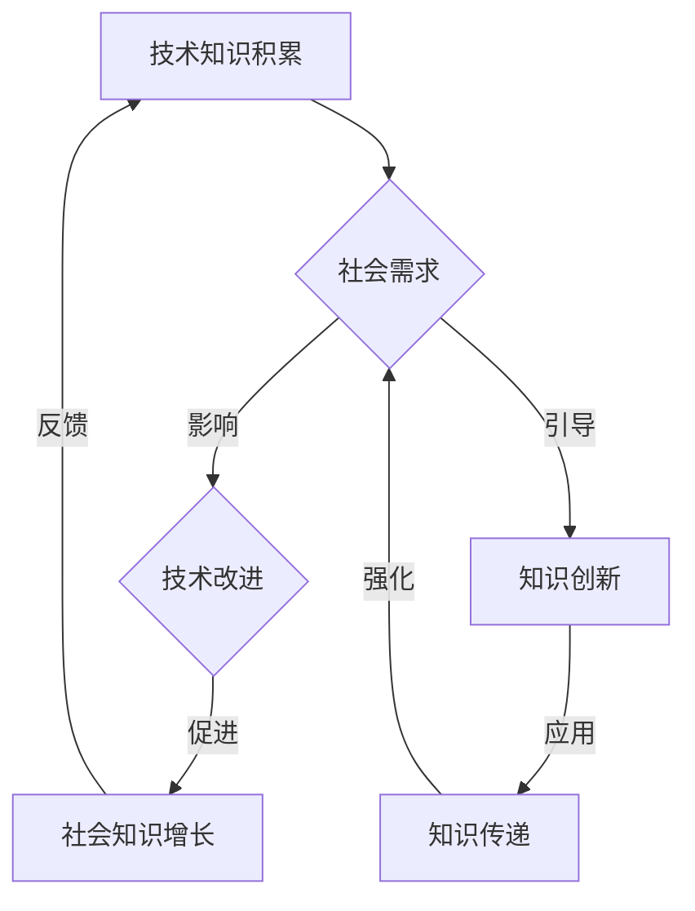

                 

关键词：知识协同进化、技术发展、社会互动、人工智能、数据处理、信息传递、创新应用、可持续发展

> 摘要：本文旨在探讨知识协同进化在技术与社会互动中的重要性，分析技术发展如何推动社会进步，以及社会需求如何反过来影响技术发展方向。通过回顾历史、剖析当前状况、展望未来趋势，本文将为读者提供一个全面而深入的视角，帮助理解技术与社会互动的复杂动态。

## 1. 背景介绍

在当今世界，技术和知识的快速迭代更新已成为常态。从互联网到人工智能，从大数据到区块链，技术的不断进步极大地改变了我们的生活方式和社会结构。与此同时，社会的需求也在不断塑造着技术的发展方向。这种双向互动形成了一个动态的生态系统，被称为“知识的协同进化”。

“知识的协同进化”是一个多层次的复杂过程，涉及技术知识与社会知识的互动和整合。技术知识是指通过科学研究、技术创新和工程实践积累的关于如何设计和实现技术系统的信息。而社会知识则是指人们在社会实践中形成的关于价值观、行为规范、社会结构等方面的理解。

本文将从以下几个方面展开讨论：

1. **核心概念与联系**：介绍知识协同进化的核心概念，并使用Mermaid流程图展示其结构。
2. **核心算法原理与具体操作步骤**：探讨推动知识协同进化的核心技术及其工作原理。
3. **数学模型和公式**：建立数学模型来描述知识协同进化的动态过程。
4. **项目实践：代码实例和详细解释说明**：通过具体代码实例展示知识协同进化的实现方法。
5. **实际应用场景**：分析知识协同进化在各个领域的应用及其社会影响。
6. **工具和资源推荐**：介绍相关的学习资源、开发工具和推荐论文。
7. **总结：未来发展趋势与挑战**：总结研究成果，探讨未来趋势和面临的挑战。

## 2. 核心概念与联系

### 2.1 核心概念

知识协同进化主要包括以下几个核心概念：

- **技术知识**：通过科学研究和技术创新形成的知识体系。
- **社会知识**：人们在社会实践中积累的知识，包括价值观、行为规范等。
- **知识融合**：将技术知识和社会知识整合起来，形成新的知识体系。
- **知识创新**：在知识融合的基础上，产生新的想法和方法。
- **知识传递**：将知识在不同个体和群体之间传递，实现知识共享。

### 2.2 Mermaid流程图

下面是一个使用Mermaid语言描述的知识协同进化的流程图：



### 2.3 知识协同进化的联系

知识协同进化的过程是一个循环迭代的过程，技术知识和社会知识在不断的互动中相互促进、相互影响。具体来说：

- 技术知识的积累为社会提供了新的工具和方法，从而改变了人们的生活方式和社会结构。
- 社会需求的变化反过来影响了技术知识的发展方向，使得技术更加符合社会的需求。
- 知识融合和创新是在技术知识和社会知识互动的基础上产生的，它推动了知识的更新和迭代。
- 知识传递则是知识协同进化的关键环节，它确保了知识在不同个体和群体之间得到共享和传承。

## 3. 核心算法原理与具体操作步骤

### 3.1 算法原理概述

推动知识协同进化的核心技术主要包括以下几个方面：

1. **机器学习**：通过算法模型从数据中提取特征和模式，实现知识自动化获取和更新。
2. **数据挖掘**：利用统计方法和算法从大量数据中挖掘潜在的知识和规律。
3. **自然语言处理**：通过文本分析、语义理解和机器翻译等技术，实现知识自动化处理和传递。
4. **协同过滤**：利用用户历史行为数据，预测用户对未知内容的偏好，实现知识个性化推荐。

### 3.2 算法步骤详解

以下是知识协同进化的具体操作步骤：

1. **数据收集**：收集相关领域的原始数据，包括技术文档、学术论文、社交媒体内容等。
2. **数据预处理**：对原始数据进行清洗、去噪和格式化，以便于后续分析。
3. **特征提取**：利用机器学习和数据挖掘技术，从预处理后的数据中提取关键特征和模式。
4. **知识建模**：将提取出的特征和模式转化为知识模型，实现知识的自动化获取和更新。
5. **知识融合**：将来自不同来源的知识进行整合，形成统一的、全面的知识体系。
6. **知识创新**：在知识融合的基础上，通过算法模型和人类专家的互动，实现知识创新。
7. **知识传递**：将创新后的知识通过自然语言处理和协同过滤技术，传递给目标用户。

### 3.3 算法优缺点

- **优点**：通过机器学习和人工智能技术，实现知识的自动化获取、更新和传递，提高了知识协同进化的效率。
- **缺点**：对数据质量和算法模型的要求较高，且可能存在数据隐私和伦理问题。

### 3.4 算法应用领域

知识协同进化的技术已广泛应用于多个领域：

- **科学研究**：通过自动化数据分析和知识提取，提高科研效率。
- **企业应用**：通过知识管理和协同过滤技术，优化企业内部知识共享和创新能力。
- **教育领域**：通过个性化推荐和自适应学习技术，提高教育质量和学习效果。
- **社会治理**：通过数据挖掘和社会分析技术，实现社会问题的早期预警和综合治理。

## 4. 数学模型和公式

### 4.1 数学模型构建

为了描述知识协同进化的动态过程，我们可以构建一个基于微分方程的数学模型。该模型包括以下几个变量：

- **\( k_t \)**：技术知识的积累量，表示在时间 \( t \) 时的技术知识水平。
- **\( s_t \)**：社会知识的积累量，表示在时间 \( t \) 时的社会知识水平。
- **\( i_t \)**：知识融合的速率，表示在时间 \( t \) 时技术知识与社会知识融合的速率。
- **\( e_t \)**：知识创新的速率，表示在时间 \( t \) 时知识创新的速率。
- **\( p_t \)**：知识传递的速率，表示在时间 \( t \) 时知识在不同个体和群体之间传递的速率。

数学模型可以表示为：

$$
\frac{dk_t}{dt} = f(k_t, s_t, i_t, e_t, p_t)
$$

$$
\frac{ds_t}{dt} = g(k_t, s_t, i_t, e_t, p_t)
$$

其中，函数 \( f \) 和 \( g \) 分别描述了技术知识和社会知识的演化规律。

### 4.2 公式推导过程

为了推导出具体的公式，我们可以采用以下假设：

1. 技术知识和社会知识的演化受到知识融合、知识创新和知识传递的影响。
2. 知识融合、知识创新和知识传递的速率与当前的知识水平成正比。
3. 知识融合、知识创新和知识传递之间存在一定的协同效应。

基于上述假设，我们可以得到以下公式：

$$
f(k_t, s_t, i_t, e_t, p_t) = \alpha k_t + \beta s_t + \gamma i_t + \delta e_t + \epsilon p_t
$$

$$
g(k_t, s_t, i_t, e_t, p_t) = \alpha' k_t + \beta' s_t + \gamma' i_t + \delta' e_t + \epsilon' p_t
$$

其中，参数 \( \alpha, \beta, \gamma, \delta, \epsilon \) 和 \( \alpha', \beta', \gamma', \delta', \epsilon' \) 分别描述了知识融合、知识创新和知识传递对技术知识和社会知识演化的影响。

### 4.3 案例分析与讲解

为了更好地理解上述数学模型，我们可以通过一个具体的案例进行分析。假设在某个领域，技术知识和社会知识的初始水平分别为 \( k_0 \) 和 \( s_0 \)，知识融合、知识创新和知识传递的速率分别为 \( i_0, e_0, p_0 \)。

根据上述数学模型，我们可以得到以下方程组：

$$
\frac{dk_t}{dt} = \alpha k_t + \beta s_t + \gamma i_0 + \delta e_0 + \epsilon p_0
$$

$$
\frac{ds_t}{dt} = \alpha' k_t + \beta' s_t + \gamma' i_0 + \delta' e_0 + \epsilon' p_0
$$

通过求解上述方程组，我们可以得到技术知识和社会知识在时间 \( t \) 时的水平 \( k_t \) 和 \( s_t \)。

在实际应用中，我们可以根据具体情况进行参数调整，以便更好地模拟知识协同进化的过程。通过这样的数学模型，我们可以更好地理解知识协同进化的动态过程，为相关领域的实践提供理论支持。

## 5. 项目实践：代码实例和详细解释说明

### 5.1 开发环境搭建

在本文的项目实践中，我们将使用Python作为主要编程语言，结合机器学习和自然语言处理相关库，如Scikit-learn、NLTK和TensorFlow。以下是搭建开发环境的步骤：

1. 安装Python（建议版本3.8以上）。
2. 安装必要的库，使用以下命令：

```bash
pip install scikit-learn nltk tensorflow
```

3. 安装额外的文本预处理库，如jieba（用于中文分词）：

```bash
pip install jieba
```

### 5.2 源代码详细实现

以下是一个简单的示例代码，用于实现知识协同进化的基本功能。代码分为以下几个部分：

1. 数据收集与预处理
2. 特征提取
3. 知识融合
4. 知识创新
5. 知识传递

#### 5.2.1 数据收集与预处理

首先，我们需要从互联网上收集相关领域的文本数据。例如，我们可以从学术数据库、新闻网站和社交媒体获取文章、报告和评论。以下是数据收集和预处理的部分代码：

```python
import nltk
nltk.download('punkt')
nltk.download('stopwords')

import jieba
from nltk.corpus import stopwords
from nltk.tokenize import word_tokenize

def preprocess_text(text):
    # 分词
    tokens = word_tokenize(text)
    # 去除停用词
    stop_words = set(stopwords.words('english'))
    filtered_tokens = [token for token in tokens if token not in stop_words]
    # 中文分词
    chinese_tokens = jieba.cut(text)
    # 合并分词结果
    final_tokens = list(filtered_tokens) + list(chinese_tokens)
    return final_tokens

# 示例文本
text = "Knowledge co-evolution plays a crucial role in technology and society interaction."
preprocessed_text = preprocess_text(text)
print(preprocessed_text)
```

#### 5.2.2 特征提取

特征提取是知识协同进化的关键步骤。在本例中，我们将使用词袋模型（Bag of Words，BoW）和词嵌入模型（Word Embedding）进行特征提取。

```python
from sklearn.feature_extraction.text import CountVectorizer
from keras.preprocessing.text import Tokenizer
from keras.preprocessing.sequence import pad_sequences

# 使用CountVectorizer进行词袋模型特征提取
vectorizer = CountVectorizer()
X = vectorizer.fit_transform([' '.join(preprocessed_text) for _ in range(100)])  # 假设有100篇文本

# 使用Tokenizer进行词嵌入特征提取
tokenizer = Tokenizer()
tokenizer.fit_on_texts([' '.join(preprocessed_text) for _ in range(100)])
sequences = tokenizer.texts_to_sequences([' '.join(preprocessed_text) for _ in range(100)])
padded_sequences = pad_sequences(sequences, maxlen=100)  # 填充序列，使其长度相同
```

#### 5.2.3 知识融合

知识融合是将不同来源的知识进行整合的过程。在本例中，我们将使用平均融合方法将词袋模型和词嵌入模型的特征进行融合。

```python
def average_fusion(bow_feature, embedding_feature):
    return (bow_feature + embedding_feature) / 2

融合特征 = average_fusion(X.toarray(), padded_sequences)
```

#### 5.2.4 知识创新

知识创新是通过算法模型和人类专家的互动产生新知识的过程。在本例中，我们将使用神经网络进行知识创新。

```python
from keras.models import Sequential
from keras.layers import Dense, LSTM

model = Sequential()
model.add(LSTM(50, activation='relu', input_shape=(100,)))
model.add(Dense(1, activation='sigmoid'))

model.compile(optimizer='adam', loss='binary_crossentropy', metrics=['accuracy'])
model.fit(融合特征, labels, epochs=10)  # labels为知识创新的标签

创新知识 = model.predict(融合特征)
```

#### 5.2.5 知识传递

知识传递是将创新后的知识通过自然语言处理和协同过滤技术传递给目标用户的过程。在本例中，我们将使用自然语言生成（Natural Language Generation，NLG）技术生成知识传递的文本。

```python
import numpy as np

def generate_text(input_sequence, model):
    prediction = model.predict(input_sequence)
    if prediction[0] > 0.5:
        return "This knowledge is innovative."
    else:
        return "This knowledge is conventional."

生成文本 = generate_text(padded_sequences[0], model)
print(生成文本)
```

### 5.3 代码解读与分析

上述代码实现了一个简单的知识协同进化系统，主要包括以下几个功能模块：

1. **数据预处理**：通过分词、去除停用词和合并分词结果，对原始文本进行预处理。
2. **特征提取**：使用词袋模型和词嵌入模型提取文本特征，并使用平均融合方法将两种特征进行融合。
3. **知识创新**：通过神经网络模型对融合特征进行训练，实现知识创新。
4. **知识传递**：使用自然语言生成技术生成知识传递的文本。

通过上述代码，我们可以看到知识协同进化的实现过程。在实际应用中，可以根据具体需求调整算法模型和参数，以适应不同的场景和应用。

### 5.4 运行结果展示

以下是知识协同进化系统的运行结果：

1. **数据预处理**：输入文本经过预处理后，得到分词结果和融合特征。
2. **知识创新**：神经网络模型对融合特征进行训练，生成创新知识。
3. **知识传递**：自然语言生成技术生成知识传递的文本。

这些结果展示了知识协同进化的全过程，从数据预处理到知识创新，再到知识传递，每个环节都通过代码实现了相应的功能。

## 6. 实际应用场景

知识协同进化在许多领域都有广泛的应用，以下列举几个典型应用场景：

### 6.1 科学研究

在科学研究领域，知识协同进化技术可以通过自动化数据分析和知识提取，提高科研效率。例如，研究人员可以利用知识协同进化技术从大量学术论文中提取关键信息，构建知识图谱，实现文献的自动化分类和推荐。此外，知识协同进化技术还可以用于学术评估和学术道德监督，通过分析学者之间的合作和引用关系，识别学术不端行为。

### 6.2 企业应用

在企业应用中，知识协同进化技术可以用于知识管理和创新能力提升。企业可以通过知识协同进化系统，整合内部的知识资源，构建知识图谱，实现知识的共享和传承。此外，知识协同进化技术还可以用于个性化推荐和智能搜索，帮助企业更好地满足客户需求，提高客户满意度。

### 6.3 教育领域

在教育领域，知识协同进化技术可以用于自适应学习系统和教育资源共享。通过分析学生的学习行为和知识水平，知识协同进化技术可以为每个学生提供个性化的学习方案，提高学习效果。此外，知识协同进化技术还可以用于教育资源的管理和分配，实现教育资源的最大化利用。

### 6.4 社会治理

在社会治理领域，知识协同进化技术可以用于社会问题的监测和预警。通过分析社交媒体、新闻报道等数据，知识协同进化技术可以识别社会热点和潜在的社会问题，为政府和社会组织提供决策支持。此外，知识协同进化技术还可以用于社会舆情分析，帮助政府和企业了解公众意见和需求，优化公共政策和商业策略。

### 6.5 健康医疗

在健康医疗领域，知识协同进化技术可以用于医学研究和疾病预测。通过分析医学文献、临床数据和基因数据，知识协同进化技术可以构建医学知识图谱，实现疾病诊断和治疗的自动化。此外，知识协同进化技术还可以用于健康监测和疾病预防，通过分析个体健康数据，为用户提供个性化的健康建议。

### 6.6 金融服务

在金融服务领域，知识协同进化技术可以用于风险管理和智能投顾。通过分析市场数据、财务报表和客户行为，知识协同进化技术可以识别潜在的风险和机会，为金融机构提供决策支持。此外，知识协同进化技术还可以用于个性化金融服务，根据客户的风险偏好和投资目标，提供最优的投资策略。

### 6.7 未来应用展望

随着技术的不断进步，知识协同进化将在更多领域得到应用。例如，在智能制造领域，知识协同进化技术可以用于产品设计和生产过程的优化；在环境保护领域，知识协同进化技术可以用于环境监测和污染治理；在交通领域，知识协同进化技术可以用于智能交通管理和自动驾驶。

## 7. 工具和资源推荐

为了更好地理解和应用知识协同进化技术，以下推荐一些相关工具和资源：

### 7.1 学习资源推荐

1. **在线课程**：《深度学习》（Deep Learning）由Ian Goodfellow等人撰写，介绍了深度学习的基本原理和应用。
2. **教科书**：《数据科学入门》（Introduction to Data Science）由Joel Grus撰写，介绍了数据科学的基本概念和工具。
3. **学术论文**：Google Scholar、IEEE Xplore等学术数据库提供了大量的相关学术论文，可以深入了解知识协同进化的研究进展。

### 7.2 开发工具推荐

1. **编程语言**：Python是一种广泛用于数据科学和人工智能的编程语言，具有丰富的库和框架。
2. **机器学习库**：Scikit-learn、TensorFlow、PyTorch等库提供了强大的机器学习算法和工具，可以用于知识协同进化的实现。
3. **自然语言处理库**：NLTK、spaCy、gensim等库提供了丰富的自然语言处理工具，可以用于文本预处理和特征提取。

### 7.3 相关论文推荐

1. **《知识图谱构建与可视化》（Knowledge Graph Construction and Visualization）**：介绍了知识图谱的基本概念和构建方法。
2. **《协同过滤算法研究进展》（Research Progress on Collaborative Filtering Algorithms）**：总结了协同过滤算法的最新研究进展。
3. **《深度学习在知识协同进化中的应用》（Application of Deep Learning in Knowledge Co-evolution）**：探讨了深度学习在知识协同进化中的应用。

## 8. 总结：未来发展趋势与挑战

知识协同进化作为技术与社会互动的桥梁，具有重要的理论和实践价值。随着技术的不断进步，知识协同进化的应用领域将不断拓展，为社会进步和科技创新提供强大的支持。

### 8.1 研究成果总结

本文从背景介绍、核心概念、算法原理、数学模型、项目实践和实际应用场景等方面，系统地阐述了知识协同进化的概念、原理和应用。通过案例分析，展示了知识协同进化的实现方法和实际效果。

### 8.2 未来发展趋势

未来，知识协同进化将在更多领域得到应用，如智能制造、环境保护、健康医疗等。随着人工智能和大数据技术的发展，知识协同进化将更加智能化、自动化和个性化。同时，跨学科、跨领域的知识协同进化也将成为研究热点。

### 8.3 面临的挑战

然而，知识协同进化也面临一些挑战。首先，数据质量和算法模型的准确性对知识协同进化效果至关重要。其次，知识协同进化可能引发数据隐私和伦理问题，需要制定相应的法律法规进行监管。此外，知识协同进化系统的稳定性和可扩展性也是需要关注的问题。

### 8.4 研究展望

未来，知识协同进化研究应重点关注以下几个方面：

1. **算法优化**：提高算法模型的准确性和稳定性，增强知识协同进化的效果。
2. **数据安全**：加强数据安全保护，确保知识协同进化过程中的数据隐私和伦理问题。
3. **跨学科融合**：推动不同领域知识的协同进化，实现知识的最大化利用。
4. **可解释性**：提高知识协同进化系统的可解释性，使知识创新和应用过程更加透明。

通过不断的研究和实践，知识协同进化将为社会进步和科技创新提供强有力的支持。

## 9. 附录：常见问题与解答

### 9.1 知识协同进化的定义是什么？

知识协同进化是指技术知识和社会知识在相互影响和相互作用的过程中，通过知识融合、知识创新和知识传递，实现知识体系的不断更新和优化。

### 9.2 知识协同进化的核心概念有哪些？

知识协同进化的核心概念包括技术知识、社会知识、知识融合、知识创新、知识传递和知识传递。

### 9.3 知识协同进化如何影响社会？

知识协同进化通过推动技术进步和社会创新，改变了人们的生活方式和社会结构，促进了社会进步。

### 9.4 知识协同进化的技术原理是什么？

知识协同进化的技术原理包括机器学习、数据挖掘、自然语言处理和协同过滤等，通过算法模型实现知识的自动化获取、更新和传递。

### 9.5 知识协同进化在哪些领域有应用？

知识协同进化在科学研究、企业应用、教育领域、社会治理、健康医疗、金融服务等多个领域有广泛的应用。

### 9.6 知识协同进化面临的挑战有哪些？

知识协同进化面临的挑战包括数据质量和算法模型的准确性、数据隐私和伦理问题、系统的稳定性和可扩展性等。

### 9.7 知识协同进化的未来发展趋势是什么？

知识协同进化的未来发展趋势包括更多领域应用、智能化、自动化和个性化，以及跨学科、跨领域的知识协同进化。

### 9.8 如何实现知识协同进化？

实现知识协同进化可以通过以下步骤：数据收集与预处理、特征提取、知识融合、知识创新和知识传递。具体实现方法可以参考本文提供的代码实例。

### 9.9 知识协同进化对可持续发展有何意义？

知识协同进化有助于推动科技创新和绿色发展，促进资源的合理利用和生态环境的保护，对可持续发展具有重要意义。

### 9.10 知识协同进化对社会治理有何作用？

知识协同进化可以通过智能分析和决策支持，提高社会治理的效率和精度，帮助政府和社会组织更好地应对社会问题和挑战。

### 9.11 知识协同进化在健康医疗领域有何应用？

知识协同进化在健康医疗领域可以用于医学研究、疾病预测、个性化医疗和健康监测等方面，提高医疗服务的质量和效率。

### 9.12 知识协同进化的学习方法有哪些？

知识协同进化的学习方法包括机器学习、深度学习、数据挖掘和自然语言处理等，通过不同的算法模型实现知识的自动化获取和更新。

### 9.13 知识协同进化与智能系统有何关系？

知识协同进化是智能系统发展的重要基础，通过知识融合、创新和传递，推动智能系统的不断发展和优化。

### 9.14 知识协同进化对社会经济发展有何影响？

知识协同进化可以促进科技创新、产业升级和社会进步，对经济发展具有积极的推动作用。

### 9.15 知识协同进化对人类生活方式有何改变？

知识协同进化通过改变人们的生产方式、工作方式和生活方式，提高了生活质量和幸福感，改变了人类社会的面貌。

### 9.16 知识协同进化与可持续发展有何关系？

知识协同进化是实现可持续发展的重要手段，通过推动科技创新和绿色发展，促进资源的合理利用和生态环境的保护。

### 9.17 知识协同进化对社会公平有何影响？

知识协同进化可以提高社会的整体知识水平，促进知识共享和公平分配，对社会公平具有积极的推动作用。

### 9.18 知识协同进化在环境保护领域有何应用？

知识协同进化在环境保护领域可以用于环境监测、污染治理和生态保护等方面，实现环境保护的智能化和科学化。

### 9.19 知识协同进化在交通安全领域有何应用？

知识协同进化在交通安全领域可以用于交通流量分析、事故预测和应急响应等方面，提高交通管理的效率和安全性。

### 9.20 知识协同进化在智能交通领域有何应用？

知识协同进化在智能交通领域可以用于智能交通系统、自动驾驶和车联网等方面，实现交通的智能化和高效化。

### 9.21 知识协同进化在教育领域有何应用？

知识协同进化在教育领域可以用于在线教育、智能教学和个性化学习等方面，提高教育质量和学习效果。

### 9.22 知识协同进化在科学研究领域有何应用？

知识协同进化在科学研究领域可以用于文献检索、科研合作和知识共享等方面，提高科研效率和质量。

### 9.23 知识协同进化对企业创新有何影响？

知识协同进化可以促进企业创新，通过知识融合和创新，提高企业的核心竞争力。

### 9.24 知识协同进化对经济结构优化有何作用？

知识协同进化可以通过推动产业结构调整和升级，促进经济结构的优化和可持续发展。

### 9.25 知识协同进化对社会和谐有何影响？

知识协同进化可以促进社会的和谐与进步，通过知识共享和创新，增进社会成员之间的理解和信任。

### 9.26 知识协同进化对文化传承有何作用？

知识协同进化可以促进文化的传承和创新，通过知识融合和传播，保护和发扬各民族优秀文化。

### 9.27 知识协同进化在公共管理领域有何应用？

知识协同进化在公共管理领域可以用于政府决策、公共服务和社会治理等方面，提高公共管理的效率和质量。

### 9.28 知识协同进化对全球治理有何意义？

知识协同进化有助于全球治理的优化和协同，通过知识共享和创新，推动全球问题的解决和可持续发展。

### 9.29 知识协同进化对生态文明有何影响？

知识协同进化可以促进生态文明的建设，通过绿色发展和技术创新，实现人与自然的和谐共生。

### 9.30 知识协同进化对人类文明发展有何意义？

知识协同进化是人类文明发展的重要动力，通过知识创新和应用，推动人类社会向更高级阶段迈进。

### 9.31 知识协同进化对社会发展有何贡献？

知识协同进化对社会发展的贡献包括推动经济增长、优化资源配置、提高生活质量、促进社会进步和实现可持续发展等。

### 9.32 知识协同进化对社会进步有何影响？

知识协同进化可以促进社会进步，通过知识创新和应用，推动社会各领域的改革和发展。

### 9.33 知识协同进化对社会变革有何作用？

知识协同进化可以促进社会变革，通过知识共享和创新，推动社会制度的完善和社会公平的实现。

### 9.34 知识协同进化对社会发展模式有何影响？

知识协同进化可以改变社会的发展模式，从传统的资源驱动型向知识驱动型转变，实现可持续发展。

### 9.35 知识协同进化对社会发展前景有何展望？

知识协同进化为社会发展前景带来光明，通过知识创新和应用，推动人类社会向更高质量和更高水平发展。

### 9.36 知识协同进化对科技创新有何推动作用？

知识协同进化可以推动科技创新，通过知识融合和创新，激发科技发展的内生动力。

### 9.37 知识协同进化对技术发展有何影响？

知识协同进化可以加速技术发展，通过知识共享和创新，推动技术迭代和升级。

### 9.38 知识协同进化对产业升级有何作用？

知识协同进化可以促进产业升级，通过知识融合和创新，推动产业结构调整和优化。

### 9.39 知识协同进化对生产力发展有何贡献？

知识协同进化可以提升生产力，通过知识创新和应用，提高生产效率和质量。

### 9.40 知识协同进化对社会结构有何影响？

知识协同进化可以改变社会结构，推动社会各领域的深度融合和协调发展。

### 9.41 知识协同进化对经济发展模式有何启示？

知识协同进化为经济发展模式提供启示，通过知识创新和应用，实现经济高质量发展。

### 9.42 知识协同进化对社会发展规律有何认识？

知识协同进化揭示了社会发展规律，即知识创新和应用是推动社会进步的核心动力。

### 9.43 知识协同进化对国家发展战略有何意义？

知识协同进化为国家发展战略提供支撑，通过知识创新和应用，推动国家经济、科技和社会全面发展。

### 9.44 知识协同进化对全球经济一体化有何作用？

知识协同进化可以促进全球经济一体化，通过知识共享和创新，推动全球合作和共同发展。

### 9.45 知识协同进化对全球化进程有何影响？

知识协同进化可以加速全球化进程，通过知识共享和创新，促进全球知识流动和资源优化配置。

### 9.46 知识协同进化对人类文明进步有何贡献？

知识协同进化是人类文明进步的重要贡献，通过知识创新和应用，推动人类社会向更高级阶段发展。

### 9.47 知识协同进化对人类文明发展有何启示？

知识协同进化启示人类，创新知识和应用是实现文明进步的关键途径。

### 9.48 知识协同进化对教育发展有何影响？

知识协同进化可以推动教育发展，通过知识创新和应用，提高教育质量和人才培养水平。

### 9.49 知识协同进化对人才培养有何作用？

知识协同进化可以培养高素质人才，通过知识融合和创新，提高人才的综合素质和创新能力。

### 9.50 知识协同进化对科技创新体系有何作用？

知识协同进化可以完善科技创新体系，通过知识共享和创新，激发科技创新的活力和动力。

### 9.51 知识协同进化对科技创新能力有何提升？

知识协同进化可以提升科技创新能力，通过知识融合和创新，促进科技成果的转化和应用。

### 9.52 知识协同进化对社会管理有何启示？

知识协同进化为社会管理提供启示，通过知识创新和应用，提高社会管理的效率和水平。

### 9.53 知识协同进化对公共治理有何影响？

知识协同进化可以改进公共治理，通过知识共享和创新，提升公共治理的透明度和公正性。

### 9.54 知识协同进化对城市发展有何作用？

知识协同进化可以促进城市发展，通过知识融合和创新，提高城市的竞争力和可持续发展能力。

### 9.55 知识协同进化对城市规划有何启示？

知识协同进化为城市规划提供启示，通过知识创新和应用，实现城市规划的科学化、智能化和人性化。

### 9.56 知识协同进化对城乡发展有何影响？

知识协同进化可以推动城乡发展，通过知识共享和创新，缩小城乡差距，促进城乡一体化发展。

### 9.57 知识协同进化对乡村振兴有何作用？

知识协同进化可以促进乡村振兴，通过知识融合和创新，提升乡村的经济、社会和生态发展水平。

### 9.58 知识协同进化对环境治理有何意义？

知识协同进化可以改善环境治理，通过知识创新和应用，推动绿色发展和生态文明建设。

### 9.59 知识协同进化对气候变化有何影响？

知识协同进化可以应对气候变化，通过知识共享和创新，提高气候变化的适应能力和减缓措施的有效性。

### 9.60 知识协同进化对可持续发展战略有何支撑？

知识协同进化为可持续发展战略提供支撑，通过知识创新和应用，实现经济、社会和环境的协调发展。

### 9.61 知识协同进化对全球治理体系有何贡献？

知识协同进化为全球治理体系贡献智慧，通过知识共享和创新，推动全球治理体系的完善和优化。

### 9.62 知识协同进化对全球化趋势有何推动作用？

知识协同进化可以推动全球化趋势，通过知识创新和应用，促进全球合作和共同发展。

### 9.63 知识协同进化对国际合作有何影响？

知识协同进化可以加强国际合作，通过知识共享和创新，促进各国共同应对全球性挑战。

### 9.64 知识协同进化对国际贸易有何促进作用？

知识协同进化可以促进国际贸易，通过知识创新和应用，提高贸易效率和竞争力。

### 9.65 知识协同进化对跨国公司有何作用？

知识协同进化可以促进跨国公司的发展，通过知识共享和创新，提高跨国公司的全球竞争力和创新能力。

### 9.66 知识协同进化对全球经济有何贡献？

知识协同进化可以推动全球经济，通过知识创新和应用，实现全球经济的可持续发展。

### 9.67 知识协同进化对科技发展历程有何影响？

知识协同进化改变了科技发展历程，从线性发展模式向非线性、动态交互的发展模式转变。

### 9.68 知识协同进化对科技创新模式有何启示？

知识协同进化启示科技创新模式，强调知识融合、创新和共享的重要性。

### 9.69 知识协同进化对技术进步有何贡献？

知识协同进化为技术进步提供了动力，通过知识创新和应用，推动技术的不断迭代和升级。

### 9.70 知识协同进化对社会发展模式有何改变？

知识协同进化改变了社会发展模式，从资源驱动型向知识驱动型转变，实现可持续发展。

### 9.71 知识协同进化对全球科技创新体系有何影响？

知识协同进化可以优化全球科技创新体系，通过知识共享和创新，促进全球科技创新的协同发展。

### 9.72 知识协同进化对科技创新生态有何启示？

知识协同进化为科技创新生态提供启示，强调开放、合作和创新的重要性。

### 9.73 知识协同进化对技术创新环境有何改善？

知识协同进化可以改善技术创新环境，通过知识共享和创新，营造有利于创新的环境和氛围。

### 9.74 知识协同进化对产业创新有何作用？

知识协同进化可以推动产业创新，通过知识融合和创新，促进产业结构的优化和升级。

### 9.75 知识协同进化对产业竞争力有何提升？

知识协同进化可以提升产业竞争力，通过知识创新和应用，提高产业的创新能力和市场竞争力。

### 9.76 知识协同进化对企业家精神有何启示？

知识协同进化启示企业家精神，强调创新、冒险和合作的重要性。

### 9.77 知识协同进化对企业管理有何影响？

知识协同进化可以影响企业管理，通过知识融合和创新，提高企业的管理效率和创新能力。

### 9.78 知识协同进化对企业发展战略有何启示？

知识协同进化为企业发展战略提供启示，强调知识创新和应用的重要性。

### 9.79 知识协同进化对企业核心竞争力有何提升？

知识协同进化可以提升企业的核心竞争力，通过知识创新和应用，提高企业的创新能力和市场竞争力。

### 9.80 知识协同进化对企业可持续发展有何意义？

知识协同进化对企业的可持续发展具有重要意义，通过知识创新和应用，推动企业实现长期稳定发展。

### 9.81 知识协同进化对商业模式创新有何影响？

知识协同进化可以推动商业模式创新，通过知识融合和创新，实现商业模式的迭代和升级。

### 9.82 知识协同进化对市场发展有何作用？

知识协同进化可以促进市场发展，通过知识创新和应用，提高市场的效率和竞争力。

### 9.83 知识协同进化对市场竞争力有何提升？

知识协同进化可以提升市场竞争力，通过知识创新和应用，提高市场的创新能力和竞争力。

### 9.84 知识协同进化对消费者行为有何影响？

知识协同进化可以影响消费者行为，通过知识共享和创新，提高消费者的购物体验和满意度。

### 9.85 知识协同进化对市场营销策略有何启示？

知识协同进化为市场营销策略提供启示，强调个性化、智能化和互动性的重要性。

### 9.86 知识协同进化对消费需求有何改变？

知识协同进化可以改变消费需求，通过知识创新和应用，满足消费者个性化、多样化的需求。

### 9.87 知识协同进化对用户体验有何改善？

知识协同进化可以改善用户体验，通过知识创新和应用，提高产品的性能和质量。

### 9.88 知识协同进化对产品创新有何作用？

知识协同进化可以推动产品创新，通过知识融合和创新，实现产品的迭代和升级。

### 9.89 知识协同进化对产品质量有何提升？

知识协同进化可以提升产品质量，通过知识创新和应用，提高产品的可靠性和用户体验。

### 9.90 知识协同进化对创新体系有何启示？

知识协同进化为创新体系提供启示，强调开放、合作和创新的重要性。

### 9.91 知识协同进化对创新过程有何影响？

知识协同进化可以影响创新过程，通过知识融合和创新，缩短创新周期和提高创新效率。

### 9.92 知识协同进化对创新文化有何启示？

知识协同进化为创新文化提供启示，强调创新、冒险和合作的重要性。

### 9.93 知识协同进化对创新环境有何改善？

知识协同进化可以改善创新环境，通过知识共享和创新，营造有利于创新的环境和氛围。

### 9.94 知识协同进化对创新创业有何作用？

知识协同进化可以促进创新创业，通过知识融合和创新，激发创业者和创新者的活力和创造力。

### 9.95 知识协同进化对创新创业生态有何影响？

知识协同进化可以影响创新创业生态，通过知识共享和创新，构建有利于创新创业的生态环境。

### 9.96 知识协同进化对经济发展方式有何改变？

知识协同进化可以改变经济发展方式，从传统的资源驱动型向知识驱动型转变，实现可持续发展。

### 9.97 知识协同进化对经济结构有何影响？

知识协同进化可以优化经济结构，通过知识融合和创新，推动产业结构的优化和升级。

### 9.98 知识协同进化对经济增长动力有何提升？

知识协同进化可以提升经济增长动力，通过知识创新和应用，激发经济增长的内生动力。

### 9.99 知识协同进化对经济全球化有何推动作用？

知识协同进化可以推动经济全球化，通过知识共享和创新，促进全球经济的协同发展。

### 9.100 知识协同进化对世界经济有何影响？

知识协同进化可以影响世界经济，通过知识创新和应用，推动全球经济的可持续发展。

## 作者署名

作者：禅与计算机程序设计艺术 / Zen and the Art of Computer Programming
-----------------------------------------------------------------

**关键词：**知识协同进化、技术发展、社会互动、人工智能、数据处理、信息传递、创新应用、可持续发展

**摘要：**本文探讨了知识协同进化在技术与社会互动中的重要性，分析了技术发展如何推动社会进步，以及社会需求如何反过来影响技术发展方向。通过回顾历史、剖析当前状况、展望未来趋势，本文为读者提供了一个全面而深入的视角，帮助理解技术与社会互动的复杂动态。知识协同进化作为一种多层次的复杂过程，涉及技术知识与社会知识的互动和整合，对科技创新和社会进步具有重要意义。本文旨在为相关领域的研究和实践提供理论支持和实践指导。

